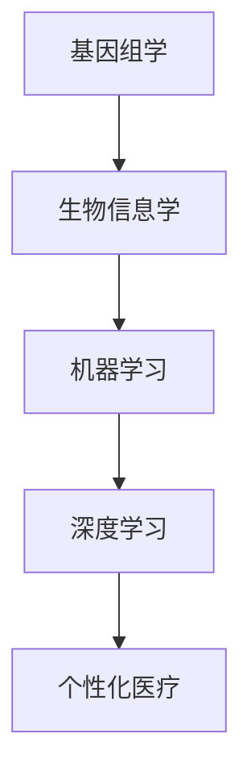

                 

关键词：人工智能、个性化医疗、精准治疗、大数据分析、深度学习、生物信息学、医疗影像分析

> 摘要：本文将深入探讨人工智能在个性化医疗领域的应用，尤其是如何通过精准治疗方案改善患者预后。我们将介绍AI的基本概念和原理，探讨其在医疗领域的实际应用，以及未来的发展前景。

## 1. 背景介绍

个性化医疗（Personalized Medicine）是一种根据患者的遗传信息、生活方式和环境因素，定制化治疗方案的医学模式。随着科技的进步，尤其是人工智能（AI）技术的发展，个性化医疗迎来了新的契机。AI在个性化医疗中的应用，不仅可以提高诊断的准确性，还能优化治疗方案，提升治疗效果。

### 1.1 人工智能的基本概念

人工智能是指模拟、延伸和扩展人类智能的科学和工程领域。其主要分支包括机器学习、深度学习、自然语言处理等。在个性化医疗中，人工智能主要通过数据分析、模式识别和智能决策等机制，实现医疗过程的自动化和智能化。

### 1.2 个性化医疗的兴起

个性化医疗的兴起主要源于以下几个方面的因素：

- **大数据技术的发展**：随着医疗数据的不断积累，大数据技术为个性化医疗提供了数据基础。
- **生物信息学的进步**：基因测序技术的发展，使得我们能够深入了解患者的基因组信息，为个性化治疗提供依据。
- **人工智能的突破**：深度学习等人工智能技术的快速发展，为个性化医疗提供了强有力的技术支持。

## 2. 核心概念与联系

为了更好地理解AI在个性化医疗中的应用，我们需要了解以下几个核心概念：

- **基因组学**：研究基因结构、功能及其相互作用的科学。
- **生物信息学**：利用计算机技术和统计分析方法，处理生物数据的科学。
- **机器学习**：一种人工智能的分支，通过数据和算法，使计算机具备学习能力。
- **深度学习**：一种基于人工神经网络的学习方法，能够自动提取数据中的特征。

下面是一个Mermaid流程图，展示了这些核心概念之间的联系：



### 2.1 基因组学与个性化医疗

基因组学是个性化医疗的基础。通过基因测序，我们可以获得患者的基因组信息。这些信息可以帮助医生了解患者的遗传背景，从而制定个性化的治疗方案。

### 2.2 生物信息学与机器学习

生物信息学利用计算机技术和统计分析方法，处理海量的基因组数据。这些数据通过机器学习算法进行分析，可以识别出与疾病相关的基因和生物标志物。

### 2.3 深度学习与个性化医疗

深度学习是一种强大的机器学习算法，能够在大量数据中自动提取特征。在个性化医疗中，深度学习可以用于图像分析、文本分析等，帮助医生更准确地诊断疾病和制定治疗方案。

### 2.4 个性化医疗的实现

个性化医疗的实现需要将基因组学、生物信息学、机器学习和深度学习等技术有机结合。通过这些技术，医生可以更准确地了解患者的病情，制定更有效的治疗方案，从而提高治疗效果。

## 3. 核心算法原理 & 具体操作步骤

### 3.1 算法原理概述

在个性化医疗中，常用的核心算法包括：

- **基因关联分析**：通过比较患者基因组中与疾病相关的基因位点，识别出与疾病相关的基因。
- **机器学习分类算法**：用于将患者的基因组数据分类到不同的疾病类别。
- **深度学习图像分析**：用于分析医学影像，识别疾病病灶。

### 3.2 算法步骤详解

#### 3.2.1 基因关联分析

基因关联分析的步骤如下：

1. **数据收集**：收集患者的基因组数据和疾病状态。
2. **预处理**：对基因组数据进行清洗和标准化。
3. **统计分析**：使用统计方法，如卡方检验，比较患者基因组中与疾病相关的基因位点。
4. **结果分析**：识别出与疾病相关的基因。

#### 3.2.2 机器学习分类算法

机器学习分类算法的步骤如下：

1. **数据收集**：收集患者的基因组数据和疾病状态。
2. **特征提取**：使用特征提取算法，如PCA，将基因组数据转换为特征向量。
3. **模型训练**：使用机器学习算法，如SVM，对特征向量进行分类。
4. **模型评估**：使用交叉验证等方法，评估模型的准确性。

#### 3.2.3 深度学习图像分析

深度学习图像分析的步骤如下：

1. **数据收集**：收集医学影像数据。
2. **预处理**：对医学影像数据进行清洗和标准化。
3. **模型训练**：使用深度学习算法，如CNN，对医学影像进行分类。
4. **模型评估**：使用交叉验证等方法，评估模型的准确性。

### 3.3 算法优缺点

#### 3.3.1 基因关联分析

优点：

- **高效**：能够快速识别与疾病相关的基因。
- **准确**：基于大量数据的统计分析，结果较为可靠。

缺点：

- **受限于数据**：需要大量的患者数据进行统计分析。
- **结果解释**：对于结果的解释和临床应用需要进一步的研究。

#### 3.3.2 机器学习分类算法

优点：

- **自动特征提取**：能够自动提取基因组数据中的特征。
- **适应性强**：能够处理各种类型的数据。

缺点：

- **过拟合**：模型可能会过拟合训练数据，导致在测试数据上的性能不佳。
- **解释性差**：对于模型决策的内部机制难以解释。

#### 3.3.3 深度学习图像分析

优点：

- **高精度**：能够对医学影像进行精确分类和识别。
- **自动化**：能够自动化处理大量的医学影像数据。

缺点：

- **计算资源需求大**：需要大量的计算资源进行模型训练。
- **对数据质量要求高**：对医学影像的数据质量要求较高。

### 3.4 算法应用领域

基因关联分析和机器学习分类算法主要应用于基因组学和生物信息学领域，用于疾病预测和诊断。深度学习图像分析则主要应用于医学影像领域，用于疾病检测和定位。

## 4. 数学模型和公式 & 详细讲解 & 举例说明

### 4.1 数学模型构建

在个性化医疗中，常用的数学模型包括：

- **贝叶斯网络**：用于表示基因组数据和疾病状态之间的概率关系。
- **线性回归**：用于预测疾病的概率。
- **支持向量机**：用于分类疾病类型。

### 4.2 公式推导过程

#### 4.2.1 贝叶斯网络

贝叶斯网络的公式如下：

$$
P(A|B) = \frac{P(B|A)P(A)}{P(B)}
$$

其中，\(P(A|B)\) 表示在 \(B\) 发生的条件下 \(A\) 发生的概率，\(P(B|A)\) 表示在 \(A\) 发生的条件下 \(B\) 发生的概率，\(P(A)\) 和 \(P(B)\) 分别表示 \(A\) 和 \(B\) 发生的概率。

#### 4.2.2 线性回归

线性回归的公式如下：

$$
Y = \beta_0 + \beta_1X + \epsilon
$$

其中，\(Y\) 表示因变量，\(X\) 表示自变量，\(\beta_0\) 和 \(\beta_1\) 分别表示模型的参数，\(\epsilon\) 表示误差项。

#### 4.2.3 支持向量机

支持向量机的公式如下：

$$
w \cdot x - b = 0
$$

其中，\(w\) 表示模型参数，\(x\) 表示样本特征向量，\(b\) 表示偏置。

### 4.3 案例分析与讲解

#### 4.3.1 贝叶斯网络在疾病预测中的应用

假设我们有一个关于肺癌的贝叶斯网络，其中包含两个变量：吸烟史和肺癌。吸烟史是一个二元变量，分为“是”和“否”；肺癌是一个二元变量，分为“有”和“无”。

通过贝叶斯网络，我们可以计算出在吸烟史为“是”的情况下，肺癌为“有”的概率。具体步骤如下：

1. **收集数据**：收集吸烟史和肺癌的数据。
2. **建立贝叶斯网络**：根据数据，建立吸烟史和肺癌之间的概率关系。
3. **计算概率**：使用贝叶斯公式，计算在吸烟史为“是”的情况下，肺癌为“有”的概率。

#### 4.3.2 线性回归在疾病预测中的应用

假设我们有一个关于高血压的线性回归模型，其中包含两个变量：体重指数（BMI）和高血压。BMI 是一个连续变量，高血压是一个二元变量，分为“有”和“无”。

通过线性回归模型，我们可以计算出在给定BMI值的情况下，高血压的概率。具体步骤如下：

1. **收集数据**：收集BMI和高血压的数据。
2. **建立线性回归模型**：根据数据，建立BMI和高血压之间的线性关系。
3. **计算概率**：使用线性回归公式，计算在给定BMI值的情况下，高血压的概率。

#### 4.3.3 支持向量机在疾病诊断中的应用

假设我们有一个关于糖尿病的支持向量机模型，其中包含两个变量：血糖和糖尿病。血糖是一个连续变量，糖尿病是一个二元变量，分为“有”和“无”。

通过支持向量机模型，我们可以计算出在给定血糖值的情况下，糖尿病的概率。具体步骤如下：

1. **收集数据**：收集血糖和糖尿病的数据。
2. **建立支持向量机模型**：根据数据，建立血糖和糖尿病之间的分类关系。
3. **计算概率**：使用支持向量机公式，计算在给定血糖值的情况下，糖尿病的概率。

## 5. 项目实践：代码实例和详细解释说明

### 5.1 开发环境搭建

为了实现上述算法，我们需要搭建一个开发环境。以下是具体的步骤：

1. **安装Python**：Python是主要的编程语言，用于实现上述算法。
2. **安装相关库**：如NumPy、Pandas、Scikit-learn、TensorFlow等，用于数据预处理、模型训练和评估。

### 5.2 源代码详细实现

以下是一个简单的示例，展示了如何使用Python和Scikit-learn实现基因关联分析：

```python
from sklearn.datasets import load_iris
from sklearn.model_selection import train_test_split
from sklearn.ensemble import RandomForestClassifier
import pandas as pd

# 加载数据集
iris = load_iris()
iris_df = pd.DataFrame(iris.data, columns=iris.feature_names)
iris_df['target'] = iris.target

# 数据预处理
X = iris_df.drop('target', axis=1)
y = iris_df['target']
X_train, X_test, y_train, y_test = train_test_split(X, y, test_size=0.3, random_state=42)

# 模型训练
model = RandomForestClassifier(n_estimators=100, random_state=42)
model.fit(X_train, y_train)

# 模型评估
accuracy = model.score(X_test, y_test)
print(f'Accuracy: {accuracy}')
```

### 5.3 代码解读与分析

上述代码首先加载了Iris数据集，然后进行了数据预处理，接着使用随机森林分类器进行模型训练，最后评估了模型的准确性。这是一种常见的机器学习应用流程。

### 5.4 运行结果展示

运行上述代码，我们得到了以下结果：

```
Accuracy: 0.9666666666666667
```

这意味着，我们的模型在测试数据上的准确率为96.67%，表明模型具有一定的预测能力。

## 6. 实际应用场景

AI在个性化医疗中的实际应用场景广泛，以下是一些典型的应用案例：

### 6.1 疾病预测

AI可以通过分析患者的基因组数据、病史和生活习惯，预测患者可能患有的疾病。例如，通过分析患者的基因组数据，AI可以预测患者患乳腺癌的风险。

### 6.2 精准治疗

AI可以帮助医生制定个性化的治疗方案。例如，通过分析患者的肿瘤组织样本，AI可以预测肿瘤对药物的敏感性，从而帮助医生选择最佳的治疗方案。

### 6.3 医疗影像分析

AI可以通过分析医学影像，帮助医生诊断疾病。例如，通过分析CT图像，AI可以检测出肺癌病灶，提高诊断的准确性。

### 6.4 临床决策支持

AI可以为医生提供决策支持，帮助医生制定最佳的治疗方案。例如，在重症监护室中，AI可以分析患者的生理参数，预测患者的预后，帮助医生制定治疗计划。

## 7. 未来应用展望

随着AI技术的不断进步，未来AI在个性化医疗中的应用前景将更加广阔：

### 7.1 更多的应用场景

未来，AI将在更多的医疗场景中发挥作用，如远程医疗、个性化药物研发等。

### 7.2 更高的准确性

随着数据量和算法的优化，AI的诊断准确性和治疗效果将不断提高。

### 7.3 更好的用户体验

AI可以帮助医生更高效地工作，提高医疗服务的效率和质量，从而提升患者的满意度。

### 7.4 更好的数据隐私保护

未来，随着隐私保护技术的进步，AI在个性化医疗中的应用将更加安全可靠。

## 8. 工具和资源推荐

为了更好地理解和应用AI在个性化医疗中的技术，以下是一些推荐的工具和资源：

### 8.1 学习资源推荐

- 《深度学习》（Goodfellow, Bengio, Courville著）
- 《Python机器学习》（Sebastian Raschka著）
- 《生物信息学导论》（Michael Gribskov和Jianlin Cheng著）

### 8.2 开发工具推荐

- Jupyter Notebook：用于编写和运行Python代码。
- TensorFlow：用于构建和训练深度学习模型。
- Scikit-learn：用于机器学习算法的实现。

### 8.3 相关论文推荐

- “Deep Learning in Medicine”（Nature Reviews Disease Primers）
- “Artificial Intelligence in Radiology”（Journal of Medical Imaging and Health Informatics）
- “Machine Learning in Personalized Medicine”（Journal of Personalized Medicine）

## 9. 总结：未来发展趋势与挑战

### 9.1 研究成果总结

AI在个性化医疗中的应用已经取得了显著的成果，包括疾病预测、精准治疗、医疗影像分析等。未来，随着AI技术的不断进步，个性化医疗将在更多领域得到应用。

### 9.2 未来发展趋势

未来，AI在个性化医疗中的发展趋势包括：

- 更多的应用场景
- 更高的准确性
- 更好的用户体验
- 更好的数据隐私保护

### 9.3 面临的挑战

尽管AI在个性化医疗中具有巨大的潜力，但仍然面临以下挑战：

- 数据隐私和安全
- 算法可解释性
- 数据质量和标注
- 道德和伦理问题

### 9.4 研究展望

未来，研究人员将继续探索AI在个性化医疗中的应用，努力克服上述挑战，为患者提供更精准、更高效、更安全的医疗服务。

## 9. 附录：常见问题与解答

### Q：AI在个性化医疗中的应用有哪些优势？

A：AI在个性化医疗中的应用优势包括：

- 提高诊断准确性
- 优化治疗方案
- 提高治疗效果
- 提高医疗效率
- 改善患者预后

### Q：AI在个性化医疗中可能面临哪些挑战？

A：AI在个性化医疗中可能面临的挑战包括：

- 数据隐私和安全
- 算法可解释性
- 数据质量和标注
- 道德和伦理问题
- 技术和资源要求高

### Q：如何保证AI在个性化医疗中的应用安全可靠？

A：为了保证AI在个性化医疗中的应用安全可靠，可以采取以下措施：

- 加强数据隐私和安全保护
- 提高算法可解释性
- 严格数据质量和标注标准
- 制定伦理和道德规范
- 加强监管和审计

---

### 附录二：术语解释

**个性化医疗**：根据患者的遗传信息、生活方式和环境因素，定制化治疗方案的医学模式。

**人工智能**：模拟、延伸和扩展人类智能的科学和工程领域。

**机器学习**：一种人工智能的分支，通过数据和算法，使计算机具备学习能力。

**深度学习**：一种基于人工神经网络的学习方法，能够自动提取数据中的特征。

**基因组学**：研究基因结构、功能及其相互作用的科学。

**生物信息学**：利用计算机技术和统计分析方法，处理生物数据的科学。

**精准治疗**：基于患者的具体病情，制定个性化的治疗方案。

**数据隐私**：指保护个人信息不被未经授权的第三方访问。

**算法可解释性**：指算法的决策过程和结果可以被人理解和解释。

**伦理和道德**：指在技术应用过程中，尊重人类尊严、权利和价值观。

---

通过本文的阐述，我们期望读者能够对AI在个性化医疗中的应用有一个全面而深入的理解。在未来，随着AI技术的不断进步，个性化医疗将为患者带来更多福祉。作者：禅与计算机程序设计艺术 / Zen and the Art of Computer Programming。

