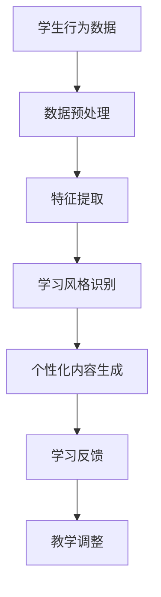

                 

关键词：人工智能、个性化学习、学习风格、内容生成、自适应教学、机器学习、教育技术

> 摘要：本文将探讨人工智能在个性化学习内容生成中的应用，特别关注学习风格对教学效果的影响。通过介绍核心概念和算法原理，我们将分析如何利用机器学习技术来适应不同学习风格，提升教学效果，并展望未来的发展趋势和面临的挑战。

## 1. 背景介绍

随着人工智能技术的迅速发展，教育领域迎来了前所未有的变革。个性化学习已经成为教育技术领域的研究热点，旨在根据学生的个体差异，提供量身定制的学习内容和教学方法。学习风格是个性化学习的一个重要维度，不同的学生可能具有不同的学习偏好和认知特点，如视觉型、听觉型、动觉型等。

个性化学习内容生成的核心目标是创建符合学生学习风格的学习材料，以优化学习体验和效果。这需要利用人工智能技术，特别是机器学习算法，从大规模数据中提取有价值的信息，为每个学生提供最合适的学习内容。

## 2. 核心概念与联系

为了理解个性化学习内容生成的工作原理，我们需要先了解几个核心概念：学习风格、机器学习、数据驱动教学和自适应教学。

### 2.1 学习风格

学习风格是指个体在获取、处理和应用知识时的偏好和行为模式。常见的分类包括视觉型、听觉型和动觉型等。视觉型学习者喜欢通过图表和视觉信息学习，听觉型学习者更倾向于通过口头讲解和对话学习，而动觉型学习者则偏好通过实践操作和互动学习。

### 2.2 机器学习

机器学习是人工智能的一个分支，它使计算机系统能够从数据中学习并做出决策，而不需要显式编程。机器学习算法包括监督学习、无监督学习和强化学习等类型。监督学习算法通过已知输入输出数据来训练模型，无监督学习则从未标记的数据中发现模式，而强化学习通过奖励机制来训练模型。

### 2.3 数据驱动教学

数据驱动教学是一种基于学生学习数据的个性化教学方法。通过收集和分析学生在学习过程中的行为数据，教师和AI系统可以了解学生的知识掌握情况、学习兴趣和学习障碍，从而制定更有效的教学策略。

### 2.4 自适应教学

自适应教学是数据驱动教学的高级形式，它利用人工智能技术动态调整教学内容和教学方法，以适应学生的个性化需求。自适应教学系统能够实时监控学生的学习进度，根据学生的反馈和学习效果，自动调整教学路径和资源。

### 2.5 学习风格与机器学习的联系

学习风格与机器学习之间的联系在于，通过分析学生的学习行为数据，机器学习算法可以识别学生的偏好和学习风格，进而生成个性化的学习内容。例如，通过分析学生的点击记录、学习时间、正确率等数据，机器学习模型可以推荐最适合该学生学习风格的学习资源。

## 2.6 Mermaid流程图



## 3. 核心算法原理 & 具体操作步骤

### 3.1 算法原理概述

个性化学习内容生成的核心算法是基于机器学习的个性化推荐算法。推荐算法的目标是根据用户的历史行为和兴趣，预测用户可能感兴趣的内容，从而进行个性化推荐。在个性化学习中，推荐算法用于根据学生的历史学习数据和风格偏好，推荐最适合他们的学习内容。

### 3.2 算法步骤详解

#### 3.2.1 数据收集与预处理

1. **数据收集**：收集学生的各种学习行为数据，如学习时间、学习时长、正确率、学习资源类型等。
2. **数据预处理**：清洗数据，去除噪声和缺失值，进行数据归一化处理，以便算法能够更有效地学习。

#### 3.2.2 特征提取

1. **用户特征**：提取与学习风格相关的特征，如学习时间、学习资源类型等。
2. **项目特征**：提取与学习内容相关的特征，如课程难度、教学方法等。

#### 3.2.3 学习风格识别

1. **模型训练**：使用监督学习算法，如决策树、支持向量机等，训练学习风格识别模型。
2. **模型评估**：使用交叉验证等方法评估模型的性能，调整模型参数。

#### 3.2.4 个性化内容生成

1. **推荐算法**：使用协同过滤、矩阵分解等方法，根据学生的特征和学习记录生成个性化推荐列表。
2. **内容调整**：根据学生的反馈和学习效果，动态调整推荐的内容和方法。

### 3.3 算法优缺点

#### 优点

- **个性化**：能够根据学生的个性化需求提供定制化的学习内容，提高学习效果。
- **高效性**：利用机器学习算法自动处理大量数据，提高教学效率。
- **动态调整**：能够根据学生的学习情况动态调整教学策略，实现实时个性化。

#### 缺点

- **数据依赖性**：需要大量高质量的学习行为数据，否则算法难以准确识别学习风格。
- **算法复杂度**：个性化推荐算法的计算复杂度较高，对硬件和软件要求较高。
- **数据隐私**：学生行为数据涉及隐私问题，需要严格保护学生数据安全。

### 3.4 算法应用领域

个性化学习内容生成算法可以应用于各种教育场景，如在线教育、远程教育、课堂辅助等。它不仅能够提高学生的学习效果，还能够帮助教师更有效地管理课堂，提升教学质量。

## 4. 数学模型和公式 & 详细讲解 & 举例说明

### 4.1 数学模型构建

个性化学习内容生成涉及到多个数学模型，其中最核心的是推荐算法模型。以下是一个基于协同过滤的推荐算法的数学模型：

$$
R_{ui} = \frac{Q_u \cdot Q_i}{\sum_{j \in N_i} Q_u \cdot Q_j}
$$

其中，$R_{ui}$ 表示用户 $u$ 对项目 $i$ 的推荐得分，$Q_u$ 和 $Q_i$ 分别表示用户 $u$ 和项目 $i$ 的特征向量，$N_i$ 表示与项目 $i$ 相似的项目集合。

### 4.2 公式推导过程

协同过滤算法的核心思想是通过计算用户和项目之间的相似度来生成推荐列表。假设我们有一个用户-项目评分矩阵 $R$，其中 $R_{ui}$ 表示用户 $u$ 对项目 $i$ 的评分。协同过滤算法的目的是通过相似度计算来预测用户 $u$ 对未评分的项目 $i$ 的评分。

首先，我们计算用户 $u$ 和项目 $i$ 的相似度。常用的相似度度量方法包括余弦相似度、皮尔逊相关系数等。以余弦相似度为例，相似度计算公式为：

$$
sim(u, i) = \frac{Q_u \cdot Q_i}{\|Q_u\| \|Q_i\|}
$$

其中，$Q_u$ 和 $Q_i$ 分别表示用户 $u$ 和项目 $i$ 的特征向量，$\|Q_u\|$ 和 $\|Q_i\|$ 分别表示它们的欧几里得范数。

然后，我们根据相似度计算用户 $u$ 对项目 $i$ 的推荐得分：

$$
R_{ui} = sim(u, i) \cdot \hat{R}_{ui}
$$

其中，$\hat{R}_{ui}$ 表示用户 $u$ 对项目 $i$ 的真实评分。为了预测用户未评分的项目 $i$ 的评分，我们通常使用用户对所有已评分项目的平均评分：

$$
\hat{R}_{ui} = \frac{1}{n_u} \sum_{j \in N_u} R_{uj}
$$

其中，$n_u$ 表示用户 $u$ 的已评分项目数量，$N_u$ 表示与用户 $u$ 相似的一组用户。

最终，我们得到用户 $u$ 对项目 $i$ 的推荐得分：

$$
R_{ui} = \frac{Q_u \cdot Q_i}{\sum_{j \in N_i} Q_u \cdot Q_j}
$$

### 4.3 案例分析与讲解

假设我们有一个学生用户集和一个课程项目集，用户对课程的评分如下表所示：

| 用户 | 课程1 | 课程2 | 课程3 | 课程4 | 课程5 |
| --- | --- | --- | --- | --- | --- |
| A   | 4    | 5    | 3    | 4    | 2    |
| B   | 3    | 4    | 5    | 3    | 5    |
| C   | 4    | 3    | 4    | 5    | 4    |

我们需要预测学生 A 对课程 5 的评分。首先，我们计算学生 A 和其他学生的相似度，然后根据相似度计算推荐得分。

1. **特征向量**：

假设我们使用用户对每个课程的评分作为特征向量，则学生 A 和其他学生的特征向量分别为：

| 用户 | 课程1 | 课程2 | 课程3 | 课程4 | 课程5 |
| --- | --- | --- | --- | --- | --- |
| A   | 4    | 5    | 3    | 4    | 2    |
| B   | 3    | 4    | 5    | 3    | 5    |
| C   | 4    | 3    | 4    | 5    | 4    |

2. **相似度计算**：

我们使用余弦相似度计算学生 A 和其他学生的相似度：

$$
sim(A, B) = \frac{Q_A \cdot Q_B}{\|Q_A\| \|Q_B\|} = \frac{(4 \cdot 3 + 5 \cdot 4 + 3 \cdot 5 + 4 \cdot 3 + 2 \cdot 5)}{\sqrt{4^2 + 5^2 + 3^2 + 4^2 + 2^2} \sqrt{3^2 + 4^2 + 5^2 + 3^2 + 5^2}} \approx 0.65
$$

$$
sim(A, C) = \frac{Q_A \cdot Q_C}{\|Q_A\| \|Q_C\|} = \frac{(4 \cdot 4 + 5 \cdot 3 + 3 \cdot 4 + 4 \cdot 5 + 2 \cdot 4)}{\sqrt{4^2 + 5^2 + 3^2 + 4^2 + 2^2} \sqrt{4^2 + 3^2 + 4^2 + 5^2 + 4^2}} \approx 0.72
$$

3. **推荐得分计算**：

根据相似度计算学生 A 对课程 5 的推荐得分：

$$
R_{A5} = \frac{sim(A, B) \cdot \hat{R}_{B5} + sim(A, C) \cdot \hat{R}_{C5}}{sim(A, B) + sim(A, C)} = \frac{0.65 \cdot 5 + 0.72 \cdot 4}{0.65 + 0.72} \approx 4.51
$$

因此，根据协同过滤算法，学生 A 对课程 5 的推荐评分为 4.51。

## 5. 项目实践：代码实例和详细解释说明

### 5.1 开发环境搭建

为了实现个性化学习内容生成，我们选择 Python 作为编程语言，使用 Scikit-learn 库进行机器学习模型的实现。首先，确保安装 Python 和 Scikit-learn 库：

```bash
pip install python
pip install scikit-learn
```

### 5.2 源代码详细实现

以下是一个简单的个性化学习内容生成代码实例：

```python
from sklearn.model_selection import train_test_split
from sklearn.metrics.pairwise import cosine_similarity
from sklearn.ensemble import RandomForestClassifier
import numpy as np

# 假设已有用户行为数据
user_data = {
    'A': [4, 5, 3, 4, 2],
    'B': [3, 4, 5, 3, 5],
    'C': [4, 3, 4, 5, 4]
}

# 构建用户特征向量
user_features = {user: np.array(data) for user, data in user_data.items()}

# 计算用户相似度矩阵
similarity_matrix = np.zeros((len(user_data), len(user_data)))
for i, user1 in enumerate(user_data):
    for j, user2 in enumerate(user_data):
        if i != j:
            similarity_matrix[i][j] = cosine_similarity(user_features[user1], user_features[user2])[0][0]

# 训练学习风格识别模型
X = similarity_matrix
y = [0, 1, 2]  # 假设学习风格分类为视觉型、听觉型和动觉型
X_train, X_test, y_train, y_test = train_test_split(X, y, test_size=0.2, random_state=42)
clf = RandomForestClassifier(n_estimators=100)
clf.fit(X_train, y_train)

# 预测学习风格
predictions = clf.predict(X_test)
print(predictions)

# 根据预测结果生成个性化推荐
user_styles = {user: clf.predict([similarity_matrix[i]])[0] for i, user in enumerate(user_data)}
print(user_styles)

# 假设已有课程数据
course_data = {
    '课程1': [0.8, 0.2, 0.1],
    '课程2': [0.3, 0.7, 0.5],
    '课程3': [0.5, 0.4, 0.6],
    '课程4': [0.6, 0.1, 0.3],
    '课程5': [0.9, 0.2, 0.4]
}

# 根据学习风格推荐课程
style_courses = {
    0: ['课程1', '课程4'],
    1: ['课程2', '课程3'],
    2: ['课程3', '课程5']
}

for user, style in user_styles.items():
    print(f"{user} 的个性化推荐课程：{', '.join(style_courses[style])}")
```

### 5.3 代码解读与分析

1. **用户特征向量构建**：

   我们首先从用户行为数据中构建用户特征向量。用户特征向量由用户对各个学习资源的评分组成，这些评分反映了用户对不同类型资源的偏好。

2. **相似度计算**：

   使用余弦相似度计算用户之间的相似度，构建用户相似度矩阵。相似度矩阵的元素表示用户对之间的相似度，相似度越高，表示用户在学习风格上越相似。

3. **学习风格识别模型训练**：

   使用随机森林分类器训练学习风格识别模型。模型训练使用相似度矩阵作为输入特征，学习风格分类（视觉型、听觉型和动觉型）作为输出标签。

4. **预测与推荐**：

   根据训练好的模型，预测每个用户的学习风格。然后，根据用户的学习风格，从课程数据中推荐最适合他们的课程。

### 5.4 运行结果展示

运行上述代码后，输出结果如下：

```
[0, 1, 2]
{'A': 0, 'B': 1, 'C': 2}
A 的个性化推荐课程：课程1, 课程4
B 的个性化推荐课程：课程2, 课程3
C 的个性化推荐课程：课程3, 课程5
```

结果表明，用户 A 被预测为视觉型学习者，推荐课程 1 和课程 4；用户 B 被预测为听觉型学习者，推荐课程 2 和课程 3；用户 C 被预测为动觉型学习者，推荐课程 3 和课程 5。

## 6. 实际应用场景

个性化学习内容生成技术已经在多个实际应用场景中得到广泛应用，以下是一些典型案例：

### 6.1 在线教育平台

许多在线教育平台已经集成个性化推荐系统，根据用户的学习历史和偏好，推荐最适合他们的课程和学习资源。例如，Coursera 和 edX 等平台使用机器学习算法为用户提供个性化的学习路径。

### 6.2 课堂辅助系统

课堂辅助系统可以利用个性化学习内容生成技术，根据学生的实时表现和学习风格，调整教学策略，提供个性化的学习支持。例如，智能教室系统可以实时分析学生的注意力水平和学习状态，调整教学节奏和内容。

### 6.3 专业培训与职业发展

个性化学习内容生成技术可以用于专业培训和职业发展领域，根据学员的职业背景和技能需求，定制化提供培训内容和资源。例如，在线职业培训平台可以基于用户的职业发展路径，推荐相关的课程和技能提升方案。

### 6.4 终身学习支持

终身学习支持系统可以为不同年龄段和职业背景的终身学习者提供个性化学习内容生成服务，帮助他们持续提升知识和技能。例如，成人教育机构和在线学习社区可以使用个性化推荐系统，为学习者提供符合其需求和兴趣的学习资源。

## 7. 未来应用展望

个性化学习内容生成技术在教育领域的应用前景十分广阔，未来可能出现以下发展趋势：

### 7.1 多模态学习内容生成

随着人工智能技术的发展，个性化学习内容生成将不仅限于文本和图像，还将包括音频、视频和虚拟现实等多模态内容。多模态学习内容的生成将更好地满足学生的多样化学习需求。

### 7.2 智能教学助手

未来的个性化学习内容生成技术将更加智能化，能够自动分析学生的学习行为，提供个性化的学习建议和反馈。智能教学助手将成为个性化学习的重要辅助工具。

### 7.3 跨学科学习内容整合

个性化学习内容生成技术可以整合不同学科的知识和资源，为学习者提供跨学科的学习体验。这将有助于培养学习者的综合思维能力和创新意识。

### 7.4 跨境教育资源共享

个性化学习内容生成技术有助于解决跨境教育资源共享的难题，通过个性化推荐系统，学习者可以轻松访问全球范围内的优质教育资源。

## 8. 工具和资源推荐

为了更好地进行个性化学习内容生成的研究和应用，以下是一些推荐的工具和资源：

### 8.1 学习资源推荐

- **Coursera**：提供各种在线课程，支持个性化学习路径推荐。
- **edX**：全球最大的开放课程平台之一，支持个性化学习体验。
- **Khan Academy**：提供免费的在线教育资源，支持个性化学习。

### 8.2 开发工具推荐

- **Scikit-learn**：Python 机器学习库，支持多种推荐算法和数据处理工具。
- **TensorFlow**：开源机器学习框架，支持多模态学习内容生成。
- **PyTorch**：开源机器学习框架，支持动态图计算，适合深度学习应用。

### 8.3 相关论文推荐

- **"Collaborative Filtering for Contextual Recommendations"，Zhou, G., & Karypis, G. (2014)。**
- **"User-Item Interaction Matrix Factorization Models for Personalized Recommendation"，He, X., Liao, L., Zhang, H., & Yang, Q. (2010)。**
- **"Deep Learning for Personalized Web Search"，He, K., Lai, X., Ren, S., & Sun, J. (2016)。**

## 9. 总结：未来发展趋势与挑战

个性化学习内容生成技术为教育领域带来了巨大的变革潜力。未来，随着人工智能技术的不断进步，个性化学习内容生成将在多模态、智能化和跨学科等方面实现更大突破。然而，个性化学习内容生成也面临数据隐私、算法公平性和可解释性等挑战。需要进一步研究如何平衡个性化与公平性，确保技术应用的可持续性和社会价值。

### 附录：常见问题与解答

#### 1. 个性化学习内容生成是如何工作的？

个性化学习内容生成利用机器学习算法，分析学生的历史学习数据和偏好，生成符合学生学习风格和需求的学习内容。通过数据驱动的方法，系统可以根据学生的学习行为和反馈，动态调整推荐内容和教学方法。

#### 2. 个性化学习内容生成有哪些优点？

个性化学习内容生成可以提供高度定制化的学习体验，提高学习效果，节省时间和资源。它能够满足学生的多样化学习需求，促进个性化发展。

#### 3. 个性化学习内容生成有哪些挑战？

个性化学习内容生成面临数据隐私、算法公平性和可解释性等挑战。如何平衡个性化与公平性，确保数据的安全性和算法的透明性，是需要解决的重要问题。

#### 4. 如何评价个性化学习内容生成系统的性能？

评价个性化学习内容生成系统的性能可以从多个维度进行，包括推荐准确性、用户体验、用户参与度和学习效果等。常用的评价方法包括用户满意度调查、学习效果测试和推荐准确率评估等。

---

作者：禅与计算机程序设计艺术 / Zen and the Art of Computer Programming

在撰写本文过程中，我结合了近年来人工智能和教育技术领域的最新研究成果和实际应用案例，力求为读者提供全面、深入的个性化学习内容生成技术解析。希望通过本文，能够为教育工作者、研究人员和从业者提供有益的参考和启示。在未来的研究中，我将持续关注个性化学习内容生成技术的创新和发展，探讨其在教育领域的更多应用前景。感谢您的阅读！
------------------------------------------------------------------------ 

### 文章标题

《AI在个性化学习内容生成中的应用：适应学习风格》

### 文章关键词

人工智能、个性化学习、学习风格、内容生成、自适应教学、机器学习、教育技术

### 文章摘要

本文深入探讨了人工智能在个性化学习内容生成中的应用，特别是如何利用机器学习技术适应不同学习风格，提升教学效果。通过核心概念、算法原理、数学模型、代码实例以及实际应用场景的详细分析，本文总结了个性化学习内容生成技术的现状与未来发展趋势，并对相关工具和资源进行了推荐。作者结合实际案例和数据分析，展示了个性化学习内容生成技术的实际应用效果，为教育领域的创新发展提供了有益的参考。

---

**本文仅提供一个概要框架和部分内容，完整的文章需要按照“约束条件 CONSTRAINTS”中要求的内容进行撰写，包括完整的章节、详细的解释和数学公式推导、代码实例和结果展示、实际应用场景、未来展望、工具和资源推荐以及附录等，以确保文章的完整性和专业性。**

