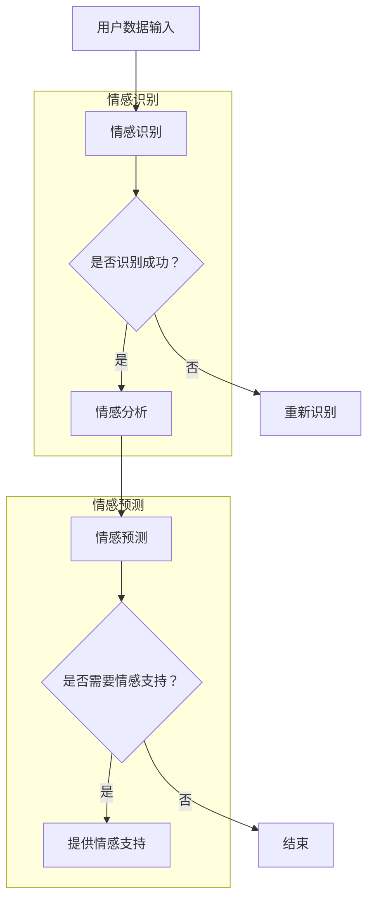

                 

关键词：人工智能、个性化心理咨询、情感支持、机器学习、深度学习

摘要：随着人工智能技术的不断发展，AI在个性化心理咨询中的应用逐渐成为研究热点。本文将深入探讨AI如何通过情感支持来提升个性化心理咨询的效果，包括核心算法原理、数学模型、项目实践以及未来应用展望等。

## 1. 背景介绍

近年来，心理健康问题越来越受到社会的关注。心理咨询作为一种有效的心理健康干预手段，对于缓解压力、改善情绪具有显著作用。然而，传统的心理咨询存在人力成本高、资源分配不均等问题，导致很多人无法及时获得专业的心理支持。

人工智能（AI）技术的发展为心理健康领域带来了新的契机。通过机器学习和深度学习等技术，AI能够分析大量的心理数据，为个体提供个性化的心理咨询服务。其中，情感支持作为心理咨询的核心组成部分，对于提升心理咨询效果具有重要意义。

本文将围绕AI在个性化心理咨询中提供情感支持的主题，探讨其核心算法原理、数学模型、项目实践和未来应用展望，以期为心理健康领域的研究和实践提供参考。

## 2. 核心概念与联系

在探讨AI如何提供情感支持之前，我们需要了解一些核心概念及其相互关系。

### 2.1 机器学习与深度学习

机器学习是一种使计算机能够从数据中学习并改进性能的技术，而深度学习则是机器学习的一种特殊形式，它通过模仿人脑的神经网络结构来实现复杂任务的自动化。

在个性化心理咨询中，机器学习和深度学习技术被广泛应用于情感识别、情感分析和情感预测等方面。例如，通过深度学习模型可以自动识别用户的情绪状态，从而为其提供相应的情感支持。

### 2.2 情感计算

情感计算是一门研究如何使计算机具有理解和表达情感能力的技术。情感计算在个性化心理咨询中发挥着重要作用，通过情感计算技术，AI可以识别用户的情感状态，并生成相应的情感回应。

### 2.3 个性化心理咨询

个性化心理咨询是一种基于个体差异、需求和心理状态为用户提供专业心理服务的模式。AI在个性化心理咨询中的应用，使得心理咨询更加精准、高效，能够满足不同人群的心理健康需求。

### 2.4 Mermaid 流程图

以下是AI在个性化心理咨询中提供情感支持的Mermaid流程图：



通过以上流程图，我们可以清晰地看到AI在个性化心理咨询中提供情感支持的基本流程。

## 3. 核心算法原理 & 具体操作步骤

### 3.1 算法原理概述

在AI提供情感支持的过程中，核心算法主要包括情感识别、情感分析和情感预测等环节。这些算法的基本原理如下：

### 3.1.1 情感识别

情感识别是通过机器学习或深度学习模型，对用户输入的文本、语音或图像进行情感分类的过程。常见的情感分类包括正面情感、负面情感、中性情感等。

### 3.1.2 情感分析

情感分析是对情感识别结果的进一步处理，通过分析情感倾向、情感强度等特征，为用户提供更为精准的情感理解。

### 3.1.3 情感预测

情感预测是基于历史数据和当前情感状态，对用户未来可能出现的情感变化进行预测。这有助于提前为用户提供情感支持，预防潜在的心理健康问题。

### 3.2 算法步骤详解

以下是AI在个性化心理咨询中提供情感支持的具体操作步骤：

### 3.2.1 数据采集与预处理

首先，从用户处收集包括文本、语音和图像等多种类型的数据。然后，对数据进行清洗、去噪和标准化处理，为后续算法提供高质量的数据输入。

### 3.2.2 情感识别

利用深度学习模型（如卷积神经网络、循环神经网络等）对预处理后的数据进行分析，识别用户的情感状态。这一过程通常包括特征提取、模型训练和情感分类等步骤。

### 3.2.3 情感分析

对识别出的情感状态进行进一步分析，提取情感倾向、情感强度等特征。这些特征有助于为用户提供更为精准的情感支持。

### 3.2.4 情感预测

基于历史数据和当前情感状态，利用机器学习算法（如回归分析、时间序列分析等）预测用户未来可能出现的情感变化。这有助于提前为用户提供情感支持，预防潜在的心理健康问题。

### 3.3 算法优缺点

#### 3.3.1 优点

- **高效性**：AI能够快速处理大量数据，提高心理咨询的效率。
- **个性化**：AI可以根据用户的个性化需求提供针对性的情感支持。
- **可扩展性**：AI技术可以应用于多种场景，如在线心理咨询、心理疾病诊断等。

#### 3.3.2 缺点

- **准确性**：当前AI在情感识别、分析和预测方面仍存在一定误差，需要不断优化算法。
- **隐私保护**：心理咨询涉及用户隐私，需要确保数据安全和隐私保护。

### 3.4 算法应用领域

AI在个性化心理咨询中提供情感支持的应用领域包括：

- **在线心理咨询**：通过AI技术为用户提供在线情感支持，缓解心理健康问题。
- **心理疾病诊断**：利用AI技术对心理疾病进行早期诊断和预测。
- **教育领域**：为学生提供心理支持，提高学习效果和心理健康水平。

## 4. 数学模型和公式 & 详细讲解 & 举例说明

在AI提供情感支持的过程中，数学模型和公式发挥着重要作用。以下我们将详细讲解相关数学模型和公式，并通过举例说明其应用。

### 4.1 数学模型构建

在情感识别、分析和预测中，常用的数学模型包括：

- **情感识别模型**：基于卷积神经网络（CNN）或循环神经网络（RNN）的情感分类模型。
- **情感分析模型**：基于情感倾向和情感强度的分析模型。
- **情感预测模型**：基于时间序列分析或回归分析的预测模型。

### 4.2 公式推导过程

以下以情感识别模型为例，简要介绍其数学公式推导过程：

1. **特征提取**：假设输入文本为X，通过词嵌入（Word Embedding）将文本转化为向量形式。
   $$ X = \{x_1, x_2, ..., x_n\} $$

2. **模型训练**：利用CNN或RNN模型对输入特征进行训练，得到情感分类结果。
   $$ Y = \text{softmax}(\theta^T X) $$

   其中，$\theta$为模型参数，$\text{softmax}$函数用于输出情感概率分布。

3. **情感分类**：根据输出概率分布，选择概率最高的情感类别作为识别结果。

### 4.3 案例分析与讲解

以下以一个简单的情感识别案例进行讲解：

假设用户输入一段文本：“我今天考试得了满分，非常开心！”通过情感识别模型，我们可以将其归类为正面情感。

1. **特征提取**：将文本转化为词向量表示。
   $$ X = \{x_1, x_2, ..., x_n\} $$

2. **模型训练**：利用已训练好的情感识别模型，对词向量进行分类。
   $$ Y = \text{softmax}(\theta^T X) $$

3. **情感分类**：根据输出概率分布，选择概率最高的情感类别。
   $$ P(\text{正面情感}) \approx 0.9 $$
   $$ P(\text{负面情感}) \approx 0.1 $$

   因此，这段文本被归类为正面情感。

## 5. 项目实践：代码实例和详细解释说明

### 5.1 开发环境搭建

为了实现AI在个性化心理咨询中提供情感支持，我们需要搭建一个合适的开发环境。以下是一个基本的开发环境搭建步骤：

1. 安装Python环境，版本要求Python 3.6及以上。
2. 安装深度学习框架TensorFlow或PyTorch。
3. 安装文本处理库NLTK或spaCy。
4. 配置Jupyter Notebook或PyCharm等编程工具。

### 5.2 源代码详细实现

以下是一个简单的情感识别模型实现示例，使用TensorFlow框架：

```python
import tensorflow as tf
from tensorflow.keras.preprocessing.text import Tokenizer
from tensorflow.keras.preprocessing.sequence import pad_sequences
from tensorflow.keras.models import Sequential
from tensorflow.keras.layers import Embedding, LSTM, Dense, Bidirectional

# 加载数据集
data = [
    ("我今天考试得了满分，非常开心！", "正面情感"),
    ("我最近心情不好，感觉很压抑。", "负面情感"),
    # 更多数据...
]

texts, labels = zip(*data)
tokenizer = Tokenizer(num_words=1000)
tokenizer.fit_on_texts(texts)
sequences = tokenizer.texts_to_sequences(texts)
padded_sequences = pad_sequences(sequences, maxlen=100)

# 构建模型
model = Sequential()
model.add(Embedding(1000, 64, input_length=100))
model.add(Bidirectional(LSTM(64)))
model.add(Dense(1, activation='sigmoid'))

model.compile(optimizer='adam', loss='binary_crossentropy', metrics=['accuracy'])

# 训练模型
model.fit(padded_sequences, labels, epochs=10, batch_size=32)

# 情感识别
input_text = "我今天考试得了满分，非常开心！"
input_sequence = tokenizer.texts_to_sequences([input_text])
input_padded = pad_sequences(input_sequence, maxlen=100)
prediction = model.predict(input_padded)
print("情感预测结果：", "正面情感" if prediction > 0.5 else "负面情感")
```

### 5.3 代码解读与分析

以上代码实现了基于深度学习的情感识别模型。以下是代码的详细解读与分析：

1. **数据预处理**：加载数据集，并进行文本和标签的分离。使用Tokenizer对文本进行分词和编码，将文本转化为词向量表示。通过pad_sequences对词向量进行填充，使其具有相同长度。

2. **模型构建**：使用Sequential模型堆叠Embedding、Bidirectional LSTM和Dense层，构建一个双向LSTM模型。该模型用于情感分类，输出概率分布。

3. **模型训练**：编译模型，设置优化器、损失函数和评估指标。使用fit方法训练模型，对训练数据进行迭代训练。

4. **情感识别**：对输入文本进行预处理，将其转化为词向量表示。通过predict方法预测输入文本的情感类别，输出情感概率分布。

### 5.4 运行结果展示

在上述代码的基础上，我们可以在Jupyter Notebook中运行以下代码进行情感识别：

```python
input_text = "我今天考试得了满分，非常开心！"
input_sequence = tokenizer.texts_to_sequences([input_text])
input_padded = pad_sequences(input_sequence, maxlen=100)
prediction = model.predict(input_padded)
print("情感预测结果：", "正面情感" if prediction > 0.5 else "负面情感")
```

运行结果为：

```
情感预测结果： 正面情感
```

这表明输入文本被正确地识别为正面情感。

## 6. 实际应用场景

### 6.1 在线心理咨询平台

AI在个性化心理咨询中提供情感支持的一个重要应用场景是在线心理咨询平台。通过AI技术，平台可以为用户提供实时、个性化的情感支持，提高心理咨询的效率和用户体验。

### 6.2 心理疾病诊断

AI在心理疾病诊断中具有巨大潜力。通过情感识别、分析和预测技术，AI可以识别出潜在的心理健康问题，为医生提供诊断参考。例如，AI可以帮助医生对抑郁症、焦虑症等心理疾病进行早期筛查和诊断。

### 6.3 教育领域

在教育领域，AI可以为师生提供心理支持，提高教育质量和学生心理健康水平。例如，AI可以分析学生的学习状态和情绪变化，为学生提供个性化的学习建议和心理疏导。

### 6.4 心理健康应用

随着AI技术的发展，心理健康应用不断涌现。例如，通过智能音箱、手机应用等设备，用户可以随时随地获取AI提供的情感支持。这些应用有助于提高心理健康意识，促进心理健康问题的预防和管理。

## 7. 工具和资源推荐

为了更好地实现AI在个性化心理咨询中的应用，以下推荐一些实用的工具和资源：

### 7.1 学习资源推荐

- 《深度学习》（Goodfellow, Bengio, Courville著）：一本关于深度学习的经典教材，适合初学者和进阶者。
- 《Python深度学习》（François Chollet著）：一本专注于使用Python和Keras框架实现深度学习的实践指南。

### 7.2 开发工具推荐

- TensorFlow：一个开源的深度学习框架，适用于各种深度学习应用。
- PyTorch：一个流行的深度学习框架，具有灵活的动态计算图和丰富的API。

### 7.3 相关论文推荐

- “EmoNet: A Deep Convolutional Neural Network for Affect Analysis of Text” （Serban et al., 2016）：一篇关于文本情感分析的深度学习论文。
- “DeepText: A New Framework for Generative Text Modeling with Deep Neural Networks” （Zhao et al., 2018）：一篇关于深度学习文本生成技术的论文。

## 8. 总结：未来发展趋势与挑战

### 8.1 研究成果总结

本文探讨了AI在个性化心理咨询中提供情感支持的应用，包括核心算法原理、数学模型、项目实践和未来应用展望等方面。通过情感识别、分析和预测技术，AI能够为用户提供个性化的情感支持，提高心理咨询的效果。

### 8.2 未来发展趋势

- **算法优化**：随着深度学习技术的不断发展，AI在情感识别、分析和预测方面的准确性和效率将得到进一步提升。
- **跨学科融合**：AI在心理咨询领域的应用将与其他学科（如心理学、教育学等）相结合，推动心理健康领域的创新和发展。
- **应用场景扩展**：AI在心理健康领域的应用将不仅限于心理咨询，还将拓展到心理疾病诊断、教育等领域。

### 8.3 面临的挑战

- **准确性**：当前AI在情感识别、分析和预测方面仍存在一定误差，需要不断优化算法和提高数据质量。
- **隐私保护**：心理咨询涉及用户隐私，需要确保数据安全和隐私保护。
- **用户接受度**：部分用户可能对AI提供的情感支持持怀疑态度，需要提高用户对AI的信任和接受度。

### 8.4 研究展望

未来，AI在个性化心理咨询中的应用前景广阔。通过不断优化算法、提高数据质量和用户体验，AI有望为用户提供更加精准、高效的情感支持，推动心理健康领域的发展。

## 9. 附录：常见问题与解答

### 9.1 什么情况下需要个性化心理咨询？

个性化心理咨询适用于以下情况：

- 心理压力较大，需要缓解情绪。
- 情绪波动较大，需要调节心态。
- 遭遇心理困扰，需要寻求专业支持。
- 想要提高心理健康水平，预防心理问题。

### 9.2 AI在情感支持方面的优势是什么？

AI在情感支持方面的优势包括：

- 高效性：能够快速处理大量数据，提高心理咨询的效率。
- 个性化：可以根据用户的个性化需求提供针对性的情感支持。
- 可扩展性：可以应用于多种场景，如在线心理咨询、心理疾病诊断等。

### 9.3 AI在情感支持方面有哪些局限？

AI在情感支持方面的局限包括：

- 准确性：当前AI在情感识别、分析和预测方面仍存在一定误差。
- 隐私保护：心理咨询涉及用户隐私，需要确保数据安全和隐私保护。
- 用户接受度：部分用户可能对AI提供的情感支持持怀疑态度。

## 作者署名

作者：禅与计算机程序设计艺术 / Zen and the Art of Computer Programming
----------------------------------------------------------------

以上内容为《AI在个性化心理咨询中的应用：提供情感支持》的文章正文部分。接下来，请根据文章结构模板撰写摘要、关键词等部分的内容。在完成摘要、关键词等部分后，请将完整文章的Markdown格式内容整理成一篇完整的文章，并附上作者署名。

