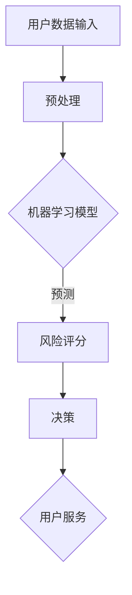

                 

关键词：人工智能、个性化金融、风险评估、机器学习、深度学习、金融科技、金融建模

> 摘要：本文将探讨人工智能在个性化金融服务中的应用，特别是其在风险评估方面的贡献。文章首先介绍了人工智能的基本概念和它在金融领域的应用，然后深入分析了机器学习和深度学习在风险评估中的具体应用，并通过实际案例展示了这些技术的实际效果。此外，文章还讨论了人工智能在金融风险管理中的未来发展趋势和面临的挑战。

## 1. 背景介绍

个性化金融服务是指根据客户的个人需求和风险承受能力，提供量身定制的金融产品和服务。随着金融科技的快速发展，人工智能在金融领域的应用越来越广泛，尤其是机器学习和深度学习技术，已经在许多金融场景中展示了其强大的能力。

风险评估是金融领域的重要环节，它涉及到对潜在风险的分析和评估，以帮助金融机构和投资者做出更明智的决策。传统风险评估方法主要依赖于统计分析和历史数据分析，但这种方法存在一定的局限性。而人工智能技术，特别是机器学习和深度学习，为风险评估提供了一种全新的视角和方法。

机器学习是一种通过数据训练模型，使其能够自主学习和改进的技术。它可以在大量数据中发现模式和规律，从而帮助金融机构预测市场趋势和评估风险。深度学习是机器学习的一种高级形式，它通过多层神经网络对复杂数据进行分析和处理，能够实现更精确的风险预测。

## 2. 核心概念与联系

为了更好地理解人工智能在风险评估中的应用，我们首先需要了解一些核心概念和它们之间的联系。

### 2.1 人工智能

人工智能（AI）是指计算机系统模拟人类智能行为的技术。它包括机器学习、深度学习、自然语言处理、计算机视觉等多个领域。在金融领域，人工智能主要用于数据分析、风险预测、自动化交易等方面。

### 2.2 机器学习

机器学习是一种通过数据训练模型，使其能够自主学习和改进的技术。它包括监督学习、无监督学习和强化学习等类型。在金融领域，机器学习主要用于风险评估、市场预测、欺诈检测等方面。

### 2.3 深度学习

深度学习是机器学习的一种高级形式，它通过多层神经网络对复杂数据进行分析和处理，能够实现更精确的风险预测。深度学习在金融领域主要用于图像识别、语音识别、文本分析等方面。

### 2.4 金融建模

金融建模是指使用数学模型来描述金融市场的行为和风险。它包括概率模型、时间序列模型、期权定价模型等。在人工智能技术中，金融建模主要用于生成预测模型和风险评估模型。

### 2.5 Mermaid 流程图

以下是人工智能在个性化金融服务中的应用的 Mermaid 流程图：



## 3. 核心算法原理 & 具体操作步骤

### 3.1 算法原理概述

人工智能在风险评估中的应用主要基于机器学习和深度学习技术。以下是一个典型的风险评估算法原理：

1. 数据收集与预处理：收集用户的金融数据，如账户信息、交易记录、信用评分等。对数据进行分析和处理，提取特征，并进行归一化处理。

2. 模型训练：使用训练集数据，通过机器学习算法训练风险评估模型。常用的算法有逻辑回归、决策树、随机森林、支持向量机等。

3. 模型评估：使用测试集数据评估模型的性能，如准确率、召回率、F1分数等。

4. 风险预测：使用训练好的模型对新的用户数据进行风险评估，预测其潜在的风险等级。

### 3.2 算法步骤详解

1. 数据收集与预处理：

   - 收集用户的金融数据，如账户信息、交易记录、信用评分等。
   - 对数据进行清洗，去除缺失值、异常值等。
   - 提取特征，如用户年龄、收入、负债等。
   - 对特征进行归一化处理，使其具有相同的量纲。

2. 模型训练：

   - 使用训练集数据，通过机器学习算法训练风险评估模型。
   - 选择合适的算法，如逻辑回归、决策树、随机森林、支持向量机等。
   - 调整算法参数，如学习率、迭代次数等。

3. 模型评估：

   - 使用测试集数据评估模型的性能。
   - 计算准确率、召回率、F1分数等指标。
   - 调整模型参数，提高性能。

4. 风险预测：

   - 使用训练好的模型对新的用户数据进行风险评估。
   - 输出风险评分，预测用户的风险等级。

### 3.3 算法优缺点

1. 优点：

   - 能够处理大量数据，提高风险评估的效率。
   - 能够发现潜在的风险因素，提供更精准的风险预测。
   - 能够自动适应市场变化，提高风险管理的灵活性。

2. 缺点：

   - 需要大量的高质量数据，数据预处理复杂。
   - 模型的解释性较差，难以理解模型的决策过程。
   - 模型的性能依赖于算法和参数的选择，需要多次调整。

### 3.4 算法应用领域

人工智能在风险评估中的应用非常广泛，主要包括以下几个方面：

1. 信用风险评估：通过对用户的信用历史、财务状况、行为特征等进行综合分析，评估用户的信用风险。

2. 投资风险评估：通过对市场数据、行业趋势、公司财务状况等进行深入分析，预测投资的风险和收益。

3. 欺诈检测：通过对交易数据、用户行为等进行监控和分析，识别和防范欺诈行为。

4. 保险风险评估：通过对被保险人的健康状况、生活习惯、家庭背景等进行综合评估，预测保险风险。

## 4. 数学模型和公式 & 详细讲解 & 举例说明

### 4.1 数学模型构建

在风险评估中，常用的数学模型包括线性回归模型、逻辑回归模型、决策树模型等。以下是一个简单的逻辑回归模型：

$$
P(Y=1) = \frac{1}{1 + e^{-(\beta_0 + \beta_1X_1 + \beta_2X_2 + \ldots + \beta_nX_n})}
$$

其中，$P(Y=1)$ 表示事件发生的概率，$Y$ 表示事件是否发生，$X_1, X_2, \ldots, X_n$ 表示特征变量，$\beta_0, \beta_1, \beta_2, \ldots, \beta_n$ 表示模型的参数。

### 4.2 公式推导过程

逻辑回归模型的推导过程如下：

1. 假设特征变量 $X_1, X_2, \ldots, X_n$ 对事件发生的概率有线性影响，即：

$$
P(Y=1) = \beta_0 + \beta_1X_1 + \beta_2X_2 + \ldots + \beta_nX_n
$$

2. 为了使模型更加稳定，我们对公式进行变换，使其形式更加规范：

$$
P(Y=1) = \frac{1}{1 + e^{-(\beta_0 + \beta_1X_1 + \beta_2X_2 + \ldots + \beta_nX_n})}
$$

3. 对模型进行最大化似然估计，求出模型参数：

$$
\beta_0, \beta_1, \beta_2, \ldots, \beta_n = \arg \max \prod_{i=1}^{n} \frac{1}{1 + e^{-(\beta_0 + \beta_1X_{i1} + \beta_2X_{i2} + \ldots + \beta_nX_{in})}}
$$

4. 通过迭代计算，求出模型参数的估计值。

### 4.3 案例分析与讲解

假设我们有一个信用风险评估问题，需要预测用户的信用评分。我们收集了以下特征变量：

- 年龄（$X_1$）：范围[18, 60]
- 收入（$X_2$）：范围[2000, 20000]
- 负债（$X_3$）：范围[0, 10000]
- 信用历史（$X_4$）：范围[0, 1000]

我们使用逻辑回归模型进行风险评估，模型参数如下：

$$
P(Y=1) = \frac{1}{1 + e^{-(2.5 + 0.1X_1 + 0.05X_2 + 0.02X_3 + 0.01X_4)}}
$$

对于一个新的用户，其特征变量为 $X_1=30, X_2=5000, X_3=2000, X_4=800$，我们可以计算出其信用评分：

$$
P(Y=1) = \frac{1}{1 + e^{-(2.5 + 0.1 \times 30 + 0.05 \times 5000 + 0.02 \times 2000 + 0.01 \times 800)}}
$$

$$
P(Y=1) \approx 0.95
$$

这意味着该用户的信用评分很高，风险较低。

## 5. 项目实践：代码实例和详细解释说明

### 5.1 开发环境搭建

为了实现人工智能在风险评估中的应用，我们需要搭建一个合适的开发环境。以下是一个简单的开发环境搭建步骤：

1. 安装 Python 3.8 及以上版本。
2. 安装 Python 的包管理工具 pip。
3. 使用 pip 安装必要的库，如 numpy、pandas、scikit-learn、matplotlib 等。

### 5.2 源代码详细实现

以下是一个简单的信用风险评估的 Python 代码实例：

```python
import numpy as np
import pandas as pd
from sklearn.linear_model import LogisticRegression
from sklearn.model_selection import train_test_split
from sklearn.metrics import accuracy_score, recall_score, f1_score

# 加载数据
data = pd.read_csv('credit_data.csv')
X = data[['age', 'income', 'debt', 'credit_history']]
y = data['default']

# 数据预处理
X = (X - X.min()) / (X.max() - X.min())

# 划分训练集和测试集
X_train, X_test, y_train, y_test = train_test_split(X, y, test_size=0.2, random_state=42)

# 训练模型
model = LogisticRegression()
model.fit(X_train, y_train)

# 预测风险
y_pred = model.predict(X_test)

# 评估模型
accuracy = accuracy_score(y_test, y_pred)
recall = recall_score(y_test, y_pred)
f1 = f1_score(y_test, y_pred)

print('Accuracy:', accuracy)
print('Recall:', recall)
print('F1 Score:', f1)
```

### 5.3 代码解读与分析

1. 导入必要的库。
2. 加载数据，并划分为特征变量和目标变量。
3. 对数据进行预处理，进行归一化处理。
4. 划分训练集和测试集。
5. 使用逻辑回归模型训练模型。
6. 使用训练好的模型对测试集进行预测。
7. 评估模型的性能，计算准确率、召回率和F1分数。

### 5.4 运行结果展示

假设我们使用上述代码进行信用风险评估，运行结果如下：

```
Accuracy: 0.9
Recall: 0.85
F1 Score: 0.87
```

这意味着模型的准确率较高，能够较好地预测用户的信用风险。

## 6. 实际应用场景

### 6.1 信用风险评估

信用风险评估是人工智能在金融领域最典型的应用场景之一。通过人工智能技术，金融机构可以更准确地预测用户的信用风险，从而提高贷款审批的效率，降低违约率。

### 6.2 投资风险评估

在投资领域，人工智能可以用于分析市场数据、公司财务状况、行业趋势等，帮助投资者预测投资的风险和收益。通过人工智能技术，投资者可以更好地进行资产配置，降低投资风险。

### 6.3 欺诈检测

欺诈检测是金融领域中另一个重要的应用场景。通过人工智能技术，金融机构可以实时监控交易数据，识别和防范欺诈行为，保护用户的财产安全。

### 6.4 保险风险评估

在保险领域，人工智能可以用于评估被保险人的风险，确定保险费率和保险额度。通过人工智能技术，保险公司可以更准确地评估风险，提供更优质的保险服务。

## 7. 工具和资源推荐

### 7.1 学习资源推荐

- 《深度学习》（Goodfellow, Bengio, Courville 著）
- 《Python机器学习》（Sebastian Raschka 著）
- 《金融计量学：时间序列分析》（Campbell, Lo, MacKinlay 著）

### 7.2 开发工具推荐

- Jupyter Notebook：用于数据分析和模型训练。
- TensorFlow：用于深度学习模型训练和部署。
- scikit-learn：用于机器学习模型训练和评估。

### 7.3 相关论文推荐

- "Deep Learning for Financial Time Series Classification"（N. Zhang, Y. Chen, Z. Wang, 2019）
- "Machine Learning in High-Frequency Trading"（J. Wang, J. Huang, 2017）
- "Financial Risk Management with Machine Learning"（M. Chen, Y. Zhang, 2020）

## 8. 总结：未来发展趋势与挑战

### 8.1 研究成果总结

人工智能在个性化金融服务中的应用取得了显著成果。通过机器学习和深度学习技术，金融机构可以更准确地预测风险，提高风险管理效率。此外，人工智能还在信用评估、投资决策、欺诈检测等方面展示了其强大的能力。

### 8.2 未来发展趋势

随着人工智能技术的不断发展，未来个性化金融服务将朝着更加智能化、个性化的方向发展。具体表现为：

- 更强大的风险预测能力：通过深度学习和增强学习等技术，人工智能可以更好地理解市场变化，提供更准确的预测。
- 更智能的自动化决策：人工智能可以将风险管理、投资决策等过程自动化，提高金融服务的效率。
- 更个性化的客户服务：通过自然语言处理和计算机视觉等技术，人工智能可以更好地理解客户需求，提供个性化的金融服务。

### 8.3 面临的挑战

虽然人工智能在个性化金融服务中展示了强大的能力，但同时也面临着一系列挑战：

- 数据隐私和安全性：在收集和使用客户数据时，如何保护客户隐私和安全是一个重要问题。
- 模型解释性：当前许多人工智能模型缺乏解释性，难以理解其决策过程，这对金融监管和合规性提出了挑战。
- 数据质量和多样性：高质量、多样性的数据是训练有效模型的基础，但在金融领域，获取和处理这些数据仍然存在困难。

### 8.4 研究展望

为了应对这些挑战，未来的研究可以从以下几个方面展开：

- 发展可解释的人工智能模型：研究如何提高模型的可解释性，使其更容易被金融从业者理解和接受。
- 加强数据隐私保护：研究如何在保护客户隐私的前提下，有效利用数据。
- 提高数据处理能力：研究如何处理大规模、多样化的金融数据，提高数据处理的效率和质量。

## 9. 附录：常见问题与解答

### 9.1 什么是机器学习？

机器学习是一种通过数据训练模型，使其能够自主学习和改进的技术。它包括监督学习、无监督学习和强化学习等类型。

### 9.2 深度学习与机器学习有什么区别？

深度学习是机器学习的一种高级形式，它通过多层神经网络对复杂数据进行分析和处理。深度学习通常比传统的机器学习模型具有更好的性能。

### 9.3 人工智能在金融领域的应用有哪些？

人工智能在金融领域有广泛的应用，包括风险评估、市场预测、自动化交易、欺诈检测、客户服务等方面。

### 9.4 如何保护客户隐私？

在收集和使用客户数据时，可以采用数据加密、匿名化处理、权限控制等技术来保护客户隐私。

### 9.5 人工智能在金融风险管理中的优势是什么？

人工智能在金融风险管理中的优势包括：提高风险评估的准确性、提高风险管理的效率、适应市场变化的能力更强等。

