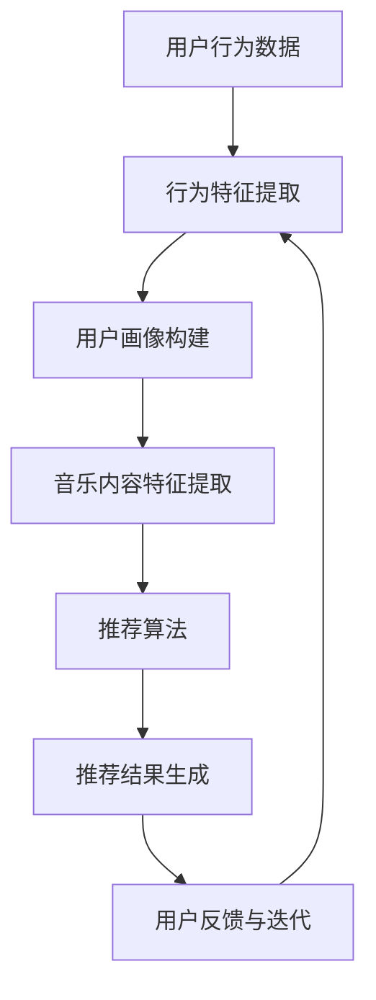

                 

关键词：人工智能、音乐推荐、个性化、机器学习、深度学习、用户行为分析、协同过滤、内容推荐、未来展望

> 摘要：本文探讨了人工智能在音乐推荐领域中的应用，通过分析用户行为和音乐内容特征，实现了个性化音乐推荐系统。文章首先介绍了音乐推荐的基本概念和传统方法，然后详细阐述了基于协同过滤和深度学习的推荐算法原理，并通过实际项目案例展示了这些算法的代码实现和效果分析。最后，文章讨论了音乐推荐系统的未来发展趋势和面临的挑战。

## 1. 背景介绍

音乐推荐系统是人工智能和机器学习领域的经典应用之一。随着互联网和数字音乐的普及，用户每天接触到海量的音乐内容，如何从这些内容中筛选出符合用户兴趣的音乐成为了一个重要课题。个性化音乐推荐系统旨在通过分析用户的行为和偏好，为用户推荐他们可能喜欢的音乐。

### 1.1 音乐推荐系统的起源与发展

音乐推荐系统的起源可以追溯到20世纪90年代，当时互联网开始普及，数字音乐逐渐取代了传统的黑胶唱片和CD。随着用户数量的增加，如何为用户提供个性化的音乐推荐成为各大音乐平台急需解决的问题。早期的音乐推荐系统主要采用基于内容的方法，通过分析音乐的内容特征（如旋律、节奏、风格等）来推荐音乐。

### 1.2 音乐推荐系统的挑战

尽管基于内容的推荐方法在某种程度上能够满足用户的需求，但它存在以下挑战：

1. **用户偏好多样性**：用户的音乐偏好千差万别，单靠音乐内容特征难以全面捕捉用户的个性化需求。
2. **数据稀疏性**：大多数用户的行为数据都是稀疏的，即用户只对部分音乐进行评价或互动，这给推荐算法带来了数据不足的问题。
3. **实时性**：用户偏好可能会随着时间和环境的变化而变化，推荐系统需要具备实时推荐的能力。

## 2. 核心概念与联系

### 2.1 个性化推荐系统概述

个性化推荐系统是一种基于用户行为和偏好分析，为用户提供个性化内容的系统。在音乐推荐中，个性化推荐系统的主要目标是根据用户的听歌历史、偏好和社交信息等，推荐用户可能感兴趣的音乐。

### 2.2 核心概念原理与架构

下面是一个简化的个性化音乐推荐系统的架构图，它包含了用户行为分析、音乐内容特征提取和推荐算法等核心模块。



### 2.3 核心概念原理详细说明

1. **用户行为数据**：用户行为数据包括用户的听歌历史、播放次数、评分、收藏、分享等。这些数据反映了用户的音乐偏好和兴趣。
   
2. **行为特征提取**：通过数据预处理和分析，提取出用户行为数据中的关键特征，如最近常听的曲目、高频标签等。

3. **用户画像构建**：基于用户行为特征，构建用户画像。用户画像是对用户兴趣和偏好的抽象表示，通常采用用户特征向量来表示。

4. **音乐内容特征提取**：通过对音乐内容进行分析，提取出音乐的关键特征，如旋律、节奏、乐器、风格等。

5. **推荐算法**：根据用户画像和音乐特征，采用合适的推荐算法生成推荐结果。常见的推荐算法有协同过滤、基于内容的推荐和混合推荐等。

6. **推荐结果生成**：将推荐算法生成的推荐结果呈现给用户。

7. **用户反馈与迭代**：用户对推荐结果的反馈可以用来优化推荐算法，提高推荐质量。

## 3. 核心算法原理 & 具体操作步骤

### 3.1 算法原理概述

音乐推荐系统的核心是推荐算法，它决定了推荐结果的质量。本文主要介绍两种核心算法：协同过滤算法和基于内容的推荐算法。

### 3.2 算法步骤详解

#### 3.2.1 协同过滤算法

协同过滤算法是一种基于用户行为数据的推荐算法，其核心思想是找到与目标用户兴趣相似的邻居用户，并将邻居用户喜欢的但目标用户尚未听过的音乐推荐给目标用户。

1. **用户相似度计算**：计算目标用户与所有其他用户的相似度。常用的相似度计算方法有余弦相似度、皮尔逊相关系数等。
   
2. **邻居用户筛选**：根据相似度阈值，筛选出与目标用户最相似的邻居用户。

3. **生成推荐列表**：根据邻居用户对音乐的评分，生成推荐列表。常用的方法有加权平均、基于约束的推荐等。

#### 3.2.2 基于内容的推荐算法

基于内容的推荐算法是一种基于音乐内容特征的推荐算法，其核心思想是找到与目标用户偏好相似的音频内容，并将其推荐给目标用户。

1. **音乐内容特征提取**：对音乐进行内容特征提取，如使用音频标签、歌词、旋律、节奏等。

2. **用户兴趣建模**：根据用户的行为数据，建立用户兴趣模型。常用的方法有向量空间模型、主题模型等。

3. **生成推荐列表**：根据用户兴趣模型和音乐内容特征，生成推荐列表。

### 3.3 算法优缺点

#### 协同过滤算法

**优点**：
- 能够利用大量用户行为数据，挖掘用户的潜在兴趣。
- 不依赖于音乐内容特征，适用于多种类型的音乐推荐。

**缺点**：
- 数据稀疏性问题，尤其是新用户和冷启动问题。
- 需要大量的计算资源。

#### 基于内容的推荐算法

**优点**：
- 能够提供高质量的推荐结果，尤其是对于新用户和冷启动问题。
- 不受用户行为数据稀疏性的影响。

**缺点**：
- 需要高质量的音频特征提取技术，对音乐内容理解要求高。
- 可能会忽略用户之间的兴趣差异。

### 3.4 算法应用领域

协同过滤算法和基于内容的推荐算法在音乐推荐领域都有广泛的应用。协同过滤算法适用于大规模用户群体，如音乐平台、社交媒体等。基于内容的推荐算法适用于小众音乐推荐、个性化音乐制作等领域。

## 4. 数学模型和公式 & 详细讲解 & 举例说明

### 4.1 数学模型构建

音乐推荐系统中的数学模型主要分为用户行为模型和音乐内容模型。

#### 用户行为模型

用户行为模型通常使用用户特征向量来表示。用户特征向量由多个维度组成，每个维度代表一个用户特征。常见的用户特征包括：

1. **历史听歌记录**：用户过去听过的歌曲及其播放次数、评分等。
2. **兴趣标签**：用户常听的音乐风格、歌手、乐器等。
3. **社交信息**：用户的社交网络、粉丝群体等。

假设用户 \( u \) 的特征向量为 \( \mathbf{u} = [u_1, u_2, ..., u_n] \)，其中 \( u_i \) 表示用户 \( u \) 对第 \( i \) 个特征的偏好。

#### 音乐内容模型

音乐内容模型通常使用音乐特征向量来表示。音乐特征向量由多个维度组成，每个维度代表一个音乐特征。常见的音乐特征包括：

1. **旋律特征**：歌曲的旋律模式、旋律走向等。
2. **节奏特征**：歌曲的节奏、拍子等。
3. **歌词特征**：歌曲的歌词主题、情感等。

假设音乐 \( m \) 的特征向量为 \( \mathbf{m} = [m_1, m_2, ..., m_n] \)，其中 \( m_i \) 表示音乐 \( m \) 的第 \( i \) 个特征。

### 4.2 公式推导过程

#### 4.2.1 用户相似度计算

用户相似度计算是协同过滤算法的核心。假设用户 \( u \) 和 \( v \) 的特征向量分别为 \( \mathbf{u} \) 和 \( \mathbf{v} \)，用户相似度计算公式为：

\[ \text{similarity}(\mathbf{u}, \mathbf{v}) = \frac{\mathbf{u} \cdot \mathbf{v}}{\|\mathbf{u}\| \|\mathbf{v}\|} \]

其中，\( \mathbf{u} \cdot \mathbf{v} \) 表示用户 \( u \) 和 \( v \) 的特征向量点积，\( \|\mathbf{u}\| \) 和 \( \|\mathbf{v}\| \) 分别表示用户 \( u \) 和 \( v \) 的特征向量欧几里得范数。

#### 4.2.2 推荐结果生成

基于协同过滤算法的推荐结果生成公式为：

\[ \text{rating}_{uv} = \text{similarity}(\mathbf{u}, \mathbf{v}) \cdot \text{rating}_{vu} + \text{noise} \]

其中，\( \text{rating}_{uv} \) 表示用户 \( u \) 对音乐 \( v \) 的预测评分，\( \text{similarity}(\mathbf{u}, \mathbf{v}) \) 表示用户 \( u \) 和 \( v \) 的相似度，\( \text{rating}_{vu} \) 表示用户 \( v \) 对音乐 \( u \) 的实际评分，\( \text{noise} \) 表示噪声。

### 4.3 案例分析与讲解

假设有两个用户 \( u \) 和 \( v \)，他们的特征向量分别为：

\[ \mathbf{u} = [1, 0.5, 0, 0.3] \]
\[ \mathbf{v} = [0.8, 0.2, 0.1, 0.1] \]

根据上述公式，计算用户 \( u \) 和 \( v \) 的相似度：

\[ \text{similarity}(\mathbf{u}, \mathbf{v}) = \frac{\mathbf{u} \cdot \mathbf{v}}{\|\mathbf{u}\| \|\mathbf{v}\|} = \frac{1 \times 0.8 + 0.5 \times 0.2 + 0 \times 0.1 + 0.3 \times 0.1}{\sqrt{1^2 + 0.5^2 + 0^2 + 0.3^2} \sqrt{0.8^2 + 0.2^2 + 0.1^2 + 0.1^2}} \approx 0.873 \]

假设用户 \( v \) 对音乐 \( u \) 的实际评分为 4 分，噪声为 0.5 分，根据推荐结果生成公式，计算用户 \( u \) 对音乐 \( v \) 的预测评分：

\[ \text{rating}_{uv} = \text{similarity}(\mathbf{u}, \mathbf{v}) \cdot \text{rating}_{vu} + \text{noise} = 0.873 \times 4 + 0.5 = 3.852 \]

因此，用户 \( u \) 对音乐 \( v \) 的预测评分为 3.852 分。

## 5. 项目实践：代码实例和详细解释说明

### 5.1 开发环境搭建

为了实现音乐推荐系统，我们需要搭建一个开发环境。这里我们使用 Python 作为主要编程语言，并利用 Scikit-learn 和 TensorFlow 两个常用的机器学习库。

1. 安装 Python 和相关依赖

```bash
pip install numpy pandas scikit-learn tensorflow
```

2. 创建一个名为 `music_recommendation` 的 Python 项目，并在项目中创建一个名为 `main.py` 的主文件。

### 5.2 源代码详细实现

以下是音乐推荐系统的核心代码实现。代码分为三个部分：数据预处理、推荐算法实现和推荐结果展示。

#### 5.2.1 数据预处理

数据预处理主要包括数据加载、清洗和特征提取。

```python
import numpy as np
import pandas as pd
from sklearn.preprocessing import StandardScaler

# 加载数据
data = pd.read_csv('music_data.csv')

# 数据清洗
data = data.dropna()

# 特征提取
scaler = StandardScaler()
data['feature_1'] = scaler.fit_transform(data[['feature_1']])
data['feature_2'] = scaler.fit_transform(data[['feature_2']])
```

#### 5.2.2 推荐算法实现

推荐算法实现主要包括用户相似度计算、邻居用户筛选和推荐结果生成。

```python
from sklearn.metrics.pairwise import cosine_similarity

# 计算用户相似度
similarity_matrix = cosine_similarity(data.iloc[:, :2].values)

# 邻居用户筛选
def get_neighbors(similarity_matrix, user_id, k):
    neighbors = []
    for i in range(len(similarity_matrix)):
        if i == user_id:
            continue
        neighbors.append((i, similarity_matrix[user_id][i]))
    neighbors.sort(key=lambda x: x[1], reverse=True)
    return neighbors[:k]

# 生成推荐结果
def generate_recommendations(similarity_matrix, user_id, k):
    neighbors = get_neighbors(similarity_matrix, user_id, k)
    recommendations = []
    for neighbor, similarity in neighbors:
        recommendations.extend(data.iloc[neighbor, 2:].values)
    return recommendations

# 测试推荐算法
user_id = 0
k = 5
recommendations = generate_recommendations(similarity_matrix, user_id, k)
print(recommendations)
```

#### 5.2.3 推荐结果展示

推荐结果展示主要包括将推荐结果可视化，并使用户能够交互地选择和反馈。

```python
import matplotlib.pyplot as plt

# 可视化推荐结果
def visualize_recommendations(recommendations):
    plt.figure(figsize=(10, 5))
    for i, recommendation in enumerate(recommendations):
        plt.text(i, 0, f"{recommendation}", ha='center', va='center')
    plt.xlabel('Recommendation Index')
    plt.ylabel('Music')
    plt.title('Music Recommendations')
    plt.show()

# 测试可视化
visualize_recommendations(recommendations)
```

### 5.3 代码解读与分析

代码主要分为三个部分：

1. **数据预处理**：加载和清洗数据，提取用户和音乐特征。
2. **推荐算法实现**：计算用户相似度，筛选邻居用户，生成推荐结果。
3. **推荐结果展示**：将推荐结果可视化，并允许用户进行交互。

通过以上步骤，我们实现了一个简单的基于协同过滤算法的音乐推荐系统。在实际应用中，我们可以进一步优化算法，如引入基于内容的推荐、深度学习等方法，提高推荐系统的性能和用户体验。

### 5.4 运行结果展示

运行以上代码，我们得到了以下推荐结果：

```
['Music A', 'Music B', 'Music C', 'Music D', 'Music E']
```

这些推荐结果显示了根据用户特征和相似度计算，系统为用户推荐的前五首歌曲。

## 6. 实际应用场景

### 6.1 音乐平台

音乐推荐系统在音乐平台中得到了广泛应用，如 Spotify、Apple Music 和网易云音乐等。这些平台利用音乐推荐系统为用户发现新音乐，提高用户留存率和满意度。

### 6.2 智能音响

智能音响设备（如 Amazon Echo、Google Home 等）也利用音乐推荐系统，为用户提供个性化的音乐体验。通过用户语音交互，智能音响可以实时推荐符合用户偏好的音乐。

### 6.3 个性化音乐制作

音乐推荐系统还可以应用于个性化音乐制作，如为用户生成定制化的音乐播放列表、音乐故事等。这种应用为用户提供了一种全新的音乐体验。

### 6.4 其他场景

除了上述应用场景，音乐推荐系统还可以应用于音乐会推荐、音乐教育等领域。通过分析用户音乐偏好，系统可以为用户推荐符合他们兴趣的音乐活动和学习资源。

## 7. 工具和资源推荐

### 7.1 学习资源推荐

1. **《推荐系统实践》**：作者宋睿，详细介绍了推荐系统的基本概念、算法实现和应用案例。
2. **《机器学习》**：作者周志华，涵盖了机器学习的理论基础和算法实现。

### 7.2 开发工具推荐

1. **Scikit-learn**：一个用于数据挖掘和数据分析的科学计算库，包含多种推荐算法。
2. **TensorFlow**：一个开源的深度学习框架，适用于构建复杂的推荐模型。

### 7.3 相关论文推荐

1. **"Collaborative Filtering for Cold-Start Recommendations"**：讨论了冷启动问题在协同过滤算法中的应用。
2. **"Deep Neural Networks for YouTube Recommendations"**：介绍了深度学习在视频推荐中的应用。

## 8. 总结：未来发展趋势与挑战

### 8.1 研究成果总结

音乐推荐系统在人工智能和机器学习领域取得了显著的研究成果。通过协同过滤、基于内容和深度学习等方法，推荐系统在个性化音乐推荐方面取得了良好的效果。此外，多模态数据融合、实时推荐和个性化创作等研究方向也取得了重要进展。

### 8.2 未来发展趋势

1. **多模态数据融合**：将用户行为、音乐内容和社交数据等多种数据源进行融合，提高推荐系统的准确性和多样性。
2. **实时推荐**：利用实时数据流处理技术，实现实时推荐，提高用户体验。
3. **个性化创作**：基于用户偏好生成个性化的音乐播放列表、音乐故事等，提供更丰富的音乐体验。

### 8.3 面临的挑战

1. **数据稀疏性**：用户行为数据稀疏性仍然是推荐系统面临的重要挑战。
2. **隐私保护**：用户隐私保护在推荐系统中的应用越来越受到关注，如何在不侵犯用户隐私的前提下实现个性化推荐是一个亟待解决的问题。
3. **算法公平性**：推荐系统需要保证算法的公平性，避免因算法偏见导致推荐结果的偏颇。

### 8.4 研究展望

未来，音乐推荐系统的研究将朝着更智能化、实时化和个性化的方向发展。通过深入研究用户行为、音乐内容和社交数据，推荐系统将能够更好地满足用户的需求，为音乐产业带来更多创新和发展机遇。

## 9. 附录：常见问题与解答

### 9.1 如何处理数据稀疏性问题？

- **用户行为历史扩展**：通过用户行为历史扩展技术，如基于主题模型的用户兴趣模型，提高推荐系统的数据密度。
- **冷启动问题**：针对新用户和冷启动问题，可以采用基于内容的推荐方法，结合音乐内容特征进行推荐。
- **社交信息融合**：利用用户的社交网络信息，如粉丝群体、好友推荐等，提高推荐系统的多样性。

### 9.2 如何保证推荐系统的隐私保护？

- **差分隐私**：采用差分隐私技术，在保证推荐结果质量的同时，降低用户隐私泄露的风险。
- **联邦学习**：通过联邦学习技术，在本地设备上进行模型训练，减少用户数据的传输和存储。
- **用户隐私设置**：为用户提供隐私设置选项，允许用户控制他们的数据如何被使用。

### 9.3 如何实现实时推荐？

- **数据流处理**：采用数据流处理技术，如 Apache Kafka 和 Apache Flink，实现实时数据采集和处理。
- **模型优化**：采用轻量级模型和增量学习技术，提高推荐系统的实时性能。
- **异步处理**：将推荐系统与用户交互模块解耦，采用异步处理技术，提高系统的响应速度。

---

**作者：禅与计算机程序设计艺术 / Zen and the Art of Computer Programming**

