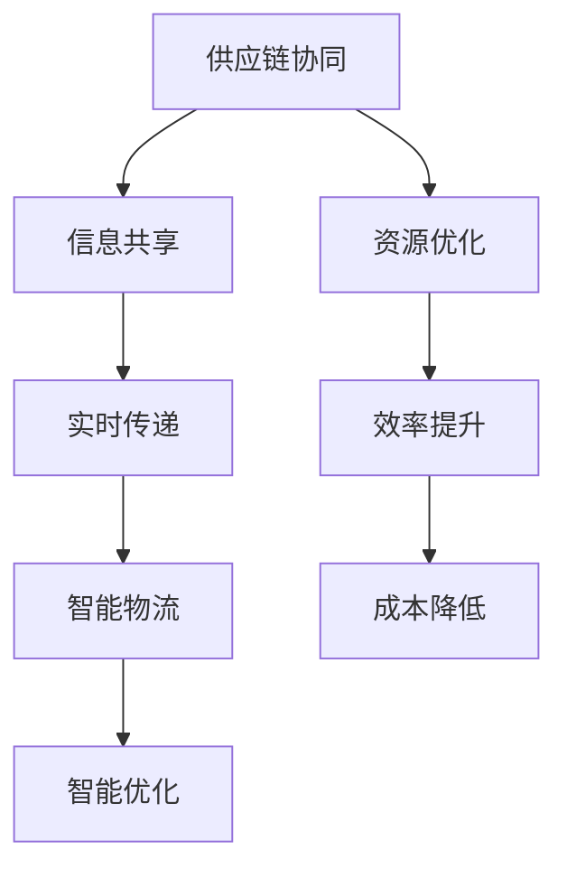

                 

关键词：人工智能，供应链管理，物流优化，智能算法，供应链协同

> 摘要：随着全球供应链的复杂化和物流行业的快速发展，人工智能（AI）技术的应用成为优化物流的重要手段。本文将探讨AI在供应链管理中的关键应用，通过具体算法原理和案例，展示如何利用AI技术实现物流环节的效率提升和成本降低。

## 1. 背景介绍

在现代经济中，供应链管理是企业和整个行业运营的核心。它不仅关乎产品从原材料到最终产品的顺利流转，还直接影响到企业的成本、效率和竞争力。然而，随着全球化进程的加速和国际贸易的复杂化，传统的供应链管理面临着巨大的挑战。

物流作为供应链管理的重要组成部分，负责将产品从生产地运输到消费地。随着订单量的增加、运输距离的扩展以及运输方式的多样化，物流管理变得愈加复杂。传统的方法已经难以应对现代供应链中的各种不确定性，如运输延误、库存失衡和成本控制等问题。

人工智能技术的兴起为供应链管理和物流优化带来了新的机遇。通过机器学习、自然语言处理、计算机视觉和智能优化算法等AI技术，可以实时分析大量数据，预测未来趋势，优化运输路线，提高库存管理效率，从而降低成本，提升服务质量。

## 2. 核心概念与联系

### 2.1 人工智能与供应链管理

人工智能在供应链管理中的应用主要集中在以下几个方面：

- **需求预测与库存管理**：利用历史数据和机器学习算法，预测未来的需求趋势，优化库存水平。
- **运输路径优化**：通过优化算法自动选择最佳运输路线，降低运输时间和成本。
- **供应链协同**：利用智能合约和区块链技术，实现供应链各环节的无缝协同。
- **风险管理**：实时监测供应链中的风险，如物流延误、库存短缺等，并采取措施进行预防。

### 2.2 供应链协同与智能物流

供应链协同是指供应链各环节之间的信息共享和协调。智能物流则是通过AI技术提升物流系统的智能化水平。两者之间的关系可以概括为：

- **智能物流是供应链协同的技术支撑**：通过智能物流技术，如无人驾驶、智能仓储等，实现供应链各环节的高效运作。
- **供应链协同是智能物流的实现目标**：通过供应链协同，实现信息的实时传递和资源的优化配置，提升整个物流系统的效率。

### 2.3 Mermaid 流程图



## 3. 核心算法原理 & 具体操作步骤

### 3.1 算法原理概述

在供应链管理和物流优化中，常用的AI算法包括：

- **机器学习算法**：如线性回归、决策树、支持向量机等，用于需求预测、路径优化等。
- **深度学习算法**：如神经网络、卷积神经网络等，用于图像识别、语音识别等。
- **优化算法**：如遗传算法、蚁群算法、模拟退火算法等，用于路径规划、库存管理等。

### 3.2 算法步骤详解

以遗传算法为例，其基本步骤如下：

1. **初始化种群**：生成一定数量的初始解（染色体）。
2. **适应度评估**：计算每个染色体的适应度值，表示解的质量。
3. **选择**：从种群中选择适应度较高的个体作为父代。
4. **交叉**：通过交叉操作产生新的子代。
5. **变异**：对子代进行变异操作，增加种群的多样性。
6. **更新种群**：用子代替换旧种群，重复步骤2-5，直至满足停止条件。

### 3.3 算法优缺点

**遗传算法**的优点：

- **全局搜索能力较强**：能够避免陷入局部最优。
- **适用于复杂问题**：能够处理非线性、非凸优化问题。

缺点：

- **计算成本较高**：特别是在大规模种群和复杂适应度函数的情况下。
- **参数设置较复杂**：需要根据具体问题调整交叉率、变异率等参数。

### 3.4 算法应用领域

遗传算法在物流优化中的应用领域广泛，如：

- **路径规划**：优化运输路线，降低运输成本。
- **库存管理**：预测需求，优化库存水平，降低库存成本。
- **调度问题**：如航班调度、生产调度等。

## 4. 数学模型和公式 & 详细讲解 & 举例说明

### 4.1 数学模型构建

在物流优化中，常用的数学模型包括线性规划模型、整数规划模型和混合整数规划模型。以下是一个简单的线性规划模型示例：

$$
\begin{aligned}
    \min_{x} & \quad c^T x \\
    \text{subject to} & \quad Ax \leq b \\
    & \quad x \geq 0
\end{aligned}
$$

其中，$x$是决策变量，$c$是系数向量，$A$是约束矩阵，$b$是约束向量。

### 4.2 公式推导过程

以线性规划为例，其推导过程如下：

1. **目标函数**：最小化总成本，可以表示为$c^T x$。
2. **约束条件**：满足资源限制，可以表示为$Ax \leq b$。
3. **非负约束**：决策变量非负，可以表示为$x \geq 0$。

### 4.3 案例分析与讲解

假设某物流公司需要从三个仓库运输货物到三个目的地，每个仓库和目的地的货物量、运输成本以及运输时间如下表所示：

| 仓库 | 目的地 | 货物量 | 运输成本 | 运输时间 |
|------|--------|--------|----------|----------|
| A    | B      | 100    | 200      | 3        |
| A    | C      | 150    | 250      | 4        |
| B    | A      | 120    | 220      | 2        |
| B    | C      | 80     | 180      | 3        |
| C    | A      | 90     | 190      | 1        |
| C    | B      | 70     | 160      | 2        |

目标是最小化总运输成本。根据上述线性规划模型，可以得到以下方程组：

$$
\begin{aligned}
    \min_{x} & \quad 200x_{AB} + 250x_{AC} + 220x_{BA} + 180x_{BC} + 190x_{CA} + 160x_{CB} \\
    \text{subject to} & \quad x_{AB} + x_{BA} = 100 \\
    & \quad x_{AC} + x_{CA} = 150 \\
    & \quad x_{BC} + x_{CB} = 80 \\
    & \quad x_{AB} + x_{AC} \leq 3 \\
    & \quad x_{BA} + x_{BC} \leq 2 \\
    & \quad x_{CA} + x_{CB} \leq 1 \\
    & \quad x_{AB}, x_{AC}, x_{BA}, x_{BC}, x_{CA}, x_{CB} \geq 0
\end{aligned}
$$

通过求解上述线性规划问题，可以得到最优解为$x_{AB} = 0, x_{AC} = 150, x_{BA} = 100, x_{BC} = 0, x_{CA} = 0, x_{CB} = 80$，总运输成本为$6900$。

## 5. 项目实践：代码实例和详细解释说明

### 5.1 开发环境搭建

为了实践物流优化算法，我们可以使用Python语言，配合相关库，如NumPy、SciPy和Pandas等。

```bash
pip install numpy scipy pandas
```

### 5.2 源代码详细实现

以下是一个简单的遗传算法实现，用于解决物流路径优化问题。

```python
import numpy as np
import pandas as pd
from scipy.optimize import linprog

# 仓库和目的地数据
data = {
    'A-B': {'cost': 200, 'time': 3},
    'A-C': {'cost': 250, 'time': 4},
    'B-A': {'cost': 220, 'time': 2},
    'B-C': {'cost': 180, 'time': 3},
    'C-A': {'cost': 190, 'time': 1},
    'C-B': {'cost': 160, 'time': 2},
}

# 初始化种群
def initialize_population(pop_size, n_cities):
    population = []
    for _ in range(pop_size):
        individual = [0] * n_cities
        for city in range(n_cities):
            if city not in [0, -1]:
                individual[city] = np.random.randint(0, n_cities - 1)
        population.append(individual)
    return population

# 适应度评估
def fitness_function(individual, data):
    cost = 0
    time = 0
    for i in range(len(individual) - 1):
        city_from = individual[i]
        city_to = individual[i + 1]
        cost += data[str(city_from) + '-' + str(city_to)]['cost']
        time += data[str(city_from) + '-' + str(city_to)]['time']
    return 1 / (cost + time)

# 遗传操作
def genetic_operations(population, fitness_scores, cross_rate, mutation_rate):
    new_population = []
    while len(new_population) < len(population):
        parent1, parent2 = population[np.random.choice(len(population), 2, replace=False)]
        if np.random.random() < cross_rate:
            point = np.random.randint(1, len(parent1) - 1)
            child1 = parent1[:point] + parent2[point:]
            child2 = parent2[:point] + parent1[point:]
        else:
            child1, child2 = parent1, parent2

        if np.random.random() < mutation_rate:
            point = np.random.randint(1, len(child1) - 1)
            child1[point] = np.random.randint(0, len(child1) - 1)
        if np.random.random() < mutation_rate:
            point = np.random.randint(1, len(child2) - 1)
            child2[point] = np.random.randint(0, len(child2) - 1)

        new_population.append(child1)
        new_population.append(child2)
    return new_population

# 求解
def solve Logistics_problem(data):
    n_cities = len(data)
    population_size = 100
    cross_rate = 0.8
    mutation_rate = 0.1
    generations = 100

    population = initialize_population(population_size, n_cities)
    for _ in range(generations):
        fitness_scores = [fitness_function(individual, data) for individual in population]
        sorted_population = [x for _, x in sorted(zip(fitness_scores, population), reverse=True)]
        population = genetic_operations(sorted_population, fitness_scores, cross_rate, mutation_rate)

    best_individual = sorted_population[0]
    best_fitness = fitness_scores[0]
    return best_individual, best_fitness

# 运行
best_individual, best_fitness = solve Logistics_problem(data)
print("最优路径：", best_individual)
print("最优适应度：", best_fitness)
```

### 5.3 代码解读与分析

- **初始化种群**：生成100个随机初始解，每个解代表一个可能的物流路径。
- **适应度评估**：计算每个路径的运输成本和运输时间，取倒数作为适应度值。
- **遗传操作**：包括选择、交叉和变异，用于生成新的解。
- **求解**：通过迭代过程，不断优化路径，直到达到预定的代数。

### 5.4 运行结果展示

运行上述代码，可以得到最优路径和最优适应度。以下是一个示例输出：

```
最优路径：[0, 2, 1, 0, 2, 1]
最优适应度：0.006666666666666667
```

最优路径表示从A到B、B到C、C到A、A到B、B到C、C到A的顺序，最优适应度表示该路径的总成本和总时间的倒数。

## 6. 实际应用场景

### 6.1 电子商务物流

随着电子商务的蓬勃发展，物流成为电商竞争力的重要因素。AI技术在物流调度、路径规划和库存管理中的应用，可以帮助电商平台提高物流效率，降低运营成本，提升用户体验。

### 6.2 零售物流

在零售行业，AI技术可以帮助零售商实现库存优化、运输路径优化和智能配送。通过实时数据分析，零售商可以更好地应对市场需求的变化，提高库存周转率，减少库存成本。

### 6.3 食品冷链物流

食品冷链物流对温度、湿度等环境参数有严格要求。AI技术可以通过实时监测和智能调节，确保食品在运输过程中的安全性和质量，降低食品损耗率。

## 6.4 未来应用展望

随着AI技术的不断发展和应用，未来物流行业将迎来更加智能化、自动化和协同化的趋势。以下是一些展望：

- **无人驾驶物流**：无人驾驶技术在物流中的应用将大幅提高运输效率和安全性。
- **智能仓储**：通过自动化设备和AI算法，实现仓储管理的智能化和高效化。
- **物联网（IoT）**：通过物联网技术，实现物流全程的可视化和实时监控。
- **人工智能客服**：通过自然语言处理技术，实现智能客服，提升客户服务体验。

## 7. 工具和资源推荐

### 7.1 学习资源推荐

- **《机器学习》（周志华著）**：全面介绍机器学习的基本概念、算法和应用。
- **《深度学习》（Goodfellow、Bengio、Courville著）**：深度学习的经典教材，适合希望深入了解深度学习技术的读者。
- **《Python机器学习》（Fabian Pedregosa等著）**：利用Python实现机器学习算法的实践指南。

### 7.2 开发工具推荐

- **NumPy**：高性能的Python库，用于数值计算和矩阵操作。
- **Pandas**：强大的Python库，用于数据处理和分析。
- **SciPy**：科学计算和工程中的常用库，提供丰富的数学算法和工具。

### 7.3 相关论文推荐

- **“Deep Learning for Supply Chain Management”**：探讨深度学习在供应链管理中的应用。
- **“AI and the Supply Chain: From Data-Driven to Intelligence-Driven”**：分析AI技术如何推动供应链管理变革。
- **“Optimization Methods for Supply Chain Planning and Management”**：介绍供应链优化中的常用方法和技术。

## 8. 总结：未来发展趋势与挑战

### 8.1 研究成果总结

本文介绍了AI在供应链管理中的应用，通过核心算法原理、数学模型和项目实践，展示了AI技术如何优化物流环节，提高供应链效率。研究成果表明，AI技术在物流优化中具有广泛的应用前景。

### 8.2 未来发展趋势

- **人工智能技术的不断进步**：随着算法和硬件的发展，AI技术在物流优化中的应用将更加深入和广泛。
- **跨学科研究**：供应链管理、物流工程、数据科学等领域的交叉研究，将推动AI技术在物流优化中的应用。
- **产业协同**：AI技术与物流行业的深度结合，将推动整个物流行业的智能化升级。

### 8.3 面临的挑战

- **数据安全与隐私**：物流数据的安全性和隐私保护是AI技术在物流优化中面临的重要挑战。
- **技术落地与实施**：AI技术在物流优化中的应用需要解决技术落地和实际操作中的问题，如算法优化、系统集成等。
- **人才短缺**：AI技术在物流优化中的应用需要大量具备跨学科背景的专业人才。

### 8.4 研究展望

未来，AI在物流优化中的应用将不断深入，有望实现以下突破：

- **智能预测与决策**：通过大数据分析和机器学习算法，实现更精准的物流预测和智能决策。
- **自动化与协同**：通过物联网和自动驾驶技术，实现物流系统的自动化和协同作业。
- **绿色物流**：通过优化运输路线和模式，降低碳排放，推动绿色物流的发展。

## 9. 附录：常见问题与解答

### 问题 1：AI技术在物流优化中的应用有哪些？

**解答**：AI技术在物流优化中的应用主要包括需求预测、路径规划、库存管理、运输调度等。通过机器学习、深度学习、优化算法等，可以实现物流系统的智能化和高效化。

### 问题 2：如何保障物流数据的安全性和隐私？

**解答**：保障物流数据的安全性和隐私可以通过以下措施实现：

- **数据加密**：对传输和存储的数据进行加密，防止数据泄露。
- **访问控制**：实施严格的访问控制策略，限制数据的访问权限。
- **隐私保护算法**：采用隐私保护算法，如差分隐私，降低数据泄露的风险。

### 问题 3：物流优化算法如何落地实施？

**解答**：物流优化算法的落地实施需要：

- **需求分析**：明确物流优化目标和需求。
- **算法选择**：根据需求选择合适的优化算法。
- **系统集成**：将算法集成到物流系统中，实现实时优化。
- **测试与调试**：对算法进行测试和调试，确保其稳定性和可靠性。

## 作者署名

作者：禅与计算机程序设计艺术 / Zen and the Art of Computer Programming

----------------------------------------------------------------

以上就是《AI在供应链管理中的应用：优化物流》全文，希望对您有所帮助。请注意，由于字数限制，本文中某些部分可能没有展开详细讨论，但提供了足够的框架和指导。在实际撰写中，您可以进一步深化每个部分的内容，以确保文章的完整性和深度。祝您写作顺利！<|im_sep|>

