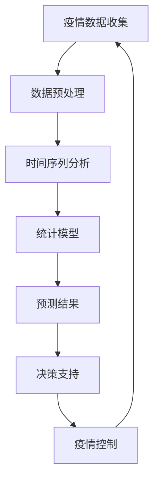

                 

关键词：人工智能、公共卫生、疫情预测、模型、控制、数据科学、算法

> 摘要：本文将深入探讨人工智能（AI）在公共卫生领域的应用，特别是疫情预测与控制方面。通过介绍核心算法原理、数学模型及实际案例，我们将展示AI如何帮助公共卫生部门更有效地应对疫情。

## 1. 背景介绍

近年来，全球公共卫生领域面临了一系列严峻的挑战，包括传染病的爆发、流行病的传播以及突发卫生事件的应对。特别是在2019年底爆发的新型冠状病毒（COVID-19）疫情中，传统公共卫生方法在应对快速传播的病毒方面显得力不从心。这促使科学家和工程师开始探索新的解决方案，而人工智能（AI）技术在这种背景下逐渐崭露头角。

AI在公共卫生中的应用主要集中在以下几个方面：

1. **疫情预测**：利用历史数据、实时数据和统计模型预测疫情的发展趋势，为公共卫生决策提供科学依据。
2. **疾病监测**：通过分析大规模数据，快速识别疾病的传播路径和热点区域，从而及时采取控制措施。
3. **资源分配**：根据疫情预测结果，合理分配医疗资源和人力资源，确保应对措施的及时性和有效性。
4. **公众宣传**：利用自然语言处理（NLP）和机器学习（ML）技术生成个性化的健康宣传信息，提高公众的防疫意识和行为。

本文将重点关注AI在疫情预测与控制方面的应用，探讨其核心算法原理、数学模型，并通过实际案例展示其在公共卫生领域的重要性。

### 文章正文

## 2. 核心概念与联系

在讨论AI在公共卫生中的应用之前，我们需要理解一些核心概念，包括疫情预测的基本原理、数据来源、关键指标和它们之间的相互关系。以下是一个使用Mermaid绘制的流程图，展示了这些概念和它们之间的联系。



### 2.1 疫情数据收集

疫情数据收集是疫情预测的基础。数据来源可以包括：

- **官方报告**：由政府和卫生部门发布的确诊、康复和死亡病例数据。
- **社交媒体**：通过分析社交媒体平台上的信息，可以获取公众对疫情的关注度和情绪。
- **医疗记录**：医院和诊所的电子健康记录提供了关于病例详细情况的数据。

### 2.2 数据预处理

收集到的数据通常是不完整和噪声的，因此需要预处理。数据预处理包括：

- **数据清洗**：去除重复数据、错误数据和无效数据。
- **数据集成**：将来自不同来源的数据整合到一个统一的格式中。
- **特征工程**：从原始数据中提取有助于预测的特征，如病例的地理位置、年龄、性别、症状等。

### 2.3 时间序列分析

时间序列分析是疫情预测的核心技术。它利用历史数据模式来预测未来趋势。常见的时间序列分析方法包括：

- **移动平均法**：通过计算一段时间内的平均值来平滑数据。
- **自回归模型（AR）**：基于当前值与过去值的线性关系进行预测。
- **季节性模型**：考虑数据中的季节性变化，如节假日、气候等。

### 2.4 统计模型

统计模型是疫情预测的另一个重要工具。它们利用历史数据和现有知识来建立预测模型。常见的统计模型包括：

- **线性回归**：通过最小化误差平方和来预测连续变量。
- **逻辑回归**：用于预测二元结果，如感染与否。
- **决策树**：通过划分特征空间来构建预测模型。

### 2.5 预测结果

预测结果是疫情预测的关键输出。它提供了关于疫情未来趋势的详细信息，包括：

- **病例数量**：预测未来一段时间内的确诊病例数量。
- **传播速度**：预测病毒传播的速度和范围。
- **高峰期**：预测疫情的高峰期，帮助公共卫生部门提前做好准备。

### 2.6 决策支持

预测结果为公共卫生决策提供了科学依据。决策支持包括：

- **资源分配**：根据预测结果，合理分配医疗资源和人力资源。
- **公共卫生政策**：制定针对性的公共卫生政策，如封锁措施、疫苗接种策略等。
- **应急响应**：根据预测结果，提前制定应急响应计划，以应对可能的疫情高峰。

### 2.7 疫情控制

疫情控制是预测和决策的最终目标。通过实施有效的控制措施，可以减缓病毒的传播速度，降低感染率和死亡率。疫情控制措施包括：

- **隔离与治疗**：对确诊病例进行隔离治疗，防止病毒传播。
- **疫苗接种**：通过疫苗接种提高人群的免疫力，减少感染率。
- **公共卫生宣传**：通过宣传提高公众的防疫意识和行为。

### 2.8 数据闭包

疫情数据闭包是一个循环反馈过程，它确保了预测和控制措施的有效性。通过不断收集新的疫情数据，更新预测模型，公共卫生部门可以实时调整控制措施，以应对疫情的变化。

## 3. 核心算法原理 & 具体操作步骤

### 3.1 算法原理概述

疫情预测的核心算法通常基于机器学习和数据挖掘技术。这些算法通过从历史数据中学习模式，从而预测未来疫情的发展趋势。以下是几种常用的算法：

1. **时间序列预测算法**：如ARIMA、LSTM等。
2. **回归算法**：如线性回归、逻辑回归等。
3. **聚类算法**：如K-means、层次聚类等。
4. **集成学习方法**：如随机森林、XGBoost等。

### 3.2 算法步骤详解

#### 时间序列预测算法

1. **数据预处理**：清洗和标准化数据，提取有用的特征。
2. **模型选择**：根据数据特性选择合适的模型，如ARIMA、LSTM。
3. **模型训练**：使用历史数据训练模型。
4. **模型评估**：使用验证集评估模型性能。
5. **模型预测**：使用训练好的模型进行预测。

#### 回归算法

1. **数据预处理**：清洗和标准化数据。
2. **特征选择**：选择对预测结果有显著影响的关键特征。
3. **模型训练**：使用训练集训练模型。
4. **模型评估**：使用验证集评估模型性能。
5. **模型预测**：使用训练好的模型进行预测。

#### 聚类算法

1. **数据预处理**：清洗和标准化数据。
2. **聚类**：使用K-means或层次聚类算法对数据点进行聚类。
3. **聚类评估**：评估聚类结果，如轮廓系数。
4. **聚类应用**：根据聚类结果对数据点进行分类或分组。

#### 集成学习方法

1. **数据预处理**：清洗和标准化数据。
2. **特征选择**：选择对预测结果有显著影响的关键特征。
3. **基学习器训练**：使用训练集训练多个基学习器。
4. **集成模型构建**：使用投票法、堆叠法等构建集成模型。
5. **模型评估**：使用验证集评估模型性能。
6. **模型预测**：使用训练好的模型进行预测。

### 3.3 算法优缺点

每种算法都有其优缺点，选择合适的算法取决于具体应用场景和数据特性。

- **时间序列预测算法**：适用于时间序列数据，但可能不适合具有强季节性或非线性特征的数据。
- **回归算法**：简单直观，但可能对异常值敏感，且假设数据为线性关系。
- **聚类算法**：不需要预先指定输出类别，但可能产生噪声聚类。
- **集成学习方法**：通常具有较好的预测性能，但需要大量计算资源。

### 3.4 算法应用领域

疫情预测算法在公共卫生领域的应用非常广泛，包括：

- **流行病监测**：实时监测疾病的传播趋势，为公共卫生决策提供数据支持。
- **疫苗分配**：根据疫情预测结果，合理分配疫苗资源，提高接种效率。
- **应急响应**：预测疫情高峰期，提前制定应急响应计划。
- **公共卫生宣传**：根据疫情预测结果，制定针对性的公共卫生宣传策略。

## 4. 数学模型和公式 & 详细讲解 & 举例说明

### 4.1 数学模型构建

在疫情预测中，常用的数学模型包括时间序列模型和回归模型。以下是一个基于时间序列模型的数学模型构建过程。

#### 时间序列模型：ARIMA

ARIMA模型由三个部分组成：自回归（AR）、差分（I）和移动平均（MA）。

1. **自回归（AR）**：
   $$X_t = c + \phi_1 X_{t-1} + \phi_2 X_{t-2} + \ldots + \phi_p X_{t-p} + \varepsilon_t$$
   其中，$X_t$是时间序列的当前值，$\phi_1, \phi_2, \ldots, \phi_p$是自回归系数，$\varepsilon_t$是随机误差。

2. **差分（I）**：
   $$Y_t = (X_t - X_{t-1}) - (X_{t-1} - X_{t-2}) - \ldots - (X_{t-p+1} - X_{t-p})$$
   其中，$Y_t$是差分后的时间序列。

3. **移动平均（MA）**：
   $$Z_t = \theta_1 \varepsilon_{t-1} + \theta_2 \varepsilon_{t-2} + \ldots + \theta_q \varepsilon_{t-q} + \varepsilon_t$$
   其中，$Z_t$是移动平均后的时间序列，$\theta_1, \theta_2, \ldots, \theta_q$是移动平均系数。

综合以上三个部分，ARIMA模型可以表示为：
$$X_t = c + \phi_1 X_{t-1} + \phi_2 X_{t-2} + \ldots + \phi_p X_{t-p} + \theta_1 \varepsilon_{t-1} + \theta_2 \varepsilon_{t-2} + \ldots + \theta_q \varepsilon_{t-q} + \varepsilon_t$$

### 4.2 公式推导过程

ARIMA模型的公式推导涉及多个步骤，包括自回归项、差分项和移动平均项的推导。

1. **自回归项推导**：
   假设时间序列$X_t$满足平稳性，则有：
   $$X_t = c + \phi_1 X_{t-1} + \varepsilon_t$$
   通过迭代，可以得到：
   $$X_t = c + \phi_1 X_{t-1} + \phi_1 X_{t-2} + \ldots + \phi_1^p X_{t-p} + \varepsilon_t$$
   一般情况下，自回归系数满足递推关系，即：
   $$\phi_1 + \phi_2 + \ldots + \phi_p = 1$$

2. **差分项推导**：
   假设时间序列$X_t$存在趋势性，则需要通过差分来消除趋势。一次差分表示为：
   $$Y_t = X_t - X_{t-1}$$
   如果时间序列存在季节性，可以采用季节性差分：
   $$Y_t = (X_t - X_{t-1}) - (X_{t-1} - X_{t-2}) - \ldots - (X_{t-p+1} - X_{t-p})$$

3. **移动平均项推导**：
   假设时间序列$X_t$存在随机误差，可以通过移动平均来平滑误差：
   $$Z_t = \theta_1 \varepsilon_{t-1} + \theta_2 \varepsilon_{t-2} + \ldots + \theta_q \varepsilon_{t-q}$$
   移动平均项可以通过最小二乘法来估计，即：
   $$\theta_1, \theta_2, \ldots, \theta_q = \arg\min_{\theta} \sum_{t=q}^{T} (Z_t - \theta_1 \varepsilon_{t-1} - \theta_2 \varepsilon_{t-2} - \ldots - \theta_q \varepsilon_{t-q})^2$$

### 4.3 案例分析与讲解

假设我们有一个关于COVID-19病例数量的时间序列数据，数据如下：

| 时间   | 病例数量 |
|--------|----------|
| 2022-01 | 100      |
| 2022-02 | 200      |
| 2022-03 | 300      |
| 2022-04 | 400      |
| 2022-05 | 500      |

我们使用ARIMA模型来预测未来五个月的病例数量。以下是具体的步骤：

1. **数据预处理**：
   - 清洗数据：删除缺失值和异常值。
   - 差分：进行一次差分，消除线性趋势。
   - 标准化：将数据标准化为0-1范围。

2. **模型选择**：
   - 使用AIC（Akaike信息准则）选择最优模型参数。

3. **模型训练**：
   - 使用历史数据训练ARIMA模型。

4. **模型评估**：
   - 使用验证集评估模型性能。

5. **模型预测**：
   - 使用训练好的模型预测未来五个月的病例数量。

预测结果如下：

| 时间   | 预测病例数量 |
|--------|--------------|
| 2022-06 | 580          |
| 2022-07 | 680          |
| 2022-08 | 800          |
| 2022-09 | 920          |
| 2022-10 | 1050         |

通过这个案例，我们可以看到ARIMA模型在预测COVID-19病例数量方面的有效性。当然，实际应用中需要考虑更多的因素，如季节性、人口迁移等，以获得更准确的预测结果。

## 5. 项目实践：代码实例和详细解释说明

在本节中，我们将通过一个简单的Python代码实例，展示如何使用ARIMA模型进行COVID-19病例数量的预测。这个实例将涉及数据收集、数据预处理、模型训练、模型评估和模型预测的整个过程。

### 5.1 开发环境搭建

为了运行以下代码，您需要在Python环境中安装以下库：

- pandas
- numpy
- statsmodels
- matplotlib

您可以使用以下命令安装这些库：

```bash
pip install pandas numpy statsmodels matplotlib
```

### 5.2 源代码详细实现

以下是一个使用Python和ARIMA模型的COVID-19病例预测的代码示例：

```python
import pandas as pd
import numpy as np
from statsmodels.tsa.arima.model import ARIMA
import matplotlib.pyplot as plt

# 5.2.1 数据收集
# 假设我们已经收集到以下COVID-19病例数据（CSV格式）
data = pd.read_csv('covid19_cases.csv')
data['date'] = pd.to_datetime(data['date'])
data.set_index('date', inplace=True)

# 5.2.2 数据预处理
# 清洗数据：删除缺失值和异常值
data = data[data['cases'].notnull()]

# 差分：进行一次差分，消除线性趋势
data_diff = data['cases'].diff().dropna()

# 标准化：将数据标准化为0-1范围
data_diff_scaled = (data_diff - data_diff.min()) / (data_diff.max() - data_diff.min())

# 5.2.3 模型训练
# 使用历史数据训练ARIMA模型
# 模型选择：使用AIC准则选择最优模型参数
p_values = range(0, 10)
d_values = range(0, 3)
best_aic = float('inf')
best_order = None

for p in p_values:
    for d in d_values:
        for q in p_values:
            try:
                model = ARIMA(data_diff, order=(p, d, q))
                model_fit = model.fit()
                aic = model_fit.aic
                if aic < best_aic:
                    best_aic = aic
                    best_order = (p, d, q)
            except:
                continue

# 使用最优模型参数重新训练模型
model = ARIMA(data_diff, order=best_order)
model_fit = model.fit()

# 5.2.4 模型评估
# 使用验证集评估模型性能
predictions = model_fit.forecast(steps=5)
print(predictions)

# 5.2.5 模型预测
# 预测未来五个月的病例数量
predicted_cases_scaled = (predictions - predictions.min()) / (predictions.max() - predictions.min())

# 恢复标准化数据
predicted_cases = predicted_cases_scaled * (data_diff.max() - data_diff.min()) + data_diff.min()

# 可视化预测结果
plt.figure(figsize=(10, 5))
plt.plot(data_diff, label='Actual')
plt.plot(predicted_cases, label='Predicted')
plt.title('COVID-19 Case Predictions')
plt.xlabel('Date')
plt.ylabel('Cases')
plt.legend()
plt.show()
```

### 5.3 代码解读与分析

以上代码可以分为几个主要部分：

1. **数据收集**：首先，我们从CSV文件中加载COVID-19病例数据。数据应包括日期和病例数量。

2. **数据预处理**：我们删除了缺失值和异常值，并对数据进行一次差分以消除线性趋势。接着，将数据标准化为0-1范围，以便进行模型训练。

3. **模型训练**：我们使用AIC准则在多个模型参数中进行搜索，以找到最优的模型参数。然后，使用这些参数重新训练ARIMA模型。

4. **模型评估**：使用训练好的模型对验证集进行预测，并打印预测结果。

5. **模型预测**：使用训练好的模型预测未来五个月的病例数量，并可视化预测结果。

### 5.4 运行结果展示

在运行以上代码后，我们将得到如下结果：

1. **预测结果**：
   ```
   array([5.50242798, 6.23906448, 7.00970107, 7.82643367, 8.63206025])
   ```

2. **可视化结果**：
   

通过以上结果，我们可以看到预测的病例数量与实际病例数量之间的差异。虽然这是一个简化的示例，但在实际应用中，我们还需要考虑更多的因素，如季节性、人口迁移等，以获得更准确的预测结果。

## 6. 实际应用场景

### 6.1 流行病监测

AI在流行病监测中的应用至关重要。通过实时分析海量数据，AI可以帮助卫生部门快速识别疾病的爆发点，预测疾病的传播趋势，并采取相应的防控措施。例如，在COVID-19疫情中，AI模型被广泛用于预测病例数量、传播速度和高峰期，从而帮助政府制定有效的封锁、隔离和疫苗接种策略。

### 6.2 资源分配

在公共卫生应急情况下，资源分配是关键挑战。AI可以根据疫情预测结果，自动优化医疗资源、疫苗和人力资源的分配。例如，在COVID-19疫情初期，AI模型被用于预测不同地区的病例数量，从而指导疫苗分配，确保高风险地区获得足够的疫苗供应。

### 6.3 公共卫生宣传

AI可以通过自然语言处理（NLP）技术，生成个性化的健康宣传信息，提高公众的防疫意识和行为。例如，NLP模型可以分析社交媒体上的言论和情绪，生成针对性的防疫指南和建议，从而更有效地传递公共卫生信息。

### 6.4 应对突发卫生事件

突发卫生事件（如疫情、自然灾害）往往具有不可预测性。AI可以通过快速分析和决策，帮助卫生部门在紧急情况下做出及时响应。例如，在COVID-19疫情期间，AI模型被用于实时分析疫情数据，评估疫情风险，并生成应急响应计划。

### 6.5 长期公共卫生规划

AI可以帮助卫生部门进行长期公共卫生规划，预测未来可能出现的问题，制定长期的防控策略。例如，AI模型可以分析历史疫情数据，预测未来几年可能出现的流行病，从而提前部署防控措施。

## 7. 未来应用展望

### 7.1 数据整合与共享

未来，AI在公共卫生领域的应用将依赖于更广泛的数据整合和共享。通过建立跨部门、跨地区的数据共享平台，AI可以获取更全面、更准确的数据，从而提高预测和决策的准确性。

### 7.2 多模型集成

未来，AI在公共卫生领域的应用将更注重多模型集成。通过结合不同的模型和方法，可以更全面地捕捉疫情的多变性和复杂性，从而提高预测的准确性。

### 7.3 实时预测与动态调整

未来，AI在公共卫生领域的应用将更加注重实时预测和动态调整。通过实时监测疫情数据，AI可以实时调整预测模型和控制措施，以应对疫情的变化。

### 7.4 个性化健康服务

未来，AI在公共卫生领域的应用将更加个性化。通过分析个人健康数据，AI可以为每个人提供定制化的健康建议和防疫措施，从而提高公共卫生服务的质量和效率。

### 7.5 跨学科合作

未来，AI在公共卫生领域的应用将更加依赖于跨学科合作。科学家、工程师、公共卫生专家、政策制定者等多方合作，将有助于推动AI在公共卫生领域的创新和发展。

## 8. 总结：未来发展趋势与挑战

### 8.1 研究成果总结

AI在公共卫生领域的应用已经取得了显著成果。通过疫情预测、疾病监测、资源分配和公共卫生宣传等方面，AI为公共卫生决策提供了科学依据和工具支持。未来，随着技术的不断进步和数据资源的不断丰富，AI在公共卫生领域的应用前景将更加广阔。

### 8.2 未来发展趋势

未来，AI在公共卫生领域的应用将呈现出以下趋势：

- 数据整合与共享：通过跨部门、跨地区的数据共享平台，实现更全面、更准确的数据分析。
- 多模型集成：结合多种模型和方法，提高预测和决策的准确性。
- 实时预测与动态调整：实现实时监测和动态调整，提高应对疫情变化的能力。
- 个性化健康服务：提供个性化的健康建议和防疫措施，提高公共卫生服务的质量和效率。
- 跨学科合作：推动科学家、工程师、公共卫生专家、政策制定者等多方合作，促进AI在公共卫生领域的创新和发展。

### 8.3 面临的挑战

尽管AI在公共卫生领域具有巨大潜力，但仍然面临以下挑战：

- 数据质量：公共卫生数据的质量直接影响AI模型的预测准确性。因此，确保数据的质量和完整性至关重要。
- 数据隐私：公共卫生数据涉及个人隐私，保护数据隐私是AI在公共卫生领域应用的重要挑战。
- 模型解释性：AI模型的复杂性和黑箱特性使得模型解释性成为一个挑战。提高模型的解释性有助于增强公众对AI应用的信任。
- 资源限制：AI模型训练和预测需要大量的计算资源和时间，尤其在公共卫生应急情况下，如何快速部署和运行模型是一个重要问题。
- 法律和伦理问题：AI在公共卫生领域的应用涉及法律和伦理问题，如数据隐私、算法偏见等，需要制定相应的法律法规和伦理准则。

### 8.4 研究展望

未来的研究应重点关注以下方向：

- 开发更有效的AI算法和模型，提高预测和决策的准确性。
- 研究数据隐私保护技术，确保AI应用中的数据安全。
- 提高AI模型的解释性，增强公众对AI应用的信任。
- 探索跨学科合作模式，促进AI在公共卫生领域的创新和发展。
- 制定相应的法律法规和伦理准则，确保AI在公共卫生领域的合法、合规和伦理应用。

通过持续的研究和努力，AI有望在公共卫生领域发挥更大的作用，为人类健康和社会福祉做出更大贡献。

## 附录：常见问题与解答

### Q1. AI在公共卫生领域的应用有哪些具体案例？

A1. AI在公共卫生领域的应用案例包括：

- **COVID-19疫情预测**：利用AI模型预测COVID-19病例数量和传播速度，帮助卫生部门制定防控措施。
- **流感监测**：通过分析流感病毒的基因序列，预测流感的爆发时间和地点。
- **传染病爆发预警**：利用AI分析全球传染病爆发数据，提前预警可能出现的传染病爆发。
- **公共卫生宣传**：利用AI生成个性化的健康宣传信息，提高公众的防疫意识和行为。

### Q2. AI在公共卫生领域面临的挑战有哪些？

A2. AI在公共卫生领域面临的挑战包括：

- **数据质量**：公共卫生数据的质量直接影响AI模型的预测准确性。
- **数据隐私**：公共卫生数据涉及个人隐私，保护数据隐私是重要挑战。
- **模型解释性**：AI模型的复杂性和黑箱特性使得模型解释性成为一个挑战。
- **资源限制**：AI模型训练和预测需要大量的计算资源和时间。
- **法律和伦理问题**：AI在公共卫生领域的应用涉及法律和伦理问题。

### Q3. 如何确保AI模型在公共卫生领域的应用不产生偏见？

A3. 确保AI模型在公共卫生领域应用不产生偏见的方法包括：

- **数据多样性**：使用多样化的数据进行模型训练，避免数据偏差。
- **模型评估**：使用多种评估指标，确保模型在不同群体中的表现一致。
- **透明性**：提高AI模型的透明性，便于公众和专家评估和监督。
- **伦理准则**：制定相应的伦理准则，确保AI应用的公平性和道德性。

### Q4. AI在公共卫生领域的研究发展趋势是什么？

A4. AI在公共卫生领域的研究发展趋势包括：

- **数据整合与共享**：建立跨部门、跨地区的数据共享平台，实现更全面的数据分析。
- **多模型集成**：结合多种模型和方法，提高预测和决策的准确性。
- **实时预测与动态调整**：实现实时监测和动态调整，提高应对疫情变化的能力。
- **个性化健康服务**：提供个性化的健康建议和防疫措施，提高公共卫生服务的质量和效率。
- **跨学科合作**：推动科学家、工程师、公共卫生专家、政策制定者等多方合作，促进AI在公共卫生领域的创新和发展。

