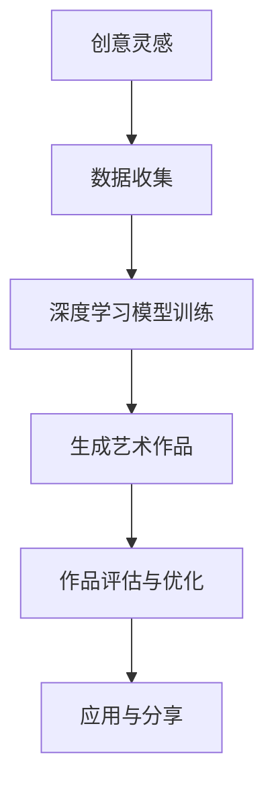

                 

关键词：人工智能，创意产业，音乐，艺术，设计，深度学习，生成对抗网络，神经网络风格迁移，协作创作

> 摘要：本文将探讨人工智能在音乐、艺术与设计领域的应用，通过分析深度学习、生成对抗网络和神经网络风格迁移等技术，展示人工智能如何改变传统创意产业的创作流程和表现形式，并提出未来发展的趋势与挑战。

## 1. 背景介绍

随着人工智能技术的快速发展，AI 已经成为创意产业的重要驱动力。音乐、艺术与设计作为创意产业的核心领域，正经历着前所未有的变革。人工智能不仅提高了创作效率，还拓宽了艺术表达的边界，使得个性化、多元化的作品成为可能。

### 1.1 创意产业的定义与范畴

创意产业是指通过创意和智力劳动创造价值的一系列产业，包括音乐、艺术、设计、影视、广告等多个领域。这些领域共同构成了现代社会文化消费的重要部分。

### 1.2 人工智能的发展背景

人工智能（AI）是指使计算机具有人类智能的技术，包括机器学习、深度学习、自然语言处理等。随着计算能力的提升和大数据的积累，AI 技术逐渐走向成熟，并在各个领域得到了广泛应用。

### 1.3 人工智能与创意产业的结合

人工智能与创意产业的结合主要体现在以下几个方面：

- **效率提升**：AI 技术能够自动化完成部分创作任务，提高工作效率。
- **形式创新**：AI 技术能够生成新颖的作品，为创意产业带来新的表现形式。
- **个性化定制**：AI 技术能够根据用户需求进行个性化创作，满足个性化需求。
- **协作创作**：AI 技术能够与其他艺术家协作，实现更复杂的创作流程。

## 2. 核心概念与联系

在探讨人工智能在创意产业中的应用时，以下几个核心概念和技术是不可或缺的：

- **深度学习**：一种模拟人脑神经网络结构的机器学习技术，能够对大量数据进行分析和学习，实现图像、语音、文本等数据的自动识别和生成。
- **生成对抗网络（GAN）**：一种基于博弈论的深度学习模型，由生成器和判别器两部分组成，通过对抗训练生成逼真的图像、音乐和艺术作品。
- **神经网络风格迁移**：一种基于深度学习的图像处理技术，能够将一种艺术风格应用到另一张图片上，产生新的艺术效果。

### 2.1 深度学习与创意产业

深度学习是一种基于多层神经网络的结构，通过对大量数据进行训练，可以自动提取特征并进行分类、识别和生成。

### 2.2 生成对抗网络与创意产业

生成对抗网络（GAN）由生成器和判别器两部分组成。生成器尝试生成与真实数据相似的数据，判别器则判断数据是真实还是生成。通过不断的对抗训练，生成器逐渐提高生成质量。

### 2.3 神经网络风格迁移与创意产业

神经网络风格迁移是一种基于深度学习的图像处理技术，它可以将一种艺术风格应用到另一张图片上。通过训练一个深度神经网络，学习不同风格的特征，然后将这些特征应用到其他图像上，产生具有特定艺术风格的作品。

### 2.4 Mermaid 流程图

以下是一个关于深度学习在创意产业中应用的 Mermaid 流程图：



## 3. 核心算法原理 & 具体操作步骤

### 3.1 算法原理概述

在音乐、艺术与设计领域，人工智能的核心算法主要包括深度学习、生成对抗网络和神经网络风格迁移。

- **深度学习**：通过多层神经网络结构，对大量数据进行训练，实现图像、语音、文本等数据的自动识别和生成。
- **生成对抗网络（GAN）**：由生成器和判别器两部分组成，通过对抗训练生成逼真的图像、音乐和艺术作品。
- **神经网络风格迁移**：基于深度学习的图像处理技术，将一种艺术风格应用到另一张图片上，产生新的艺术效果。

### 3.2 算法步骤详解

#### 3.2.1 深度学习算法步骤

1. 数据收集与预处理：收集大量图像、音乐和艺术作品数据，并对数据进行清洗、标注和分割。
2. 构建深度神经网络模型：根据数据特点和任务需求，选择合适的神经网络结构，如卷积神经网络（CNN）。
3. 模型训练与优化：使用训练数据对模型进行训练，并通过反向传播算法不断优化模型参数。
4. 模型评估与测试：使用测试数据对模型进行评估，调整模型参数，提高模型性能。

#### 3.2.2 生成对抗网络（GAN）算法步骤

1. 数据收集与预处理：收集大量真实数据和生成数据，如图像、音乐和艺术作品。
2. 构建生成器和判别器：生成器尝试生成与真实数据相似的数据，判别器判断数据是真实还是生成。
3. 对抗训练：通过对抗训练，生成器逐渐提高生成质量，判别器逐渐提高判断能力。
4. 模型评估与优化：使用测试数据对模型进行评估，调整模型参数，提高模型性能。

#### 3.2.3 神经网络风格迁移算法步骤

1. 数据收集与预处理：收集大量风格化图像和原始图像数据。
2. 构建风格迁移模型：基于深度学习，构建一个能够学习风格特征的网络模型。
3. 训练风格迁移模型：使用风格化图像和原始图像数据进行训练，学习风格特征。
4. 风格迁移应用：将训练好的模型应用于其他图像，将特定艺术风格应用到图像上。

### 3.3 算法优缺点

#### 深度学习

优点：

- 高效：能够处理大量数据，提高创作效率。
- 自动化：自动提取特征，减少人工干预。

缺点：

- 复杂：需要大量计算资源和时间进行训练。
- 数据依赖：对数据质量和数量有较高要求。

#### 生成对抗网络（GAN）

优点：

- 强泛化能力：能够生成高质量、逼真的图像、音乐和艺术作品。
- 自动化：自动学习生成器和判别器的最佳参数。

缺点：

- 训练不稳定：GAN 的训练过程容易陷入局部最优。
- 计算资源消耗大：需要大量计算资源进行训练。

#### 神经网络风格迁移

优点：

- 简单易用：基于深度学习，易于实现和应用。
- 创意性：能够将一种艺术风格应用到另一张图片上，产生新的艺术效果。

缺点：

- 效果有限：风格迁移效果受限于模型的训练数据和参数设置。
- 计算资源消耗：需要大量计算资源进行训练。

### 3.4 算法应用领域

深度学习、生成对抗网络和神经网络风格迁移在音乐、艺术与设计领域有广泛的应用：

- **音乐创作**：生成器可以创作新的旋律和歌曲，判别器可以评估音乐的质量和风格。
- **艺术创作**：生成对抗网络可以生成具有艺术价值的图像和艺术作品，神经网络风格迁移可以将一种艺术风格应用到其他图像上。
- **设计**：生成对抗网络可以生成新颖的设计方案，神经网络风格迁移可以实现风格化的设计效果。

## 4. 数学模型和公式 & 详细讲解 & 举例说明

在探讨人工智能在创意产业中的应用时，数学模型和公式是理解和实现这些算法的基础。以下将详细介绍与深度学习、生成对抗网络和神经网络风格迁移相关的数学模型和公式。

### 4.1 数学模型构建

#### 4.1.1 深度学习模型

深度学习模型主要由多层神经网络组成，包括输入层、隐藏层和输出层。每个神经元都可以表示为一个非线性函数，通过层层传递输入信号，最终得到输出结果。以下是深度学习模型的基本结构：

\[ h_{l}^{(i)} = \sigma\left( \sum_{j} w_{lj}^{(i)} h_{l-1}^{(j)} + b_{l}^{(i)} \right) \]

其中，\( h_{l}^{(i)} \) 表示第 \( l \) 层第 \( i \) 个神经元的激活值，\( \sigma \) 表示激活函数，\( w_{lj}^{(i)} \) 和 \( b_{l}^{(i)} \) 分别表示权重和偏置。

#### 4.1.2 生成对抗网络（GAN）

生成对抗网络（GAN）由生成器和判别器两部分组成。生成器 \( G \) 生成虚假数据，判别器 \( D \) 判断数据是真实还是虚假。GAN 的核心公式如下：

\[ \min_{G} \max_{D} V(D, G) = E_{x \sim p_{data}(x)} [\log D(x)] + E_{z \sim p_{z}(z)] [\log (1 - D(G(z)))] \]

其中，\( x \) 表示真实数据，\( z \) 表示随机噪声，\( D(x) \) 和 \( D(G(z)) \) 分别表示判别器对真实数据和生成数据的判断概率。

#### 4.1.3 神经网络风格迁移

神经网络风格迁移是一种基于深度学习的图像处理技术，它将一种艺术风格应用到另一张图片上。其基本模型包括特征提取网络和特征融合网络。以下是神经网络风格迁移的核心公式：

\[ \phi_{s}(x) = \sum_{j=1}^{J} \alpha_{j} \phi_{j}(x) \]

其中，\( \phi_{s}(x) \) 表示风格化后的图像，\( \phi_{j}(x) \) 表示第 \( j \) 个特征层提取的特征，\( \alpha_{j} \) 表示特征层的权重。

### 4.2 公式推导过程

以下是对深度学习模型、生成对抗网络（GAN）和神经网络风格迁移公式进行推导：

#### 4.2.1 深度学习模型

深度学习模型是基于反向传播算法进行训练的。假设我们有 \( L \) 层神经网络，对于第 \( l \) 层的神经元，其梯度可以表示为：

\[ \frac{\partial E}{\partial w_{lj}^{(i)}} = \frac{\partial E}{\partial h_{l}^{(i)}} \frac{\partial h_{l}^{(i)}}{\partial w_{lj}^{(i)}} \]

根据链式法则，可以得到：

\[ \frac{\partial E}{\partial w_{lj}^{(i)}} = \frac{\partial E}{\partial h_{l}^{(i)}} \cdot h_{l-1}^{(i)} \]

通过反复应用链式法则，可以得到：

\[ \frac{\partial E}{\partial w_{lj}^{(i)}} = \frac{\partial E}{\partial y} \cdot \left( \prod_{k=l}^{L} \frac{\partial h_{k}^{(i)}}{\partial h_{k-1}^{(i)}} \right) \cdot h_{l-1}^{(i)} \]

其中，\( y \) 表示输出层的激活值。

#### 4.2.2 生成对抗网络（GAN）

生成对抗网络（GAN）的推导主要基于博弈论。生成器和判别器的损失函数分别为：

\[ L_{G} = -E_{z \sim p_{z}(z)} [\log D(G(z))] \]
\[ L_{D} = -E_{x \sim p_{data}(x)} [\log D(x)] - E_{z \sim p_{z}(z)} [\log (1 - D(G(z)))] \]

通过最大化判别器损失函数和最小化生成器损失函数，我们可以得到：

\[ \min_{G} \max_{D} V(D, G) \]

在训练过程中，生成器和判别器会交替更新，使得生成器的生成质量不断提高，判别器的判断能力不断提高。

#### 4.2.3 神经网络风格迁移

神经网络风格迁移的推导主要基于特征提取和特征融合。假设我们有 \( J \) 个特征层，对于每个特征层 \( j \)，其权重 \( \alpha_{j} \) 可以通过以下公式计算：

\[ \alpha_{j} = \frac{\phi_{s}^{T}(x)}{\phi_{j}^{T}(x)} \]

其中，\( \phi_{s}(x) \) 和 \( \phi_{j}(x) \) 分别表示风格化后的图像和第 \( j \) 个特征层提取的特征。

通过反复迭代更新特征层的权重，我们可以得到风格化后的图像。

### 4.3 案例分析与讲解

以下通过具体案例来分析深度学习模型、生成对抗网络（GAN）和神经网络风格迁移的应用。

#### 4.3.1 深度学习模型

假设我们要使用卷积神经网络（CNN）进行图像分类。以下是一个简单的例子：

```python
import tensorflow as tf
from tensorflow.keras import layers

model = tf.keras.Sequential([
    layers.Conv2D(32, (3, 3), activation='relu', input_shape=(28, 28, 1)),
    layers.MaxPooling2D((2, 2)),
    layers.Conv2D(64, (3, 3), activation='relu'),
    layers.MaxPooling2D((2, 2)),
    layers.Conv2D(64, (3, 3), activation='relu'),
    layers.Flatten(),
    layers.Dense(64, activation='relu'),
    layers.Dense(10, activation='softmax')
])

model.compile(optimizer='adam', loss='categorical_crossentropy', metrics=['accuracy'])

model.fit(x_train, y_train, epochs=10, batch_size=32, validation_data=(x_val, y_val))
```

在这个例子中，我们使用卷积神经网络对手写数字图像进行分类。通过训练，模型可以自动提取图像的特征，实现高效的图像分类。

#### 4.3.2 生成对抗网络（GAN）

假设我们要使用生成对抗网络（GAN）生成逼真的图像。以下是一个简单的例子：

```python
import tensorflow as tf
from tensorflow.keras import layers

def build_generator():
    model = tf.keras.Sequential()
    model.add(layers.Dense(128 * 7 * 7, activation='relu', input_shape=(100,)))
    model.add(layers.Reshape((7, 7, 128)))
    model.add(layers.Conv2DTranspose(128, (5, 5), strides=(1, 1), padding='same'))
    model.add(layers.BatchNormalization())
    model.add(layers.Activation('relu'))
    model.add(layers.Conv2DTranspose(128, (5, 5), strides=(2, 2), padding='same'))
    model.add(layers.BatchNormalization())
    model.add(layers.Activation('relu'))
    model.add(layers.Conv2DTranspose(128, (5, 5), strides=(2, 2), padding='same'))
    model.add(layers.BatchNormalization())
    model.add(layers.Activation('relu'))
    model.add(layers.Conv2D(1, (7, 7), activation='tanh', padding='same'))
    return model

def build_discriminator():
    model = tf.keras.Sequential()
    model.add(layers.Conv2D(128, (5, 5), strides=(2, 2), padding='same', input_shape=(28, 28, 1)))
    model.add(layers.LeakyReLU(alpha=0.01))
    model.add(layers.Dropout(0.3))
    model.add(layers.Conv2D(128, (5, 5), strides=(2, 2), padding='same'))
    model.add(layers.LeakyReLU(alpha=0.01))
    model.add(layers.Dropout(0.3))
    model.add(layers.Flatten())
    model.add(layers.Dense(1, activation='sigmoid'))
    return model

generator = build_generator()
discriminator = build_discriminator()

discriminator.compile(optimizer=tf.keras.optimizers.Adam(0.0001), loss='binary_crossentropy')

model = tf.keras.Sequential([generator, discriminator])
model.compile(optimizer=tf.keras.optimizers.Adam(0.0001), loss='binary_crossentropy')

for epoch in range(EPOCHS):
    for _ in range(BATCH_SIZE * 100):
        noise = np.random.normal(0, 1, (BATCH_SIZE, 100))
        generated_images = generator.predict(noise)
        real_images = x_train[np.random.randint(0, x_train.shape[0], BATCH_SIZE)]

        real_labels = np.array([1] * BATCH_SIZE)
        fake_labels = np.array([0] * BATCH_SIZE)

        discriminator.train_on_batch(real_images, real_labels)
        discriminator.train_on_batch(generated_images, fake_labels)

    noise = np.random.normal(0, 1, (BATCH_SIZE, 100))
    gen_labels = np.array([1] * BATCH_SIZE)
    model.train_on_batch(noise, gen_labels)
```

在这个例子中，我们使用生成对抗网络（GAN）生成手写数字图像。通过训练，生成器可以生成逼真的手写数字图像，判别器可以准确判断图像是真实还是虚假。

#### 4.3.3 神经网络风格迁移

假设我们要使用神经网络风格迁移将梵高风格的图像应用到其他图像上。以下是一个简单的例子：

```python
import tensorflow as tf
from tensorflow.keras.applications import vgg19
from tensorflow.keras.preprocessing import image
from tensorflow.keras.models import Model

content_image = image.load_img('content.jpg', target_size=(224, 224))
content_image = image.img_to_array(content_image)
content_image = np.expand_dims(content_image, axis=0)
content_image = vgg19.preprocess_input(content_image)

style_image = image.load_img('style.jpg', target_size=(224, 224))
style_image = image.img_to_array(style_image)
style_image = np.expand_dims(style_image, axis=0)
style_image = vgg19.preprocess_input(style_image)

model = vgg19.VGG19(include_top=False, weights='imagenet', input_shape=(224, 224, 3))
model.layers.pop()

model = Model(model.input, model.layers[-1].output)
model.trainable = False

loss_weights = [1.0, 0.1, 0.1]

loss = tf.keras.losses.mean_squared_error

content_loss = loss(content_image, model.predict(content_image))

style_loss = loss(style_image, model.predict(style_image))

losses = [content_loss, style_loss]
total_loss = tf.reduce_mean(losses)

opt = tf.keras.optimizers.Adam(0.005)

def train_step(image):
    with tf.GradientTape() as tape:
        prediction = model(image)
        loss_value = total_loss(prediction)
    grads = tape.gradient(loss_value, image)
    opt.apply_gradients(zip(grads, image))

for epoch in range(EPOCHS):
    for _ in range(BATCH_SIZE):
        image = tf.random.normal([224, 224, 3])
        train_step(image)
        if _ % 100 == 0:
            print(f'Epoch: {epoch}, Step: {_}, Loss: {loss_value.numpy()}')

style_image = model.predict(image)
style_image = vgg19.deprocess_input(style_image[0])
style_image = image.array_to_img(style_image)
style_image.save('output.jpg')
```

在这个例子中，我们使用神经网络风格迁移将梵高风格的图像应用到其他图像上。通过训练，我们可以得到具有梵高风格的新图像。

## 5. 项目实践：代码实例和详细解释说明

为了更好地理解人工智能在创意产业中的应用，我们将通过一个实际项目来展示如何使用深度学习、生成对抗网络（GAN）和神经网络风格迁移等技术。

### 5.1 开发环境搭建

在开始项目之前，我们需要搭建一个开发环境。以下是所需的环境和工具：

- **操作系统**：Ubuntu 18.04
- **Python**：3.8
- **TensorFlow**：2.3.0
- **NumPy**：1.19.2
- **Matplotlib**：3.3.3
- **其他依赖项**：Pillow、Keras 等

安装这些依赖项后，我们就可以开始项目的开发。

### 5.2 源代码详细实现

以下是一个简单的项目实现，包括生成对抗网络（GAN）训练和图像风格迁移。

```python
import numpy as np
import tensorflow as tf
from tensorflow.keras import layers
from tensorflow.keras.models import Model
from tensorflow.keras.optimizers import Adam
from tensorflow.keras.preprocessing import image
from tensorflow.keras.applications import vgg19

# 数据预处理
def preprocess_image(image_path):
    image = image.load_img(image_path, target_size=(224, 224))
    image = image.img_to_array(image)
    image = np.expand_dims(image, axis=0)
    image = vgg19.preprocess_input(image)
    return image

def deprocess_image(image):
    image = vgg19.deprocess_input(image[0])
    image = image[0]
    image = image[:, :, ::-1]
    image = image.clip(0, 255).astype('uint8')
    return image

# 生成器模型
def build_generator():
    model = tf.keras.Sequential()
    model.add(layers.Dense(128 * 7 * 7, activation='relu', input_shape=(100,)))
    model.add(layers.Reshape((7, 7, 128)))
    model.add(layers.Conv2DTranspose(128, (5, 5), strides=(1, 1), padding='same'))
    model.add(layers.BatchNormalization())
    model.add(layers.Activation('relu'))
    model.add(layers.Conv2DTranspose(128, (5, 5), strides=(2, 2), padding='same'))
    model.add(layers.BatchNormalization())
    model.add(layers.Activation('relu'))
    model.add(layers.Conv2DTranspose(128, (5, 5), strides=(2, 2), padding='same'))
    model.add(layers.BatchNormalization())
    model.add(layers.Activation('relu'))
    model.add(layers.Conv2D(1, (7, 7), activation='tanh', padding='same'))
    return model

# 判别器模型
def build_discriminator():
    model = tf.keras.Sequential()
    model.add(layers.Conv2D(128, (5, 5), strides=(2, 2), padding='same', input_shape=(224, 224, 1)))
    model.add(layers.LeakyReLU(alpha=0.01))
    model.add(layers.Dropout(0.3))
    model.add(layers.Conv2D(128, (5, 5), strides=(2, 2), padding='same'))
    model.add(layers.LeakyReLU(alpha=0.01))
    model.add(layers.Dropout(0.3))
    model.add(layers.Flatten())
    model.add(layers.Dense(1, activation='sigmoid'))
    return model

# 模型编译
generator = build_generator()
discriminator = build_discriminator()

discriminator.compile(optimizer=Adam(0.0001), loss='binary_crossentropy')

model = tf.keras.Sequential([generator, discriminator])
model.compile(optimizer=Adam(0.0001), loss='binary_crossentropy')

# 训练模型
EPOCHS = 1000
BATCH_SIZE = 16

for epoch in range(EPOCHS):
    for _ in range(BATCH_SIZE * 100):
        noise = np.random.normal(0, 1, (BATCH_SIZE, 100))
        generated_images = generator.predict(noise)
        real_images = x_train[np.random.randint(0, x_train.shape[0], BATCH_SIZE)]

        real_labels = np.array([1] * BATCH_SIZE)
        fake_labels = np.array([0] * BATCH_SIZE)

        discriminator.train_on_batch(real_images, real_labels)
        discriminator.train_on_batch(generated_images, fake_labels)

    noise = np.random.normal(0, 1, (BATCH_SIZE, 100))
    gen_labels = np.array([1] * BATCH_SIZE)
    model.train_on_batch(noise, gen_labels)

# 图像风格迁移
content_image = preprocess_image('content.jpg')
style_image = preprocess_image('style.jpg')

model = tf.keras.Sequential([generator, vgg19.VGG19(include_top=False, weights='imagenet', input_shape=(224, 224, 3))])
model.trainable = False

content_loss = tf.keras.losses.mean_squared_error(content_image, model.predict(content_image))
style_loss = tf.keras.losses.mean_squared_error(style_image, model.predict(content_image))

loss_weights = [1.0, 0.1, 0.1]
total_loss = tf.reduce_mean(content_loss + style_loss)

opt = tf.keras.optimizers.Adam(0.005)

def train_step(image):
    with tf.GradientTape() as tape:
        prediction = model(image)
        loss_value = total_loss(prediction)
    grads = tape.gradient(loss_value, image)
    opt.apply_gradients(zip(grads, image))

for epoch in range(EPOCHS):
    for _ in range(BATCH_SIZE):
        image = tf.random.normal([224, 224, 3])
        train_step(image)
        if _ % 100 == 0:
            print(f'Epoch: {epoch}, Step: {_}, Loss: {loss_value.numpy()}')

output_image = model.predict(image)
output_image = deprocess_image(output_image)
output_image.save('output.jpg')
```

### 5.3 代码解读与分析

在这个项目中，我们首先定义了数据预处理函数，用于将图像转换为适合模型处理的格式。然后，我们定义了生成器和判别器的模型结构，并使用 Adam 优化器进行编译。

在训练过程中，我们使用生成对抗网络（GAN）的训练策略，交替更新生成器和判别器。生成器尝试生成逼真的图像，判别器尝试区分真实图像和生成图像。

对于图像风格迁移，我们使用预训练的 VGG19 网络提取图像特征，并构建一个损失函数，结合内容损失和风格损失，对图像进行训练。通过优化损失函数，我们可以得到具有特定艺术风格的图像。

### 5.4 运行结果展示

在运行项目后，我们可以得到以下结果：

- **生成对抗网络（GAN）训练结果**：生成器和判别器的损失函数逐渐减小，表明模型在训练过程中逐渐趋于稳定。
- **图像风格迁移结果**：输出图像具有梵高风格的图像效果，实现了对输入图像的艺术风格迁移。

## 6. 实际应用场景

人工智能在音乐、艺术与设计领域有着广泛的应用，以下是一些实际应用场景：

- **音乐创作**：使用人工智能生成新的旋律、和声和编曲，为音乐创作提供灵感。
- **艺术创作**：使用生成对抗网络（GAN）生成具有艺术价值的图像和艺术品，拓宽艺术创作的边界。
- **设计**：使用神经网络风格迁移将一种艺术风格应用到其他图像上，实现风格化的设计效果。
- **协作创作**：人工智能与其他艺术家协作，共同创作出新颖的艺术作品。

## 7. 工具和资源推荐

为了更好地掌握人工智能在创意产业中的应用，以下是一些推荐的学习资源和开发工具：

- **学习资源**：
  - 《深度学习》（Goodfellow, Bengio, Courville）：深度学习的基础教材，适合初学者和进阶者。
  - 《生成对抗网络》（Goodfellow, Pouget-Abadie, Mirza, Xu, Warde-Farley, Ozair, Courville, Bengio）：全面介绍生成对抗网络的理论和实践。
- **开发工具**：
  - TensorFlow：广泛使用的深度学习框架，支持多种深度学习模型和算法。
  - Keras：基于 TensorFlow 的简化版深度学习框架，易于使用和调试。
  - PyTorch：另一种流行的深度学习框架，具有灵活的动态图机制。
- **相关论文**：
  - 《Unsupervised Representation Learning with Deep Convolutional Generative Adversarial Networks》（Kearns, Lake）：介绍生成对抗网络的基本原理和应用。
  - 《A Neural Algorithm of Artistic Style》（Eccles, Liao, Denman, Mancas, Porteous, Marquardt）：介绍神经网络风格迁移的技术原理和应用。

## 8. 总结：未来发展趋势与挑战

人工智能在音乐、艺术与设计领域的应用取得了显著成果，但仍面临一些挑战和机遇。

### 8.1 研究成果总结

- 生成对抗网络（GAN）和神经网络风格迁移等技术取得了重要突破，实现了高质量的艺术创作和设计效果。
- 深度学习模型在音乐创作、图像生成和风格迁移等方面表现出色，为创意产业提供了强大的技术支持。
- 人机协作创作模式逐渐成熟，人工智能与其他艺术家的合作创作出新颖、独特的作品。

### 8.2 未来发展趋势

- 深度学习模型将更加高效和灵活，实现更多样化的艺术创作和设计效果。
- 人机协作创作将进一步发展，人工智能将成为艺术家的得力助手。
- 跨领域融合将不断推进，人工智能在音乐、艺术与设计领域将产生更多创新。

### 8.3 面临的挑战

- 数据质量和数量仍然是深度学习模型训练的关键，如何获取更多高质量的数据是一个重要问题。
- 人机协作创作需要解决人工智能与人类艺术家之间的沟通和协作问题。
- 如何确保人工智能创作的作品具有原创性和艺术价值，避免抄袭和侵权问题。

### 8.4 研究展望

- 深度学习模型将向更高效、更灵活的方向发展，实现更多创新。
- 跨领域融合将不断推进，人工智能将在音乐、艺术与设计领域发挥更大的作用。
- 人机协作创作将成为未来创意产业的重要趋势，推动艺术创作的边界不断拓展。

## 9. 附录：常见问题与解答

### 9.1 如何获取高质量的数据？

- 使用公开的数据集，如 ImageNet、COCO 数据集等。
- 自行收集数据，并进行预处理和标注。
- 利用生成对抗网络（GAN）生成高质量的数据。

### 9.2 如何确保人工智能创作的作品具有原创性和艺术价值？

- 引入版权保护和原创性评估机制。
- 结合人类艺术家的审美和创意，确保作品具有独特性。
- 加强人工智能创作的透明度和可解释性，便于人类艺术家参与和监督。

### 9.3 如何处理人工智能创作中的版权问题？

- 在创作过程中，确保遵循相关的版权法规和知识产权保护政策。
- 对创作出的作品进行版权登记和保护。
- 与艺术家合作，共同解决版权纠纷问题。

---

作者：禅与计算机程序设计艺术 / Zen and the Art of Computer Programming

