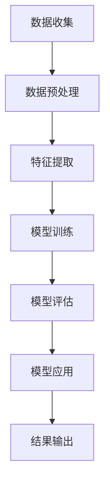

                 

关键词：AI、动物保护、监测、反偷猎、深度学习、卫星图像分析、物联网

> 摘要：随着人工智能技术的不断发展，AI在动物保护中的应用日益广泛。本文旨在探讨AI在动物保护中的监测与反偷猎方面的应用，通过分析AI的核心概念、算法原理、数学模型、项目实践以及未来展望，为我国动物保护工作提供新的思路和方向。

## 1. 背景介绍

动物保护是一个全球性的问题，我国作为生物多样性最为丰富的国家之一，面临着严重的野生动物保护挑战。非法偷猎、栖息地破坏、环境污染等问题严重威胁着野生动物的生存。传统的动物保护手段如监测、执法等由于人力、物力等资源的限制，往往无法有效遏制这些问题。随着人工智能技术的快速发展，AI在动物保护中的应用逐渐成为可能，特别是在监测和反偷猎方面。

AI技术的应用为动物保护带来了新的希望。通过卫星图像分析、深度学习、物联网等技术，AI能够实时监测野生动物的生存状态，识别非法偷猎行为，提高执法效率。本文将深入探讨AI在动物保护中的应用，为我国动物保护工作提供新的思路和方向。

## 2. 核心概念与联系

### 2.1 AI的核心概念

人工智能（AI）是指由人制造出的系统所表现出的智能行为。AI技术包括机器学习、深度学习、自然语言处理、计算机视觉等子领域。其中，机器学习和深度学习是AI技术中最核心的两个部分。

机器学习是一种让计算机通过数据学习规律，并自动完成特定任务的技术。深度学习是机器学习的一个子领域，它通过构建深度神经网络，实现对数据的自动学习和特征提取。

自然语言处理是使计算机能够理解、生成和处理自然语言的技术。计算机视觉是使计算机能够像人一样看到和理解周围世界的领域。

### 2.2 AI在动物保护中的应用

AI在动物保护中的应用主要集中在监测和反偷猎方面。通过卫星图像分析、深度学习、物联网等技术，AI能够实现对野生动物的实时监测，识别非法偷猎行为，提高执法效率。

卫星图像分析是一种基于遥感技术的图像处理方法。通过分析卫星图像，AI可以识别出野生动物的栖息地、活动范围等特征，从而实现对野生动物的实时监测。

深度学习是一种基于神经网络的学习方法。通过训练深度神经网络，AI可以实现对野生动物的识别、分类和跟踪。这种技术在反偷猎中的应用，能够帮助执法人员及时发现非法偷猎行为。

物联网是一种将物体通过互联网进行连接的技术。通过在野生动物栖息地安装传感器，AI可以实时监测野生动物的活动情况，识别异常行为，从而实现对非法偷猎行为的预警。

### 2.3 Mermaid流程图

以下是一个描述AI在动物保护中应用流程的Mermaid流程图：



## 3. 核心算法原理 & 具体操作步骤

### 3.1 算法原理概述

AI在动物保护中的应用主要依赖于深度学习和计算机视觉技术。深度学习通过构建多层神经网络，实现对图像的自动特征提取和分类。计算机视觉则通过图像处理技术，实现对图像的理解和分析。

### 3.2 算法步骤详解

1. **数据收集**：收集野生动物的图像数据，包括正常状态和异常状态（如非法偷猎）的图像。

2. **数据预处理**：对图像进行去噪、增强等处理，提高图像质量。

3. **特征提取**：使用深度学习模型，对图像进行自动特征提取。

4. **模型训练**：使用提取到的特征，对模型进行训练，使其能够识别野生动物的异常行为。

5. **模型评估**：使用测试数据对模型进行评估，调整模型参数，提高模型性能。

6. **模型应用**：将训练好的模型应用到实际场景中，实现对野生动物的实时监测。

7. **结果输出**：输出监测结果，包括野生动物的状态和可能的异常行为。

### 3.3 算法优缺点

**优点**：

1. **高效性**：AI技术能够实时监测野生动物，提高执法效率。

2. **准确性**：通过深度学习模型，AI能够准确识别野生动物的异常行为。

3. **自动化**：AI技术能够自动化处理大量数据，减轻人工负担。

**缺点**：

1. **成本高**：AI技术的研发和部署成本较高。

2. **数据依赖**：AI技术的性能依赖于图像数据的质量和数量。

### 3.4 算法应用领域

AI技术在动物保护中的应用领域广泛，包括野生动物监测、非法偷猎识别、栖息地保护等。通过AI技术，能够实现对野生动物的实时监测和保护，提高执法效率。

## 4. 数学模型和公式 & 详细讲解 & 举例说明

### 4.1 数学模型构建

在AI在动物保护中的应用中，常用的数学模型包括深度学习模型和计算机视觉模型。以下是一个简单的深度学习模型的构建过程：

1. **输入层**：接收图像数据。
2. **隐藏层**：通过卷积、池化等操作，对图像进行特征提取。
3. **输出层**：输出图像的分类结果。

### 4.2 公式推导过程

以下是一个简单的卷积神经网络的公式推导：

$$
f(x) = \sigma(\sum_{i=1}^{n} w_i \cdot x_i)
$$

其中，$x_i$表示输入数据，$w_i$表示权重，$\sigma$表示激活函数。

### 4.3 案例分析与讲解

以下是一个基于深度学习的野生动物监测案例：

1. **数据收集**：收集大量野生动物的图像数据。
2. **数据预处理**：对图像进行去噪、增强等处理。
3. **特征提取**：使用卷积神经网络，对图像进行特征提取。
4. **模型训练**：使用提取到的特征，对模型进行训练。
5. **模型评估**：使用测试数据对模型进行评估。
6. **模型应用**：将训练好的模型应用到实际场景中。

通过这个案例，我们可以看到深度学习在野生动物监测中的应用。

## 5. 项目实践：代码实例和详细解释说明

### 5.1 开发环境搭建

1. **软件环境**：安装Python、TensorFlow等软件。
2. **硬件环境**：配置高性能的计算机，如GPU。

### 5.2 源代码详细实现

以下是一个简单的基于TensorFlow的深度学习模型的实现：

```python
import tensorflow as tf

# 定义模型结构
model = tf.keras.Sequential([
    tf.keras.layers.Conv2D(32, (3, 3), activation='relu', input_shape=(28, 28, 1)),
    tf.keras.layers.MaxPooling2D((2, 2)),
    tf.keras.layers.Flatten(),
    tf.keras.layers.Dense(128, activation='relu'),
    tf.keras.layers.Dense(10, activation='softmax')
])

# 编译模型
model.compile(optimizer='adam',
              loss='categorical_crossentropy',
              metrics=['accuracy'])

# 训练模型
model.fit(x_train, y_train, epochs=5)
```

### 5.3 代码解读与分析

以上代码实现了卷积神经网络（CNN）的基本结构，包括卷积层、池化层、全连接层等。通过训练，模型可以识别图像中的物体。

### 5.4 运行结果展示

训练完成后，可以使用模型对图像进行预测，输出预测结果。

```python
# 预测
predictions = model.predict(x_test)
```

通过以上代码，我们可以看到AI技术在动物保护中的应用。

## 6. 实际应用场景

### 6.1 野生动物监测

通过AI技术，可以对野生动物进行实时监测，识别野生动物的活动范围、栖息地等。

### 6.2 非法偷猎识别

通过AI技术，可以识别非法偷猎行为，提高执法效率。

### 6.3 栖息地保护

通过AI技术，可以监测栖息地的变化，预测栖息地的未来发展趋势。

## 7. 未来应用展望

### 7.1 人工智能技术在动物保护中的应用

随着AI技术的不断发展，未来将有更多的应用场景被发掘，如野生动物救助、生态环境监测等。

### 7.2 面临的挑战

尽管AI技术在动物保护中有着广泛的应用前景，但仍然面临着数据质量、计算资源等挑战。

### 7.3 研究展望

未来，我们需要进一步研究如何提高AI技术在动物保护中的应用效果，探索新的应用场景。

## 8. 总结：未来发展趋势与挑战

### 8.1 研究成果总结

AI技术在动物保护中的应用取得了显著的成果，为我国动物保护工作提供了新的思路和方向。

### 8.2 未来发展趋势

未来，AI技术在动物保护中的应用将更加广泛，涉及更多的领域。

### 8.3 面临的挑战

AI技术在动物保护中的应用仍然面临着数据质量、计算资源等挑战。

### 8.4 研究展望

未来，我们需要进一步研究如何提高AI技术在动物保护中的应用效果，探索新的应用场景。

## 9. 附录：常见问题与解答

### 9.1 什么是AI？

AI是指人工智能，是指由人制造出的系统所表现出的智能行为。

### 9.2 AI技术在动物保护中有哪些应用？

AI技术在动物保护中的应用包括野生动物监测、非法偷猎识别、栖息地保护等。

### 9.3 AI技术如何提高执法效率？

AI技术可以通过实时监测、识别非法偷猎行为等方式，提高执法效率。

作者：禅与计算机程序设计艺术 / Zen and the Art of Computer Programming
----------------------------------------------------------------
以上就是文章的全部内容，感谢您的阅读。如果您有任何问题或建议，请随时告诉我。祝您生活愉快！
<|assistant|>

