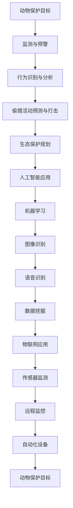

                 

关键词：人工智能、动物保护、监测、反偷猎、机器学习、图像识别、深度学习、物联网、数据挖掘

## 摘要

随着全球气候变化和人类活动的加剧，动物保护面临着前所未有的挑战。人工智能（AI）技术的迅猛发展，为动物保护和反偷猎提供了新的解决方案。本文将探讨AI在动物保护中的应用，重点关注监测和反偷猎领域。通过介绍AI的核心算法原理、数学模型、项目实践，以及未来应用展望，本文旨在为读者提供对AI在动物保护中作用的全面了解。

## 1. 背景介绍

动物保护是一个全球性的议题，然而，偷猎和非法交易等问题使得许多动物种群面临灭绝的危险。传统的方法，如巡逻、监测和抓捕，虽然在一定程度上起到了作用，但成本高昂且效率低下。近年来，人工智能技术的飞速发展为动物保护带来了新的希望。

AI技术，特别是机器学习和深度学习，通过处理大量数据、识别模式和进行预测，能够在动物保护和反偷猎中发挥重要作用。例如，通过分析卫星图像和监控视频，AI可以实时监测动物种群的变化和偷猎活动的迹象。此外，AI还可以用于预测非法交易的流向和打击偷猎的战术策略。

## 2. 核心概念与联系

### 2.1 人工智能在动物保护中的应用

人工智能在动物保护中的应用主要包括以下几个方向：

1. **监测与预警**：利用卫星图像、监控摄像头和传感器等设备，AI可以实时监测动物种群和生态环境的变化，及时发现异常情况。
2. **行为识别与分析**：通过对动物行为的分析，AI可以识别动物的健康状况、繁殖行为和迁徙路径等。
3. **偷猎活动预测与打击**：AI可以根据历史数据和模式，预测偷猎活动的发生地点和时间，协助执法部门进行精准打击。
4. **生态保护规划**：AI可以分析生态数据，为保护区的划定、物种保护和生态恢复提供科学依据。

### 2.2 机器学习与深度学习在动物保护中的应用

机器学习和深度学习是人工智能的两个核心分支，它们在动物保护中的应用主要体现在以下几个方面：

1. **图像识别**：通过深度学习算法，AI可以识别图像中的动物种类、行为和异常情况，从而实现自动化的监测和分析。
2. **语音识别**：AI可以通过分析动物叫声，识别动物的种类和健康状况。
3. **数据挖掘**：通过对大量生态数据的挖掘，AI可以发现隐藏的模式和趋势，为保护工作提供数据支持。

### 2.3 物联网在动物保护中的应用

物联网（IoT）技术通过连接各种传感器和设备，实现了对动物和环境的实时监测。在动物保护中，物联网的应用主要包括：

1. **传感器监测**：通过安装在动物身上的传感器，实时监测动物的生理指标和行为模式。
2. **远程监控**：利用物联网技术，实现对远程保护区的实时监控和预警。
3. **自动化设备**：通过物联网技术，实现对保护区内设备的自动化管理和维护。

## 2.3 Mermaid 流程图



## 3. 核心算法原理 & 具体操作步骤

### 3.1 算法原理概述

在动物保护和反偷猎中，常用的核心算法包括：

1. **卷积神经网络（CNN）**：用于图像识别和模式分析，能够识别动物的行为和异常情况。
2. **循环神经网络（RNN）**：用于语音识别和序列数据分析，能够分析动物的叫声和行为模式。
3. **决策树和随机森林**：用于预测偷猎活动的时间和地点，基于历史数据和模式进行预测。

### 3.2 算法步骤详解

1. **数据收集与预处理**：
   - 收集卫星图像、监控视频、传感器数据和生态数据。
   - 对数据进行清洗、去噪和标准化处理。

2. **模型训练与优化**：
   - 使用卷积神经网络（CNN）进行图像识别模型的训练。
   - 使用循环神经网络（RNN）进行语音识别模型的训练。
   - 使用决策树和随机森林进行偷猎活动预测模型的训练。

3. **模型评估与部署**：
   - 对训练好的模型进行评估，包括准确率、召回率和F1值等指标。
   - 将评估良好的模型部署到实际应用场景中，如监控系统和预警系统。

### 3.3 算法优缺点

1. **优点**：
   - 高效：AI算法能够快速处理大量数据，实现自动化监测和分析。
   - 准确：AI算法能够通过训练得到较高的识别和预测准确率。
   - 智能：AI算法能够根据数据和模式进行智能化的判断和决策。

2. **缺点**：
   - 计算资源消耗大：训练和部署AI模型需要大量的计算资源。
   - 数据依赖性：AI算法的性能依赖于数据的质量和数量。
   - 算法透明性：AI算法的决策过程往往不透明，难以解释。

### 3.4 算法应用领域

AI算法在动物保护和反偷猎中的应用非常广泛，包括：

1. **野生动物监测**：利用AI算法对野生动物的种群数量、分布和迁徙路径进行监测。
2. **非法交易打击**：利用AI算法分析非法交易的流向和模式，协助执法部门进行精准打击。
3. **生态保护规划**：利用AI算法分析生态数据，为生态保护提供科学依据和决策支持。

## 4. 数学模型和公式 & 详细讲解 & 举例说明

### 4.1 数学模型构建

在AI算法中，常用的数学模型包括：

1. **卷积神经网络（CNN）**：
   - 输入：图像矩阵
   - 输出：分类结果或特征向量
   - 公式：$$ f(x) = \sigma(W \cdot x + b) $$
     其中，$ \sigma $ 是激活函数，$ W $ 是权重矩阵，$ b $ 是偏置项。

2. **循环神经网络（RNN）**：
   - 输入：时间序列数据
   - 输出：分类结果或预测值
   - 公式：$$ h_t = \sigma(W_h \cdot [h_{t-1}, x_t] + b_h) $$
     其中，$ h_t $ 是当前时刻的隐藏状态，$ x_t $ 是输入数据，$ W_h $ 是权重矩阵，$ b_h $ 是偏置项。

3. **决策树和随机森林**：
   - 输入：特征向量
   - 输出：分类结果或预测值
   - 公式：$$ G(X) = \sum_{i=1}^{n} w_i g(x_i) $$
     其中，$ G(X) $ 是决策函数，$ w_i $ 是权重，$ g(x_i) $ 是分类函数。

### 4.2 公式推导过程

以卷积神经网络（CNN）为例，其公式推导过程如下：

1. **卷积操作**：
   - 输入：图像矩阵 $ X \in \mathbb{R}^{m \times n} $
   - 输出：特征图矩阵 $ Y \in \mathbb{R}^{p \times q} $
   - 公式：$$ Y_{ij} = \sum_{k=1}^{l} X_{i+k, j+l} \cdot W_{kl} + b_{ij} $$
     其中，$ W_{kl} $ 是卷积核，$ b_{ij} $ 是偏置项。

2. **池化操作**：
   - 输入：特征图矩阵 $ Y \in \mathbb{R}^{p \times q} $
   - 输出：缩减后的特征图矩阵 $ Z \in \mathbb{R}^{r \times s} $
   - 公式：$$ Z_{ij} = \max(Y_{i\cdot, j\cdot}) $$
     其中，$ i\cdot $ 和 $ j\cdot $ 分别表示 $ i $ 和 $ j $ 的邻域。

3. **全连接层**：
   - 输入：缩减后的特征图矩阵 $ Z \in \mathbb{R}^{r \times s} $
   - 输出：分类结果或特征向量 $ f(Z) \in \mathbb{R}^{c} $
   - 公式：$$ f(Z) = \sigma(W_f \cdot Z + b_f) $$
     其中，$ \sigma $ 是激活函数，$ W_f $ 是权重矩阵，$ b_f $ 是偏置项。

### 4.3 案例分析与讲解

以一个动物监测的案例为例，我们使用卷积神经网络（CNN）对野生动物的图像进行分类。

1. **数据集准备**：
   - 收集1000张不同种类的野生动物图像，分为训练集和测试集。
   - 对图像进行预处理，包括缩放、裁剪和归一化等。

2. **模型训练**：
   - 构建一个卷积神经网络（CNN）模型，包括卷积层、池化层和全连接层。
   - 使用训练集对模型进行训练，调整权重和偏置项，优化模型性能。

3. **模型评估**：
   - 使用测试集对模型进行评估，计算准确率、召回率和F1值等指标。
   - 根据评估结果，调整模型结构和参数，提高模型性能。

4. **模型部署**：
   - 将训练好的模型部署到实际应用场景中，如野生动物监测系统。
   - 对实时捕获的野生动物图像进行分类，识别不同种类的野生动物。

## 5. 项目实践：代码实例和详细解释说明

### 5.1 开发环境搭建

1. 安装Python环境和相关库：
   ```bash
   pip install numpy matplotlib tensorflow keras scikit-learn
   ```

2. 导入所需库：
   ```python
   import numpy as np
   import matplotlib.pyplot as plt
   import tensorflow as tf
   from tensorflow.keras.models import Sequential
   from tensorflow.keras.layers import Conv2D, MaxPooling2D, Flatten, Dense
   from tensorflow.keras.preprocessing.image import ImageDataGenerator
   ```

### 5.2 源代码详细实现

1. 准备数据集：
   ```python
   train_datagen = ImageDataGenerator(rescale=1./255)
   test_datagen = ImageDataGenerator(rescale=1./255)

   train_generator = train_datagen.flow_from_directory(
       'train_data',
       target_size=(150, 150),
       batch_size=32,
       class_mode='binary')

   validation_generator = test_datagen.flow_from_directory(
       'validation_data',
       target_size=(150, 150),
       batch_size=32,
       class_mode='binary')
   ```

2. 构建模型：
   ```python
   model = Sequential([
       Conv2D(32, (3, 3), activation='relu', input_shape=(150, 150, 3)),
       MaxPooling2D(2, 2),
       Conv2D(64, (3, 3), activation='relu'),
       MaxPooling2D(2, 2),
       Flatten(),
       Dense(128, activation='relu'),
       Dense(1, activation='sigmoid')
   ])
   ```

3. 编译模型：
   ```python
   model.compile(loss='binary_crossentropy',
                 optimizer='adam',
                 metrics=['accuracy'])
   ```

4. 训练模型：
   ```python
   history = model.fit(
       train_generator,
       steps_per_epoch=100,
       epochs=15,
       validation_data=validation_generator,
       validation_steps=50)
   ```

### 5.3 代码解读与分析

1. **数据预处理**：
   - 使用ImageDataGenerator对图像进行缩放、裁剪和归一化处理，方便模型训练。

2. **模型结构**：
   - 模型包括两个卷积层、两个池化层、一个全连接层和一个输出层。
   - 卷积层用于提取图像特征，池化层用于降低特征图的维度，全连接层用于分类。

3. **训练与评估**：
   - 使用训练集对模型进行训练，使用测试集对模型进行评估。
   - 调整模型结构和参数，优化模型性能。

### 5.4 运行结果展示

1. **训练曲线**：
   ```python
   plt.plot(history.history['accuracy'])
   plt.plot(history.history['val_accuracy'])
   plt.title('Model Accuracy')
   plt.ylabel('Accuracy')
   plt.xlabel('Epoch')
   plt.legend(['Train', 'Validation'], loc='upper left')
   plt.show()
   ```

2. **测试结果**：
   ```python
   test_generator = test_datagen.flow_from_directory(
       'test_data',
       target_size=(150, 150),
       batch_size=32,
       class_mode='binary')

   test_loss, test_accuracy = model.evaluate(test_generator, steps=50)
   print(f"Test accuracy: {test_accuracy:.2f}")
   ```

## 6. 实际应用场景

### 6.1 野生动物监测

在野生动物监测中，AI技术可以用于：

1. **动物种类识别**：通过对捕获的野生动物图像进行分析，识别不同的动物种类。
2. **行为分析**：通过对动物行为进行分析，识别动物的健康状况和繁殖行为。
3. **迁徙路径监测**：通过对动物的位置和轨迹进行分析，监测动物的迁徙路径。

### 6.2 非法交易打击

在非法交易打击中，AI技术可以用于：

1. **交易模式识别**：通过对非法交易的交易记录进行分析，识别非法交易的规律和模式。
2. **交易流向预测**：通过对历史交易数据进行分析，预测非法交易的流向。
3. **打击策略优化**：根据预测结果，为执法部门提供精准的打击策略。

### 6.3 生态保护规划

在生态保护规划中，AI技术可以用于：

1. **生态数据挖掘**：通过对大量的生态数据进行分析，挖掘隐藏的模式和趋势。
2. **保护区域划定**：根据分析结果，为生态保护提供科学依据，合理划定保护区域。
3. **生态恢复评估**：对生态恢复工作进行评估，为生态恢复提供数据支持。

## 6.4 未来应用展望

随着AI技术的不断发展，未来AI在动物保护和反偷猎中的应用将更加广泛和深入。以下是一些未来应用展望：

1. **增强现实与虚拟现实**：通过增强现实（AR）和虚拟现实（VR）技术，为动物保护和反偷猎提供更加直观和高效的工具。
2. **区块链技术**：利用区块链技术，确保动物保护和反偷猎数据的透明和安全。
3. **无人机与机器人**：利用无人机和机器人，实现更加灵活和精准的动物保护和反偷猎行动。

## 7. 工具和资源推荐

### 7.1 学习资源推荐

1. **书籍**：
   - 《人工智能：一种现代的方法》
   - 《深度学习》
   - 《Python机器学习》

2. **在线课程**：
   - Coursera上的《机器学习》课程
   - Udacity的《深度学习纳米学位》

### 7.2 开发工具推荐

1. **Python**：Python是AI开发的主要编程语言，具有丰富的库和框架。
2. **TensorFlow**：TensorFlow是Google开源的深度学习框架，适用于各种AI应用。
3. **Keras**：Keras是TensorFlow的高级API，简化了深度学习模型的构建和训练。

### 7.3 相关论文推荐

1. "Deep Learning for Animal Behavior Recognition"
2. "Machine Learning Techniques for Wildlife Conservation"
3. "Using IoT Sensors for Wildlife Monitoring and Conservation"

## 8. 总结：未来发展趋势与挑战

### 8.1 研究成果总结

本文介绍了AI在动物保护和反偷猎中的应用，包括核心算法原理、数学模型、项目实践和未来应用展望。通过AI技术，我们能够实现更高效、更准确的动物监测、非法交易打击和生态保护规划。

### 8.2 未来发展趋势

1. **技术融合**：AI技术与其他领域（如物联网、区块链、无人机等）的融合，将推动动物保护和反偷猎技术的发展。
2. **数据共享**：建立全球性的动物保护和反偷猎数据共享平台，提高数据利用效率。
3. **智能化决策**：利用AI技术，实现更加智能化和自动化的动物保护和反偷猎决策。

### 8.3 面临的挑战

1. **数据隐私和安全**：在数据收集、传输和存储过程中，确保数据隐私和安全是一个重大挑战。
2. **算法透明性和可解释性**：提高AI算法的透明性和可解释性，使其在动物保护和反偷猎中更加可靠。
3. **资源分配**：合理分配计算资源和人力物力资源，确保AI技术在动物保护和反偷猎中的有效应用。

### 8.4 研究展望

未来，我们期待AI技术在动物保护和反偷猎中发挥更大的作用。通过持续的研究和技术创新，我们希望能够实现更加智能、高效和可持续的动物保护和反偷猎工作。

## 9. 附录：常见问题与解答

### 9.1 什么是AI在动物保护中的应用？

AI在动物保护中的应用包括使用机器学习和深度学习算法分析动物行为、监测动物种群、预测偷猎活动等，以帮助科学家和执法机构更好地保护野生动物。

### 9.2 AI在反偷猎中的作用是什么？

AI在反偷猎中的作用主要体现在通过图像识别技术监测偷猎活动、通过数据挖掘分析偷猎模式、以及通过预测模型预测偷猎行为，从而协助执法机构进行有效打击。

### 9.3 AI在动物保护中面临的主要挑战是什么？

AI在动物保护中面临的主要挑战包括数据隐私和安全、算法透明性和可解释性、以及计算资源的高消耗。

### 9.4 AI在动物保护中的未来发展方向是什么？

AI在动物保护中的未来发展方向包括与其他技术（如物联网、区块链）的融合、建立全球性的数据共享平台、以及开发更加智能化的决策支持系统。

## 作者署名

作者：禅与计算机程序设计艺术 / Zen and the Art of Computer Programming

