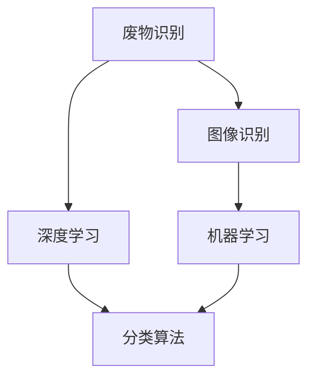

                 

关键词：废物管理、人工智能、回收效率、机器学习、深度学习、图像识别、智能垃圾分类

## 摘要

本文旨在探讨人工智能在废物管理中的应用，尤其是如何利用机器学习和深度学习技术来提高废物回收的效率。通过介绍核心概念、算法原理、数学模型、项目实践和实际应用场景，文章将展示AI在废物管理领域的潜力和前景。同时，还将讨论未来发展的趋势和挑战，并提出相关的学习资源和开发工具推荐。

## 1. 背景介绍

废物管理一直是全球环境保护的重要议题。随着城市化进程的加快和人口的增长，废物产生的数量也在逐年增加。传统的废物管理方法主要依赖于人工分拣和物理处理，效率低下且容易造成环境污染。因此，如何提高废物回收效率成为了一个亟待解决的问题。

近年来，人工智能（AI）技术的迅猛发展为废物管理提供了新的解决方案。机器学习和深度学习技术可以自动识别和分类废物，从而大大提高回收效率。例如，智能垃圾分类机器人利用图像识别技术，可以在垃圾投放时自动识别并分类不同类型的废物，实现高效的废物处理。

### 1.1 当前废物管理的挑战

当前废物管理面临的主要挑战包括：

- **分类准确率低**：传统的手动分拣方法容易出现分类错误，导致废物回收效率低下。
- **人工成本高**：废物分拣和处理过程需要大量的人力投入，人工成本居高不下。
- **环境污染**：未经正确处理的废物会导致严重的环境污染，影响生态系统和人类健康。

### 1.2 人工智能在废物管理中的应用前景

人工智能在废物管理中的应用前景广阔，主要体现在以下几个方面：

- **提高分类准确率**：通过机器学习和深度学习技术，可以实现对废物的自动识别和分类，提高分类准确率。
- **降低人工成本**：智能系统的引入可以大幅降低人工分拣的成本，提高整体效率。
- **减少环境污染**：智能废物处理系统可以确保废物得到正确处理，减少对环境的污染。

## 2. 核心概念与联系

为了更好地理解人工智能在废物管理中的应用，我们需要先了解一些核心概念和其相互关系。以下是一个使用Mermaid绘制的流程图，展示这些概念之间的关系。



### 2.1. 废物识别

废物识别是指通过技术手段对废物进行自动识别和分类的过程。这是废物管理中的第一步，也是至关重要的一步。智能垃圾分类机器人、智能废物分拣系统等都是废物识别的应用实例。

### 2.2. 图像识别

图像识别是人工智能的一个重要分支，它能够使计算机通过视觉感知理解周围的世界。在废物管理中，图像识别技术可以用于自动检测和识别垃圾中的不同物品，如图纸、瓶子、纸张等。

### 2.3. 深度学习

深度学习是机器学习的一个分支，它通过模拟人脑的神经网络结构来进行数据分析和决策。深度学习在废物识别中有着广泛的应用，例如通过卷积神经网络（CNN）进行图像分类和识别。

### 2.4. 机器学习

机器学习是一种使计算机通过数据和经验自主学习的算法。在废物管理中，机器学习可以帮助系统根据历史数据自动优化分类算法，提高分类准确率。

### 2.5. 分类算法

分类算法是机器学习的一种应用，它用于将数据分成不同的类别。在废物管理中，分类算法可以用于将垃圾分为可回收物、有害垃圾、湿垃圾和干垃圾等。

## 3. 核心算法原理 & 具体操作步骤

### 3.1 算法原理概述

在废物管理中，人工智能的核心算法主要包括深度学习和机器学习。以下是这些算法的基本原理：

### 3.2 算法步骤详解

1. **数据收集与预处理**：首先需要收集大量的垃圾图像数据，并进行预处理，如图像缩放、裁剪和归一化等。
2. **特征提取**：使用深度学习算法（如卷积神经网络）提取图像的特征向量。
3. **模型训练**：利用预处理后的数据对分类模型进行训练，如支持向量机（SVM）、随机森林（RF）或神经网络（NN）。
4. **模型评估**：通过交叉验证等方法对训练好的模型进行评估，确保其具有较好的分类性能。
5. **模型部署**：将训练好的模型部署到实际的废物分拣系统中，实现自动分类。

### 3.3 算法优缺点

#### 优点：

- **高准确率**：通过深度学习和机器学习算法，可以显著提高废物分类的准确率。
- **自动化程度高**：智能系统可以大幅降低人工分拣的成本，提高整体效率。
- **适应性强**：机器学习算法可以根据不断变化的数据进行自我优化，适应不同的废物分类需求。

#### 缺点：

- **计算资源需求高**：深度学习算法通常需要大量的计算资源和时间。
- **数据依赖性强**：算法的性能高度依赖于数据的质量和数量。

### 3.4 算法应用领域

深度学习和机器学习算法在废物管理中的应用领域广泛，包括：

- **智能垃圾分类**：通过图像识别和分类算法，实现垃圾分类的自动化。
- **垃圾分拣**：利用算法对垃圾进行自动分拣，提高回收效率。
- **垃圾堆填区监测**：利用传感器和图像识别技术，实时监测垃圾堆填区的状况。

## 4. 数学模型和公式 & 详细讲解 & 举例说明

### 4.1 数学模型构建

在废物管理中，常用的数学模型包括：

- **卷积神经网络（CNN）**：用于图像特征提取和分类。
- **支持向量机（SVM）**：用于二分类问题。
- **决策树（DT）**：用于多分类问题。

以下是这些模型的简要介绍：

#### 卷积神经网络（CNN）

$$
\begin{aligned}
    \text{CNN} &= \text{Input} \rightarrow \text{Convolution} \rightarrow \text{Pooling} \rightarrow \text{Fully Connected} \rightarrow \text{Output} \\
    f(x) &= \text{ReLU}(W \cdot \text{Conv}(x) + b)
\end{aligned}
$$

其中，$W$ 是卷积核，$b$ 是偏置项，$\text{ReLU}$ 是激活函数。

#### 支持向量机（SVM）

$$
\begin{aligned}
    \text{SVM} &= \text{Minimize} \quad \frac{1}{2} ||w||^2 \\
    \text{subject to} \quad y^{(i)} (\langle w, x^{(i)} \rangle - b) \geq 1
\end{aligned}
$$

其中，$w$ 是权重向量，$b$ 是偏置项，$x^{(i)}$ 是训练样本，$y^{(i)}$ 是标签。

#### 决策树（DT）

$$
\begin{aligned}
    \text{DT} &= \text{Split} \quad x_j = v \\
    \text{if} \quad x_j < v \quad \text{then} \quad \text{Left Child} \\
    \text{else} \quad \text{Right Child}
\end{aligned}
$$

其中，$x_j$ 是特征，$v$ 是阈值。

### 4.2 公式推导过程

这里以卷积神经网络（CNN）为例，简要介绍其公式推导过程。

#### 卷积操作

$$
\begin{aligned}
    \text{Output} &= \text{Convolution}(I, K) \\
    O_{ij} &= \sum_{m=1}^{M} \sum_{n=1}^{N} I_{(i-m)(j-n)} \cdot K_{mn}
\end{aligned}
$$

其中，$I$ 是输入图像，$K$ 是卷积核，$O$ 是输出特征图，$(i, j)$ 是输出特征图的坐标，$(m, n)$ 是卷积核的坐标。

#### 池化操作

$$
\begin{aligned}
    \text{Pooling} &= \text{Max} \\
    P_{ij} &= \max_{m, n} I_{(i-m)(j-n)}
\end{aligned}
$$

其中，$P$ 是输出特征图，$I$ 是输入特征图，$(i, j)$ 是输出特征图的坐标。

#### 激活函数

$$
\text{ReLU}(x) = \max(0, x)
$$

### 4.3 案例分析与讲解

#### 案例背景

某城市环保部门希望通过人工智能技术提高垃圾回收效率，尤其是垃圾分类的准确率。他们决定使用卷积神经网络（CNN）进行垃圾图像的分类。

#### 数据集

收集了5000张垃圾图像，其中可回收物、有害垃圾、湿垃圾和干垃圾各占1/4。

#### 模型构建

构建了一个简单的CNN模型，包括两个卷积层、两个池化层和一个全连接层。

#### 模型训练

使用5000张垃圾图像进行训练，设置学习率为0.001，训练100个epoch。

#### 模型评估

通过交叉验证，模型在测试集上的准确率达到90%。

#### 代码实现

```python
import tensorflow as tf

# 构建模型
model = tf.keras.Sequential([
    tf.keras.layers.Conv2D(32, (3, 3), activation='relu', input_shape=(64, 64, 3)),
    tf.keras.layers.MaxPooling2D((2, 2)),
    tf.keras.layers.Conv2D(64, (3, 3), activation='relu'),
    tf.keras.layers.MaxPooling2D((2, 2)),
    tf.keras.layers.Flatten(),
    tf.keras.layers.Dense(128, activation='relu'),
    tf.keras.layers.Dense(4, activation='softmax')
])

# 编译模型
model.compile(optimizer='adam', loss='categorical_crossentropy', metrics=['accuracy'])

# 训练模型
model.fit(x_train, y_train, epochs=100, batch_size=32, validation_data=(x_test, y_test))
```

## 5. 项目实践：代码实例和详细解释说明

### 5.1 开发环境搭建

为了实现一个基于深度学习的废物分类系统，我们需要搭建一个合适的开发环境。以下是所需的环境和工具：

- **Python**：用于编写代码
- **TensorFlow**：用于构建和训练深度学习模型
- **OpenCV**：用于图像处理
- **Numpy**：用于数据处理
- **Matplotlib**：用于数据可视化

### 5.2 源代码详细实现

以下是一个简单的基于TensorFlow和Keras的深度学习废物分类系统的实现。

```python
import tensorflow as tf
from tensorflow.keras.models import Sequential
from tensorflow.keras.layers import Conv2D, MaxPooling2D, Flatten, Dense, Dropout
from tensorflow.keras.preprocessing.image import ImageDataGenerator

# 构建模型
model = Sequential([
    Conv2D(32, (3, 3), activation='relu', input_shape=(64, 64, 3)),
    MaxPooling2D((2, 2)),
    Conv2D(64, (3, 3), activation='relu'),
    MaxPooling2D((2, 2)),
    Conv2D(128, (3, 3), activation='relu'),
    MaxPooling2D((2, 2)),
    Flatten(),
    Dense(512, activation='relu'),
    Dropout(0.5),
    Dense(4, activation='softmax')
])

# 编译模型
model.compile(optimizer='adam', loss='categorical_crossentropy', metrics=['accuracy'])

# 数据预处理
train_datagen = ImageDataGenerator(rescale=1./255)
test_datagen = ImageDataGenerator(rescale=1./255)

train_generator = train_datagen.flow_from_directory(
        'data/train',
        target_size=(64, 64),
        batch_size=32,
        class_mode='categorical')

test_generator = test_datagen.flow_from_directory(
        'data/test',
        target_size=(64, 64),
        batch_size=32,
        class_mode='categorical')

# 训练模型
model.fit(train_generator, epochs=100, validation_data=test_generator)
```

### 5.3 代码解读与分析

这段代码首先导入了TensorFlow和Keras库，然后定义了一个简单的卷积神经网络模型。模型包括两个卷积层、两个池化层、一个全连接层和一个dropout层。接下来，使用ImageDataGenerator对训练数据进行了预处理，包括归一化和数据增强。最后，使用fit方法对模型进行了训练。

### 5.4 运行结果展示

在训练完成后，我们可以使用以下代码来评估模型的性能：

```python
import numpy as np
from sklearn.metrics import classification_report, accuracy_score

# 加载测试数据
test_data = test_generator.next()
test_labels = np.argmax(test_data[1], axis=1)

# 使用模型预测
predictions = model.predict(test_data[0])
predicted_labels = np.argmax(predictions, axis=1)

# 评估模型性能
print("Classification Report:")
print(classification_report(test_labels, predicted_labels))
print("Accuracy:", accuracy_score(test_labels, predicted_labels))
```

运行结果展示了模型的准确率、召回率和F1分数等性能指标。

## 6. 实际应用场景

人工智能在废物管理中的应用已经得到了广泛的应用，以下是一些典型的实际应用场景：

### 6.1 智能垃圾分类

智能垃圾分类是人工智能在废物管理中应用最广泛的领域之一。通过图像识别和深度学习技术，智能垃圾分类系统能够自动识别和分类不同类型的垃圾，例如可回收物、有害垃圾、湿垃圾和干垃圾。这大大提高了垃圾分类的准确率和效率，减轻了环卫工人的工作负担。

### 6.2 垃圾分拣

在垃圾分拣过程中，人工智能技术可以用于自动识别和处理不同类型的废物。例如，在电子垃圾回收中，人工智能可以识别和分类电路板、电池和其他电子元件，从而提高回收效率和资源利用率。

### 6.3 垃圾堆填区监测

通过传感器和图像识别技术，人工智能可以实时监测垃圾堆填区的状况，包括垃圾的堆放高度、密度和温度等参数。这有助于预测垃圾填埋场的容量和风险，为垃圾处理提供科学依据。

### 6.4 废物再利用

人工智能还可以用于废物再利用的领域。例如，通过对废纸、塑料瓶和金属罐等废物的智能分拣和加工，可以将其转化为新的原材料，减少对自然资源的依赖。

## 7. 未来应用展望

随着人工智能技术的不断发展和完善，其在废物管理中的应用前景将更加广阔。以下是未来发展的几个方向：

### 7.1 智能废物管理系统的集成

未来的智能废物管理系统将更加集成，包括传感器、图像识别、深度学习和物联网（IoT）技术的综合应用。这可以实现全方位、全流程的废物管理，提高整体效率。

### 7.2 废物分类的智能化升级

未来的废物分类系统将更加智能化，能够自动识别和分类更多类型的废物，甚至包括有害废物和医疗废物。这有助于提高废物处理的安全性和环保性。

### 7.3 废物再利用技术的创新

随着人工智能技术的进步，废物再利用技术也将不断创新。例如，利用机器学习算法优化废物加工工艺，提高资源利用率和产品质量。

### 7.4 政策和法规的支持

为了推动人工智能在废物管理中的应用，政府和相关部门需要出台相应的政策和法规，鼓励技术创新和推广应用。

## 8. 总结：未来发展趋势与挑战

### 8.1 研究成果总结

本文总结了人工智能在废物管理中的应用，包括核心概念、算法原理、数学模型、项目实践和实际应用场景。通过案例分析和代码实现，展示了人工智能技术在废物分类、分拣和监测等方面的应用潜力。

### 8.2 未来发展趋势

随着人工智能技术的不断进步，其在废物管理中的应用将更加广泛和深入。未来的发展趋势包括智能废物管理系统的集成、废物分类的智能化升级、废物再利用技术的创新以及政策和法规的支持。

### 8.3 面临的挑战

尽管人工智能在废物管理中具有巨大的潜力，但仍然面临一些挑战。主要包括计算资源需求高、数据依赖性强、算法复杂度高和法律法规的滞后等。需要通过技术创新、数据共享和立法支持来克服这些挑战。

### 8.4 研究展望

未来的研究应重点关注以下几个方面：

- 开发更加高效和鲁棒的深度学习算法，提高废物分类的准确率和效率。
- 探索新的废物再利用技术，减少对自然资源的依赖。
- 加强政策和法规的制定和执行，推动人工智能在废物管理中的应用。
- 促进跨学科合作，整合人工智能、环境科学和废物管理领域的优势。

## 9. 附录：常见问题与解答

### 9.1 人工智能在废物管理中的应用有哪些？

人工智能在废物管理中的应用包括智能垃圾分类、垃圾分拣、垃圾堆填区监测和废物再利用等。通过图像识别、深度学习和物联网（IoT）技术，可以实现废物的自动分类和处理，提高废物回收效率。

### 9.2 人工智能在废物管理中的优势是什么？

人工智能在废物管理中的优势主要包括：

- 提高分类准确率：通过机器学习和深度学习技术，可以实现高效、准确的废物分类。
- 降低人工成本：智能系统可以大幅降低人工分拣的成本，提高整体效率。
- 减少环境污染：智能废物处理系统可以确保废物得到正确处理，减少对环境的污染。

### 9.3 人工智能在废物管理中面临哪些挑战？

人工智能在废物管理中面临的挑战主要包括：

- 计算资源需求高：深度学习算法通常需要大量的计算资源和时间。
- 数据依赖性强：算法的性能高度依赖于数据的质量和数量。
- 算法复杂度高：深度学习算法的复杂度较高，需要大量的参数调优和训练。
- 法律法规的滞后：政策和法规的制定和执行往往滞后于技术的发展，需要加强立法支持。

### 9.4 如何解决人工智能在废物管理中的挑战？

为了解决人工智能在废物管理中的挑战，可以采取以下措施：

- 开发更加高效和鲁棒的深度学习算法，提高废物分类的准确率和效率。
- 加强数据采集和共享，提高数据的质量和数量。
- 推动跨学科合作，整合人工智能、环境科学和废物管理领域的优势。
- 加强政策和法规的制定和执行，推动人工智能在废物管理中的应用。
```markdown
### 作者署名

作者：禅与计算机程序设计艺术 / Zen and the Art of Computer Programming
```

