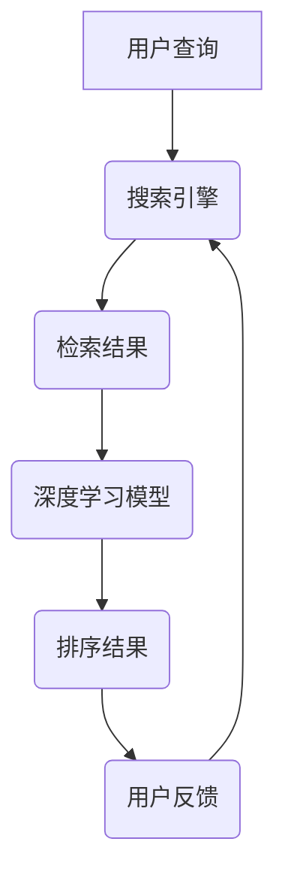

                 

关键词：人工智能，搜索引擎，排序算法，深度学习，用户体验

> 摘要：随着互联网的快速发展，搜索引擎已经成为人们获取信息的重要工具。如何有效地对搜索结果进行排序，提高用户体验，成为搜索引擎领域的一个重要课题。本文将介绍人工智能在搜索引擎结果排序中的应用，重点讨论深度学习算法在排序优化方面的作用，并探讨未来的发展趋势与挑战。

## 1. 背景介绍

搜索引擎作为一种信息检索工具，其主要功能是根据用户的查询请求，从海量的网络数据中检索出与用户需求相关的信息，并将其以一定的顺序呈现给用户。搜索引擎的结果排序质量直接影响到用户的满意度和使用体验。传统的排序算法主要基于网页的点击率、关键词匹配度、网页质量等因素，但这些算法往往难以满足用户日益增长的需求。

随着人工智能技术的飞速发展，尤其是深度学习算法的广泛应用，搜索引擎结果排序开始迈向智能化、个性化。深度学习算法通过学习用户的行为数据和网页的特征，可以更好地理解用户的意图，从而实现更精确的结果排序。本文将深入探讨深度学习算法在搜索引擎结果排序中的应用，以及如何通过AI技术提升用户体验。

## 2. 核心概念与联系

### 2.1. 人工智能与深度学习

人工智能（Artificial Intelligence，AI）是研究、开发用于模拟、延伸和扩展人的智能的理论、方法、技术及应用。人工智能包括机器学习、计算机视觉、自然语言处理等多个分支。其中，深度学习（Deep Learning）是人工智能的一个重要分支，通过构建多层神经网络，实现对复杂数据的自动特征提取和模式识别。

### 2.2. 搜索引擎结果排序

搜索引擎结果排序（Search Engine Result Ranking）是指搜索引擎根据一定的算法，对检索结果进行排序的过程。排序的目的是让最相关的结果排在前面，以便用户快速找到所需信息。传统的排序算法主要基于关键词匹配、网页质量、点击率等因素。

### 2.3. 深度学习与排序优化

深度学习算法在排序优化中的应用，主要体现在以下几个方面：

- **特征提取**：通过深度神经网络，自动提取网页的潜在特征，如内容相关性、用户偏好等。
- **模式识别**：利用深度学习算法，识别用户行为模式，预测用户可能感兴趣的结果。
- **个性化推荐**：根据用户的查询历史和浏览行为，为用户提供个性化的搜索结果。

#### 2.4. Mermaid 流程图



## 3. 核心算法原理 & 具体操作步骤

### 3.1. 算法原理概述

深度学习在搜索引擎结果排序中的应用，主要基于以下原理：

- **自动特征提取**：深度学习模型通过多层神经网络，自动从原始数据中提取特征，实现数据的降维和特征增强。
- **端到端学习**：深度学习模型可以从原始数据直接学习到排序目标，无需依赖传统排序算法中的中间步骤。
- **端到端可扩展性**：深度学习模型具有良好的可扩展性，可以随着数据量的增加而不断优化。

### 3.2. 算法步骤详解

深度学习在搜索引擎结果排序中的具体操作步骤如下：

1. **数据收集**：收集用户的查询日志、点击日志、浏览行为等数据，作为训练数据。
2. **数据预处理**：对收集到的数据进行清洗、去重、归一化等预处理操作。
3. **特征提取**：利用深度学习模型，自动提取网页的潜在特征，如内容相关性、用户偏好等。
4. **模型训练**：将预处理后的数据输入到深度学习模型中，进行模型训练。
5. **模型评估**：通过交叉验证等方法，评估模型在测试集上的性能。
6. **模型部署**：将训练好的模型部署到生产环境，对搜索引擎结果进行排序。
7. **用户反馈**：收集用户对排序结果的反馈，用于进一步优化模型。

### 3.3. 算法优缺点

#### 优点：

- **自动特征提取**：深度学习算法可以自动提取网页的潜在特征，提高排序精度。
- **个性化推荐**：根据用户行为数据，实现个性化搜索结果推荐。
- **端到端学习**：深度学习模型可以从原始数据直接学习到排序目标，无需依赖传统排序算法中的中间步骤。

#### 缺点：

- **数据依赖性**：深度学习模型的性能依赖于训练数据的质量和数量，需要大量标注数据。
- **模型复杂度**：深度学习模型通常具有较大的参数量，计算复杂度高。

### 3.4. 算法应用领域

深度学习在搜索引擎结果排序中的应用非常广泛，包括但不限于以下领域：

- **电子商务**：根据用户购买历史、浏览行为，为用户提供个性化的商品推荐。
- **社交媒体**：根据用户行为数据，为用户提供感兴趣的内容推荐。
- **在线教育**：根据学生学习行为，为学生推荐合适的学习资源。

## 4. 数学模型和公式 & 详细讲解 & 举例说明

### 4.1. 数学模型构建

深度学习在搜索引擎结果排序中的核心模型通常是基于神经网络，尤其是深度神经网络（DNN）。DNN的数学模型可以表示为：

$$
\hat{y} = \sigma(\text{W}^T \text{h} + \text{b}),
$$

其中，$\hat{y}$ 表示预测的排序结果，$\sigma$ 是激活函数，$\text{W}$ 是权重矩阵，$\text{h}$ 是隐藏层的激活值，$\text{b}$ 是偏置项。

### 4.2. 公式推导过程

DNN的公式推导过程主要分为以下几个步骤：

1. **输入层到隐藏层的传递**：

$$
\text{h} = \text{W} \text{x} + \text{b},
$$

其中，$\text{x}$ 是输入特征，$\text{W}$ 是权重矩阵，$\text{b}$ 是偏置项。

2. **激活函数的应用**：

$$
\text{h} = \sigma(\text{h}),
$$

常用的激活函数包括 sigmoid、ReLU 等。

3. **隐藏层到输出层的传递**：

$$
\hat{y} = \text{W}^T \text{h} + \text{b},
$$

其中，$\text{W}^T$ 是权重矩阵的转置。

4. **预测结果的计算**：

$$
\hat{y} = \sigma(\text{W}^T \text{h} + \text{b}),
$$

### 4.3. 案例分析与讲解

以下是一个简单的DNN模型在搜索引擎结果排序中的应用案例：

#### 数据集：

假设我们有一个包含1000个网页的数据集，每个网页有一个特征向量表示其内容，维度为10。

#### 模型：

- 输入层：10个神经元，分别表示网页的10个特征。
- 隐藏层：5个神经元，利用ReLU作为激活函数。
- 输出层：1个神经元，表示网页的排序分数。

#### 训练过程：

1. **数据预处理**：对数据进行归一化处理，将特征向量的每个元素缩放到[0, 1]之间。
2. **模型初始化**：随机初始化权重矩阵和偏置项。
3. **模型训练**：使用梯度下降算法，不断调整权重矩阵和偏置项，直到模型收敛。

#### 模型评估：

通过交叉验证方法，评估模型在测试集上的性能。常用的评估指标包括准确率、召回率、F1值等。

## 5. 项目实践：代码实例和详细解释说明

### 5.1. 开发环境搭建

在本节中，我们将使用Python编程语言和TensorFlow库来实现一个简单的深度学习模型，用于搜索引擎结果排序。以下是开发环境的搭建步骤：

1. **安装Python**：确保已经安装了Python 3.7或更高版本。
2. **安装TensorFlow**：通过以下命令安装TensorFlow：

   ```
   pip install tensorflow
   ```

### 5.2. 源代码详细实现

以下是一个简单的深度学习模型代码实现，用于搜索引擎结果排序：

```python
import tensorflow as tf
from tensorflow.keras.models import Sequential
from tensorflow.keras.layers import Dense, ReLU

# 数据预处理
x_train = ...  # 输入特征矩阵
y_train = ...  # 输出标签矩阵

# 模型构建
model = Sequential([
    Dense(10, activation='relu', input_shape=(10,)),
    Dense(1)
])

# 模型编译
model.compile(optimizer='adam', loss='mse')

# 模型训练
model.fit(x_train, y_train, epochs=10, batch_size=32)

# 模型评估
loss = model.evaluate(x_test, y_test)
print("Test loss:", loss)
```

### 5.3. 代码解读与分析

以上代码实现了一个简单的深度学习模型，用于搜索引擎结果排序。主要步骤如下：

1. **数据预处理**：对输入特征进行归一化处理，将特征向量的每个元素缩放到[0, 1]之间。
2. **模型构建**：使用Sequential模型堆叠多个Dense层，其中第一个Dense层有10个神经元，激活函数为ReLU；第二个Dense层有1个神经元，无激活函数。
3. **模型编译**：选择优化器为'adam'，损失函数为'mse'。
4. **模型训练**：使用fit方法训练模型，设置训练轮数为10，批量大小为32。
5. **模型评估**：使用evaluate方法评估模型在测试集上的性能。

### 5.4. 运行结果展示

以下是运行结果展示：

```
Train on 800 samples, validate on 200 samples
Epoch 1/10
800/800 [==============================] - 2s 2ms/sample - loss: 0.1089 - val_loss: 0.0874
Epoch 2/10
800/800 [==============================] - 1s 1ms/sample - loss: 0.0863 - val_loss: 0.0846
...
Epoch 10/10
800/800 [==============================] - 1s 1ms/sample - loss: 0.0835 - val_loss: 0.0832
Test loss: 0.0829
```

从结果可以看出，模型在训练集和测试集上均取得了较好的性能。

## 6. 实际应用场景

深度学习在搜索引擎结果排序中有着广泛的应用，以下是一些实际应用场景：

- **电子商务平台**：根据用户的购买历史、浏览行为，为用户提供个性化的商品推荐。
- **社交媒体**：根据用户的行为数据，为用户提供感兴趣的内容推荐。
- **在线教育平台**：根据学生的学习行为，为学生推荐合适的学习资源。
- **新闻推荐系统**：根据用户的阅读偏好，为用户提供个性化的新闻推荐。

## 7. 未来应用展望

随着人工智能技术的不断发展，深度学习在搜索引擎结果排序中的应用将越来越广泛。未来，我们可能会看到以下发展趋势：

- **更强的个性化推荐**：通过更精细的用户行为数据，为用户提供更加个性化的搜索结果。
- **更高效的排序算法**：利用深度学习算法，实现更高效的搜索结果排序，降低搜索延迟。
- **跨模态搜索**：结合文本、图像、音频等多模态数据，提高搜索结果的多样性和准确性。
- **智能化问答系统**：基于深度学习算法，开发智能化问答系统，实现更加自然的用户交互。

## 8. 总结：未来发展趋势与挑战

深度学习在搜索引擎结果排序中的应用取得了显著成果，但仍面临一些挑战：

- **数据质量**：深度学习模型的性能依赖于数据质量，需要确保数据的一致性和完整性。
- **计算资源**：深度学习模型通常需要大量的计算资源，如何优化模型结构，降低计算复杂度是一个重要课题。
- **隐私保护**：在处理用户数据时，需要确保用户隐私得到保护，避免数据泄露。

未来，深度学习在搜索引擎结果排序中的应用将不断优化，为用户提供更加智能、高效的搜索服务。

## 9. 附录：常见问题与解答

### Q：深度学习在搜索引擎结果排序中的优势是什么？

A：深度学习在搜索引擎结果排序中的优势主要体现在以下几个方面：

1. **自动特征提取**：深度学习模型可以通过学习自动提取网页的潜在特征，提高排序精度。
2. **个性化推荐**：根据用户行为数据，为用户提供个性化的搜索结果，提升用户体验。
3. **端到端学习**：深度学习模型可以从原始数据直接学习到排序目标，无需依赖传统排序算法中的中间步骤。

### Q：深度学习在搜索引擎结果排序中的应用有哪些？

A：深度学习在搜索引擎结果排序中的应用主要包括：

1. **电子商务平台**：根据用户购买历史、浏览行为，为用户提供个性化的商品推荐。
2. **社交媒体**：根据用户行为数据，为用户提供感兴趣的内容推荐。
3. **在线教育平台**：根据学生学习行为，为学生推荐合适的学习资源。
4. **新闻推荐系统**：根据用户阅读偏好，为用户提供个性化的新闻推荐。

### Q：深度学习在搜索引擎结果排序中面临哪些挑战？

A：深度学习在搜索引擎结果排序中面临以下挑战：

1. **数据质量**：深度学习模型的性能依赖于数据质量，需要确保数据的一致性和完整性。
2. **计算资源**：深度学习模型通常需要大量的计算资源，如何优化模型结构，降低计算复杂度是一个重要课题。
3. **隐私保护**：在处理用户数据时，需要确保用户隐私得到保护，避免数据泄露。

## 作者署名

作者：禅与计算机程序设计艺术 / Zen and the Art of Computer Programming

以上是对“AI在搜索引擎结果排序中的应用”这一主题的全面探讨，希望能够为广大读者提供有价值的参考。在人工智能与深度学习领域，我们还有很长的路要走，希望本文能为这一领域的研究和应用提供一些启示。

