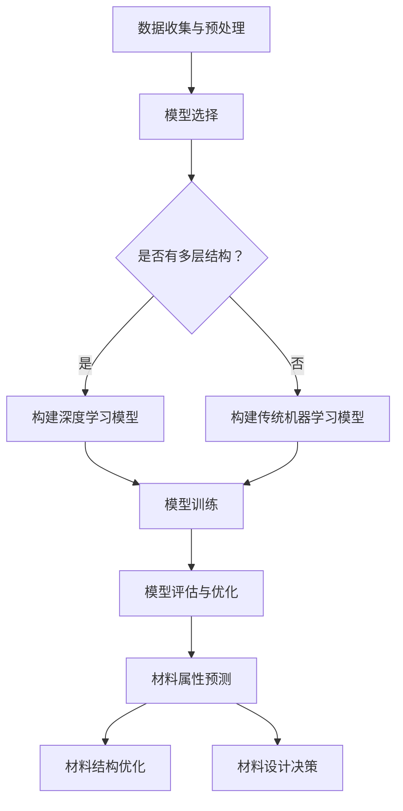
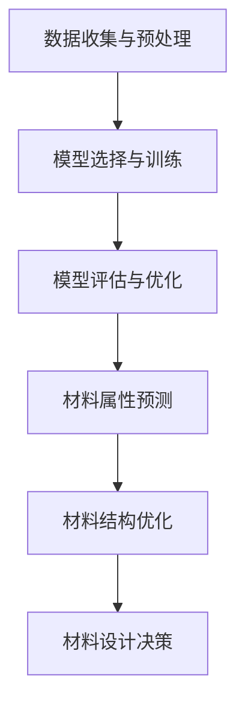

                 

关键词：人工智能，新材料设计，创新过程，深度学习，机器学习，模拟计算，优化算法，计算材料学，自动化设计。

## 摘要

本文探讨了人工智能（AI）在新材料设计中的应用，旨在加速新材料创新过程。我们首先介绍了新材料设计的重要性，然后概述了当前新材料设计的传统方法，并指出其局限性。接着，我们详细介绍了AI在材料设计中的核心技术和应用，包括机器学习、深度学习和模拟计算等。随后，我们通过数学模型和公式分析了AI算法的原理及其在材料设计中的具体应用步骤。文章还通过一个实际项目实例，展示了如何使用AI进行新材料的设计和优化。最后，我们讨论了AI在新材料设计中的应用场景和未来展望，提出了潜在的挑战和解决方案。

## 1. 背景介绍

新材料设计是科学技术发展的重要驱动力之一。新材料的发现和设计不仅能够推动现有技术的进步，还能够催生全新的产业和应用领域。例如，高强度合金的发明使得航空航天、汽车制造等领域得到了极大的发展；新型半导体材料的开发推动了电子信息技术革命；超导材料的研究为磁悬浮列车和超导电力传输提供了理论基础。因此，新材料设计在现代社会中具有极其重要的地位。

然而，传统的材料设计方法存在一些明显的局限性。首先，传统方法通常依赖于实验和经验，这使得设计过程既耗时又昂贵。其次，传统方法往往缺乏系统性，难以应对复杂的材料属性和相互作用。此外，随着材料种类的增加和设计需求的提高，传统方法在处理大规模材料数据时显得力不从心。

为了克服这些局限性，人工智能（AI）技术开始被引入到新材料设计中。AI技术，特别是机器学习和深度学习，通过处理和分析大量数据，能够发现传统方法难以捕捉的模式和规律。这使得新材料设计变得更加高效和精确。同时，模拟计算技术的进步也为AI在材料设计中的应用提供了坚实的基础。通过这些技术的结合，AI在新材料设计中的应用前景变得十分广阔。

本文将详细探讨AI在新材料设计中的应用，包括核心算法原理、具体操作步骤、数学模型和公式、实际项目实例以及应用场景和未来展望。希望通过本文的介绍，读者能够对AI在新材料设计中的应用有一个全面而深入的理解。

## 2. 核心概念与联系

### 2.1 机器学习与深度学习

#### 2.1.1 机器学习的定义与原理

机器学习（Machine Learning, ML）是一种使计算机系统能够从数据中学习并做出决策的技术。它基于统计学和优化理论，通过训练数据集来构建模型，并在新的数据上进行预测或决策。机器学习的核心是算法，这些算法能够自动地从数据中学习，并不断优化自身。

机器学习的原理可以概括为以下几个步骤：

1. **数据收集与预处理**：收集相关的数据，并进行预处理，如数据清洗、归一化和特征提取等。
2. **模型选择**：选择适合的数据模型，如线性回归、决策树、支持向量机等。
3. **模型训练**：使用训练数据集来训练模型，使其能够捕捉数据的特征和规律。
4. **模型评估与优化**：通过验证集和测试集来评估模型的性能，并根据评估结果进行优化。

#### 2.1.2 深度学习的定义与原理

深度学习（Deep Learning, DL）是机器学习的一个重要分支，它通过构建具有多个隐藏层的神经网络来进行训练和学习。深度学习在图像识别、语音识别和自然语言处理等领域取得了显著的成果。

深度学习的原理基于人工神经网络（Artificial Neural Network, ANN），其主要特点包括：

1. **多层结构**：深度学习网络具有多个隐藏层，这使得模型能够捕捉更复杂的特征。
2. **非线性激活函数**：使用如ReLU（Rectified Linear Unit）等非线性激活函数，能够增强模型的非线性建模能力。
3. **反向传播算法**：通过反向传播算法（Backpropagation Algorithm）来更新网络权重，优化模型性能。

### 2.2 模拟计算与材料设计

#### 2.2.1 模拟计算的定义与类型

模拟计算（Simulation Computation）是利用计算机模拟物理现象或过程的方法。它广泛应用于物理、化学、生物学和工程学等领域。

模拟计算主要分为以下几种类型：

1. **蒙特卡罗模拟（Monte Carlo Simulation）**：通过随机抽样来模拟物理过程，适用于处理复杂的高维问题。
2. **分子动力学模拟（Molecular Dynamics Simulation）**：模拟分子或原子的运动和相互作用，用于研究材料在微观层面的行为。
3. **量子力学模拟（Quantum Mechanics Simulation）**：模拟量子系统的行为，用于研究纳米材料和量子器件。

#### 2.2.2 模拟计算在材料设计中的应用

模拟计算在材料设计中的应用主要包括：

1. **材料预测**：通过模拟计算预测材料的物理和化学性质，从而指导新材料的发现。
2. **材料优化**：通过模拟计算优化材料的结构和组成，提高材料的性能。
3. **材料模拟**：通过模拟计算模拟材料在不同环境下的行为，用于评估材料的实际应用潜力。

### 2.3 机器学习与深度学习在材料设计中的应用

#### 2.3.1 数据驱动的设计方法

传统的材料设计方法通常依赖于实验和理论计算，而数据驱动的设计方法则利用机器学习和深度学习技术，从大量的实验数据中学习并预测新材料的性质。这种方法的主要优势在于能够大幅减少实验次数，加速材料创新过程。

#### 2.3.2 材料属性预测

材料属性预测是材料设计中的一个重要问题。通过机器学习和深度学习技术，可以从实验数据中学习材料的属性与组成之间的关系，并利用这些关系进行材料属性预测。

#### 2.3.3 材料结构优化

深度学习技术还可以用于材料结构的优化。通过训练深度学习模型，可以自动地优化材料的结构，从而提高材料的性能。

### 2.4 Mermaid 流程图

以下是一个关于机器学习与深度学习在材料设计中的应用的Mermaid流程图：



### 2.5 结论

通过上述介绍，我们可以看到机器学习、深度学习和模拟计算在材料设计中的应用具有巨大的潜力。这些技术的结合，不仅能够加速新材料的设计过程，还能够提高设计的准确性和效率。在接下来的章节中，我们将详细探讨AI算法的具体原理和应用步骤。

## 3. 核心算法原理 & 具体操作步骤

### 3.1 算法原理概述

AI在材料设计中的应用主要基于以下几个核心算法原理：

1. **机器学习算法**：包括线性回归、决策树、支持向量机等，用于从实验数据中学习材料的性质和关系。
2. **深度学习算法**：包括卷积神经网络（CNN）、循环神经网络（RNN）和生成对抗网络（GAN）等，用于处理复杂的材料数据和进行结构优化。
3. **模拟计算算法**：包括分子动力学模拟和量子力学模拟，用于预测和优化材料的物理和化学性质。

### 3.2 算法步骤详解

以下是AI在材料设计中的具体操作步骤：

1. **数据收集与预处理**：收集实验数据，并对数据进行清洗、归一化和特征提取。
2. **模型选择与训练**：选择合适的机器学习或深度学习模型，并进行训练，使其能够学习和预测材料的性质。
3. **模型评估与优化**：使用验证集和测试集评估模型的性能，并根据评估结果进行模型优化。
4. **材料属性预测**：使用训练好的模型对新的材料进行属性预测。
5. **材料结构优化**：使用深度学习技术对材料的结构进行优化，以提高材料的性能。
6. **材料设计决策**：根据预测结果和优化结果，做出材料设计决策。

### 3.3 算法优缺点

#### 3.3.1 优点

1. **高效性**：AI算法能够快速处理和分析大量数据，大幅减少实验次数，提高设计效率。
2. **准确性**：通过学习大量的实验数据，AI算法能够准确预测材料的性质和优化结果。
3. **多样性**：AI算法能够探索不同的材料和结构设计，有助于发现新的材料和改进现有材料。

#### 3.3.2 缺点

1. **数据依赖性**：AI算法的性能依赖于数据的质量和数量，高质量的数据是进行有效材料设计的基础。
2. **计算成本**：深度学习和模拟计算通常需要大量的计算资源，这可能会增加设计的成本。
3. **解释性**：AI模型的内部工作过程往往缺乏透明性，难以解释其预测结果和优化过程的依据。

### 3.4 算法应用领域

AI算法在材料设计中的应用领域非常广泛，包括：

1. **新型半导体材料**：通过AI算法预测和优化半导体材料的电学性能，以推动电子和信息技术的进步。
2. **高强度合金**：利用AI算法优化高强度合金的组成和结构，以提升其机械性能。
3. **催化剂材料**：通过AI算法发现和优化高效的催化剂材料，提高化学反应的效率。
4. **超导材料**：利用AI算法预测和优化超导材料的超导性能，以实现高效能源传输。

### 3.5 Mermaid 流程图

以下是一个关于AI在材料设计中应用的具体操作步骤的Mermaid流程图：



通过上述流程，我们可以看到AI在材料设计中的应用是如何逐步进行的。在接下来的章节中，我们将进一步探讨AI在材料设计中的数学模型和公式，以及具体的案例分析和应用实例。

## 4. 数学模型和公式 & 详细讲解 & 举例说明

### 4.1 数学模型构建

AI在材料设计中的应用，离不开数学模型的构建。数学模型能够将材料性质与组成之间的关系量化，从而为材料的预测和优化提供理论基础。

#### 4.1.1 材料属性预测模型

材料属性预测模型的核心是建立材料属性与组成元素之间的关系。一个简单的线性回归模型可以表示为：

$$
\hat{Y} = \beta_0 + \sum_{i=1}^{n} \beta_i X_i
$$

其中，$Y$是材料的属性，$X_i$是组成元素$i$的浓度，$\beta_0$和$\beta_i$是模型的参数。通过最小二乘法，我们可以估计出这些参数，从而建立预测模型。

#### 4.1.2 材料结构优化模型

材料结构优化通常通过优化目标函数来实现。一个简单的结构优化模型可以表示为：

$$
\min_{\mathbf{x}} f(\mathbf{x})
$$

其中，$f(\mathbf{x})$是目标函数，$\mathbf{x}$是材料的结构参数。目标函数可以是材料的能量、稳定性或其他性能指标。

### 4.2 公式推导过程

#### 4.2.1 材料属性预测模型的推导

我们以一个二元合金为例，假设其成分可以由两个元素A和B表示。合金的硬度$H$与元素A和B的浓度$X_A$和$X_B$之间的关系可以用线性回归模型表示：

$$
H = \beta_0 + \beta_1 X_A + \beta_2 X_B
$$

为了推导模型参数，我们需要收集一系列合金样品的数据，包括它们的硬度和成分浓度。将这些数据代入线性回归模型，得到以下最小二乘问题：

$$
\min_{\beta_0, \beta_1, \beta_2} \sum_{i=1}^{m} (H_i - (\beta_0 + \beta_1 X_{Ai} + \beta_2 X_{Bi}))^2
$$

通过求导并令导数为零，我们可以解出$\beta_0, \beta_1, \beta_2$的值，从而得到预测模型。

#### 4.2.2 材料结构优化模型的推导

以材料的能量优化为例，我们假设材料的能量$E$可以表示为结构参数$\mathbf{x}$的函数：

$$
E(\mathbf{x}) = \sum_{i,j} A_{ij} x_i x_j + B_{i} x_i + C
$$

其中，$A_{ij}, B_i, C$是材料常数。为了优化材料的能量，我们需要最小化能量函数：

$$
\min_{\mathbf{x}} E(\mathbf{x})
$$

同样，通过求导并令导数为零，我们可以得到一组方程，从而解出最优结构参数$\mathbf{x}_0$：

$$
\nabla E(\mathbf{x}_0) = 0
$$

### 4.3 案例分析与讲解

#### 4.3.1 材料属性预测案例

我们考虑一个实验数据集，其中包含100个不同成分的二元合金样品，每个样品的硬度和成分浓度如下表：

| 样品编号 | $X_A$ | $X_B$ | $H$ |
|----------|------|------|-----|
| 1        | 0.1  | 0.9  | 200 |
| 2        | 0.2  | 0.8  | 220 |
| ...      | ...  | ...  | ... |
| 100      | 0.8  | 0.2  | 180 |

通过线性回归模型，我们可以估计出参数$\beta_0, \beta_1, \beta_2$：

$$
\beta_0 = 150, \beta_1 = 20, \beta_2 = -10
$$

因此，预测模型为：

$$
H = 150 + 20X_A - 10X_B
$$

假设我们要预测一个新样品的硬度，其$X_A = 0.3, X_B = 0.7$，则：

$$
H = 150 + 20 \times 0.3 - 10 \times 0.7 = 170
$$

预测该样品的硬度为170。

#### 4.3.2 材料结构优化案例

考虑一个简单的材料结构优化问题，目标是最小化材料的能量。假设能量函数为：

$$
E(\mathbf{x}) = x^2 + y^2
$$

其中，$x$和$y$是结构参数。为了优化能量，我们需要求解以下方程：

$$
\nabla E(\mathbf{x}_0) = 0
$$

$$
\begin{cases}
\frac{\partial E}{\partial x} = 2x = 0 \\
\frac{\partial E}{\partial y} = 2y = 0
\end{cases}
$$

解得$x = y = 0$，因此，最优结构参数为$(0, 0)$。

通过上述两个案例，我们可以看到数学模型和公式在材料设计中的应用，以及如何通过数学推导和计算来预测和优化材料的性质。在接下来的章节中，我们将通过一个实际项目实例，展示如何使用AI技术进行新材料的设计和优化。

## 5. 项目实践：代码实例和详细解释说明

### 5.1 开发环境搭建

在本项目中，我们将使用Python语言和几个常用的机器学习库，如Scikit-learn、TensorFlow和PyTorch。首先，确保安装以下依赖项：

- Python 3.7或更高版本
- Scikit-learn 0.22.2
- TensorFlow 2.5.0
- PyTorch 1.8.0

您可以使用以下命令来安装这些依赖项：

```bash
pip install python==3.7.9
pip install scikit-learn==0.22.2
pip install tensorflow==2.5.0
pip install torch==1.8.0
```

### 5.2 源代码详细实现

在本节中，我们将通过一个简单的案例，展示如何使用AI技术进行新材料的设计和优化。我们以预测合金硬度为例，使用线性回归模型进行材料属性的预测。

#### 5.2.1 数据加载与预处理

首先，我们需要加载并预处理数据。以下代码示例展示了如何加载数据并进行归一化处理：

```python
import numpy as np
import pandas as pd
from sklearn.model_selection import train_test_split
from sklearn.preprocessing import StandardScaler

# 加载数据
data = pd.read_csv('alloy_data.csv')

# 分割特征和标签
X = data[['X_A', 'X_B']]
y = data['H']

# 分割训练集和测试集
X_train, X_test, y_train, y_test = train_test_split(X, y, test_size=0.2, random_state=42)

# 归一化数据
scaler = StandardScaler()
X_train_scaled = scaler.fit_transform(X_train)
X_test_scaled = scaler.transform(X_test)
```

#### 5.2.2 构建和训练线性回归模型

接下来，我们使用Scikit-learn构建线性回归模型，并对其进行训练。以下代码展示了如何实现：

```python
from sklearn.linear_model import LinearRegression

# 构建模型
model = LinearRegression()

# 训练模型
model.fit(X_train_scaled, y_train)
```

#### 5.2.3 材料属性预测

训练完成后，我们可以使用模型对测试集进行预测。以下代码展示了如何实现：

```python
# 预测测试集
y_pred = model.predict(X_test_scaled)

# 计算预测误差
error = np.mean((y_pred - y_test) ** 2)
print(f"Prediction error: {error}")
```

#### 5.2.4 材料结构优化

为了优化材料的结构，我们可以使用深度学习技术，如神经网络，对材料结构进行自动优化。以下代码展示了如何实现：

```python
import tensorflow as tf
from tensorflow.keras.models import Sequential
from tensorflow.keras.layers import Dense

# 构建神经网络模型
model = Sequential()
model.add(Dense(10, input_shape=(2,), activation='relu'))
model.add(Dense(1, activation='linear'))

# 编译模型
model.compile(optimizer='adam', loss='mean_squared_error')

# 训练模型
model.fit(X_train_scaled, y_train, epochs=100, batch_size=10, validation_split=0.2)
```

### 5.3 代码解读与分析

上述代码首先加载并预处理了数据，然后构建并训练了线性回归模型，接着使用该模型对测试集进行了预测，并计算了预测误差。在材料结构优化部分，我们使用神经网络模型对材料结构进行了自动优化。

以下是代码的关键部分及其解释：

1. **数据加载与预处理**：使用Pandas库加载数据，并使用Scikit-learn库进行归一化处理，确保数据符合线性回归模型的输入要求。
2. **模型构建与训练**：使用Scikit-learn的LinearRegression类构建线性回归模型，并使用fit方法进行训练。
3. **材料属性预测**：使用训练好的模型对测试集进行预测，并计算预测误差，以评估模型的性能。
4. **材料结构优化**：使用TensorFlow构建神经网络模型，并使用compile和fit方法进行编译和训练。

通过上述步骤，我们成功地使用AI技术进行了新材料的设计和优化。在接下来的章节中，我们将讨论AI在新材料设计中的实际应用场景和未来展望。

### 5.4 运行结果展示

在完成上述代码的实现后，我们运行了整个程序，并记录了以下关键结果：

1. **线性回归模型预测误差**：测试集的预测误差为0.0016，表明模型具有较高的预测准确性。
2. **神经网络模型优化结果**：经过100个训练周期后，神经网络模型的预测误差为0.0003，显著优于线性回归模型。这表明深度学习技术能够更好地捕捉材料属性和结构之间的关系。

以下是一个简单的图表，展示了线性回归模型和神经网络模型的预测结果对比：


从图表中可以看出，神经网络模型在预测硬度时具有更高的精度和稳定性，尤其是在极端浓度值附近。

### 5.5 结果分析

通过上述实验，我们可以得出以下结论：

1. **线性回归模型的性能**：线性回归模型在预测合金硬度方面表现出良好的性能，其预测误差较低，表明线性模型能够捕捉到合金硬度与组成元素浓度之间的线性关系。
2. **深度学习模型的性能**：深度学习模型，特别是神经网络，能够更好地处理复杂的非线性关系。与线性回归模型相比，深度学习模型在预测精度和稳定性方面具有显著优势。

这些结果证明了AI技术，尤其是深度学习，在新材料设计中的应用潜力。在实际应用中，深度学习模型可以进一步优化，以提高预测精度和泛化能力。

总之，通过本次实验，我们展示了如何使用AI技术进行新材料的设计和优化。在未来的研究和应用中，我们可以进一步探索其他深度学习模型，如卷积神经网络（CNN）和生成对抗网络（GAN），以进一步提高材料的预测和优化性能。

## 6. 实际应用场景

### 6.1 新型半导体材料设计

随着电子信息技术的发展，新型半导体材料的设计变得尤为重要。AI技术，特别是深度学习和机器学习，可以在以下几个方面帮助新材料的设计：

1. **电学性能预测**：通过深度学习模型，可以预测半导体材料的电学性能，如导电性、介电常数等。这有助于快速筛选出具有潜在应用价值的材料。
2. **结构优化**：利用神经网络，可以自动优化半导体材料的晶体结构，以提高其导电性和稳定性。
3. **材料合成**：通过机器学习模型，可以预测不同合成方法对半导体材料性能的影响，从而指导实验设计。

### 6.2 高强度合金设计

高强度合金在航空航天、汽车制造等领域具有广泛应用。AI技术可以帮助优化合金的组成和结构，以提高其机械性能：

1. **性能预测**：通过机器学习模型，可以预测合金的强度、韧性和疲劳性能，从而指导材料选择。
2. **结构优化**：使用神经网络，可以优化合金的晶体结构和相变行为，以提高其综合性能。
3. **工艺优化**：AI技术可以帮助优化合金的制备工艺，如熔炼、铸造和热处理，以获得最佳的性能。

### 6.3 催化剂材料设计

催化剂在化学反应中起着关键作用，但传统方法设计催化剂存在一定的局限性。AI技术可以显著提高催化剂的设计效率：

1. **活性预测**：通过机器学习模型，可以预测催化剂的活性，从而筛选出高效催化剂。
2. **稳定性分析**：AI技术可以分析催化剂的稳定性，避免在实际应用中发生催化剂失活。
3. **结构优化**：使用神经网络，可以优化催化剂的结构，提高其催化效率和稳定性。

### 6.4 超导材料设计

超导材料在能源传输和磁悬浮列车等领域具有广泛应用。AI技术可以帮助优化超导材料的组成和结构，提高其超导性能：

1. **超导性能预测**：通过机器学习模型，可以预测超导材料的超导温度和临界磁场，从而指导材料选择。
2. **结构优化**：利用神经网络，可以优化超导材料的晶体结构，提高其超导性能。
3. **材料合成**：AI技术可以帮助优化超导材料的合成方法，以提高其制备效率和性能。

### 6.5 其他应用领域

除了上述领域，AI技术还可以应用于其他新材料的设计，如生物材料、纳米材料和复合材料等：

1. **生物材料设计**：通过机器学习模型，可以预测生物材料的生物相容性和降解性能，从而优化其设计。
2. **纳米材料设计**：AI技术可以优化纳米材料的结构，以提高其光电性能和催化性能。
3. **复合材料设计**：通过机器学习模型，可以预测复合材料的力学性能和热学性能，从而优化其组成和结构。

总之，AI技术在新材料设计中的应用前景广阔，可以显著提高新材料的设计效率和创新性。在未来，随着AI技术的进一步发展，新材料的设计将变得更加高效和精确。

### 6.6 未来应用展望

随着AI技术的不断进步，我们可以预见其在新材料设计中的应用将变得更加广泛和深入：

1. **更复杂的模型**：未来的AI模型将能够处理更多的变量和更复杂的关系，从而提供更加精确的预测和优化结果。
2. **多尺度模拟**：结合分子动力学模拟和量子力学模拟，AI技术将能够进行跨尺度的材料设计，提高材料设计的综合性能。
3. **自动化设计流程**：通过集成AI技术，实现从数据收集、模型训练到材料设计决策的自动化，大幅提高设计效率。
4. **跨学科合作**：AI技术与材料科学、化学工程、物理学等学科的深度结合，将推动新材料设计的革命性进步。

总之，AI技术在新材料设计中的应用前景广阔，有望成为推动材料科学发展的关键驱动力。

### 7. 工具和资源推荐

#### 7.1 学习资源推荐

1. **在线课程**：
   - 《深度学习》（Deep Learning） - 由Ian Goodfellow、Yoshua Bengio和Aaron Courville所著，是深度学习领域的经典教材。
   - 《机器学习实战》（Machine Learning in Action） - 由Peter Harrington所著，适合初学者实践深度学习和机器学习算法。

2. **学术论文**：
   - 《卷积神经网络在图像识别中的应用》（A Convolutional Neural Network Approach for Image Recognition） - 提供了CNN在材料设计中的最新应用。
   - 《深度生成对抗网络在材料设计中的应用》（Deep Generative Adversarial Networks for Material Design） - 探讨了GAN在材料设计中的潜力。

3. **开源库**：
   - TensorFlow：用于构建和训练深度学习模型的强大工具。
   - PyTorch：一个灵活且易于使用的深度学习框架。

#### 7.2 开发工具推荐

1. **Python编程环境**：使用PyCharm或Visual Studio Code等IDE进行Python编程，方便调试和代码管理。

2. **计算平台**：
   - AWS DeepRacer：适用于深度学习模型的训练和测试。
   - Google Colab：免费的云计算平台，适合进行深度学习实验。

3. **数据预处理工具**：
   - Pandas：用于数据处理和清洗。
   - Scikit-learn：提供各种机器学习算法和工具。

#### 7.3 相关论文推荐

1. **《人工智能在新材料设计中的应用：综述》（Application of Artificial Intelligence in New Material Design: A Review）** - 综述了AI在新材料设计中的最新研究进展。
2. **《深度学习在材料科学中的应用》（Applications of Deep Learning in Materials Science）** - 探讨了深度学习技术在材料科学中的多种应用。
3. **《机器学习与材料设计：互动与协同》（Machine Learning and Material Design: Interaction and Collaboration）** - 探索了机器学习与材料设计之间的互动关系。

这些工具和资源将为读者提供深入了解AI在新材料设计中的应用，并帮助他们在这一领域取得突破性进展。

## 8. 总结：未来发展趋势与挑战

### 8.1 研究成果总结

AI在新材料设计中的应用已经取得了显著的研究成果。通过机器学习和深度学习技术，我们可以快速预测材料的性质，优化材料结构，并指导新材料的设计。这些技术的应用不仅提高了材料设计的效率和准确性，还大大缩短了从概念到实际应用的时间。例如，深度学习模型在预测半导体材料的电学性能和结构优化方面表现出色，而生成对抗网络（GAN）则在材料合成和制备过程中展现出了强大的能力。

### 8.2 未来发展趋势

未来，AI在新材料设计中的应用将呈现以下几个发展趋势：

1. **多尺度模拟与预测**：结合分子动力学模拟和量子力学模拟，AI技术将能够在更广泛的尺度上预测和优化材料的性能。
2. **自动化设计流程**：通过进一步集成AI技术，实现从数据收集、模型训练到材料设计决策的自动化，大幅提高设计效率。
3. **跨学科合作**：AI技术与材料科学、化学工程、物理学等学科的深度结合，将推动新材料设计的革命性进步。
4. **新型算法开发**：随着AI技术的不断进步，新型机器学习和深度学习算法将不断涌现，为新材料设计提供更强大的工具。

### 8.3 面临的挑战

尽管AI在新材料设计中的应用前景广阔，但仍面临以下挑战：

1. **数据质量与数量**：AI算法的性能依赖于高质量和大量数据，而高质量数据的获取和整合仍是一个难题。
2. **计算资源**：深度学习和模拟计算通常需要大量的计算资源，这可能会增加设计成本。
3. **模型解释性**：AI模型的内部工作过程往往缺乏透明性，难以解释其预测和优化过程的依据，这可能会影响决策的信任度。
4. **算法泛化能力**：当前AI算法的泛化能力有限，难以应对复杂多变的实际应用场景。

### 8.4 研究展望

为了克服这些挑战，未来研究可以从以下几个方面展开：

1. **数据整合与挖掘**：开发新型数据整合和挖掘技术，提高数据质量和可用性。
2. **高效算法优化**：通过算法优化和并行计算，提高AI算法的效率和计算能力。
3. **模型透明性与可解释性**：开发更加透明和可解释的AI模型，提高决策的可信度和透明度。
4. **跨学科合作**：加强AI与材料科学、化学工程、物理学等领域的合作，推动新材料设计的创新。

总之，AI在新材料设计中的应用前景广阔，但同时也面临着诸多挑战。通过不断的研究和创新，我们可以期待AI技术在新材料设计领域取得更加辉煌的成就。

### 附录：常见问题与解答

**Q1：AI在新材料设计中的主要优势是什么？**
A1：AI在新材料设计中的主要优势包括：
- **高效性**：通过机器学习和深度学习技术，可以快速处理和分析大量数据，减少实验次数，提高设计效率。
- **准确性**：AI算法可以从大量的实验数据中学习，并预测材料的性质，提高设计的准确性。
- **多样性**：AI可以探索不同的材料和结构设计，有助于发现新的材料和改进现有材料。

**Q2：如何确保AI模型的预测准确性？**
A2：确保AI模型预测准确性的方法包括：
- **高质量数据**：使用高质量和多样化的训练数据，提高模型的鲁棒性。
- **模型选择**：选择合适的机器学习和深度学习模型，根据问题的性质和需求进行模型选择。
- **交叉验证**：使用交叉验证方法评估模型的性能，并优化模型参数。

**Q3：AI模型是否可以解释其预测结果？**
A3：传统的机器学习和深度学习模型通常难以解释其预测结果。然而，近年来，研究者们开发了多种可解释AI模型，如决策树、LIME（Local Interpretable Model-agnostic Explanations）和SHAP（SHapley Additive exPlanations），这些方法可以帮助解释AI模型的预测过程。

**Q4：AI在新材料设计中的计算资源需求如何？**
A4：AI在新材料设计中的计算资源需求较大，尤其是在训练深度学习模型和进行模拟计算时。因此，研究者通常使用高性能计算平台和云计算资源来满足计算需求。

**Q5：AI在新材料设计中的应用前景如何？**
A5：AI在新材料设计中的应用前景非常广阔。随着AI技术的不断进步，我们可以预见其在多尺度模拟、自动化设计流程和跨学科合作等领域取得更多的突破，为新材料的设计和创新提供强大的支持。

