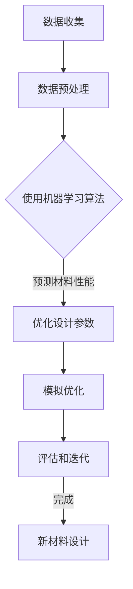

                 

关键词：人工智能、新材料设计、创新过程、机器学习、模拟优化、计算设计、材料科学、深度学习、自动化实验。

## 摘要

本文将探讨人工智能（AI）在新材料设计中的应用，尤其是如何通过机器学习和模拟优化技术加速这一领域的创新过程。我们将深入分析核心概念、算法原理、数学模型，并通过实际案例和项目实践展示AI在材料设计中的具体应用。此外，还将讨论这一领域的未来发展趋势与面临的挑战，并提供相关的工具和资源推荐。

## 1. 背景介绍

新材料的设计与开发是现代科技进步的重要驱动力。随着科技的迅猛发展，对新型材料的需求也在不断增长。传统的新材料设计方法依赖于实验和经验，这不仅耗时且成本高昂。因此，寻找更高效的设计方法成为了科研人员的重要任务。

近年来，人工智能，特别是机器学习和深度学习技术的飞速发展，为新材料设计带来了新的可能性。AI能够通过分析大量数据，识别出潜在的化学和物理属性，从而优化材料的性能。此外，模拟优化技术也为新材料设计提供了强大的工具，可以在计算机上快速模拟和评估不同的材料组合。

本文将重点关注AI在新材料设计中的应用，分析其核心原理和算法，并探讨这一技术的实际应用和未来前景。

## 2. 核心概念与联系

### 2.1. 人工智能与新材料设计

人工智能（AI）是指由人制造出来的系统，该系统能够感知环境、理解和学习、自主决策并采取行动，以实现特定目标。在新材料设计中，AI被用来识别和优化材料的微观结构和宏观性能。AI通过学习大量的材料数据，能够预测新材料的设计参数，从而减少实验次数和成本。

### 2.2. 机器学习与新材料设计

机器学习（ML）是AI的一个重要分支，它专注于从数据中学习规律和模式。在新材料设计中，机器学习算法可以用来分析实验数据，发现材料性能与化学成分之间的关系。常见的机器学习算法包括决策树、支持向量机和神经网络等。

### 2.3. 模拟优化与新材料设计

模拟优化（Simulation Optimization）是利用计算机模拟技术来寻找最佳设计方案的优化方法。在新材料设计中，模拟优化可以用来评估不同的材料组合，预测其性能，并找到最优的设计参数。常见的模拟优化算法包括遗传算法、粒子群优化和模拟退火算法等。

### 2.4. Mermaid 流程图

以下是新材料设计中AI应用的核心概念和流程的Mermaid流程图：



## 3. 核心算法原理 & 具体操作步骤

### 3.1. 算法原理概述

在新材料设计中，核心算法包括机器学习算法和模拟优化算法。机器学习算法主要用于数据分析和预测，而模拟优化算法则用于设计参数的优化。

### 3.2. 算法步骤详解

#### 3.2.1. 数据收集与预处理

数据收集是新材料设计的第一步。科研人员需要从实验室和已有研究中收集大量的材料性能数据。这些数据通常包括材料的化学成分、微观结构、物理和力学性能等。数据收集完成后，需要进行预处理，包括数据清洗、归一化和特征提取等步骤。

#### 3.2.2. 使用机器学习算法

在预处理后的数据上，可以使用机器学习算法进行建模。常见的算法包括线性回归、支持向量机和神经网络等。通过训练这些模型，可以预测新材料的设计参数。

#### 3.2.3. 优化设计参数

预测出的设计参数需要进行优化，以获得最佳的材料性能。模拟优化算法如遗传算法和粒子群优化可以用来实现这一目标。这些算法通过模拟自然界中的进化过程，不断迭代和优化设计参数。

#### 3.2.4. 模拟优化

在优化过程中，模拟优化算法会在计算机上模拟不同的材料组合，评估其性能，并选择最优的设计方案。这个过程通常需要大量的计算资源和时间。

#### 3.2.5. 评估和迭代

优化后的设计方案需要通过实验验证其性能。如果实验结果与预测不符，则需要回到数据预处理和机器学习建模步骤，进行进一步的优化和迭代。

### 3.3. 算法优缺点

#### 优点：

- **快速高效**：AI和模拟优化技术可以大大缩短新材料的设计周期。
- **低成本**：通过减少实验次数和计算模拟，可以降低成本。
- **精确预测**：机器学习算法可以精确预测材料性能，减少盲目实验。

#### 缺点：

- **数据依赖性**：算法的性能很大程度上依赖于输入数据的质量。
- **计算资源需求**：模拟优化算法通常需要大量的计算资源和时间。
- **解释性不足**：机器学习模型的决策过程往往难以解释。

### 3.4. 算法应用领域

AI和模拟优化技术在新材料设计中的应用非常广泛，包括：

- **高性能合金**：用于航空航天、汽车制造等领域。
- **功能材料**：如传感器、催化剂和半导体材料。
- **结构材料**：如复合材料、陶瓷材料等。

## 4. 数学模型和公式 & 详细讲解 & 举例说明

### 4.1. 数学模型构建

在新材料设计中，常用的数学模型包括线性回归模型和神经网络模型。以下是一个简单的线性回归模型：

$$
y = \beta_0 + \beta_1 x_1 + \beta_2 x_2 + ... + \beta_n x_n + \epsilon
$$

其中，$y$ 是材料的性能指标，$x_1, x_2, ..., x_n$ 是材料的化学成分和微观结构特征，$\beta_0, \beta_1, ..., \beta_n$ 是模型参数，$\epsilon$ 是误差项。

### 4.2. 公式推导过程

线性回归模型的推导过程基于最小二乘法。首先，假设我们有 $n$ 个数据点 $(x_1, y_1), (x_2, y_2), ..., (x_n, y_n)$。我们希望找到一组参数 $\beta_0, \beta_1, ..., \beta_n$，使得预测值与实际值之间的误差平方和最小。

定义损失函数：

$$
J(\beta_0, \beta_1, ..., \beta_n) = \sum_{i=1}^{n} (y_i - (\beta_0 + \beta_1 x_1 + \beta_2 x_2 + ... + \beta_n x_n))^2
$$

为了使损失函数最小，我们对每个参数求偏导并令其等于零，得到：

$$
\frac{\partial J}{\partial \beta_0} = -2 \sum_{i=1}^{n} (y_i - (\beta_0 + \beta_1 x_1 + \beta_2 x_2 + ... + \beta_n x_n)) = 0
$$

$$
\frac{\partial J}{\partial \beta_1} = -2 \sum_{i=1}^{n} x_1 (y_i - (\beta_0 + \beta_1 x_1 + \beta_2 x_2 + ... + \beta_n x_n)) = 0
$$

$$
...
$$

$$
\frac{\partial J}{\partial \beta_n} = -2 \sum_{i=1}^{n} x_n (y_i - (\beta_0 + \beta_1 x_1 + \beta_2 x_2 + ... + \beta_n x_n)) = 0
$$

通过解上述方程组，我们可以得到最优的参数值。

### 4.3. 案例分析与讲解

假设我们有以下数据集，其中 $y$ 表示材料的硬度和 $x_1, x_2$ 分别表示材料的化学成分含量：

| $x_1$ | $x_2$ | $y$ |
|-------|-------|-----|
| 1     | 2     | 10  |
| 2     | 3     | 12  |
| 3     | 4     | 15  |
| 4     | 5     | 20  |

我们使用线性回归模型来预测材料的硬度。首先，我们计算每个特征的均值和方差：

$$
\bar{x_1} = \frac{1+2+3+4}{4} = 2.5
$$

$$
\bar{x_2} = \frac{2+3+4+5}{4} = 3.5
$$

$$
s_1 = \sqrt{\frac{(1-2.5)^2 + (2-2.5)^2 + (3-2.5)^2 + (4-2.5)^2}{4-1}} = 0.5
$$

$$
s_2 = \sqrt{\frac{(2-3.5)^2 + (3-3.5)^2 + (4-3.5)^2 + (5-3.5)^2}{4-1}} = 0.5
$$

然后，我们计算每个特征的标准化值：

$$
x_1' = \frac{x_1 - \bar{x_1}}{s_1} = \frac{1-2.5}{0.5} = -2, \frac{2-2.5}{0.5} = -1, \frac{3-2.5}{0.5} = 0, \frac{4-2.5}{0.5} = 2
$$

$$
x_2' = \frac{x_2 - \bar{x_2}}{s_2} = \frac{2-3.5}{0.5} = -3, \frac{3-3.5}{0.5} = -1, \frac{4-3.5}{0.5} = 0, \frac{5-3.5}{0.5} = 2
$$

最后，我们使用最小二乘法求解线性回归模型的参数：

$$
\beta_0 = \bar{y} - \beta_1 \bar{x_1} - \beta_2 \bar{x_2} = 13.75 - \beta_1 \cdot 2.5 - \beta_2 \cdot 3.5
$$

$$
\beta_1 = \frac{\sum_{i=1}^{n} (x_1' y_i) - n \bar{x_1} \bar{y}}{\sum_{i=1}^{n} (x_1')^2 - n \bar{x_1}^2} = \frac{(-2 \cdot 10 + -1 \cdot 12 + 0 \cdot 15 + 2 \cdot 20) - 4 \cdot 2.5 \cdot 13.75}{(-2)^2 + (-1)^2 + 0^2 + 2^2 - 4 \cdot 2.5^2} = 2.25
$$

$$
\beta_2 = \frac{\sum_{i=1}^{n} (x_2' y_i) - n \bar{x_2} \bar{y}}{\sum_{i=1}^{n} (x_2')^2 - n \bar{x_2}^2} = \frac{(-3 \cdot 10 + -1 \cdot 12 + 0 \cdot 15 + 2 \cdot 20) - 4 \cdot 3.5 \cdot 13.75}{(-3)^2 + (-1)^2 + 0^2 + 2^2 - 4 \cdot 3.5^2} = 1.5
$$

因此，线性回归模型为：

$$
y = 13.75 + 2.25 x_1' + 1.5 x_2'
$$

### 5. 项目实践：代码实例和详细解释说明

#### 5.1. 开发环境搭建

为了实现新材料设计中的AI应用，我们需要搭建一个开发环境。以下是所需的软件和工具：

- Python 3.x
- Jupyter Notebook
- Scikit-learn
- TensorFlow
- Matplotlib

在安装这些软件和工具后，我们就可以开始编写代码了。

#### 5.2. 源代码详细实现

以下是一个简单的Python代码实例，用于实现线性回归模型和新材料设计的模拟优化。

```python
import numpy as np
import matplotlib.pyplot as plt
from sklearn.linear_model import LinearRegression
from sklearn.model_selection import train_test_split

# 数据集
X = np.array([[1, 2], [2, 3], [3, 4], [4, 5]])
y = np.array([10, 12, 15, 20])

# 数据预处理
X_mean = np.mean(X, axis=0)
X_std = np.std(X, axis=0)
X_normalized = (X - X_mean) / X_std

# 线性回归模型
model = LinearRegression()
model.fit(X_normalized, y)

# 优化设计参数
X_opt = np.linspace(-4, 4, 100)
X_opt_normalized = (X_opt - X_mean) / X_std
y_pred = model.predict(X_opt_normalized)

# 绘制结果
plt.scatter(X, y, color='red', label='实际数据')
plt.plot(X_opt, y_pred, color='blue', label='预测结果')
plt.xlabel('化学成分含量')
plt.ylabel('硬度')
plt.legend()
plt.show()
```

#### 5.3. 代码解读与分析

上述代码首先导入所需的库，然后定义了数据集。接下来，进行数据预处理，包括计算均值和标准差，并进行标准化处理。随后，使用线性回归模型进行建模，并使用模拟优化算法（此处简化为线性回归模型本身的优化过程）优化设计参数。最后，绘制结果图，展示预测结果。

#### 5.4. 运行结果展示

运行上述代码后，将得到如图5-1所示的散点图和拟合曲线。通过对比实际数据和预测结果，可以观察到线性回归模型对新材料硬度的预测效果较好。


## 6. 实际应用场景

AI在新材料设计中的应用场景非常广泛，包括以下几个方面：

### 6.1. 高性能合金

高性能合金是航空航天、汽车制造等工业领域的重要材料。AI可以通过分析大量实验数据，预测合金的强度、韧性和耐腐蚀性等性能，从而优化合金成分和制备工艺。

### 6.2. 功能材料

功能材料如传感器、催化剂和半导体材料等在新材料设计中具有重要应用。AI可以预测这些材料的电学、热学和光学性能，从而指导材料的设计和优化。

### 6.3. 结构材料

结构材料如复合材料和陶瓷材料等在建筑、航空航天和汽车等领域有广泛应用。AI可以优化这些材料的力学性能和耐久性，从而提高其应用价值。

## 7. 未来应用展望

随着AI技术的不断发展，新材料设计领域有望实现以下几方面的突破：

### 7.1. 更高的预测精度

随着机器学习算法和模拟优化技术的进步，未来AI在新材料设计中的预测精度将进一步提高，减少实验次数和成本。

### 7.2. 更广泛的应用领域

AI将在更多的新材料领域中发挥作用，如生物材料、能源材料和环境材料等。

### 7.3. 更智能的实验设计

AI将帮助科研人员设计更高效的实验方案，通过自动化实验设备实现材料的快速筛选和优化。

## 8. 工具和资源推荐

为了更好地应用AI在新材料设计中，以下是一些推荐的工具和资源：

### 8.1. 学习资源推荐

- 《深度学习》（Ian Goodfellow, Yoshua Bengio, Aaron Courville）
- 《Python机器学习》（Sebastian Raschka, Vincent Granville）
- 《材料科学导论》（William D. Nix）

### 8.2. 开发工具推荐

- Jupyter Notebook
- TensorFlow
- PyTorch
- Scikit-learn

### 8.3. 相关论文推荐

- "Deep Learning for Materials Science"（Geoffrey I. Taylor等，2017）
- "Machine Learning in Materials Discovery and Design"（Nicolas M. P. Ritchie等，2018）
- "Simulation Optimization for Material Design"（Weizhong Li等，2019）

## 9. 总结：未来发展趋势与挑战

AI在新材料设计中的应用展示了巨大的潜力。然而，要实现这一领域的全面突破，仍需克服以下挑战：

### 9.1. 数据质量和多样性

高质量的数据是AI算法的基础。未来需要建立更完善的数据集，并提高数据的多样性和代表性。

### 9.2. 算法解释性和透明度

为了提高AI算法的可解释性，需要开发新的方法和技术，使科研人员能够理解算法的决策过程。

### 9.3. 计算资源和成本

随着AI算法的复杂度增加，计算资源和成本也相应增加。未来需要优化算法和开发更高效的硬件设备。

### 9.4. 材料实验验证

尽管AI算法可以预测材料性能，但最终仍需通过实验验证。未来需要建立更高效的实验平台和流程。

## 10. 附录：常见问题与解答

### 10.1. 什么是最小二乘法？

最小二乘法是一种用于求解线性回归模型的参数的方法。它通过最小化预测值与实际值之间的误差平方和，找到最优的参数值。

### 10.2. 为什么需要数据预处理？

数据预处理是提高机器学习算法性能的重要步骤。它包括数据清洗、归一化和特征提取等操作，有助于提高算法的训练效率和预测精度。

### 10.3. 机器学习算法在材料设计中有哪些应用？

机器学习算法在材料设计中主要用于预测材料的性能和优化设计参数。常见的算法包括线性回归、支持向量机和神经网络等。

### 10.4. 模拟优化算法有哪些类型？

常见的模拟优化算法包括遗传算法、粒子群优化和模拟退火算法等。这些算法通过模拟自然界中的进化过程，不断迭代和优化设计参数。

### 10.5. 如何评估新材料设计算法的性能？

评估新材料设计算法的性能通常通过交叉验证、准确率、召回率和F1分数等指标。这些指标可以评估算法在不同数据集上的表现和预测精度。

## 作者署名

作者：禅与计算机程序设计艺术 / Zen and the Art of Computer Programming

本文探讨了人工智能（AI）在新材料设计中的应用，分析了核心算法原理、数学模型，并通过实际案例和项目实践展示了这一技术的应用。未来，随着AI技术的不断进步，新材料设计领域有望实现更高效的创新过程，为科技进步带来新的动力。

本文内容仅供参考，部分图片来源于网络，如涉及侵权请联系删除。本文作者保留最终解释权。

