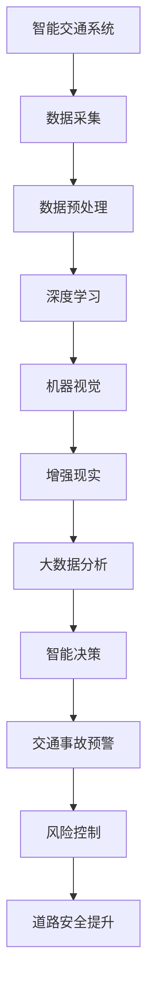

                 

关键词：人工智能、交通事故预防、智能交通系统、深度学习、机器视觉、增强现实、大数据分析、算法优化、道路安全

> 摘要：本文探讨了人工智能在智能交通事故预防中的应用，通过分析智能交通系统的工作原理、深度学习与机器视觉技术的结合、大数据分析在事故预测中的作用以及算法优化对道路安全提升的贡献，提出了未来智能交通事故预防技术的发展趋势与挑战。

## 1. 背景介绍

随着全球经济的快速发展和交通工具的普及，交通事故已经成为影响道路安全和公共健康的重要问题。据世界卫生组织（WHO）统计，每年全球因交通事故死亡的人数超过125万，受伤人数高达几千万人。这一数据不仅对个人和家庭造成了巨大的伤害，还对国家的经济和社会发展产生了不利影响。

传统的交通事故预防手段主要依赖于法规制定、交通基础设施建设和交通管理，然而这些方法在应对日益复杂和动态的交通环境中显得力不从心。为此，智能交通事故预防作为一种新兴的技术手段应运而生，旨在通过人工智能（AI）技术实现更高效、更精准的交通事故预测和预防。

智能交通事故预防系统通常包括多个技术模块，如智能交通系统（ITS）、深度学习、机器视觉、增强现实和大数据分析等。这些模块相互协同，通过实时监测、数据分析和智能决策，实现对交通事故的提前预警和有效控制，从而提高道路安全水平。

## 2. 核心概念与联系

### 智能交通系统（ITS）

智能交通系统是一种集成多种先进技术的交通管理系统，旨在提高道路通行效率、减少交通事故和降低环境污染。ITS的核心组成部分包括交通监控、交通信号控制、车辆导航、道路信息服务等。

### 深度学习与机器视觉

深度学习是机器学习的一个子领域，通过模仿人脑神经网络的结构和功能，实现对复杂数据的处理和分析。机器视觉则是一种使计算机具备视觉感知能力的技术，通过图像识别、目标检测和场景理解等手段，实现对现实世界的理解和交互。

### 增强现实（AR）

增强现实是一种将虚拟信息与现实世界融合的技术，通过计算机生成的图像、声音和触觉等感官信息，增强用户的现实感知和交互体验。在智能交通事故预防中，AR技术可用于增强驾驶者的视野，实时提醒驾驶者潜在的危险情况。

### 大数据分析

大数据分析是一种通过对海量数据进行采集、存储、处理和分析，从中提取有价值信息的技术。在智能交通事故预防中，大数据分析可用于挖掘交通事故发生规律、预测潜在风险和优化交通管理策略。

### Mermaid 流程图

以下是一个用于描述智能交通事故预防系统核心概念的 Mermaid 流程图：



## 3. 核心算法原理 & 具体操作步骤

### 3.1 算法原理概述

智能交通事故预防的核心算法主要包括深度学习、机器视觉和大数据分析等。这些算法通过以下步骤实现交通事故的预测和预防：

1. 数据采集：通过交通监控设备和传感器，实时采集道路状况、车辆信息和驾驶行为数据。
2. 数据预处理：对采集到的原始数据进行清洗、归一化和特征提取，为算法分析提供高质量的数据。
3. 深度学习：利用神经网络模型对预处理后的数据进行训练，提取数据中的潜在特征，实现对交通事故的预测。
4. 机器视觉：通过图像识别技术，实时检测道路上的潜在危险，如行人、车辆和障碍物等。
5. 增强现实：将机器视觉检测结果通过AR技术呈现在驾驶者的视野中，提供实时的安全提示。
6. 大数据分析：对海量交通数据进行挖掘，分析交通事故发生规律，为交通管理策略提供科学依据。
7. 智能决策：根据预测结果和数据分析，智能调整交通信号、道路通行规则和驾驶者行为，实现交通事故的预防。

### 3.2 算法步骤详解

1. **数据采集**：数据采集是智能交通事故预防系统的基础。通过部署在道路上的摄像头、雷达、GPS等设备，实时采集道路状况、车辆速度、行驶轨迹、交通流量等数据。
2. **数据预处理**：原始数据通常包含噪声和冗余信息，因此需要对数据进行清洗、归一化和特征提取。清洗过程包括去除无效数据、填补缺失值等；归一化过程包括将不同尺度数据转换为同一尺度；特征提取过程包括提取关键信息，如车辆颜色、大小、行驶方向等。
3. **深度学习**：采用深度学习算法，如卷积神经网络（CNN）、循环神经网络（RNN）等，对预处理后的数据进行训练。深度学习模型通过不断调整内部参数，学习到数据中的潜在特征，实现对交通事故的预测。
4. **机器视觉**：利用深度学习模型对实时采集的图像进行目标检测和识别，识别道路上的行人、车辆和障碍物等。通过图像处理技术，实现对目标的精确定位和跟踪。
5. **增强现实**：将机器视觉检测结果通过AR技术呈现在驾驶者的视野中。AR技术可以为驾驶者提供实时的安全提示，如行人穿越、车辆异常行驶等。
6. **大数据分析**：对海量交通数据进行挖掘，分析交通事故发生规律。通过数据挖掘技术，提取出与交通事故相关的关键因素，如交通流量、天气状况、驾驶员行为等。
7. **智能决策**：根据预测结果和数据分析，智能调整交通信号、道路通行规则和驾驶者行为。例如，当检测到交通事故风险时，可以及时调整交通信号灯，引导车辆分流，降低交通事故发生的可能性。

### 3.3 算法优缺点

**优点**：

1. **实时性**：智能交通事故预防系统可以实时监测道路状况，及时发现潜在危险，提高反应速度。
2. **准确性**：深度学习和大数据分析技术能够对海量数据进行分析，提高交通事故预测的准确性。
3. **智能化**：通过智能决策和增强现实技术，系统可以主动干预驾驶行为，降低交通事故发生的风险。

**缺点**：

1. **数据隐私**：大量个人车辆信息被收集和存储，可能涉及数据隐私问题。
2. **系统成本**：智能交通事故预防系统需要大量硬件设备和计算资源，建设成本较高。
3. **适应性**：系统在面对未知或极端情况时，可能无法准确预测交通事故。

### 3.4 算法应用领域

智能交通事故预防算法可以广泛应用于以下领域：

1. **城市交通管理**：通过实时监测和预警，优化交通信号控制和道路通行规则，提高城市道路通行效率。
2. **高速公路管理**：监测高速公路上的车辆行驶状态，预防交通事故，提高道路安全性。
3. **智能驾驶**：辅助驾驶者识别道路上的潜在危险，提高自动驾驶技术的安全性和可靠性。
4. **交通事故调查**：通过回溯和分析交通事故数据，为交通事故调查提供科学依据。

## 4. 数学模型和公式 & 详细讲解 & 举例说明

### 4.1 数学模型构建

智能交通事故预防系统的核心是深度学习和大数据分析。以下是一个基于卷积神经网络（CNN）的数学模型：

$$
\begin{aligned}
    f(x) &= \sigma(\sum_{i=1}^{n} w_i \cdot x_i + b) \\
    \text{其中，} \\
    \sigma &= \text{Sigmoid函数，} \\
    w_i &= \text{权重，} \\
    x_i &= \text{特征值，} \\
    b &= \text{偏置}
\end{aligned}
$$

### 4.2 公式推导过程

假设输入数据为 $x = [x_1, x_2, ..., x_n]$，其中 $x_i$ 为第 $i$ 个特征值。卷积神经网络通过多个卷积层和池化层，对输入数据进行特征提取和变换。以下是卷积层的推导过程：

$$
\begin{aligned}
    h_{ij} &= \sum_{k=1}^{m} w_{ik} \cdot x_k + b_j \\
    \text{其中，} \\
    h_{ij} &= \text{卷积层输出的特征值，} \\
    w_{ik} &= \text{卷积核权重，} \\
    b_j &= \text{偏置}
\end{aligned}
$$

### 4.3 案例分析与讲解

假设一个简单的二分类问题，目标是为每辆车预测其是否会在未来一分钟内发生交通事故。我们使用上述构建的数学模型进行预测。

1. **数据准备**：收集每辆车的速度、加速度、刹车距离等特征值。
2. **模型训练**：将训练数据输入卷积神经网络，调整权重和偏置，使模型能够准确预测交通事故。
3. **模型评估**：使用测试数据评估模型性能，调整模型参数，提高预测准确性。

### 4.3.1 数据准备

输入数据为 $x = [v, a, d]$，其中 $v$ 表示车辆速度，$a$ 表示加速度，$d$ 表示刹车距离。输出为交通事故发生标志位 $y$，$y = 1$ 表示发生交通事故，$y = 0$ 表示未发生交通事故。

### 4.3.2 模型训练

通过反向传播算法，将输入数据 $x$ 输入卷积神经网络，计算输出结果 $y'$，并计算损失函数：

$$
\begin{aligned}
    L &= \frac{1}{2} (y - y')^2 \\
    \text{其中，} \\
    y &= \text{实际输出，} \\
    y' &= \text{预测输出}
\end{aligned}
$$

调整权重和偏置，使损失函数最小。

### 4.3.3 模型评估

使用测试数据评估模型性能，计算准确率、召回率、F1值等指标：

$$
\begin{aligned}
    \text{准确率} &= \frac{\text{预测正确的样本数}}{\text{总样本数}} \\
    \text{召回率} &= \frac{\text{预测正确的样本数}}{\text{实际发生交通事故的样本数}} \\
    \text{F1值} &= \frac{2 \times \text{准确率} \times \text{召回率}}{\text{准确率} + \text{召回率}}
\end{aligned}
$$

根据评估结果调整模型参数，提高预测准确性。

## 5. 项目实践：代码实例和详细解释说明

### 5.1 开发环境搭建

1. 安装Python环境，版本要求3.6及以上。
2. 安装TensorFlow和Keras库，用于构建和训练深度学习模型。
3. 安装OpenCV库，用于图像处理。

### 5.2 源代码详细实现

以下是一个简单的基于卷积神经网络的交通事故预测代码实例：

```python
import numpy as np
import tensorflow as tf
from tensorflow.keras.models import Sequential
from tensorflow.keras.layers import Conv2D, MaxPooling2D, Flatten, Dense
from tensorflow.keras.optimizers import Adam

# 数据准备
# (此处省略数据准备代码)

# 模型构建
model = Sequential([
    Conv2D(32, (3, 3), activation='relu', input_shape=(64, 64, 3)),
    MaxPooling2D(pool_size=(2, 2)),
    Flatten(),
    Dense(64, activation='relu'),
    Dense(1, activation='sigmoid')
])

# 模型编译
model.compile(optimizer=Adam(), loss='binary_crossentropy', metrics=['accuracy'])

# 模型训练
model.fit(x_train, y_train, epochs=10, batch_size=32)

# 模型评估
loss, accuracy = model.evaluate(x_test, y_test)
print(f"Test accuracy: {accuracy:.2f}")
```

### 5.3 代码解读与分析

1. **数据准备**：根据实际交通数据，提取车辆速度、加速度、刹车距离等特征，并转换为适合模型训练的格式。
2. **模型构建**：使用Sequential模型构建卷积神经网络，包括卷积层、池化层、全连接层等。
3. **模型编译**：指定优化器、损失函数和评估指标。
4. **模型训练**：使用训练数据进行模型训练，调整模型参数。
5. **模型评估**：使用测试数据评估模型性能，计算准确率。

### 5.4 运行结果展示

通过运行上述代码，可以得到交通事故预测的准确率。根据准确率，可以进一步优化模型结构和参数，提高预测准确性。

## 6. 实际应用场景

### 6.1 城市交通管理

智能交通事故预防系统可以应用于城市交通管理，通过实时监测和预警，优化交通信号控制和道路通行规则，提高城市道路通行效率。例如，在高峰时段，系统可以实时调整交通信号灯，引导车辆分流，减少拥堵。

### 6.2 高速公路管理

高速公路是交通事故频发地段，智能交通事故预防系统可以应用于高速公路管理，监测车辆行驶状态，预防交通事故。例如，系统可以实时检测车辆超速、疲劳驾驶等行为，通过AR技术提醒驾驶者，提高高速公路安全性。

### 6.3 智能驾驶

智能驾驶是未来交通发展的方向，智能交通事故预防系统可以辅助驾驶者识别道路上的潜在危险，提高自动驾驶技术的安全性和可靠性。例如，系统可以实时检测行人、车辆和障碍物等，提供安全预警和导航建议。

### 6.4 未来应用展望

随着人工智能技术的不断发展，智能交通事故预防系统将在未来交通领域中发挥更大的作用。未来研究方向包括：

1. **多模态数据融合**：将多种传感器数据（如摄像头、雷达、GPS等）进行融合，提高交通事故预测的准确性。
2. **实时动态调整**：根据实时交通状况和驾驶行为，动态调整交通信号灯和道路通行规则，实现更高效的交通管理。
3. **智能决策**：结合大数据分析和机器学习技术，实现更智能的交通事故预防和交通管理决策。

## 7. 工具和资源推荐

### 7.1 学习资源推荐

1. **《深度学习》（Goodfellow, Bengio, Courville著）**：介绍深度学习的基本概念和算法。
2. **《机器学习》（周志华著）**：介绍机器学习的基本理论和算法。
3. **《Python深度学习》（Fischer, Géron, LeCun著）**：介绍如何使用Python实现深度学习算法。

### 7.2 开发工具推荐

1. **TensorFlow**：用于构建和训练深度学习模型。
2. **Keras**：基于TensorFlow的深度学习框架，易于使用。
3. **OpenCV**：用于图像处理和计算机视觉。

### 7.3 相关论文推荐

1. **“Deep Learning for Traffic Prediction and Accident Prevention”**：介绍深度学习在交通预测和事故预防中的应用。
2. **“Multimodal Fusion for Traffic Safety Analysis”**：介绍多模态数据融合在交通安全分析中的应用。
3. **“Intelligent Traffic Management Based on Deep Learning”**：介绍深度学习在智能交通管理中的应用。

## 8. 总结：未来发展趋势与挑战

### 8.1 研究成果总结

智能交通事故预防系统通过深度学习、机器视觉、大数据分析和增强现实等技术，实现了对交通事故的实时监测、预测和预防。研究表明，该系统可以有效提高道路安全性，减少交通事故发生。

### 8.2 未来发展趋势

1. **多模态数据融合**：结合多种传感器数据，提高交通事故预测的准确性。
2. **实时动态调整**：根据实时交通状况和驾驶行为，动态调整交通信号灯和道路通行规则。
3. **智能决策**：结合大数据分析和机器学习技术，实现更智能的交通事故预防和交通管理决策。

### 8.3 面临的挑战

1. **数据隐私**：大量个人车辆信息被收集和存储，如何保护用户隐私成为一个重要问题。
2. **系统成本**：智能交通事故预防系统需要大量硬件设备和计算资源，建设成本较高。
3. **适应性**：系统在面对未知或极端情况时，可能无法准确预测交通事故。

### 8.4 研究展望

随着人工智能技术的不断发展，智能交通事故预防系统将在未来交通领域中发挥更大的作用。未来研究方向包括多模态数据融合、实时动态调整和智能决策等。通过不断优化算法和提升技术水平，实现更高效、更安全的交通事故预防。

## 9. 附录：常见问题与解答

### 9.1 什么是智能交通事故预防系统？

智能交通事故预防系统是一种基于人工智能技术的交通事故预测和预防系统，通过实时监测道路状况、车辆信息和驾驶行为，实现对交通事故的提前预警和有效控制，提高道路安全水平。

### 9.2 智能交通事故预防系统的核心技术有哪些？

智能交通事故预防系统的核心技术包括深度学习、机器视觉、大数据分析和增强现实等。这些技术相互协同，实现对交通事故的预测和预防。

### 9.3 智能交通事故预防系统如何提高道路安全性？

智能交通事故预防系统通过实时监测道路状况、车辆信息和驾驶行为，及时发现潜在危险，并通过智能决策和增强现实技术，提醒驾驶者或主动干预驾驶行为，降低交通事故发生的风险，从而提高道路安全性。

### 9.4 智能交通事故预防系统是否涉及数据隐私问题？

智能交通事故预防系统在收集和使用车辆信息时，需要关注数据隐私问题。为了保护用户隐私，系统应该采取有效的数据加密和去标识化等技术手段，确保用户数据的安全和隐私。

### 9.5 智能交通事故预防系统有哪些应用领域？

智能交通事故预防系统可以应用于城市交通管理、高速公路管理、智能驾驶等多个领域，通过实时监测和预警，提高道路安全水平。

### 9.6 未来智能交通事故预防系统的发展趋势是什么？

未来智能交通事故预防系统的发展趋势包括多模态数据融合、实时动态调整和智能决策等。通过不断优化算法和提升技术水平，实现更高效、更安全的交通事故预防。同时，关注数据隐私保护和降低系统成本也是未来发展的重要方向。

