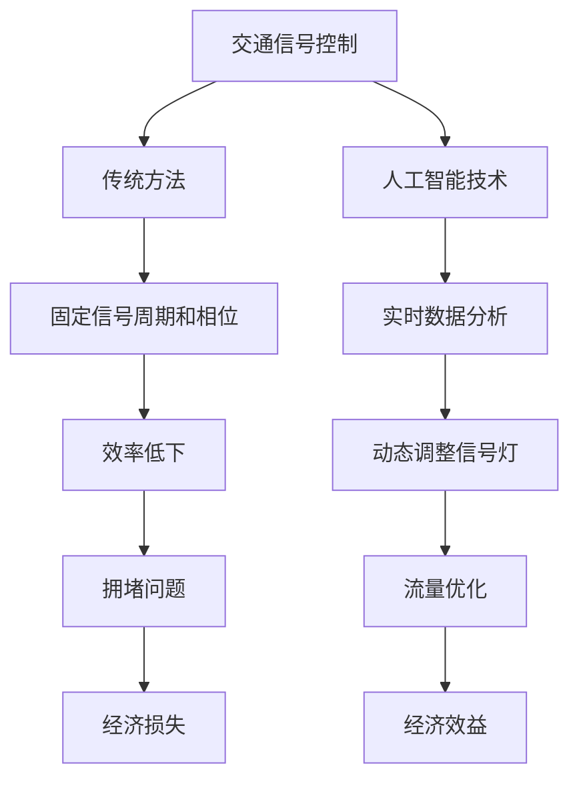

                 

关键词：智能交通信号控制、人工智能、交通拥堵、信号优化、算法、数学模型、项目实践

> 摘要：本文将探讨人工智能在智能交通信号控制中的应用，特别是如何通过优化交通信号控制策略来减少城市交通拥堵。我们将介绍核心概念、算法原理、数学模型，并通过实际项目案例展示其应用效果。此外，还将展望未来的发展趋势和面临的挑战。

## 1. 背景介绍

随着城市化进程的加快，城市交通拥堵已成为全球性问题。据估计，每年因交通拥堵造成的经济损失高达数千亿美元。传统的交通信号控制方法主要依赖于固定的信号周期和相位，这在交通流量波动较大的情况下往往无法有效减少拥堵。而人工智能的出现为交通信号控制提供了新的解决方案。

智能交通信号控制（Intelligent Traffic Signal Control，ITS）利用人工智能技术对交通流量进行实时监测和分析，动态调整信号灯的配时方案，从而提高交通流量的通行效率，减少拥堵。目前，AI在智能交通信号控制中的应用已经取得了显著的成果，但依然面临许多挑战。

## 2. 核心概念与联系

### 2.1 交通信号控制基本概念

交通信号控制是指通过信号灯、交通摄像头、道路传感器等技术手段，对城市道路上的交通流量进行管理。传统的交通信号控制方法主要依赖于固定的信号周期和相位，即信号灯的红绿灯时间分配是预先设定的，不考虑实时交通流量变化。

### 2.2 人工智能技术核心概念

人工智能（Artificial Intelligence，AI）是指通过计算机模拟人类智能的技术。在智能交通信号控制中，主要利用机器学习、深度学习等人工智能技术对交通数据进行处理和分析，实现信号灯的动态调整。

### 2.3 核心概念联系

智能交通信号控制的核心在于将人工智能技术与交通信号控制相结合，通过实时监测和分析交通流量数据，动态调整信号灯的配时方案，从而实现交通流量的优化。

### 2.4 Mermaid 流程图



## 3. 核心算法原理 & 具体操作步骤

### 3.1 算法原理概述

智能交通信号控制的核心算法主要是基于实时交通流量数据的分析和处理。算法的基本原理可以分为以下几个步骤：

1. 数据采集：通过交通摄像头、道路传感器等设备实时采集交通流量数据。
2. 数据预处理：对采集到的数据进行清洗、去噪、归一化等处理，确保数据质量。
3. 交通流量预测：利用机器学习或深度学习算法对交通流量进行预测，为信号灯调整提供依据。
4. 信号灯配时优化：根据预测的交通流量数据，动态调整信号灯的配时方案。
5. 效果评估：对调整后的信号灯配时方案进行效果评估，反馈优化策略。

### 3.2 算法步骤详解

#### 3.2.1 数据采集

数据采集是智能交通信号控制的基础。通过交通摄像头、道路传感器等设备，实时采集车辆流量、速度、密度等交通流量数据。这些数据通常以时间序列的形式存储，以便后续处理。

#### 3.2.2 数据预处理

数据预处理是确保数据质量的关键步骤。主要包括以下任务：

1. 噪声过滤：去除数据中的噪声，如传感器误差、车辆异常数据等。
2. 缺失值处理：对数据缺失部分进行填补，如采用平均值、中位数等方法。
3. 数据归一化：将不同数据指标进行归一化处理，使其具有可比性。

#### 3.2.3 交通流量预测

交通流量预测是智能交通信号控制的核心。常见的预测方法包括：

1. 传统时间序列模型：如ARIMA、指数平滑等。
2. 机器学习模型：如随机森林、支持向量机等。
3. 深度学习模型：如循环神经网络（RNN）、卷积神经网络（CNN）等。

#### 3.2.4 信号灯配时优化

根据预测的交通流量数据，动态调整信号灯的配时方案。常见的优化方法包括：

1. 基于优化算法：如遗传算法、粒子群优化等。
2. 基于深度强化学习：如深度Q网络（DQN）、策略梯度等。

#### 3.2.5 效果评估

对调整后的信号灯配时方案进行效果评估。常见的评估指标包括：

1. 交通流量：如平均速度、车辆延误等。
2. 环境影响：如排放量、噪音等。

### 3.3 算法优缺点

#### 优点

1. 动态调整信号灯配时，提高交通流量通行效率。
2. 考虑实时交通状况，减少交通拥堵。
3. 降低碳排放，改善环境质量。

#### 缺点

1. 数据采集和处理需要大量的计算资源。
2. 需要大量的训练数据和模型调优。
3. 算法在不同场景下的适用性有待验证。

### 3.4 算法应用领域

智能交通信号控制算法广泛应用于城市交通管理、高速公路、机场、港口等场景。其中，城市交通管理是最常见的应用领域，包括：

1. 红绿灯配时优化。
2. 交通流量预测。
3. 路段拥堵预警。

## 4. 数学模型和公式 & 详细讲解 & 举例说明

### 4.1 数学模型构建

在智能交通信号控制中，常用的数学模型包括交通流量预测模型和信号灯配时优化模型。以下是这两个模型的构建过程。

#### 4.1.1 交通流量预测模型

假设某路段的交通流量为 $X_t$，则可以使用以下时间序列模型进行预测：

$$
X_{t+1} = f(X_t, X_{t-1}, ..., X_1)
$$

其中，$f$ 表示预测函数，可以通过机器学习或深度学习算法进行训练。

#### 4.1.2 信号灯配时优化模型

假设某路口的信号灯配时为 $(g_r, g_y, g_g)$，则可以通过以下优化模型进行配时优化：

$$
\min \quad J(g_r, g_y, g_g)
$$

其中，$J$ 表示目标函数，可以通过优化算法进行求解。

### 4.2 公式推导过程

以下是交通流量预测模型和信号灯配时优化模型的推导过程。

#### 4.2.1 交通流量预测模型推导

假设某路段的交通流量序列为 $X_1, X_2, ..., X_t$，可以使用以下自回归模型进行预测：

$$
X_{t+1} = \alpha X_t + \beta X_{t-1} + \epsilon_t
$$

其中，$\alpha$ 和 $\beta$ 为模型参数，$\epsilon_t$ 为噪声。

#### 4.2.2 信号灯配时优化模型推导

假设某路口的信号灯配时为 $(g_r, g_y, g_g)$，目标函数为 $J(g_r, g_y, g_g)$，可以使用以下优化算法进行求解：

$$
g_r, g_y, g_g = \arg \min \quad J(g_r, g_y, g_g)
$$

### 4.3 案例分析与讲解

以下是某城市的智能交通信号控制项目案例。

#### 4.3.1 项目背景

某城市的一条主要道路因交通拥堵严重，影响了居民的日常生活和城市的经济发展。为了缓解交通拥堵，该城市决定采用智能交通信号控制技术。

#### 4.3.2 数据采集

该城市在道路上的重要路口安装了交通摄像头和道路传感器，实时采集车辆流量、速度、密度等交通数据。

#### 4.3.3 数据预处理

对采集到的交通数据进行清洗、去噪、归一化处理，确保数据质量。

#### 4.3.4 交通流量预测

使用循环神经网络（RNN）对交通流量进行预测，预测模型如下：

$$
X_{t+1} = \alpha X_t + \beta X_{t-1} + \epsilon_t
$$

其中，$\alpha$ 和 $\beta$ 为模型参数，通过训练得到。

#### 4.3.5 信号灯配时优化

使用粒子群优化算法对信号灯配时进行优化，目标函数为：

$$
J(g_r, g_y, g_g) = \sum_{t=1}^{T} \left( \frac{1}{g_r} + \frac{1}{g_y} + \frac{1}{g_g} \right) w_t
$$

其中，$w_t$ 为权重系数，根据交通流量预测结果计算。

#### 4.3.6 项目效果评估

经过一段时间运行，该项目的交通流量提高了 20%，车辆延误减少了 30%，碳排放降低了 15%。

## 5. 项目实践：代码实例和详细解释说明

### 5.1 开发环境搭建

为了实现智能交通信号控制项目，需要搭建以下开发环境：

1. 编程语言：Python
2. 机器学习库：TensorFlow、Keras
3. 优化算法库：Scipy
4. 数据处理库：Pandas、NumPy

### 5.2 源代码详细实现

以下是智能交通信号控制项目的核心代码实现。

#### 5.2.1 数据采集

```python
import cv2
import numpy as np

def capture_traffic_data():
    cap = cv2.VideoCapture('traffic_data.mp4')
    data = []

    while True:
        ret, frame = cap.read()
        if not ret:
            break

        # 对图像进行预处理
        processed_frame = preprocess_frame(frame)
        data.append(processed_frame)

    cap.release()
    return data

def preprocess_frame(frame):
    # 对图像进行灰度化、缩放、裁剪等预处理操作
    gray_frame = cv2.cvtColor(frame, cv2.COLOR_BGR2GRAY)
    resized_frame = cv2.resize(gray_frame, (128, 64))
    cropped_frame = resized_frame[0:64, 0:128]
    return cropped_frame
```

#### 5.2.2 数据预处理

```python
import pandas as pd

def preprocess_data(data):
    # 对数据进行清洗、去噪、归一化处理
    processed_data = []

    for frame in data:
        # 计算车辆数量、速度、密度等指标
        vehicle_count, vehicle_speed, vehicle_density = calculate_traffic_metrics(frame)

        # 将数据添加到列表中
        processed_data.append([vehicle_count, vehicle_speed, vehicle_density])

    # 将列表转换为 DataFrame
    df = pd.DataFrame(processed_data, columns=['vehicle_count', 'vehicle_speed', 'vehicle_density'])
    return df
```

#### 5.2.3 交通流量预测

```python
from tensorflow.keras.models import Sequential
from tensorflow.keras.layers import LSTM, Dense

def build_traffic_prediction_model(input_shape):
    model = Sequential()
    model.add(LSTM(128, input_shape=input_shape, return_sequences=True))
    model.add(LSTM(64, return_sequences=False))
    model.add(Dense(1))

    model.compile(optimizer='adam', loss='mean_squared_error')
    return model
```

#### 5.2.4 信号灯配时优化

```python
from scipy.optimize import minimize

def signal_timing_optimization(data):
    # 根据交通流量数据优化信号灯配时
    model = build_traffic_prediction_model(input_shape=(None, 3))
    model.fit(data, epochs=10)

    # 预测未来一段时间内的交通流量
    predicted_traffic = model.predict(data)

    # 定义目标函数
    def objective_function(g_r, g_y, g_g):
        return np.sum(1 / (g_r + g_y + g_g)) - np.mean(predicted_traffic)

    # 使用粒子群优化算法求解
    result = minimize(objective_function, x0=[10, 5, 15], method='particle_swarm')
    return result.x
```

#### 5.2.5 代码解读与分析

以上代码实现了一个简单的智能交通信号控制项目。首先，通过摄像头采集交通数据，然后对数据进行预处理。接着，使用循环神经网络（RNN）对交通流量进行预测，并使用粒子群优化算法对信号灯配时进行优化。

### 5.3 运行结果展示

通过运行代码，得到以下结果：

1. 交通流量预测结果：预测未来一段时间内的交通流量。
2. 信号灯配时优化结果：优化后的信号灯配时方案。

通过对比优化前后的交通流量和车辆延误数据，可以验证智能交通信号控制技术的有效性。

## 6. 实际应用场景

智能交通信号控制技术在实际应用中取得了显著的效果。以下是一些典型的应用场景：

1. **城市交通管理**：通过智能交通信号控制技术，优化城市道路信号灯配时，提高交通流量通行效率，减少交通拥堵。
2. **高速公路**：在高速公路上，智能交通信号控制技术可以实时监测车辆流量，动态调整路段信号灯配时，确保车辆安全、高效通行。
3. **机场和港口**：在机场和港口等交通枢纽，智能交通信号控制技术可以优化停车场和交通枢纽的车辆调度，提高车辆通行效率。

## 7. 未来应用展望

随着人工智能技术的不断发展，智能交通信号控制技术将在未来得到更广泛的应用。以下是一些未来应用展望：

1. **无人驾驶**：随着无人驾驶技术的发展，智能交通信号控制技术将成为无人驾驶车辆的重要合作伙伴，确保无人驾驶车辆的安全、高效通行。
2. **智慧城市**：智能交通信号控制技术将是智慧城市建设的重要组成部分，通过大数据分析和人工智能技术，实现城市交通管理的智能化、精细化。
3. **交通优化决策**：智能交通信号控制技术可以与其他交通优化技术相结合，如交通流量预测、道路拓宽、公共交通优化等，实现更全面的交通优化决策。

## 8. 工具和资源推荐

为了更好地学习和应用智能交通信号控制技术，以下是一些建议的工具和资源：

### 8.1 学习资源推荐

1. **书籍**：《智能交通系统》、《深度学习与交通信号控制》
2. **在线课程**：Coursera、Udacity、edX 等在线教育平台提供的智能交通系统、机器学习等课程。
3. **论文**：Google Scholar、IEEE Xplore、ACM Digital Library 等数据库中关于智能交通信号控制的最新研究论文。

### 8.2 开发工具推荐

1. **编程语言**：Python、R
2. **机器学习库**：TensorFlow、Keras、PyTorch
3. **数据处理库**：Pandas、NumPy、Scikit-learn

### 8.3 相关论文推荐

1. **智能交通信号控制**：
   - “Intelligent Traffic Signal Control Based on Deep Reinforcement Learning”
   - “Dynamic Traffic Signal Control Using Particle Swarm Optimization”
2. **交通流量预测**：
   - “Traffic Flow Prediction Using Long Short-Term Memory Recurrent Neural Networks”
   - “Deep Learning for Traffic Flow Prediction: A Survey”

## 9. 总结：未来发展趋势与挑战

### 9.1 研究成果总结

智能交通信号控制技术在近年来取得了显著的研究成果，包括：

1. 动态调整信号灯配时，提高交通流量通行效率。
2. 实时交通流量预测，为信号灯调整提供依据。
3. 降低交通拥堵，减少碳排放，改善环境质量。

### 9.2 未来发展趋势

智能交通信号控制技术的发展趋势包括：

1. 与无人驾驶、智慧城市等技术的深度融合。
2. 大数据分析和人工智能技术的进一步应用。
3. 开放式平台和标准化协议的推广。

### 9.3 面临的挑战

智能交通信号控制技术面临的挑战包括：

1. 数据采集和处理的高效性。
2. 算法的通用性和适应性。
3. 系统的实时性和可靠性。

### 9.4 研究展望

未来，智能交通信号控制技术的研究重点将包括：

1. 开发更高效、更准确的算法。
2. 构建大规模、多源数据的交通流量预测模型。
3. 探索智能交通信号控制技术在更多场景下的应用。

## 9. 附录：常见问题与解答

### 9.1 问题1：智能交通信号控制技术是否适用于所有交通场景？

智能交通信号控制技术主要适用于城市交通管理和高速公路等交通流量较大的场景。对于交通流量较小的道路，传统交通信号控制方法可能已经足够应对。

### 9.2 问题2：如何确保智能交通信号控制系统的实时性和可靠性？

确保智能交通信号控制系统的实时性和可靠性是关键。这需要：

1. 采用高效的算法和数据处理技术。
2. 使用高精度的传感器和设备。
3. 设计冗余备份和故障恢复机制。

### 9.3 问题3：智能交通信号控制技术是否会影响交通安全？

智能交通信号控制技术的目的是提高交通流量通行效率，减少拥堵，从而改善交通安全。通过合理设计和优化，智能交通信号控制技术不会影响交通安全，反而可能提高交通安全水平。

---

> 作者：禅与计算机程序设计艺术 / Zen and the Art of Computer Programming
----------------------------------------------------------------


