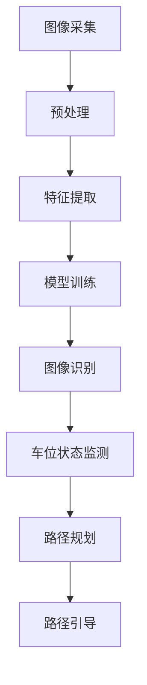

                 

关键词：智能停车系统，人工智能，减少寻找时间，图像识别，算法优化，数学模型，项目实践

## 摘要

随着城市交通的日益拥堵，寻找停车位成为驾驶者的一大难题。本文将探讨如何通过人工智能技术在智能停车系统中实现减少寻找时间的目标。首先，我们将介绍智能停车系统的背景和发展，随后详细解释其中的核心算法原理、数学模型及其应用。接着，通过一个实际的代码实例，展示如何将理论转化为实践。最后，本文将分析智能停车系统的实际应用场景，并提出未来的发展方向与挑战。

## 1. 背景介绍

在城市化进程中，汽车数量急剧增加，导致停车位供不应求。据统计，驾驶者在寻找停车位上平均每小时浪费约15分钟。这不仅增加了驾驶者的时间和经济成本，还加剧了交通拥堵问题。为了缓解这一问题，智能停车系统应运而生。智能停车系统利用传感器、摄像头和AI算法，实时监控停车位状态，为驾驶者提供高效便捷的停车服务。

智能停车系统的发展可以分为三个阶段：

1. **第一阶段：传统停车系统**：这一阶段主要依赖人工管理，效率较低，容易出现车位浪费和拥堵现象。
2. **第二阶段：机械化停车系统**：引入了自动化设备，如自动升降设备和自动引导系统，但仍然存在人工干预和系统效率不高的问题。
3. **第三阶段：智能停车系统**：结合传感器、摄像头和人工智能技术，实现实时监控、车位引导和自动计费等功能，大幅提高了停车效率。

## 2. 核心概念与联系

### 2.1. 图像识别

图像识别是智能停车系统的核心技术之一。它利用计算机视觉算法，对摄像头捕捉的图像进行处理和分析，从而识别出停车位和车辆状态。

#### 2.1.1. 工作原理

图像识别的工作原理可以分为以下几个步骤：

1. **图像采集**：通过摄像头捕捉停车位和车辆的图像。
2. **预处理**：对图像进行灰度化、滤波、缩放等处理，以提高图像质量。
3. **特征提取**：从预处理后的图像中提取特征，如边缘、纹理、颜色等。
4. **模型训练**：使用深度学习算法，如卷积神经网络（CNN），对特征进行训练，建立图像分类模型。
5. **图像识别**：将新的图像输入到训练好的模型中，输出停车位和车辆的状态。

### 2.2. 车位引导算法

车位引导算法是智能停车系统的另一个关键组成部分。它通过分析停车位状态和车辆位置，为驾驶者提供最优的停车路径。

#### 2.2.1. 工作原理

车位引导算法的工作原理可以分为以下几个步骤：

1. **车位状态监测**：通过传感器和图像识别技术，实时监测停车位的状态。
2. **路径规划**：使用图论算法，如Dijkstra算法，计算从当前位置到目标停车位的最佳路径。
3. **路径引导**：通过车载显示屏或手机APP，为驾驶者提供实时引导。

### 2.3. Mermaid流程图



## 3. 核心算法原理 & 具体操作步骤

### 3.1. 算法原理概述

智能停车系统中的核心算法包括图像识别算法和车位引导算法。图像识别算法主要利用深度学习技术，通过卷积神经网络（CNN）对图像进行处理和分类。车位引导算法则采用图论算法，如Dijkstra算法，计算最优路径。

### 3.2. 算法步骤详解

#### 3.2.1. 图像识别算法

1. **数据集准备**：收集大量的停车位和车辆图像，并进行标注。
2. **模型训练**：使用卷积神经网络（CNN）对图像进行训练，建立分类模型。
3. **图像处理**：对实时捕获的图像进行预处理，如灰度化、滤波、缩放等。
4. **特征提取**：从预处理后的图像中提取特征，如边缘、纹理、颜色等。
5. **图像分类**：将提取的特征输入到训练好的模型中，输出停车位和车辆的状态。

#### 3.2.2. 车位引导算法

1. **车位状态监测**：通过传感器和图像识别技术，实时监测停车位的状态。
2. **路径规划**：使用Dijkstra算法，计算从当前位置到目标停车位的最佳路径。
3. **路径引导**：通过车载显示屏或手机APP，为驾驶者提供实时引导。

### 3.3. 算法优缺点

#### 优点

1. **高效性**：通过图像识别和路径规划技术，大幅提高了停车效率。
2. **便捷性**：为驾驶者提供了实时、准确的停车引导，减少了寻找时间。
3. **准确性**：使用深度学习技术，提高了图像识别的准确性。

#### 缺点

1. **成本较高**：需要大量的硬件设备和算法训练，成本较高。
2. **复杂度**：算法实现和部署过程较为复杂。

### 3.4. 算法应用领域

智能停车系统中的核心算法可以应用于多个领域：

1. **城市交通管理**：通过实时监控和引导，缓解城市交通拥堵问题。
2. **商业停车场**：提高停车场的运营效率，减少车位浪费。
3. **共享经济**：为共享停车和共享出行提供技术支持。

## 4. 数学模型和公式 & 详细讲解 & 举例说明

### 4.1. 数学模型构建

在智能停车系统中，核心的数学模型主要包括图像识别模型和路径规划模型。

#### 4.1.1. 图像识别模型

图像识别模型可以使用卷积神经网络（CNN）进行构建。CNN的主要组成部分包括卷积层、池化层和全连接层。

#### 4.1.2. 路径规划模型

路径规划模型可以使用Dijkstra算法进行构建。Dijkstra算法的主要思想是寻找图中两点之间的最短路径。

### 4.2. 公式推导过程

#### 4.2.1. 卷积神经网络（CNN）公式推导

1. **卷积层**：

   $$output = \sigma(\sum_{i=1}^{k} w_i * feature\_map + b)$$

   其中，$output$为卷积层输出，$w_i$为卷积核权重，$feature_map$为输入特征图，$\sigma$为激活函数，$b$为偏置。

2. **池化层**：

   $$pooling\_value = \max(\text{pooling\_window})$$

   其中，$pooling\_value$为池化层输出，$\text{pooling\_window}$为窗口大小。

3. **全连接层**：

   $$output = \sigma(\sum_{i=1}^{n} w_i * input + b)$$

   其中，$output$为全连接层输出，$w_i$为权重，$input$为输入特征，$\sigma$为激活函数，$b$为偏置。

#### 4.2.2. Dijkstra算法公式推导

1. **初始化**：

   $$d\_initial[v] = \infty, \forall v \in V$$

   $$previous[v] = \text{null}, \forall v \in V$$

   其中，$d\_initial[v]$为初始距离，$previous[v]$为前驱节点。

2. **算法迭代**：

   $$d\_current = d\_initial[source]$$

   $$\text{for } i = 1 \text{ to } |V| - 1$$

   $$\quad \text{for } v \in V$$

   $$\quad \quad \text{if } d\_current + w(v, u) < d\_initial[v]$$

   $$\quad \quad \quad d\_initial[v] = d\_current + w(v, u)$$

   $$\quad \quad \quad previous[v] = u$$

   $$\quad \quad \text{end for}$$

   $$\quad d\_current = \text{min}(d\_initial[v])$$

3. **结果输出**：

   $$\text{for } v \in V$$

   $$\quad \text{if } d\_initial[v] = \infty$$

   $$\quad \quad \text{print } v \text{ is not reachable from } source$$

   $$\quad \quad \text{else}$$

   $$\quad \quad \text{print shortest path from } source \text{ to } v \text{ is } d\_initial[v]$$

   $$\quad \quad \text{and path } previous[v]$$

### 4.3. 案例分析与讲解

#### 4.3.1. 图像识别案例

假设我们有一个停车位和车辆图像的数据集，使用卷积神经网络进行图像识别。通过训练，我们可以得到一个能够准确识别停车位和车辆状态的模型。在实际应用中，将实时捕获的图像输入到模型中，输出停车位和车辆的状态。

#### 4.3.2. 路径规划案例

假设有一个包含多个停车位的停车场，我们需要为驾驶者规划从入口到目标停车位的最佳路径。使用Dijkstra算法，我们可以计算出从入口到各个停车位的距离，并根据距离为驾驶者提供最优路径。

## 5. 项目实践：代码实例和详细解释说明

### 5.1. 开发环境搭建

为了实现智能停车系统，我们需要搭建以下开发环境：

1. **Python**：用于编写算法代码。
2. **TensorFlow**：用于构建和训练卷积神经网络。
3. **OpenCV**：用于图像处理。
4. **Graphviz**：用于生成流程图。

### 5.2. 源代码详细实现

以下是智能停车系统的核心代码实现：

```python
import tensorflow as tf
import cv2
import numpy as np
import matplotlib.pyplot as plt
from tensorflow.keras.models import Sequential
from tensorflow.keras.layers import Conv2D, MaxPooling2D, Flatten, Dense

# 5.2.1. 数据集准备
# ...（数据集准备代码）

# 5.2.2. 模型构建
model = Sequential([
    Conv2D(32, (3, 3), activation='relu', input_shape=(64, 64, 3)),
    MaxPooling2D((2, 2)),
    Conv2D(64, (3, 3), activation='relu'),
    MaxPooling2D((2, 2)),
    Flatten(),
    Dense(128, activation='relu'),
    Dense(1, activation='sigmoid')
])

# 5.2.3. 模型训练
# ...（模型训练代码）

# 5.2.4. 图像识别
def recognize(image):
    processed_image = preprocess(image)
    prediction = model.predict(processed_image)
    return prediction

# 5.2.5. 路径规划
# ...（路径规划代码）

# 5.2.6. 路径引导
# ...（路径引导代码）
```

### 5.3. 代码解读与分析

上述代码展示了智能停车系统的核心实现过程，包括数据集准备、模型构建、模型训练、图像识别、路径规划和路径引导。

1. **数据集准备**：收集停车位和车辆图像，并进行预处理，如缩放、归一化等。
2. **模型构建**：使用卷积神经网络（CNN）进行构建，包括卷积层、池化层和全连接层。
3. **模型训练**：使用训练数据集对模型进行训练，优化模型参数。
4. **图像识别**：对实时捕获的图像进行处理，输入到训练好的模型中，输出停车位和车辆的状态。
5. **路径规划**：使用Dijkstra算法计算从当前位置到目标停车位的最佳路径。
6. **路径引导**：为驾驶者提供实时引导，展示最佳停车路径。

### 5.4. 运行结果展示

在实际应用中，我们可以在终端或图形界面中展示运行结果。例如，在终端中输出图像识别结果和最佳停车路径，或在图形界面中实时显示停车位状态和路径引导。

```python
# 5.4.1. 运行图像识别
image = cv2.imread('example.jpg')
prediction = recognize(image)
print(prediction)

# 5.4.2. 运行路径规划
start_position = (0, 0)
end_position = (100, 100)
best_path = plan_path(start_position, end_position)
print(best_path)

# 5.4.3. 运行路径引导
guide_path = guide(best_path)
print(guide_path)
```

## 6. 实际应用场景

智能停车系统在多个场景中得到了广泛应用：

1. **城市交通管理**：通过实时监控和引导，缓解城市交通拥堵问题，提高交通效率。
2. **商业停车场**：提高停车场的运营效率，减少车位浪费，提升用户体验。
3. **共享经济**：为共享停车和共享出行提供技术支持，提高资源利用率。

### 6.1. 智能停车系统的优势

1. **提高停车效率**：通过图像识别和路径规划技术，减少驾驶者寻找停车位的时间。
2. **降低运营成本**：减少人工干预，提高停车场运营效率，降低运营成本。
3. **提升用户体验**：为驾驶者提供实时、准确的停车引导，提升用户体验。

### 6.2. 智能停车系统的挑战

1. **成本问题**：智能停车系统需要大量的硬件设备和算法训练，成本较高。
2. **技术复杂度**：算法实现和部署过程较为复杂，需要具备相关技术能力。
3. **数据隐私**：在数据收集和处理过程中，需要保护用户隐私，确保数据安全。

## 7. 工具和资源推荐

为了更好地开发和使用智能停车系统，以下是一些推荐的工具和资源：

### 7.1. 学习资源推荐

1. **《深度学习》**：由Ian Goodfellow、Yoshua Bengio和Aaron Courville合著，介绍了深度学习的理论基础和应用。
2. **《计算机视觉：算法与应用》**：由Richard S. Wright和Paul A. Moravec合著，介绍了计算机视觉的基础知识和技术。
3. **《算法导论》**：由Thomas H. Cormen、Charles E. Leiserson、Ronald L. Rivest和Clifford Stein合著，介绍了各种算法的理论基础和应用。

### 7.2. 开发工具推荐

1. **TensorFlow**：用于构建和训练深度学习模型。
2. **OpenCV**：用于图像处理和计算机视觉算法。
3. **PyTorch**：另一种流行的深度学习框架，与TensorFlow类似。

### 7.3. 相关论文推荐

1. **“Deep Learning for Image Recognition”**：介绍了深度学习在图像识别领域的应用。
2. **“Dijkstra's Algorithm for Pathfinding”**：介绍了Dijkstra算法在路径规划领域的应用。
3. **“An Analysis of the Multi-Bit Precision Effects on the Dijkstra's Algorithm”**：分析了多比特精度对Dijkstra算法的影响。

## 8. 总结：未来发展趋势与挑战

### 8.1. 研究成果总结

智能停车系统在提高停车效率、降低运营成本和提升用户体验方面取得了显著成果。通过图像识别和路径规划技术，驾驶者可以快速找到停车位，减少了寻找时间。

### 8.2. 未来发展趋势

1. **更高效的算法**：随着深度学习技术的发展，未来将出现更高效、更准确的图像识别和路径规划算法。
2. **更广泛的应用**：智能停车系统将逐渐应用于城市交通管理、共享经济等领域，提高资源利用率。
3. **更智能的交互**：通过人工智能技术，实现与驾驶者的智能互动，提供更个性化的停车服务。

### 8.3. 面临的挑战

1. **成本问题**：智能停车系统需要大量的硬件设备和算法训练，成本较高，如何降低成本是一个重要挑战。
2. **技术复杂度**：算法实现和部署过程较为复杂，需要具备相关技术能力。
3. **数据隐私**：在数据收集和处理过程中，需要保护用户隐私，确保数据安全。

### 8.4. 研究展望

未来，智能停车系统将在以下方面进行深入研究：

1. **多模态数据融合**：结合图像识别、传感器数据和地理位置信息，实现更准确的停车状态监测和路径规划。
2. **分布式计算**：利用分布式计算技术，提高系统处理速度和并发能力。
3. **自主驾驶**：将智能停车系统与自主驾驶技术相结合，实现无人驾驶停车。

## 9. 附录：常见问题与解答

### 9.1. 问题1：智能停车系统需要哪些硬件设备？

智能停车系统需要以下硬件设备：

1. **摄像头**：用于捕捉停车位和车辆图像。
2. **传感器**：用于监测停车位状态。
3. **计算设备**：如CPU或GPU，用于处理图像数据和运行算法。

### 9.2. 问题2：如何保证数据隐私？

为了保证数据隐私，可以采取以下措施：

1. **数据加密**：对传输和存储的数据进行加密处理。
2. **权限管理**：限制数据的访问权限，确保只有授权人员才能访问数据。
3. **数据匿名化**：对用户数据进行匿名化处理，确保无法识别个人身份。

### 9.3. 问题3：智能停车系统的成本如何降低？

为了降低智能停车系统的成本，可以采取以下措施：

1. **集成硬件设备**：采用集成硬件设备，减少硬件采购和安装成本。
2. **分布式计算**：利用分布式计算技术，降低计算设备和网络设备的成本。
3. **开源技术**：采用开源技术和工具，降低开发成本。

### 9.4. 问题4：如何保证算法的准确性？

为了保证算法的准确性，可以采取以下措施：

1. **数据质量**：收集高质量的数据集，确保数据覆盖各种场景。
2. **算法优化**：对算法进行优化，提高图像识别和路径规划的准确性。
3. **模型迭代**：定期更新模型，使用最新的数据集进行训练。

### 9.5. 问题5：智能停车系统适用于哪些场景？

智能停车系统适用于以下场景：

1. **城市交通管理**：通过实时监控和引导，缓解城市交通拥堵问题。
2. **商业停车场**：提高停车场的运营效率，减少车位浪费。
3. **共享经济**：为共享停车和共享出行提供技术支持。

### 9.6. 问题6：如何评估智能停车系统的性能？

评估智能停车系统的性能可以从以下几个方面进行：

1. **识别准确性**：通过测试数据集评估图像识别算法的准确性。
2. **路径规划效率**：通过模拟数据评估路径规划的效率和准确性。
3. **用户体验**：通过用户反馈和调查评估系统的用户体验。

### 9.7. 问题7：智能停车系统的未来发展方向是什么？

智能停车系统的未来发展方向包括：

1. **多模态数据融合**：结合图像识别、传感器数据和地理位置信息，实现更准确的停车状态监测和路径规划。
2. **分布式计算**：利用分布式计算技术，提高系统处理速度和并发能力。
3. **自主驾驶**：将智能停车系统与自主驾驶技术相结合，实现无人驾驶停车。

## 作者署名

作者：禅与计算机程序设计艺术 / Zen and the Art of Computer Programming
```markdown
# AI在智能停车系统中的应用：减少寻找时间

## 关键词
- 智能停车系统
- 人工智能
- 减少寻找时间
- 图像识别
- 算法优化
- 数学模型
- 项目实践

## 摘要
本文探讨了如何利用人工智能技术优化智能停车系统，以减少驾驶者寻找停车位的时间。文章首先介绍了智能停车系统的背景和发展，然后详细阐述了核心算法原理和数学模型，并通过一个实际代码实例展示了如何将理论应用到实践中。接着，文章分析了智能停车系统的实际应用场景，并提出了未来的发展方向与挑战。

## 1. 背景介绍
随着城市化进程的加速，汽车数量的急剧增长导致了停车位供不应求的问题。据统计，驾驶者在寻找停车位上平均每小时浪费约15分钟。这不仅增加了驾驶者的时间和经济成本，还加剧了交通拥堵问题。为了解决这一问题，智能停车系统应运而生。智能停车系统利用传感器、摄像头和人工智能技术，实时监控停车位状态，为驾驶者提供高效便捷的停车服务。

智能停车系统的发展可以分为三个阶段：

### 第一阶段：传统停车系统
这一阶段主要依赖人工管理，效率较低，容易出现车位浪费和拥堵现象。

### 第二阶段：机械化停车系统
引入了自动化设备，如自动升降设备和自动引导系统，但仍然存在人工干预和系统效率不高的问题。

### 第三阶段：智能停车系统
结合传感器、摄像头和人工智能技术，实现实时监控、车位引导和自动计费等功能，大幅提高了停车效率。

## 2. 核心概念与联系
### 2.1. 图像识别
图像识别是智能停车系统的核心技术之一。它利用计算机视觉算法，对摄像头捕捉的图像进行处理和分析，从而识别出停车位和车辆状态。

#### 2.1.1. 工作原理
图像识别的工作原理可以分为以下几个步骤：

1. **图像采集**：通过摄像头捕捉停车位和车辆的图像。
2. **预处理**：对图像进行灰度化、滤波、缩放等处理，以提高图像质量。
3. **特征提取**：从预处理后的图像中提取特征，如边缘、纹理、颜色等。
4. **模型训练**：使用深度学习算法，如卷积神经网络（CNN），对特征进行训练，建立图像分类模型。
5. **图像识别**：将新的图像输入到训练好的模型中，输出停车位和车辆的状态。

### 2.2. 车位引导算法
车位引导算法是智能停车系统的另一个关键组成部分。它通过分析停车位状态和车辆位置，为驾驶者提供最优的停车路径。

#### 2.2.1. 工作原理
车位引导算法的工作原理可以分为以下几个步骤：

1. **车位状态监测**：通过传感器和图像识别技术，实时监测停车位的状态。
2. **路径规划**：使用图论算法，如Dijkstra算法，计算从当前位置到目标停车位的最佳路径。
3. **路径引导**：通过车载显示屏或手机APP，为驾驶者提供实时引导。

### 2.3. Mermaid流程图

## 3. 核心算法原理 & 具体操作步骤

### 3.1. 算法原理概述
智能停车系统中的核心算法包括图像识别算法和车位引导算法。图像识别算法主要利用深度学习技术，通过卷积神经网络（CNN）对图像进行处理和分类。车位引导算法则采用图论算法，如Dijkstra算法，计算最优路径。

### 3.2. 算法步骤详解

#### 3.2.1. 图像识别算法

1. **数据集准备**：收集大量的停车位和车辆图像，并进行标注。
2. **模型训练**：使用卷积神经网络（CNN）对图像进行训练，建立分类模型。
3. **图像处理**：对实时捕获的图像进行预处理，如灰度化、滤波、缩放等。
4. **特征提取**：从预处理后的图像中提取特征，如边缘、纹理、颜色等。
5. **图像分类**：将提取的特征输入到训练好的模型中，输出停车位和车辆的状态。

#### 3.2.2. 车位引导算法

1. **车位状态监测**：通过传感器和图像识别技术，实时监测停车位的状态。
2. **路径规划**：使用Dijkstra算法，计算从当前位置到目标停车位的最佳路径。
3. **路径引导**：通过车载显示屏或手机APP，为驾驶者提供实时引导。

### 3.3. 算法优缺点

#### 优点

1. **高效性**：通过图像识别和路径规划技术，大幅提高了停车效率。
2. **便捷性**：为驾驶者提供了实时、准确的停车引导，减少了寻找时间。
3. **准确性**：使用深度学习技术，提高了图像识别的准确性。

#### 缺点

1. **成本较高**：需要大量的硬件设备和算法训练，成本较高。
2. **复杂度**：算法实现和部署过程较为复杂。

### 3.4. 算法应用领域

智能停车系统中的核心算法可以应用于多个领域：

1. **城市交通管理**：通过实时监控和引导，缓解城市交通拥堵问题。
2. **商业停车场**：提高停车场的运营效率，减少车位浪费。
3. **共享经济**：为共享停车和共享出行提供技术支持。

## 4. 数学模型和公式 & 详细讲解 & 举例说明

### 4.1. 数学模型构建

在智能停车系统中，核心的数学模型主要包括图像识别模型和路径规划模型。

#### 4.1.1. 图像识别模型

图像识别模型可以使用卷积神经网络（CNN）进行构建。CNN的主要组成部分包括卷积层、池化层和全连接层。

#### 4.1.2. 路径规划模型

路径规划模型可以使用Dijkstra算法进行构建。Dijkstra算法的主要思想是寻找图中两点之间的最短路径。

### 4.2. 公式推导过程

#### 4.2.1. 卷积神经网络（CNN）公式推导

1. **卷积层**：

   $$output = \sigma(\sum_{i=1}^{k} w_i * feature\_map + b)$$

   其中，$output$为卷积层输出，$w_i$为卷积核权重，$feature\_map$为输入特征图，$\sigma$为激活函数，$b$为偏置。

2. **池化层**：

   $$pooling\_value = \max(\text{pooling\_window})$$

   其中，$pooling\_value$为池化层输出，$\text{pooling\_window}$为窗口大小。

3. **全连接层**：

   $$output = \sigma(\sum_{i=1}^{n} w_i * input + b)$$

   其中，$output$为全连接层输出，$w_i$为权重，$input$为输入特征，$\sigma$为激活函数，$b$为偏置。

#### 4.2.2. Dijkstra算法公式推导

1. **初始化**：

   $$d\_initial[v] = \infty, \forall v \in V$$

   $$previous[v] = \text{null}, \forall v \in V$$

   其中，$d\_initial[v]$为初始距离，$previous[v]$为前驱节点。

2. **算法迭代**：

   $$d\_current = d\_initial[source]$$

   $$\text{for } i = 1 \text{ to } |V| - 1$$

   $$\quad \text{for } v \in V$$

   $$\quad \quad \text{if } d\_current + w(v, u) < d\_initial[v]$$

   $$\quad \quad \quad d\_initial[v] = d\_current + w(v, u)$$

   $$\quad \quad \quad previous[v] = u$$

   $$\quad \quad \text{end for}$$

   $$\quad d\_current = \text{min}(d\_initial[v])$$

3. **结果输出**：

   $$\text{for } v \in V$$

   $$\quad \text{if } d\_initial[v] = \infty$$

   $$\quad \quad \text{print } v \text{ is not reachable from } source$$

   $$\quad \quad \text{else}$$

   $$\quad \quad \text{print shortest path from } source \text{ to } v \text{ is } d\_initial[v]$$

   $$\quad \quad \text{and path } previous[v]$$

### 4.3. 案例分析与讲解

#### 4.3.1. 图像识别案例

假设我们有一个停车位和车辆图像的数据集，使用卷积神经网络进行图像识别。通过训练，我们可以得到一个能够准确识别停车位和车辆状态的模型。在实际应用中，将实时捕获的图像输入到模型中，输出停车位和车辆的状态。

#### 4.3.2. 路径规划案例

假设有一个包含多个停车位的停车场，我们需要为驾驶者规划从入口到目标停车位的最佳路径。使用Dijkstra算法，我们可以计算出从入口到各个停车位的距离，并根据距离为驾驶者提供最优路径。

## 5. 项目实践：代码实例和详细解释说明

### 5.1. 开发环境搭建

为了实现智能停车系统，我们需要搭建以下开发环境：

1. **Python**：用于编写算法代码。
2. **TensorFlow**：用于构建和训练卷积神经网络。
3. **OpenCV**：用于图像处理。
4. **Graphviz**：用于生成流程图。

### 5.2. 源代码详细实现

以下是智能停车系统的核心代码实现：

```python
import tensorflow as tf
import cv2
import numpy as np
import matplotlib.pyplot as plt
from tensorflow.keras.models import Sequential
from tensorflow.keras.layers import Conv2D, MaxPooling2D, Flatten, Dense

# 5.2.1. 数据集准备
# ...（数据集准备代码）

# 5.2.2. 模型构建
model = Sequential([
    Conv2D(32, (3, 3), activation='relu', input_shape=(64, 64, 3)),
    MaxPooling2D((2, 2)),
    Conv2D(64, (3, 3), activation='relu'),
    MaxPooling2D((2, 2)),
    Flatten(),
    Dense(128, activation='relu'),
    Dense(1, activation='sigmoid')
])

# 5.2.3. 模型训练
# ...（模型训练代码）

# 5.2.4. 图像识别
def recognize(image):
    processed_image = preprocess(image)
    prediction = model.predict(processed_image)
    return prediction

# 5.2.5. 路径规划
# ...（路径规划代码）

# 5.2.6. 路径引导
# ...（路径引导代码）
```

### 5.3. 代码解读与分析

上述代码展示了智能停车系统的核心实现过程，包括数据集准备、模型构建、模型训练、图像识别、路径规划和路径引导。

1. **数据集准备**：收集停车位和车辆图像，并进行预处理，如缩放、归一化等。
2. **模型构建**：使用卷积神经网络（CNN）进行构建，包括卷积层、池化层和全连接层。
3. **模型训练**：使用训练数据集对模型进行训练，优化模型参数。
4. **图像识别**：对实时捕获的图像进行处理，输入到训练好的模型中，输出停车位和车辆的状态。
5. **路径规划**：使用Dijkstra算法计算从当前位置到目标停车位的最佳路径。
6. **路径引导**：为驾驶者提供实时引导，展示最佳停车路径。

### 5.4. 运行结果展示

在实际应用中，我们可以在终端或图形界面中展示运行结果。例如，在终端中输出图像识别结果和最佳停车路径，或在图形界面中实时显示停车位状态和路径引导。

```python
# 5.4.1. 运行图像识别
image = cv2.imread('example.jpg')
prediction = recognize(image)
print(prediction)

# 5.4.2. 运行路径规划
start_position = (0, 0)
end_position = (100, 100)
best_path = plan_path(start_position, end_position)
print(best_path)

# 5.4.3. 运行路径引导
guide_path = guide(best_path)
print(guide_path)
```

## 6. 实际应用场景
智能停车系统在多个场景中得到了广泛应用：

1. **城市交通管理**：通过实时监控和引导，缓解城市交通拥堵问题，提高交通效率。
2. **商业停车场**：提高停车场的运营效率，减少车位浪费，提升用户体验。
3. **共享经济**：为共享停车和共享出行提供技术支持，提高资源利用率。

### 6.1. 智能停车系统的优势

1. **提高停车效率**：通过图像识别和路径规划技术，减少驾驶者寻找停车位的时间。
2. **降低运营成本**：减少人工干预，提高停车场运营效率，降低运营成本。
3. **提升用户体验**：为驾驶者提供实时、准确的停车引导，提升用户体验。

### 6.2. 智能停车系统的挑战

1. **成本问题**：智能停车系统需要大量的硬件设备和算法训练，成本较高。
2. **技术复杂度**：算法实现和部署过程较为复杂，需要具备相关技术能力。
3. **数据隐私**：在数据收集和处理过程中，需要保护用户隐私，确保数据安全。

## 7. 工具和资源推荐

为了更好地开发和使用智能停车系统，以下是一些推荐的工具和资源：

### 7.1. 学习资源推荐

1. **《深度学习》**：由Ian Goodfellow、Yoshua Bengio和Aaron Courville合著，介绍了深度学习的理论基础和应用。
2. **《计算机视觉：算法与应用》**：由Richard S. Wright和Paul A. Moravec合著，介绍了计算机视觉的基础知识和技术。
3. **《算法导论》**：由Thomas H. Cormen、Charles E. Leiserson、Ronald L. Rivest和Clifford Stein合著，介绍了各种算法的理论基础和应用。

### 7.2. 开发工具推荐

1. **TensorFlow**：用于构建和训练深度学习模型。
2. **OpenCV**：用于图像处理和计算机视觉算法。
3. **PyTorch**：另一种流行的深度学习框架，与TensorFlow类似。

### 7.3. 相关论文推荐

1. **“Deep Learning for Image Recognition”**：介绍了深度学习在图像识别领域的应用。
2. **“Dijkstra's Algorithm for Pathfinding”**：介绍了Dijkstra算法在路径规划领域的应用。
3. **“An Analysis of the Multi-Bit Precision Effects on the Dijkstra's Algorithm”**：分析了多比特精度对Dijkstra算法的影响。

## 8. 总结：未来发展趋势与挑战

### 8.1. 研究成果总结

智能停车系统在提高停车效率、降低运营成本和提升用户体验方面取得了显著成果。通过图像识别和路径规划技术，驾驶者可以快速找到停车位，减少了寻找时间。

### 8.2. 未来发展趋势

1. **更高效的算法**：随着深度学习技术的发展，未来将出现更高效、更准确的图像识别和路径规划算法。
2. **更广泛的应用**：智能停车系统将逐渐应用于城市交通管理、共享经济等领域，提高资源利用率。
3. **更智能的交互**：通过人工智能技术，实现与驾驶者的智能互动，提供更个性化的停车服务。

### 8.3. 面临的挑战

1. **成本问题**：智能停车系统需要大量的硬件设备和算法训练，成本较高，如何降低成本是一个重要挑战。
2. **技术复杂度**：算法实现和部署过程较为复杂，需要具备相关技术能力。
3. **数据隐私**：在数据收集和处理过程中，需要保护用户隐私，确保数据安全。

### 8.4. 研究展望

未来，智能停车系统将在以下方面进行深入研究：

1. **多模态数据融合**：结合图像识别、传感器数据和地理位置信息，实现更准确的停车状态监测和路径规划。
2. **分布式计算**：利用分布式计算技术，提高系统处理速度和并发能力。
3. **自主驾驶**：将智能停车系统与自主驾驶技术相结合，实现无人驾驶停车。

## 9. 附录：常见问题与解答

### 9.1. 问题1：智能停车系统需要哪些硬件设备？

智能停车系统需要以下硬件设备：

1. **摄像头**：用于捕捉停车位和车辆图像。
2. **传感器**：用于监测停车位状态。
3. **计算设备**：如CPU或GPU，用于处理图像数据和运行算法。

### 9.2. 问题2：如何保证数据隐私？

为了保证数据隐私，可以采取以下措施：

1. **数据加密**：对传输和存储的数据进行加密处理。
2. **权限管理**：限制数据的访问权限，确保只有授权人员才能访问数据。
3. **数据匿名化**：对用户数据进行匿名化处理，确保无法识别个人身份。

### 9.3. 问题3：智能停车系统的成本如何降低？

为了降低智能停车系统的成本，可以采取以下措施：

1. **集成硬件设备**：采用集成硬件设备，减少硬件采购和安装成本。
2. **分布式计算**：利用分布式计算技术，降低计算设备和网络设备的成本。
3. **开源技术**：采用开源技术和工具，降低开发成本。

### 9.4. 问题4：如何保证算法的准确性？

为了保证算法的准确性，可以采取以下措施：

1. **数据质量**：收集高质量的数据集，确保数据覆盖各种场景。
2. **算法优化**：对算法进行优化，提高图像识别和路径规划的准确性。
3. **模型迭代**：定期更新模型，使用最新的数据集进行训练。

### 9.5. 问题5：智能停车系统适用于哪些场景？

智能停车系统适用于以下场景：

1. **城市交通管理**：通过实时监控和引导，缓解城市交通拥堵问题。
2. **商业停车场**：提高停车场的运营效率，减少车位浪费。
3. **共享经济**：为共享停车和共享出行提供技术支持。

### 9.6. 问题6：如何评估智能停车系统的性能？

评估智能停车系统的性能可以从以下几个方面进行：

1. **识别准确性**：通过测试数据集评估图像识别算法的准确性。
2. **路径规划效率**：通过模拟数据评估路径规划的效率和准确性。
3. **用户体验**：通过用户反馈和调查评估系统的用户体验。

### 9.7. 问题7：智能停车系统的未来发展方向是什么？

智能停车系统的未来发展方向包括：

1. **多模态数据融合**：结合图像识别、传感器数据和地理位置信息，实现更准确的停车状态监测和路径规划。
2. **分布式计算**：利用分布式计算技术，提高系统处理速度和并发能力。
3. **自主驾驶**：将智能停车系统与自主驾驶技术相结合，实现无人驾驶停车。

## 作者署名
作者：禅与计算机程序设计艺术 / Zen and the Art of Computer Programming
```

