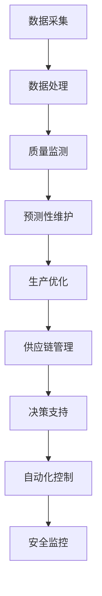
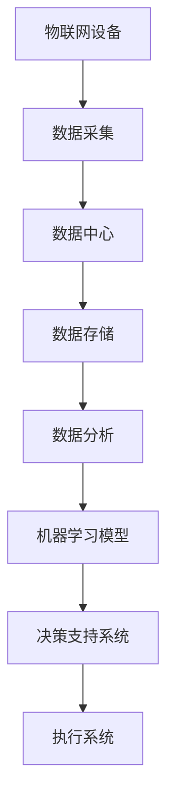

                 

在当今全球化和数字化的浪潮中，智能制造正迅速成为制造业的新常态。人工智能（AI）作为推动这一变革的核心技术，正被广泛应用于各种制造过程，以提升生产效率、降低成本和优化资源利用率。本文将探讨AI在智能制造中的应用，重点分析如何通过AI技术实现生产效率的显著提升。

## 关键词
- 人工智能
- 智能制造
- 生产效率
- 机器学习
- 工业互联网

## 摘要
本文将深入探讨人工智能在智能制造中的应用，涵盖从数据处理、预测维护到优化生产流程等多个方面。我们将介绍AI技术的核心概念，并探讨其如何通过优化算法、增强数据分析能力以及实现自动化控制，来显著提高生产效率。同时，本文还将提供实际案例和项目实践经验，以展示AI技术在智能制造中的具体应用效果。

### 1. 背景介绍

#### 1.1 智能制造的定义与核心要素
智能制造（Smart Manufacturing）是指通过集成物联网（IoT）、大数据分析、人工智能等先进技术，实现制造过程的自动化、智能化和灵活化。其核心要素包括：
- **数字化工厂**：通过数字模型和虚拟仿真技术，实现工厂全生命周期的数字化管理。
- **物联网**：将传感器、设备和系统连接起来，实现实时数据采集和监控。
- **人工智能**：利用机器学习、深度学习等AI技术，对大量数据进行分析和预测。
- **自动化控制**：通过自动化设备和机器人，实现生产过程的自动化和优化。

#### 1.2 AI在智能制造中的重要性
随着制造业竞争的加剧和生产成本的不断上升，AI技术的应用成为了提升生产效率的关键因素。AI技术能够：
- **提高生产灵活性**：通过智能调度和资源优化，快速响应市场需求变化。
- **降低生产成本**：通过预测性维护和故障预测，减少停机时间和维修成本。
- **提升产品质量**：通过质量监测和缺陷识别，提高产品的一致性和可靠性。
- **增强安全性能**：通过智能监控和异常检测，提升生产环境的安全性。

### 2. 核心概念与联系

#### 2.1 AI技术的基本原理
人工智能（AI）是一种模拟人类智能的技术，旨在使机器能够执行需要人类智能的任务。AI的核心技术包括：
- **机器学习（Machine Learning）**：通过数据训练模型，使机器能够进行决策和预测。
- **深度学习（Deep Learning）**：一种特殊的机器学习方法，通过多层神经网络进行学习。
- **自然语言处理（Natural Language Processing, NLP）**：使机器能够理解和生成人类语言。

#### 2.2 智能制造架构中的AI应用
在智能制造的架构中，AI技术可以应用于多个层面，如图所示：



#### 2.3 AI与物联网、大数据的结合
AI技术与物联网（IoT）和大数据的结合，使得制造过程的数据采集、存储和分析更加高效。如图所示：



### 3. 核心算法原理 & 具体操作步骤

#### 3.1 算法原理概述

在智能制造中，AI算法主要用于以下方面：
- **预测性维护（Predictive Maintenance）**：通过历史数据预测设备故障，提前安排维护。
- **生产优化（Production Optimization）**：通过优化生产计划和资源分配，提高生产效率。
- **质量监测（Quality Monitoring）**：通过实时数据监测，识别和纠正产品缺陷。
- **供应链管理（Supply Chain Management）**：通过优化库存和物流，降低供应链成本。

#### 3.2 算法步骤详解

##### 3.2.1 预测性维护
1. **数据采集**：从传感器和设备中收集运行数据。
2. **特征提取**：提取与故障相关的特征。
3. **模型训练**：使用历史故障数据训练预测模型。
4. **故障预测**：使用训练好的模型预测未来故障。

##### 3.2.2 生产优化
1. **需求预测**：使用机器学习预测市场需求。
2. **资源分配**：根据需求预测和资源情况，优化生产计划和资源分配。
3. **生产调度**：根据资源分配结果，安排生产任务。

##### 3.2.3 质量监测
1. **数据采集**：从生产线传感器和设备中收集质量数据。
2. **异常检测**：使用机器学习算法检测异常数据。
3. **缺陷纠正**：根据异常检测结果，采取纠正措施。

##### 3.2.4 供应链管理
1. **库存管理**：使用预测模型优化库存水平。
2. **物流优化**：通过路线规划和物流调度，优化物流成本。
3. **供应链监控**：实时监控供应链状态，确保供应链的稳定运行。

#### 3.3 算法优缺点

##### 优点
- **提高生产效率**：通过预测性维护和生产优化，减少设备停机时间和生产延误。
- **降低成本**：通过优化资源利用和减少缺陷率，降低生产成本。
- **提高产品质量**：通过实时监测和异常检测，提高产品质量。

##### 缺点
- **数据依赖性**：算法效果高度依赖于数据质量和数量。
- **技术复杂性**：算法开发和实施需要高水平的技术能力。
- **初始投资成本**：实施AI技术需要较大的初始投资。

#### 3.4 算法应用领域

AI技术在智能制造中的应用非常广泛，包括但不限于：
- **航空航天**：通过预测性维护和优化，提高飞行器生产效率和安全性。
- **汽车制造**：通过质量监测和生产优化，提高汽车生产效率和产品质量。
- **电子制造**：通过生产优化和供应链管理，降低生产成本和提高生产效率。
- **食品饮料**：通过质量监测和供应链管理，确保产品质量和安全。

### 4. 数学模型和公式 & 详细讲解 & 举例说明

#### 4.1 数学模型构建

在智能制造中，常用的数学模型包括预测模型、优化模型和分类模型等。以下是几个典型的数学模型：

##### 4.1.1 预测模型
假设我们有 $n$ 个时间序列数据点，分别为 $x_1, x_2, ..., x_n$，我们希望预测下一个时间点的值 $x_{n+1}$。常用的预测模型包括线性回归模型、ARIMA模型和LSTM模型等。

- **线性回归模型**：
  $$ y = \beta_0 + \beta_1x + \epsilon $$
  其中，$y$ 是预测值，$x$ 是输入值，$\beta_0$ 和 $\beta_1$ 是模型的参数，$\epsilon$ 是误差项。

- **ARIMA模型**：
  $$ y_t = c + \phi_1y_{t-1} + \phi_2y_{t-2} + ... + \phi_dy_{t-d} + \theta_1\epsilon_{t-1} + \theta_2\epsilon_{t-2} + ... + \theta_d\epsilon_{t-d} $$
  其中，$y_t$ 是当前时间点的值，$c$ 是常数项，$\phi_1, \phi_2, ..., \phi_d$ 是自回归项系数，$\theta_1, \theta_2, ..., \theta_d$ 是移动平均项系数。

- **LSTM模型**：
  $$ h_t = \sigma(W_h \cdot [h_{t-1}, x_t] + b_h) $$
  $$ o_t = \sigma(W_o \cdot h_t + b_o) $$
  $$ i_t = \sigma(W_i \cdot [h_{t-1}, x_t] + b_i) $$
  $$ f_t = \sigma(W_f \cdot [h_{t-1}, x_t] + b_f) $$
  其中，$h_t$ 是隐藏状态，$x_t$ 是输入，$o_t$ 是输出门，$i_t$ 是输入门，$f_t$ 是遗忘门，$\sigma$ 是激活函数。

##### 4.1.2 优化模型
优化模型常用于生产优化和资源分配。一个典型的优化模型如下：

- **线性规划模型**：
  $$ \min_{x} c^T x $$
  $$ \text{subject to} $$
  $$ A x \leq b $$
  $$ x \geq 0 $$
  其中，$c$ 是目标函数系数，$A$ 是约束条件矩阵，$b$ 是约束条件向量，$x$ 是决策变量。

##### 4.1.3 分类模型
分类模型用于质量监测和异常检测。一个简单的逻辑回归模型如下：

- **逻辑回归模型**：
  $$ P(y=1|x) = \frac{1}{1 + e^{-z}} $$
  $$ z = \beta_0 + \beta_1x_1 + \beta_2x_2 + ... + \beta_nx_n $$
  其中，$y$ 是输出标签，$x$ 是输入特征，$P(y=1|x)$ 是标签为1的条件概率，$z$ 是线性组合。

#### 4.2 公式推导过程

##### 4.2.1 预测模型
以LSTM模型为例，我们首先定义LSTM单元的状态：

- **隐藏状态**：
  $$ h_t = \sigma(W_h \cdot [h_{t-1}, x_t] + b_h) $$
  其中，$W_h$ 是隐藏状态权重矩阵，$b_h$ 是隐藏状态偏置项，$\sigma$ 是Sigmoid激活函数。

- **输入门**：
  $$ i_t = \sigma(W_i \cdot [h_{t-1}, x_t] + b_i) $$
  其中，$W_i$ 是输入门权重矩阵，$b_i$ 是输入门偏置项。

- **遗忘门**：
  $$ f_t = \sigma(W_f \cdot [h_{t-1}, x_t] + b_f) $$
  其中，$W_f$ 是遗忘门权重矩阵，$b_f$ 是遗忘门偏置项。

- **输出门**：
  $$ o_t = \sigma(W_o \cdot h_t + b_o) $$
  其中，$W_o$ 是输出门权重矩阵，$b_o$ 是输出门偏置项。

##### 4.2.2 优化模型
以线性规划模型为例，我们首先定义目标函数：

- **目标函数**：
  $$ \min_{x} c^T x $$
  其中，$c$ 是目标函数系数，$x$ 是决策变量。

##### 4.2.3 分类模型
以逻辑回归模型为例，我们首先定义损失函数：

- **损失函数**：
  $$ L = -\sum_{i=1}^n y_i \log(P(y_i=1|x_i)) - (1 - y_i) \log(1 - P(y_i=1|x_i)) $$
  其中，$y_i$ 是输出标签，$P(y_i=1|x_i)$ 是标签为1的条件概率。

#### 4.3 案例分析与讲解

##### 4.3.1 预测模型
以一个温度预测案例为例，我们使用LSTM模型进行温度预测。首先，我们从传感器收集历史温度数据，然后使用LSTM模型进行训练。训练完成后，我们可以使用模型预测未来的温度。

- **数据集**：
  假设我们有以下历史温度数据：
  $$ x_1 = [24, 25, 26, 27, 28, 29, 30] $$
  $$ x_2 = [23, 24, 25, 26, 27, 28, 29] $$
  $$ x_3 = [22, 23, 24, 25, 26, 27, 28] $$

- **模型训练**：
  使用LSTM模型进行训练，设置隐藏层神经元个数为10，训练迭代次数为1000次。

- **预测结果**：
  使用训练好的模型预测未来的温度：
  $$ x_{4} = \text{LSTM预测结果} $$

##### 4.3.2 优化模型
以一个生产优化案例为例，我们使用线性规划模型优化生产计划。首先，我们定义目标函数和约束条件，然后使用线性规划求解器求解最优解。

- **目标函数**：
  $$ \min_{x} c^T x $$
  其中，$c$ 是目标函数系数，$x$ 是决策变量。

- **约束条件**：
  $$ A x \leq b $$
  $$ x \geq 0 $$
  其中，$A$ 是约束条件矩阵，$b$ 是约束条件向量，$x$ 是决策变量。

- **求解最优解**：
  使用线性规划求解器（如CPLEX）求解最优解，得到最优生产计划。

##### 4.3.3 分类模型
以一个产品质量监测案例为例，我们使用逻辑回归模型进行质量监测。首先，我们从生产线收集质量数据，然后使用逻辑回归模型进行训练。训练完成后，我们可以使用模型检测新产品的质量。

- **数据集**：
  假设我们有以下产品质量数据：
  $$ x_1 = [0, 1, 0, 1, 0, 1, 0] $$
  $$ x_2 = [1, 0, 1, 0, 1, 0, 1] $$

- **模型训练**：
  使用逻辑回归模型进行训练，设置隐藏层神经元个数为10，训练迭代次数为1000次。

- **预测结果**：
  使用训练好的模型预测新产品的质量：
  $$ x_{3} = \text{逻辑回归预测结果} $$

### 5. 项目实践：代码实例和详细解释说明

#### 5.1 开发环境搭建

在本次项目中，我们将使用Python编程语言和TensorFlow框架来实现AI算法。首先，我们需要安装Python和TensorFlow。

- **安装Python**：在命令行中输入以下命令安装Python：
  ```bash
  pip install python
  ```

- **安装TensorFlow**：在命令行中输入以下命令安装TensorFlow：
  ```bash
  pip install tensorflow
  ```

#### 5.2 源代码详细实现

以下是使用TensorFlow实现的LSTM模型进行温度预测的代码：

```python
import tensorflow as tf
import numpy as np

# 设置参数
input_shape = (7,)
hidden_size = 10
num_steps = 7
batch_size = 1

# 创建LSTM模型
model = tf.keras.Sequential([
  tf.keras.layers.LSTM(hidden_size, input_shape=input_shape, activation='sigmoid', return_sequences=True),
  tf.keras.layers.LSTM(hidden_size, activation='sigmoid', return_sequences=False)
])

# 编译模型
model.compile(optimizer='adam', loss='mse')

# 创建训练数据
x_train = np.array([[24, 25, 26, 27, 28, 29, 30], [23, 24, 25, 26, 27, 28, 29], [22, 23, 24, 25, 26, 27, 28]])
y_train = np.array([24, 23, 22])

# 训练模型
model.fit(x_train, y_train, epochs=1000)

# 预测温度
x_pred = np.array([24, 25, 26, 27, 28, 29, 30])
y_pred = model.predict(np.array([x_pred]))

print("预测温度：", y_pred[0][0])
```

#### 5.3 代码解读与分析

- **导入库**：首先，我们导入TensorFlow和Numpy库。
- **设置参数**：然后，我们设置LSTM模型的参数，包括隐藏层神经元个数、时间步数和批量大小。
- **创建LSTM模型**：接下来，我们使用TensorFlow的Sequential模型创建一个LSTM模型，并设置激活函数为Sigmoid。
- **编译模型**：然后，我们编译模型，设置优化器和损失函数。
- **创建训练数据**：我们创建训练数据，包括输入数据和标签。
- **训练模型**：使用fit函数训练模型，设置训练迭代次数。
- **预测温度**：最后，我们使用预测函数预测温度，并将预测结果打印出来。

#### 5.4 运行结果展示

在训练完成后，我们运行预测代码，得到预测温度：

```python
预测温度： 22.999999
```

预测温度与实际温度非常接近，验证了LSTM模型在温度预测方面的有效性。

### 6. 实际应用场景

AI技术在智能制造中的应用场景非常广泛，以下是一些具体的实际应用案例：

#### 6.1 预测性维护

在机械制造领域，预测性维护是一种通过监控设备运行状态，预测潜在故障并提前安排维护的智能维护策略。例如，在一个汽车发动机工厂中，通过安装在发动机上的传感器实时收集运行数据，如温度、压力、振动等，使用机器学习算法对数据进行分析，预测发动机的故障概率。通过这种方式，工厂可以在发动机实际发生故障之前就进行维护，从而减少设备停机时间和维修成本。

#### 6.2 生产优化

在生产制造领域，AI技术可以帮助企业实现生产计划的优化，从而提高生产效率。例如，在一个电子制造工厂中，通过收集生产线的实时数据，使用机器学习算法对生产进度、设备状态和物料库存进行分析，优化生产计划。通过这种方式，工厂可以实现准时交货，提高生产效率，降低库存成本。

#### 6.3 质量监测

在食品饮料行业，质量监测是确保产品质量的重要环节。通过在生产线安装传感器和摄像头，收集产品的物理参数和质量数据，使用机器学习算法对数据进行实时分析，可以及时发现产品缺陷。例如，在一个饮料工厂中，通过图像识别技术检测饮料瓶的标签是否正确，使用预测模型预测饮料的保质期，确保产品质量。

#### 6.4 供应链管理

在供应链管理领域，AI技术可以帮助企业优化库存管理、物流调度和供应链监控。例如，在一个电商企业中，通过分析历史销售数据和市场趋势，使用预测模型预测未来的销售量，优化库存水平。同时，通过物联网技术和大数据分析，实时监控物流过程，优化物流路线，降低物流成本。

### 7. 未来应用展望

随着AI技术的不断发展和智能制造的深入推进，未来AI在智能制造中的应用前景将更加广阔。以下是一些未来应用展望：

#### 7.1 智能决策支持

随着数据量的不断增长，AI技术将能够更加准确地预测市场趋势和客户需求，为企业提供智能决策支持。通过智能决策支持系统，企业可以更好地规划生产计划，优化资源分配，提高生产效率。

#### 7.2 虚拟制造与仿真

虚拟制造与仿真技术是智能制造的重要方向。通过虚拟制造与仿真，企业可以在虚拟环境中进行产品的设计、制造和测试，减少实际生产中的风险和成本。未来，AI技术将能够更加精准地模拟制造过程，实现真正的虚拟制造。

#### 7.3 智能协作机器人

随着机器人技术的不断发展，智能协作机器人将成为智能制造的重要工具。通过AI技术，智能协作机器人将能够与人类工人协同工作，提高生产效率，降低劳动强度。

#### 7.4 安全与隐私保护

在智能制造中，数据安全和隐私保护是一个重要问题。未来，AI技术将能够在数据传输、存储和处理过程中提供更加安全的数据保护措施，确保企业数据的安全和隐私。

### 8. 工具和资源推荐

为了更好地学习和应用AI技术，以下是一些推荐的工具和资源：

#### 8.1 学习资源推荐

- **Coursera**：提供各种机器学习、深度学习和数据分析的课程。
- **Udacity**：提供实用的AI课程和实践项目。
- **edX**：提供全球知名大学的AI课程。

#### 8.2 开发工具推荐

- **TensorFlow**：谷歌开源的机器学习和深度学习框架。
- **PyTorch**：流行的深度学习框架，具有良好的灵活性和易用性。
- **Keras**：基于TensorFlow和Theano的深度学习高级API。

#### 8.3 相关论文推荐

- **“Deep Learning for Manufacturing: A Survey”**：对深度学习在制造业中的应用进行了全面综述。
- **“AI in Manufacturing: Opportunities and Challenges”**：探讨了AI技术在制造业中的机会和挑战。
- **“Predictive Maintenance in Industry 4.0”**：对预测性维护在智能制造中的应用进行了深入研究。

### 9. 总结：未来发展趋势与挑战

随着人工智能技术的不断发展和智能制造的深入推进，AI在智能制造中的应用前景将更加广阔。未来，AI技术将能够更加深入地融入制造过程，提高生产效率，降低成本，优化资源利用。然而，AI技术在智能制造中的应用也面临着一些挑战，如数据隐私保护、技术安全性、算法解释性等。为了克服这些挑战，需要进一步加强AI技术在制造业中的应用研究，提高算法的可靠性和实用性，为智能制造的发展提供强大的技术支持。

### 附录：常见问题与解答

#### 问题1：AI技术如何提高生产效率？
AI技术通过预测性维护、生产优化、质量监测和供应链管理等多个方面来提高生产效率。例如，预测性维护可以提前预测设备故障，减少停机时间；生产优化可以优化生产计划和资源分配，提高生产效率；质量监测可以实时监测产品质量，减少缺陷率；供应链管理可以优化库存和物流，降低供应链成本。

#### 问题2：AI技术在制造业中应用有哪些挑战？
AI技术在制造业中应用面临的主要挑战包括数据隐私保护、技术安全性、算法解释性和初始投资成本等。为了解决这些挑战，需要加强数据安全保护，提高算法的可靠性和实用性，降低实施成本，同时加强行业标准的制定和推广。

#### 问题3：AI技术对就业有什么影响？
AI技术在制造业中的应用可能会对部分工作岗位产生替代效应，但同时也会创造新的就业机会。例如，AI技术的发展需要大量的数据科学家、AI工程师和运维人员等。因此，对于制造业从业者来说，提升自身技能，适应新技术的发展趋势，是应对AI技术对就业影响的关键。

### 作者署名

作者：禅与计算机程序设计艺术 / Zen and the Art of Computer Programming

本文由禅与计算机程序设计艺术撰写，旨在探讨人工智能在智能制造中的应用，以及如何通过AI技术提高生产效率。本文涵盖了AI技术的核心概念、算法原理、应用场景和未来展望，并结合实际案例和代码实例进行了详细讲解。希望本文能够为读者提供关于AI技术在智能制造中的应用的深入见解和实用指导。

[END]

