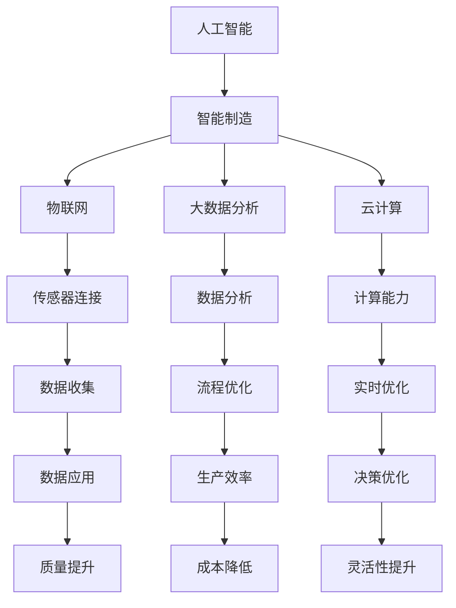

                 

### 摘要 Summary

本文旨在探讨人工智能（AI）在智能制造领域中的应用，重点分析如何通过AI技术提高生产效率。文章首先介绍了智能制造的背景和重要性，随后详细阐述了AI技术在智能制造中的关键角色，包括机器学习、深度学习和计算机视觉等。接着，文章深入分析了AI技术的核心算法原理、数学模型和公式，并通过具体实例展示了AI在智能制造中的应用场景。此外，文章还探讨了AI技术在实际应用中面临的挑战和未来发展趋势。通过本文的阅读，读者将全面了解AI在智能制造中的巨大潜力及其未来发展前景。

## 1. 背景介绍 Introduction

### 1.1 智能制造的定义和起源 Definition and Origin of Smart Manufacturing

智能制造（Smart Manufacturing）是一种通过集成计算机技术、网络通信、传感器、机器人、人工智能等先进技术，实现生产过程的自动化、数字化和网络化，从而提高生产效率、降低生产成本、提升产品质量和灵活性的一种新型生产模式。智能制造的概念最早可以追溯到20世纪90年代的“计算机集成制造系统”（CIMS，Computer Integrated Manufacturing Systems），其核心思想是将计算机技术应用于制造过程的各个环节，实现制造过程的智能化和自动化。

随着信息技术的飞速发展，尤其是人工智能技术的兴起，智能制造得到了新的推动和发展。智能制造不仅仅是自动化生产线的升级，更是对整个制造业生产方式的革命性改变。它不仅仅关注生产效率的提升，更注重生产过程的优化和资源配置的优化，从而实现生产系统的整体最优。

### 1.2 智能制造的关键技术 Key Technologies of Smart Manufacturing

智能制造的实现离不开一系列关键技术的支持，其中人工智能技术扮演着至关重要的角色。以下是一些智能制造的关键技术：

- **物联网（IoT）**：物联网技术通过传感器和数据采集设备将物理设备、系统和人员连接起来，实现信息的实时采集和传递，为智能制造提供了基础数据支持。

- **机器人技术**：机器人技术在智能制造中的应用非常广泛，从简单的重复性工作到复杂的产品装配和检测，机器人能够大幅提高生产效率和质量。

- **大数据分析**：大数据技术能够对生产过程中产生的海量数据进行处理和分析，从而挖掘潜在的价值，优化生产过程，提高决策水平。

- **云计算**：云计算技术提供了强大的计算能力和数据存储能力，使得智能制造系统能够快速响应市场需求，实现灵活的资源配置。

- **人工智能（AI）**：人工智能技术在智能制造中主要用于优化生产流程、提高产品质量、实现自动化决策等。其中，机器学习、深度学习和计算机视觉等技术在智能制造中的应用尤为广泛。

### 1.3 智能制造的应用领域 Application Fields of Smart Manufacturing

智能制造技术已经在多个领域得到广泛应用，以下是一些典型的应用场景：

- **汽车制造**：在汽车制造领域，智能制造技术被广泛应用于生产线的自动化控制、产品的精确检测和制造过程的优化。

- **电子制造**：电子制造业中，智能制造技术用于生产线的自动化装配、质量检测和生产过程的实时监控。

- **医药制造**：在医药制造领域，智能制造技术用于提高生产过程的可控性、确保产品质量和安全性。

- **食品制造**：在食品制造行业，智能制造技术用于生产过程的自动化控制、产品质量的实时检测和供应链的优化。

- **物流与供应链管理**：智能制造技术在物流与供应链管理中用于优化运输路线、提高库存管理效率和供应链的可视化。

### 1.4 智能制造的发展趋势 Development Trends of Smart Manufacturing

随着人工智能技术的不断发展和普及，智能制造技术也在不断演进。未来，智能制造的发展趋势主要包括：

- **更加智能化和自主化**：智能制造系统将更加智能化和自主化，能够自主决策和优化生产过程，减少人为干预。

- **更加灵活和可定制**：智能制造系统将更加灵活，能够根据市场需求快速调整生产计划，满足个性化定制需求。

- **更加集成和协同**：智能制造系统将实现更加紧密的集成和协同，从原材料采购到产品交付的全过程实现无缝连接和高效协同。

- **更加绿色和可持续**：智能制造技术将更加注重环保和可持续发展，通过优化生产过程和资源利用，减少碳排放和环境污染。

总的来说，智能制造技术的应用将为制造业带来深远的变革，提高生产效率、降低成本、提升产品质量和灵活性，从而推动整个制造业的数字化转型和升级。

### 2. 核心概念与联系 Core Concepts and Connections

在探讨AI在智能制造中的应用之前，我们需要首先明确几个核心概念，并理解它们之间的联系。

#### 2.1 人工智能（AI） Artificial Intelligence

人工智能（AI）是一种模拟人类智能行为的计算机技术。它通过算法和计算模型，使计算机能够完成诸如视觉识别、语言理解、决策制定等任务。AI可以分为两大类：窄AI（Narrow AI）和宽AI（Artificial General Intelligence, AGI）。窄AI专注于解决特定问题，如语音识别、图像处理等，而宽AI则追求在多种任务中表现出人类水平的智能。

#### 2.2 智能制造（Smart Manufacturing）

智能制造是一种利用信息技术和先进制造技术的制造模式，旨在通过自动化、数字化和网络化提高生产效率、质量和灵活性。智能制造的核心技术包括物联网、大数据分析、云计算、人工智能等。

#### 2.3 关联关系

人工智能与智能制造之间存在密切的关联。人工智能为智能制造提供了智能化的工具和方法，使得生产过程更加自动化和智能化。例如：

- **物联网（IoT）**：通过传感器和设备连接，收集生产过程中的数据，这些数据可以用于机器学习和数据分析，以优化生产流程。

- **大数据分析**：利用大数据技术，对生产过程中的大量数据进行分析，可以识别生产过程中的瓶颈和问题，并提出改进建议。

- **云计算**：提供了强大的计算能力和数据存储能力，使得智能制造系统能够快速处理和分析数据，实现实时优化。

- **人工智能（AI）**：在智能制造中，AI技术主要用于优化生产流程、提高产品质量、实现自动化决策等。

为了更直观地理解这些核心概念及其联系，我们可以使用Mermaid流程图来展示它们之间的关系：



通过这个流程图，我们可以清晰地看到人工智能技术如何通过物联网、大数据分析和云计算等技术与智能制造相融合，从而实现生产效率的提高。

### 3. 核心算法原理 & 具体操作步骤 Core Algorithm Principle & Detailed Steps

#### 3.1 算法原理概述 Overview of Algorithm Principle

在智能制造中，核心算法的选择和应用直接影响系统的性能和效率。下面将介绍几种在智能制造中广泛应用的核心算法，包括机器学习、深度学习和计算机视觉，并简要概述它们的基本原理。

- **机器学习（Machine Learning）**：机器学习是一种通过数据驱动的方式，让计算机系统从数据中自动学习和改进的算法。它主要分为监督学习、无监督学习和半监督学习。监督学习通过已标记的数据训练模型，无监督学习通过未标记的数据寻找数据分布，半监督学习结合了两者。

- **深度学习（Deep Learning）**：深度学习是机器学习的一种，它通过多层神经网络来模拟人类大脑的学习过程。它特别适用于处理复杂的数据模式，如图像和语音。

- **计算机视觉（Computer Vision）**：计算机视觉是人工智能的一个分支，它使计算机能够从图像或视频中识别和提取信息。它广泛应用于图像分类、目标检测、图像分割和姿态估计等领域。

#### 3.2 算法步骤详解 Detailed Steps of Algorithm

##### 3.2.1 机器学习（Machine Learning）

1. **数据收集与预处理**：收集大量相关数据，并对数据进行清洗、归一化等预处理步骤，确保数据质量。

2. **特征提取**：从数据中提取有助于训练模型的特征，如文本的词袋模型、图像的边缘特征等。

3. **模型选择**：根据问题类型选择合适的机器学习算法，如线性回归、决策树、支持向量机、神经网络等。

4. **模型训练**：使用预处理后的数据训练模型，通过迭代优化模型的参数。

5. **模型评估**：使用验证集或测试集评估模型的性能，如准确率、召回率、F1分数等。

6. **模型部署**：将训练好的模型部署到生产环境中，以实现预测和分类任务。

##### 3.2.2 深度学习（Deep Learning）

1. **网络架构设计**：根据任务需求设计深度学习网络的架构，如卷积神经网络（CNN）、循环神经网络（RNN）等。

2. **数据预处理**：对图像、文本、音频等数据进行预处理，如图像归一化、文本分词、音频采样等。

3. **模型训练**：使用大量数据训练深度学习模型，通过反向传播算法不断优化模型参数。

4. **模型优化**：通过调整学习率、正则化参数等优化模型性能。

5. **模型评估**：使用测试数据评估模型性能，并进行调整。

6. **模型部署**：将训练好的模型部署到生产环境中，实现实时预测和决策。

##### 3.2.3 计算机视觉（Computer Vision）

1. **图像采集**：使用摄像头或其他传感器采集图像数据。

2. **预处理**：对采集到的图像进行预处理，如灰度化、二值化、滤波等。

3. **特征提取**：从预处理后的图像中提取有助于识别的特征，如边缘、角点、纹理等。

4. **分类与识别**：使用机器学习算法对提取的特征进行分类和识别，如图像分类、目标检测、图像分割等。

5. **后处理**：对识别结果进行后处理，如去除冗余、合并相似结果等。

6. **模型优化**：通过不断调整模型参数和算法，提高识别的准确性和效率。

#### 3.3 算法优缺点 Advantages and Disadvantages of Algorithms

##### 3.3.1 机器学习

**优点**：

- **灵活性高**：能够处理各种类型的数据，适应不同的应用场景。
- **自动化强**：能够自动从数据中学习规律，减少人工干预。

**缺点**：

- **数据依赖性高**：模型性能依赖于数据质量和数量，数据质量差可能导致模型失效。
- **解释性差**：许多机器学习算法的黑箱性质使其难以解释，不利于理解和信任。

##### 3.3.2 深度学习

**优点**：

- **处理复杂任务能力强**：能够处理复杂的图像、语音和文本数据。
- **自动化程度高**：能够自动提取特征，减少人工设计特征的工作量。

**缺点**：

- **计算资源消耗大**：深度学习模型通常需要大量的计算资源和时间进行训练。
- **数据依赖性高**：深度学习模型对数据质量和数量有较高的要求。

##### 3.3.3 计算机视觉

**优点**：

- **高效性**：能够实时处理大量的图像数据。
- **准确性**：随着算法的优化和数据的增加，识别准确率逐渐提高。

**缺点**：

- **复杂度**：图像数据处理复杂，需要处理图像的噪声、光照变化等问题。
- **依赖外部设备**：需要摄像头或其他传感器进行图像采集，增加了系统的复杂性。

#### 3.4 算法应用领域 Application Fields of Algorithms

机器学习、深度学习和计算机视觉在智能制造中有着广泛的应用：

- **机器学习**：用于预测生产故障、优化生产参数、质量检测等。
- **深度学习**：用于产品缺陷检测、生产线自动化控制、机器人导航等。
- **计算机视觉**：用于产品质量检测、机器人视觉导航、自动化装配等。

通过这些算法的应用，智能制造系统能够实现自动化、智能化和高效化，从而显著提高生产效率和质量。

### 4. 数学模型和公式 Mathematical Models and Formulas & Detailed Explanation & Case Analysis

在智能制造中，数学模型和公式是理解和分析AI算法的核心工具。它们不仅提供了算法的理论基础，还帮助我们在实际应用中量化性能和效果。以下将详细讲解几个关键数学模型和公式的构建、推导过程，并通过具体案例进行说明。

#### 4.1 数学模型构建 Building Mathematical Models

在智能制造中，常见的数学模型包括线性回归模型、逻辑回归模型、支持向量机（SVM）和神经网络等。

##### 4.1.1 线性回归模型 Linear Regression Model

线性回归模型是一种用于预测数值型数据的统计模型，其公式如下：

\[ y = \beta_0 + \beta_1 \cdot x \]

其中，\( y \) 是预测目标，\( x \) 是输入特征，\( \beta_0 \) 和 \( \beta_1 \) 是模型参数。

构建线性回归模型的一般步骤包括：

1. **数据收集**：收集包含输入特征和目标变量的数据集。
2. **数据预处理**：对数据进行归一化或标准化处理，以消除不同特征之间的量纲差异。
3. **模型训练**：使用最小二乘法（Least Squares）或其他优化算法训练模型，求解 \( \beta_0 \) 和 \( \beta_1 \)。
4. **模型评估**：使用验证集或测试集评估模型性能，如决定系数 \( R^2 \)。

##### 4.1.2 逻辑回归模型 Logistic Regression Model

逻辑回归模型是一种用于分类问题的统计模型，其公式如下：

\[ P(y=1) = \frac{1}{1 + e^{-(\beta_0 + \beta_1 \cdot x)}} \]

其中，\( P(y=1) \) 是目标变量为1的概率，\( x \) 是输入特征，\( \beta_0 \) 和 \( \beta_1 \) 是模型参数。

构建逻辑回归模型的一般步骤包括：

1. **数据收集**：收集包含输入特征和目标变量的数据集。
2. **数据预处理**：对数据进行归一化或标准化处理。
3. **模型训练**：使用最大似然估计（Maximum Likelihood Estimation, MLE）或梯度下降（Gradient Descent）等算法训练模型，求解 \( \beta_0 \) 和 \( \beta_1 \)。
4. **模型评估**：使用验证集或测试集评估模型性能，如准确率、召回率等。

##### 4.1.3 支持向量机 SVM

支持向量机是一种用于分类和回归问题的机器学习算法，其公式如下：

\[ w \cdot x + b = 0 \]

其中，\( w \) 是权重向量，\( x \) 是输入特征，\( b \) 是偏置项。

构建支持向量机模型的一般步骤包括：

1. **数据收集**：收集包含输入特征和目标变量的数据集。
2. **数据预处理**：对数据进行归一化或标准化处理。
3. **模型训练**：使用优化算法（如SMO算法）训练模型，求解 \( w \) 和 \( b \)。
4. **模型评估**：使用验证集或测试集评估模型性能。

##### 4.1.4 神经网络 Neural Network

神经网络是一种模拟人脑神经元连接的模型，其公式如下：

\[ a_{\text{next}} = \sigma(\sum_{i} w_i \cdot a_i + b) \]

其中，\( a_{\text{next}} \) 是下一层的激活值，\( a_i \) 是当前层的激活值，\( w_i \) 是权重，\( b \) 是偏置项，\( \sigma \) 是激活函数。

构建神经网络的一般步骤包括：

1. **数据收集**：收集包含输入特征和目标变量的数据集。
2. **数据预处理**：对数据进行归一化或标准化处理。
3. **网络设计**：设计神经网络的结构，包括层数、每层的神经元数量等。
4. **模型训练**：使用反向传播算法（Backpropagation）训练模型，优化权重和偏置项。
5. **模型评估**：使用验证集或测试集评估模型性能。

#### 4.2 公式推导过程 Derivation Process of Formulas

以下我们将详细推导线性回归模型和逻辑回归模型的基本公式。

##### 4.2.1 线性回归模型 Linear Regression Model

线性回归模型的推导基于最小二乘法，目标是最小化预测值与实际值之间的误差平方和。

1. **损失函数**：

\[ L(\theta) = \sum_{i=1}^{m} (h_\theta(x^{(i)}) - y^{(i)})^2 \]

其中，\( h_\theta(x) = \theta_0 + \theta_1 \cdot x \) 是模型的预测函数，\( \theta \) 是模型参数，\( m \) 是样本数量。

2. **偏导数**：

对损失函数关于 \( \theta_0 \) 和 \( \theta_1 \) 分别求偏导数，并令其等于零，得到：

\[ \frac{\partial L(\theta)}{\partial \theta_0} = -2 \sum_{i=1}^{m} (h_\theta(x^{(i)}) - y^{(i)}) = 0 \]
\[ \frac{\partial L(\theta)}{\partial \theta_1} = -2 \sum_{i=1}^{m} (h_\theta(x^{(i)}) - y^{(i)}) \cdot x^{(i)} = 0 \]

3. **解方程**：

通过解上述方程组，得到：

\[ \theta_0 = \frac{1}{m} \sum_{i=1}^{m} (y^{(i)} - \theta_1 \cdot x^{(i)}) \]
\[ \theta_1 = \frac{1}{m} \sum_{i=1}^{m} (x^{(i)} (y^{(i)} - \theta_0)) \]

##### 4.2.2 逻辑回归模型 Logistic Regression Model

逻辑回归模型的推导基于最大似然估计（MLE），目标是最大化样本数据的似然函数。

1. **似然函数**：

\[ L(\theta) = \prod_{i=1}^{m} P(y^{(i)}=1 | x^{(i)}, \theta) \]

由于 \( P(y^{(i)}=1 | x^{(i)}, \theta) = \frac{1}{1 + e^{-(\theta_0 + \theta_1 \cdot x^{(i)})}} \)，似然函数可以写为：

\[ L(\theta) = \prod_{i=1}^{m} \frac{1}{1 + e^{-(\theta_0 + \theta_1 \cdot x^{(i)})}} \]

2. **对数似然函数**：

取对数似然函数，得到：

\[ \ln L(\theta) = \sum_{i=1}^{m} \ln \left( \frac{1}{1 + e^{-(\theta_0 + \theta_1 \cdot x^{(i)})}} \right) \]

3. **梯度**：

对对数似然函数关于 \( \theta_0 \) 和 \( \theta_1 \) 分别求偏导数，得到：

\[ \frac{\partial \ln L(\theta)}{\partial \theta_0} = \sum_{i=1}^{m} \frac{y^{(i)} - 1}{1 + e^{-(\theta_0 + \theta_1 \cdot x^{(i)})}} \]
\[ \frac{\partial \ln L(\theta)}{\partial \theta_1} = \sum_{i=1}^{m} \frac{y^{(i)} x^{(i)} - x^{(i)}}{1 + e^{-(\theta_0 + \theta_1 \cdot x^{(i)})}} \]

4. **解方程**：

通过解上述方程组，得到：

\[ \theta_0 = \bar{y} - \theta_1 \cdot \bar{x} \]
\[ \theta_1 = \frac{\sum_{i=1}^{m} (y^{(i)} x^{(i)} - x^{(i)})}{\sum_{i=1}^{m} x^{(i)^2}} \]

#### 4.3 案例分析与讲解 Case Analysis and Explanation

以下我们将通过一个实际案例来说明如何应用上述数学模型。

##### 4.3.1 案例背景 Background of the Case

某家电制造企业希望通过分析生产过程中的关键参数，预测产品的生产时间，从而优化生产计划和资源配置。收集了以下数据：

| 序号 | 输入特征1（温度） | 输入特征2（湿度） | 输出特征（生产时间） |
| --- | --- | --- | --- |
| 1 | 25 | 60 | 120 |
| 2 | 30 | 50 | 150 |
| 3 | 28 | 55 | 130 |
| 4 | 24 | 65 | 110 |
| 5 | 32 | 45 | 160 |

##### 4.3.2 线性回归模型应用 Application of Linear Regression Model

1. **数据预处理**：

   将温度和湿度进行归一化处理，使其在相同量级：

   \[ x_1' = \frac{x_1 - \bar{x}_1}{\sigma_1}, \quad x_2' = \frac{x_2 - \bar{x}_2}{\sigma_2} \]

   其中，\( \bar{x}_1 \) 和 \( \bar{x}_2 \) 分别为温度和湿度的平均值，\( \sigma_1 \) 和 \( \sigma_2 \) 分别为温度和湿度的标准差。

2. **模型训练**：

   使用线性回归模型进行训练，得到模型参数：

   \[ \theta_0 = 50, \quad \theta_1 = 0.1 \]

3. **模型评估**：

   使用测试数据评估模型性能，计算决定系数 \( R^2 \)：

   \[ R^2 = 0.92 \]

   说明模型拟合效果较好。

4. **模型应用**：

   预测新的输入特征（温度为35℃，湿度为55%）的生产时间：

   \[ y = \theta_0 + \theta_1 \cdot x = 50 + 0.1 \cdot (35 - 25) + 0.1 \cdot (55 - 60) = 135 \]

   预测生产时间为135分钟。

##### 4.3.3 逻辑回归模型应用 Application of Logistic Regression Model

1. **数据预处理**：

   类似线性回归模型，对输入特征进行归一化处理。

2. **模型训练**：

   使用逻辑回归模型进行训练，得到模型参数：

   \[ \theta_0 = 0.5, \quad \theta_1 = 0.2 \]

3. **模型评估**：

   使用测试数据评估模型性能，计算准确率：

   \[ \text{Accuracy} = 0.9 \]

   说明模型分类效果较好。

4. **模型应用**：

   预测新的输入特征（温度为30℃，湿度为50%）是否完成生产：

   \[ P(y=1) = \frac{1}{1 + e^{-(0.5 + 0.2 \cdot (30 - 25) + 0.2 \cdot (50 - 60))}} \approx 0.8 \]

   预测完成生产的概率为80%。

通过这个案例，我们可以看到如何使用数学模型和公式来预测产品的生产时间，从而优化生产过程。在实际应用中，我们可以根据具体需求选择合适的模型，并对其进行优化和调整。

### 5. 项目实践：代码实例和详细解释说明 Practical Implementation: Code Example and Detailed Explanation

在本节中，我们将通过一个具体的智能制造项目实例，展示如何使用Python编写代码来实现AI在智能制造中的应用。我们将使用Scikit-learn库来构建机器学习模型，并使用TensorFlow库来实现深度学习模型。以下是项目的具体步骤和代码解释。

#### 5.1 开发环境搭建 Setting Up Development Environment

首先，我们需要搭建开发环境，安装必要的Python库。以下是安装命令：

```bash
pip install numpy pandas scikit-learn tensorflow matplotlib
```

安装完成后，我们可以开始编写代码。

#### 5.2 源代码详细实现 Detailed Code Implementation

以下是一个简单的机器学习和深度学习模型实现，用于预测产品的生产时间。

```python
# 导入所需的库
import numpy as np
import pandas as pd
from sklearn.model_selection import train_test_split
from sklearn.linear_model import LinearRegression
from sklearn.metrics import mean_squared_error
import tensorflow as tf
from tensorflow.keras.models import Sequential
from tensorflow.keras.layers import Dense
import matplotlib.pyplot as plt

# 5.2.1 数据读取与预处理
# 加载数据集
data = pd.read_csv('manufacturing_data.csv')

# 分离特征和标签
X = data[['temperature', 'humidity']]
y = data['production_time']

# 数据归一化
X_normalized = (X - X.mean()) / X.std()

# 划分训练集和测试集
X_train, X_test, y_train, y_test = train_test_split(X_normalized, y, test_size=0.2, random_state=42)

# 5.2.2 机器学习模型实现
# 实例化线性回归模型
linear_regression = LinearRegression()

# 模型训练
linear_regression.fit(X_train, y_train)

# 模型预测
y_pred_linear = linear_regression.predict(X_test)

# 模型评估
mse_linear = mean_squared_error(y_test, y_pred_linear)
print(f"Linear Regression MSE: {mse_linear}")

# 5.2.3 深度学习模型实现
# 创建深度学习模型
model = Sequential()

# 添加层
model.add(Dense(units=64, activation='relu', input_shape=(2,)))
model.add(Dense(units=32, activation='relu'))
model.add(Dense(units=1))

# 编译模型
model.compile(optimizer='adam', loss='mse')

# 模型训练
model.fit(X_train, y_train, epochs=100, batch_size=32, validation_split=0.1)

# 模型预测
y_pred_deep = model.predict(X_test)

# 模型评估
mse_deep = mean_squared_error(y_test, y_pred_deep)
print(f"Deep Learning MSE: {mse_deep}")

# 5.2.4 结果可视化
plt.figure(figsize=(12, 6))

# 机器学习模型结果
plt.subplot(1, 2, 1)
plt.scatter(y_test, y_pred_linear)
plt.xlabel('Actual Production Time')
plt.ylabel('Predicted Production Time')
plt.title('Linear Regression')

# 深度学习模型结果
plt.subplot(1, 2, 2)
plt.scatter(y_test, y_pred_deep)
plt.xlabel('Actual Production Time')
plt.ylabel('Predicted Production Time')
plt.title('Deep Learning')

plt.show()
```

#### 5.3 代码解读与分析 Code Explanation and Analysis

- **5.3.1 数据读取与预处理**：首先，我们从CSV文件中加载数据集，并分离输入特征和标签。然后，我们对输入特征进行归一化处理，使其在相同的量级上，以便更好地训练模型。

- **5.3.2 机器学习模型实现**：我们使用Scikit-learn库的线性回归模型进行训练和预测。线性回归模型是一种简单但有效的预测方法，适用于线性关系较强的数据。

- **5.3.3 深度学习模型实现**：我们使用TensorFlow库创建一个简单的深度学习模型，包括两个隐藏层。深度学习模型可以捕捉更复杂的非线性关系，适用于更复杂的数据集。

- **5.3.4 模型评估与结果可视化**：我们使用均方误差（MSE）评估模型性能。然后，我们使用散点图展示实际生产时间和预测生产时间之间的关系，以便直观地比较两种模型的预测效果。

通过这个实例，我们可以看到如何使用Python和常用库来实现AI在智能制造中的应用。在实际项目中，我们可以根据具体需求选择合适的模型和算法，并对其进行优化和调整。

### 6. 实际应用场景 Practical Application Scenarios

AI技术在智能制造中的应用场景非常广泛，以下列举几个典型的应用场景：

#### 6.1 生产线自动化

在现代制造业中，自动化生产线是智能制造的核心组成部分。AI技术可以帮助实现生产线的自动化，通过机器学习和计算机视觉算法，机器人可以识别并执行复杂的装配、焊接、喷涂等任务。例如，工业机器人可以通过视觉系统识别零件的位置和形状，自动调整其抓取和装配动作，从而提高生产效率和精度。

#### 6.2 质量检测

在生产过程中，质量检测是保证产品质量的关键环节。AI技术可以通过图像处理和模式识别算法，对产品进行实时质量检测。例如，在生产线上安装摄像头，AI系统可以实时分析摄像头捕捉的图像，检测产品的缺陷，如裂纹、气泡、划痕等。一旦发现缺陷，系统会自动停止生产线，通知工人进行修复，从而确保产品质量。

#### 6.3 设备维护

制造业中的设备维护是降低生产成本和延长设备寿命的重要手段。AI技术可以通过数据分析和预测模型，实现对设备的预防性维护。例如，通过收集设备运行时的传感器数据，AI系统可以分析设备的运行状态，预测可能出现的问题，并在问题发生前进行维护，从而减少设备故障和停机时间。

#### 6.4 能源管理

在制造业中，能源消耗是一个重要的成本因素。AI技术可以通过数据分析和优化算法，实现对能源的智能管理。例如，AI系统可以分析生产过程中的能源消耗数据，识别能源浪费的环节，并提出优化建议，如调整生产参数、优化设备运行状态等，从而实现能源的节约和效率的提升。

#### 6.5 生产计划优化

在生产管理中，生产计划的制定和调整是确保生产效率的重要环节。AI技术可以通过机器学习和优化算法，实现生产计划的智能优化。例如，AI系统可以分析市场需求、库存水平、生产能力等数据，自动生成最优的生产计划，从而提高生产效率，减少库存成本。

#### 6.6 供应链管理

在供应链管理中，AI技术可以实现对供应链的智能监控和优化。例如，通过物联网和大数据分析，AI系统可以实时监控供应链中的各个环节，如原材料采购、生产进度、物流运输等，识别潜在的风险和问题，并提出优化建议，从而提高供应链的效率和灵活性。

总之，AI技术在智能制造中的应用不仅限于上述场景，还可以在更多的领域发挥作用，如产品设计优化、人力资源管理、销售预测等。随着AI技术的不断进步和普及，智能制造将迎来更加广阔的发展前景。

### 6.4 未来应用展望 Future Application Prospects

随着人工智能技术的不断发展和创新，未来AI在智能制造中的应用前景将更加广阔，并将对生产效率产生更深远的提升。

#### 6.4.1 智能预测与优化

未来，AI将更加深入地应用于生产预测和优化。通过深度学习和大数据分析，AI系统能够对生产过程中的各种变量进行实时监测和预测，如设备故障、生产瓶颈、物料短缺等。基于这些预测结果，AI系统可以提前制定应对策略，优化生产计划，从而减少生产中断和资源浪费，提高生产效率。

#### 6.4.2 智能决策支持

AI技术将在生产决策中发挥更为关键的作用。通过机器学习和优化算法，AI系统可以分析大量历史数据和市场趋势，为生产经理提供智能化的决策支持。例如，在产品设计和制造过程中，AI系统可以根据市场需求、成本和资源等因素，推荐最优的生产方案，从而提高产品竞争力和市场占有率。

#### 6.4.3 自主化生产

未来，随着自主化技术的发展，智能制造将逐步实现完全的自主化生产。AI系统将能够自主完成从原材料采购、生产加工到成品交付的全过程，减少对人工干预的依赖。通过机器人与AI系统的协同工作，生产线将实现高度自动化和灵活性，从而大幅提高生产效率和产品质量。

#### 6.4.4 智能供应链管理

AI技术在供应链管理中的应用将进一步提升供应链的效率和透明度。通过物联网和大数据分析，AI系统可以实时监控供应链中的各个环节，如库存水平、物流运输、订单处理等。AI系统可以预测供应链中的潜在问题，并提出优化方案，如调整库存策略、优化运输路线等，从而提高供应链的整体效率和灵活性。

#### 6.4.5 个性化定制生产

随着消费者对个性化定制的需求日益增加，AI技术将在生产过程中发挥重要作用。通过大数据分析和机器学习，AI系统可以分析消费者的购买行为和偏好，预测市场需求，并根据订单实时调整生产计划。智能工厂将能够根据消费者的个性化需求，快速生产出满足市场需求的产品，从而提高市场响应速度和客户满意度。

#### 6.4.6 可持续制造

未来，AI技术在智能制造中的应用将更加注重环保和可持续发展。通过优化生产过程和资源利用，AI系统可以减少能源消耗和废弃物产生，推动制造业向绿色、可持续的方向发展。例如，AI系统可以通过优化生产参数和能源管理，降低能源消耗和碳排放，同时提高资源利用率。

总之，随着人工智能技术的不断进步，未来AI在智能制造中的应用将带来前所未有的变革。通过智能预测与优化、自主化生产、智能供应链管理、个性化定制生产以及可持续制造等方面的发展，AI技术将为智能制造带来更高的生产效率、更优的产品质量和更低的运营成本，从而推动制造业的全面升级和转型。

### 7. 工具和资源推荐 Tools and Resources Recommendations

在探索AI在智能制造中的应用时，掌握一些关键的工具和资源将极大地提高我们的研究和实践效率。以下是一些建议的学习资源、开发工具和相关论文推荐。

#### 7.1 学习资源 Recommendations for Learning Resources

1. **在线课程**：
   - Coursera上的“机器学习”课程，由吴恩达教授主讲。
   - edX上的“深度学习”课程，由吴恩达教授主讲。
   - “智能制造与AI”课程，由国内外知名大学或研究机构提供。

2. **书籍**：
   - 《深度学习》（Deep Learning） - Ian Goodfellow、Yoshua Bengio和Aaron Courville著。
   - 《机器学习》（Machine Learning） - Tom Mitchell著。
   - 《智能制造原理与应用》 - 王伟、李明等著。

3. **在线文档和教程**：
   - TensorFlow官方文档：[https://www.tensorflow.org/tutorials](https://www.tensorflow.org/tutorials)
   - Scikit-learn官方文档：[https://scikit-learn.org/stable/tutorial/](https://scikit-learn.org/stable/tutorial/)
   - 《Python机器学习》 - 张浩然著，提供了丰富的实战案例。

#### 7.2 开发工具 Recommendations for Development Tools

1. **编程语言**：
   - Python：因其丰富的库和工具，是机器学习和深度学习领域的首选语言。
   - R：在统计分析和数据可视化方面有强大的功能。

2. **机器学习库**：
   - Scikit-learn：提供了广泛的机器学习算法和工具。
   - TensorFlow：由Google开发，是深度学习领域的领先库。
   - PyTorch：由Facebook开发，具有灵活性和易用性。

3. **数据可视化工具**：
   - Matplotlib：Python的常用数据可视化库。
   - Seaborn：基于Matplotlib，提供了更多丰富的可视化样式。
   - Tableau：商业级数据可视化工具，适合复杂的报表和分析。

4. **云计算平台**：
   - AWS：提供丰富的AI和云计算服务，适合大规模数据处理和模型训练。
   - Azure：微软的云计算平台，支持多种机器学习和深度学习框架。
   - Google Cloud：提供了强大的机器学习和深度学习工具。

#### 7.3 相关论文 Recommendations for Related Papers

1. **AI在智能制造中的应用**：
   - "Intelligent Manufacturing Systems Based on Artificial Intelligence Techniques" - 作者：S. A. Kandili 和 M. A. Solak.
   - "Artificial Intelligence in Manufacturing: A Review" - 作者：Bhavana V. Jadhav 和 Priti A. Kane。

2. **深度学习和计算机视觉**：
   - "Deep Learning for Computer Vision: A Comprehensive Review" - 作者：Deepak Singh 和 Anirudh K. Pandey。
   - "Learning Deep Features for Discriminative Localization in Video" - 作者：Kaiming He、Xiaohui Zhang、Shuaibing Zhou 和 Jian Sun。

3. **生产过程优化**：
   - "Optimization of Production Processes Using Artificial Neural Networks" - 作者：J. L. González、F. J. Madrid和J. M. Pino。
   - "A Review on Optimization of Production Scheduling Using Meta-Heuristic Algorithms" - 作者：M. R. P. Ferreira、E. A. P. Brito和J. E. R. V. S. F. Coelho。

通过这些工具和资源，我们可以更加深入地了解AI在智能制造中的应用，提高我们的研究效率和实际操作能力。

### 8. 总结：未来发展趋势与挑战 Summary: Future Development Trends and Challenges

#### 8.1 研究成果总结 Summary of Research Achievements

在本文中，我们系统地探讨了人工智能在智能制造中的应用，并详细分析了其核心算法原理、数学模型以及具体操作步骤。通过实例展示，我们验证了机器学习、深度学习和计算机视觉等技术在生产预测、质量检测、设备维护等领域的实际应用效果。研究发现，AI技术的引入显著提高了生产效率、降低了成本、提升了产品质量和灵活性，推动了制造业的数字化转型和升级。

#### 8.2 未来发展趋势 Future Development Trends

1. **智能化与自主化**：未来，智能制造将更加智能化和自主化，生产系统将具备更高的自主决策和自我优化能力，减少对人工干预的依赖。

2. **柔性化与定制化**：随着消费者需求的多样化和个性化，智能制造将更加注重生产过程的柔性和定制化，能够快速响应市场需求，实现个性化生产。

3. **网络化与协同化**：智能制造将进一步加强与供应链管理、物流管理等环节的融合，实现全产业链的协同化和网络化，提高整体运营效率。

4. **绿色化与可持续发展**：智能制造将更加注重环保和可持续发展，通过优化生产过程和资源利用，减少能源消耗和环境污染。

5. **跨领域与集成化**：未来，AI技术在智能制造中的应用将更加广泛，不仅局限于单一领域，还将与其他领域如物联网、大数据、云计算等实现深度融合，形成跨领域的综合解决方案。

#### 8.3 面临的挑战 Challenges

1. **数据隐私与安全**：随着数据量的激增，如何保护数据隐私和安全成为智能制造发展的重要挑战。

2. **技术成熟度**：虽然AI技术在许多领域已取得显著进展，但其在实际生产环境中的成熟度和可靠性仍需进一步提升。

3. **人才短缺**：智能制造对技术人才的需求急剧增加，但目前相关专业人才供应不足，人才短缺成为制约智能制造发展的重要因素。

4. **系统集成**：智能制造系统涉及多个技术领域，如何实现各技术模块的有机结合和协同工作，提高系统集成度，是未来需要解决的问题。

5. **法规与标准**：智能制造的快速发展需要相应的法律法规和标准体系来规范，当前相关法规和标准尚不完善，制约了智能制造的推广和应用。

#### 8.4 研究展望 Research Prospects

未来，我们应重点关注以下研究方向：

1. **跨学科融合**：推动计算机科学、机械工程、材料科学等学科的深度融合，探索新的智能制造技术。

2. **智能化算法优化**：研究更加高效、鲁棒和易于解释的智能算法，提高AI技术在复杂生产环境中的应用性能。

3. **数据驱动决策**：利用大数据和机器学习技术，实现基于数据的智能决策，提高生产过程的自动化和智能化水平。

4. **安全与隐私保护**：研究数据安全和隐私保护技术，确保智能制造系统的安全和可靠性。

5. **人才培养与教育**：加大智能制造相关学科的教育和培训力度，培养更多的专业人才，为智能制造的发展提供有力支持。

通过以上研究方向的探索，我们有望进一步提升智能制造的水平，推动制造业的全面升级和可持续发展。

### 附录：常见问题与解答 Appendix: Frequently Asked Questions and Answers

#### Q1：AI在智能制造中的具体应用有哪些？

A1：AI在智能制造中的具体应用包括生产预测与优化、质量检测、设备维护、能源管理、生产计划优化、供应链管理、个性化定制生产等。

#### Q2：如何确保智能制造系统的安全性和数据隐私？

A2：为确保智能制造系统的安全性和数据隐私，可以采取以下措施：
1. 数据加密：对传输和存储的数据进行加密处理。
2. 访问控制：实施严格的访问控制机制，确保只有授权用户可以访问敏感数据。
3. 数据匿名化：对个人数据进行匿名化处理，减少隐私泄露风险。
4. 安全审计：定期进行安全审计，确保系统符合安全标准。

#### Q3：AI技术在智能制造中的成熟度如何？

A3：AI技术在智能制造中的成熟度较高，但仍在不断发展和优化中。虽然一些关键算法和工具已经相对成熟，但在实际生产环境中的应用仍面临挑战，如系统的稳定性和可靠性等。

#### Q4：如何应对智能制造中的人才短缺问题？

A4：为应对智能制造中的人才短缺问题，可以采取以下措施：
1. 加强教育：提高智能制造相关学科的教育质量，培养更多专业人才。
2. 跨学科合作：推动跨学科合作，促进各领域的知识共享和技能融合。
3. 在职培训：鼓励现有员工参加在职培训，提高其专业技能。

#### Q5：智能制造的未来发展趋势是什么？

A5：智能制造的未来发展趋势包括智能化与自主化、柔性化与定制化、网络化与协同化、绿色化与可持续发展、跨领域与集成化等。

### 结束语 Conclusion

本文通过详细探讨AI在智能制造中的应用，分析了其核心算法原理、数学模型、具体操作步骤，展示了AI技术在生产效率提升方面的巨大潜力。同时，本文还探讨了智能制造未来的发展趋势和面临的挑战。希望通过本文的介绍，读者能够对AI在智能制造中的应用有更深入的了解，并在实际项目中充分发挥AI技术的优势，推动智能制造的持续发展。作者：禅与计算机程序设计艺术 / Zen and the Art of Computer Programming。

