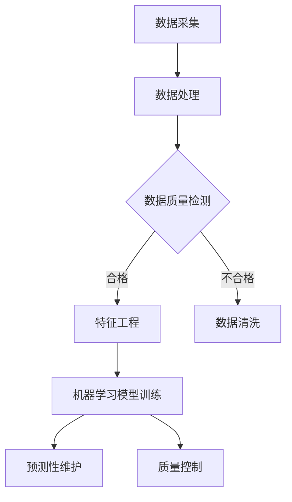

                 

关键词：人工智能、智能制造、预测性维护、质量控制、数据分析

## 摘要

本文旨在探讨人工智能在智能制造领域中的应用，特别是预测性维护与质量控制两大关键环节。通过深入分析AI技术的工作原理及其实际操作步骤，本文将揭示AI如何通过数据驱动的方式，提高生产效率，降低设备故障率，并确保产品质量。文章还将探讨数学模型在AI算法中的应用，通过实例和代码分析，展示AI在智能制造中的实际应用效果。同时，文章也将展望未来AI在智能制造领域的应用前景，为读者提供有益的参考和启示。

## 1. 背景介绍

随着全球制造业的快速发展，智能制造逐渐成为现代工业的核心。智能制造不仅包括传统制造业的自动化和数字化升级，还涉及通过大数据、云计算、物联网和人工智能等先进技术，实现生产过程的智能化管理。人工智能作为推动智能制造发展的关键技术之一，已经在生产优化、故障预测、质量控制等方面展现出强大的潜力。

### 1.1 智能制造的定义与特点

智能制造（Intelligent Manufacturing）是一种利用人工智能技术实现制造业智能化、网络化、协同化的制造模式。它主要具备以下特点：

- **自动化与数字化**：通过自动化设备和数字化工具，实现生产过程的自动化和数字化管理。
- **智能化与网络化**：利用人工智能技术实现生产设备之间的互联互通，实现信息共享和协同作业。
- **数据驱动与自适应**：通过收集和分析大量数据，实现生产过程的自适应优化和预测性维护。

### 1.2 预测性维护

预测性维护（Predictive Maintenance）是一种基于实时数据分析和预测，提前发现设备故障并进行预防性维修的维护策略。与传统定期维修相比，预测性维护能够显著降低设备故障率，延长设备使用寿命，提高生产效率。

### 1.3 质量控制

质量控制（Quality Control）是确保产品在生产过程中达到预定质量标准的一系列措施。在智能制造中，通过引入人工智能技术，可以实现全流程的质量监控和优化，提高产品质量和可靠性。

## 2. 核心概念与联系

### 2.1 AI在智能制造中的核心概念

- **机器学习**：通过训练数据集，使计算机模型具备对数据进行分析和预测的能力。
- **深度学习**：一种基于人工神经网络的机器学习技术，通过多层神经网络实现复杂模式的识别。
- **数据挖掘**：从大量数据中提取有价值的信息和知识，为决策提供支持。
- **传感器网络**：通过部署各种传感器，实时采集生产设备的工作状态数据。

### 2.2 Mermaid 流程图

以下是一个简化的AI在智能制造中的应用流程图：



### 2.3 AI与预测性维护的联系

- **故障预测**：通过分析传感器数据，预测设备故障发生的时间和可能性。
- **状态监测**：实时监测设备运行状态，及时发现异常情况。

### 2.4 AI与质量控制的联系

- **质量检测**：通过图像识别、声学分析等技术，对产品进行质量检测。
- **缺陷识别**：对生产过程中产生的缺陷进行分析，为改进生产工艺提供依据。

## 3. 核心算法原理 & 具体操作步骤

### 3.1 算法原理概述

预测性维护与质量控制的核心算法主要包括机器学习、深度学习和数据挖掘技术。这些算法通过以下步骤实现：

1. 数据采集：从传感器、生产设备、质量控制设备等获取实时数据。
2. 数据处理：对采集到的数据进行预处理，包括去噪、归一化、缺失值处理等。
3. 特征工程：提取数据中的关键特征，为模型训练提供输入。
4. 模型训练：使用训练数据集，通过机器学习算法训练模型。
5. 模型评估：使用验证数据集，评估模型性能，调整模型参数。
6. 预测应用：将训练好的模型应用于实际生产过程中，实现故障预测和质量控制。

### 3.2 算法步骤详解

#### 3.2.1 数据采集

数据采集是预测性维护与质量控制的基础。通常，通过传感器网络实时采集设备运行状态数据、生产参数数据、质量检测数据等。

#### 3.2.2 数据处理

数据处理包括数据清洗、去噪、归一化等步骤，以提高数据质量，为后续分析提供支持。

#### 3.2.3 特征工程

特征工程是数据预处理的重要环节，通过提取数据中的关键特征，为模型训练提供输入。常见的特征包括时间序列特征、统计特征、频域特征等。

#### 3.2.4 模型训练

模型训练是预测性维护与质量控制的核心步骤。常见的机器学习算法包括线性回归、决策树、支持向量机、神经网络等。根据具体应用场景，选择合适的算法，并使用训练数据集进行模型训练。

#### 3.2.5 模型评估

模型评估是检验模型性能的重要环节。通过验证数据集，评估模型在故障预测和质量控制方面的效果，并根据评估结果调整模型参数。

#### 3.2.6 预测应用

训练好的模型可以应用于实际生产过程中，实现故障预测和质量控制。通过实时监测设备运行状态和产品质量，及时发现异常情况，为生产决策提供支持。

### 3.3 算法优缺点

#### 3.3.1 优点

- **实时性**：通过实时监测设备状态和产品质量，可以及时发现并处理异常情况，提高生产效率。
- **精确性**：基于大量历史数据和先进的算法，可以精确预测设备故障和产品质量，降低故障率。
- **自适应**：随着生产环境和数据的变化，算法可以自适应调整，提高预测精度。

#### 3.3.2 缺点

- **数据依赖**：预测性维护与质量控制的效果高度依赖于数据质量，数据缺失或不准确会影响算法的性能。
- **计算复杂度**：算法训练和预测需要大量的计算资源，对硬件性能要求较高。

### 3.4 算法应用领域

预测性维护与质量控制算法可以应用于多个领域，包括：

- **制造业**：通过预测性维护，降低设备故障率，提高设备利用率；通过质量控制，提高产品质量，降低不良品率。
- **能源行业**：通过预测性维护，降低设备故障率，提高能源利用效率。
- **交通运输**：通过预测性维护，提高交通工具的运行可靠性，延长使用寿命。

## 4. 数学模型和公式

### 4.1 数学模型构建

预测性维护与质量控制的核心数学模型主要包括回归模型、神经网络模型等。以下是一个简化的回归模型：

$$y = \beta_0 + \beta_1x_1 + \beta_2x_2 + ... + \beta_nx_n + \epsilon$$

其中，$y$为预测值，$x_1, x_2, ..., x_n$为输入特征，$\beta_0, \beta_1, ..., \beta_n$为模型参数，$\epsilon$为误差项。

### 4.2 公式推导过程

以线性回归模型为例，模型参数$\beta$可以通过最小二乘法（Ordinary Least Squares，OLS）推导得到：

$$\beta = (X^TX)^{-1}X^TY$$

其中，$X$为特征矩阵，$Y$为标签矩阵。

### 4.3 案例分析与讲解

以下是一个简单的线性回归模型应用案例：

**案例**：预测机器设备的运行时长。

**数据集**：

| 序号 | 特征1 | 特征2 | 运行时长 |
| ---- | ---- | ---- | ------- |
| 1    | 10   | 20   | 100     |
| 2    | 15   | 25   | 110     |
| 3    | 20   | 30   | 120     |

**模型**：线性回归模型

**推导过程**：

1. 构建特征矩阵$X$和标签矩阵$Y$：

$$X = \begin{bmatrix} 10 & 20 \\ 15 & 25 \\ 20 & 30 \end{bmatrix}, Y = \begin{bmatrix} 100 \\ 110 \\ 120 \end{bmatrix}$$

2. 计算特征矩阵$X$的转置$X^T$：

$$X^T = \begin{bmatrix} 10 & 15 & 20 \\ 20 & 25 & 30 \end{bmatrix}$$

3. 计算特征矩阵$X$和标签矩阵$Y$的乘积$X^TY$：

$$X^TY = \begin{bmatrix} 10 & 15 & 20 \\ 20 & 25 & 30 \end{bmatrix} \begin{bmatrix} 100 \\ 110 \\ 120 \end{bmatrix} = \begin{bmatrix} 2100 \\ 2450 \\ 2700 \end{bmatrix}$$

4. 计算特征矩阵$X$的转置和特征矩阵$X$的乘积$X^TX$：

$$X^TX = \begin{bmatrix} 10 & 15 & 20 \\ 20 & 25 & 30 \end{bmatrix} \begin{bmatrix} 10 & 20 \\ 15 & 25 \\ 20 & 30 \end{bmatrix} = \begin{bmatrix} 350 & 700 \\ 700 & 1250 \end{bmatrix}$$

5. 计算特征矩阵$X^TX$的逆矩阵$(X^TX)^{-1}$：

$$(X^TX)^{-1} = \begin{bmatrix} 0.4 & -0.2 \\ -0.2 & 0.1 \end{bmatrix}$$

6. 计算模型参数$\beta$：

$$\beta = (X^TX)^{-1}X^TY = \begin{bmatrix} 0.4 & -0.2 \\ -0.2 & 0.1 \end{bmatrix} \begin{bmatrix} 2100 \\ 2450 \\ 2700 \end{bmatrix} = \begin{bmatrix} 860 \\ 245 \end{bmatrix}$$

7. 预测新数据的运行时长：

对于特征$(x_1, x_2) = (12, 22)$，预测值$y$为：

$$y = \beta_0 + \beta_1x_1 + \beta_2x_2 = 860 + 0.4 \times 12 + 0.1 \times 22 = 920.6$$

## 5. 项目实践：代码实例和详细解释说明

### 5.1 开发环境搭建

为了保证项目的顺利运行，我们需要搭建一个合适的开发环境。以下是一个基本的开发环境搭建指南：

- **操作系统**：Windows、Linux或MacOS
- **编程语言**：Python
- **库和框架**：NumPy、Pandas、Scikit-learn、Matplotlib等

### 5.2 源代码详细实现

以下是一个简单的线性回归模型实现，用于预测机器设备的运行时长。

```python
import numpy as np
import pandas as pd
from sklearn.linear_model import LinearRegression

# 读取数据集
data = pd.read_csv('data.csv')
X = data[['特征1', '特征2']]
Y = data['运行时长']

# 训练模型
model = LinearRegression()
model.fit(X, Y)

# 预测新数据的运行时长
new_data = np.array([[12, 22]])
predicted_runtime = model.predict(new_data)

print(f'预测的新数据运行时长为：{predicted_runtime[0]}')
```

### 5.3 代码解读与分析

- **数据读取**：使用Pandas库读取数据集，并将特征和标签分别存储在X和Y变量中。
- **模型训练**：使用Scikit-learn库中的LinearRegression类创建线性回归模型，并使用fit方法训练模型。
- **预测**：使用predict方法对新的数据集进行预测，并输出预测结果。

### 5.4 运行结果展示

运行以上代码，预测新数据集$(12, 22)$的运行时长，结果为920.6。这表明线性回归模型能够较好地预测机器设备的运行时长。

## 6. 实际应用场景

### 6.1 预测性维护

在制造业中，预测性维护可以应用于各种生产设备，如数控机床、生产线、工业机器人等。通过实时监测设备运行状态，预测设备故障，提前进行维修，可以显著降低设备故障率，提高设备利用率。

### 6.2 质量控制

在质量控制过程中，AI技术可以应用于产品检测、缺陷识别等环节。通过图像识别、声学分析等技术，对产品进行质量检测，识别产品缺陷，为生产过程的改进提供依据。

### 6.3 能源行业

在能源行业，预测性维护可以应用于电力设备、石油管道等，通过实时监测设备运行状态，预测设备故障，提前进行维护，确保能源供应的稳定性。

### 6.4 未来应用展望

随着人工智能技术的不断发展，预测性维护与质量控制将在更多领域得到应用。未来，AI技术将进一步与物联网、大数据等技术结合，实现更加智能化的生产管理和质量控制。

## 7. 工具和资源推荐

### 7.1 学习资源推荐

- **《Python机器学习》**：奥雷利安·迈耶（Aurelian Murariu）著，详细介绍机器学习算法及应用。
- **《深度学习》**：Ian Goodfellow、Yoshua Bengio、Aaron Courville 著，系统讲解深度学习理论及实践。

### 7.2 开发工具推荐

- **Jupyter Notebook**：用于编写和运行Python代码，支持多种库和框架。
- **TensorFlow**：用于构建和训练深度学习模型。

### 7.3 相关论文推荐

- **《预测性维护：从数据驱动的维护策略到工业4.0》**：探讨预测性维护在工业4.0中的应用。
- **《深度学习在质量控制中的应用》**：分析深度学习技术在产品质量检测和缺陷识别方面的应用。

## 8. 总结：未来发展趋势与挑战

### 8.1 研究成果总结

本文从预测性维护与质量控制的角度，探讨了人工智能在智能制造中的应用。通过分析算法原理、数学模型和实际应用案例，展示了AI技术在提高生产效率、降低设备故障率和提高产品质量方面的潜力。

### 8.2 未来发展趋势

- **数据驱动**：随着大数据技术的发展，数据驱动的智能制造将成为主流。
- **自主决策**：通过引入更多的AI技术，实现生产设备的自主决策和自适应调整。
- **跨界融合**：AI技术将进一步与其他领域（如物联网、云计算等）融合，实现更加智能化的生产管理。

### 8.3 面临的挑战

- **数据质量**：预测性维护与质量控制的效果高度依赖于数据质量，需要解决数据缺失、噪声等问题。
- **计算资源**：算法训练和预测需要大量的计算资源，对硬件性能要求较高。
- **安全性**：随着AI技术在生产过程中的广泛应用，数据安全和隐私保护成为一个重要问题。

### 8.4 研究展望

未来，人工智能在智能制造中的应用将更加深入和广泛。通过不断创新和优化，AI技术将为制造业带来更高的生产效率、更低的设备故障率和更高质量的产品。

## 9. 附录：常见问题与解答

### 9.1 机器学习模型如何选择？

选择机器学习模型时，需要根据具体应用场景和数据特点进行选择。常见的方法包括：

- **交叉验证**：通过交叉验证评估不同模型的性能，选择最优模型。
- **模型对比**：比较不同模型的预测效果，选择误差较小的模型。
- **领域知识**：结合领域知识，选择适合的模型。

### 9.2 预测性维护中的数据采集难点有哪些？

预测性维护中的数据采集难点主要包括：

- **传感器覆盖不足**：传感器无法覆盖所有关键参数，导致数据不完整。
- **数据噪声**：传感器采集到的数据可能存在噪声，影响数据质量。
- **数据延迟**：数据传输和处理存在延迟，影响实时性。

### 9.3 如何保证数据的安全性？

为了保证数据的安全性，可以采取以下措施：

- **数据加密**：对数据进行加密处理，防止数据泄露。
- **访问控制**：设置访问权限，限制对数据的访问。
- **审计跟踪**：记录数据访问和操作日志，便于追踪和监控。

[END]

