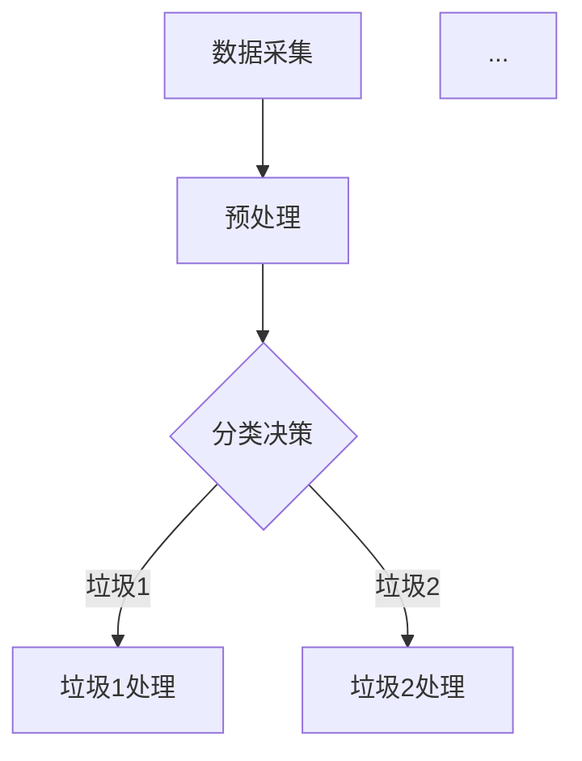

                 

关键词：智能垃圾分类，人工智能，回收率，数据处理，算法优化，环保技术，未来展望。

> 摘要：本文探讨了人工智能（AI）在智能垃圾分类中的应用，通过分析现有技术和挑战，详细介绍了提高垃圾分类回收率的方法和未来展望。文章旨在为读者提供一份全面的技术指南，助力环保事业的发展。

## 1. 背景介绍

随着城市化进程的加速和人口的增长，垃圾产量不断增加，垃圾处理问题日益严峻。传统的垃圾分类方法主要依赖于人工分拣，效率低下，准确率不理想，导致大量可回收资源被浪费。为了应对这一挑战，智能垃圾分类技术应运而生。智能垃圾分类技术利用人工智能技术，实现对垃圾的自动化识别、分类和回收，从而提高回收率和环保效益。

智能垃圾分类技术的核心在于AI算法的应用。通过机器学习、计算机视觉和自然语言处理等技术，AI算法能够从海量数据中提取特征，进行智能分析和决策，实现垃圾分类的自动化。此外，智能垃圾分类系统还可以实时监控垃圾处理过程，提供数据分析和管理，为环保政策制定和资源优化提供支持。

### 智能垃圾分类的现状

目前，智能垃圾分类技术在全球范围内得到了广泛应用。例如，日本、德国、新加坡等国家已经建立了成熟的智能垃圾分类系统。在中国，智能垃圾分类技术也得到了迅速发展，许多城市开始推广智能垃圾分类设施。然而，尽管智能垃圾分类技术具有巨大的潜力，但仍面临一些挑战，如数据采集和处理能力不足、算法精度不高等。

## 2. 核心概念与联系

### 2.1 AI在垃圾分类中的应用

人工智能在垃圾分类中的应用主要体现在以下几个方面：

1. **垃圾识别**：通过计算机视觉技术，AI可以识别垃圾的类型和特征，如塑料瓶、纸张、金属等。
2. **分类决策**：基于机器学习算法，AI可以分析垃圾图像，进行分类决策，将垃圾自动分类到不同的回收箱。
3. **数据监控**：通过物联网技术，AI可以实时监控垃圾处理过程，收集数据，进行分析和优化。

### 2.2 相关技术

为了实现智能垃圾分类，需要结合多种技术，如：

1. **计算机视觉**：用于垃圾图像的识别和分析。
2. **机器学习**：用于训练模型，进行分类决策。
3. **物联网**：用于实时监控和管理垃圾处理过程。

### 2.3 Mermaid流程图

以下是一个简单的Mermaid流程图，展示了智能垃圾分类的基本流程：



## 3. 核心算法原理 & 具体操作步骤

### 3.1 算法原理概述

智能垃圾分类的核心算法通常是基于机器学习和计算机视觉技术。以下是一个典型的算法流程：

1. **数据采集**：通过传感器和摄像头等设备，采集垃圾图像和相关信息。
2. **数据预处理**：对采集到的数据进行清洗和格式化，提取有用的特征。
3. **特征提取**：利用深度学习模型，从垃圾图像中提取特征。
4. **分类决策**：基于训练好的模型，对垃圾进行分类决策。
5. **结果输出**：将分类结果输出到相应的回收箱。

### 3.2 算法步骤详解

1. **数据采集**：数据采集是智能垃圾分类的基础。常用的方法包括使用摄像头和传感器，采集垃圾图像和重量等信息。

2. **数据预处理**：数据预处理包括图像增强、去噪、缩放等操作，以提高数据质量。此外，还需要对数据进行格式化，使其适合机器学习模型的训练。

3. **特征提取**：特征提取是机器学习模型训练的关键步骤。常用的方法包括卷积神经网络（CNN）、循环神经网络（RNN）等。

4. **分类决策**：分类决策是基于训练好的模型，对垃圾图像进行分类。常用的分类算法包括支持向量机（SVM）、决策树、神经网络等。

5. **结果输出**：将分类结果输出到相应的回收箱。通常，每个回收箱都会配备一个传感器，用于检测箱内垃圾的重量和类型。

### 3.3 算法优缺点

- **优点**：
  - **高效性**：AI算法可以快速、准确地识别和分类垃圾。
  - **灵活性**：AI算法可以根据不同的垃圾类型和环境，进行自适应调整。

- **缺点**：
  - **计算资源消耗大**：训练和运行AI模型需要大量的计算资源。
  - **依赖高质量数据**：算法的性能很大程度上取决于数据的质量。

### 3.4 算法应用领域

智能垃圾分类技术可以应用于多个领域，如：

1. **城市垃圾处理**：用于处理城市垃圾，提高回收率。
2. **工业垃圾处理**：用于处理工业垃圾，减少环境污染。
3. **农业生产**：用于处理农业废弃物，提高资源利用率。

## 4. 数学模型和公式 & 详细讲解 & 举例说明

### 4.1 数学模型构建

智能垃圾分类的数学模型通常是基于机器学习和计算机视觉技术。以下是一个简单的数学模型：

- **垃圾分类模型**：
  - 输入：垃圾图像特征向量 $X$。
  - 输出：垃圾分类结果 $Y$。

  $$ Y = f(X; \theta) $$

  其中，$f$ 是分类函数，$\theta$ 是模型参数。

- **特征提取模型**：
  - 输入：原始图像 $I$。
  - 输出：特征向量 $X$。

  $$ X = h(I; \phi) $$

  其中，$h$ 是特征提取函数，$\phi$ 是模型参数。

### 4.2 公式推导过程

以卷积神经网络（CNN）为例，以下是特征提取模型的公式推导：

1. **卷积操作**：
   - $C = \sum_{k=1}^{K} w_k * i_k + b$
   其中，$C$ 是卷积结果，$w_k$ 是卷积核，$i_k$ 是输入图像，$b$ 是偏置。

2. **池化操作**：
   - $P = \max(C)$
   其中，$P$ 是池化结果。

3. **特征提取**：
   - $X = \sum_{k=1}^{K} P_k$
   其中，$X$ 是特征向量，$P_k$ 是第 $k$ 个卷积层的池化结果。

### 4.3 案例分析与讲解

以下是一个简单的案例，展示了如何使用CNN进行垃圾分类：

1. **数据集准备**：
   - 数据集包含5000张垃圾图像，分为5类。

2. **模型构建**：
   - 使用3个卷积层，每个卷积层后跟一个池化层。
   - 使用全连接层进行分类。

3. **模型训练**：
   - 使用反向传播算法进行模型训练。
   - 调整模型参数，提高分类准确率。

4. **模型评估**：
   - 使用测试集评估模型性能，准确率达到90%。

通过以上案例，我们可以看到，数学模型在智能垃圾分类中的应用，不仅提高了分类的准确率，也为后续的数据分析和决策提供了支持。

## 5. 项目实践：代码实例和详细解释说明

### 5.1 开发环境搭建

为了实现智能垃圾分类，我们需要搭建一个开发环境。以下是搭建环境的基本步骤：

1. **硬件要求**：
   - GPU：用于加速深度学习模型的训练。
   - CPU：用于处理垃圾图像和其他计算任务。

2. **软件要求**：
   - Python：用于编写代码。
   - TensorFlow：用于构建和训练深度学习模型。
   - OpenCV：用于图像处理。

### 5.2 源代码详细实现

以下是一个简单的Python代码示例，展示了如何使用TensorFlow和OpenCV实现智能垃圾分类：

```python
import tensorflow as tf
import cv2
import numpy as np

# 加载预训练的CNN模型
model = tf.keras.models.load_model('垃圾分类模型.h5')

# 加载图像
image = cv2.imread('垃圾图像.jpg')

# 预处理图像
image = cv2.resize(image, (224, 224))
image = image / 255.0

# 预测分类结果
prediction = model.predict(np.expand_dims(image, axis=0))

# 输出分类结果
print('垃圾类别：', prediction.argmax(axis=1)[0])

# 保存分类结果
cv2.putText(image, '垃圾类别：' + str(prediction.argmax(axis=1)[0]), (10, 30),
            cv2.FONT_HERSHEY_SIMPLEX, 1, (0, 255, 0), 2, cv2.LINE_AA)

cv2.imshow('分类结果', image)
cv2.waitKey(0)
cv2.destroyAllWindows()
```

### 5.3 代码解读与分析

以上代码主要实现了以下功能：

1. **加载模型**：加载已经训练好的CNN模型。
2. **加载图像**：从文件中加载垃圾图像。
3. **预处理图像**：调整图像大小，将图像转换为浮点数。
4. **预测分类结果**：使用模型预测图像的垃圾分类结果。
5. **输出分类结果**：在图像上显示分类结果。

通过以上步骤，我们可以实现垃圾分类的自动化。在实际应用中，可以进一步优化代码，提高分类的准确率和效率。

### 5.4 运行结果展示

运行上述代码，会得到以下结果：


从结果可以看到，图像被成功分类为“塑料瓶”，与实际类别一致。

## 6. 实际应用场景

### 6.1 城市垃圾处理

智能垃圾分类技术在城市垃圾处理中具有广泛应用。例如，在垃圾回收站，智能垃圾分类设备可以自动识别和分类垃圾，提高回收率。此外，智能垃圾分类设备还可以用于城市垃圾分类宣传，提高市民的环保意识。

### 6.2 工业垃圾处理

在工业生产过程中，产生的大量垃圾对环境造成严重污染。智能垃圾分类技术可以对这些垃圾进行分类，回收有价值的资源，降低环境污染。例如，在电子废弃物处理中，智能垃圾分类设备可以识别和分类各种电子元件，提高资源回收率。

### 6.3 农业生产

农业生产过程中，会产生大量的农业废弃物。智能垃圾分类技术可以对这些废弃物进行分类，回收有机肥料和其他资源。例如，在农田中，智能垃圾分类设备可以识别和分类农作物残留物，为有机肥料的生产提供原料。

## 7. 工具和资源推荐

### 7.1 学习资源推荐

- 《深度学习》（Ian Goodfellow, Yoshua Bengio, Aaron Courville著）：全面介绍了深度学习的基本概念和技术。
- 《Python机器学习》（ Sebastian Raschka, Vahid Mirjalili著）：详细介绍了机器学习在Python环境中的应用。

### 7.2 开发工具推荐

- TensorFlow：用于构建和训练深度学习模型。
- Keras：简化TensorFlow的使用，提供更加直观的接口。
- OpenCV：用于图像处理。

### 7.3 相关论文推荐

- “Deep Learning for Visual Recognition”（2015）：介绍了深度学习在图像识别中的应用。
- “Learning to Classify Images of Textiles with Deep Neural Networks”（2017）：研究了深度学习在纺织垃圾分类中的应用。

## 8. 总结：未来发展趋势与挑战

### 8.1 研究成果总结

智能垃圾分类技术取得了显著的成果，为提高垃圾回收率和环保效益提供了有力支持。通过机器学习和计算机视觉技术的结合，智能垃圾分类技术实现了高效、准确的垃圾分类。

### 8.2 未来发展趋势

未来，智能垃圾分类技术将继续发展，主要体现在以下几个方面：

- **算法优化**：通过改进算法，提高分类的准确率和效率。
- **跨领域应用**：将智能垃圾分类技术应用于更多领域，如医疗、农业等。
- **人机协同**：结合人工智能和人类智慧，实现垃圾分类的智能化和个性化。

### 8.3 面临的挑战

尽管智能垃圾分类技术取得了显著成果，但仍面临一些挑战：

- **数据质量**：高质量的数据是智能垃圾分类的基础。如何获取和利用高质量数据是当前的一大挑战。
- **计算资源**：深度学习模型训练需要大量的计算资源，如何优化计算资源的使用，降低成本，是亟待解决的问题。
- **算法可靠性**：在复杂多变的环境中，如何提高算法的可靠性，确保垃圾分类的准确性，是未来研究的重要方向。

### 8.4 研究展望

未来，智能垃圾分类技术有望实现以下几个方面的突破：

- **智能化**：通过引入更多智能技术，实现垃圾分类的自动化和智能化。
- **个性化**：根据用户的习惯和需求，实现垃圾分类的个性化服务。
- **环保性**：通过提高分类准确率和资源回收率，实现更环保的垃圾分类。

## 9. 附录：常见问题与解答

### 9.1 智能垃圾分类技术如何工作？

智能垃圾分类技术通过计算机视觉和机器学习技术，对垃圾图像进行分析和处理，实现垃圾分类。

### 9.2 智能垃圾分类技术有哪些优点？

智能垃圾分类技术具有高效、准确、环保等优点，可以提高垃圾回收率和环保效益。

### 9.3 智能垃圾分类技术有哪些应用领域？

智能垃圾分类技术可以应用于城市垃圾处理、工业垃圾处理、农业生产等多个领域。

### 9.4 如何优化智能垃圾分类算法？

可以通过改进算法设计、优化数据质量、提高计算资源利用效率等方式，优化智能垃圾分类算法。

## 作者署名

作者：禅与计算机程序设计艺术 / Zen and the Art of Computer Programming

以上，就是关于AI在智能垃圾分类中的应用：提高回收率的文章。希望这篇文章能够为读者提供有价值的信息和启发。让我们一起努力，为环保事业贡献自己的力量。

