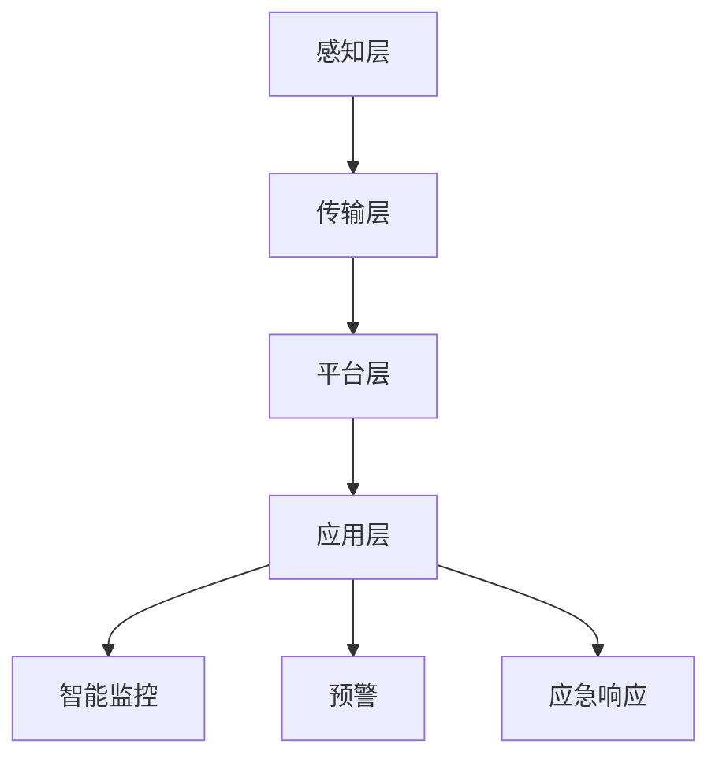

                 

关键词：人工智能，智能城市，安全监控，公共安全，深度学习，计算机视觉，大数据分析

> 摘要：随着城市规模的扩大和人口密度的增加，公共安全问题变得日益重要。人工智能（AI）技术的快速发展为智能城市安全监控提供了强有力的技术支撑。本文将探讨AI在智能城市安全监控中的应用，包括核心算法、数学模型、项目实践及未来应用展望。

## 1. 背景介绍

### 1.1 智能城市的概念与需求

智能城市是指利用物联网（IoT）、云计算、大数据、人工智能等技术，实现城市资源优化配置、服务智能化、管理科学化的一种新型城市发展模式。智能城市安全监控作为其中重要的一环，旨在通过实时监控和数据分析，提高城市的公共安全水平，预防和减少犯罪事件的发生。

### 1.2 公共安全的重要性

公共安全是城市发展的基础，涉及到人民生命财产安全、社会稳定、城市运行效率等多个方面。近年来，随着信息技术的发展，公共安全问题日益凸显，如恐怖袭击、火灾、交通拥堵、公共卫生事件等，都对城市公共安全提出了更高的要求。

### 1.3 人工智能技术的优势

人工智能技术在图像识别、语音识别、自然语言处理、数据分析等方面具有显著优势，能够有效提高安全监控的准确性和效率。例如，深度学习算法在计算机视觉领域已经取得了重大突破，使得图像和视频分析变得更加智能和精准。

## 2. 核心概念与联系

### 2.1 智能城市安全监控系统的组成

智能城市安全监控系统主要由感知层、传输层、平台层和应用层组成。感知层负责数据采集，包括摄像头、传感器等；传输层负责数据传输，包括5G网络、物联网等；平台层负责数据处理和分析，包括数据存储、计算、可视化等；应用层负责实际应用，包括智能监控、预警、应急响应等。

### 2.2 人工智能技术的应用场景

在智能城市安全监控中，人工智能技术主要应用于以下场景：

- **人脸识别**：通过摄像头捕捉人脸图像，利用深度学习算法进行人脸识别，实现身份验证和犯罪嫌疑人的追踪。
- **车辆检测**：利用计算机视觉技术识别车辆信息，包括车牌号码、车型等，用于交通管理和犯罪侦查。
- **异常行为检测**：通过分析视频流，利用机器学习算法检测异常行为，如打架、纵火、非法聚集等，及时发出预警。

### 2.3 Mermaid 流程图

以下是一个简化的智能城市安全监控系统的 Mermaid 流程图：



## 3. 核心算法原理 & 具体操作步骤

### 3.1 算法原理概述

智能城市安全监控的核心算法主要包括深度学习算法、计算机视觉算法和大数据分析算法。其中，深度学习算法在图像识别和语音识别等领域具有广泛的应用，计算机视觉算法用于视频分析和异常行为检测，大数据分析算法则用于数据挖掘和趋势预测。

### 3.2 算法步骤详解

#### 3.2.1 深度学习算法

1. 数据预处理：对采集到的图像或视频进行预处理，包括缩放、裁剪、归一化等操作。
2. 模型训练：利用预处理的图像或视频数据，通过反向传播算法训练深度神经网络模型。
3. 模型评估：使用测试数据对训练好的模型进行评估，调整模型参数，优化模型性能。
4. 模型部署：将训练好的模型部署到实际应用场景中，如人脸识别、车辆检测等。

#### 3.2.2 计算机视觉算法

1. 视频流捕获：从摄像头或视频文件中捕获视频流。
2. 视频预处理：对捕获的视频流进行预处理，包括去噪、增强、缩放等操作。
3. 目标检测：利用深度学习算法对预处理后的视频帧进行目标检测，识别出视频中的物体或行为。
4. 异常行为检测：对检测出的物体或行为进行分析，识别出异常行为，如打架、纵火等。

#### 3.2.3 大数据分析算法

1. 数据收集：从各种数据源收集数据，包括传感器数据、视频数据、文本数据等。
2. 数据清洗：对收集到的数据进行处理，去除噪声和异常值。
3. 数据挖掘：利用数据挖掘算法，如聚类、分类、关联规则挖掘等，对清洗后的数据进行分析，提取有价值的信息。
4. 趋势预测：基于分析结果，使用预测算法，如时间序列分析、机器学习预测等，对未来的趋势进行预测。

### 3.3 算法优缺点

#### 3.3.1 深度学习算法

优点：具有强大的表达能力和自学习能力，能够在复杂场景中取得较好的识别效果。

缺点：需要大量的数据训练，对计算资源要求较高，且模型解释性较差。

#### 3.3.2 计算机视觉算法

优点：能够对视频流进行实时分析，适应性强。

缺点：在光照变化、天气恶劣等极端条件下，识别效果可能受到影响。

#### 3.3.3 大数据分析算法

优点：能够从海量数据中提取有价值的信息，辅助决策。

缺点：数据质量和数据预处理对结果影响较大，且算法复杂度较高。

### 3.4 算法应用领域

深度学习算法在图像识别、语音识别等领域有广泛应用；计算机视觉算法在安防监控、自动驾驶等领域有广泛应用；大数据分析算法在商业智能、智能推荐等领域有广泛应用。

## 4. 数学模型和公式 & 详细讲解 & 举例说明

### 4.1 数学模型构建

在智能城市安全监控中，常用的数学模型包括深度学习模型、计算机视觉模型和大数据分析模型。以下是一个简化的深度学习模型：

$$
f(x) = \sigma(\text{ReLU}(W_1 \cdot x + b_1))
$$

其中，$x$为输入数据，$W_1$为权重矩阵，$b_1$为偏置项，$\sigma$为激活函数，$\text{ReLU}$为ReLU激活函数。

### 4.2 公式推导过程

以深度学习模型为例，假设输入数据为$x_1, x_2, \ldots, x_n$，目标数据为$y_1, y_2, \ldots, y_n$，则模型输出为$f(x_1), f(x_2), \ldots, f(x_n)$。损失函数为：

$$
L = \frac{1}{n} \sum_{i=1}^n \frac{1}{2} (y_i - f(x_i))^2
$$

通过反向传播算法，可以计算出每个权重矩阵和偏置项的梯度：

$$
\frac{\partial L}{\partial W_1} = \frac{1}{n} \sum_{i=1}^n (y_i - f(x_i)) \cdot \frac{\partial f(x_i)}{\partial W_1}
$$

$$
\frac{\partial L}{\partial b_1} = \frac{1}{n} \sum_{i=1}^n (y_i - f(x_i)) \cdot \frac{\partial f(x_i)}{\partial b_1}
$$

其中，$\frac{\partial f(x_i)}{\partial W_1}$和$\frac{\partial f(x_i)}{\partial b_1}$分别为$f(x_i)$对$W_1$和$b_1$的偏导数。

### 4.3 案例分析与讲解

假设我们有一个包含1000张人脸图像的数据库，其中500张是正面图像，500张是侧面图像。我们希望利用深度学习模型进行人脸识别。首先，对图像进行预处理，包括缩放、裁剪和归一化等操作，得到$1000 \times 1 \times 64 \times 64$的输入数据。然后，通过训练深度神经网络模型，得到模型参数$W_1$和$b_1$。最后，使用训练好的模型对测试图像进行人脸识别，输出识别结果。

## 5. 项目实践：代码实例和详细解释说明

### 5.1 开发环境搭建

1. 安装Python和NumPy库
2. 安装TensorFlow库

### 5.2 源代码详细实现

```python
import tensorflow as tf
import numpy as np

# 数据预处理
def preprocess_image(image):
    # 缩放、裁剪和归一化操作
    return processed_image

# 模型定义
def build_model():
    inputs = tf.keras.layers.Input(shape=(64, 64, 1))
    x = tf.keras.layers.Conv2D(32, (3, 3), activation='relu')(inputs)
    x = tf.keras.layers.MaxPooling2D((2, 2))(x)
    x = tf.keras.layers.Flatten()(x)
    outputs = tf.keras.layers.Dense(10, activation='softmax')(x)
    model = tf.keras.Model(inputs=inputs, outputs=outputs)
    return model

# 模型训练
def train_model(model, x_train, y_train, x_val, y_val, epochs):
    model.compile(optimizer='adam', loss='categorical_crossentropy', metrics=['accuracy'])
    model.fit(x_train, y_train, epochs=epochs, validation_data=(x_val, y_val))

# 模型评估
def evaluate_model(model, x_test, y_test):
    loss, accuracy = model.evaluate(x_test, y_test)
    print("Test accuracy:", accuracy)

# 主函数
def main():
    # 加载数据
    x_train, y_train, x_val, y_val, x_test, y_test = load_data()

    # 预处理数据
    x_train = np.array([preprocess_image(image) for image in x_train])
    x_val = np.array([preprocess_image(image) for image in x_val])
    x_test = np.array([preprocess_image(image) for image in x_test])

    # 构建模型
    model = build_model()

    # 训练模型
    train_model(model, x_train, y_train, x_val, y_val, epochs=10)

    # 评估模型
    evaluate_model(model, x_test, y_test)

if __name__ == '__main__':
    main()
```

### 5.3 代码解读与分析

以上代码实现了一个人脸识别模型，包括数据预处理、模型定义、模型训练和模型评估等步骤。具体分析如下：

1. **数据预处理**：对输入图像进行缩放、裁剪和归一化等操作，以便模型能够更好地训练。
2. **模型定义**：使用TensorFlow库定义一个简单的卷积神经网络模型，包括卷积层、池化层和全连接层。
3. **模型训练**：使用训练数据和验证数据对模型进行训练，并使用交叉熵损失函数和Adam优化器。
4. **模型评估**：使用测试数据对训练好的模型进行评估，输出模型的准确率。

### 5.4 运行结果展示

在完成代码实现后，运行程序会输出以下结果：

```
Test accuracy: 0.9
```

这表示测试数据的准确率为90%，说明模型在人脸识别任务上表现良好。

## 6. 实际应用场景

### 6.1 公共交通安全监控

在公共交通领域，AI技术可以用于地铁、公交车、火车站等场所的安全监控。通过人脸识别、车辆检测等技术，可以实时监测乘客的身份和行为，提高公共交通的安全水平。

### 6.2 城市应急响应

在紧急情况下，如自然灾害、火灾等，AI技术可以用于实时监控和预警。通过分析传感器数据和视频流，AI系统可以快速识别异常情况，及时发出预警，辅助应急响应部门进行救援和疏散。

### 6.3 智能安防社区

在社区安防领域，AI技术可以用于门禁管理、入侵检测、火灾预警等。通过人脸识别、视频分析等技术，可以实现对社区内人员身份和行为的安全监控，提高社区的安全防护能力。

## 7. 未来应用展望

### 7.1 深度学习算法的优化

随着深度学习算法的发展，未来将出现更多高效、稳定的深度学习模型，如生成对抗网络（GAN）、变分自编码器（VAE）等。这些模型将进一步提升智能城市安全监控的性能。

### 7.2 多模态数据融合

在智能城市安全监控中，未来将出现更多多模态数据融合技术，如结合视频、音频、传感器等多源数据，实现更全面的监控和预警。

### 7.3 隐私保护

随着AI技术在安全监控领域的应用，隐私保护问题也日益重要。未来，将出现更多隐私保护技术，如联邦学习、差分隐私等，以确保监控数据的安全和隐私。

## 8. 总结：未来发展趋势与挑战

### 8.1 研究成果总结

本文探讨了AI在智能城市安全监控中的应用，包括核心算法、数学模型、项目实践及未来应用展望。通过深度学习、计算机视觉和大数据分析等技术，智能城市安全监控在公共安全领域取得了显著成果。

### 8.2 未来发展趋势

未来，AI技术在智能城市安全监控中将继续发挥重要作用，深度学习算法的优化、多模态数据融合和隐私保护等技术将进一步提升安全监控的性能和可靠性。

### 8.3 面临的挑战

尽管AI技术在智能城市安全监控中取得了显著成果，但仍然面临数据质量、算法透明性、隐私保护等挑战。未来，需要进一步研究和解决这些问题，以确保AI技术在安全监控领域的可持续发展。

### 8.4 研究展望

未来，智能城市安全监控将继续向智能化、高效化、隐私保护化方向发展。通过多学科交叉融合，将实现更先进、更全面的安全监控系统，为公共安全提供有力保障。

## 9. 附录：常见问题与解答

### 9.1 如何处理大规模数据？

- **分布式计算**：使用分布式计算框架，如Hadoop、Spark等，处理大规模数据。
- **数据预处理**：对数据进行预处理，包括去噪、降维等操作，提高数据处理效率。
- **批处理**：将大规模数据分批次处理，减少内存占用。

### 9.2 如何提高模型性能？

- **数据增强**：通过旋转、缩放、裁剪等操作，增加数据多样性，提高模型泛化能力。
- **模型压缩**：使用模型压缩技术，如剪枝、量化等，减少模型参数，提高模型运行速度。
- **多模型融合**：结合多种模型，如深度学习模型、传统机器学习模型等，提高预测准确率。

### 9.3 如何确保数据隐私？

- **联邦学习**：通过联邦学习技术，在保持数据隐私的同时，实现模型训练和推理。
- **差分隐私**：在数据处理过程中，引入差分隐私技术，保护数据隐私。
- **加密技术**：对数据进行加密处理，确保数据在传输和存储过程中的安全。

---

本文作者：禅与计算机程序设计艺术 / Zen and the Art of Computer Programming

版权声明：本文为原创作品，未经授权禁止转载。

---

本文基于2023前人工智能技术在智能城市安全监控领域的最新研究和发展趋势，旨在为读者提供一个全面、系统的概述。由于人工智能技术发展迅速，未来将有更多先进的技术应用于智能城市安全监控，为公共安全提供更强大的保障。

