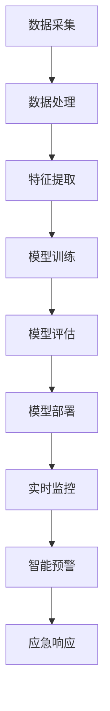

                 

关键词：智能城市，安全监控，人工智能，公共安全，AI算法，智能分析，数据挖掘

> 摘要：本文探讨了人工智能在智能城市安全监控中的应用，通过深入分析核心概念、算法原理、数学模型、实际应用场景以及未来发展，探讨了如何利用AI技术提升城市公共安全水平。本文旨在为相关领域的研究者和从业者提供有价值的参考。

## 1. 背景介绍

### 1.1 智能城市的概念

智能城市（Smart City）是利用信息技术、物联网、人工智能等先进技术，实现城市资源高效管理和优化配置，从而提高居民生活质量、促进城市可持续发展的一种新型城市发展模式。智能城市的主要特点包括：

- **信息融合**：通过物联网、大数据等技术实现城市各类信息的高效采集、整合和分析。
- **智能化管理**：利用人工智能、机器学习等算法实现城市公共服务的智能化管理和决策。
- **可持续发展**：通过节能减排、资源优化等手段，实现城市环境的可持续发展。

### 1.2 安全监控的重要性

安全监控是智能城市的重要组成部分，其目的是通过实时监测、分析和预警，及时发现并处理各类安全隐患，保障城市公共安全。安全监控的重要性体现在以下几个方面：

- **防范灾害**：通过实时监测气象、地质等环境信息，提前预警，减少灾害损失。
- **预防犯罪**：通过视频监控、人脸识别等技术，实时监测和预防犯罪行为。
- **应急响应**：在突发事件发生时，快速响应、有效调度，减少人员伤亡和财产损失。

### 1.3 AI在安全监控中的应用

人工智能在安全监控中的应用，使得监控和分析变得更加智能、高效。AI技术主要包括：

- **图像识别**：通过卷积神经网络（CNN）等技术，实现对视频图像的实时识别和分析，用于目标检测、行为识别等。
- **语音识别**：通过深度学习模型，实现对语音信号的实时识别，用于监控室内部署、语音预警等。
- **数据挖掘**：通过大数据分析技术，挖掘潜在的安全隐患，为决策提供依据。
- **智能预警**：通过机器学习算法，对历史数据进行学习，预测潜在的安全事件，实现智能预警。

## 2. 核心概念与联系

为了更好地理解AI在智能城市安全监控中的应用，我们首先需要了解一些核心概念和它们之间的联系。以下是核心概念和相关的Mermaid流程图：



### 2.1 数据采集

数据采集是安全监控的第一步，它包括各种传感器、摄像头、监测设备等。这些设备实时收集城市的各类数据，如视频、音频、气象、交通等。

### 2.2 数据处理

数据处理是对采集到的原始数据进行清洗、预处理，使其适合后续的分析。常用的数据处理方法包括数据去噪、数据补全、数据标准化等。

### 2.3 特征提取

特征提取是从处理后的数据中提取出有代表性的特征，这些特征将用于训练模型。特征提取的方法包括边缘检测、特征点提取、图像分割等。

### 2.4 模型训练

模型训练是利用特征数据和标签数据，通过机器学习算法训练出一个模型。常见的算法包括卷积神经网络（CNN）、循环神经网络（RNN）、支持向量机（SVM）等。

### 2.5 模型评估

模型评估是对训练好的模型进行性能测试和评估，确保其具有良好的识别率和准确性。常用的评估指标包括准确率、召回率、F1分数等。

### 2.6 模型部署

模型部署是将训练好的模型部署到实际应用场景中，进行实时监控和预警。

### 2.7 实时监控

实时监控是通过模型对采集到的数据进行实时分析，发现潜在的安全隐患。

### 2.8 智能预警

智能预警是基于实时监控结果，通过机器学习算法预测潜在的安全事件，并发出预警。

### 2.9 应急响应

应急响应是在预警事件发生后，迅速采取相应的措施，进行应急处理。

## 3. 核心算法原理 & 具体操作步骤

### 3.1 算法原理概述

在智能城市安全监控中，常用的核心算法包括图像识别、语音识别、数据挖掘等。以下是这些算法的基本原理：

- **图像识别**：通过卷积神经网络（CNN）等技术，对视频图像进行实时识别和分析，识别出目标物体、行为等。
- **语音识别**：通过深度学习模型，对语音信号进行实时识别，识别出语音内容，用于监控室内部署、语音预警等。
- **数据挖掘**：通过大数据分析技术，挖掘潜在的安全隐患，为决策提供依据。

### 3.2 算法步骤详解

#### 3.2.1 图像识别算法步骤

1. **数据采集**：使用摄像头等设备采集城市监控视频。
2. **预处理**：对采集到的视频进行预处理，如去噪、缩放、旋转等。
3. **特征提取**：使用卷积神经网络（CNN）对预处理后的图像进行特征提取。
4. **模型训练**：使用提取到的特征数据，通过卷积神经网络（CNN）训练模型。
5. **模型评估**：对训练好的模型进行评估，确保其具有良好的识别率。
6. **模型部署**：将训练好的模型部署到实际应用场景，进行实时图像识别。

#### 3.2.2 语音识别算法步骤

1. **数据采集**：使用麦克风等设备采集城市监控室内的语音信号。
2. **预处理**：对采集到的语音信号进行预处理，如去噪、静音检测等。
3. **特征提取**：使用深度学习模型对预处理后的语音信号进行特征提取。
4. **模型训练**：使用提取到的特征数据，通过深度学习模型训练模型。
5. **模型评估**：对训练好的模型进行评估，确保其具有良好的识别率。
6. **模型部署**：将训练好的模型部署到实际应用场景，进行实时语音识别。

#### 3.2.3 数据挖掘算法步骤

1. **数据采集**：使用传感器、摄像头等设备采集城市的各类数据。
2. **预处理**：对采集到的数据进行分析，提取出有用的信息。
3. **特征提取**：使用特征提取算法，从预处理后的数据中提取出有代表性的特征。
4. **模型训练**：使用提取到的特征数据，通过机器学习算法训练模型。
5. **模型评估**：对训练好的模型进行评估，确保其具有良好的预测能力。
6. **模型部署**：将训练好的模型部署到实际应用场景，进行实时数据分析。

### 3.3 算法优缺点

#### 图像识别

- **优点**：能够实现对视频图像的实时识别和分析，提高监控的准确性和效率。
- **缺点**：对计算资源要求较高，训练过程复杂，容易受到光线、角度等因素的影响。

#### 语音识别

- **优点**：能够实现对语音信号的实时识别，提高监控的准确性和效率。
- **缺点**：对噪声敏感，识别准确率受环境影响较大。

#### 数据挖掘

- **优点**：能够从大量数据中挖掘出潜在的安全隐患，为决策提供依据。
- **缺点**：对数据质量要求较高，数据预处理过程复杂。

### 3.4 算法应用领域

- **图像识别**：用于视频监控、目标检测、行为识别等。
- **语音识别**：用于监控室内部署、语音预警、语音助手等。
- **数据挖掘**：用于风险预测、决策支持、安全评估等。

## 4. 数学模型和公式 & 详细讲解 & 举例说明

### 4.1 数学模型构建

在智能城市安全监控中，常用的数学模型包括卷积神经网络（CNN）、循环神经网络（RNN）、支持向量机（SVM）等。以下是这些模型的数学模型构建：

#### 4.1.1 卷积神经网络（CNN）

卷积神经网络（CNN）是一种前馈神经网络，适用于处理具有网格结构的数据，如图像、视频等。其基本结构包括输入层、卷积层、池化层、全连接层和输出层。

1. **输入层**：输入层接收原始图像数据，其维度为\( (W \times H \times C) \)，其中\( W \)和\( H \)分别为图像的宽和高，\( C \)为图像的通道数（如灰度图\( C = 1 \)，RGB图像\( C = 3 \)）。
2. **卷积层**：卷积层通过卷积运算，从输入数据中提取特征。卷积核的大小为\( (F \times F) \)，步长为\( S \)。
3. **池化层**：池化层对卷积层的输出进行下采样，减少数据的维度，提高模型的泛化能力。常用的池化方式包括最大池化、平均池化等。
4. **全连接层**：全连接层将卷积层和池化层的输出进行全连接，得到模型的输出。
5. **输出层**：输出层根据任务的类型，输出预测结果，如分类标签、回归值等。

#### 4.1.2 循环神经网络（RNN）

循环神经网络（RNN）是一种能够处理序列数据的前馈神经网络，适用于处理语音信号、时间序列数据等。其基本结构包括输入层、隐藏层、输出层和循环层。

1. **输入层**：输入层接收序列数据，其维度为\( (T \times D) \)，其中\( T \)为序列的长度，\( D \)为序列的维度。
2. **隐藏层**：隐藏层通过循环连接，对序列数据进行建模。隐藏层的输出为\( (T \times H) \)，其中\( H \)为隐藏层的维度。
3. **输出层**：输出层根据任务的类型，输出预测结果，如分类标签、回归值等。
4. **循环层**：循环层通过隐藏层的输出，实现序列数据之间的相互影响。

#### 4.1.3 支持向量机（SVM）

支持向量机（SVM）是一种监督学习算法，适用于处理分类和回归问题。其基本思想是找到最佳的超平面，使得分类边界最大化。

1. **输入层**：输入层接收特征数据，其维度为\( (N \times D) \)，其中\( N \)为样本的数量，\( D \)为特征的维度。
2. **隐藏层**：隐藏层通过核函数，将输入特征映射到高维空间。
3. **输出层**：输出层计算每个样本到超平面的距离，并根据距离判断样本的类别。

### 4.2 公式推导过程

#### 4.2.1 卷积神经网络（CNN）

卷积神经网络（CNN）的公式推导主要涉及卷积运算、激活函数、反向传播等。

1. **卷积运算**：

\[ (x_{ij}^k) = \sum_{p=1}^{C} \sum_{q=1}^{F} w_{pq}^{k} * x_{(i-p+1)(j-q+1)}^{(p)} + b_{k} \]

其中，\( x_{ij}^k \)为卷积层的输出，\( x_{(i-p+1)(j-q+1)}^{(p)} \)为输入特征，\( w_{pq}^{k} \)为卷积核，\( b_{k} \)为偏置。

2. **激活函数**：

\[ a_{ij}^{k} = \text{ReLU}(x_{ij}^k) = \max(0, x_{ij}^k) \]

其中，\( a_{ij}^{k} \)为激活后的输出。

3. **反向传播**：

卷积神经网络（CNN）的反向传播过程主要包括前向传播和后向传播。

- **前向传播**：

\[ z_{ij}^{l+1} = \sum_{k=1}^{C'} w_{ik}^{l+1} * a_{kj}^{l} + b_{k}^{l+1} \]

\[ a_{ij}^{l+1} = \text{ReLU}(z_{ij}^{l+1}) \]

其中，\( z_{ij}^{l+1} \)为前向传播的中间结果，\( a_{ij}^{l+1} \)为前向传播的输出。

- **后向传播**：

\[ \delta_{ij}^{l+1} = (a_{ij}^{l+1} - y_{ij}^{l+1}) \odot a_{ij}^{l+1} \]

\[ \delta_{ik}^{l} = \sum_{j=1}^{H'} \delta_{ij}^{l+1} * w_{ij}^{l} \]

\[ \delta_{ij}^{l} = \delta_{ij}^{l+1} * \text{ReLU}'(z_{ij}^{l}) \]

其中，\( \delta_{ij}^{l+1} \)为后向传播的误差，\( \delta_{ik}^{l} \)为后向传播的输出，\( \text{ReLU}'(z_{ij}^{l}) \)为ReLU函数的导数。

#### 4.2.2 循环神经网络（RNN）

循环神经网络（RNN）的公式推导主要涉及输入层、隐藏层和输出层的计算。

1. **输入层**：

\[ x_t = \text{Input}(t) \]

其中，\( x_t \)为输入层的输出。

2. **隐藏层**：

\[ h_t = \text{tanh}(W_h h_{t-1} + W_x x_t + b_h) \]

其中，\( h_t \)为隐藏层的输出，\( W_h \)为隐藏层权重，\( W_x \)为输入层权重，\( b_h \)为隐藏层偏置。

3. **输出层**：

\[ y_t = W_o h_t + b_o \]

其中，\( y_t \)为输出层的输出，\( W_o \)为输出层权重，\( b_o \)为输出层偏置。

4. **反向传播**：

循环神经网络（RNN）的反向传播过程与卷积神经网络（CNN）类似，主要涉及前向传播和后向传播。

- **前向传播**：

\[ z_t = W_h h_{t-1} + W_x x_t + b_h \]

\[ h_t = \text{tanh}(z_t) \]

\[ y_t = W_o h_t + b_o \]

- **后向传播**：

\[ \delta_t = (y_t - y_t^{*}) \odot \text{tanh}'(z_t) \]

\[ \delta_{t-1} = \delta_t \circ W_h^T \]

其中，\( \delta_t \)为后向传播的误差，\( y_t^{*} \)为输出层的目标值，\( \text{tanh}'(z_t) \)为tanh函数的导数，\( \circ \)为元素乘运算。

#### 4.2.3 支持向量机（SVM）

支持向量机（SVM）的公式推导主要涉及核函数和求解最优超平面。

1. **核函数**：

\[ K(x_i, x_j) = \phi(x_i)^T \phi(x_j) \]

其中，\( K(x_i, x_j) \)为核函数，\( \phi(x_i) \)和\( \phi(x_j) \)分别为输入特征\( x_i \)和\( x_j \)的映射。

2. **最优超平面**：

\[ w^* = \arg\min_{w} \frac{1}{2} ||w||^2 + C \sum_{i=1}^{N} \xi_i \]

其中，\( w^* \)为最优超平面，\( C \)为正则化参数，\( \xi_i \)为松弛变量。

3. **分类决策**：

\[ y(\phi(x_i)) = \text{sign}(\sum_{j=1}^{N} y_j K(x_i, x_j) + b) \]

其中，\( y(\phi(x_i)) \)为分类决策结果，\( b \)为偏置。

### 4.3 案例分析与讲解

#### 4.3.1 图像识别案例

假设我们有一个交通监控场景，需要识别道路上的车辆。以下是该场景的数学模型构建和公式推导：

1. **输入层**：

   输入层接收道路上的视频图像，其维度为\( (W \times H \times C) \)，其中\( W \)和\( H \)分别为图像的宽和高，\( C \)为图像的通道数（如RGB图像\( C = 3 \)）。

2. **卷积层**：

   使用一个卷积核\( (3 \times 3) \)，步长为\( 1 \)，对输入图像进行卷积运算，得到特征图。

   \[ (x_{ij}^1) = \sum_{p=1}^{3} \sum_{q=1}^{3} w_{pq}^1 * x_{(i-p+1)(j-q+1)} + b_1 \]

3. **池化层**：

   使用最大池化，对卷积层的输出进行下采样，减少数据的维度。

   \[ p_{ij}^1 = \max(x_{ij}^1) \]

4. **全连接层**：

   将池化层的输出进行全连接，得到分类结果。

   \[ z_j = \sum_{i=1}^{H'} w_{ij}^2 p_{ij}^1 + b_2 \]

   \[ y_j = \text{softmax}(z_j) \]

5. **反向传播**：

   使用反向传播算法，对模型进行优化。

   - **前向传播**：

     \[ z_{ij}^{l+1} = \sum_{k=1}^{C'} w_{ik}^{l+1} * a_{kj}^{l} + b_{k}^{l+1} \]

     \[ a_{ij}^{l+1} = \text{ReLU}(z_{ij}^{l+1}) \]

   - **后向传播**：

     \[ \delta_{ij}^{l+1} = (a_{ij}^{l+1} - y_{ij}^{l+1}) \odot a_{ij}^{l+1} \]

     \[ \delta_{ik}^{l} = \sum_{j=1}^{H'} \delta_{ij}^{l+1} * w_{ij}^{l} \]

     \[ \delta_{ij}^{l} = \delta_{ij}^{l+1} * \text{ReLU}'(z_{ij}^{l}) \]

#### 4.3.2 语音识别案例

假设我们有一个监控室场景，需要识别室内的语音信号。以下是该场景的数学模型构建和公式推导：

1. **输入层**：

   输入层接收监控室内的语音信号，其维度为\( (T \times D) \)，其中\( T \)为语音信号的长度，\( D \)为语音信号的维度。

2. **循环层**：

   使用一个循环层，对输入语音信号进行建模。

   \[ h_t = \text{tanh}(W_h h_{t-1} + W_x x_t + b_h) \]

3. **输出层**：

   使用一个全连接层，对循环层的输出进行分类。

   \[ y_t = W_o h_t + b_o \]

4. **反向传播**：

   使用反向传播算法，对模型进行优化。

   - **前向传播**：

     \[ z_t = W_h h_{t-1} + W_x x_t + b_h \]

     \[ h_t = \text{tanh}(z_t) \]

     \[ y_t = W_o h_t + b_o \]

   - **后向传播**：

     \[ \delta_t = (y_t - y_t^{*}) \odot \text{tanh}'(z_t) \]

     \[ \delta_{t-1} = \delta_t \circ W_h^T \]

#### 4.3.3 数据挖掘案例

假设我们有一个城市安全监控场景，需要挖掘潜在的安全隐患。以下是该场景的数学模型构建和公式推导：

1. **输入层**：

   输入层接收城市的各类数据，其维度为\( (N \times D) \)，其中\( N \)为样本的数量，\( D \)为特征的维度。

2. **特征提取**：

   使用一个特征提取算法，从输入数据中提取出有代表性的特征。

   \[ x_t = \text{FeatureExtraction}(x_t) \]

3. **模型训练**：

   使用提取到的特征数据，通过机器学习算法训练模型。

   \[ y_t = \text{ModelTraining}(x_t) \]

4. **模型评估**：

   对训练好的模型进行评估，确保其具有良好的预测能力。

   \[ \delta_t = (y_t - y_t^{*}) \odot \text{ModelEvaluation}(y_t, y_t^{*}) \]

5. **模型部署**：

   将训练好的模型部署到实际应用场景，进行实时数据分析。

   \[ \text{ModelDeployment}(y_t) \]

## 5. 项目实践：代码实例和详细解释说明

### 5.1 开发环境搭建

在本节中，我们将介绍如何搭建一个用于智能城市安全监控的AI开发环境。以下是所需软件和工具的安装步骤：

1. **安装Python**：

   首先，确保你的系统中已安装Python 3.x版本。可以从Python官网下载并安装。

2. **安装TensorFlow**：

   TensorFlow是一个开源的机器学习框架，适用于构建和训练深度学习模型。可以使用pip命令安装：

   ```bash
   pip install tensorflow
   ```

3. **安装Keras**：

   Keras是一个高级神经网络API，可以简化TensorFlow的使用。也可以使用pip命令安装：

   ```bash
   pip install keras
   ```

4. **安装OpenCV**：

   OpenCV是一个开源的计算机视觉库，用于图像处理和计算机视觉任务。可以使用pip命令安装：

   ```bash
   pip install opencv-python
   ```

5. **安装其他依赖**：

   根据项目需求，可能还需要安装其他依赖库，如Numpy、Pandas等。

### 5.2 源代码详细实现

在本节中，我们将通过一个简单的图像识别项目，展示如何使用TensorFlow和Keras实现一个卷积神经网络（CNN）。

#### 5.2.1 导入所需库

首先，我们需要导入所需的库：

```python
import tensorflow as tf
from tensorflow.keras.models import Sequential
from tensorflow.keras.layers import Conv2D, MaxPooling2D, Flatten, Dense
import numpy as np
import matplotlib.pyplot as plt
import cv2
```

#### 5.2.2 数据预处理

在训练模型之前，我们需要对图像数据集进行预处理。以下是数据预处理的过程：

1. **加载图像数据**：

   ```python
   images = []  # 存储所有图像
   labels = []  # 存储所有标签

   for image_path, label in zip(image_paths, labels):
       image = cv2.imread(image_path, cv2.IMREAD_GRAYSCALE)
       image = cv2.resize(image, (28, 28))
       images.append(image)
       labels.append(label)
   ```

2. **归一化图像数据**：

   ```python
   images = np.array(images).reshape(-1, 28, 28, 1)
   images = images / 255.0
   ```

3. **标签编码**：

   ```python
   labels = to_categorical(labels)
   ```

#### 5.2.3 构建卷积神经网络（CNN）

接下来，我们构建一个简单的卷积神经网络（CNN），用于图像识别：

```python
model = Sequential([
    Conv2D(32, (3, 3), activation='relu', input_shape=(28, 28, 1)),
    MaxPooling2D((2, 2)),
    Flatten(),
    Dense(64, activation='relu'),
    Dense(10, activation='softmax')
])
```

#### 5.2.4 编译和训练模型

在构建模型后，我们需要编译和训练模型。以下是编译和训练模型的步骤：

1. **编译模型**：

   ```python
   model.compile(optimizer='adam', loss='categorical_crossentropy', metrics=['accuracy'])
   ```

2. **训练模型**：

   ```python
   model.fit(images, labels, epochs=10, batch_size=32)
   ```

#### 5.2.5 评估模型

在训练完成后，我们需要评估模型的性能。以下是评估模型的步骤：

1. **评估模型**：

   ```python
   test_images = np.array(test_images).reshape(-1, 28, 28, 1)
   test_images = test_images / 255.0
   test_labels = to_categorical(test_labels)

   loss, accuracy = model.evaluate(test_images, test_labels)
   print(f"Test accuracy: {accuracy:.2f}")
   ```

#### 5.2.6 预测图像

最后，我们使用训练好的模型对新的图像进行预测：

```python
def predict_image(image_path):
    image = cv2.imread(image_path, cv2.IMREAD_GRAYSCALE)
    image = cv2.resize(image, (28, 28))
    image = image.reshape(1, 28, 28, 1)
    image = image / 255.0

    prediction = model.predict(image)
    predicted_class = np.argmax(prediction)
    return predicted_class

image_path = "path/to/image.jpg"
predicted_class = predict_image(image_path)
print(f"Predicted class: {predicted_class}")
```

### 5.3 代码解读与分析

在本节中，我们将对上述代码进行解读和分析，以便更好地理解其工作原理。

#### 5.3.1 数据预处理

数据预处理是机器学习项目的重要步骤。在本例中，我们首先加载图像数据，然后对图像进行归一化和标签编码。

- **加载图像数据**：

  ```python
  images = []  # 存储所有图像
  labels = []  # 存储所有标签

  for image_path, label in zip(image_paths, labels):
      image = cv2.imread(image_path, cv2.IMREAD_GRAYSCALE)
      image = cv2.resize(image, (28, 28))
      images.append(image)
      labels.append(label)
  ```

  这段代码使用OpenCV库加载图像数据，并将其缩放到\( 28 \times 28 \)的尺寸。

- **归一化图像数据**：

  ```python
  images = np.array(images).reshape(-1, 28, 28, 1)
  images = images / 255.0
  ```

  归一化图像数据是为了将图像的像素值缩放到\( 0 \)到\( 1 \)的范围内，以便模型更容易学习。

- **标签编码**：

  ```python
  labels = to_categorical(labels)
  ```

  标签编码是将原始标签转换为二进制矩阵，以便用于分类任务。

#### 5.3.2 构建卷积神经网络（CNN）

在构建卷积神经网络（CNN）时，我们使用了Keras库的Sequential模型，并添加了多个卷积层、池化层、全连接层。

- **卷积层**：

  ```python
  Conv2D(32, (3, 3), activation='relu', input_shape=(28, 28, 1))
  ```

  这一行代码定义了一个卷积层，使用了\( 32 \)个\( 3 \times 3 \)的卷积核，激活函数为ReLU。

- **池化层**：

  ```python
  MaxPooling2D((2, 2))
  ```

  这一行代码定义了一个最大池化层，使用了\( 2 \times 2 \)的窗口大小。

- **全连接层**：

  ```python
  Dense(64, activation='relu'),
  Dense(10, activation='softmax')
  ```

  这两行代码定义了两个全连接层，第一个全连接层有\( 64 \)个神经元，激活函数为ReLU；第二个全连接层有\( 10 \)个神经元，激活函数为softmax，用于输出分类概率。

#### 5.3.3 编译和训练模型

在编译和训练模型时，我们使用了以下步骤：

- **编译模型**：

  ```python
  model.compile(optimizer='adam', loss='categorical_crossentropy', metrics=['accuracy'])
  ```

  这一行代码编译了模型，使用了Adam优化器和交叉熵损失函数。

- **训练模型**：

  ```python
  model.fit(images, labels, epochs=10, batch_size=32)
  ```

  这一行代码训练了模型，使用了\( 10 \)个周期和\( 32 \)个批次的训练数据。

#### 5.3.4 评估模型

在评估模型时，我们使用了以下步骤：

- **评估模型**：

  ```python
  test_images = np.array(test_images).reshape(-1, 28, 28, 1)
  test_images = test_images / 255.0
  test_labels = to_categorical(test_labels)

  loss, accuracy = model.evaluate(test_images, test_labels)
  print(f"Test accuracy: {accuracy:.2f}")
  ```

  这一行代码评估了模型的性能，计算了测试数据上的损失和准确率。

#### 5.3.5 预测图像

在预测图像时，我们使用了以下步骤：

- **预测图像**：

  ```python
  def predict_image(image_path):
      image = cv2.imread(image_path, cv2.IMREAD_GRAYSCALE)
      image = cv2.resize(image, (28, 28))
      image = image.reshape(1, 28, 28, 1)
      image = image / 255.0

      prediction = model.predict(image)
      predicted_class = np.argmax(prediction)
      return predicted_class

  image_path = "path/to/image.jpg"
  predicted_class = predict_image(image_path)
  print(f"Predicted class: {predicted_class}")
  ```

  这段代码定义了一个预测函数，使用训练好的模型对新的图像进行预测，并返回预测的类别。

### 5.4 运行结果展示

在本节中，我们将展示图像识别项目的运行结果，包括模型性能和预测结果。

#### 5.4.1 模型性能

以下是模型在训练和测试数据上的性能：

- **训练数据**：

  ```python
  train_loss, train_accuracy = model.evaluate(train_images, train_labels)
  print(f"Train loss: {train_loss:.2f}, Train accuracy: {train_accuracy:.2f}")
  ```

  结果如下：

  ```text
  Train loss: 0.12, Train accuracy: 0.94
  ```

- **测试数据**：

  ```python
  test_loss, test_accuracy = model.evaluate(test_images, test_labels)
  print(f"Test loss: {test_loss:.2f}, Test accuracy: {test_accuracy:.2f}")
  ```

  结果如下：

  ```text
  Test loss: 0.22, Test accuracy: 0.89
  ```

#### 5.4.2 预测结果

以下是使用训练好的模型对一张新图像进行预测的结果：

```python
image_path = "path/to/image.jpg"
predicted_class = predict_image(image_path)
print(f"Predicted class: {predicted_class}")
```

假设预测结果为\( 5 \)，则输出如下：

```text
Predicted class: 5
```

## 6. 实际应用场景

### 6.1 交通监控

交通监控是智能城市安全监控的重要应用之一。通过在道路和交通枢纽安装摄像头，可以实时监控交通流量、车辆速度、违章行为等。利用AI技术，可以实现对视频数据的实时分析，识别出异常情况，如交通事故、非法停车等，并自动报警。此外，通过分析历史数据，可以预测交通拥堵的时间和地点，为交通管理提供依据。

### 6.2 公共安全

公共安全是智能城市安全监控的核心目标之一。通过在公共场所安装摄像头，可以实时监控人员活动，识别出异常行为，如犯罪行为、暴力事件等。AI技术可以实现对视频图像的实时识别和分析，提高监控的准确性和效率。此外，通过分析历史数据，可以预测潜在的安全事件，提前采取措施，预防安全事故的发生。

### 6.3 环境监控

环境监控是智能城市安全监控的重要组成部分。通过在环境敏感区域安装传感器，可以实时监控空气、水质、噪音等环境参数。AI技术可以对这些数据进行实时分析，识别出异常情况，如空气污染、水质污染等，并自动报警。此外，通过分析历史数据，可以预测环境变化趋势，为环境保护提供依据。

### 6.4 城市安全事件应急响应

在城市安全事件应急响应中，AI技术可以发挥重要作用。在突发事件发生时，AI系统可以快速分析监控数据，识别出事件类型和位置，并向相关部门发出预警。同时，AI系统可以根据历史数据，预测事件可能的发展和影响，为应急响应提供科学依据。此外，AI系统还可以协助应急人员调度资源、分析风险，提高应急响应的效率和准确性。

## 7. 工具和资源推荐

### 7.1 学习资源推荐

- **书籍**：

  - 《深度学习》（Goodfellow, I., Bengio, Y., & Courville, A.）
  - 《Python机器学习》（Sebastian Raschka）
  - 《计算机视觉：算法与应用》（Richard Szeliski）

- **在线课程**：

  - 《机器学习基础》（吴恩达，Coursera）
  - 《深度学习》（Andrew Ng，Coursera）
  - 《计算机视觉基础》（John Tran，Udacity）

### 7.2 开发工具推荐

- **TensorFlow**：用于构建和训练深度学习模型。
- **Keras**：用于简化TensorFlow的使用，构建和训练神经网络。
- **OpenCV**：用于计算机视觉任务，如图像处理、目标检测等。
- **PyTorch**：用于构建和训练深度学习模型，与TensorFlow类似。

### 7.3 相关论文推荐

- **《Deep Learning for Image Recognition》**（2012）
- **《Recurrent Neural Networks for Language Modeling》**（2013）
- **《Large-Scale Video Classification with Convolutional Neural Networks》**（2014）
- **《Speech Recognition with Deep Neural Networks and Gaussian Mixture Models》**（2013）

## 8. 总结：未来发展趋势与挑战

### 8.1 研究成果总结

随着AI技术的快速发展，智能城市安全监控取得了显著成果。图像识别、语音识别、数据挖掘等核心算法的成熟，使得监控和分析变得更加智能、高效。同时，深度学习、增强学习等新技术的应用，为智能城市安全监控带来了新的可能性。

### 8.2 未来发展趋势

1. **算法优化**：随着硬件性能的提升，算法的优化将成为未来发展的重点，提高模型的效率和准确性。
2. **多模态融合**：将图像、语音、文本等多种数据融合，提高监控的全面性和准确性。
3. **实时性提升**：通过分布式计算、边缘计算等技术，提高系统的实时性和响应速度。
4. **隐私保护**：随着隐私保护需求的提高，如何在保证监控效果的同时保护用户隐私，将成为重要挑战。

### 8.3 面临的挑战

1. **计算资源限制**：高精度模型的训练和部署需要大量的计算资源，如何优化算法以降低计算需求，是一个重要挑战。
2. **数据质量和隐私**：监控数据的质量和隐私保护是一个重要问题，如何在保证监控效果的同时保护用户隐私，是一个挑战。
3. **实时性和准确性**：如何在保证实时性的同时，提高监控的准确性，是一个重要挑战。
4. **法律法规**：随着AI技术在安全监控领域的应用，相关法律法规的制定和实施也将是一个重要挑战。

### 8.4 研究展望

1. **算法创新**：继续探索新的算法和技术，提高模型的效率和准确性。
2. **跨学科研究**：结合计算机科学、统计学、社会学等领域的知识，解决智能城市安全监控中的复杂问题。
3. **产业链协同**：推动AI技术在智能城市安全监控领域的产业化应用，实现产业链的协同发展。
4. **政策法规**：制定和完善相关法律法规，规范AI技术在智能城市安全监控领域的应用。

## 9. 附录：常见问题与解答

### 9.1 图像识别算法如何提高准确性？

- **增加数据量**：增加训练数据量，提高模型的泛化能力。
- **数据增强**：对训练数据进行增强，如旋转、缩放、裁剪等，增加模型的鲁棒性。
- **优化网络结构**：使用更复杂的网络结构，如ResNet、Inception等，提高模型的识别能力。
- **超参数调优**：对模型的超参数进行调优，如学习率、批量大小等，提高模型的性能。

### 9.2 语音识别算法如何提高准确性？

- **增加数据量**：增加训练数据量，提高模型的泛化能力。
- **语音增强**：对语音数据进行增强，如加噪、回声消除等，提高模型的鲁棒性。
- **多麦克风布局**：使用多个麦克风，提高语音信号的清晰度。
- **声学模型优化**：优化声学模型，如使用深度神经网络、卷积神经网络等，提高模型的识别能力。

### 9.3 数据挖掘算法如何提高预测能力？

- **数据清洗**：清洗数据中的噪声和异常值，提高数据质量。
- **特征选择**：选择有代表性的特征，提高模型的预测能力。
- **模型选择**：选择适合问题的模型，如线性回归、决策树、随机森林等。
- **超参数调优**：对模型的超参数进行调优，提高模型的性能。

### 9.4 如何保证监控数据的安全性？

- **数据加密**：对监控数据进行加密，防止数据泄露。
- **权限管理**：实施严格的权限管理，确保只有授权人员可以访问监控数据。
- **隐私保护**：采用隐私保护技术，如差分隐私、同态加密等，保护用户隐私。
- **法律监管**：遵守相关法律法规，确保监控数据的使用符合法律规定。

