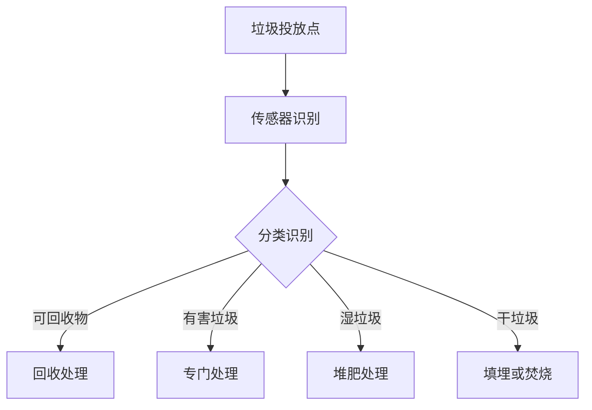

                 

关键词：智能废物分类、人工智能、回收效率、垃圾处理、深度学习、图像识别、数据挖掘

## 摘要

随着全球人口的增长和城市化进程的加速，垃圾处理问题日益严重。智能废物分类作为一种新兴的技术手段，可以有效提高回收效率，降低环境污染。本文将探讨人工智能（AI）在智能废物分类中的应用，分析核心算法原理、数学模型以及实际应用场景，并提出未来发展的趋势和挑战。

## 1. 背景介绍

### 垃圾处理现状

全球每年产生的垃圾量巨大，传统的垃圾处理方式主要以填埋和焚烧为主，这不仅占用大量土地资源，还产生有害气体和渗滤液，对环境造成严重污染。随着环保意识的提高，垃圾分类已成为全球许多国家和地区的共识。

### 智能废物分类的兴起

智能废物分类是一种通过技术手段实现垃圾自动分类的方法，能够显著提高回收效率，降低处理成本。人工智能技术，特别是深度学习和图像识别技术，在智能废物分类中发挥着关键作用。

## 2. 核心概念与联系

### 智能废物分类系统架构



### 核心算法原理

智能废物分类的核心在于图像识别和深度学习算法。通过训练大量的垃圾图像数据集，深度学习模型能够识别并分类各种垃圾。

### 技术联系

图像识别技术是智能废物分类的基础，而深度学习算法则能够实现高精度的分类。此外，数据挖掘技术用于分析分类结果，优化分类模型。

## 3. 核心算法原理 & 具体操作步骤

### 3.1 算法原理概述

智能废物分类算法主要包括以下步骤：

1. 数据采集与预处理：收集垃圾图像数据，并进行预处理，如图像缩放、裁剪和灰度化。
2. 模型训练：使用深度学习算法，如卷积神经网络（CNN），对预处理后的图像数据集进行训练。
3. 实时分类：将实时采集到的垃圾图像输入训练好的模型，进行分类。
4. 结果反馈与优化：根据分类结果，对模型进行反馈和优化，提高分类准确性。

### 3.2 算法步骤详解

1. **数据采集与预处理**
   - **图像采集**：使用摄像头或传感器收集垃圾图像。
   - **图像预处理**：对图像进行缩放、裁剪、灰度化等处理，以提高模型训练效果。

2. **模型训练**
   - **数据集准备**：收集大量垃圾图像，并将其标注为相应的类别。
   - **模型选择**：选择合适的深度学习模型，如CNN。
   - **训练过程**：使用预处理后的图像数据集，对模型进行训练。

3. **实时分类**
   - **图像输入**：将实时采集到的垃圾图像输入训练好的模型。
   - **分类结果**：模型输出分类结果，指示垃圾的类别。

4. **结果反馈与优化**
   - **分类结果分析**：对分类结果进行分析，识别分类错误。
   - **模型优化**：根据分类错误，对模型进行优化，提高分类准确性。

### 3.3 算法优缺点

**优点：**
- **高精度分类**：深度学习算法能够实现高精度的垃圾分类。
- **实时处理**：系统能够实时处理垃圾图像，提高分类效率。

**缺点：**
- **数据依赖性**：算法性能受限于训练数据的质量和数量。
- **计算资源消耗**：深度学习模型训练和实时分类需要大量的计算资源。

### 3.4 算法应用领域

智能废物分类算法可以应用于以下领域：

- **公共垃圾处理**：在公共场所、社区、公园等设置智能废物分类设备。
- **商业垃圾处理**：在商场、办公楼、酒店等设置智能废物分类设备。
- **工业垃圾处理**：在工厂、矿山、建筑工地等设置智能废物分类设备。

## 4. 数学模型和公式 & 详细讲解 & 举例说明

### 4.1 数学模型构建

智能废物分类的数学模型主要涉及卷积神经网络（CNN）的结构和参数。CNN的基本结构包括卷积层、池化层、全连接层等。以下是一个简化的CNN数学模型：

$$
f(x) = \sigma(W^{L} \cdot \sigma(W^{L-1} \cdot \sigma(... \sigma(W^{2} \cdot \sigma(W^{1} \cdot (x \cdot K^{1}) + b^{1})) + b^{2}) + ...) + b^{L})
$$

其中，$x$ 表示输入图像，$K^{1}, W^{1}, b^{1}, ..., W^{L}, b^{L}$ 分别为卷积核、权重、偏置，$\sigma$ 表示激活函数（如ReLU函数）。

### 4.2 公式推导过程

CNN的数学模型推导过程涉及多层感知器（MLP）和卷积操作的组合。首先，从MLP的基本公式出发：

$$
y^{L} = \sigma(W^{L} \cdot y^{L-1} + b^{L})
$$

其中，$y^{L}$ 表示第L层的输出，$W^{L}$ 和 $b^{L}$ 分别为权重和偏置。

接着，将卷积操作引入MLP，得到卷积神经网络的基本公式：

$$
f(x) = \sigma(W^{L} \cdot \sigma(W^{L-1} \cdot \sigma(... \sigma(W^{2} \cdot \sigma(W^{1} \cdot (x \cdot K^{1}) + b^{1})) + b^{2}) + ...) + b^{L})
$$

### 4.3 案例分析与讲解

以一个简单的垃圾分类模型为例，输入图像大小为$32 \times 32$，深度为3（RGB通道）。使用卷积神经网络对图像进行分类，输出为5个类别（可回收物、有害垃圾、湿垃圾、干垃圾、其他）。

1. **输入层**：输入图像$32 \times 32 \times 3$。
2. **卷积层1**：使用一个$3 \times 3$的卷积核，步长为1，填充方式为“零填充”，得到特征图大小为$32 \times 32 \times 16$。
3. **池化层1**：使用2x2的最大池化，得到特征图大小为$16 \times 16 \times 16$。
4. **卷积层2**：使用一个$3 \times 3$的卷积核，步长为1，填充方式为“零填充”，得到特征图大小为$16 \times 16 \times 32$。
5. **池化层2**：使用2x2的最大池化，得到特征图大小为$8 \times 8 \times 32$。
6. **全连接层**：将特征图展开为一维向量，大小为$8 \times 8 \times 32 = 2048$，与一个$2048 \times 5$的全连接层相连接，输出为5个类别概率。

## 5. 项目实践：代码实例和详细解释说明

### 5.1 开发环境搭建

1. **安装Python环境**：安装Python 3.8及以上版本。
2. **安装深度学习库**：安装TensorFlow、Keras等深度学习库。
3. **数据集准备**：收集垃圾分类图像数据集，并进行预处理。

### 5.2 源代码详细实现

```python
import tensorflow as tf
from tensorflow.keras.models import Sequential
from tensorflow.keras.layers import Conv2D, MaxPooling2D, Flatten, Dense

# 定义模型
model = Sequential([
    Conv2D(32, (3, 3), activation='relu', input_shape=(32, 32, 3)),
    MaxPooling2D((2, 2)),
    Conv2D(64, (3, 3), activation='relu'),
    MaxPooling2D((2, 2)),
    Flatten(),
    Dense(128, activation='relu'),
    Dense(5, activation='softmax')
])

# 编译模型
model.compile(optimizer='adam',
              loss='categorical_crossentropy',
              metrics=['accuracy'])

# 训练模型
model.fit(x_train, y_train, epochs=10, batch_size=32, validation_data=(x_val, y_val))

# 评估模型
model.evaluate(x_test, y_test)
```

### 5.3 代码解读与分析

- **模型定义**：使用Sequential模型，依次添加卷积层、池化层和全连接层。
- **编译模型**：设置优化器、损失函数和评价指标。
- **训练模型**：使用训练数据集进行模型训练，并设置验证集进行性能评估。
- **评估模型**：使用测试数据集评估模型性能。

## 6. 实际应用场景

### 6.1 公共场所

在公园、社区、学校等公共场所设置智能废物分类设备，提高垃圾分类意识和回收效率。

### 6.2 商业场所

在商场、办公楼、酒店等商业场所设置智能废物分类设备，提高垃圾处理效率和环保意识。

### 6.3 工业场所

在工厂、矿山、建筑工地等工业场所设置智能废物分类设备，实现垃圾的资源化利用。

## 7. 工具和资源推荐

### 7.1 学习资源推荐

- 《深度学习》（Goodfellow、Bengio、Courville 著）
- 《Python深度学习》（François Chollet 著）
- 《垃圾处理技术与应用》（刘维彬 著）

### 7.2 开发工具推荐

- TensorFlow
- Keras
- OpenCV

### 7.3 相关论文推荐

- "Deep Learning for Image Classification: A Comprehensive Review"（2020）
- "A Comprehensive Survey on Convolutional Neural Networks for Image Classification"（2018）

## 8. 总结：未来发展趋势与挑战

### 8.1 研究成果总结

智能废物分类作为一种新兴技术，已经在垃圾处理领域取得了显著成果。深度学习算法在垃圾分类中的成功应用，为垃圾处理提供了新的解决方案。

### 8.2 未来发展趋势

- **算法优化**：进一步提高分类准确性，降低计算资源消耗。
- **跨领域应用**：将智能废物分类技术应用于更多领域，如医疗废物处理、电子废弃物处理等。
- **系统集成**：实现智能废物分类系统与其他环保设备的集成，提高整体处理效率。

### 8.3 面临的挑战

- **数据依赖性**：算法性能受限于训练数据的质量和数量。
- **计算资源消耗**：深度学习模型训练和实时分类需要大量的计算资源。
- **政策支持**：需要政府和企业加大对智能废物分类技术的支持和推广。

### 8.4 研究展望

智能废物分类技术在未来有望实现以下突破：

- **智能传感器**：开发新型智能传感器，提高垃圾分类的准确性和实时性。
- **边缘计算**：将计算能力下沉到边缘设备，降低计算资源消耗。
- **跨学科合作**：结合环境科学、材料科学等领域的研究，实现更全面的垃圾处理解决方案。

## 9. 附录：常见问题与解答

### Q：智能废物分类技术是否适用于所有类型的垃圾？

A：智能废物分类技术主要适用于图像识别效果较好的垃圾类型，如纸张、塑料、玻璃、金属等。对于难以通过图像识别进行分类的垃圾，如生物垃圾和有害垃圾，可能需要结合其他技术手段进行辅助分类。

### Q：智能废物分类系统如何保证分类准确性？

A：智能废物分类系统的分类准确性主要取决于深度学习模型的训练质量和数据集的多样性。通过不断优化模型结构和增加训练数据量，可以提高分类准确性。此外，还可以采用交叉验证和混淆矩阵等方法对模型性能进行评估和优化。

### Q：智能废物分类系统的成本如何？

A：智能废物分类系统的成本包括硬件设备、软件开发、数据集准备等。根据设备类型和功能的不同，成本差异较大。一般来说，商业级别的智能废物分类系统的成本较高，但能够显著提高垃圾处理效率和回收率，长期来看是值得投资的。

## 作者署名

作者：禅与计算机程序设计艺术 / Zen and the Art of Computer Programming

以上是关于“AI在智能废物分类中的应用：提高回收效率”的文章，希望对您有所帮助。智能废物分类作为一种新兴技术，具有广泛的应用前景和巨大的社会价值。未来，随着人工智能技术的不断进步，智能废物分类系统将会在垃圾处理领域发挥更加重要的作用。让我们一起关注和推动这一领域的发展，为环境保护贡献自己的力量。

