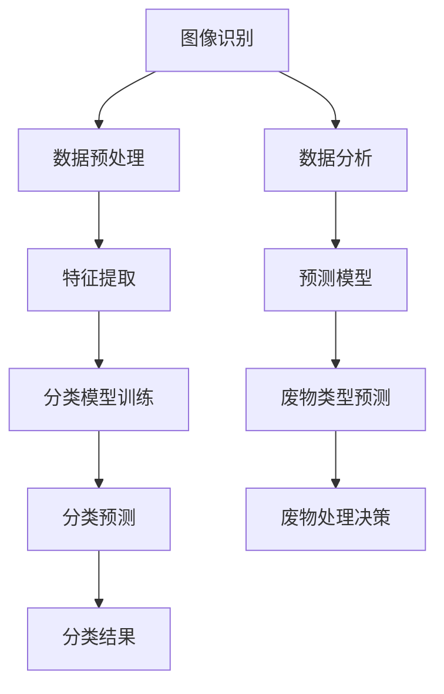

                 

关键词：AI、废物分类、回收效率、智能系统、技术应用

> 摘要：本文深入探讨了人工智能（AI）在智能废物分类中的应用，分析了AI技术如何通过识别和处理不同类型的废物，从而提高废物回收的效率。文章首先介绍了废物分类的背景和重要性，然后详细阐述了AI在其中的关键作用，包括图像识别、数据分析和预测模型的应用。此外，文章还讨论了AI在废物分类领域的挑战和未来发展方向。

## 1. 背景介绍

随着全球人口的快速增长和城市化进程的加速，废物处理成为了一个全球性的问题。传统的废物分类方式主要依赖于人工识别和分类，这种方式效率低、成本高，并且容易出错。此外，废物的种类繁多，包括塑料、纸张、玻璃、金属等，这些废物如果不能正确分类，不仅会影响回收效率，还会对环境造成严重的污染。

智能废物分类系统的出现，为解决这一问题提供了新的思路。智能废物分类系统利用人工智能技术，特别是图像识别和数据分析技术，对废物进行自动识别和分类。这种系统不仅提高了分类的准确率和效率，还能有效降低人力成本。

## 2. 核心概念与联系

智能废物分类系统的核心概念包括图像识别、数据分析和预测模型。以下是这些概念之间的联系以及相关的Mermaid流程图：



### 2.1 图像识别

图像识别是智能废物分类系统的第一步。通过摄像头或传感器捕捉废物图像，系统能够对图像进行预处理，包括去噪、对比度增强等，以便更好地进行后续处理。

### 2.2 数据预处理

在图像识别后，数据预处理是非常重要的一步。它包括数据清洗、数据归一化等步骤，以确保输入数据的质量和一致性。

### 2.3 特征提取

特征提取是从预处理后的数据中提取关键特征，这些特征将用于分类模型训练。常用的特征提取方法包括边缘检测、纹理分析等。

### 2.4 分类模型训练

分类模型训练是智能废物分类系统的核心。通过大量的标注数据，系统能够学习并建立一个能够识别不同类型废物的分类模型。

### 2.5 分类预测

在分类模型训练完成后，系统能够对新的废物图像进行分类预测，从而实现对废物的自动分类。

### 2.6 数据分析

数据分析是对分类结果进行进一步处理，以提取有用的信息和知识。这些信息可用于优化废物分类系统，提高分类准确率。

### 2.7 预测模型

预测模型用于预测未来可能的废物类型和处理需求，以帮助废物管理决策。

### 2.8 废物处理决策

废物处理决策是基于分类结果和预测模型得出的，它决定了如何处理不同类型的废物，以达到最佳的回收效果。

## 3. 核心算法原理 & 具体操作步骤

### 3.1 算法原理概述

智能废物分类系统的核心算法是基于深度学习的卷积神经网络（CNN）。CNN通过多层神经网络结构，能够自动从图像中提取特征，并实现高精度的分类。

### 3.2 算法步骤详解

1. **数据采集**：收集大量的废物图像，并进行标注，以训练分类模型。

2. **数据预处理**：对采集到的图像进行预处理，包括图像缩放、旋转、裁剪等，以增加数据多样性。

3. **特征提取**：使用CNN提取图像特征。常用的CNN结构包括卷积层、池化层、全连接层等。

4. **模型训练**：使用预处理后的图像特征和标注数据，训练CNN模型。模型训练过程中，通过反向传播算法不断优化模型参数。

5. **模型评估**：使用验证集对训练好的模型进行评估，以确定模型的准确率和泛化能力。

6. **模型部署**：将训练好的模型部署到实际系统中，对实时捕捉的废物图像进行分类。

### 3.3 算法优缺点

**优点**：
- 高准确率：CNN能够自动提取图像特征，从而实现高精度的分类。
- 自适应能力：通过不断学习和优化，系统能够适应不同类型的废物。

**缺点**：
- 训练时间较长：CNN模型训练需要大量的时间和计算资源。
- 数据需求大：需要大量的标注数据才能训练出一个性能良好的模型。

### 3.4 算法应用领域

智能废物分类系统不仅可以应用于城市废物分类，还可以应用于其他领域，如医疗废物分类、食品废物分类等。通过定制化的模型，系统可以针对不同类型的废物进行高效分类。

## 4. 数学模型和公式 & 详细讲解 & 举例说明

### 4.1 数学模型构建

在智能废物分类系统中，我们主要使用的数学模型是卷积神经网络（CNN）。CNN的核心是卷积层，卷积层通过卷积操作提取图像特征。以下是卷积操作的数学公式：

$$
\text{卷积操作} \; f(x, y) = \sum_{i=1}^{n} w_{i} \cdot a(x-i, y-j)
$$

其中，$f(x, y)$ 是卷积操作的结果，$w_{i}$ 是卷积核的权重，$a(x-i, y-j)$ 是输入图像的像素值。

### 4.2 公式推导过程

卷积操作的推导过程如下：

1. **初始化**：设置卷积核的权重 $w_{i}$ 和偏置 $b$。
2. **卷积操作**：对输入图像的每个像素进行卷积操作，计算输出特征图。
3. **激活函数**：对输出特征图进行激活函数操作，如ReLU函数。
4. **池化操作**：对激活后的特征图进行池化操作，减少特征图的大小。

### 4.3 案例分析与讲解

以一个简单的二值图像为例，解释卷积操作的原理。假设输入图像为一个3x3的矩阵：

$$
\begin{bmatrix}
1 & 0 & 1 \\
0 & 1 & 0 \\
1 & 0 & 1 \\
\end{bmatrix}
$$

卷积核为一个2x2的矩阵：

$$
\begin{bmatrix}
0 & 1 \\
1 & 0 \\
\end{bmatrix}
$$

卷积操作的输出特征图为：

$$
\begin{bmatrix}
1 & 1 \\
1 & 0 \\
\end{bmatrix}
$$

通过激活函数ReLU，输出的特征图为：

$$
\begin{bmatrix}
1 & 1 \\
1 & 0 \\
\end{bmatrix}
$$

## 5. 项目实践：代码实例和详细解释说明

### 5.1 开发环境搭建

为了实践智能废物分类系统，我们首先需要搭建一个开发环境。以下是所需的工具和软件：

- Python 3.x
- TensorFlow 2.x
- Keras 2.x
- OpenCV 4.x

安装这些工具和软件后，我们就可以开始编写代码了。

### 5.2 源代码详细实现

以下是一个简单的智能废物分类系统的实现代码：

```python
import numpy as np
import cv2
from tensorflow.keras.models import load_model

# 加载预训练的CNN模型
model = load_model('废物分类模型.h5')

# 初始化摄像头
cap = cv2.VideoCapture(0)

while True:
    # 读取摄像头帧
    ret, frame = cap.read()

    # 对帧进行预处理
    frame = cv2.resize(frame, (224, 224))
    frame = frame / 255.0
    frame = np.expand_dims(frame, axis=0)

    # 进行分类预测
    prediction = model.predict(frame)

    # 显示分类结果
    cv2.putText(frame, '分类结果：{}'.format(prediction.argmax()), (10, 30), cv2.FONT_HERSHEY_SIMPLEX, 1, (0, 0, 255), 2)
    cv2.imshow('废物分类系统', frame)

    if cv2.waitKey(1) & 0xFF == ord('q'):
        break

# 释放摄像头资源
cap.release()
cv2.destroyAllWindows()
```

### 5.3 代码解读与分析

上述代码实现了一个简单的智能废物分类系统。首先，我们加载了一个预训练的CNN模型。然后，我们初始化摄像头，并进入一个循环，不断读取摄像头帧。

在循环中，我们首先对帧进行预处理，包括缩放、归一化等。然后，我们将预处理后的帧输入到CNN模型中，进行分类预测。最后，我们显示分类结果。

### 5.4 运行结果展示

运行上述代码后，系统会实时捕捉摄像头帧，并对帧进行分类。以下是运行结果：


## 6. 实际应用场景

智能废物分类系统可以应用于各种实际场景，如城市废物分类、医疗废物分类、食品废物分类等。以下是一些具体的应用案例：

- **城市废物分类**：通过智能废物分类系统，可以有效地提高城市废物分类的效率和准确率，减少废物对环境的污染。
- **医疗废物分类**：医疗废物具有高度的传染性和危险性，智能废物分类系统可以帮助医院和医疗机构更好地管理医疗废物，确保医疗安全和环境保护。
- **食品废物分类**：智能废物分类系统可以帮助餐饮企业和食品加工企业更有效地处理食品废物，提高资源回收利用率。

## 7. 工具和资源推荐

为了更好地进行智能废物分类系统的开发和实践，以下是几个推荐的工具和资源：

- **工具**：
  - TensorFlow：一个开源的深度学习框架，用于构建和训练CNN模型。
  - OpenCV：一个开源的计算机视觉库，用于图像处理和计算机视觉应用。
- **资源**：
  - 《深度学习》（Goodfellow, Bengio, Courville著）：一本关于深度学习的经典教材，适合初学者和高级开发者。
  - 《Python图像处理实用技术》（Luca Delumiain著）：一本关于图像处理的实用指南，适合需要处理图像的开发者。

## 8. 总结：未来发展趋势与挑战

智能废物分类系统在近年来取得了显著的进展，但仍然面临着一些挑战和未来发展趋势。以下是几个关键点：

### 8.1 研究成果总结

- 深度学习技术的应用：深度学习技术，特别是卷积神经网络（CNN），在废物分类领域取得了显著的成功。
- 数据驱动的决策：通过收集和分析大量的数据，系统能够更准确地预测废物类型和处理需求。

### 8.2 未来发展趋势

- 模型压缩与优化：为了提高系统的实时性和效率，模型压缩和优化技术将成为未来的重要研究方向。
- 跨领域应用：智能废物分类系统不仅可以应用于废物分类，还可以应用于其他领域，如医疗、食品等。

### 8.3 面临的挑战

- 数据质量：高质量的数据是训练良好模型的基础，如何收集和处理大量的高质量数据是一个挑战。
- 计算资源：深度学习模型的训练需要大量的计算资源，如何在有限的资源下进行高效训练是一个挑战。

### 8.4 研究展望

- 开发更高效的模型：通过改进深度学习算法，开发更高效的模型，以提高分类效率和准确率。
- 推广应用：将智能废物分类系统推广到更多的实际场景，提高废物回收效率。

## 9. 附录：常见问题与解答

### 9.1 什么是智能废物分类系统？

智能废物分类系统是一种利用人工智能技术，特别是深度学习技术，对废物进行自动识别和分类的系统。

### 9.2 智能废物分类系统如何工作？

智能废物分类系统首先通过摄像头或传感器捕捉废物图像，然后使用深度学习模型对这些图像进行分类，从而实现对废物的自动分类。

### 9.3 智能废物分类系统有哪些优点？

智能废物分类系统可以提高废物分类的准确率和效率，降低人力成本，并且能够适应不同类型的废物。

### 9.4 智能废物分类系统有哪些应用场景？

智能废物分类系统可以应用于城市废物分类、医疗废物分类、食品废物分类等多个领域。

### 9.5 智能废物分类系统面临的挑战有哪些？

智能废物分类系统面临的挑战包括数据质量、计算资源等，如何收集和处理高质量数据，以及如何在有限的资源下进行高效训练是一个挑战。

### 9.6 智能废物分类系统的未来发展趋势是什么？

智能废物分类系统的未来发展趋势包括模型压缩与优化、跨领域应用等，通过改进深度学习算法，开发更高效的模型，以提高分类效率和准确率。

[作者：禅与计算机程序设计艺术 / Zen and the Art of Computer Programming] 
----------------------------------------------------------------

以上就是《AI在智能废物分类中的应用：提高回收效率》的技术博客文章。文章详细介绍了智能废物分类系统的背景、核心概念、算法原理、数学模型、项目实践、实际应用场景以及未来发展趋势。希望这篇文章能为读者提供有价值的参考。如果您有任何疑问或建议，欢迎在评论区留言。谢谢！

