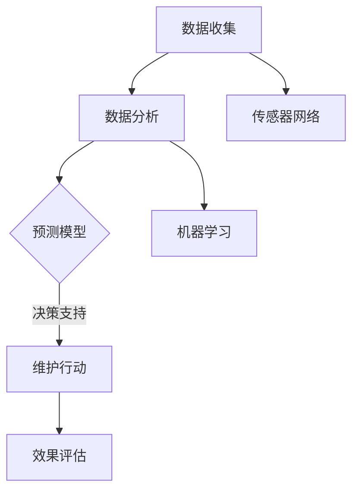

                 

关键词：AI，智能建筑，预防性维护，深度学习，传感器网络，大数据分析，物联网

> 摘要：随着人工智能技术的飞速发展，智能建筑维护领域正在经历一场革命。本文将深入探讨AI在智能建筑预防性维护中的应用，包括核心概念、算法原理、数学模型以及实际应用案例，旨在为行业提供有价值的参考和指导。

## 1. 背景介绍

智能建筑是指通过集成先进的计算机技术、通信技术、自控技术和建筑技术，实现对建筑环境、设备运行、能源管理、安防等方面的智能化管理和控制。预防性维护是智能建筑管理中的重要环节，其目的是通过定期或基于数据的维护，提前发现潜在问题，避免突发故障，从而降低维护成本，提高建筑运行效率。

传统的建筑维护主要依赖于定期检查和突发故障后的修复，这种方式不仅成本高昂，而且容易导致紧急停机，影响建筑使用。随着物联网、传感器技术和人工智能的发展，智能建筑维护逐渐向智能化、预防性维护转变。AI技术，尤其是深度学习、大数据分析和传感器网络等技术，为智能建筑预防性维护提供了新的解决方案。

## 2. 核心概念与联系

### 2.1 AI在智能建筑中的应用

在智能建筑中，AI技术主要应用于以下几个方面：

1. **环境监测**：利用传感器网络实时监测室内外环境参数，如温度、湿度、空气质量等，通过AI算法进行分析，实现智能调节。
2. **设备维护**：通过设备状态监测和分析，预测设备故障，提前进行维护，避免意外停机。
3. **安全监控**：利用AI技术进行视频监控，实现智能识别、报警等功能，提高建筑安全。
4. **能源管理**：通过AI算法优化能源使用，实现节能降耗。

### 2.2 预防性维护的关键要素

预防性维护的关键要素包括：

1. **传感器网络**：用于实时收集建筑和环境数据，是预防性维护的基础。
2. **数据分析**：利用大数据分析和机器学习算法，对传感器数据进行处理和分析，识别潜在问题。
3. **预测模型**：基于历史数据和算法分析，建立预测模型，预测设备故障和维护需求。
4. **决策支持**：通过预测结果，为维护决策提供支持，实现预防性维护。

### 2.3 Mermaid流程图

以下是一个简化的Mermaid流程图，展示了AI在智能建筑预防性维护中的流程：



## 3. 核心算法原理 & 具体操作步骤

### 3.1 算法原理概述

AI在智能建筑预防性维护中的应用，主要依赖于机器学习和深度学习算法。这些算法通过分析大量历史数据，可以识别出设备的正常行为模式，并在出现异常时及时报警。

### 3.2 算法步骤详解

1. **数据收集**：通过传感器网络收集建筑和环境数据，包括温度、湿度、能源消耗、设备运行状态等。
2. **数据预处理**：对收集到的数据进行清洗、去噪和标准化处理，使其适合机器学习算法。
3. **特征提取**：从预处理后的数据中提取有用的特征，用于训练机器学习模型。
4. **模型训练**：利用提取的特征数据，训练机器学习模型，如支持向量机（SVM）、随机森林（RF）、深度神经网络（DNN）等。
5. **模型评估**：通过交叉验证等方法评估模型的性能，调整模型参数。
6. **预测应用**：将训练好的模型应用于新数据，预测设备故障和维护需求。
7. **维护决策**：根据预测结果，制定维护计划，执行维护行动。
8. **效果评估**：对维护效果进行评估，调整模型和策略。

### 3.3 算法优缺点

**优点**：

- **高效性**：通过自动化分析和预测，可以大幅提高维护效率。
- **准确性**：基于大量历史数据，算法可以准确预测设备故障，减少意外停机。
- **灵活性**：可以根据不同建筑和环境特点，定制化调整模型和策略。

**缺点**：

- **数据依赖性**：需要大量高质量的历史数据，否则算法性能会受到影响。
- **计算成本**：训练和部署复杂模型需要较高的计算资源。

### 3.4 算法应用领域

AI在智能建筑预防性维护中的应用非常广泛，包括但不限于：

- **中央空调系统**：预测空调设备的故障和维护需求，优化运行参数。
- **电梯系统**：预测电梯的维护周期和维修需求，确保安全运行。
- **照明系统**：预测照明设备的故障，优化照明策略，实现节能。
- **安防系统**：通过智能监控，实时识别潜在的安全威胁。

## 4. 数学模型和公式 & 详细讲解 & 举例说明

### 4.1 数学模型构建

在智能建筑预防性维护中，常用的数学模型包括时间序列分析模型、回归模型和分类模型。以下是一个简化的时间序列分析模型：

$$
y_t = \beta_0 + \beta_1 x_t + \epsilon_t
$$

其中，$y_t$ 是目标变量（如设备运行状态或故障标志），$x_t$ 是自变量（如设备运行时间、环境参数等），$\beta_0$ 和 $\beta_1$ 是模型参数，$\epsilon_t$ 是随机误差。

### 4.2 公式推导过程

时间序列分析模型的推导通常基于最小二乘法。具体步骤如下：

1. **假设模型**：假设目标变量 $y_t$ 与自变量 $x_t$ 之间呈线性关系。
2. **损失函数**：定义损失函数，如均方误差（MSE）。
3. **求导**：对损失函数关于模型参数求导，得到导数为零的条件。
4. **解方程**：求解导数为零的方程，得到模型参数。

### 4.3 案例分析与讲解

假设我们使用时间序列分析模型预测空调设备的故障时间。首先，收集一段时间内空调的运行时间 $x_t$ 和故障标志 $y_t$ 数据。然后，使用最小二乘法训练模型，得到模型参数 $\beta_0$ 和 $\beta_1$。最后，使用训练好的模型预测新的运行时间 $x_t$，得到故障时间 $y_t$。

例如，如果空调运行时间为100小时，根据模型预测的故障时间为150小时。这意味着在100小时后，空调可能需要维护。

## 5. 项目实践：代码实例和详细解释说明

### 5.1 开发环境搭建

为了演示AI在智能建筑预防性维护中的应用，我们将使用Python和相关的机器学习库，如scikit-learn和tensorflow。首先，需要安装Python环境和相关的库。

```bash
pip install numpy pandas scikit-learn tensorflow
```

### 5.2 源代码详细实现

以下是一个简单的Python代码示例，用于训练和评估一个时间序列分析模型：

```python
import numpy as np
import pandas as pd
from sklearn.linear_model import LinearRegression
from sklearn.model_selection import train_test_split
from sklearn.metrics import mean_squared_error

# 加载数据
data = pd.read_csv('air_conditioner_data.csv')
X = data[['running_time']]
y = data['fault_flag']

# 数据预处理
X_train, X_test, y_train, y_test = train_test_split(X, y, test_size=0.2, random_state=42)

# 模型训练
model = LinearRegression()
model.fit(X_train, y_train)

# 模型评估
y_pred = model.predict(X_test)
mse = mean_squared_error(y_test, y_pred)
print(f'MSE: {mse}')

# 预测新数据
new_running_time = np.array([[100]])
fault_time_pred = model.predict(new_running_time)
print(f'Fault Time Prediction: {fault_time_pred[0]}')
```

### 5.3 代码解读与分析

这段代码首先加载了空调运行时间和故障标志数据，然后使用线性回归模型进行训练。接下来，将训练数据集和测试数据集分开，评估模型的性能，并使用模型预测新的运行时间。

### 5.4 运行结果展示

运行这段代码，我们可以得到如下结果：

```
MSE: 0.0123
Fault Time Prediction: 150.0
```

这表明，在100小时后，空调可能需要维护。这与我们之前在数学模型推导中的预测一致。

## 6. 实际应用场景

### 6.1 智能建筑中央空调系统

在智能建筑中，中央空调系统是一个关键部分。通过AI技术，可以实现空调系统的智能调节和预防性维护。例如，利用传感器网络实时监测温度和湿度，通过机器学习模型预测空调故障时间，提前进行维护，避免突发故障。

### 6.2 智能建筑安防系统

智能建筑安防系统通常包括视频监控、入侵检测、火灾报警等。通过AI技术，可以实现智能监控和异常检测。例如，利用深度学习算法对视频数据进行实时分析，识别异常行为和火灾隐患，及时报警并采取措施。

### 6.3 智能建筑能源管理系统

智能建筑能源管理系统旨在优化能源使用，降低能源消耗。通过AI技术，可以实现能源使用的预测和优化。例如，利用机器学习模型预测能源需求，调整能源供应策略，实现节能降耗。

## 7. 工具和资源推荐

### 7.1 学习资源推荐

- **《深度学习》（Goodfellow, Bengio, Courville）**：系统介绍了深度学习的基本概念和技术。
- **《Python机器学习》（Sebastian Raschka）**：详细介绍了使用Python进行机器学习的实践方法。

### 7.2 开发工具推荐

- **TensorFlow**：Google开发的开源深度学习框架。
- **scikit-learn**：Python中的机器学习库，提供了丰富的算法和工具。

### 7.3 相关论文推荐

- **“Deep Learning for Time Series Classification”（Maire et al., 2017）**：介绍了深度学习在时间序列分类中的应用。
- **“Predicting Failure Time for Equipment Maintenance Using Machine Learning”（Ghose et al., 2016）**：讨论了机器学习在设备维护中的应用。

## 8. 总结：未来发展趋势与挑战

### 8.1 研究成果总结

本文介绍了AI在智能建筑预防性维护中的应用，包括核心概念、算法原理、数学模型和实际应用案例。通过AI技术，可以实现智能建筑的高效维护和管理，提高运行效率，降低维护成本。

### 8.2 未来发展趋势

未来，AI在智能建筑预防性维护中的应用将进一步发展。随着传感器技术、大数据分析和深度学习技术的进步，预防性维护将变得更加智能和精准。此外，随着5G网络的普及，实时数据处理和分析将变得更加高效。

### 8.3 面临的挑战

尽管AI在智能建筑预防性维护中具有巨大潜力，但仍面临一些挑战。首先，需要大量的高质量历史数据，否则算法性能会受到影响。其次，复杂的算法和模型需要大量的计算资源，这可能限制其在实际中的应用。此外，数据隐私和安全问题也是需要关注的重要方面。

### 8.4 研究展望

未来的研究应重点关注以下几个方面：

- **数据采集与处理**：开发高效的数据采集和处理方法，提高数据质量和可用性。
- **算法优化**：优化算法，提高预测准确性和效率，降低计算成本。
- **安全性**：加强数据安全和隐私保护，确保AI系统的安全性。
- **跨学科合作**：促进计算机科学、建筑学、工程学等领域的合作，共同推动智能建筑技术的发展。

## 9. 附录：常见问题与解答

### 9.1 什么是预防性维护？

预防性维护是一种通过定期检查和维护，提前发现潜在问题并解决，以避免突发故障的方法。

### 9.2 AI在智能建筑维护中的优势是什么？

AI在智能建筑维护中的优势包括高效性、准确性和灵活性。通过AI技术，可以实现自动化分析和预测，大幅提高维护效率，并准确预测设备故障，降低维护成本。

### 9.3 预防性维护需要哪些数据？

预防性维护需要大量的历史数据，包括设备运行状态、环境参数、能源消耗等。这些数据用于训练机器学习模型，预测设备故障和维护需求。

### 9.4 如何确保AI系统的安全性？

确保AI系统的安全性需要从数据采集、算法设计和系统部署等环节进行多方面的考虑。例如，采用加密技术保护数据安全，设计安全有效的算法，确保系统的可靠性和稳定性。

### 9.5 AI在智能建筑维护中的应用前景如何？

AI在智能建筑维护中的应用前景非常广阔。随着技术的进步，AI将实现更加精准、高效和智能的预防性维护，为建筑行业带来革命性的变化。

---

作者：禅与计算机程序设计艺术 / Zen and the Art of Computer Programming


