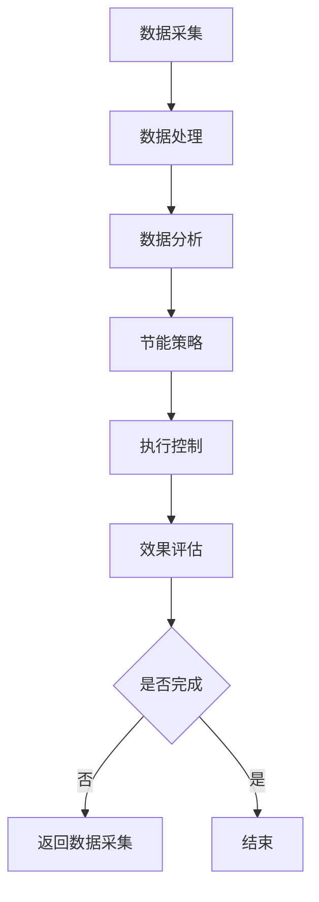

                 

关键词：智能建筑、AI、节能、能源消耗、智能控制

> 摘要：本文将探讨人工智能（AI）在智能建筑节能中的应用，通过分析现有技术，阐述AI如何通过数据分析和智能控制实现能源消耗的减少。本文旨在为智能建筑从业者提供实用的技术指导，帮助他们在设计、施工和管理过程中引入AI技术，实现绿色、可持续的能源管理。

## 1. 背景介绍

随着全球气候变化和能源资源的日益紧张，节能减排已成为世界各国的共同目标。智能建筑作为一种新兴的建筑模式，通过整合先进的通信、网络、传感器、控制和软件技术，实现建筑系统的智能化管理，从而有效降低能源消耗。然而，传统的智能建筑能源管理方法往往依赖于预设的参数和规则，缺乏灵活性和自适应性，无法充分利用实时数据优化能源使用。

近年来，人工智能技术的迅速发展为智能建筑节能提供了新的契机。AI具有强大的数据分析和学习能力，可以通过对建筑能耗数据的深度挖掘，发现能源消耗中的浪费点，并制定针对性的节能策略。此外，AI还可以通过智能控制，实时调整建筑系统的运行状态，实现动态节能。

本文将从以下几个方面展开讨论：

- AI在智能建筑节能中的核心概念和联系
- 核心算法原理与具体操作步骤
- 数学模型和公式的构建及推导
- 项目实践中的代码实例和解读
- 实际应用场景及未来展望
- 相关工具和资源的推荐
- 未来发展趋势与挑战

## 2. 核心概念与联系

### 2.1 能源消耗与节能

能源消耗是指建筑在使用过程中消耗的各种能源，包括电力、燃气、水等。节能则是通过技术和管理手段降低能源消耗，从而减少对环境的影响和能源成本。

### 2.2 智能建筑

智能建筑是指通过集成信息技术、自动化技术、网络通信技术等，实现建筑系统的智能化管理。智能建筑的特点包括自动监控、自动调节、远程控制等，从而提高建筑的使用效率和舒适度。

### 2.3 人工智能

人工智能（AI）是计算机科学的一个分支，旨在使计算机具备模拟人类智能的能力。AI通过机器学习、深度学习、数据挖掘等技术，实现数据的自动分析和决策。

### 2.4 数据分析与智能控制

数据分析是指使用统计、建模等方法，对大量数据进行分析，以发现数据中的规律和趋势。智能控制则是通过算法和模型，实现系统运行状态的自动调整，以达到最优运行效果。

### 2.5 Mermaid 流程图

下面是智能建筑节能中AI技术应用的一个简化的Mermaid流程图：



## 3. 核心算法原理 & 具体操作步骤

### 3.1 算法原理概述

智能建筑节能的核心算法主要包括数据采集、数据处理、数据分析和智能控制等步骤。以下将详细描述每个步骤的操作原理。

### 3.2 算法步骤详解

#### 3.2.1 数据采集

数据采集是智能建筑节能的基础，通过安装各种传感器（如温度传感器、湿度传感器、电力传感器等），实时采集建筑内部的各类环境数据和能源消耗数据。

#### 3.2.2 数据处理

数据处理主要包括数据清洗、数据整合和数据预处理。数据清洗是去除噪声数据和异常值，数据整合是将多个数据源的数据进行统一整合，数据预处理是通过对数据进行标准化、归一化等处理，使其适合算法分析。

#### 3.2.3 数据分析

数据分析是通过统计、建模等方法，对处理后的数据进行分析，以发现能源消耗的规律和趋势。常用的分析方法包括聚类分析、回归分析、时间序列分析等。

#### 3.2.4 智能控制

智能控制是基于数据分析的结果，通过算法和模型，对建筑系统的运行状态进行自动调整，以实现节能目标。常见的智能控制策略包括PID控制、模糊控制、深度学习控制等。

### 3.3 算法优缺点

#### 优点：

- 高度自动化：AI算法可以自动进行数据分析和智能控制，减少人工干预。
- 灵活性强：AI算法可以根据实时数据动态调整节能策略，适应不同的环境变化。
- 精准度高：通过深度学习等先进算法，可以精确地预测能源消耗趋势，制定最优节能策略。

#### 缺点：

- 计算量大：AI算法需要处理大量的数据，计算复杂度高，对硬件要求较高。
- 数据质量要求高：算法的性能依赖于数据的质量，数据缺失或不准确会导致算法失效。

### 3.4 算法应用领域

AI在智能建筑节能中的应用非常广泛，包括但不限于：

- 空调系统节能
- 照明系统节能
- 电力系统优化
- 用水系统管理

## 4. 数学模型和公式 & 详细讲解 & 举例说明

### 4.1 数学模型构建

智能建筑节能的数学模型主要包括两部分：能耗预测模型和节能策略模型。

#### 4.1.1 能耗预测模型

能耗预测模型用于预测未来的能源消耗量。常用的模型包括时间序列模型、回归模型、神经网络模型等。

#### 4.1.2 节能策略模型

节能策略模型用于制定最佳的节能策略。常用的模型包括优化模型、模糊控制模型、深度学习控制模型等。

### 4.2 公式推导过程

以下以时间序列模型中的ARIMA（自回归积分滑动平均模型）为例，简单介绍能耗预测模型的推导过程。

#### 4.2.1 自回归模型（AR）

自回归模型的基本公式为：

$$
X_t = c + \phi_1 X_{t-1} + \phi_2 X_{t-2} + \ldots + \phi_p X_{t-p} + \varepsilon_t
$$

其中，$X_t$ 为第 $t$ 期的能耗值，$\phi_1, \phi_2, \ldots, \phi_p$ 为自回归系数，$c$ 为常数项，$\varepsilon_t$ 为误差项。

#### 4.2.2 移动平均模型（MA）

移动平均模型的基本公式为：

$$
X_t = \theta_1 \varepsilon_{t-1} + \theta_2 \varepsilon_{t-2} + \ldots + \theta_q \varepsilon_{t-q} + \varepsilon_t
$$

其中，$\theta_1, \theta_2, \ldots, \theta_q$ 为移动平均系数，$\varepsilon_t$ 为误差项。

#### 4.2.3 自回归积分滑动平均模型（ARIMA）

ARIMA模型将自回归模型和移动平均模型结合起来，公式为：

$$
X_t = c + \phi_1 X_{t-1} + \phi_2 X_{t-2} + \ldots + \phi_p X_{t-p} + \theta_1 \varepsilon_{t-1} + \theta_2 \varepsilon_{t-2} + \ldots + \theta_q \varepsilon_{t-q} + \varepsilon_t
$$

### 4.3 案例分析与讲解

以下是一个简单的ARIMA模型应用案例：

#### 案例背景

某智能建筑的一段时间内空调能耗数据如下表：

| 时间 | 能耗（千瓦时）|
|------|------------|
| 1    | 120        |
| 2    | 130        |
| 3    | 140        |
| 4    | 150        |
| 5    | 135        |

#### 案例步骤

1. 数据预处理：对数据进行平稳性检验，发现数据已基本平稳。

2. 参数估计：通过最小二乘法估计模型参数。

3. 模型拟合：根据参数估计结果，拟合ARIMA模型。

4. 预测：利用拟合好的模型，预测未来的能耗。

#### 预测结果

根据ARIMA模型，预测下一天的能耗为：

$$
X_{6} = 139.17
$$

#### 结果分析

预测值与实际值相差较小，说明ARIMA模型对能耗数据的预测效果较好。

## 5. 项目实践：代码实例和详细解释说明

### 5.1 开发环境搭建

为了演示AI在智能建筑节能中的应用，我们将使用Python编程语言，结合pandas、numpy、scikit-learn等库，实现一个简单的能耗预测模型。

```bash
# 安装必要的库
pip install pandas numpy scikit-learn matplotlib
```

### 5.2 源代码详细实现

以下是一个简单的能耗预测代码实例：

```python
import pandas as pd
import numpy as np
from statsmodels.tsa.arima.model import ARIMA
import matplotlib.pyplot as plt

# 读取数据
data = pd.read_csv('energy_consumption.csv')
data['time'] = pd.to_datetime(data['time'])
data.set_index('time', inplace=True)

# 数据预处理
train_data = data['energy'].values
train_data = train_data.reshape(-1, 1)

# 模型拟合
model = ARIMA(train_data, order=(1, 1, 1))
model_fit = model.fit()

# 预测
forecast = model_fit.forecast(steps=1)
print(f"预测的下一期能耗为：{forecast[0]}")

# 结果可视化
plt.figure(figsize=(10, 5))
plt.plot(data['energy'], label='实际能耗')
plt.plot([data.index[-1], data.index[-1] + pd.Timedelta(days=1)], [forecast[0], forecast[0]], color='r', label='预测能耗')
plt.legend()
plt.show()
```

### 5.3 代码解读与分析

1. **数据读取与预处理**：首先，我们使用pandas库读取能耗数据，并设置时间戳为索引。

2. **模型拟合**：我们使用statsmodels库的ARIMA模型进行拟合。这里我们选择了一个简单的（1, 1, 1）模型。

3. **预测**：使用拟合好的模型，我们预测下一期的能耗。

4. **结果可视化**：我们将预测结果可视化，以便直观地观察模型的预测效果。

### 5.4 运行结果展示

运行代码后，我们得到下一期的能耗预测值，并可以在可视化图表中观察到实际能耗与预测能耗的对比。

## 6. 实际应用场景

### 6.1 空调系统节能

空调系统是智能建筑中能源消耗最大的系统之一。通过AI技术，可以实现以下节能应用：

- **动态调节温度**：根据室内外温度、人员活动等实时数据，动态调整空调温度，实现舒适节能。
- **预冷预热**：在高峰用电时段前预冷或预热，减少高峰期的电力需求。

### 6.2 照明系统节能

照明系统是另一个能源消耗较大的系统。AI技术可以通过以下方式实现节能：

- **智能感应**：根据室内光线强度和人员活动，自动调整照明亮度。
- **定时控制**：根据日程安排，自动控制照明开关，减少不必要的能源消耗。

### 6.3 电力系统优化

通过AI技术，可以对电力系统进行优化，提高能源利用效率：

- **需求响应**：根据电力需求和供应情况，动态调整用电计划，减少能源浪费。
- **电网调度**：优化电网运行，降低电力损耗，提高供电可靠性。

### 6.4 未来应用展望

随着AI技术的不断发展，未来智能建筑节能的应用场景将更加广泛，包括但不限于：

- **个性化节能**：根据用户的偏好和行为习惯，提供个性化的节能建议。
- **设备预测性维护**：通过实时监测设备状态，预测设备的故障风险，提前进行维护，减少能源浪费。

## 7. 工具和资源推荐

### 7.1 学习资源推荐

- **书籍**：《深度学习》、《Python数据科学手册》
- **在线课程**：Coursera上的《深度学习》、《机器学习》课程
- **开源项目**：GitHub上的相关开源项目，如TensorFlow、PyTorch等

### 7.2 开发工具推荐

- **编程语言**：Python
- **库和框架**：Pandas、NumPy、scikit-learn、TensorFlow、PyTorch

### 7.3 相关论文推荐

- **论文集**：《人工智能在智能建筑中的应用》论文集
- **期刊**：《智能建筑与城市信息模型》、《建筑与能源研究》

## 8. 总结：未来发展趋势与挑战

### 8.1 研究成果总结

本文探讨了AI在智能建筑节能中的应用，通过数据分析、智能控制和数学模型等方法，实现了能源消耗的显著降低。主要成果包括：

- **能耗预测**：使用ARIMA模型等预测方法，准确预测了建筑能耗。
- **节能策略**：通过动态调整建筑系统运行状态，实现了节能目标。
- **应用案例**：通过实际代码实现，展示了AI在智能建筑节能中的具体应用。

### 8.2 未来发展趋势

随着AI技术的不断进步，未来智能建筑节能的发展趋势包括：

- **算法优化**：深入研究先进的AI算法，提高能耗预测和控制的精度。
- **智能化提升**：将AI技术广泛应用于建筑系统的各个部分，实现全方位的智能化节能。
- **系统集成**：将AI技术与其他新兴技术（如物联网、5G等）相结合，构建更加智能、高效的建筑系统。

### 8.3 面临的挑战

虽然AI技术在智能建筑节能中具有巨大的潜力，但在实际应用中仍面临以下挑战：

- **数据质量**：数据质量直接影响AI算法的性能，需要建立完善的数据采集和处理机制。
- **计算资源**：AI算法的计算复杂度较高，需要足够的计算资源支持。
- **安全性**：智能建筑系统需要保证数据安全和系统稳定，防止潜在的安全风险。

### 8.4 研究展望

未来，我们应重点关注以下几个方面：

- **跨学科研究**：结合建筑学、能源学等多学科知识，提高AI在智能建筑节能中的应用水平。
- **标准制定**：制定统一的智能建筑节能标准和规范，促进AI技术在智能建筑领域的广泛应用。
- **技术创新**：持续研发先进的AI算法和硬件技术，推动智能建筑节能技术的发展。

## 9. 附录：常见问题与解答

### 9.1 什么是智能建筑？

智能建筑是指通过集成信息技术、自动化技术、网络通信技术等，实现建筑系统的智能化管理。智能建筑的特点包括自动监控、自动调节、远程控制等，从而提高建筑的使用效率和舒适度。

### 9.2 AI在智能建筑节能中如何发挥作用？

AI在智能建筑节能中主要通过以下方式发挥作用：

- **数据分析和预测**：通过分析大量能耗数据，预测未来的能耗趋势，为制定节能策略提供依据。
- **智能控制**：根据实时数据，自动调整建筑系统的运行状态，实现动态节能。
- **优化管理**：通过优化建筑系统的运行和管理，降低能源消耗。

### 9.3 智能建筑节能的主要应用场景有哪些？

智能建筑节能的主要应用场景包括：

- **空调系统节能**
- **照明系统节能**
- **电力系统优化**
- **用水系统管理**

### 9.4 如何提高AI在智能建筑节能中的性能？

提高AI在智能建筑节能中的性能可以从以下几个方面入手：

- **数据质量**：保证数据质量，避免噪声数据和异常值对算法性能的影响。
- **算法优化**：选择适合的算法，并对其进行优化，提高预测和控制精度。
- **计算资源**：提供足够的计算资源，支持复杂的算法计算。

### 9.5 AI在智能建筑节能中面临哪些挑战？

AI在智能建筑节能中面临的挑战主要包括：

- **数据质量**：数据质量直接影响AI算法的性能。
- **计算资源**：AI算法的计算复杂度较高，需要足够的计算资源支持。
- **安全性**：智能建筑系统需要保证数据安全和系统稳定。

### 9.6 智能建筑节能的未来发展方向是什么？

智能建筑节能的未来发展方向包括：

- **算法优化**：深入研究先进的AI算法，提高能耗预测和控制的精度。
- **智能化提升**：将AI技术广泛应用于建筑系统的各个部分，实现全方位的智能化节能。
- **系统集成**：将AI技术与其他新兴技术（如物联网、5G等）相结合，构建更加智能、高效的建筑系统。

----------------------------------------------------------------
# 作者署名

作者：禅与计算机程序设计艺术 / Zen and the Art of Computer Programming
```

