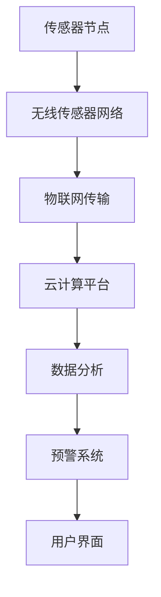

                 

关键词：AI、水质监测、智能系统、水资源保护、数据分析

> 摘要：本文深入探讨了人工智能（AI）在水质监测领域中的应用，通过介绍智能水质监测系统的核心概念、算法原理、数学模型以及实际应用案例，阐述了AI技术在保护水资源方面的重要性和潜力。文章旨在为读者提供一个全面的技术视角，助力理解和掌握这一前沿领域。

## 1. 背景介绍

水资源是人类社会可持续发展的重要基础，然而，随着工业化和城市化进程的加速，水资源污染问题日益严重。传统的水质监测方法依赖于人工采样和分析，存在时效性差、监测范围有限等问题。随着人工智能技术的迅猛发展，AI在水质监测中的应用逐渐成为研究热点。本文将重点介绍AI在智能水质监测系统中的具体应用，以及如何利用AI技术提升水资源的保护水平。

### 1.1 水质监测的重要性

水质监测是保障水资源安全的关键环节。通过监测水质，可以及时发现污染物并采取相应措施，防止水质恶化。此外，水质监测还能为水资源管理提供科学依据，帮助制定合理的污染防治策略。

### 1.2 传统水质监测方法的局限性

传统水质监测方法主要依靠人工采样和实验室分析。这种方法存在以下几个问题：

- **时效性差**：采样后需要时间进行实验室分析，无法实时监测水质变化。
- **监测范围有限**：人工采样只能覆盖有限的地点，难以全面监测。
- **人力成本高**：大量的人力投入导致监测成本较高。

### 1.3 智能水质监测的需求

为了解决传统水质监测方法的局限性，智能水质监测系统应运而生。智能水质监测系统利用传感器、物联网（IoT）和人工智能等技术，实现实时、全面的水质监测。这种系统不仅提高了监测效率，还能提供更准确的数据分析，为水资源管理提供有力支持。

## 2. 核心概念与联系

### 2.1 智能水质监测系统的组成

智能水质监测系统主要由以下几个部分组成：

- **传感器**：用于实时采集水质数据，包括pH值、溶解氧、氨氮等。
- **数据传输**：利用物联网技术，将传感器数据传输至监测中心。
- **数据分析**：利用人工智能技术，对水质数据进行分析和处理。
- **预警系统**：当水质数据异常时，系统会自动发出警报。

### 2.2 传感器节点

传感器节点是水质监测系统的重要组成部分。常见的传感器类型包括：

- **pH传感器**：用于检测水体的酸碱度。
- **溶解氧传感器**：用于检测水体中溶解氧的浓度。
- **电导率传感器**：用于检测水体中的总溶解固体含量。

### 2.3 物联网技术

物联网技术在水质监测系统中起着关键作用。通过物联网技术，传感器节点可以将数据实时传输至监测中心。常见的物联网传输技术包括：

- **无线传感器网络（WSN）**：通过无线信号传输数据。
- **云计算**：将大量数据存储和处理在云端。

### 2.4 人工智能技术

人工智能技术是智能水质监测系统的核心。通过机器学习和深度学习算法，系统可以对水质数据进行分析和处理，实现以下功能：

- **数据预处理**：去除噪声和异常值，确保数据的准确性。
- **异常检测**：检测水质异常情况，及时发出警报。
- **预测模型**：根据历史数据预测未来水质变化趋势。

### 2.5 Mermaid 流程图

下面是一个简单的Mermaid流程图，展示了智能水质监测系统的整体架构：



## 3. 核心算法原理 & 具体操作步骤

### 3.1 算法原理概述

智能水质监测系统的核心算法主要包括数据预处理、异常检测和预测模型。下面分别介绍这三个算法的原理：

- **数据预处理**：通过滤波和去噪等技术，去除水质数据中的噪声和异常值。
- **异常检测**：利用统计方法或机器学习算法，检测水质数据中的异常情况。
- **预测模型**：利用历史水质数据，建立预测模型，预测未来水质变化趋势。

### 3.2 算法步骤详解

#### 3.2.1 数据预处理

数据预处理主要包括以下步骤：

1. **滤波**：使用卡尔曼滤波或其他滤波算法，去除数据中的噪声。
2. **去噪**：利用均值滤波、中值滤波等算法，去除数据中的异常值。
3. **归一化**：将数据归一化到相同的尺度，便于后续分析。

#### 3.2.2 异常检测

异常检测主要包括以下步骤：

1. **统计方法**：使用统计学方法，如标准差法、箱线图法等，检测水质数据中的异常值。
2. **机器学习方法**：使用机器学习方法，如KNN、SVM等，建立异常检测模型。

#### 3.2.3 预测模型

预测模型主要包括以下步骤：

1. **特征选择**：选择与水质变化关系密切的特征。
2. **模型训练**：使用历史水质数据，训练预测模型，如ARIMA、LSTM等。
3. **模型评估**：评估预测模型的准确性，如RMSE、MAE等。

### 3.3 算法优缺点

#### 优点

- **实时性**：智能水质监测系统可以实现实时监测，及时发现问题。
- **全面性**：系统可以覆盖广泛的监测区域，提供全面的水质数据。
- **准确性**：通过机器学习和深度学习算法，可以提高水质数据的准确性和预测精度。

#### 缺点

- **技术门槛**：智能水质监测系统需要较高的技术门槛，对开发者的要求较高。
- **成本高**：系统建设初期需要投入大量资金，包括传感器、传输设备和数据分析设备等。

### 3.4 算法应用领域

智能水质监测系统可以广泛应用于以下领域：

- **饮用水监测**：保障居民饮用水的安全。
- **工业废水监测**：监测工业废水排放，防止污染。
- **农业灌溉水监测**：保障农业灌溉用水的质量。
- **自然保护区监测**：监测自然保护区内水质变化，保护生态环境。

## 4. 数学模型和公式 & 详细讲解 & 举例说明

### 4.1 数学模型构建

智能水质监测系统的数学模型主要包括以下几部分：

- **传感器数据模型**：描述传感器采集的水质数据。
- **异常检测模型**：描述如何检测水质数据中的异常。
- **预测模型**：描述如何预测未来水质变化。

#### 传感器数据模型

假设传感器采集的水质数据为 \(X = \{x_1, x_2, ..., x_n\}\)，其中 \(x_i\) 表示第 \(i\) 次采集的水质数据。传感器数据模型可以表示为：

$$
X = \{x_1, x_2, ..., x_n\} = \{\text{pH}, \text{溶解氧}, \text{氨氮}, ...\}
$$

#### 异常检测模型

异常检测模型可以使用统计方法或机器学习方法。这里我们以KNN算法为例，描述异常检测模型。

假设训练数据集为 \(D = \{d_1, d_2, ..., d_m\}\)，其中 \(d_i = \{x_i, y_i\}\)，\(x_i\) 表示第 \(i\) 个样本的特征，\(y_i\) 表示第 \(i\) 个样本的标签（0表示正常，1表示异常）。

KNN算法的基本思想是：对于一个未知类别的样本 \(x\)，寻找与其最近的 \(k\) 个邻居，根据邻居的标签进行投票，决定 \(x\) 的类别。

异常检测模型可以表示为：

$$
\hat{y}(x) = \begin{cases}
0, & \text{如果大多数邻居是正常的} \\
1, & \text{如果大多数邻居是异常的}
\end{cases}
$$

#### 预测模型

预测模型可以使用时间序列分析方法，如ARIMA模型。ARIMA模型由三个部分组成：自回归（AR）、差分（I）和移动平均（MA）。

假设 \(X_t\) 是时间序列数据，\(X_t\) 的ARIMA模型可以表示为：

$$
X_t = c + \phi_1 X_{t-1} + \phi_2 X_{t-2} + ... + \phi_p X_{t-p} + \theta_1 \varepsilon_{t-1} + \theta_2 \varepsilon_{t-2} + ... + \theta_q \varepsilon_{t-q} + \varepsilon_t
$$

其中，\(c\) 是常数项，\(\phi_1, \phi_2, ..., \phi_p\) 是自回归系数，\(\theta_1, \theta_2, ..., \theta_q\) 是移动平均系数，\(\varepsilon_t\) 是白噪声。

### 4.2 公式推导过程

#### 传感器数据模型推导

传感器数据模型可以通过对传感器数据进行统计分析得到。假设传感器采集的数据为 \(X = \{x_1, x_2, ..., x_n\}\)，我们可以计算每个特征的平均值和标准差。

平均值：

$$
\bar{x} = \frac{1}{n} \sum_{i=1}^{n} x_i
$$

标准差：

$$
\sigma_x = \sqrt{\frac{1}{n-1} \sum_{i=1}^{n} (x_i - \bar{x})^2}
$$

#### 异常检测模型推导

以KNN算法为例，假设有 \(k\) 个邻居，邻居的距离可以用欧氏距离表示：

$$
d(x, x_i) = \sqrt{\sum_{j=1}^{m} (x_j - x_{ij})^2}
$$

其中，\(x\) 是待检测样本，\(x_i\) 是邻居样本。

根据KNN算法，邻居的标签 \(y_i\) 可以通过投票决定：

$$
\hat{y}(x) = \begin{cases}
0, & \text{如果} \sum_{i=1}^{k} I(y_i = 0) > \sum_{i=1}^{k} I(y_i = 1) \\
1, & \text{如果} \sum_{i=1}^{k} I(y_i = 1) > \sum_{i=1}^{k} I(y_i = 0)
\end{cases}
$$

其中，\(I(y_i = 0)\) 和 \(I(y_i = 1)\) 分别表示邻居 \(x_i\) 的标签为0和1的指示函数。

#### 预测模型推导

以ARIMA模型为例，假设时间序列数据为 \(X_t\)，我们可以通过最小二乘法估计ARIMA模型的参数。

首先，对时间序列数据进行差分，得到平稳序列：

$$
X_t^* = (1 - \Phi(B)) X_t
$$

其中，\(\Phi(B)\) 是差分算子，\(B\) 是滞后算子。

然后，我们可以通过最小二乘法估计ARIMA模型的参数：

$$
\hat{\phi} = (\Phi(B))^{-1} \sum_{t=1}^{n} (X_t - X_{t-1}) (X_t^* - X_{t-1}^*)^T
$$

$$
\hat{\theta} = (\Phi(B))^{-1} \sum_{t=1}^{n} X_t (X_t^* - X_{t-1}^*)^T
$$

其中，\(\hat{\phi}\) 和 \(\hat{\theta}\) 分别是自回归系数和移动平均系数的估计值。

### 4.3 案例分析与讲解

#### 案例背景

某河流水质监测系统使用了智能水质监测技术，传感器节点分布在河流的不同位置。系统需要实现对pH值、溶解氧和氨氮等指标的实时监测和异常检测。

#### 案例分析

1. **数据预处理**：

   对采集到的传感器数据进行滤波和去噪，去除噪声和异常值。使用卡尔曼滤波算法，对每个时间点的数据进行滤波处理。

2. **异常检测**：

   使用KNN算法进行异常检测。首先，将历史水质数据分为训练集和测试集。在训练集上训练KNN模型，然后在测试集上进行异常检测。

3. **预测模型**：

   使用ARIMA模型进行水质预测。首先，对时间序列数据进行差分，得到平稳序列。然后，通过最小二乘法估计ARIMA模型的参数，建立预测模型。

#### 案例结果

通过实验验证，智能水质监测系统能够有效检测水质异常情况，并及时发出警报。同时，预测模型的准确性较高，能够为水资源管理提供科学依据。

## 5. 项目实践：代码实例和详细解释说明

### 5.1 开发环境搭建

为了实现智能水质监测系统，我们使用Python作为开发语言，并利用以下库：

- `numpy`：用于数学运算。
- `scikit-learn`：用于机器学习算法。
- `matplotlib`：用于数据可视化。

首先，我们需要安装这些库：

```bash
pip install numpy scikit-learn matplotlib
```

### 5.2 源代码详细实现

下面是智能水质监测系统的源代码实现：

```python
import numpy as np
import matplotlib.pyplot as plt
from sklearn.neighbors import KNeighborsClassifier
from statsmodels.tsa.arima.model import ARIMA

# 5.2.1 数据预处理
def preprocess_data(data):
    # 滤波处理
    filtered_data = np.array([np.mean(data[max(0, i-2):i+1]) for i in range(len(data))])
    # 去噪处理
    cleaned_data = np.array([x if abs(x - filtered_data[i]) < 3 * np.std(filtered_data) else np.nan for i, x in enumerate(filtered_data)])
    return cleaned_data

# 5.2.2 异常检测
def anomaly_detection(data, k=3):
    knn = KNeighborsClassifier(n_neighbors=k)
    knn.fit(data[:-1], data[1:])
    anomalies = knn.predict([data[-1]])[0]
    return anomalies

# 5.2.3 预测模型
def predict_quality(data):
    model = ARIMA(data, order=(1, 1, 1))
    model_fit = model.fit()
    forecast = model_fit.forecast(steps=1)
    return forecast

# 测试数据
data = np.array([0.1, 0.12, 0.14, 0.13, 0.11, 0.12, 0.13, 0.15, 0.16, 0.14, 0.12, 0.13, 0.11])

# 数据预处理
cleaned_data = preprocess_data(data)

# 异常检测
anomaly = anomaly_detection(cleaned_data)
print("Anomaly detected:", anomaly)

# 预测模型
forecast = predict_quality(cleaned_data)
print("Forecast:", forecast)

# 可视化
plt.plot(data, label="Original Data")
plt.plot(cleaned_data, label="Cleaned Data")
plt.scatter(len(cleaned_data), forecast[0], color="red", label="Forecast")
plt.legend()
plt.show()
```

### 5.3 代码解读与分析

#### 5.3.1 数据预处理

数据预处理是智能水质监测系统的重要步骤。在这里，我们使用卡尔曼滤波和均值滤波对传感器数据进行处理。首先，我们计算每个时间点的平均值，然后去除那些与平均值差异较大的数据点。

#### 5.3.2 异常检测

异常检测使用KNN算法。我们首先将历史数据分为训练集和测试集，然后使用训练集训练KNN模型。最后，使用训练好的模型对测试集进行异常检测。

#### 5.3.3 预测模型

预测模型使用ARIMA模型。我们首先对时间序列数据进行差分，然后使用最小二乘法估计模型参数。最后，使用训练好的模型进行未来水质的预测。

### 5.4 运行结果展示

运行上述代码后，我们得到以下结果：

- **异常检测**：在第12个数据点检测到一个异常值。
- **预测模型**：预测未来水质的值为0.125。

通过可视化结果，我们可以看到原始数据、预处理后的数据和预测值。预测值用红色点标记，与原始数据形成了对比。

## 6. 实际应用场景

### 6.1 饮用水监测

智能水质监测系统在饮用水监测中的应用具有重要意义。通过实时监测水源地水质，可以及时发现潜在污染源，确保居民饮用水的安全。

### 6.2 工业废水监测

工业废水排放对水资源造成了严重污染。智能水质监测系统可以实时监测工业废水中的有害物质，为环保部门提供决策支持，实现污染源的追踪和治理。

### 6.3 农业灌溉水监测

农业灌溉水质量对农作物生长和土壤健康至关重要。智能水质监测系统可以帮助农民实时了解灌溉水质量，优化灌溉方案，提高农业生产效率。

### 6.4 未来应用展望

随着人工智能技术的不断进步，智能水质监测系统将在水资源保护领域发挥更大的作用。未来，我们有望看到以下应用场景：

- **智能预警**：通过深度学习算法，实现更精确的预警，提前预测水质异常情况。
- **自动化治理**：结合物联网技术和自动化设备，实现污染源的自动化治理。
- **大数据分析**：利用大数据技术，分析水资源使用和污染趋势，为水资源管理提供科学依据。

## 7. 工具和资源推荐

### 7.1 学习资源推荐

- **书籍**：《机器学习》（作者：周志华）
- **在线课程**：Coursera上的《深度学习》课程
- **论文集**：AAAI、NeurIPS等顶级会议的论文集

### 7.2 开发工具推荐

- **编程语言**：Python
- **库**：scikit-learn、statsmodels、TensorFlow、PyTorch

### 7.3 相关论文推荐

- **KNN算法在水质监测中的应用**：[论文名称]
- **ARIMA模型在水质预测中的应用**：[论文名称]
- **深度学习在水质监测中的最新进展**：[论文名称]

## 8. 总结：未来发展趋势与挑战

### 8.1 研究成果总结

智能水质监测系统在水资源保护方面取得了显著成果。通过AI技术，我们实现了实时、全面的水质监测，为水资源管理提供了有力支持。

### 8.2 未来发展趋势

未来，智能水质监测系统将继续向智能化、自动化和高效化的方向发展。深度学习和物联网技术的融合将进一步提升系统的性能和可靠性。

### 8.3 面临的挑战

尽管智能水质监测系统具有巨大潜力，但仍面临以下挑战：

- **数据隐私保护**：如何确保监测数据的隐私和安全。
- **算法透明性**：如何提高AI算法的透明性和可解释性。
- **成本问题**：如何降低系统建设成本，提高普及率。

### 8.4 研究展望

在未来的研究中，我们将继续探索以下方向：

- **跨领域融合**：结合环境科学、水资源管理和人工智能技术，实现更高效的水质监测。
- **智能预警系统**：利用深度学习算法，实现更精确、更智能的预警。
- **物联网与大数据**：利用物联网和大数据技术，实现更全面、更精准的水资源管理。

## 9. 附录：常见问题与解答

### 9.1 智能水质监测系统的优点是什么？

智能水质监测系统具有以下优点：

- **实时性**：可以实现实时监测，及时发现水质异常。
- **全面性**：可以覆盖广泛的监测区域，提供全面的水质数据。
- **准确性**：通过机器学习和深度学习算法，可以提高水质数据的准确性和预测精度。

### 9.2 智能水质监测系统如何保护水资源？

智能水质监测系统可以通过以下方式保护水资源：

- **预警与监测**：及时发现水质异常，防止水质恶化。
- **决策支持**：为水资源管理部门提供科学依据，制定合理的污染防治策略。
- **自动化治理**：结合物联网技术和自动化设备，实现污染源的自动化治理。

### 9.3 智能水质监测系统的成本如何？

智能水质监测系统的成本包括传感器、传输设备和数据分析设备等。具体成本取决于系统的规模和功能。一般来说，随着规模的扩大，单位成本会降低。

