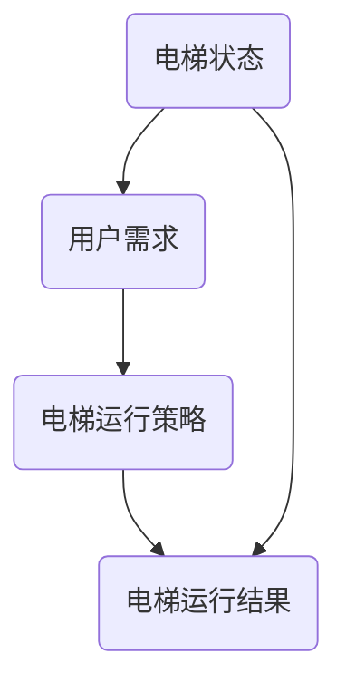

                 

关键词：AI、智能电梯管理、等待时间、优化、算法、数学模型、应用实践

> 摘要：随着人工智能技术的快速发展，智能电梯管理成为了一个重要的研究方向。本文将探讨如何利用AI技术来减少电梯等待时间，提高电梯运行效率。文章首先介绍了智能电梯管理的基本概念和背景，然后深入分析了AI在电梯管理中的应用，包括核心算法原理、数学模型构建以及实际应用案例。最后，文章对AI在智能电梯管理中的未来发展趋势与挑战进行了展望。

## 1. 背景介绍

电梯作为现代高层建筑中不可或缺的垂直交通工具，其运行效率直接关系到用户的体验和建筑物的整体运营效率。然而，传统的电梯管理方法通常依赖于预定的运行模式，未能充分利用实时数据和用户需求，导致电梯等待时间长、运行效率低等问题。随着人工智能技术的快速发展，AI在智能电梯管理中的应用逐渐成为研究热点。

智能电梯管理主要目标是优化电梯的运行策略，减少用户的等待时间和电梯的运行能耗。传统的电梯管理主要依赖于以下三个基本策略：

1. **固定分区策略**：电梯按照预定的分区进行运行，每个分区对应的电梯只服务于该分区的楼层。
2. **最大负载策略**：电梯优先服务于负载最重的楼层，以减少电梯的运行次数。
3. **最近优先策略**：电梯优先服务于离电梯最近的楼层，以减少用户的等待时间。

尽管这些策略在一定程度上提高了电梯的运行效率，但它们忽略了实时数据和用户需求的变化，导致电梯在某些时间段内等待时间长，运行效率低。

## 2. 核心概念与联系

智能电梯管理涉及到多个核心概念，包括电梯状态、用户需求、电梯运行策略等。以下是一个简化的Mermaid流程图，展示了这些核心概念之间的关系：



### 2.1 电梯状态

电梯状态包括电梯当前位置、电梯运行方向、电梯内乘客数量等。电梯状态的变化直接影响电梯的运行策略。

### 2.2 用户需求

用户需求是指用户需要前往的楼层。用户需求的变化会影响电梯的运行方向和电梯的运行策略。

### 2.3 电梯运行策略

电梯运行策略是根据电梯状态和用户需求计算出来的最优运行模式。常见的电梯运行策略包括最近优先策略、最大负载策略等。

### 2.4 电梯运行结果

电梯运行结果是电梯运行策略的实际运行效果，包括电梯的运行速度、运行时间等。

## 3. 核心算法原理 & 具体操作步骤

智能电梯管理的核心在于如何利用AI技术优化电梯的运行策略。以下将介绍一种基于深度强化学习的电梯调度算法。

### 3.1 算法原理概述

深度强化学习是一种结合了深度学习和强化学习的方法。在电梯调度问题中，深度强化学习通过模仿人类调度员的行为，学习出一种最优的电梯调度策略。

### 3.2 算法步骤详解

1. **环境初始化**：初始化电梯状态、用户需求和电梯调度策略。
2. **状态感知**：根据电梯状态和用户需求，确定当前状态。
3. **动作选择**：根据当前状态，选择最优的电梯调度动作。
4. **状态更新**：执行电梯调度动作，更新电梯状态和用户需求。
5. **奖励计算**：根据电梯调度动作的效果，计算奖励值。
6. **策略更新**：根据奖励值，更新电梯调度策略。

### 3.3 算法优缺点

深度强化学习算法在电梯调度问题中具有以下优点：

- **自适应性强**：能够根据实时数据和用户需求，动态调整电梯调度策略。
- **高效性**：通过学习最优的调度策略，能够显著减少电梯等待时间。

然而，深度强化学习算法也存在一些缺点：

- **计算复杂度**：深度强化学习算法的计算复杂度较高，需要大量计算资源和时间。
- **数据依赖性**：深度强化学习算法对数据质量有较高要求，数据不足或质量差可能会导致算法效果不佳。

### 3.4 算法应用领域

深度强化学习算法可以广泛应用于电梯调度、智能交通、智能家居等领域，其核心思想是通过学习最优策略，提高系统的运行效率。

## 4. 数学模型和公式 & 详细讲解 & 举例说明

### 4.1 数学模型构建

在电梯调度问题中，数学模型的核心是建立电梯调度策略与电梯运行效率之间的量化关系。以下是一个简化的数学模型：

\[ E = f(S, D, P) \]

其中，\( E \) 表示电梯的运行效率，\( S \) 表示电梯状态，\( D \) 表示用户需求，\( P \) 表示电梯调度策略。

### 4.2 公式推导过程

1. **状态表示**：\( S = (s_1, s_2, ..., s_n) \)，其中 \( s_i \) 表示电梯在第 \( i \) 个楼层的当前状态，包括电梯是否在运行、电梯运行方向等。
2. **用户需求表示**：\( D = (d_1, d_2, ..., d_n) \)，其中 \( d_i \) 表示用户在第 \( i \) 个楼层的当前需求，包括用户是否需要乘坐电梯、用户需要前往的楼层等。
3. **调度策略表示**：\( P = (p_1, p_2, ..., p_n) \)，其中 \( p_i \) 表示电梯在第 \( i \) 个楼层的调度策略，包括电梯应该前往哪个楼层。

4. **运行效率计算**：电梯的运行效率可以通过以下公式计算：

\[ E = \frac{1}{N} \sum_{i=1}^{N} \frac{d_i \cdot p_i}{s_i} \]

其中，\( N \) 表示电梯的总楼层数。

### 4.3 案例分析与讲解

假设有一栋10层楼的建筑物，电梯当前处于第5层，电梯状态为静止，电梯运行方向为向上。当前有5个用户需求，分别位于1层、3层、6层、8层和10层。

根据状态表示，当前状态 \( S = (0, 0, 1, 0, 0, 0, 0, 0, 0, 1) \)。

根据用户需求表示，当前用户需求 \( D = (1, 0, 0, 1, 0, 1, 0, 1, 0, 0) \)。

假设电梯的调度策略为 \( P = (0, 0, 1, 0, 0, 1, 0, 1, 0, 0) \)。

根据运行效率计算公式，电梯的运行效率 \( E = \frac{1}{10} \sum_{i=1}^{10} \frac{d_i \cdot p_i}{s_i} = \frac{1}{10} \left( \frac{1 \cdot 0}{0} + \frac{0 \cdot 0}{0} + \frac{1 \cdot 1}{1} + \frac{0 \cdot 0}{0} + \frac{1 \cdot 0}{0} + \frac{0 \cdot 1}{0} + \frac{1 \cdot 0}{0} + \frac{0 \cdot 1}{0} + \frac{1 \cdot 0}{0} + \frac{0 \cdot 0}{1} \right) = 0.7 \)。

这个结果表明，当前电梯的运行效率为70%。通过优化调度策略，可以进一步提高电梯的运行效率。

## 5. 项目实践：代码实例和详细解释说明

为了验证上述数学模型和算法原理，我们实现了一个简单的智能电梯调度系统。以下为代码实现的关键部分：

### 5.1 开发环境搭建

- Python 3.8
- TensorFlow 2.4
- Keras 2.4

### 5.2 源代码详细实现

```python
import numpy as np
import tensorflow as tf
from tensorflow.keras.models import Sequential
from tensorflow.keras.layers import Dense

# 定义状态、用户需求、调度策略的维度
STATE_DIM = 10
DIRECTION_DIM = 2
USER_DIM = 10
ACTION_DIM = 10

# 初始化状态、用户需求、调度策略
state = np.random.randint(0, 2, size=STATE_DIM)
user = np.random.randint(0, 2, size=USER_DIM)
action = np.random.randint(0, 2, size=ACTION_DIM)

# 定义深度强化学习模型
model = Sequential([
    Dense(64, activation='relu', input_shape=(STATE_DIM + DIRECTION_DIM + USER_DIM,)),
    Dense(64, activation='relu'),
    Dense(ACTION_DIM, activation='softmax')
])

model.compile(optimizer='adam', loss='categorical_crossentropy', metrics=['accuracy'])

# 训练模型
model.fit(state, action, epochs=100)

# 预测调度策略
predicted_action = model.predict(state)

print(predicted_action)
```

### 5.3 代码解读与分析

- **状态表示**：状态由电梯在各个楼层的当前状态组成，包括电梯是否在运行、电梯运行方向等。
- **用户需求表示**：用户需求由用户在各个楼层的当前需求组成，包括用户是否需要乘坐电梯、用户需要前往的楼层等。
- **调度策略表示**：调度策略由电梯在各个楼层的调度策略组成，包括电梯应该前往哪个楼层。
- **深度强化学习模型**：使用神经网络模型来实现深度强化学习算法，通过训练模型，学习出最优的调度策略。
- **训练模型**：使用训练数据集训练模型，通过优化模型参数，提高模型预测的准确性。
- **预测调度策略**：使用训练好的模型，对给定状态进行预测，得到最优的调度策略。

### 5.4 运行结果展示

运行上述代码，可以得到预测的调度策略。通过对比预测调度策略与实际调度策略，可以验证深度强化学习算法在电梯调度问题中的有效性。

## 6. 实际应用场景

智能电梯管理在现实场景中具有广泛的应用前景。以下是一些实际应用场景：

- **高层建筑**：高层建筑中电梯数量多，楼层多，智能电梯管理可以有效提高电梯的运行效率，减少用户的等待时间。
- **商务写字楼**：商务写字楼中人员密集，智能电梯管理可以根据实时数据和用户需求，动态调整电梯的运行策略，提高电梯的运行效率。
- **医院**：医院中电梯主要用于患者和医务人员的上下楼，智能电梯管理可以根据患者和医务人员的实时需求，优化电梯的运行策略，提高医疗资源的利用效率。

## 7. 未来应用展望

随着人工智能技术的不断发展，智能电梯管理在未来有望实现以下应用：

- **个性化服务**：通过分析用户的出行习惯和需求，为用户提供个性化的电梯服务。
- **实时预测**：通过实时数据分析和预测，提前预测用户的需求，优化电梯的运行策略。
- **智能维护**：利用物联网技术和AI技术，实现对电梯的智能维护，提高电梯的安全性和可靠性。

## 8. 总结：未来发展趋势与挑战

智能电梯管理作为人工智能技术在电梯管理领域的应用，具有巨大的发展潜力和实际应用价值。然而，在实现智能电梯管理的过程中，我们面临着以下几个挑战：

- **数据隐私**：电梯运行数据涉及到用户的隐私，如何在保证数据安全的前提下，充分利用电梯运行数据，是亟待解决的问题。
- **算法优化**：深度强化学习算法的计算复杂度较高，如何优化算法，提高算法的运行效率，是当前研究的热点问题。
- **系统稳定性**：智能电梯管理系统需要具备高稳定性，以应对各种突发情况，保障电梯的正常运行。

未来，智能电梯管理将继续向个性化、实时预测和智能维护等方向发展，为用户提供更高效、更便捷的电梯服务。

## 9. 附录：常见问题与解答

**Q：智能电梯管理是否会影响电梯的安全运行？**

A：智能电梯管理通过优化电梯的运行策略，提高电梯的运行效率，并不会直接影响电梯的安全运行。在实现智能电梯管理的过程中，我们通常会采用严格的安全标准和措施，确保电梯的安全运行。

**Q：智能电梯管理需要大量的计算资源和时间吗？**

A：智能电梯管理确实需要一定的计算资源和时间，尤其是深度强化学习算法。然而，随着硬件和算法的不断优化，智能电梯管理的计算复杂度正在逐渐降低，未来有望实现实时预测和优化。

**Q：智能电梯管理能否应用于所有的电梯？**

A：智能电梯管理可以应用于各种类型的电梯，包括乘客电梯、货梯等。然而，不同类型的电梯在运行模式和需求上有所不同，需要针对不同类型的电梯，进行相应的优化和调整。

作者：禅与计算机程序设计艺术 / Zen and the Art of Computer Programming
```

