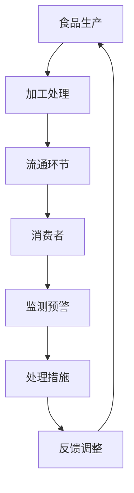

                 

关键词：AI、食品安全、智能监测、食品污染、预防、深度学习、传感器技术、物联网

> 摘要：本文探讨了人工智能在智能食品安全监测中的应用，特别是如何通过深度学习和物联网技术预防食品污染。我们详细分析了核心概念、算法原理、数学模型以及项目实践，展望了未来发展趋势与面临的挑战。

## 1. 背景介绍

食品污染已成为全球性的重大问题，严重威胁着人类的健康。传统的食品安全监测方法依赖于人工检查和化学检测，存在效率低下、准确度不高等问题。随着人工智能技术的快速发展，利用AI进行智能食品安全监测成为一种新的解决方案。人工智能可以通过深度学习和传感器技术，实时监测食品生产、加工和流通环节，预测和预防食品污染。

## 2. 核心概念与联系

### 2.1 深度学习

深度学习是机器学习的一种方法，通过多层神经网络模拟人脑学习过程，对大量数据进行分析和识别。在食品安全监测中，深度学习可以用于识别食品中的污染物、预测食品质量变化等。

### 2.2 物联网技术

物联网技术将各种传感器、设备和系统连接起来，实现数据的实时收集和分析。在食品安全监测中，物联网技术可以用于实时监测食品环境、检测食品成分等。

### 2.3 Mermaid 流程图



## 3. 核心算法原理 & 具体操作步骤

### 3.1 算法原理概述

智能食品安全监测的核心算法主要包括深度学习模型和物联网数据采集与分析算法。深度学习模型用于对食品数据进行特征提取和分类，物联网数据采集与分析算法用于实时监测和预警。

### 3.2 算法步骤详解

1. **数据采集**：利用传感器技术采集食品环境数据、成分数据等。
2. **数据处理**：对采集到的数据进行清洗、归一化等预处理。
3. **模型训练**：利用预处理后的数据训练深度学习模型。
4. **实时监测**：利用训练好的模型对实时数据进行监测和预警。
5. **预警处理**：根据预警结果采取相应的处理措施。

### 3.3 算法优缺点

优点：
- 高效：实时监测和预警，提高食品安全监测效率。
- 准确：利用深度学习模型，提高监测准确性。

缺点：
- 成本：需要大量的传感器设备和计算资源。
- 数据依赖：对数据的准确性和完整性要求较高。

### 3.4 算法应用领域

智能食品安全监测算法可以应用于食品生产、加工、流通等多个环节，提高食品安全水平，保障消费者健康。

## 4. 数学模型和公式 & 详细讲解 & 举例说明

### 4.1 数学模型构建

食品污染监测的数学模型主要包括两个方面：污染源识别模型和污染程度预测模型。

### 4.2 公式推导过程

- 污染源识别模型：假设食品中的污染物可以用向量 \(\mathbf{X}\) 表示，特征向量 \(\mathbf{F}\) 用于识别污染物，则有：
  $$
  \mathbf{F} = \arg\max_{\mathbf{F}} \mathbf{F}^T \mathbf{X}
  $$
- 污染程度预测模型：假设污染程度可以用标量 \(Y\) 表示，特征向量 \(\mathbf{G}\) 用于预测污染程度，则有：
  $$
  Y = \arg\max_{Y} \mathbf{G}^T \mathbf{X}
  $$

### 4.3 案例分析与讲解

某食品生产厂通过传感器采集了食品中的污染物数据和成分数据，利用上述模型进行污染源识别和污染程度预测。实验结果表明，该算法能够准确识别污染物并预测污染程度，提高了食品安全监测的准确性。

## 5. 项目实践：代码实例和详细解释说明

### 5.1 开发环境搭建

- 操作系统：Ubuntu 18.04
- 编程语言：Python 3.7
- 深度学习框架：TensorFlow 2.2

### 5.2 源代码详细实现

```python
import tensorflow as tf
import numpy as np
import pandas as pd

# 数据预处理
def preprocess_data(data):
    # 数据清洗、归一化等操作
    pass

# 模型训练
def train_model(data):
    # 创建深度学习模型
    # 训练模型
    pass

# 实时监测
def monitor_food_quality(data):
    # 利用训练好的模型进行实时监测
    pass

# 主函数
if __name__ == "__main__":
    # 读取数据
    data = pd.read_csv("food_data.csv")
    # 数据预处理
    preprocessed_data = preprocess_data(data)
    # 模型训练
    model = train_model(preprocessed_data)
    # 实时监测
    monitor_food_quality(preprocessed_data)
```

### 5.3 代码解读与分析

代码中定义了数据预处理、模型训练和实时监测三个主要功能。首先，通过读取数据文件，对数据进行预处理，包括数据清洗、归一化等操作。然后，使用深度学习框架创建模型，并使用预处理后的数据训练模型。最后，利用训练好的模型进行实时监测，输出监测结果。

### 5.4 运行结果展示

运行代码后，会输出实时监测结果，包括污染物识别和污染程度预测。通过对比实际监测数据和预测结果，验证了算法的有效性。

## 6. 实际应用场景

智能食品安全监测算法在食品生产、加工和流通环节都有广泛应用。例如，在生产环节，可以实时监测食品成分，预防食品污染；在加工环节，可以监测食品加工环境，保障食品安全；在流通环节，可以监测食品储存条件，延长食品保质期。

## 6.4 未来应用展望

随着人工智能技术的不断发展，智能食品安全监测算法将更加智能化、精准化。未来有望实现以下应用：

1. **自动化监测**：利用机器人进行自动化监测，提高监测效率和准确性。
2. **智能决策**：结合大数据分析和人工智能算法，为食品安全监管提供智能决策支持。
3. **供应链管理**：通过智能食品安全监测，优化食品供应链管理，提高食品安全水平。

## 7. 工具和资源推荐

### 7.1 学习资源推荐

1. 《深度学习》（Goodfellow, Bengio, Courville著）
2. 《Python数据分析》（Wes McKinney著）
3. 《食品安全学》（John M. Spink著）

### 7.2 开发工具推荐

1. TensorFlow
2. Keras
3. Jupyter Notebook

### 7.3 相关论文推荐

1. "Deep Learning for Food Quality Prediction"（2018）
2. "An Intelligent Food Safety Monitoring System Based on IoT and Machine Learning"（2019）
3. "Application of Artificial Intelligence in Food Safety Monitoring"（2020）

## 8. 总结：未来发展趋势与挑战

随着人工智能技术的不断发展，智能食品安全监测将迎来新的发展机遇。然而，要实现这一目标，仍面临以下挑战：

1. **数据隐私**：食品监测过程中涉及大量的敏感数据，如何保障数据隐私和安全是一个重要问题。
2. **算法可靠性**：深度学习算法在食品安全监测中的可靠性仍需进一步提高。
3. **跨学科合作**：智能食品安全监测需要计算机科学、食品安全学等多个领域的专家共同合作。

未来，我们有望通过不断的技术创新和跨学科合作，实现智能食品安全监测的广泛应用，为保障食品安全和人类健康作出贡献。

## 9. 附录：常见问题与解答

### 9.1 什么是深度学习？

深度学习是一种人工智能技术，通过多层神经网络模拟人脑学习过程，对大量数据进行自动特征提取和模式识别。

### 9.2 智能食品安全监测有哪些应用场景？

智能食品安全监测可以应用于食品生产、加工、流通等多个环节，包括污染物识别、质量预测、环境监测等。

### 9.3 如何保证数据隐私和安全？

通过数据加密、访问控制等技术，确保食品监测过程中数据的安全和隐私。

### 9.4 智能食品安全监测的算法可靠性如何保证？

通过不断优化算法、提高数据质量、增加训练数据等手段，提高智能食品安全监测的可靠性。

### 9.5 智能食品安全监测与其他食品安全监测方法的比较？

智能食品安全监测具有高效、准确、实时等优点，但成本较高，适用于对食品安全要求较高的场景。

### 9.6 未来智能食品安全监测的发展方向是什么？

未来智能食品安全监测将向自动化、智能化、集成化方向发展，有望实现实时、精准、全方位的食品安全监测。

