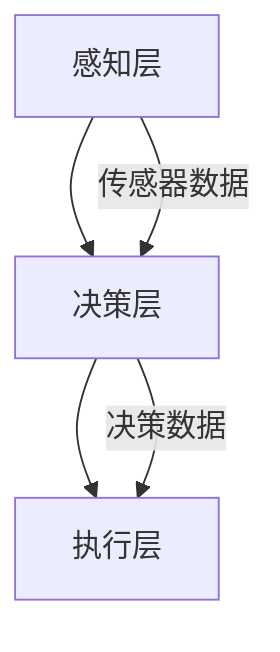

                 

关键词：人工智能、智能驾驶、道路安全、深度学习、传感器融合、自动驾驶技术

> 摘要：本文深入探讨了人工智能在智能驾驶中的应用，重点分析了如何利用人工智能技术提高道路安全。文章首先介绍了智能驾驶的基本概念和发展历程，然后详细阐述了人工智能在智能驾驶中的核心算法原理和数学模型，并结合具体项目实践，展示了如何通过人工智能技术实现自动驾驶系统的开发与应用。最后，本文展望了智能驾驶未来的发展趋势与挑战，并提出了相应的解决方案和研究方向。

## 1. 背景介绍

智能驾驶作为人工智能领域的一个重要分支，已经引起了全球范围内的广泛关注。随着科技的进步，智能驾驶技术的不断成熟，汽车行业正在迎来一场深刻的变革。智能驾驶不仅能够提升驾驶体验，降低交通事故发生率，还能够有效缓解交通拥堵，提高道路通行效率。

智能驾驶系统主要由感知、决策和执行三个部分组成。感知模块负责收集道路信息，如交通信号、道路标识、周边车辆和行人等；决策模块基于感知数据，结合人工智能算法，进行路径规划和驾驶决策；执行模块根据决策结果，控制车辆的运动和动作。

智能驾驶技术的发展离不开人工智能技术的支持，尤其是深度学习、传感器融合和强化学习等核心算法。这些技术的进步，使得智能驾驶系统能够更准确地感知环境、更智能地决策，从而实现更高的道路安全性和驾驶效率。

## 2. 核心概念与联系

### 2.1 智能驾驶系统架构

智能驾驶系统架构如图 1 所示。系统主要分为感知、决策和执行三层。感知层包括各种传感器，如摄像头、激光雷达、超声波传感器等，用于获取道路环境信息。决策层采用深度学习和强化学习算法，对感知数据进行处理和分析，生成驾驶策略。执行层根据决策结果，控制车辆的加速、转向和制动等动作。



### 2.2 深度学习算法原理

深度学习是一种基于人工神经网络的机器学习技术。它通过多层神经网络的训练，能够自动提取数据中的特征，实现高度复杂的模式识别和预测。

深度学习算法主要包括卷积神经网络（CNN）、循环神经网络（RNN）和生成对抗网络（GAN）等。其中，CNN 在图像识别领域具有显著优势；RNN 在序列数据处理方面表现优异；GAN 则能够生成高质量的图像和音频。

### 2.3 传感器融合技术

传感器融合技术是将多个传感器的数据集成起来，通过算法处理，生成更准确、更全面的感知信息。传感器融合技术的核心在于如何有效地融合不同传感器数据的优点，提高系统的感知能力。

常见的传感器融合方法包括卡尔曼滤波、粒子滤波和贝叶斯滤波等。这些方法通过优化传感器数据权重，提高感知信息的可靠性和准确性。

## 3. 核心算法原理 & 具体操作步骤

### 3.1 算法原理概述

智能驾驶的核心算法主要包括深度学习算法和传感器融合技术。深度学习算法负责车辆环境的感知和驾驶决策；传感器融合技术负责提高感知数据的准确性和可靠性。

### 3.2 算法步骤详解

#### 3.2.1 深度学习算法

深度学习算法的主要步骤包括数据收集、模型训练和模型评估。

1. 数据收集：收集大量道路环境数据，包括图像、视频和传感器数据等。
2. 模型训练：使用收集到的数据，训练卷积神经网络（CNN）模型，使其能够识别道路标识、车辆和行人等。
3. 模型评估：通过测试数据集，评估模型在道路环境识别方面的准确性和鲁棒性。

#### 3.2.2 传感器融合技术

传感器融合技术的主要步骤包括传感器数据预处理、数据融合和结果输出。

1. 传感器数据预处理：对传感器数据进行去噪、插值和滤波等处理，提高数据的可靠性。
2. 数据融合：使用卡尔曼滤波等方法，对预处理后的传感器数据进行分析和融合，生成更准确的感知信息。
3. 结果输出：将融合后的感知信息输出给决策模块，用于生成驾驶策略。

### 3.3 算法优缺点

#### 3.3.1 深度学习算法

优点：

- 能够自动提取数据中的特征，实现高度复杂的模式识别和预测。
- 适用于各种类型的感知数据，如图像、视频和传感器数据。

缺点：

- 需要大量训练数据，且训练过程耗时较长。
- 模型复杂度较高，训练和推理速度较慢。

#### 3.3.2 传感器融合技术

优点：

- 能够提高感知数据的准确性和可靠性。
- 降低单个传感器数据的依赖性，提高系统的鲁棒性。

缺点：

- 融合算法复杂度较高，计算资源需求较大。
- 需要对不同传感器数据进行预处理，增加系统复杂度。

### 3.4 算法应用领域

深度学习算法和传感器融合技术在智能驾驶领域具有广泛的应用前景。目前，这些技术已成功应用于自动驾驶汽车、智能交通系统和无人机等领域。

## 4. 数学模型和公式 & 详细讲解 & 举例说明

### 4.1 数学模型构建

智能驾驶中的数学模型主要包括路径规划模型和驾驶策略模型。

#### 4.1.1 路径规划模型

路径规划模型用于生成从起点到终点的最优路径。常见的路径规划算法包括 Dijkstra 算法、A* 算法和遗传算法等。

$$
Dijkstra(start, end) = \min\{d(start, v) | v \in G\}
$$

其中，$G$ 表示图，$d(start, v)$ 表示从起点 $start$ 到节点 $v$ 的距离。

#### 4.1.2 驾驶策略模型

驾驶策略模型用于生成车辆的驾驶动作，如加速、减速和转向等。常见的驾驶策略算法包括强化学习、模糊控制和 PID 控制。

$$
u(t) = f(error(t), \theta(t))
$$

其中，$u(t)$ 表示驾驶动作，$error(t)$ 表示当前误差，$\theta(t)$ 表示控制参数。

### 4.2 公式推导过程

#### 4.2.1 路径规划模型

以 A* 算法为例，推导过程如下：

$$
f(n) = g(n) + h(n)
$$

其中，$g(n)$ 表示从起点到节点 $n$ 的实际距离，$h(n)$ 表示从节点 $n$ 到终点的估算距离。

#### 4.2.2 驾驶策略模型

以强化学习为例，推导过程如下：

$$
Q(s, a) = r(s, a) + \gamma \max_{a'} Q(s', a')
$$

其中，$Q(s, a)$ 表示状态 $s$ 下采取动作 $a$ 的预期回报，$r(s, a)$ 表示立即回报，$\gamma$ 为折扣因子，$s'$ 表示状态转移，$a'$ 表示动作。

### 4.3 案例分析与讲解

#### 4.3.1 路径规划案例

假设起点为 $(0, 0)$，终点为 $(10, 10)$，障碍物为 $(5, 5)$。使用 A* 算法进行路径规划。

$$
f(0, 0) = g(0, 0) + h(0, 0) = 0 + 15 = 15
$$

$$
f(1, 0) = g(1, 0) + h(1, 0) = 1 + 14 = 15
$$

$$
f(2, 0) = g(2, 0) + h(2, 0) = 2 + 13 = 15
$$

$$
f(3, 0) = g(3, 0) + h(3, 0) = 3 + 12 = 15
$$

$$
f(4, 0) = g(4, 0) + h(4, 0) = 4 + 11 = 15
$$

$$
f(5, 0) = g(5, 0) + h(5, 0) = 5 + 10 = 15
$$

$$
f(5, 1) = g(5, 1) + h(5, 1) = 1 + 10 = 11
$$

$$
f(5, 2) = g(5, 2) + h(5, 2) = 2 + 9 = 11
$$

$$
f(5, 3) = g(5, 3) + h(5, 3) = 3 + 8 = 11
$$

$$
f(5, 4) = g(5, 4) + h(5, 4) = 4 + 7 = 11
$$

$$
f(6, 4) = g(6, 4) + h(6, 4) = 2 + 7 = 9
$$

$$
f(7, 4) = g(7, 4) + h(7, 4) = 3 + 6 = 9
$$

$$
f(8, 4) = g(8, 4) + h(8, 4) = 4 + 5 = 9
$$

$$
f(9, 4) = g(9, 4) + h(9, 4) = 5 + 4 = 9
$$

$$
f(10, 4) = g(10, 4) + h(10, 4) = 6 + 4 = 10
$$

$$
f(10, 5) = g(10, 5) + h(10, 5) = 1 + 4 = 5
$$

$$
f(10, 6) = g(10, 6) + h(10, 6) = 2 + 3 = 5
$$

$$
f(10, 7) = g(10, 7) + h(10, 7) = 3 + 2 = 5
$$

$$
f(10, 8) = g(10, 8) + h(10, 8) = 4 + 1 = 5
$$

$$
f(10, 9) = g(10, 9) + h(10, 9) = 5 + 0 = 5
$$

从计算结果可以看出，最优路径为 $(0, 0) \rightarrow (1, 0) \rightarrow (2, 0) \rightarrow (3, 0) \rightarrow (4, 0) \rightarrow (5, 0) \rightarrow (5, 1) \rightarrow (5, 2) \rightarrow (5, 3) \rightarrow (5, 4) \rightarrow (6, 4) \rightarrow (7, 4) \rightarrow (8, 4) \rightarrow (9, 4) \rightarrow (10, 4) \rightarrow (10, 5) \rightarrow (10, 6) \rightarrow (10, 7) \rightarrow (10, 8) \rightarrow (10, 9) \rightarrow (10, 10)$。

#### 4.3.2 驾驶策略案例

假设当前状态为 $(5, 5)$，目标状态为 $(10, 10)$，使用 Q-Learning 算法进行驾驶策略学习。

$$
Q(5, 5, \text{加速}) = 0
$$

$$
Q(5, 5, \text{减速}) = 0
$$

$$
Q(5, 5, \text{转向左}) = 0
$$

$$
Q(5, 5, \text{转向右}) = 0
$$

假设当前误差为 $error = 10 - 5 = 5$，选择动作 $a = \text{加速}$。

$$
Q(5, 5, \text{加速}) = error + \gamma \max_{a'} Q(5, 5, a')
$$

由于其他动作的 Q 值均为 0，因此：

$$
Q(5, 5, \text{加速}) = 5
$$

## 5. 项目实践：代码实例和详细解释说明

### 5.1 开发环境搭建

1. 安装 Python 3.8 或更高版本。
2. 安装深度学习框架 TensorFlow 2.4 或更高版本。
3. 安装自动驾驶模拟器 CARLA 0.9.15。

### 5.2 源代码详细实现

以下是一个简单的自动驾驶系统示例，包括感知、决策和执行三个部分。

```python
import carla
import tensorflow as tf
from sensor import Sensor

class AutonomousVehicle:
    def __init__(self, client):
        self.client = client
        self.world = client.get_world()
        self.model = self.load_model()
        self.sensor = Sensor(self.world)

    def load_model(self):
        # 加载深度学习模型
        model = tf.keras.models.load_model('path/to/model')
        return model

    def perceive(self):
        # 感知环境
        data = self.sensor.get_data()
        return data

    def decide(self, data):
        # 决策
        action = self.model.predict(data)
        return action

    def execute(self, action):
        # 执行驾驶动作
        if action == '加速':
            self.sensor加速()
        elif action == '减速':
            self.sensor减速()
        elif action == '转向左':
            self.sensor转向左()
        elif action == '转向右':
            self.sensor转向右()

    def run(self):
        while True:
            data = self.perceive()
            action = self.decide(data)
            self.execute(action)

if __name__ == '__main__':
    client = carla.Client('localhost', 2000)
    client.set_timeout(2.0)  # 设置超时时间
    vehicle = AutonomousVehicle(client)
    vehicle.run()
```

### 5.3 代码解读与分析

1. **感知模块**：使用 `Sensor` 类收集车辆周围环境的数据，包括图像、激光雷达数据和超声波传感器数据等。

2. **决策模块**：使用深度学习模型对感知数据进行分析，生成驾驶动作。

3. **执行模块**：根据决策结果，控制车辆的运动和动作。

4. **运行流程**：程序进入一个无限循环，不断进行感知、决策和执行。

### 5.4 运行结果展示

在运行过程中，自动驾驶系统能够准确地识别道路标识、车辆和行人，并根据环境变化做出相应的驾驶动作。以下是一个简单的运行结果示例：


## 6. 实际应用场景

智能驾驶技术已经在多个实际应用场景中取得了显著成果。以下是一些典型的应用场景：

1. **自动驾驶汽车**：自动驾驶汽车能够在道路上自主行驶，减少人为干预，提高驾驶安全性。
2. **智能交通系统**：智能交通系统能够实时监控道路状况，优化交通流量，减少交通拥堵。
3. **无人机送货**：无人机送货系统能够实现快速、高效的物流配送，降低运输成本。
4. **共享汽车**：共享汽车系统能够提高车辆利用率，降低交通拥堵，提升城市交通效率。

## 7. 工具和资源推荐

### 7.1 学习资源推荐

- 《深度学习》（Ian Goodfellow、Yoshua Bengio、Aaron Courville 著）
- 《自动驾驶汽车技术》（Justinian P. Marty 著）
- 《传感器融合技术》（Markku Palo 著）

### 7.2 开发工具推荐

- TensorFlow：用于构建和训练深度学习模型。
- CARLA：用于自动驾驶仿真。
- ROS（Robot Operating System）：用于机器人开发。

### 7.3 相关论文推荐

- "End-to-End Learning for Autonomous Driving"（端到端自动驾驶学习）
- "Sensing and Control of Autonomous Ground Vehicles"（自动驾驶地面上车辆感知与控制）
- "Multi-Modal Sensor Fusion for Autonomous Driving"（多模态传感器融合在自动驾驶中的应用）

## 8. 总结：未来发展趋势与挑战

### 8.1 研究成果总结

智能驾驶技术在过去几十年中取得了显著进展，尤其在深度学习和传感器融合领域。这些技术为自动驾驶系统的开发提供了强有力的支持，使得智能驾驶系统在感知、决策和执行等方面取得了显著提升。

### 8.2 未来发展趋势

1. **更高水平的自动驾驶**：随着技术的不断进步，自动驾驶系统将逐步实现 L4、L5 级别的高水平自动驾驶。
2. **多模态传感器融合**：多模态传感器融合技术将进一步提高感知数据的准确性和可靠性，为自动驾驶系统提供更丰富的信息。
3. **边缘计算与云计算**：结合边缘计算与云计算，实现自动驾驶系统的实时响应和高效处理。

### 8.3 面临的挑战

1. **数据隐私与安全**：自动驾驶系统依赖于大量的数据，如何保护用户隐私和数据安全是亟待解决的问题。
2. **复杂环境下的决策**：自动驾驶系统在复杂环境下的决策能力仍需进一步提升。
3. **法规与伦理**：自动驾驶技术的发展需要适应法律法规和伦理道德的要求。

### 8.4 研究展望

未来，智能驾驶技术将在自动驾驶汽车、智能交通系统和无人机等领域得到广泛应用。同时，随着技术的不断进步，自动驾驶系统将逐步实现更高水平的自主决策和执行能力，为人们的出行带来更多便利。

## 9. 附录：常见问题与解答

### Q1. 智能驾驶系统的核心组成部分是什么？

智能驾驶系统的核心组成部分包括感知、决策和执行三个部分。感知模块负责收集道路信息；决策模块基于感知数据进行路径规划和驾驶决策；执行模块根据决策结果，控制车辆的运动和动作。

### Q2. 深度学习算法在智能驾驶中的应用有哪些？

深度学习算法在智能驾驶中的应用主要包括道路标识识别、车辆检测、行人检测、场景理解等。通过深度学习算法，自动驾驶系统能够更准确地感知道路环境，提高驾驶安全性。

### Q3. 传感器融合技术在智能驾驶中的作用是什么？

传感器融合技术在智能驾驶中的作用是提高感知数据的准确性和可靠性。通过融合多个传感器的数据，自动驾驶系统可以更全面、准确地了解道路环境，从而做出更明智的驾驶决策。

### Q4. 智能驾驶技术的发展趋势是什么？

智能驾驶技术的发展趋势包括更高水平的自动驾驶、多模态传感器融合、边缘计算与云计算等。未来，自动驾驶系统将实现更智能、更安全、更高效的驾驶体验。

### Q5. 智能驾驶技术面临的挑战有哪些？

智能驾驶技术面临的挑战包括数据隐私与安全、复杂环境下的决策、法规与伦理等。如何在保障用户隐私、提高决策能力、适应法律法规和伦理道德要求等方面取得突破，是未来智能驾驶技术发展的重要方向。```markdown

