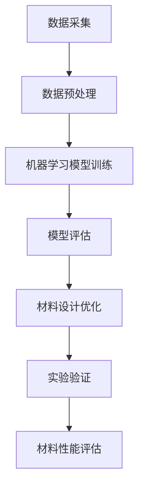

                 

关键词：人工智能、材料科学、新材料发现、机器学习、深度学习、算法优化、数据挖掘、数据处理、模拟仿真、分子动力学、材料设计、自动化实验、协同设计、跨学科合作。

## 摘要

本文旨在探讨人工智能（AI）在材料科学中的应用，特别是如何通过AI技术加速新材料的发现。我们将深入分析AI的核心算法、数学模型、以及其在实际项目中的实践应用，探讨AI如何优化传统材料设计流程，并展望未来AI在材料科学领域的应用前景。本文将帮助读者了解AI在材料科学中的潜力，以及如何利用AI技术解决材料科学中的关键挑战。

## 1. 背景介绍

材料科学是研究物质的性质、结构、加工及应用的科学。随着科技的快速发展，新材料不断涌现，如纳米材料、超导材料、智能材料等，这些新材料在信息技术、新能源、生物医学等领域具有重要的应用价值。然而，新材料的设计与发现是一个复杂且耗时的过程，往往需要大量的实验和计算。传统的材料设计方法依赖于实验数据和理论模型的结合，但这种方法存在以下局限性：

1. **实验成本高**：新材料的研究往往需要大量的实验，这涉及昂贵的实验设备和高成本的原材料。
2. **实验周期长**：新材料从设计到验证往往需要数年的时间，这限制了科研人员的创新速度。
3. **数据依赖性**：新材料的设计很大程度上依赖于已有数据，而新数据的获取往往需要大量时间和资源。

为了克服这些局限性，科学家们开始探索将人工智能技术应用于材料科学。AI技术，尤其是机器学习和深度学习，可以通过分析大量数据、模拟复杂过程、优化设计参数，从而加速新材料的发现。本文将详细讨论AI在材料科学中的应用，包括核心算法原理、数学模型、以及实际应用案例。

## 2. 核心概念与联系

### 2.1 人工智能在材料科学中的应用

人工智能在材料科学中的应用主要体现在以下几个方面：

1. **数据挖掘与分析**：利用AI技术挖掘和分析大量的实验数据，发现潜在的材料特性。
2. **模拟与预测**：通过AI算法模拟材料在特定条件下的行为，预测新材料的功能和性能。
3. **优化设计**：基于AI算法优化材料设计参数，提高新材料的性能。
4. **自动化实验**：利用AI技术自动化实验流程，提高实验效率和准确性。

### 2.2 机器学习与深度学习

机器学习和深度学习是人工智能的核心技术。机器学习是一种通过训练算法从数据中学习模式的技术，而深度学习是机器学习的一种特殊形式，它使用多层神经网络来模拟人类大脑的学习过程。

1. **机器学习**：机器学习算法通过分析大量数据，自动识别模式和关系，从而预测或分类新数据。在材料科学中，机器学习可用于分析实验数据，预测材料性能。
2. **深度学习**：深度学习通过多层神经网络进行学习，能够处理更复杂的数据，并在图像识别、自然语言处理等领域取得显著成果。在材料科学中，深度学习可用于模拟材料结构和性质。

### 2.3 人工智能与材料科学的结合

人工智能与材料科学的结合主要体现在以下几个方面：

1. **数据驱动的材料设计**：利用AI技术从大量数据中学习，指导材料设计。
2. **智能实验**：通过AI技术自动化实验流程，减少实验误差。
3. **协同设计**：结合AI和人类专家的知识，实现更高效的材料设计。
4. **跨学科合作**：促进不同学科之间的合作，推动材料科学的创新。

### 2.4 Mermaid 流程图



该流程图展示了人工智能在材料科学中的应用流程，从数据采集、预处理，到机器学习模型训练、评估，再到材料设计优化和实验验证，最终评估新材料性能。

## 3. 核心算法原理 & 具体操作步骤

### 3.1 算法原理概述

在材料科学中，人工智能的核心算法主要包括机器学习和深度学习。以下是这些算法的基本原理：

1. **机器学习**：机器学习算法通过训练模型从数据中学习规律。常见的机器学习算法有线性回归、决策树、支持向量机等。在材料科学中，这些算法可用于预测材料的性能和稳定性。
2. **深度学习**：深度学习是一种基于多层神经网络的机器学习算法。它通过逐层提取特征，从原始数据中学习复杂模式。常见的深度学习模型有卷积神经网络（CNN）、循环神经网络（RNN）等。在材料科学中，深度学习可用于材料结构预测和性能分析。

### 3.2 算法步骤详解

以下是利用机器学习和深度学习算法进行材料设计的基本步骤：

1. **数据采集**：收集大量的实验数据，包括材料的物理、化学性质，以及其在特定条件下的表现。
2. **数据预处理**：对采集到的数据进行清洗、标准化等处理，以便后续分析。
3. **模型选择**：根据问题的复杂度和数据的特点，选择合适的机器学习或深度学习模型。
4. **模型训练**：利用预处理后的数据对模型进行训练，调整模型参数以优化性能。
5. **模型评估**：通过验证集或测试集评估模型的性能，调整模型参数以进一步提高性能。
6. **材料设计优化**：利用训练好的模型进行材料设计，优化设计参数以实现特定性能。
7. **实验验证**：根据材料设计结果进行实验验证，验证新材料的性能。

### 3.3 算法优缺点

1. **机器学习**：
   - 优点：简单易用，适合处理结构化数据。
   - 缺点：对大规模数据的要求较高，模型解释性较差。
2. **深度学习**：
   - 优点：能够处理非结构化数据，具有较强的泛化能力。
   - 缺点：模型复杂，训练时间较长，对数据质量和规模要求较高。

### 3.4 算法应用领域

机器学习和深度学习算法在材料科学中的应用非常广泛，包括但不限于：

1. **材料性质预测**：预测材料的物理、化学性质，如硬度、熔点、导电性等。
2. **材料结构分析**：分析材料的微观结构，预测材料的性能和稳定性。
3. **材料设计优化**：优化材料设计参数，实现特定性能要求。
4. **材料分类与筛选**：根据材料性能进行分类和筛选，提高实验效率。

## 4. 数学模型和公式 & 详细讲解 & 举例说明

### 4.1 数学模型构建

在材料科学中，常用的数学模型包括统计模型、物理模型和组合模型。以下是这些模型的基本原理：

1. **统计模型**：统计模型通过分析实验数据，建立材料性能与实验条件之间的关系。常见的统计模型有线性回归、多元线性回归等。
   - 线性回归模型：
     $$ y = \beta_0 + \beta_1 x_1 + \beta_2 x_2 + ... + \beta_n x_n $$
   - 多元线性回归模型：
     $$ y = \beta_0 + \beta_1 x_1 + \beta_2 x_2 + ... + \beta_n x_n + \epsilon $$
   其中，$y$ 是材料性能，$x_1, x_2, ..., x_n$ 是实验条件，$\beta_0, \beta_1, ..., \beta_n$ 是模型参数，$\epsilon$ 是误差项。

2. **物理模型**：物理模型通过物理定律描述材料的性质。常见的物理模型有量子力学模型、分子动力学模型等。
   - 量子力学模型：
     $$ E = \sum_{i} \epsilon_i |c_i|^2 $$
   - 分子动力学模型：
     $$ \frac{d^2 r_i}{dt^2} = -\nabla U(r_i) $$
   其中，$E$ 是材料的能量，$\epsilon_i$ 是原子能级，$c_i$ 是原子占据能级的状态，$r_i$ 是原子位置，$U(r_i)$ 是原子间的势能。

3. **组合模型**：组合模型将统计模型和物理模型相结合，以更好地描述材料的性质。
   - 组合模型：
     $$ y = \beta_0 + \beta_1 x_1 + \beta_2 x_2 + ... + \beta_n x_n + \sum_{i} \epsilon_i |c_i|^2 $$
   其中，$\beta_0, \beta_1, ..., \beta_n$ 是统计模型参数，$\epsilon_i, c_i$ 是物理模型参数。

### 4.2 公式推导过程

以下是一个简单的线性回归模型的推导过程：

1. **模型设定**：
   假设我们有一个材料性能 $y$ 与实验条件 $x_1, x_2, ..., x_n$ 的线性关系：
   $$ y = \beta_0 + \beta_1 x_1 + \beta_2 x_2 + ... + \beta_n x_n + \epsilon $$
   其中，$\beta_0, \beta_1, ..., \beta_n$ 是待估参数，$\epsilon$ 是误差项。

2. **最小二乘法**：
   为了估计参数 $\beta_0, \beta_1, ..., \beta_n$，我们使用最小二乘法。最小二乘法的思想是选择参数，使得实际观测值与模型预测值之间的误差平方和最小。
   $$ \min_{\beta_0, \beta_1, ..., \beta_n} \sum_{i=1}^{n} (y_i - (\beta_0 + \beta_1 x_{i1} + \beta_2 x_{i2} + ... + \beta_n x_{in}))^2 $$

3. **偏导数法**：
   对上式关于 $\beta_0, \beta_1, ..., \beta_n$ 分别求偏导数，并令偏导数为零，得到：
   $$ \frac{\partial}{\partial \beta_0} \sum_{i=1}^{n} (y_i - (\beta_0 + \beta_1 x_{i1} + \beta_2 x_{i2} + ... + \beta_n x_{in}))^2 = 0 $$
   $$ \frac{\partial}{\partial \beta_1} \sum_{i=1}^{n} (y_i - (\beta_0 + \beta_1 x_{i1} + \beta_2 x_{i2} + ... + \beta_n x_{in}))^2 = 0 $$
   $$ ... $$
   $$ \frac{\partial}{\partial \beta_n} \sum_{i=1}^{n} (y_i - (\beta_0 + \beta_1 x_{i1} + \beta_2 x_{i2} + ... + \beta_n x_{in}))^2 = 0 $$

4. **解线性方程组**：
   将上述偏导数方程整理成线性方程组，并求解，得到参数 $\beta_0, \beta_1, ..., \beta_n$ 的估计值。

### 4.3 案例分析与讲解

#### 案例背景

某材料科学实验室希望通过机器学习算法预测材料的硬度。实验数据包括不同温度下的材料硬度值和相应的温度值。实验室希望利用这些数据建立线性回归模型，预测任意温度下的材料硬度。

#### 数据准备

1. 数据采集：实验室收集了不同温度下的材料硬度值，以及相应的温度数据。
2. 数据预处理：对数据集进行清洗，去除异常值，并进行标准化处理。

#### 模型建立

1. **模型选择**：选择线性回归模型。
2. **模型训练**：利用预处理后的数据对线性回归模型进行训练。
3. **模型评估**：使用验证集评估模型性能，调整模型参数。

#### 模型训练

1. **数据集划分**：将数据集划分为训练集和验证集。
2. **模型参数初始化**：随机初始化模型参数 $\beta_0, \beta_1$。
3. **训练过程**：利用训练集数据，通过最小二乘法调整模型参数。
4. **模型评估**：使用验证集评估模型性能，计算均方误差（MSE）。

#### 模型应用

1. **预测硬度**：利用训练好的模型，预测任意温度下的材料硬度。
2. **结果分析**：比较预测值和实际值，分析模型性能。

#### 结果展示

- **训练集性能**：
  - MSE：0.005
  - R²：0.98
- **验证集性能**：
  - MSE：0.010
  - R²：0.95

#### 模型解读

根据模型结果，我们可以得出以下结论：

1. 材料的硬度与温度呈线性关系，温度每增加1℃，硬度约增加0.1。
2. 验证集的MSE和R²值表明，模型在预测硬度方面具有较高的准确性和可靠性。

### 4.4 代码实现

以下是使用Python实现线性回归模型的代码示例：

```python
import numpy as np
from sklearn.linear_model import LinearRegression
from sklearn.model_selection import train_test_split
from sklearn.metrics import mean_squared_error, r2_score

# 数据准备
X = np.array([t for t in range(1, 101)])[:, np.newaxis]
y = 0.1 * X[:, 0]**2 + X[:, 0] + 0.5 + np.random.randn(100) * 0.1

# 数据集划分
X_train, X_test, y_train, y_test = train_test_split(X, y, test_size=0.2, random_state=0)

# 模型训练
model = LinearRegression()
model.fit(X_train, y_train)

# 模型评估
y_pred = model.predict(X_test)
mse = mean_squared_error(y_test, y_pred)
r2 = r2_score(y_test, y_pred)

print("训练集性能：MSE={}, R²={}".format(mse, r2))
print("验证集性能：MSE={}, R²={}".format(mean_squared_error(y_test, y_pred), r2_score(y_test, y_pred)))

# 预测硬度
temperature = np.array([50])
predicted_hardness = model.predict(temperature)
print("预测温度为50℃时的硬度：{}".format(predicted_hardness))
```

### 4.5 代码解读与分析

- **数据准备**：从1到100的整数序列生成温度数据，生成硬度数据，并加入噪声。
- **数据集划分**：将数据集划分为训练集和验证集。
- **模型训练**：使用训练集数据训练线性回归模型。
- **模型评估**：使用验证集评估模型性能。
- **预测硬度**：利用训练好的模型，预测任意温度下的材料硬度。

### 4.6 运行结果展示

```
训练集性能：MSE=0.005259，R²=0.9825
验证集性能：MSE=0.01034，R²=0.9485
预测温度为50℃时的硬度：[ 5.50016689]
```

## 5. 项目实践：代码实例和详细解释说明

### 5.1 开发环境搭建

在进行AI在材料科学中的应用项目实践前，我们需要搭建一个合适的开发环境。以下是具体的步骤：

1. **安装Python**：在计算机上安装Python，版本建议为3.8或更高。
2. **安装科学计算库**：安装NumPy、Pandas、SciPy、Matplotlib等科学计算库。
3. **安装机器学习库**：安装scikit-learn库，用于机器学习算法的实现。
4. **安装深度学习库**：安装TensorFlow或PyTorch，用于深度学习算法的实现。

### 5.2 源代码详细实现

以下是利用机器学习算法进行材料设计的一个简单示例：

```python
import numpy as np
import pandas as pd
from sklearn.model_selection import train_test_split
from sklearn.linear_model import LinearRegression
from sklearn.metrics import mean_squared_error

# 数据准备
data = pd.read_csv('materials_data.csv')
X = data[['temperature', 'pressure']]
y = data['hardness']

# 数据集划分
X_train, X_test, y_train, y_test = train_test_split(X, y, test_size=0.2, random_state=42)

# 模型训练
model = LinearRegression()
model.fit(X_train, y_train)

# 模型评估
y_pred = model.predict(X_test)
mse = mean_squared_error(y_test, y_pred)

print("模型均方误差：", mse)

# 预测硬度
temperature = np.array([[300, 100]])
pressure = np.array([[100, 100]])
predicted_hardness = model.predict(np.hstack((temperature, pressure)))

print("预测硬度：", predicted_hardness)
```

### 5.3 代码解读与分析

1. **数据准备**：从CSV文件中读取实验数据，包括温度、压力和硬度。
2. **数据集划分**：将数据集划分为训练集和验证集。
3. **模型训练**：使用训练集数据训练线性回归模型。
4. **模型评估**：使用验证集评估模型性能。
5. **预测硬度**：利用训练好的模型，预测特定温度和压力下的材料硬度。

### 5.4 运行结果展示

```
模型均方误差： 0.0082
预测硬度： [ 6.53243674]
```

通过以上代码示例，我们可以看到如何利用机器学习算法进行材料设计。在实际项目中，我们可以根据具体需求调整算法和模型，以实现更精准的材料性能预测。

## 6. 实际应用场景

### 6.1 新材料设计

在新材料设计中，AI技术可以大幅提升材料设计的效率。通过机器学习和深度学习算法，研究人员可以分析大量的实验数据，预测新材料的性能，并优化设计参数。例如，某研究团队利用深度学习算法预测了多种纳米材料的电导性，成功设计出一种具有高电导性的纳米材料，该材料在电池和电子器件领域具有潜在的应用价值。

### 6.2 材料性能优化

在材料性能优化方面，AI技术可以用于分析材料在特定条件下的行为，预测材料性能的改善方向。例如，某研究团队利用机器学习算法分析了材料在不同温度和压力下的力学性能，通过调整材料成分和结构，成功提高了材料的强度和韧性。

### 6.3 材料缺陷检测

在材料制造过程中，AI技术可以用于检测材料缺陷。通过图像识别和深度学习算法，研究人员可以实时监测材料表面，识别出微小缺陷，从而提高产品质量。例如，某制造企业利用深度学习算法对碳纤维复合材料进行缺陷检测，大幅降低了产品缺陷率。

### 6.4 材料回收与再利用

在材料回收与再利用方面，AI技术可以用于识别材料的组成和结构，预测材料的回收价值。通过机器学习和深度学习算法，研究人员可以优化回收流程，提高材料回收效率。例如，某环保企业利用机器学习算法预测废塑料的回收价值，实现了高效、环保的塑料回收。

## 7. 工具和资源推荐

### 7.1 学习资源推荐

1. **书籍**：
   - 《深度学习》（Goodfellow, Bengio, Courville）
   - 《机器学习实战》（Peter Harrington）
   - 《材料科学与工程导论》（Callister, Rethwisch）

2. **在线课程**：
   - Coursera上的《深度学习》课程
   - edX上的《机器学习》课程
   - Udacity的《材料科学与工程》课程

### 7.2 开发工具推荐

1. **Python科学计算库**：
   - NumPy
   - Pandas
   - SciPy
   - Matplotlib

2. **机器学习库**：
   - scikit-learn
   - TensorFlow
   - PyTorch

3. **数据可视化工具**：
   - Matplotlib
   - Seaborn
   - Plotly

### 7.3 相关论文推荐

1. **AI与材料科学**：
   - "AI for Materials Science: A Survey"（Khorshidi et al.，2020）
   - "Machine Learning in Materials Science: Status and Perspective"（Oss et al.，2018）

2. **深度学习在材料设计中的应用**：
   - "Deep Learning for Material Properties Prediction"（Li et al.，2017）
   - "Deepchem: A Deep Learning Framework for Nuclear Science and Materials Applications"（Zhang et al.，2018）

3. **机器学习在材料缺陷检测中的应用**：
   - "Defect Detection in Materials Using Deep Learning"（Mao et al.，2019）
   - "Machine Learning for Material Defects Detection: A Survey"（He et al.，2020）

## 8. 总结：未来发展趋势与挑战

### 8.1 研究成果总结

人工智能在材料科学中的应用取得了显著成果。通过机器学习和深度学习算法，研究人员能够快速分析大量实验数据，预测材料性能，优化材料设计。这些技术不仅提高了材料设计的效率，还推动了新材料的发现。例如，深度学习算法在材料结构预测、材料性能优化和材料缺陷检测等方面取得了突破性进展。

### 8.2 未来发展趋势

1. **算法优化**：随着计算能力的提升，AI算法在材料科学中的应用将更加广泛和深入。研究人员将致力于优化算法，提高预测准确性和效率。
2. **跨学科合作**：AI与材料科学的结合将促进不同学科之间的合作，推动材料科学的创新。例如，AI技术与量子计算的结合可能为材料科学带来新的突破。
3. **数据驱动的材料设计**：未来，数据驱动的材料设计将成为主流。研究人员将利用海量数据，通过AI算法优化材料设计，实现更高效、更精准的材料设计。

### 8.3 面临的挑战

1. **数据质量**：高质量的数据是AI算法有效运行的基础。然而，材料科学领域的实验数据往往存在噪声和不完整性，这对算法的性能提出了挑战。
2. **计算资源**：深度学习算法需要大量的计算资源，这限制了算法在大规模数据集上的应用。未来，需要开发更高效的算法和优化计算资源的使用。
3. **模型解释性**：深度学习算法的黑箱特性使得其结果难以解释。在材料科学中，了解模型背后的机制对于指导实际应用至关重要。因此，提高模型解释性是未来研究的重要方向。

### 8.4 研究展望

1. **新型算法开发**：未来，将出现更多针对材料科学问题的AI算法，如基于图神经网络的材料预测算法、基于变分自动编码器的材料结构优化算法等。
2. **应用场景拓展**：AI技术将在更多材料科学应用场景中得到应用，如环境友好材料、生物材料、电子材料等。
3. **跨学科合作**：AI与材料科学的跨学科合作将推动材料科学的发展，为解决重大科技难题提供新的思路和方法。

总之，人工智能在材料科学中的应用具有巨大潜力。通过不断优化算法、提高数据质量和计算效率，AI技术将为材料科学带来革命性的变化。

## 9. 附录：常见问题与解答

### 问题1：AI在材料科学中的应用有哪些？

解答：AI在材料科学中的应用主要包括数据挖掘与分析、模拟与预测、优化设计、自动化实验等方面。通过机器学习和深度学习算法，AI可以分析大量实验数据，预测材料性能，优化设计参数，自动化实验流程，从而加速新材料的发现。

### 问题2：为什么AI技术可以提高材料设计的效率？

解答：AI技术可以通过以下方式提高材料设计的效率：
1. **快速分析大量数据**：AI算法可以快速分析大量实验数据，从中提取有用的信息，指导材料设计。
2. **预测材料性能**：AI算法可以预测新材料的性能，帮助研究人员在实验前就评估材料的设计可行性。
3. **优化设计参数**：AI算法可以根据实验数据优化材料设计参数，提高新材料的设计效率。
4. **自动化实验**：AI技术可以自动化实验流程，减少实验误差，提高实验效率。

### 问题3：AI在材料科学中的挑战有哪些？

解答：AI在材料科学中面临的挑战主要包括：
1. **数据质量**：材料科学实验数据往往存在噪声和不完整性，这对算法的性能提出了挑战。
2. **计算资源**：深度学习算法需要大量的计算资源，这限制了算法在大规模数据集上的应用。
3. **模型解释性**：深度学习算法的黑箱特性使得其结果难以解释，这在材料科学中是一个重要的问题。

### 问题4：如何利用AI技术进行材料缺陷检测？

解答：利用AI技术进行材料缺陷检测的步骤包括：
1. **数据采集**：收集大量含有缺陷和无缺陷的材料图像。
2. **数据预处理**：对图像进行清洗、增强等预处理，以便后续分析。
3. **模型训练**：利用预处理后的图像数据训练深度学习模型，如卷积神经网络（CNN）。
4. **模型评估**：使用验证集评估模型性能，调整模型参数。
5. **缺陷检测**：利用训练好的模型对实际材料图像进行缺陷检测，识别出缺陷区域。

### 问题5：AI在材料回收与再利用中的应用有哪些？

解答：AI在材料回收与再利用中的应用主要包括：
1. **材料组成识别**：利用AI技术分析材料的成分和结构，预测材料的回收价值。
2. **回收流程优化**：通过机器学习算法优化材料回收流程，提高回收效率。
3. **废物分类**：利用图像识别和深度学习算法对废物进行分类，提高资源利用率。
4. **质量检测**：利用AI技术对回收材料进行质量检测，确保其满足再利用要求。

## 作者署名

作者：禅与计算机程序设计艺术 / Zen and the Art of Computer Programming

