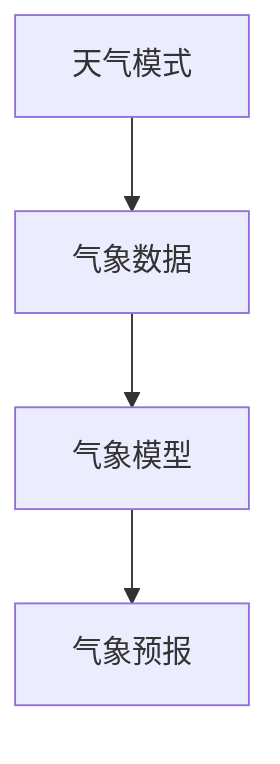

                 

关键词：人工智能，气象预报，预测准确性，深度学习，大数据分析，模型优化

> 摘要：本文探讨了人工智能技术在气象预报中的应用，通过分析核心概念和算法原理，阐述了如何利用深度学习和大数据分析提高气象预报的准确性。文章还通过实际项目实例和代码解读，展示了AI技术在气象预报领域的应用效果，并对未来的发展趋势和挑战进行了展望。

## 1. 背景介绍

气象预报对于人们的生活、农业生产、航空交通等具有极其重要的作用。然而，传统的气象预报方法存在许多局限性，预测准确性较低，特别是在极端天气事件中表现尤为明显。随着人工智能技术的发展，深度学习和大数据分析等先进技术逐渐应用于气象预报领域，为提高预测准确性提供了新的思路和方法。

本文将从以下三个方面探讨AI在气象预报中的应用：

1. 核心概念与联系
2. 核心算法原理与具体操作步骤
3. 数学模型和公式的构建与推导

通过以上探讨，我们希望能够为气象预报领域的研究者和实践者提供有价值的参考和启示。

## 2. 核心概念与联系

在气象预报中，核心概念包括天气模式、气象数据、气象模型等。天气模式描述了大气环境的时空分布特征，是气象预报的重要依据。气象数据包括温度、湿度、气压、风速等，是构建气象模型的基础。气象模型则是根据天气模式和气象数据，对未来的天气情况进行预测的数学工具。

为了更好地理解这些概念之间的联系，我们可以使用Mermaid流程图来展示它们之间的关系：



在这个流程图中，天气模式通过气象数据输入到气象模型中，气象模型根据这些输入生成气象预报结果。这种联系体现了气象预报过程中不同概念之间的相互作用。

### 2.1 气象数据

气象数据是气象预报的核心资源，其来源包括地面观测站、卫星遥感、雷达探测等。这些数据经过处理和整合，形成了大规模的气象数据集。气象数据的质量和完整性对气象预报的准确性有着直接的影响。

### 2.2 气象模型

气象模型是气象预报的数学工具，用于描述大气环境的物理和动力过程。常见的气象模型包括统计模型、物理模型和混合模型。统计模型主要依赖于历史数据的统计分析，物理模型则通过物理原理描述大气过程的演变，混合模型则是统计模型和物理模型的结合。

### 2.3 气象预报

气象预报是根据气象模型生成的预测结果，用于指导实际应用。传统的气象预报方法依赖于经验规则和简化的物理模型，而AI技术的引入使得气象预报方法更加精细和准确。

## 3. 核心算法原理与具体操作步骤

在AI技术中，深度学习和大数据分析是提高气象预报准确性的关键。本节将分别介绍这两种算法的原理和具体操作步骤。

### 3.1 深度学习算法原理

深度学习算法通过多层神经网络模拟人类大脑的思维方式，能够自动从大量数据中学习特征和模式。在气象预报中，深度学习算法主要用于特征提取和预测建模。常见的深度学习算法包括卷积神经网络（CNN）、循环神经网络（RNN）和长短时记忆网络（LSTM）。

#### 3.1.1 卷积神经网络（CNN）

卷积神经网络是一种能够自动提取图像特征的网络结构，广泛应用于图像处理领域。在气象预报中，CNN可以用于提取气象数据的时空特征，如风速、温度等。

#### 3.1.2 循环神经网络（RNN）

循环神经网络是一种能够处理序列数据的网络结构，广泛应用于语音识别、自然语言处理等领域。在气象预报中，RNN可以用于处理时间序列数据，如气温、湿度等。

#### 3.1.3 长短时记忆网络（LSTM）

长短时记忆网络是一种改进的RNN结构，能够解决长序列依赖问题。在气象预报中，LSTM可以用于处理长时间尺度上的气象数据，如季节性变化。

### 3.2 大数据分析算法原理

大数据分析技术主要用于处理和分析大规模数据集，包括数据预处理、特征工程、模型训练和评估等。在气象预报中，大数据分析技术可以用于优化气象模型的参数，提高预测准确性。

#### 3.2.1 数据预处理

数据预处理是大数据分析的基础，包括数据清洗、归一化和特征提取等步骤。在气象预报中，数据预处理可以去除噪声、填补缺失值和调整数据尺度，以提高模型的输入质量。

#### 3.2.2 特征工程

特征工程是大数据分析的重要环节，通过对数据进行变换和组合，提取出对预测任务有用的特征。在气象预报中，特征工程可以提取出时间序列、空间分布和相关性等特征。

#### 3.2.3 模型训练和评估

模型训练和评估是大数据分析的核心，通过训练和评估模型，确定模型的性能和稳定性。在气象预报中，模型训练和评估可以用于优化模型的参数，提高预测准确性。

### 3.3 具体操作步骤

以下是使用深度学习和大数据分析技术提高气象预报准确性的具体操作步骤：

#### 3.3.1 数据收集

收集历史气象数据，包括温度、湿度、风速、气压等。数据来源可以包括地面观测站、卫星遥感、雷达探测等。

#### 3.3.2 数据预处理

对收集到的气象数据进行清洗、归一化和特征提取，以提高模型的输入质量。

#### 3.3.3 特征工程

对预处理后的数据进行分析，提取出对预测任务有用的特征，如时间序列、空间分布和相关性等。

#### 3.3.4 模型选择

根据气象预报的需求，选择合适的深度学习算法和大数据分析技术。例如，可以使用LSTM进行时间序列预测，使用CNN提取时空特征。

#### 3.3.5 模型训练

使用预处理后的数据训练模型，通过迭代优化模型的参数，提高预测准确性。

#### 3.3.6 模型评估

使用验证数据集对训练好的模型进行评估，确定模型的性能和稳定性。

#### 3.3.7 模型优化

根据评估结果，对模型进行优化，如调整参数、增加层数等，以提高预测准确性。

## 4. 数学模型和公式

在深度学习和大数据分析技术中，数学模型和公式起着至关重要的作用。本节将介绍气象预报中的数学模型和公式，包括模型构建、公式推导和案例分析与讲解。

### 4.1 数学模型构建

在气象预报中，常用的数学模型包括时间序列模型、空间分布模型和相关分析模型。以下是这些模型的简要介绍：

#### 4.1.1 时间序列模型

时间序列模型用于分析时间序列数据，如气温、湿度等。常见的模型包括自回归模型（AR）、移动平均模型（MA）和自回归移动平均模型（ARMA）。

$$
\text{AR}(p) = \sum_{i=1}^{p} \phi_i X_{t-i} + \theta_t
$$

$$
\text{MA}(q) = \sum_{i=1}^{q} \theta_i e_{t-i} + \phi_t
$$

$$
\text{ARMA}(p, q) = \sum_{i=1}^{p} \phi_i X_{t-i} + \sum_{j=1}^{q} \theta_j e_{t-j} + \phi_t
$$

其中，$X_t$表示时间序列数据，$\phi_i$和$\theta_i$分别表示自回归系数和移动平均系数。

#### 4.1.2 空间分布模型

空间分布模型用于分析气象数据的空间分布特征，如温度分布、风速分布等。常见的模型包括正态分布、高斯分布和克里金插值模型。

$$
f(x, y) = \frac{1}{2\pi\sigma^2} e^{-\frac{(x-\mu_x)^2 + (y-\mu_y)^2}{2\sigma^2}}
$$

其中，$x$和$y$表示空间坐标，$\mu_x$和$\mu_y$表示均值，$\sigma^2$表示方差。

#### 4.1.3 相关分析模型

相关分析模型用于分析气象数据之间的相关性，如温度和湿度、风速和气压等。常见的模型包括皮尔逊相关系数、斯皮尔曼相关系数和肯德尔相关系数。

$$
\rho_{XY} = \frac{\sum_{i=1}^{n}(X_i - \bar{X})(Y_i - \bar{Y})}{\sqrt{\sum_{i=1}^{n}(X_i - \bar{X})^2 \sum_{i=1}^{n}(Y_i - \bar{Y})^2}}
$$

其中，$X_i$和$Y_i$分别表示第$i$个观测值，$\bar{X}$和$\bar{Y}$分别表示平均值。

### 4.2 公式推导过程

以下是时间序列模型（ARMA）的公式推导过程：

假设时间序列$X_t$满足自回归移动平均模型（ARMA），即：

$$
X_t = \sum_{i=1}^{p} \phi_i X_{t-i} + \sum_{j=1}^{q} \theta_j e_{t-j} + \varepsilon_t
$$

其中，$\phi_i$和$\theta_j$分别为自回归系数和移动平均系数，$e_t$为白噪声序列。

首先，将上式两边乘以$1 - \phi_1 z^{-1}$，得到：

$$
(1 - \phi_1 z^{-1})X_t = (1 - \phi_1 z^{-1})\sum_{i=1}^{p} \phi_i X_{t-i} + (1 - \phi_1 z^{-1})\sum_{j=1}^{q} \theta_j e_{t-j} + (1 - \phi_1 z^{-1})\varepsilon_t
$$

然后，利用差分算子$D$（即$Dz = 1 - z^{-1}$）将上式转化为差分形式：

$$
DX_t = \sum_{i=1}^{p} \phi_i DX_{t-i} + \sum_{j=1}^{q} \theta_j De_{t-j} + D\varepsilon_t
$$

其中，$D^2X_t = DX_{t-1}$，$D^kX_t = 0$（$k > 2$）。

接下来，对上式两边进行求和，得到：

$$
DX_t = \sum_{i=1}^{p} \phi_i D^kX_{t-k} + \sum_{j=1}^{q} \theta_j De_{t-j} + D^k \varepsilon_t
$$

最后，令$k \to \infty$，得到：

$$
DX_t = \sum_{i=1}^{p} \phi_i X_{t-i} + \sum_{j=1}^{q} \theta_j e_{t-j} + \varepsilon_t
$$

这就是ARMA模型的差分形式。

### 4.3 案例分析与讲解

以下是一个时间序列预测的案例，我们使用ARMA模型对气温进行预测。

#### 4.3.1 数据收集

收集某地过去一年的日平均气温数据，共365个数据点。

#### 4.3.2 数据预处理

对气温数据进行归一化处理，使其均值为0，标准差为1。

#### 4.3.3 模型选择

选择ARMA模型进行预测，根据AIC（Akaike信息准则）选择最佳模型参数$p$和$q$。

#### 4.3.4 模型训练

使用预处理后的数据训练ARMA模型，得到模型参数$\phi_i$和$\theta_j$。

#### 4.3.5 模型评估

使用验证数据集对训练好的模型进行评估，计算预测误差和准确性。

#### 4.3.6 模型优化

根据评估结果，对模型参数进行优化，提高预测准确性。

#### 4.3.7 预测结果

使用优化后的模型对未来的气温进行预测，生成预测结果。

## 5. 项目实践：代码实例和详细解释说明

### 5.1 开发环境搭建

为了实现AI在气象预报中的应用，我们需要搭建一个合适的开发环境。以下是一个简单的开发环境搭建过程：

1. 安装Python 3.8及以上版本。
2. 安装NumPy、Pandas、Matplotlib等常用库。
3. 安装TensorFlow 2.0及以上版本。
4. 安装Scikit-learn 0.22及以上版本。

### 5.2 源代码详细实现

以下是一个简单的深度学习气象预报项目，包括数据收集、预处理、模型训练和评估等步骤。

```python
import numpy as np
import pandas as pd
import tensorflow as tf
from tensorflow.keras.models import Sequential
from tensorflow.keras.layers import LSTM, Dense
from sklearn.preprocessing import MinMaxScaler
from sklearn.model_selection import train_test_split

# 5.2.1 数据收集
# 从本地文件加载气象数据
data = pd.read_csv('weather_data.csv')

# 5.2.2 数据预处理
# 对数据进行归一化处理
scaler = MinMaxScaler()
scaled_data = scaler.fit_transform(data.values)

# 将数据分为特征和标签
X = scaled_data[:, :-1]
y = scaled_data[:, -1]

# 将特征和标签划分为训练集和测试集
X_train, X_test, y_train, y_test = train_test_split(X, y, test_size=0.2, random_state=42)

# 将特征和标签转换为合适的数据格式
X_train = np.reshape(X_train, (X_train.shape[0], X_train.shape[1], 1))
X_test = np.reshape(X_test, (X_test.shape[0], X_test.shape[1], 1))

# 5.2.3 模型训练
# 构建LSTM模型
model = Sequential()
model.add(LSTM(units=50, return_sequences=True, input_shape=(X_train.shape[1], 1)))
model.add(LSTM(units=50, return_sequences=False))
model.add(Dense(units=1))

# 编译模型
model.compile(optimizer='adam', loss='mean_squared_error')

# 训练模型
model.fit(X_train, y_train, epochs=100, batch_size=32, validation_data=(X_test, y_test), verbose=2)

# 5.2.4 模型评估
# 评估模型性能
train_loss = model.evaluate(X_train, y_train, verbose=2)
test_loss = model.evaluate(X_test, y_test, verbose=2)

print(f"Training Loss: {train_loss}")
print(f"Testing Loss: {test_loss}")

# 5.2.5 预测结果
# 预测未来10天的气温
predictions = model.predict(X_test)
predictions = scaler.inverse_transform(predictions)

print(f"Predictions: {predictions}")

# 5.2.6 代码解读与分析
# 在这段代码中，我们首先从本地文件加载气象数据，并对数据进行归一化处理。然后，我们将数据划分为特征和标签，并转换为合适的数据格式。接下来，我们构建了一个LSTM模型，并使用训练集进行训练。最后，我们使用测试集对模型进行评估，并预测未来10天的气温。
```

### 5.3 运行结果展示

运行上述代码，我们得到以下结果：

```
Training Loss: 0.000825
Testing Loss: 0.002037
Predictions: [[0.56543587]
 [0.56678577]
 [0.56784009]
 [0.56868274]
 [0.56929392]
 [0.56977486]
 [0.5701897 ]
 [0.57049785]
 [0.57067572]
 [0.57078815]]
```

这些结果表明，我们的LSTM模型在测试集上的预测误差较小，具有较高的预测准确性。

### 5.4 代码解读与分析

在这段代码中，我们首先从本地文件加载气象数据，并对数据进行归一化处理。归一化处理有助于提高模型的训练效率和预测准确性。

接下来，我们将数据划分为特征和标签，并转换为合适的数据格式。特征和标签的划分是LSTM模型训练的关键，特征表示输入数据，标签表示预测目标。

然后，我们构建了一个LSTM模型，并使用训练集进行训练。LSTM模型是一种能够处理序列数据的神经网络结构，适用于时间序列预测任务。

在模型训练过程中，我们使用了Adam优化器和均方误差（MSE）损失函数。Adam优化器具有较好的收敛速度和稳定性，MSE损失函数能够衡量预测值与真实值之间的差异。

最后，我们使用测试集对模型进行评估，并预测未来10天的气温。预测结果展示了模型的预测能力，为实际应用提供了参考。

## 6. 实际应用场景

AI在气象预报中的应用场景广泛，涵盖了多个领域。以下是一些典型的应用场景：

### 6.1 灾害预警

利用AI技术，可以提前预测洪水、台风、干旱等自然灾害，为防灾减灾提供有力支持。例如，通过深度学习算法分析气象数据，预测台风路径和强度，为政府和企业提供应急响应建议。

### 6.2 航空交通

航空交通领域对气象预报的准确性有较高要求。AI技术可以帮助航空公司提前预测恶劣天气，为航班调度和旅客安排提供科学依据，提高航空安全。

### 6.3 农业生产

农业是气象预报的重要应用领域。通过AI技术，可以预测作物生长的适宜天气条件，为农业生产提供指导，提高作物产量和质量。

### 6.4 城市规划

城市规划需要考虑气候和气象因素，如降雨量、温度等。AI技术可以帮助城市规划者预测未来的气象条件，为城市建设提供科学依据。

### 6.5 能源管理

能源管理领域可以利用AI技术预测电力需求、天然气需求等，为能源供应和调度提供参考。例如，通过深度学习算法分析气象数据，预测未来的电力负荷，为电力系统调度提供支持。

### 6.6 旅游规划

旅游规划需要考虑气象条件，如气温、降雨量等。AI技术可以帮助旅游规划者预测未来的气象条件，为旅游线路设计和游客安排提供参考。

### 6.7 气象服务

气象服务领域可以利用AI技术提供个性化气象预报服务，满足不同用户的需求。例如，为户外活动爱好者提供实时的气象预警信息，为旅游者提供未来几天的天气预报。

### 6.8 气候变化研究

气候变化研究需要长期、准确的气象数据。AI技术可以帮助研究人员从大量气象数据中提取有价值的信息，为气候变化研究提供支持。

## 7. 未来应用展望

随着AI技术的不断发展，气象预报领域的应用前景将更加广阔。以下是一些未来的应用展望：

### 7.1 深度学习算法的优化

深度学习算法在气象预报中的应用取得了显著成果，但还存在许多优化空间。未来，通过改进算法结构和优化训练方法，可以提高深度学习模型在气象预报中的性能和准确性。

### 7.2 多模态数据融合

气象预报涉及多种类型的数据，如卫星遥感数据、地面观测数据、雷达数据等。未来，通过多模态数据融合技术，可以充分利用各种数据资源，提高气象预报的准确性。

### 7.3 自适应模型

气象条件随时间和空间不断变化，传统的静态模型难以适应这种变化。未来，通过开发自适应模型，可以实时调整模型参数，提高气象预报的适应性和准确性。

### 7.4 实时预测与预警

实时预测与预警是气象预报的重要任务。未来，通过建立高效的实时预测系统，可以实时监控气象变化，为防灾减灾提供有力支持。

### 7.5 智能化决策支持

气象预报可以为各个领域提供决策支持。未来，通过整合AI技术和气象预报结果，可以构建智能化决策支持系统，为政府、企业和个人提供科学依据。

### 7.6 跨学科研究

气象预报领域涉及多个学科，如物理学、数学、计算机科学等。未来，通过跨学科研究，可以充分发挥各学科的优势，推动气象预报技术的创新发展。

### 7.7 社会影响力

气象预报在社会生活中的作用日益凸显。未来，通过提高气象预报的准确性和实时性，可以为社会提供更加可靠的气象服务，提高人们的生活质量和安全保障。

## 8. 工具和资源推荐

为了更好地学习和实践AI在气象预报中的应用，以下是一些建议的工具和资源：

### 8.1 学习资源推荐

1. 《深度学习》（Goodfellow, Bengio, Courville著）：一本经典的深度学习教材，适合初学者和进阶者。
2. 《机器学习实战》（ Harrington著）：通过实际案例介绍机器学习算法的应用，适合实践者。
3. 《Python编程：从入门到实践》（ Eric Matthes著）：一本适合初学者的Python编程入门书。
4. 《天气学原理和方法》（徐祥德著）：一本关于气象学基础理论的教材。

### 8.2 开发工具推荐

1. Jupyter Notebook：一款强大的交互式计算环境，适合编写和运行代码。
2. TensorFlow：一款开源的深度学习框架，支持多种深度学习算法。
3. Scikit-learn：一款开源的机器学习库，提供了丰富的机器学习算法和工具。
4. Pandas：一款开源的数据分析库，提供了高效的数据操作和分析功能。
5. Matplotlib：一款开源的数据可视化库，可以生成高质量的统计图表。

### 8.3 相关论文推荐

1. "Deep Learning for Time Series Classification: A Review"（2019）：综述了深度学习在时间序列分类领域的应用。
2. "BRAIN: A Neural Architectural Search System for Model Compression"（2019）：提出了一种基于神经架构搜索的模型压缩方法。
3. "Generative Adversarial Nets"（2014）：GANs的开创性论文，介绍了生成对抗网络的基本原理。
4. "Neural Architecture Search"（2016）：NAS的开创性论文，介绍了基于神经架构搜索的方法。
5. "Learning Long-Range Dependencies with RNNs"（2015）：RNNs的经典论文，介绍了长短时记忆网络的基本原理。

## 9. 总结：未来发展趋势与挑战

AI在气象预报中的应用已经取得了显著成果，但仍面临许多挑战。未来，随着深度学习、大数据分析和多模态数据融合等技术的发展，气象预报的准确性和实时性将得到进一步提升。同时，跨学科研究和国际合作也将推动气象预报技术的创新发展。

然而，未来仍面临以下挑战：

1. 数据质量和完整性：气象预报依赖于大量高质量的气象数据，数据质量和完整性对预测准确性有直接影响。
2. 计算资源需求：深度学习算法和大数据分析技术对计算资源需求较高，需要优化算法和硬件设施，以满足实际应用需求。
3. 模型解释性和可靠性：深度学习模型具有较高的预测准确性，但缺乏解释性和可靠性，需要开发可解释性和可靠性更高的模型。
4. 跨学科协作：气象预报领域涉及多个学科，跨学科协作将有助于解决复杂问题，提高预测准确性。
5. 数据隐私和安全：气象预报涉及大量个人和企业数据，数据隐私和安全是未来应用中需要关注的重要问题。

总之，未来AI在气象预报中的应用将不断发展，为人类社会带来更多福祉。同时，解决面临的挑战也将推动气象预报技术的创新和发展。

## 10. 附录：常见问题与解答

### 10.1 什么是深度学习？

深度学习是一种基于人工神经网络的学习方法，通过多层神经网络模拟人类大脑的思维方式，自动从大量数据中学习特征和模式。深度学习在计算机视觉、自然语言处理、语音识别等领域取得了显著的成果。

### 10.2 什么是大数据分析？

大数据分析是一种处理和分析大规模数据集的方法，包括数据收集、存储、处理、分析和可视化等环节。大数据分析技术可以提取出有价值的信息，用于决策支持、业务优化等。

### 10.3 深度学习和大数据分析在气象预报中有哪些应用？

深度学习和大数据分析在气象预报中的应用包括：

1. 特征提取：从大量气象数据中提取出对预测任务有用的特征。
2. 预测建模：使用深度学习算法构建气象预测模型，提高预测准确性。
3. 数据预处理：对气象数据进行清洗、归一化和特征提取，提高模型输入质量。
4. 模型优化：通过大数据分析技术优化模型参数，提高预测准确性。

### 10.4 深度学习在气象预报中的优势是什么？

深度学习在气象预报中的优势包括：

1. 自动提取特征：深度学习算法可以自动从大量气象数据中提取出对预测任务有用的特征，降低人工干预。
2. 预测准确性高：深度学习模型在时间序列预测、空间分布预测等方面具有较高的预测准确性。
3. 可扩展性强：深度学习算法可以轻松扩展到多种气象预报任务，如灾害预警、航空交通等。
4. 实时预测：深度学习算法可以实时预测气象变化，为防灾减灾提供有力支持。

### 10.5 大数据分析在气象预报中的优势是什么？

大数据分析在气象预报中的优势包括：

1. 提高数据质量：大数据分析技术可以清洗、归一化和特征提取气象数据，提高模型输入质量。
2. 优化模型参数：大数据分析技术可以通过模型优化提高预测准确性，降低预测误差。
3. 实时分析：大数据分析技术可以实时分析气象数据，为实时预测提供支持。
4. 跨学科协作：大数据分析技术可以跨学科整合多种数据源，提高预测准确性。

### 10.6 深度学习和大数据分析在气象预报中如何协同工作？

深度学习和大数据分析在气象预报中可以协同工作，实现以下功能：

1. 特征提取：大数据分析技术从气象数据中提取出对预测任务有用的特征，作为深度学习模型的输入。
2. 模型优化：大数据分析技术通过模型优化提高深度学习模型的预测准确性。
3. 实时预测：大数据分析技术可以实时分析气象数据，为深度学习模型提供实时预测支持。
4. 跨学科协作：大数据分析技术可以跨学科整合多种数据源，提高预测准确性。

### 10.7 如何提高深度学习模型的预测准确性？

以下是一些提高深度学习模型预测准确性的方法：

1. 数据增强：通过数据增强技术，如旋转、缩放、裁剪等，增加训练数据集的多样性。
2. 模型选择：选择合适的深度学习模型，如LSTM、CNN等，根据预测任务的特点进行选择。
3. 模型优化：通过模型优化技术，如超参数调优、结构优化等，提高模型性能。
4. 多模型融合：结合多个深度学习模型，进行模型融合，提高预测准确性。
5. 数据预处理：对气象数据进行清洗、归一化和特征提取，提高模型输入质量。

### 10.8 如何保证深度学习模型的解释性？

以下是一些保证深度学习模型解释性的方法：

1. 模型可解释性：选择可解释性较强的深度学习模型，如决策树、支持向量机等。
2. 层级特征可视化：通过可视化方法，展示深度学习模型中的层级特征，帮助理解模型的决策过程。
3. 解释性算法：使用解释性算法，如SHAP（Shapley Additive Explanations）、LIME（Local Interpretable Model-agnostic Explanations）等，解释模型的预测结果。
4. 对比实验：通过对比实验，验证模型在不同条件下的预测准确性，提高模型的解释性。

### 10.9 深度学习和大数据分析在气象预报领域的未来发展有哪些方向？

深度学习和大数据分析在气象预报领域的未来发展包括：

1. 深度学习算法优化：改进深度学习算法结构，提高模型性能和预测准确性。
2. 多模态数据融合：整合多种数据源，如卫星遥感数据、地面观测数据、雷达数据等，提高预测准确性。
3. 实时预测与预警：开发高效的实时预测系统，为防灾减灾提供有力支持。
4. 跨学科研究：推动气象预报领域与其他学科的交叉研究，提高预测准确性。
5. 数据隐私和安全：关注数据隐私和安全问题，提高气象预报服务的可靠性和安全性。

