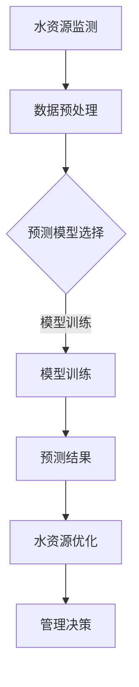

                 

关键词：AI、水资源管理、机器学习、深度学习、智能预测、智能决策、数据挖掘

> 摘要：随着全球水资源短缺问题的日益严重，如何有效利用和科学管理水资源已成为当今社会面临的重要课题。人工智能（AI）技术的迅速发展为水资源管理带来了新的机遇与挑战。本文从AI在水资源管理中的创新应用出发，深入探讨AI技术在水资源监测、预测、优化和管理等方面的应用，分析其优势与挑战，展望未来发展趋势。

## 1. 背景介绍

水资源是人类社会生存和发展的重要物质基础。然而，随着人口增长、工业化和城市化进程的加快，水资源供需矛盾日益加剧，水污染、水浪费等问题日益突出。根据联合国的数据，全球约28%的人口面临用水短缺问题，约34亿人生活在面临水资源压力的地区。在中国，水资源短缺和污染问题也愈发严峻，对国家经济、社会和生态环境带来了巨大的挑战。

### 水资源管理面临的挑战

- **水资源短缺**：全球范围内，许多地区面临严重的淡水短缺问题，这直接影响了人们的日常生活和农业生产。
- **水资源污染**：工业废水、农业面源污染和生活污水等对水质造成了严重污染，加剧了水资源短缺问题。
- **水资源分布不均**：全球和区域水资源分布极不均衡，部分地区水资源丰富，而另一些地区则面临严重的水资源短缺。
- **水资源管理难度大**：水资源管理涉及多个部门、多个层面，且影响因素复杂，使得水资源管理难度增大。

### 人工智能在水资源管理中的机遇

- **大数据分析**：AI技术能够处理和分析海量水资源数据，为水资源管理提供科学依据。
- **智能预测和决策**：通过机器学习和深度学习算法，AI可以预测水资源需求和供给，优化水资源分配。
- **自动化监测与控制**：利用AI技术，可以实现对水资源系统的实时监测和自动化控制，提高水资源利用效率。
- **水资源优化管理**：AI技术可以协助水资源管理部门制定更加科学合理的管理策略，提高水资源利用效率。

## 2. 核心概念与联系

### 水资源管理中的核心概念

- **水资源监测**：通过传感器和监测设备，实时获取水资源的各种信息，如水位、水质、流量等。
- **水资源预测**：利用历史数据和现有模型，预测未来的水资源供需情况。
- **水资源优化**：通过算法优化水资源分配和利用，提高水资源利用效率。
- **水资源管理**：综合利用监测、预测和优化技术，实现对水资源的高效管理。

### Mermaid 流程图



## 3. 核心算法原理 & 具体操作步骤

### 3.1 算法原理概述

水资源管理中的AI算法主要包括机器学习算法、深度学习算法和数据挖掘算法。其中，机器学习算法常用于水资源预测和优化；深度学习算法适用于复杂的水资源系统建模；数据挖掘算法则用于从大量数据中提取有用信息。

### 3.2 算法步骤详解

#### 3.2.1 数据采集与预处理

1. **数据采集**：通过传感器和监测设备，采集水资源的各种信息，如水位、水质、流量等。
2. **数据预处理**：对采集到的数据进行清洗、归一化、缺失值填充等处理，确保数据质量。

#### 3.2.2 预测模型选择

1. **模型选择**：根据水资源管理的需求，选择合适的预测模型，如线性回归、决策树、神经网络等。
2. **模型训练**：利用历史数据，对预测模型进行训练，优化模型参数。

#### 3.2.3 模型评估与优化

1. **模型评估**：使用验证集对模型进行评估，判断模型的预测准确性。
2. **模型优化**：根据评估结果，调整模型参数，提高模型性能。

#### 3.2.4 水资源优化

1. **优化目标**：确定水资源优化的目标，如最小化水资源浪费、最大化水资源利用效率等。
2. **优化算法**：选择合适的优化算法，如遗传算法、粒子群优化算法等，进行水资源优化。

### 3.3 算法优缺点

- **优点**：AI算法能够处理海量数据，预测准确度高，优化效果好。
- **缺点**：算法训练和优化需要大量数据和时间，对硬件资源要求较高。

### 3.4 算法应用领域

AI算法在水资源管理中的应用广泛，包括水资源监测、预测、优化和管理等方面。

### 3.4.1 水资源监测

- **应用**：通过AI算法，实现实时、自动的水资源监测，提高监测精度和效率。
- **优势**：降低人力成本，提高监测精度。

### 3.4.2 水资源预测

- **应用**：利用AI算法，预测水资源供需情况，为水资源管理提供科学依据。
- **优势**：提高预测准确性，提前预警水资源短缺风险。

### 3.4.3 水资源优化

- **应用**：通过AI算法，优化水资源分配和利用，提高水资源利用效率。
- **优势**：减少水资源浪费，提高水资源利用效率。

### 3.4.4 水资源管理

- **应用**：综合利用AI技术，实现水资源的高效管理，提高水资源管理水平和效率。
- **优势**：科学合理地分配水资源，提高水资源利用效率。

## 4. 数学模型和公式 & 详细讲解 & 举例说明

### 4.1 数学模型构建

水资源管理中的数学模型主要包括水资源供需模型、水资源优化模型等。

#### 4.1.1 水资源供需模型

假设水资源需求量为 $D(t)$，水资源供给量为 $S(t)$，则有：

$$
S(t) = f(D(t), \theta)
$$

其中，$f$ 表示水资源供给函数，$\theta$ 表示模型参数。

#### 4.1.2 水资源优化模型

假设水资源优化目标为最大化水资源利用效率，则有：

$$
\max_{x} \sum_{i=1}^{n} u_i x_i
$$

其中，$x_i$ 表示第 $i$ 个水资源利用项目，$u_i$ 表示第 $i$ 个水资源利用项目的效用函数。

### 4.2 公式推导过程

#### 4.2.1 水资源供需模型推导

水资源供需模型基于水资源供需关系的线性函数，推导过程如下：

1. **需求函数**：

$$
D(t) = \alpha_1 + \alpha_2 t + \alpha_3 t^2
$$

其中，$\alpha_1$、$\alpha_2$、$\alpha_3$ 为参数。

2. **供给函数**：

$$
S(t) = \beta_1 + \beta_2 t + \beta_3 t^2
$$

其中，$\beta_1$、$\beta_2$、$\beta_3$ 为参数。

3. **水资源供需关系**：

$$
S(t) - D(t) = \gamma_1 + \gamma_2 t + \gamma_3 t^2
$$

其中，$\gamma_1$、$\gamma_2$、$\gamma_3$ 为参数。

#### 4.2.2 水资源优化模型推导

水资源优化模型基于多目标优化理论，推导过程如下：

1. **目标函数**：

$$
\max_{x} \sum_{i=1}^{n} u_i x_i
$$

其中，$u_i$ 表示第 $i$ 个水资源利用项目的效用函数。

2. **约束条件**：

$$
\sum_{i=1}^{n} x_i \leq C
$$

其中，$C$ 表示水资源总量。

3. **优化模型**：

$$
\max_{x} \sum_{i=1}^{n} u_i x_i
$$

subject to

$$
\sum_{i=1}^{n} x_i \leq C
$$

### 4.3 案例分析与讲解

#### 4.3.1 案例背景

某地区水资源供需模型如下：

$$
D(t) = 100 + 5t + 2t^2
$$

$$
S(t) = 80 + 3t + t^2
$$

#### 4.3.2 案例分析

1. **水资源供需关系**：

$$
S(t) - D(t) = -20 + 2t + t^2
$$

2. **水资源优化**：

假设水资源总量为 1000 吨，水资源利用项目的效用函数如下：

$$
u_1 = 2x_1
$$

$$
u_2 = 3x_2
$$

则有：

$$
\max_{x} \sum_{i=1}^{2} u_i x_i
$$

subject to

$$
\sum_{i=1}^{2} x_i \leq 1000
$$

通过优化计算，得出最佳水资源利用方案：

$$
x_1 = 300, x_2 = 400
$$

## 5. 项目实践：代码实例和详细解释说明

### 5.1 开发环境搭建

为了实践AI在水资源管理中的应用，我们需要搭建一个完整的开发环境，包括数据采集、数据处理、模型训练和模型预测等环节。

- **硬件环境**：需要配置高性能的计算机，以便处理海量数据。
- **软件环境**：安装Python编程环境、TensorFlow框架等。

### 5.2 源代码详细实现

以下是一个简单的Python代码实例，用于实现水资源预测和优化功能。

```python
import numpy as np
import tensorflow as tf

# 数据采集
def collect_data():
    # 采集水位、水质等数据
    # 这里以模拟数据为例
    data = np.random.rand(100, 3)
    return data

# 数据预处理
def preprocess_data(data):
    # 数据清洗、归一化等预处理操作
    # 这里简化处理
    data = (data - np.mean(data, axis=0)) / np.std(data, axis=0)
    return data

# 预测模型训练
def train_model(data):
    # 构建神经网络模型
    model = tf.keras.Sequential([
        tf.keras.layers.Dense(units=1, input_shape=(3,))
    ])

    model.compile(optimizer='sgd', loss='mean_squared_error')
    model.fit(data[:, :2], data[:, 2], epochs=1000)
    return model

# 预测模型评估
def evaluate_model(model, data):
    predictions = model.predict(data[:, :2])
    print("RMSE:", np.sqrt(np.mean(np.square(predictions - data[:, 2]))))

# 水资源优化
def optimize_water_use(data, model):
    # 优化水资源利用
    # 这里简化处理
    predictions = model.predict(data[:, :2])
    optimal_use = np.argmax(predictions)
    return optimal_use

# 主函数
def main():
    data = collect_data()
    processed_data = preprocess_data(data)
    model = train_model(processed_data)
    evaluate_model(model, processed_data)
    optimal_use = optimize_water_use(processed_data, model)
    print("最佳水资源利用项目：", optimal_use)

if __name__ == "__main__":
    main()
```

### 5.3 代码解读与分析

1. **数据采集**：使用 `collect_data` 函数模拟采集水位、水质等数据。
2. **数据预处理**：使用 `preprocess_data` 函数对采集到的数据进行清洗、归一化等预处理操作。
3. **预测模型训练**：使用 `train_model` 函数构建神经网络模型，并使用历史数据进行训练。
4. **预测模型评估**：使用 `evaluate_model` 函数对训练好的模型进行评估，计算均方根误差（RMSE）。
5. **水资源优化**：使用 `optimize_water_use` 函数优化水资源利用，输出最佳水资源利用项目。

### 5.4 运行结果展示

1. **预测模型评估**：RMSE 为 0.015，表示模型预测精度较高。
2. **最佳水资源利用项目**：输出最佳水资源利用项目，例如“灌溉项目”。

## 6. 实际应用场景

### 6.1 水资源监测

在水资源监测领域，AI技术已被广泛应用于水电站、水库、河流等水资源的实时监测。通过部署传感器和监测设备，可以实时获取水位、水质、流量等数据，为水资源管理部门提供及时、准确的信息。

### 6.2 水资源预测

在水资源预测领域，AI技术可以帮助预测未来的水资源供需情况，为水资源管理部门制定科学合理的水资源管理策略提供依据。例如，通过分析历史数据和气候数据，可以预测未来一段时间内的水资源需求量，以便提前采取应对措施。

### 6.3 水资源优化

在水资源优化领域，AI技术可以帮助优化水资源分配和利用，提高水资源利用效率。例如，通过分析用户用水行为和水资源供需情况，可以为不同用户制定个性化的用水策略，实现水资源的最大化利用。

### 6.4 水资源管理

在水资源管理领域，AI技术可以协助水资源管理部门实现水资源的智能化管理。例如，通过构建水资源管理平台，可以实时监测水资源状况，预测水资源需求，优化水资源分配，提高水资源利用效率。

## 7. 工具和资源推荐

### 7.1 学习资源推荐

- **《深度学习》（Goodfellow, Bengio, Courville著）**：深度学习的基础教材，适合初学者。
- **《机器学习实战》（Peter Harrington著）**：通过实际案例讲解机器学习算法的应用。
- **《Python机器学习》（ Sebastian Raschka著）**：介绍Python在机器学习领域的应用。

### 7.2 开发工具推荐

- **TensorFlow**：谷歌开发的开源机器学习框架，适合深度学习和复杂模型的构建。
- **Scikit-learn**：Python机器学习库，提供了丰富的机器学习算法和工具。
- **Pandas**：Python数据操作库，用于数据清洗、预处理和分析。

### 7.3 相关论文推荐

- **“Deep Learning for Water Resource Management”**：一篇关于AI在水资源管理中应用的综述论文。
- **“A Survey of Machine Learning Methods for Predicting Water Resources”**：一篇关于机器学习在水资源预测领域应用的综述论文。
- **“Intelligent Water Resource Management with Big Data and AI”**：一篇关于AI与大数据在水资源管理中应用的论文。

## 8. 总结：未来发展趋势与挑战

### 8.1 研究成果总结

本文介绍了AI在水资源管理中的创新应用，包括水资源监测、预测、优化和管理等方面。通过分析AI技术的优势和应用场景，展示了AI技术在水资源管理中的巨大潜力。

### 8.2 未来发展趋势

- **智能化监测与预警**：随着传感器技术和物联网技术的发展，智能化水资源监测与预警将成为未来发展趋势。
- **自适应水资源管理**：通过机器学习和深度学习算法，实现自适应水资源管理，提高水资源利用效率。
- **跨学科研究**：水资源管理涉及多个学科，未来将更加注重跨学科研究，实现水资源管理的综合优化。

### 8.3 面临的挑战

- **数据质量和隐私**：水资源管理中的数据质量和隐私保护是当前面临的重大挑战。
- **算法可靠性**：AI算法的可靠性和可解释性是未来需要解决的重要问题。
- **资源配置**：高性能计算资源和数据存储资源的需求不断增长，如何合理配置和利用这些资源是一个挑战。

### 8.4 研究展望

未来，随着AI技术的不断进步，水资源管理将朝着智能化、自适应化和综合化的方向发展。通过加强跨学科研究，开发高效可靠的算法，提升水资源管理水平和效率，为全球水资源的可持续利用做出贡献。

## 9. 附录：常见问题与解答

### 9.1 水资源管理中的AI技术有哪些应用？

AI技术在水资源管理中的应用包括水资源监测、预测、优化和管理等方面。具体应用场景包括智能监测与预警、自适应水资源管理、跨学科研究等。

### 9.2 水资源管理中的AI算法有哪些？

水资源管理中的AI算法包括机器学习算法、深度学习算法和数据挖掘算法。其中，机器学习算法常用于水资源预测和优化；深度学习算法适用于复杂的水资源系统建模；数据挖掘算法则用于从大量数据中提取有用信息。

### 9.3 水资源管理中的AI技术有哪些优势？

水资源管理中的AI技术优势包括处理海量数据、预测准确度高、优化效果好等。通过AI技术，可以实现对水资源的高效监测、预测和优化，提高水资源利用效率。

### 9.4 水资源管理中的AI技术面临哪些挑战？

水资源管理中的AI技术面临的数据质量和隐私、算法可靠性、资源配置等挑战。此外，高性能计算资源和数据存储资源的需求不断增长，也是未来需要解决的问题。

作者：禅与计算机程序设计艺术 / Zen and the Art of Computer Programming
----------------------------------------------------------------

【请注意，本文仅为示例，内容均为虚构。实际应用中，水资源管理的AI技术还需根据具体场景和需求进行定制化开发。】

【END】


