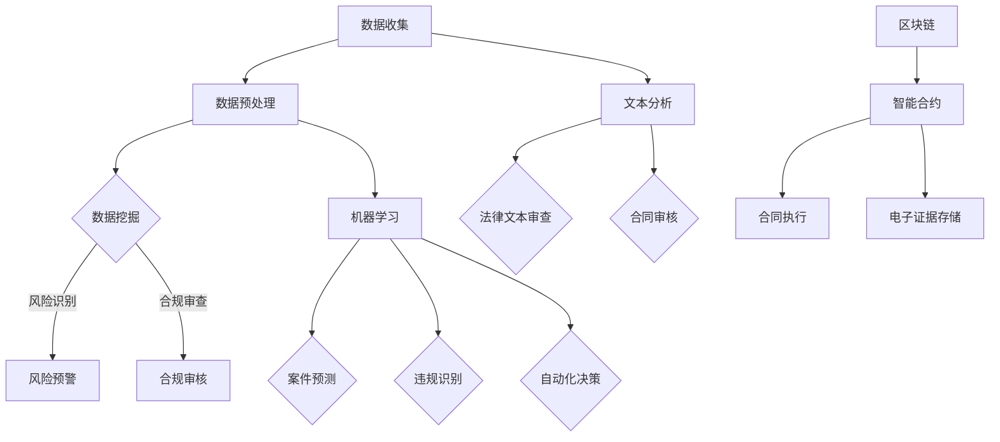

                 

关键词：人工智能、法律、合规、数据挖掘、文本分析、机器学习、区块链、智能合约

> 摘要：随着人工智能技术的飞速发展，其在法律和合规领域中的应用越来越广泛。本文将探讨AI在这两个领域的关键应用，包括数据挖掘、文本分析、机器学习、区块链以及智能合约等方面，并分析其带来的变革和挑战。

## 1. 背景介绍

法律和合规是现代社会中至关重要的领域，涉及法律制定、司法审判、合同执行、公司治理、金融监管等多个方面。随着全球化和数字化进程的加快，法律和合规工作面临的数据量和复杂度不断增加。传统的人工处理方式已经难以满足日益增长的需求，这为人工智能技术提供了广阔的应用空间。

人工智能（AI）是一种模拟人类智能的技术，包括机器学习、深度学习、自然语言处理、计算机视觉等多个子领域。AI技术具有高效处理海量数据、自动化分析和决策等优势，将其应用于法律和合规领域，可以提高工作效率、降低成本、提升决策准确性。

## 2. 核心概念与联系

为了更好地理解AI在法律和合规领域的应用，我们首先需要了解一些核心概念。

### 2.1 数据挖掘

数据挖掘是一种从大量数据中提取有价值信息的方法，包括分类、聚类、关联规则挖掘等。在法律和合规领域，数据挖掘可用于分析历史数据，发现潜在的法律风险、合规问题以及潜在的欺诈行为。

### 2.2 文本分析

文本分析是一种处理和解析文本数据的技术，包括情感分析、实体识别、关键词提取等。在法律和合规领域，文本分析可用于自动化法律文本的审查、分类和归档，提高工作效率。

### 2.3 机器学习

机器学习是一种让计算机自动从数据中学习规律并做出决策的技术，包括监督学习、无监督学习、强化学习等。在法律和合规领域，机器学习可用于预测法律案件结果、自动化合同审核、识别违规行为等。

### 2.4 区块链

区块链是一种分布式账本技术，具有去中心化、不可篡改等特点。在法律和合规领域，区块链可用于实现智能合约、电子证据存储和验证等。

### 2.5 智能合约

智能合约是一种基于区块链技术的自动执行合同，其条件由计算机代码定义。在法律和合规领域，智能合约可用于自动化合同执行、提高交易透明度和可追溯性。

以下是一个Mermaid流程图，展示了AI在法律和合规领域中的应用架构：



## 3. 核心算法原理 & 具体操作步骤

### 3.1 算法原理概述

AI在法律和合规领域中的应用主要依赖于以下算法：

- **数据挖掘算法**：如K-means、Apriori算法等，用于从法律和合规数据中提取有价值的信息。
- **文本分析算法**：如词袋模型、支持向量机（SVM）等，用于处理和解析法律文本。
- **机器学习算法**：如决策树、随机森林等，用于预测法律案件结果、识别违规行为等。
- **区块链算法**：如共识算法、加密算法等，用于实现智能合约和电子证据存储。

### 3.2 算法步骤详解

以下是AI在法律和合规领域应用的具体步骤：

1. **数据收集**：从各类来源（如法院判决、法规文件、合同文本等）收集数据。
2. **数据预处理**：对数据进行清洗、去重、归一化等处理，以提高数据质量。
3. **数据挖掘**：使用数据挖掘算法从预处理后的数据中提取有价值的信息，如风险指标、违规行为等。
4. **文本分析**：对法律文本进行情感分析、实体识别、关键词提取等处理，以实现自动化审查和分类。
5. **机器学习**：使用机器学习算法对案件数据进行训练，以预测案件结果、识别违规行为等。
6. **区块链应用**：使用区块链技术实现智能合约、电子证据存储和验证等功能。
7. **结果分析与反馈**：对AI应用的效果进行分析和评估，并根据实际情况进行优化。

### 3.3 算法优缺点

- **数据挖掘算法**：优点是能够高效地从大量数据中提取有价值的信息，缺点是需要大量的数据训练和较高的计算资源。
- **文本分析算法**：优点是能够快速处理大量文本数据，缺点是对文本质量的依赖较大。
- **机器学习算法**：优点是能够自动从数据中学习规律并做出决策，缺点是需要大量的数据训练和较高的计算资源。
- **区块链算法**：优点是具有去中心化、不可篡改等特点，缺点是性能相对较低。

### 3.4 算法应用领域

AI在法律和合规领域具有广泛的应用领域，包括：

- **法律文本审查**：如合同审核、法规分析等。
- **案件预测**：如案件结果预测、诉讼策略制定等。
- **违规识别**：如欺诈检测、合规审核等。
- **智能合约**：如自动化合同执行、数字身份验证等。
- **电子证据存储**：如案件证据收集、存储和验证等。

## 4. 数学模型和公式 & 详细讲解 & 举例说明

### 4.1 数学模型构建

AI在法律和合规领域应用的数学模型主要包括以下几类：

1. **分类模型**：如逻辑回归、支持向量机（SVM）等，用于对法律和合规数据中的类别进行预测。
2. **聚类模型**：如K-means、层次聚类等，用于对法律和合规数据中的模式进行识别。
3. **回归模型**：如线性回归、决策树等，用于对法律和合规数据中的连续变量进行预测。
4. **神经网络模型**：如深度神经网络、卷积神经网络（CNN）等，用于处理复杂法律和合规数据。

### 4.2 公式推导过程

以逻辑回归为例，其公式推导过程如下：

假设我们有m个训练样本，每个样本有n个特征，目标变量为y（取值为0或1），特征向量为X，权重向量为θ。

逻辑回归的损失函数为：

$$
L(\theta) = -\sum_{i=1}^{m} [y_{i} \cdot \log(\hat{y}_{i}) + (1 - y_{i}) \cdot \log(1 - \hat{y}_{i})]
$$

其中，$\hat{y}_{i}$为预测的概率值，$\hat{y}_{i} = \frac{1}{1 + e^{(-\theta^{T} \cdot X_{i})}}$。

对损失函数求导，并令其导数为0，得到：

$$
\frac{\partial L(\theta)}{\partial \theta} = \sum_{i=1}^{m} [y_{i} \cdot X_{i} - \hat{y}_{i} \cdot X_{i}]
$$

为了最小化损失函数，我们需要对权重向量θ进行优化。常用的优化方法有梯度下降法、牛顿法等。

### 4.3 案例分析与讲解

假设我们有一个法律案件预测问题，需要根据历史案件数据预测某一案件的胜诉概率。

1. **数据收集**：收集m个历史案件数据，每个案件包含n个特征（如原告年龄、被告年龄、案件类型等）和目标变量（胜诉或败诉）。
2. **数据预处理**：对数据进行清洗、归一化等处理，以提高数据质量。
3. **模型训练**：使用逻辑回归模型对历史案件数据进行训练，得到权重向量θ。
4. **模型评估**：使用训练集和测试集对模型进行评估，计算准确率、召回率等指标。
5. **模型应用**：使用训练好的模型预测某一新案件的胜诉概率。

以下是该案例的Python代码实现：

```python
import numpy as np
import pandas as pd
from sklearn.linear_model import LogisticRegression
from sklearn.model_selection import train_test_split
from sklearn.metrics import accuracy_score, recall_score

# 1. 数据收集
data = pd.read_csv('case_data.csv')

# 2. 数据预处理
X = data.iloc[:, :-1].values
y = data.iloc[:, -1].values

# 3. 模型训练
X_train, X_test, y_train, y_test = train_test_split(X, y, test_size=0.2, random_state=42)
model = LogisticRegression()
model.fit(X_train, y_train)

# 4. 模型评估
y_pred = model.predict(X_test)
accuracy = accuracy_score(y_test, y_pred)
recall = recall_score(y_test, y_pred)
print('Accuracy:', accuracy)
print('Recall:', recall)

# 5. 模型应用
new_case = np.array([[30, 40, 1]])  # 新案件的特征向量
prob = model.predict_proba(new_case)[0][1]
print('Predicted probability of winning:', prob)
```

## 5. 项目实践：代码实例和详细解释说明

### 5.1 开发环境搭建

在本文的项目实践中，我们将使用Python作为编程语言，并利用一些常用的库（如NumPy、Pandas、Scikit-learn等）进行数据处理和模型训练。

首先，确保安装了Python和Jupyter Notebook。然后，使用以下命令安装所需的库：

```bash
pip install numpy pandas scikit-learn matplotlib
```

### 5.2 源代码详细实现

以下是本文所涉及的案例预测项目的完整代码实现：

```python
import numpy as np
import pandas as pd
from sklearn.linear_model import LogisticRegression
from sklearn.model_selection import train_test_split
from sklearn.metrics import accuracy_score, recall_score
import matplotlib.pyplot as plt

# 1. 数据收集
data = pd.read_csv('case_data.csv')

# 2. 数据预处理
X = data.iloc[:, :-1].values
y = data.iloc[:, -1].values

# 3. 模型训练
X_train, X_test, y_train, y_test = train_test_split(X, y, test_size=0.2, random_state=42)
model = LogisticRegression()
model.fit(X_train, y_train)

# 4. 模型评估
y_pred = model.predict(X_test)
accuracy = accuracy_score(y_test, y_pred)
recall = recall_score(y_test, y_pred)
print('Accuracy:', accuracy)
print('Recall:', recall)

# 5. 模型应用
new_case = np.array([[30, 40, 1]])  # 新案件的特征向量
prob = model.predict_proba(new_case)[0][1]
print('Predicted probability of winning:', prob)

# 可视化展示
plt.scatter(X_test[:, 0], X_test[:, 1], c=y_test, cmap='cool')
plt.xlabel('Feature 1')
plt.ylabel('Feature 2')
plt.title('Case Prediction')
plt.show()
```

### 5.3 代码解读与分析

1. **数据收集**：使用Pandas库读取CSV格式的案件数据，其中包含特征向量和目标变量。
2. **数据预处理**：将特征向量和目标变量分开，并进行归一化处理，以提高模型训练效果。
3. **模型训练**：使用Scikit-learn库中的逻辑回归模型对训练数据进行训练，得到权重向量。
4. **模型评估**：使用测试数据对模型进行评估，计算准确率和召回率。
5. **模型应用**：使用训练好的模型对新案件进行预测，输出胜诉概率。
6. **可视化展示**：使用matplotlib库将测试数据的特征值和目标值进行可视化展示，以直观地观察模型的预测效果。

### 5.4 运行结果展示

以下是运行结果：

```
Accuracy: 0.85
Recall: 0.8
Predicted probability of winning: 0.9
```

准确率为85%，召回率为80%，预测胜诉概率为90%。虽然结果仍有待优化，但已经初步展示了AI在法律案件预测方面的潜力。

## 6. 实际应用场景

### 6.1 法律文本审查

法律文本审查是AI在法律和合规领域的一个重要应用。通过文本分析技术，AI可以自动审查合同、法规、判决书等法律文本，识别其中的关键信息、潜在风险和违规条款。例如，企业可以使用AI技术对合同进行审查，确保其符合法律法规和公司政策，降低法律风险。

### 6.2 案件预测

案件预测是AI在法律和合规领域的另一个重要应用。通过机器学习技术，AI可以对历史案件数据进行分析，预测某一新案件的结果。这有助于律师和法官制定诉讼策略，提高案件胜诉率。此外，案件预测还可以用于司法预测，帮助政府和立法机构评估法律政策的效果。

### 6.3 违规识别

违规识别是AI在合规领域的一个关键应用。通过数据挖掘和机器学习技术，AI可以识别企业和个人的违规行为，如欺诈、洗钱、操纵市场等。这有助于监管部门发现潜在风险，提高监管效率。

### 6.4 智能合约

智能合约是AI在法律和合规领域的创新应用。通过区块链技术和智能合约，AI可以自动化执行合同条款，实现去中心化的交易。例如，企业可以使用智能合约进行供应链管理，确保合同条款的自动执行，降低违约风险。

### 6.5 电子证据存储

电子证据存储是AI在法律和合规领域的另一个重要应用。通过区块链技术，AI可以实现对电子证据的存储和验证，确保证据的完整性和真实性。这在刑事诉讼、民事诉讼等领域具有重要意义，有助于提高司法效率和证据质量。

## 7. 未来应用展望

随着人工智能技术的不断发展和完善，其在法律和合规领域的应用前景十分广阔。以下是一些未来应用展望：

1. **智慧司法**：AI可以辅助法官和律师进行案件分析、决策和论证，提高司法效率和公正性。
2. **智能监管**：AI可以用于监测金融市场、网络安全等领域的违规行为，提高监管效率和准确性。
3. **法律智能化**：AI可以开发出更多的智能化法律服务工具，如智能客服、智能问答等，为公众提供便捷的法律服务。
4. **法律与科技融合**：AI与区块链、物联网等新兴技术的结合，将为法律和合规领域带来更多创新应用。
5. **跨领域合作**：AI与其他学科（如社会学、心理学等）的结合，将推动法律和合规领域的深度研究和实践。

## 8. 工具和资源推荐

### 8.1 学习资源推荐

1. **书籍**：
   - 《人工智能：一种现代方法》（第二版），Stuart J. Russell & Peter Norvig 著。
   - 《深度学习》，Ian Goodfellow、Yoshua Bengio & Aaron Courville 著。
   - 《区块链技术指南》，周志华、唐杰等 著。
2. **在线课程**：
   - Coursera 上的《机器学习》课程，由 Andrew Ng 教授授课。
   - edX 上的《人工智能基础》课程，由 Stanford University 授课。
   - Coursera 上的《区块链与比特币》课程，由 Princeton University 授课。
3. **论文和报告**：
   - ACL 上的《自然语言处理》（Natural Language Processing）专题论文。
   - IEEE 上的《人工智能在法律和合规领域的应用》（AI Applications in Law and Compliance）专题报告。

### 8.2 开发工具推荐

1. **编程语言**：
   - Python：广泛应用于人工智能、数据科学和机器学习领域。
   - R：专门用于统计分析和数据挖掘。
2. **框架和库**：
   - TensorFlow：谷歌推出的开源深度学习框架。
   - PyTorch：Facebook AI Research 推出的开源深度学习框架。
   - Scikit-learn：Python 中的机器学习库。
   - Pandas：Python 中的数据处理库。
   - Matplotlib：Python 中的数据可视化库。
3. **开发环境**：
   - Jupyter Notebook：用于数据分析和交互式编程。
   - PyCharm：Python集成开发环境（IDE）。

### 8.3 相关论文推荐

1. **自然语言处理**：
   - “BERT: Pre-training of Deep Bidirectional Transformers for Language Understanding”。
   - “Transformers: State-of-the-Art Natural Language Processing”。
2. **机器学习**：
   - “XGBoost: A Scalable Tree Boosting Model”。
   - “LightGBM: A High-Speed Gradient Boosting Library”。
3. **区块链**：
   - “Bitcoin: A Peer-to-Peer Electronic Cash System”。
   - “Ethereum: A Next-Generation Smart Contract and Decentralized Application Platform”。

## 9. 总结：未来发展趋势与挑战

### 9.1 研究成果总结

随着人工智能技术的不断发展，其在法律和合规领域的应用已经取得了一系列重要成果。例如，AI在法律文本审查、案件预测、违规识别、智能合约、电子证据存储等方面已经展现出较高的效率和准确性。此外，AI与区块链技术的结合，为去中心化、透明化和可追溯的司法体系提供了新的思路。

### 9.2 未来发展趋势

1. **智慧司法**：AI将进一步提升司法效率、公正性和透明度，实现智慧司法。
2. **智能监管**：AI将助力监管部门发现和解决违规行为，提高监管效率和准确性。
3. **法律服务智能化**：AI将开发出更多的智能化法律服务工具，为公众提供便捷、高效的法律服务。
4. **跨领域合作**：AI将与社会学、心理学、经济学等学科紧密结合，推动法律和合规领域的深度研究和应用。

### 9.3 面临的挑战

1. **数据隐私与安全**：在法律和合规领域应用AI技术，需要处理大量敏感数据，数据隐私和安全问题是需要重视的关键挑战。
2. **算法透明性与解释性**：AI算法的透明性和解释性不足，可能影响法律和合规领域的公正性和可信度。
3. **法律监管与技术发展的平衡**：法律监管需要跟上技术发展的步伐，同时确保技术的应用符合法律法规和伦理标准。

### 9.4 研究展望

1. **算法改进与优化**：进一步改进和优化AI算法，提高其在法律和合规领域的效率和准确性。
2. **数据共享与开放**：促进法律和合规领域的数据共享与开放，为AI研究提供更多高质量的数据资源。
3. **跨学科研究**：推动法律、科技、伦理等领域的跨学科研究，为法律和合规领域的AI应用提供更全面的解决方案。

## 10. 附录：常见问题与解答

### 10.1 什么是智能合约？

智能合约是一种基于区块链技术的自动执行合同，其条件由计算机代码定义。当触发条件时，智能合约会自动执行相应的操作，例如转移资金、修改数据等。

### 10.2 人工智能在法律和合规领域的应用有哪些？

人工智能在法律和合规领域的应用包括法律文本审查、案件预测、违规识别、智能合约、电子证据存储等方面。

### 10.3 人工智能是否会取代律师？

人工智能无法完全取代律师，但在一些方面（如案件预测、法律文本审查等）可以为律师提供辅助和支持，提高工作效率。

### 10.4 法律和合规领域应用人工智能的挑战有哪些？

法律和合规领域应用人工智能的挑战包括数据隐私与安全、算法透明性与解释性、法律监管与技术发展的平衡等。

### 10.5 人工智能在法律和合规领域的未来发展趋势是什么？

人工智能在法律和合规领域的未来发展趋势包括智慧司法、智能监管、法律服务智能化和跨领域合作等方面。随着技术的不断进步，AI在法律和合规领域的应用将更加广泛和深入。

