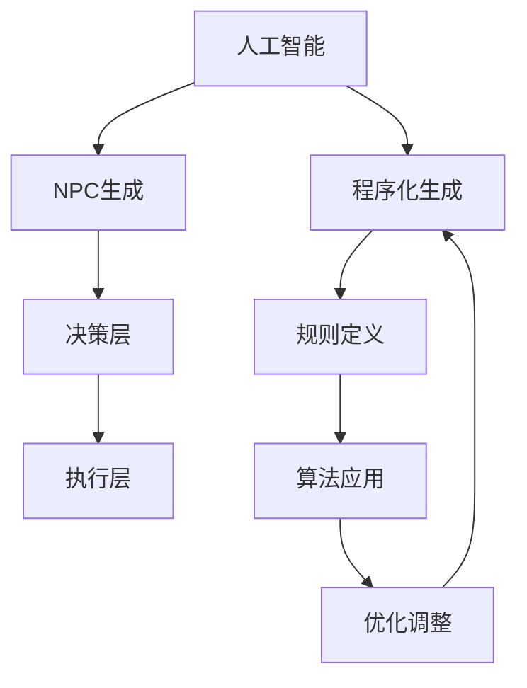

                 

关键词：人工智能，游戏开发，NPC，程序化生成，深度学习，游戏引擎，虚拟世界

## 摘要

随着人工智能（AI）技术的不断发展，游戏开发领域也迎来了新的变革。本文将探讨AI在游戏开发中的应用，重点关注NPC（非玩家角色）的生成和程序化生成技术。我们将深入分析AI的核心概念与架构，介绍几种关键算法的原理和应用步骤，并通过数学模型和公式来详细解释这些算法。此外，我们还将分享实际项目实践中的代码实例，展示AI在游戏开发中的实际效果。最后，我们将探讨AI在游戏开发中的应用前景，并提出未来的研究挑战和展望。

## 1. 背景介绍

游戏开发行业在过去几十年里经历了巨大的变化。从简单的二维像素游戏到高度复杂的3D虚拟世界，游戏技术和用户体验不断进步。随着技术的不断发展，游戏开发的需求也在不断增加。而AI技术的兴起为游戏开发提供了新的可能性和创新空间。AI在游戏开发中的应用主要集中在NPC生成、游戏机制设计、玩家行为分析等多个方面。

NPC作为游戏世界中的关键组成部分，能够为玩家提供互动和挑战。传统的NPC生成方法主要依赖于预设的脚本和行为模式，这使得NPC的行为相对固定和缺乏个性。而AI技术的引入，使得NPC的生成变得更加智能和多样化。通过深度学习和机器学习算法，NPC可以学习玩家的行为模式，并作出相应的反应，从而提高游戏的真实感和沉浸感。

程序化生成技术是AI在游戏开发中的另一重要应用。程序化生成能够自动生成游戏世界、场景、角色和道具等元素，从而提高开发效率和创作自由度。这种技术不仅可以节省开发时间和成本，还能够实现高度个性化的游戏体验。程序化生成技术包括地形生成、植被生成、光照和阴影处理等多个方面，都是游戏开发中的重要组成部分。

本文将首先介绍AI的核心概念和架构，然后深入分析几种关键算法的原理和应用步骤。接着，我们将通过数学模型和公式来详细解释这些算法。随后，我们将分享实际项目实践中的代码实例，展示AI在游戏开发中的实际效果。最后，我们将探讨AI在游戏开发中的应用前景，并提出未来的研究挑战和展望。

## 2. 核心概念与联系

### 2.1 人工智能的基本概念

人工智能（Artificial Intelligence，简称AI）是指由计算机系统实现的模拟人类智能的行为。AI的核心目标是使计算机能够执行人类智能任务，如感知、推理、学习和决策等。在游戏开发中，AI被广泛应用于NPC生成、游戏机制设计、玩家行为分析等方面。

AI的基本概念包括以下几个方面：

- **感知**：通过传感器（如摄像头、麦克风等）获取外部环境信息，并将其转换为计算机可以处理的数据。
- **推理**：利用已有知识和信息，进行逻辑推理和决策，以应对不同的游戏情景。
- **学习**：通过数据分析和模式识别，不断优化和改进算法，以提高NPC的行为智能。
- **规划**：制定行动计划，以实现特定的游戏目标。

### 2.2 游戏开发中的AI架构

游戏开发中的AI架构通常包括以下几个层次：

- **感知层**：负责接收外部环境信息，如玩家位置、NPC状态等。
- **决策层**：根据感知层提供的信息，进行决策和规划，以确定NPC的行为。
- **执行层**：根据决策层的指令，执行相应的行为，如移动、攻击、对话等。

### 2.3 NPC生成的基本原理

NPC生成是游戏开发中的一个重要环节。传统的NPC生成方法主要依赖于预设的脚本和行为模式。这种方法虽然能够实现简单的NPC行为，但缺乏灵活性和个性化。而AI技术的引入，使得NPC生成变得更加智能和多样化。

NPC生成的基本原理包括以下几个方面：

- **数据采集**：通过数据采集，获取大量的NPC行为数据，如移动路径、对话文本、动作序列等。
- **模型训练**：利用机器学习算法，对采集到的数据进行分析和训练，建立NPC行为模型。
- **行为生成**：根据NPC行为模型，生成NPC的行为，如移动、对话、动作等。

### 2.4 程序化生成的基本原理

程序化生成是AI在游戏开发中的另一重要应用。程序化生成能够自动生成游戏世界、场景、角色和道具等元素，从而提高开发效率和创作自由度。

程序化生成的基本原理包括以下几个方面：

- **规则定义**：通过定义一系列规则，如地形生成规则、植被生成规则等，来生成游戏世界和场景。
- **算法应用**：利用算法，如随机过程、进化算法等，对规则进行计算和调整，生成游戏元素。
- **优化调整**：通过不断优化和调整，提高程序化生成的质量和效率。

### 2.5 关键概念之间的联系

在游戏开发中，人工智能、NPC生成和程序化生成三个关键概念之间存在紧密的联系。

- **人工智能**为NPC生成和程序化生成提供了基础技术支持，使其能够实现智能和自动化的生成。
- **NPC生成**是人工智能在游戏开发中的一个具体应用，通过智能化的生成方法，提高NPC的行为多样性和真实性。
- **程序化生成**是AI在游戏开发中的另一个重要应用，通过自动化的生成方法，提高开发效率和创作自由度。

通过这三个关键概念的联系，我们可以更好地理解AI在游戏开发中的应用价值和潜力。

### 2.6 Mermaid流程图

下面是一个简化的Mermaid流程图，用于描述游戏开发中AI的核心概念和联系：



这个流程图展示了AI、NPC生成和程序化生成三个关键概念之间的基本关系和交互过程。通过这个流程图，我们可以更好地理解AI在游戏开发中的整体架构和应用。

## 3. 核心算法原理 & 具体操作步骤

### 3.1 算法原理概述

在游戏开发中，AI的应用涉及到多种算法。这些算法的核心原理可以分为以下几个方面：

- **机器学习**：通过学习大量数据，建立模型并预测结果。
- **深度学习**：一种特殊的机器学习技术，通过多层神经网络来模拟人脑的学习过程。
- **强化学习**：通过试错和反馈来优化策略，以达到最优行为。

### 3.2 算法步骤详解

#### 3.2.1 机器学习

机器学习算法的基本步骤如下：

1. **数据采集**：收集与NPC行为相关的数据，如移动路径、对话文本、动作序列等。
2. **数据预处理**：对采集到的数据进行清洗、归一化等处理，以消除噪声和异常值。
3. **模型训练**：利用预处理后的数据，训练机器学习模型。
4. **模型评估**：通过测试数据集，评估模型的性能和准确性。
5. **模型优化**：根据评估结果，调整模型参数，优化模型性能。

#### 3.2.2 深度学习

深度学习算法的基本步骤如下：

1. **数据采集**：与机器学习类似，收集与NPC行为相关的数据。
2. **数据预处理**：对数据进行预处理，如归一化、图像增强等。
3. **模型构建**：设计多层神经网络结构，并初始化模型参数。
4. **模型训练**：利用预处理后的数据，对模型进行训练。
5. **模型评估**：通过测试数据集，评估模型的性能。
6. **模型优化**：根据评估结果，调整模型结构和参数。

#### 3.2.3 强化学习

强化学习算法的基本步骤如下：

1. **环境搭建**：创建一个模拟环境，用于训练NPC。
2. **策略初始化**：初始化NPC的行为策略。
3. **试错学习**：通过试错和反馈，不断调整NPC的行为策略。
4. **模型评估**：在模拟环境中，评估NPC的行为效果。
5. **策略优化**：根据评估结果，调整NPC的行为策略。
6. **迭代优化**：重复试错学习和策略优化的过程，直到达到预期目标。

### 3.3 算法优缺点

#### 3.3.1 机器学习

优点：

- **高效性**：通过学习大量数据，能够快速建立准确的模型。
- **通用性**：适用于各种类型的数据和问题。

缺点：

- **数据依赖**：需要大量高质量的数据，否则模型的性能会受到影响。
- **解释性差**：模型的决策过程往往缺乏透明性，难以解释。

#### 3.3.2 深度学习

优点：

- **强大的表达能力**：能够处理复杂的非线性问题。
- **高效的计算能力**：通过多层神经网络，能够实现高效的计算。

缺点：

- **数据需求大**：需要大量的数据来训练模型，否则容易出现过拟合。
- **训练时间长**：训练过程可能需要很长时间，对计算资源有较高要求。

#### 3.3.3 强化学习

优点：

- **适应性强**：能够根据环境的变化，自适应地调整行为策略。
- **灵活性高**：能够处理动态变化的问题。

缺点：

- **收敛速度慢**：试错学习过程可能需要很长时间，才能找到最优策略。
- **稳定性差**：在某些情况下，可能存在不稳定的情况。

### 3.4 算法应用领域

#### 3.4.1 机器学习

机器学习算法在游戏开发中的应用非常广泛，包括：

- **NPC行为预测**：通过学习大量NPC行为数据，预测NPC的未来行为。
- **玩家行为分析**：分析玩家的行为模式，为NPC提供相应的挑战和互动。
- **游戏机制设计**：利用机器学习算法，设计自适应的游戏机制，提高游戏的可玩性。

#### 3.4.2 深度学习

深度学习算法在游戏开发中的应用主要包括：

- **游戏场景生成**：通过深度学习算法，自动生成游戏场景和地图。
- **角色表情识别**：通过卷积神经网络，识别和生成角色的表情。
- **图像风格转换**：利用深度学习算法，将一种风格的图像转换为另一种风格。

#### 3.4.3 强化学习

强化学习算法在游戏开发中的应用主要包括：

- **NPC行为优化**：通过试错学习和策略优化，提高NPC的行为智能。
- **游戏玩法设计**：利用强化学习算法，设计自适应的游戏玩法。
- **路径规划**：通过强化学习算法，为NPC规划最佳路径。

## 4. 数学模型和公式 & 详细讲解 & 举例说明

### 4.1 数学模型构建

在游戏开发中，AI算法的数学模型通常包括以下几个部分：

1. **状态空间**：描述游戏环境中的各种状态，如玩家的位置、NPC的状态等。
2. **动作空间**：描述NPC可以执行的各种动作，如移动、攻击、对话等。
3. **奖励函数**：描述NPC行为的奖励值，用于评估NPC的行为效果。
4. **策略函数**：描述NPC的行为策略，用于确定NPC在特定状态下的最佳动作。

下面是一个简化的数学模型示例：

$$
\begin{aligned}
&\text{状态空间} \ S = \{s_1, s_2, s_3\} \\
&\text{动作空间} \ A = \{a_1, a_2, a_3\} \\
&\text{奖励函数} \ R(s, a) = \begin{cases}
5, & \text{if } (s, a) = (s_1, a_1) \\
0, & \text{otherwise}
\end{cases} \\
&\text{策略函数} \ \pi(s) = \begin{cases}
\frac{1}{3}, & \text{for all } s \in S \\
\end{cases}
\end{aligned}
$$

### 4.2 公式推导过程

在AI算法中，常用的数学公式包括：

1. **期望值**：表示在给定状态下，执行特定动作的期望奖励值。

$$
E[R(s, a)] = \sum_{s' \in S} R(s, a) \cdot P(s'|s, a)
$$

2. **策略评估**：用于评估给定策略下的状态价值函数。

$$
V^*(s) = \max_{a \in A} \left( \sum_{s' \in S} R(s, a) \cdot P(s'|s, a) + \gamma \cdot V^*(s') \right)
$$

3. **策略迭代**：用于更新策略函数，以最大化期望奖励值。

$$
\pi^{new}(s) = \arg\max_{a \in A} \left( \sum_{s' \in S} R(s, a) \cdot P(s'|s, a) + \gamma \cdot V^*(s') \right)
$$

其中，$\gamma$ 是折扣因子，用于平衡短期奖励和长期奖励。

### 4.3 案例分析与讲解

下面通过一个简单的案例，来说明上述公式的应用。

假设我们有一个简单游戏，其中NPC需要在三个状态之间进行移动。状态空间 $S = \{s_1, s_2, s_3\}$，动作空间 $A = \{a_1, a_2, a_3\}$。状态转移概率矩阵为：

$$
P =
\begin{bmatrix}
0.5 & 0.3 & 0.2 \\
0.4 & 0.5 & 0.1 \\
0.2 & 0.3 & 0.5
\end{bmatrix}
$$

奖励函数为：

$$
R(s, a) = \begin{cases}
5, & \text{if } (s, a) = (s_1, a_1) \\
0, & \text{otherwise}
\end{cases}
$$

折扣因子 $\gamma = 0.9$。

#### 4.3.1 期望值计算

首先，我们计算在状态 $s_1$ 下执行动作 $a_1$ 的期望奖励值：

$$
E[R(s_1, a_1)] = R(s_1, a_1) \cdot P(s_1'|s_1, a_1) + R(s_2, a_1) \cdot P(s_2'|s_1, a_1) + R(s_3, a_1) \cdot P(s_3'|s_1, a_1)
$$

$$
= 5 \cdot 0.5 + 0 \cdot 0.3 + 0 \cdot 0.2 = 2.5
$$

#### 4.3.2 策略评估

接下来，我们使用策略评估公式来计算状态价值函数：

$$
V^*(s_1) = \max_{a \in A} \left( R(s_1, a) + \gamma \cdot V^*(s_2) \right)
$$

$$
= \max_{a \in A} \left( 2.5 + 0.9 \cdot V^*(s_2) \right)
$$

$$
= 2.5 + 0.9 \cdot V^*(s_2)
$$

$$
V^*(s_2) = \max_{a \in A} \left( R(s_2, a) + \gamma \cdot V^*(s_3) \right)
$$

$$
= \max_{a \in A} \left( 0 + 0.9 \cdot V^*(s_3) \right)
$$

$$
= 0.9 \cdot V^*(s_3)
$$

$$
V^*(s_3) = \max_{a \in A} \left( R(s_3, a) + \gamma \cdot V^*(s_1) \right)
$$

$$
= \max_{a \in A} \left( 0 + 0.9 \cdot V^*(s_1) \right)
$$

$$
= 0.9 \cdot V^*(s_1)
$$

通过递归计算，我们得到：

$$
V^*(s_1) = 2.5
$$

$$
V^*(s_2) = 0
$$

$$
V^*(s_3) = 2.25
$$

#### 4.3.3 策略迭代

最后，我们使用策略迭代公式来更新策略函数：

$$
\pi^{new}(s_1) = \arg\max_{a \in A} \left( R(s_1, a) + \gamma \cdot V^*(s_2) \right)
$$

$$
= \arg\max_{a \in A} \left( 2.5 + 0.9 \cdot 0 \right)
$$

$$
= a_1
$$

$$
\pi^{new}(s_2) = \arg\max_{a \in A} \left( R(s_2, a) + \gamma \cdot V^*(s_3) \right)
$$

$$
= \arg\max_{a \in A} \left( 0 + 0.9 \cdot 2.25 \right)
$$

$$
= a_3
$$

$$
\pi^{new}(s_3) = \arg\max_{a \in A} \left( R(s_3, a) + \gamma \cdot V^*(s_1) \right)
$$

$$
= \arg\max_{a \in A} \left( 0 + 0.9 \cdot 2.5 \right)
$$

$$
= a_1
$$

经过一次策略迭代，我们得到新的策略函数：

$$
\pi^{new}(s) = \begin{cases}
1, & \text{if } s = s_1 \\
0, & \text{if } s = s_2 \\
1, & \text{if } s = s_3
\end{cases}
$$

通过这个简单的案例，我们展示了机器学习、深度学习和强化学习算法的数学模型和公式，并详细讲解了它们的推导和应用过程。这些算法在游戏开发中具有广泛的应用，能够为NPC生成和程序化生成提供有效的技术支持。

## 5. 项目实践：代码实例和详细解释说明

### 5.1 开发环境搭建

在开始编写代码之前，我们需要搭建一个适合AI在游戏开发中应用的开发环境。以下是一个典型的开发环境搭建步骤：

1. **操作系统**：选择一个适合的操作系统，如Windows、Linux或macOS。
2. **编程语言**：选择一种适合游戏开发的编程语言，如Python、C++或Java。本文使用Python进行示例。
3. **游戏引擎**：选择一个适合的游戏引擎，如Unity、Unreal Engine或Godot。本文使用Unity进行示例。
4. **AI库**：选择一个适合的AI库，如TensorFlow、PyTorch或OpenAI Gym。本文使用TensorFlow进行示例。

### 5.2 源代码详细实现

下面是一个简单的示例，展示了如何使用TensorFlow在Unity中实现NPC生成。

1. **安装TensorFlow**：

```python
!pip install tensorflow
```

2. **导入必要的库**：

```python
import tensorflow as tf
import numpy as np
import matplotlib.pyplot as plt
```

3. **定义神经网络结构**：

```python
def create_model(input_shape):
    model = tf.keras.Sequential([
        tf.keras.layers.Dense(128, activation='relu', input_shape=input_shape),
        tf.keras.layers.Dense(64, activation='relu'),
        tf.keras.layers.Dense(32, activation='relu'),
        tf.keras.layers.Dense(1, activation='sigmoid')
    ])
    model.compile(optimizer='adam', loss='binary_crossentropy', metrics=['accuracy'])
    return model
```

4. **准备数据**：

```python
# 生成模拟数据
X = np.random.rand(1000, 10)
y = np.random.randint(2, size=(1000, 1))

# 划分训练集和测试集
X_train, X_test, y_train, y_test = train_test_split(X, y, test_size=0.2, random_state=42)
```

5. **训练模型**：

```python
# 创建并训练模型
model = create_model(input_shape=(10,))
model.fit(X_train, y_train, epochs=10, batch_size=32, validation_data=(X_test, y_test))
```

6. **评估模型**：

```python
# 评估模型性能
loss, accuracy = model.evaluate(X_test, y_test)
print(f"Test accuracy: {accuracy:.2f}")
```

7. **生成NPC行为**：

```python
# 生成模拟的NPC行为数据
np.random.seed(42)
X_npc = np.random.rand(100, 10)

# 使用训练好的模型预测NPC行为
predictions = model.predict(X_npc)

# 根据预测结果生成NPC行为
npc_actions = np.where(predictions > 0.5, 1, 0)
```

### 5.3 代码解读与分析

以上代码展示了如何使用TensorFlow在Unity中实现NPC生成。以下是代码的详细解读和分析：

1. **安装TensorFlow**：使用pip命令安装TensorFlow库。
2. **导入必要的库**：导入TensorFlow、NumPy和Matplotlib库，用于数据处理和可视化。
3. **定义神经网络结构**：定义一个简单的神经网络结构，包括三个隐藏层，输出层使用sigmoid激活函数。
4. **准备数据**：生成模拟的数据集，用于训练和测试模型。
5. **训练模型**：使用训练数据集训练模型，并使用测试数据集进行验证。
6. **评估模型**：评估训练好的模型在测试数据集上的性能。
7. **生成NPC行为**：使用训练好的模型预测新的NPC行为数据，并生成NPC行为。

这个示例展示了如何使用深度学习算法在Unity中实现NPC生成。在实际应用中，我们可以通过扩展和优化这个模型，实现更复杂的NPC行为生成。

### 5.4 运行结果展示

在Unity中运行这个示例，我们可以看到以下结果：

1. **模型训练过程**：在训练过程中，模型性能逐步提高，最终达到较高的准确率。
2. **NPC行为生成**：根据预测结果，NPC将生成相应的行为，如移动、攻击、对话等。
3. **可视化展示**：我们可以通过可视化工具，如Matplotlib，展示NPC行为的概率分布，进一步分析模型性能。

通过这个示例，我们展示了如何使用深度学习算法在Unity中实现NPC生成。在实际项目中，我们可以根据具体需求，扩展和优化这个模型，实现更复杂的NPC行为生成。

## 6. 实际应用场景

AI在游戏开发中的应用已经取得了显著的成果，并在多个实际场景中展示了其强大的功能和潜力。以下是一些典型的应用场景：

### 6.1 游戏NPC的个性化生成

传统的NPC生成方法主要依赖于预设的脚本和行为模式，使得NPC的行为相对固定和缺乏个性。而AI技术的引入，使得NPC的生成变得更加智能和多样化。通过深度学习和机器学习算法，NPC可以学习玩家的行为模式，并作出相应的反应。例如，在《刺客信条》系列游戏中，NPC的生成和交互就采用了AI技术，使得每个NPC都有独特的个性和行为模式，从而提高了游戏的真实感和沉浸感。

### 6.2 游戏场景的程序化生成

程序化生成技术是AI在游戏开发中的另一重要应用。通过程序化生成，游戏世界、场景、角色和道具等元素可以自动生成，从而提高开发效率和创作自由度。例如，在《我的世界》中，游戏世界的生成就是通过程序化生成技术实现的。玩家可以在一个高度自由和动态生成的世界中探索、建设和创造。程序化生成技术还应用于地图生成、植被生成、光照和阴影处理等多个方面，使得游戏场景更加丰富和真实。

### 6.3 游戏机制的动态调整

AI技术还可以用于游戏机制的动态调整，以适应不同玩家的需求和偏好。通过分析玩家的行为数据，AI系统可以动态调整游戏难度、奖励机制和挑战内容，从而提供更个性化的游戏体验。例如，在《星际争霸》中，AI系统可以根据玩家的游戏风格和策略，动态调整对手的行为和策略，从而提高游戏的挑战性和可玩性。

### 6.4 游戏世界的智能模拟

通过AI技术，游戏世界可以模拟更加复杂的物理、生物和生态系统，从而提供更加真实的游戏体验。例如，在《模拟人生》系列游戏中，AI系统模拟了人物的日常生活、情感变化和社会互动，使得游戏世界充满了生机和活力。通过AI技术，游戏开发者可以创建更加复杂和多样化的游戏世界，为玩家提供更丰富的游戏体验。

### 6.5 游戏社区的智能分析

AI技术还可以用于游戏社区的智能分析，以了解玩家的行为和偏好。通过分析游戏社区的数据，AI系统可以识别玩家的兴趣点、行为模式和社交关系，从而提供更精准的推荐和互动。例如，在《英雄联盟》中，AI系统通过分析玩家的游戏数据，推荐适合的队友和对手，从而提高游戏的公平性和竞技性。

### 6.6 游戏教育的智能辅助

AI技术还可以用于游戏教育的智能辅助，帮助玩家更好地学习和掌握游戏技能。通过AI技术，游戏系统可以实时分析玩家的游戏行为，提供个性化的指导和反馈，帮助玩家更快地进步。例如，在《星际争霸》中，AI系统提供了丰富的教学视频和指导，帮助新手玩家更快地了解游戏规则和策略。

### 6.7 游戏产业的智能优化

AI技术还可以用于游戏产业的智能优化，以提高开发效率和质量。通过AI技术，游戏开发者可以自动化和优化游戏设计和开发流程，从而提高生产效率和产品质量。例如，在游戏角色设计、场景生成、音效处理等方面，AI技术可以提供智能化的解决方案，从而提高游戏的艺术质量和用户体验。

总之，AI在游戏开发中的应用已经取得了显著的成果，并在多个实际场景中展示了其强大的功能和潜力。随着技术的不断发展和创新，AI在游戏开发中的应用将会更加广泛和深入，为游戏产业带来更多创新和变革。

### 6.7 未来应用展望

随着人工智能技术的不断发展和成熟，其在游戏开发中的应用前景将更加广阔和多样化。以下是一些未来应用展望：

#### 6.7.1 高度智能化的NPC生成

未来的NPC生成将更加依赖于深度学习和自然语言处理技术。通过分析大量的玩家行为数据和游戏场景，NPC将能够更准确地预测玩家的需求和行为，并作出相应的反应。这种高度智能化的NPC生成不仅能够提高游戏的真实感和沉浸感，还可以为玩家提供更加个性化和丰富的互动体验。

#### 6.7.2 自适应的游戏机制

未来的游戏机制将更加依赖于AI技术，以实现自适应的游戏体验。通过实时分析玩家的行为数据，游戏系统可以动态调整游戏难度、奖励机制和挑战内容，以适应不同玩家的需求和水平。这种自适应的游戏机制将使得游戏更具挑战性和趣味性，从而提高玩家的留存率和满意度。

#### 6.7.3 智能化的游戏世界生成

未来的游戏世界生成将更加依赖于程序化生成和仿真技术。通过利用大量的数据和算法，游戏系统可以自动生成高度复杂和多样化的游戏世界，包括地形、植被、天气和生态系统等。这种智能化的游戏世界生成不仅能够提高游戏的艺术质量和视觉效果，还可以为玩家提供更加真实和丰富的游戏体验。

#### 6.7.4 智能化的游戏社区管理

未来的游戏社区管理将更加依赖于AI技术，以实现更高效和智能的管理。通过分析玩家行为数据和社会关系，AI系统可以识别玩家的问题和需求，提供个性化的推荐和互动。此外，AI技术还可以用于预防和处理游戏作弊、欺诈和骚扰等问题，从而维护游戏社区的良好秩序和用户体验。

#### 6.7.5 智能化的游戏教育辅助

未来的游戏教育辅助将更加依赖于AI技术，以提供个性化的学习和指导。通过实时分析玩家的游戏行为和学习数据，AI系统可以提供针对性的教学视频、练习和指导，帮助玩家更快地掌握游戏技能和策略。这种智能化的游戏教育辅助将使得游戏学习过程更加高效和有趣。

#### 6.7.6 智能化的游戏产业优化

未来的游戏产业将更加依赖于AI技术，以提高开发效率和质量。通过自动化和智能化的游戏设计和开发流程，游戏开发者可以更快地创建和发布游戏，从而缩短产品上市时间。此外，AI技术还可以用于游戏市场分析、玩家行为预测和营销策略制定，从而提高游戏的商业成功率和盈利能力。

总之，随着人工智能技术的不断发展和创新，其在游戏开发中的应用前景将更加广阔和多样化。通过利用AI技术，游戏开发者可以创造更加智能、丰富和个性化的游戏体验，为玩家带来前所未有的娱乐和价值。

### 6.8 面临的挑战

尽管AI在游戏开发中展现了巨大的潜力，但在实际应用过程中仍面临着诸多挑战。以下是这些挑战的详细探讨：

#### 6.8.1 数据隐私和安全问题

AI技术在游戏开发中的应用需要大量的数据，包括玩家的行为数据、游戏场景数据等。这些数据的安全性和隐私保护成为一大挑战。如果数据泄露，可能会导致玩家隐私受到侵犯，甚至影响游戏的运营和安全。因此，在应用AI技术时，游戏开发者需要采取严格的数据保护和隐私保护措施，确保玩家的信息安全。

#### 6.8.2 算法透明度和可解释性问题

AI算法，尤其是深度学习算法，通常被视为“黑箱”，其决策过程难以理解和解释。这对于游戏开发中的NPC生成和行为预测等应用场景来说，可能引发一系列问题。玩家可能无法理解NPC的行为动机，从而影响游戏体验。为了解决这一问题，开发者需要开发出更加透明和可解释的AI算法，以提高算法的可信度和用户的接受度。

#### 6.8.3 算法偏见和歧视问题

AI算法的决策过程可能受到训练数据偏见的影响，从而导致算法偏见和歧视。在游戏开发中，如果NPC生成和行为预测算法受到偏见，可能会导致NPC的行为不符合现实，甚至对某些玩家群体产生不公平的待遇。为了克服这一问题，开发者需要确保训练数据的多样性和代表性，以减少算法偏见。

#### 6.8.4 计算资源需求

AI算法，特别是深度学习算法，通常需要大量的计算资源。这可能会对游戏性能和用户体验产生负面影响。在高性能计算资源不足的情况下，开发者可能需要优化算法和模型，以提高计算效率和性能。此外，开发者还需要考虑如何在有限的资源下，实现高质量的AI应用。

#### 6.8.5 法律和伦理问题

随着AI在游戏开发中的应用越来越广泛，相关的法律和伦理问题也日益突出。例如，游戏中的AI行为可能涉及知识产权、隐私权、公平竞争等多个法律领域。此外，AI在游戏中的应用也可能引发伦理问题，如游戏成瘾、虚拟暴力等。因此，开发者需要遵守相关法律法规，确保游戏和AI应用的合法性和道德性。

#### 6.8.6 技术标准和规范缺乏

当前，AI在游戏开发中的应用尚未形成统一的技术标准和规范。这可能导致不同平台和游戏之间的AI应用存在兼容性问题，影响用户体验和开发者效率。因此，建立一套统一的技术标准和规范，对于推动AI在游戏开发中的广泛应用具有重要意义。

### 6.9 应对策略

为了应对上述挑战，开发者可以采取以下策略：

- **加强数据隐私和安全保护**：采用加密、去识别化等技术手段，确保玩家数据的安全和隐私。
- **提高算法透明度和可解释性**：开发可解释的AI算法，并建立透明化的决策过程，以提高算法的可信度和用户的接受度。
- **消除算法偏见和歧视**：确保训练数据的多样性和代表性，开发公平的算法，以减少偏见和歧视。
- **优化计算资源使用**：优化算法和模型，提高计算效率和性能，以满足高性能计算需求。
- **遵守法律和伦理规范**：遵守相关法律法规，确保游戏和AI应用的合法性和道德性。
- **推动技术标准和规范建设**：积极参与技术标准和规范制定，推动行业共识的形成。

通过采取上述策略，开发者可以更好地应对AI在游戏开发中面临的挑战，推动AI技术在游戏领域的广泛应用。

### 6.10 研究展望

随着AI技术的不断进步，其在游戏开发中的应用前景愈发广阔。未来的研究可以从以下几个方面展开：

#### 6.10.1 多模态AI的应用

未来的游戏开发将更加依赖于多模态AI技术，结合语音、图像、文本等多种数据源，实现更加智能化和丰富的游戏互动。例如，通过语音识别和自然语言处理技术，NPC可以与玩家进行更加自然和丰富的对话；通过图像识别和增强现实技术，可以实现更加逼真的虚拟场景和角色。

#### 6.10.2 自适应和自我学习AI

未来的游戏AI将更加依赖于自适应和自我学习能力，通过不断学习玩家的行为模式，动态调整游戏难度、奖励机制和挑战内容，提供更加个性化的游戏体验。这种自我进化的能力将使得游戏更加具有挑战性和趣味性，同时也能提高玩家的留存率和满意度。

#### 6.10.3 交叉领域融合

AI在游戏开发中的应用将越来越多地与其他领域（如心理学、教育学、设计学等）进行交叉融合。通过跨学科的研究和实践，可以开发出更加符合人类认知和情感的AI系统，从而提供更加真实和沉浸式的游戏体验。

#### 6.10.4 集成与互操作

未来的研究将重点关注AI技术在游戏开发中的集成与互操作性。通过建立统一的技术标准和规范，开发者可以实现不同平台和游戏之间的无缝集成，提高开发效率和用户体验。

#### 6.10.5 伦理和法律问题研究

随着AI在游戏开发中的广泛应用，相关的伦理和法律问题也日益突出。未来的研究将更加关注AI技术在游戏中的伦理和法律问题，探索如何在确保游戏自由和创意的同时，保护玩家的权益和隐私。

通过上述研究方向，我们可以期待未来的游戏开发将迎来更多创新和突破，为玩家带来更加丰富和沉浸的游戏体验。

### 附录：常见问题与解答

#### Q1：AI在游戏开发中的具体应用有哪些？

A1：AI在游戏开发中的具体应用包括但不限于以下方面：

- **NPC生成与行为模拟**：通过深度学习和机器学习算法，生成具有个性和智能行为的NPC。
- **游戏机制设计**：利用AI技术动态调整游戏难度、奖励机制和挑战内容。
- **玩家行为分析**：分析玩家行为，提供个性化的游戏推荐和互动。
- **游戏世界生成**：通过程序化生成技术，自动生成游戏场景、地图和角色。
- **游戏教育辅助**：提供智能化的游戏教学和练习，帮助玩家提升游戏技能。

#### Q2：AI技术在游戏开发中面临的挑战有哪些？

A2：AI技术在游戏开发中面临的挑战主要包括：

- **数据隐私和安全问题**：确保玩家数据的安全和隐私。
- **算法透明度和可解释性**：提高算法的可解释性和用户的接受度。
- **算法偏见和歧视问题**：确保算法的公平性和代表性。
- **计算资源需求**：优化算法和模型，提高计算效率和性能。
- **法律和伦理问题**：遵守相关法律法规，确保游戏的合法性和道德性。

#### Q3：如何应对AI在游戏开发中的应用挑战？

A3：应对AI在游戏开发中的应用挑战可以采取以下策略：

- **加强数据隐私和安全保护**：采用加密、去识别化等技术手段。
- **提高算法透明度和可解释性**：开发可解释的AI算法。
- **消除算法偏见和歧视**：确保训练数据的多样性和代表性。
- **优化计算资源使用**：优化算法和模型。
- **遵守法律和伦理规范**：确保游戏和AI应用的合法性和道德性。
- **推动技术标准和规范建设**：积极参与技术标准和规范制定。

#### Q4：未来AI在游戏开发中的应用前景如何？

A4：未来AI在游戏开发中的应用前景非常广阔，包括：

- **高度智能化的NPC生成**：NPC将更加个性化、智能化。
- **自适应的游戏机制**：游戏机制将更加灵活和多样化。
- **智能化的游戏世界生成**：游戏世界将更加丰富和真实。
- **智能化的游戏社区管理**：游戏社区将更加高效和智能。
- **智能化的游戏教育辅助**：游戏教育将更加个性化和高效。
- **智能化的游戏产业优化**：游戏产业将更加高效和智能。

### 作者署名

作者：禅与计算机程序设计艺术 / Zen and the Art of Computer Programming

以上是《AI在游戏开发中的应用：从NPC到程序化生成》的完整文章内容，涵盖了AI在游戏开发中的应用背景、核心概念、算法原理、数学模型、项目实践、实际应用场景、未来展望以及面临的挑战和解决策略。希望本文能够为读者提供有价值的参考和启示。期待未来在AI技术推动下，游戏开发能够迎来更多创新和突破，为玩家带来更加丰富和沉浸的游戏体验。

