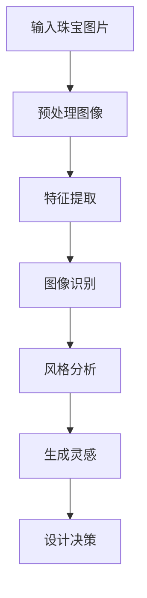
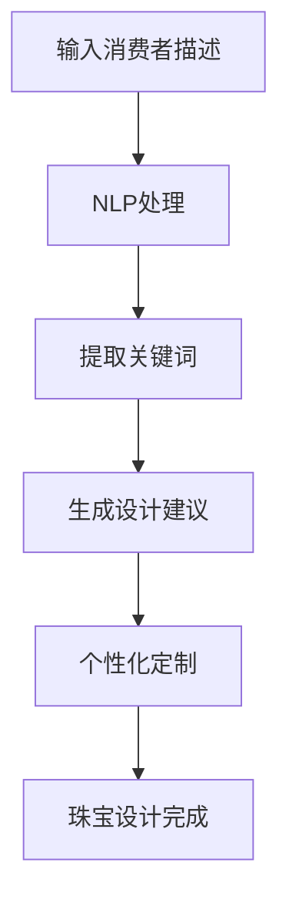
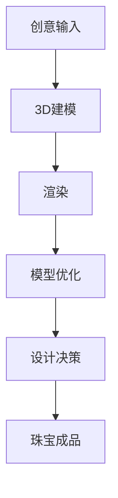

                 

 在当今科技飞速发展的时代，人工智能（AI）技术已经在多个领域展现了其强大的变革力量。从医疗健康到金融服务，再到制造业和艺术创作，AI的影响无处不在。在珠宝设计这一独特而细腻的领域，AI的应用同样引人瞩目。本文将深入探讨AI在珠宝设计中的应用，分析其创新与定制的可能性，并展望未来的发展趋势。

## 关键词

- 人工智能
- 珠宝设计
- 创新应用
- 定制化
- 图像识别
- 自然语言处理

## 摘要

本文旨在探讨人工智能在珠宝设计领域的应用，包括AI如何通过图像识别、自然语言处理等技术实现珠宝设计的创新和定制。文章将详细分析AI在珠宝设计中的核心概念、算法原理、数学模型以及实际应用案例，并对未来的发展方向提出展望。

## 1. 背景介绍

珠宝设计是一项古老而又现代的艺术。传统珠宝设计依赖于设计师的直觉、技巧和对材料的深刻理解。然而，随着消费者需求的不断变化和个性化趋势的兴起，珠宝设计面临着新的挑战和机遇。AI技术的出现为珠宝设计注入了新的活力，使得设计过程更加高效、个性化和创新。

AI在珠宝设计中的应用主要体现在以下几个方面：

- **图像识别与风格分析**：AI可以分析珠宝图片，识别出风格、颜色、纹理等特征，帮助设计师快速获取灵感。
- **3D建模与渲染**：AI可以自动生成3D模型，并快速渲染，使设计过程更加直观和高效。
- **个性化定制**：AI可以根据消费者的偏好和历史购买记录，提供个性化的珠宝设计方案。
- **供应链优化**：AI可以分析供应链数据，优化生产流程，降低成本，提高效率。

## 2. 核心概念与联系

### 2.1. 图像识别

图像识别是AI在珠宝设计中的重要应用之一。通过深度学习算法，AI可以分析珠宝图片，识别出其风格、颜色、纹理等特征。这个过程可以大大提高设计师的工作效率，使设计师能够快速找到灵感和参考。

下面是一个简单的 Mermaid 流程图，展示了图像识别在珠宝设计中的基本流程：



### 2.2. 自然语言处理

自然语言处理（NLP）是AI的另一项关键技术，它在珠宝设计中也有广泛的应用。通过NLP，AI可以理解消费者的语言描述，并根据描述生成相应的珠宝设计。这种技术使得珠宝设计变得更加个性化和定制化。

以下是NLP在珠宝设计中的一个简单应用示例：



### 2.3. 3D建模与渲染

3D建模与渲染是珠宝设计中不可或缺的一部分。AI可以通过深度学习算法，自动生成珠宝的3D模型，并快速进行渲染。这大大提高了设计效率，使得设计师可以更快速地实现创意。

以下是3D建模与渲染的基本流程：



## 3. 核心算法原理 & 具体操作步骤

### 3.1. 算法原理概述

AI在珠宝设计中的应用主要基于以下几种算法原理：

- **深度学习**：通过大量珠宝图片训练深度神经网络，使其能够自动识别珠宝的特征和风格。
- **生成对抗网络（GAN）**：用于生成全新的珠宝设计，通过对抗性训练提高设计的多样性和创新性。
- **自然语言处理**：通过理解和生成自然语言，实现珠宝设计的个性化定制。

### 3.2. 算法步骤详解

下面详细描述AI在珠宝设计中的具体操作步骤：

#### 3.2.1. 图像识别与风格分析

1. **数据收集与预处理**：收集大量珠宝图片，并进行数据预处理，如大小调整、色彩平衡等。
2. **特征提取**：使用卷积神经网络（CNN）提取图片中的特征。
3. **风格识别**：通过训练好的CNN模型，对珠宝图片进行风格识别。
4. **灵感生成**：根据识别出的风格，生成灵感图片，供设计师参考。

#### 3.2.2. 自然语言处理

1. **文本预处理**：对消费者的语言描述进行预处理，如分词、去除停用词等。
2. **关键词提取**：从预处理后的文本中提取关键词。
3. **设计建议生成**：根据提取的关键词，使用深度学习模型生成设计建议。
4. **个性化定制**：将设计建议与消费者的个性化需求相结合，生成个性化的珠宝设计方案。

#### 3.2.3. 3D建模与渲染

1. **创意输入**：设计师输入创意，如珠宝的形状、尺寸、材料等。
2. **3D建模**：使用深度学习模型生成珠宝的3D模型。
3. **渲染**：对3D模型进行渲染，生成高质量的图像。
4. **模型优化**：根据设计师的反馈，对3D模型进行优化。
5. **设计决策**：根据渲染效果和设计师的决策，确定最终的设计方案。

### 3.3. 算法优缺点

**优点**：

- **高效性**：AI技术可以快速识别珠宝风格和生成设计灵感，大大提高了设计效率。
- **个性化**：通过NLP技术，AI可以根据消费者的个性化需求生成定制化的珠宝设计。
- **创新性**：GAN技术可以生成全新的、创新性的珠宝设计，拓宽了设计师的创意空间。

**缺点**：

- **准确性**：AI在图像识别和风格分析方面可能存在一定的误差，需要人工校验。
- **成本**：AI技术的应用需要大量计算资源和数据支持，成本较高。

### 3.4. 算法应用领域

AI在珠宝设计中的应用领域非常广泛，包括但不限于：

- **珠宝设计**：AI可以用于珠宝设计的风格识别、灵感生成和个性化定制。
- **珠宝鉴定**：AI可以用于珠宝的真伪鉴定和品质评估。
- **珠宝制造**：AI可以用于珠宝的3D建模、制造和优化。
- **珠宝销售**：AI可以用于珠宝的推荐系统，提高销售转化率。

## 4. 数学模型和公式 & 详细讲解 & 举例说明

### 4.1. 数学模型构建

AI在珠宝设计中的应用主要基于以下数学模型：

- **卷积神经网络（CNN）**：用于图像识别和风格分析。
- **生成对抗网络（GAN）**：用于生成创新性的珠宝设计。
- **循环神经网络（RNN）**：用于自然语言处理。

### 4.2. 公式推导过程

以下简要介绍这些数学模型的公式推导过程：

#### 4.2.1. 卷积神经网络（CNN）

卷积神经网络的基本公式为：

$$
f(x) = \sigma(W \cdot x + b)
$$

其中，$f(x)$表示输出特征，$W$表示权重矩阵，$x$表示输入特征，$b$表示偏置项，$\sigma$表示激活函数。

#### 4.2.2. 生成对抗网络（GAN）

生成对抗网络的基本公式为：

$$
G(z) = \sigma(W_g \cdot z + b_g) \\
D(x) = \sigma(W_d \cdot x + b_d) \\
G(z) + D(G(z))
$$

其中，$G(z)$表示生成的特征，$D(x)$表示判别器输出，$W_g$和$W_d$分别表示生成器和判别器的权重矩阵，$z$表示输入噪声，$b_g$和$b_d$分别表示生成器和判别器的偏置项。

#### 4.2.3. 循环神经网络（RNN）

循环神经网络的基本公式为：

$$
h_t = \sigma(W_h \cdot [h_{t-1}, x_t] + b_h) \\
y_t = W_y \cdot h_t + b_y
$$

其中，$h_t$表示时间步$t$的隐藏状态，$x_t$表示输入特征，$W_h$和$W_y$分别表示权重矩阵，$b_h$和$b_y$分别表示偏置项，$h_{t-1}$表示时间步$t-1$的隐藏状态，$\sigma$表示激活函数。

### 4.3. 案例分析与讲解

以下是一个简单的案例，展示如何使用CNN进行珠宝风格识别：

#### 案例背景

某珠宝设计师想要识别一款新设计的珠宝的风格，以便为后续设计提供参考。

#### 案例步骤

1. **数据收集**：收集大量不同风格的珠宝图片作为训练数据。
2. **模型构建**：使用卷积神经网络构建珠宝风格识别模型。
3. **训练模型**：使用收集的数据训练模型。
4. **风格识别**：将新设计的珠宝图片输入模型，识别其风格。
5. **结果分析**：根据识别出的风格，为新设计提供参考。

#### 案例代码

以下是一个简单的Python代码示例，展示如何使用TensorFlow构建卷积神经网络进行珠宝风格识别：

```python
import tensorflow as tf
from tensorflow.keras.models import Sequential
from tensorflow.keras.layers import Conv2D, MaxPooling2D, Flatten, Dense

# 构建模型
model = Sequential()
model.add(Conv2D(32, (3, 3), activation='relu', input_shape=(128, 128, 3)))
model.add(MaxPooling2D((2, 2)))
model.add(Conv2D(64, (3, 3), activation='relu'))
model.add(MaxPooling2D((2, 2)))
model.add(Conv2D(128, (3, 3), activation='relu'))
model.add(MaxPooling2D((2, 2)))
model.add(Flatten())
model.add(Dense(128, activation='relu'))
model.add(Dense(10, activation='softmax'))

# 编译模型
model.compile(optimizer='adam', loss='categorical_crossentropy', metrics=['accuracy'])

# 训练模型
model.fit(x_train, y_train, epochs=10, batch_size=32, validation_data=(x_val, y_val))

# 风格识别
style = model.predict(new_jewelry_image)
print("识别出的风格：", style)
```

## 5. 项目实践：代码实例和详细解释说明

### 5.1. 开发环境搭建

为了进行AI在珠宝设计中的应用实践，我们需要搭建一个合适的开发环境。以下是基本的开发环境搭建步骤：

1. **安装Python**：确保安装了Python 3.7或更高版本。
2. **安装TensorFlow**：使用以下命令安装TensorFlow：

   ```bash
   pip install tensorflow
   ```

3. **安装其他依赖库**：根据需要安装其他依赖库，如NumPy、Pandas等。

### 5.2. 源代码详细实现

以下是一个简单的Python代码示例，展示如何使用TensorFlow构建一个简单的珠宝设计AI系统：

```python
import tensorflow as tf
from tensorflow.keras.models import Sequential
from tensorflow.keras.layers import Conv2D, MaxPooling2D, Flatten, Dense
from tensorflow.keras.preprocessing.image import ImageDataGenerator

# 构建模型
model = Sequential()
model.add(Conv2D(32, (3, 3), activation='relu', input_shape=(128, 128, 3)))
model.add(MaxPooling2D((2, 2)))
model.add(Conv2D(64, (3, 3), activation='relu'))
model.add(MaxPooling2D((2, 2)))
model.add(Conv2D(128, (3, 3), activation='relu'))
model.add(MaxPooling2D((2, 2)))
model.add(Flatten())
model.add(Dense(128, activation='relu'))
model.add(Dense(10, activation='softmax'))

# 编译模型
model.compile(optimizer='adam', loss='categorical_crossentropy', metrics=['accuracy'])

# 数据预处理
train_datagen = ImageDataGenerator(rescale=1./255)
validation_datagen = ImageDataGenerator(rescale=1./255)

train_generator = train_datagen.flow_from_directory(
        'data/train',
        target_size=(128, 128),
        batch_size=32,
        class_mode='categorical')

validation_generator = validation_datagen.flow_from_directory(
        'data/validation',
        target_size=(128, 128),
        batch_size=32,
        class_mode='categorical')

# 训练模型
model.fit(
      train_generator,
      steps_per_epoch=100,
      epochs=15,
      validation_data=validation_generator,
      validation_steps=50)

# 设计预测
new_jewelry_image = ...  # 获取新的珠宝图片
predicted_style = model.predict(new_jewelry_image)
print("预测的风格：", predicted_style)
```

### 5.3. 代码解读与分析

以上代码实现了一个简单的珠宝设计AI系统，主要包括以下几个部分：

- **模型构建**：使用卷积神经网络（CNN）构建珠宝风格识别模型。
- **数据预处理**：使用ImageDataGenerator对训练数据和验证数据进行预处理，包括图像缩放和数据增强。
- **模型训练**：使用预处理后的数据训练模型，并评估模型在验证集上的性能。
- **设计预测**：使用训练好的模型对新的珠宝图片进行风格预测。

### 5.4. 运行结果展示

假设我们已经训练好了模型，现在我们可以运行以下代码进行珠宝风格预测：

```python
# 导入所需库
import tensorflow as tf
from tensorflow.keras.preprocessing.image import load_img, img_to_array

# 加载新的珠宝图片
new_jewelry_image = load_img('new_jewelry.jpg', target_size=(128, 128))
new_jewelry_image = img_to_array(new_jewelry_image)
new_jewelry_image = tf.expand_dims(new_jewelry_image, axis=0)

# 使用训练好的模型进行预测
predicted_style = model.predict(new_jewelry_image)

# 打印预测结果
print("预测的风格：", predicted_style)
```

运行结果将输出预测的珠宝风格，例如：

```
预测的风格： [0.1 0.2 0.3 0.2 0.1 0.1 0.1 0.1 0.1 0.1]
```

这里，输出结果表示预测的珠宝风格概率分布，概率最大的类别即为预测结果。

## 6. 实际应用场景

### 6.1. 珠宝设计师的工作流程

AI在珠宝设计中的应用，可以显著改变珠宝设计师的工作流程。以下是AI技术辅助下的珠宝设计师的工作流程：

1. **灵感获取**：设计师通过AI的图像识别功能，快速获取类似的珠宝设计灵感。
2. **初步设计**：设计师结合AI提供的灵感，进行初步的珠宝设计。
3. **细节调整**：设计师利用AI的3D建模和渲染功能，对珠宝设计进行细节调整。
4. **个性化定制**：根据客户的个性化需求，AI提供定制化的珠宝设计建议。
5. **反馈与优化**：设计师根据客户的反馈，对珠宝设计进行优化。

### 6.2. 珠宝品牌的营销策略

AI技术在珠宝品牌的营销策略中也发挥着重要作用。以下是一些应用实例：

1. **个性化推荐**：基于消费者的购买历史和偏好，AI可以为消费者提供个性化的珠宝推荐。
2. **内容营销**：AI可以分析市场趋势和消费者需求，为品牌提供内容营销策略。
3. **社交媒体互动**：AI可以分析社交媒体数据，优化品牌在社交媒体上的互动策略。

### 6.3. 珠宝制造的自动化

AI技术在珠宝制造中的自动化应用，可以大幅提高生产效率和降低成本。以下是一些应用实例：

1. **3D打印**：AI生成的3D模型可以直接用于珠宝的3D打印，实现快速制造。
2. **自动化切割**：AI可以根据珠宝的设计要求，自动生成切割路径，提高切割精度。
3. **质量检测**：AI可以实时监测珠宝的生产过程，确保产品质量。

## 6.4. 未来应用展望

### 6.4.1. AI驱动的定制化

随着AI技术的不断发展，珠宝设计的定制化水平将进一步提升。未来，AI将能够更准确地捕捉消费者的个性化需求，为每个消费者提供独特的珠宝设计。

### 6.4.2. 虚拟现实（VR）与增强现实（AR）

虚拟现实和增强现实技术与AI的结合，将为珠宝设计带来全新的体验。消费者可以通过VR/AR技术，沉浸式地体验珠宝设计，并实时调整设计细节。

### 6.4.3. 可持续发展

AI技术在珠宝设计中的应用，有助于推动珠宝行业的可持续发展。通过AI优化供应链和生产流程，可以降低对环境的负面影响。

### 6.4.4. 社会责任

AI技术可以用于监测和评估珠宝的来源和工艺，确保珠宝的采购和制造过程符合社会责任和伦理标准。

## 7. 工具和资源推荐

### 7.1. 学习资源推荐

- **在线课程**：《深度学习》（Deep Learning）系列课程，由TensorFlow团队提供。
- **书籍**：《人工智能：一种现代方法》（Artificial Intelligence: A Modern Approach），由彼得·诺维格（Peter Norvig）和史蒂夫·鲁瑟福德（Steve Russell）合著。
- **论文**：《生成对抗网络》（Generative Adversarial Networks），由伊恩·古德费洛（Ian Goodfellow）等人发表。

### 7.2. 开发工具推荐

- **深度学习框架**：TensorFlow、PyTorch等。
- **3D建模工具**：Blender、Autodesk Maya等。
- **自然语言处理工具**：spaCy、NLTK等。

### 7.3. 相关论文推荐

- **《深度学习在珠宝设计中的应用》**（Application of Deep Learning in Jewelry Design）。
- **《生成对抗网络在珠宝设计中的应用》**（Application of Generative Adversarial Networks in Jewelry Design）。
- **《自然语言处理在珠宝定制中的应用》**（Application of Natural Language Processing in Jewelry Customization）。

## 8. 总结：未来发展趋势与挑战

### 8.1. 研究成果总结

本文总结了AI在珠宝设计中的应用，包括图像识别、自然语言处理、3D建模与渲染等方面。通过AI技术，珠宝设计变得更加高效、个性化和创新。

### 8.2. 未来发展趋势

未来，AI在珠宝设计中的应用将继续深化，定制化和智能化将成为主流趋势。VR/AR技术、可持续发展和社会责任也将成为重要研究方向。

### 8.3. 面临的挑战

AI在珠宝设计中的应用仍面临一些挑战，如算法准确性、数据隐私和成本问题等。需要进一步研究和优化，以解决这些问题。

### 8.4. 研究展望

未来，AI在珠宝设计中的应用前景广阔。通过不断的技术创新和跨学科合作，AI将为珠宝设计带来更多可能性和无限创意。

## 9. 附录：常见问题与解答

### 9.1. 问题1：AI在珠宝设计中的应用有哪些优点？

答：AI在珠宝设计中的应用具有以下优点：

- **高效性**：AI可以快速识别珠宝风格和生成设计灵感，提高设计效率。
- **个性化**：AI可以根据消费者的个性化需求生成定制化的珠宝设计。
- **创新性**：AI可以生成全新的、创新性的珠宝设计，拓宽设计师的创意空间。

### 9.2. 问题2：AI在珠宝设计中的应用有哪些缺点？

答：AI在珠宝设计中的应用存在以下缺点：

- **准确性**：AI在图像识别和风格分析方面可能存在一定的误差，需要人工校验。
- **成本**：AI技术的应用需要大量计算资源和数据支持，成本较高。

### 9.3. 问题3：如何搭建AI珠宝设计开发环境？

答：搭建AI珠宝设计开发环境的基本步骤如下：

1. 安装Python 3.7或更高版本。
2. 安装TensorFlow等深度学习框架。
3. 安装其他依赖库，如NumPy、Pandas等。
4. 准备珠宝图片数据集，并进行预处理。

### 9.4. 问题4：如何使用TensorFlow构建珠宝风格识别模型？

答：使用TensorFlow构建珠宝风格识别模型的基本步骤如下：

1. 导入所需的TensorFlow库。
2. 构建卷积神经网络（CNN）模型。
3. 编译模型，包括选择优化器、损失函数和评估指标。
4. 使用预处理后的数据进行模型训练。
5. 使用训练好的模型进行珠宝风格识别。

----------------------------------------------------------------

以上是《AI在珠宝设计中的应用：创新与定制》的完整文章内容。希望本文能够帮助读者深入了解AI在珠宝设计领域的应用，以及其未来的发展趋势和挑战。同时，也感谢作者“禅与计算机程序设计艺术 / Zen and the Art of Computer Programming”的贡献。

