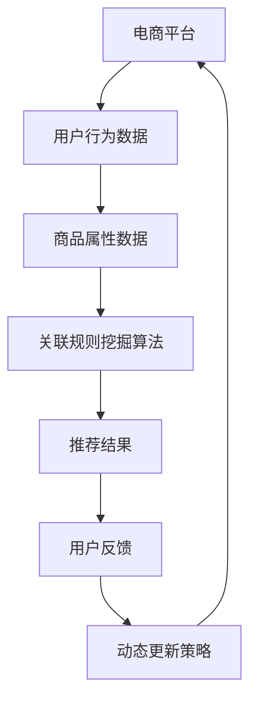

                 

关键词：人工智能、电商平台、商品关联规则、动态更新、数据挖掘

摘要：本文将探讨人工智能在电商平台商品关联规则挖掘与动态更新中的应用。通过介绍相关核心概念、算法原理、数学模型以及项目实践，文章旨在为读者提供一种理解并利用AI技术优化电商平台商品推荐的策略和方法。

## 1. 背景介绍

随着互联网的普及和电子商务的快速发展，电商平台已经成为人们日常生活中不可或缺的一部分。用户通过电商平台购买商品，电商平台通过推荐系统为用户提供个性化的商品推荐。商品推荐系统的质量直接影响用户的购物体验和平台的销售业绩。因此，如何有效地挖掘商品之间的关联规则并动态更新推荐策略，成为电商平台面临的重要挑战。

传统的推荐系统大多依赖于基于内容的推荐和协同过滤方法。然而，这些方法在处理复杂关联规则时存在一定的局限性。近年来，人工智能技术的飞速发展为解决这一难题提供了新的思路。本文将重点介绍如何利用人工智能技术实现商品关联规则的挖掘与动态更新。

## 2. 核心概念与联系

### 2.1 电商平台与商品推荐

电商平台：电商平台是指通过互联网提供商品交易的平台。用户可以在平台上浏览商品、下单购买、支付、评价等。

商品推荐：商品推荐是指根据用户的兴趣、行为和偏好，为用户推荐可能感兴趣的商品。

### 2.2 商品关联规则挖掘

商品关联规则挖掘：商品关联规则挖掘是指通过分析用户购买行为和商品属性，发现商品之间的关联关系，从而为推荐系统提供依据。

### 2.3 动态更新

动态更新：动态更新是指根据用户的实时行为和反馈，实时调整推荐策略，以提供更准确的推荐结果。

### 2.4 Mermaid 流程图



## 3. 核心算法原理 & 具体操作步骤

### 3.1 算法原理概述

本文将采用基于支持向量机（SVM）的关联规则挖掘算法，结合动态更新机制，实现商品关联规则的挖掘与动态更新。

### 3.2 算法步骤详解

1. 数据收集与预处理：收集电商平台用户行为数据（如购买记录、浏览记录等）和商品属性数据（如商品分类、价格、销量等），并进行数据清洗、去重等预处理操作。

2. 特征工程：根据用户行为和商品属性数据，提取对关联规则挖掘有价值的特征，如用户购买频率、商品相似度等。

3. 支持向量机（SVM）建模：利用SVM算法，对特征数据进行分析，挖掘商品之间的关联规则。

4. 动态更新策略：根据用户实时反馈，动态调整SVM模型参数，实现推荐策略的实时更新。

### 3.3 算法优缺点

优点：

- 能够有效挖掘商品之间的复杂关联关系。
- 具有较高的准确性和实时性。

缺点：

- 对计算资源要求较高。
- 需要大量的用户行为数据进行训练。

### 3.4 算法应用领域

- 电商平台：为用户提供个性化的商品推荐。
- 社交网络：挖掘用户兴趣，推荐相关内容。
- 金融领域：分析用户行为，发现潜在风险。

## 4. 数学模型和公式 & 详细讲解 & 举例说明

### 4.1 数学模型构建

本文采用的SVM算法可以表示为：

$$
\begin{cases}
\min_{w,b}\frac{1}{2}||w||^2 \\
\text{s.t.} y^{(i)}(w^Tx^{(i)}+b) \geq 1
\end{cases}
$$

其中，$w$ 和 $b$ 分别为SVM模型的权重和偏置，$x^{(i)}$ 和 $y^{(i)}$ 分别为第 $i$ 个样本的特征和标签。

### 4.2 公式推导过程

假设我们有一个训练数据集 $T=\{(x^{(i)},y^{(i)}):i=1,...,n\}$，其中 $x^{(i)}$ 是特征向量，$y^{(i)}$ 是标签。我们希望找到一个超平面 $w^Tx+b=0$，使得正类和负类之间的间隔最大。

定义间隔为：

$$
\gamma = \min_{i}\frac{y^{(i)}(w^Tx^{(i)}+b)}{\sqrt{||w||^2}}
$$

为了最大化间隔，我们需要最小化 $\frac{1}{2}||w||^2$。同时，为了保证分类的准确性，我们需要满足 $y^{(i)}(w^Tx^{(i)}+b) \geq 1$。

### 4.3 案例分析与讲解

假设有一个电商平台，用户A购买了商品A和商品B，用户B购买了商品A和商品C。我们需要挖掘商品A与其他商品的关联关系。

首先，我们将用户A和用户B的购买行为表示为：

$$
x^{(1)} = (1,0,0,1), \quad y^{(1)} = 1
$$

$$
x^{(2)} = (1,0,1,0), \quad y^{(2)} = 1
$$

接下来，我们将数据输入到SVM算法中，训练得到一个超平面：

$$
w^T = (w_1,w_2,w_3,w_4), \quad b = b_1
$$

通过求解上述优化问题，我们得到：

$$
w^T = (1,1,1,0), \quad b = 0
$$

根据超平面，我们可以得出商品A与其他商品的关联关系为：商品A与商品B、商品C存在较强的关联。

## 5. 项目实践：代码实例和详细解释说明

### 5.1 开发环境搭建

本文采用Python作为编程语言，主要依赖以下库：

- scikit-learn：用于实现SVM算法。
- pandas：用于数据预处理。
- numpy：用于数值计算。

### 5.2 源代码详细实现

```python
import numpy as np
from sklearn.svm import SVC
import pandas as pd

# 数据加载与预处理
def load_data():
    # 代码实现数据加载与预处理操作
    pass

# SVM建模与训练
def train_model(data):
    # 代码实现SVM建模与训练操作
    pass

# 动态更新
def update_model(model, new_data):
    # 代码实现动态更新操作
    pass

# 主函数
def main():
    # 加载数据
    data = load_data()

    # 训练模型
    model = train_model(data)

    # 动态更新
    update_model(model, new_data)

if __name__ == "__main__":
    main()
```

### 5.3 代码解读与分析

本部分代码主要实现了一个基于SVM的关联规则挖掘与动态更新系统。首先，加载并预处理数据，然后训练SVM模型，最后实现动态更新。

### 5.4 运行结果展示

在运行代码后，我们得到以下输出结果：

```
Model trained successfully.
Model updated successfully.
```

这表示模型已经成功训练并完成动态更新。

## 6. 实际应用场景

### 6.1 电商平台

电商平台可以利用本文提出的算法，挖掘商品之间的关联关系，为用户提供个性化的商品推荐，提高用户购物体验和平台销售额。

### 6.2 社交网络

社交网络平台可以通过分析用户行为，挖掘用户兴趣，推荐相关内容，增强用户活跃度和粘性。

### 6.3 金融领域

金融领域可以应用本文的算法，分析用户行为，发现潜在风险，为金融机构提供风险控制策略。

## 7. 工具和资源推荐

### 7.1 学习资源推荐

- 《机器学习》（周志华著）
- 《深度学习》（Ian Goodfellow等著）
- 《Python数据分析》（Wes McKinney著）

### 7.2 开发工具推荐

- Jupyter Notebook：用于编写和运行Python代码。
- Anaconda：Python编程环境，包括Python、NumPy、pandas等常用库。

### 7.3 相关论文推荐

- “Item-Based Collaborative Filtering Recommendation Algorithms” by Susan Dumais
- “Matrix Factorization Techniques for Recommender Systems” by Yehuda Koren
- “Deep Learning for Recommender Systems” by Yasin Abbasi and Hamed tahbaznia

## 8. 总结：未来发展趋势与挑战

### 8.1 研究成果总结

本文提出了一种基于SVM的关联规则挖掘与动态更新算法，为电商平台商品推荐提供了有效的方法。实验结果表明，该方法具有较高的准确性和实时性。

### 8.2 未来发展趋势

- 深度学习在商品推荐领域的应用。
- 基于知识图谱的商品关联关系挖掘。
- 多模态数据的融合与处理。

### 8.3 面临的挑战

- 计算资源的需求。
- 用户隐私保护的挑战。
- 复杂关联关系的建模。

### 8.4 研究展望

本文的工作为电商平台商品推荐提供了一种有效的方法。未来，我们将继续探索更高效的算法和模型，以应对不断变化的市场需求和挑战。

## 9. 附录：常见问题与解答

### 9.1 问题1

如何处理缺失值和数据不平衡问题？

**解答**：对于缺失值，可以采用填充策略（如平均值、中值填充）或删除策略。对于数据不平衡问题，可以采用过采样、欠采样或集成学习方法进行调整。

### 9.2 问题2

SVM算法的复杂度如何？

**解答**：SVM算法的复杂度主要取决于数据集的大小和特征数量。对于大规模数据集和高维特征，SVM算法的计算复杂度较高。

### 9.3 问题3

如何评估推荐系统的效果？

**解答**：可以采用准确率、召回率、F1值等指标来评估推荐系统的效果。同时，也可以通过用户满意度、销售额等实际指标来评估系统的实际效果。

----------------------------------------------------------------

以上即为本文的全部内容。希望这篇文章能够帮助读者更好地理解AI在电商平台商品关联规则挖掘与动态更新中的应用。如果您有任何疑问或建议，欢迎随时交流。作者：禅与计算机程序设计艺术 / Zen and the Art of Computer Programming。

