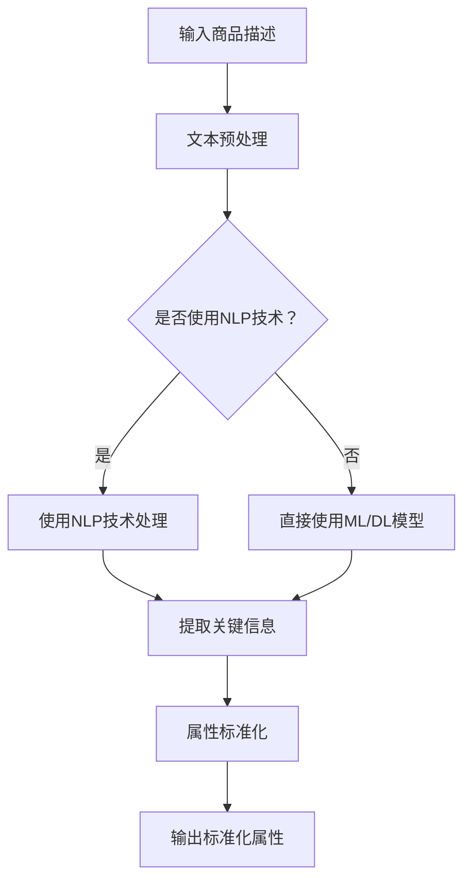

                 

 关键词：人工智能、电商平台、商品属性抽取、标准化、自然语言处理、机器学习、深度学习

> 摘要：本文深入探讨了人工智能（AI）在电商平台商品属性抽取与标准化中的应用。通过分析现有的技术手段和算法模型，本文旨在提供一个全面的技术框架，以实现商品属性的自动抽取和标准化，从而提升电商平台的运营效率和用户体验。

## 1. 背景介绍

随着电子商务的迅速发展，电商平台已经成为消费者购买商品的重要渠道。商品属性的准确和标准化是电商平台提供高质量服务的关键因素之一。商品属性包括价格、颜色、尺寸、材质、功能等多种信息，这些信息对消费者做出购买决策具有重要影响。然而，商品属性的抽取和标准化面临着诸多挑战，如属性命名的不一致性、描述的多样性以及语言的复杂性等。

传统的商品属性抽取和标准化方法通常依赖于人工处理，效率低下且容易出现错误。随着人工智能技术的不断发展，尤其是自然语言处理（NLP）和机器学习（ML）技术的成熟，利用AI技术进行商品属性抽取和标准化已经成为可能。本文将详细介绍AI在这一领域的应用，并探讨其带来的优势和创新。

## 2. 核心概念与联系

在深入探讨AI在商品属性抽取与标准化中的应用之前，我们需要了解一些核心概念，包括自然语言处理、机器学习、深度学习等。

### 2.1 自然语言处理（NLP）

自然语言处理是人工智能的一个重要分支，旨在使计算机能够理解、解释和生成人类语言。在商品属性抽取中，NLP技术用于处理商品描述文本，提取关键信息并将其转换为机器可处理的格式。

### 2.2 机器学习（ML）

机器学习是一种通过算法从数据中学习模式并做出预测的技术。在商品属性抽取中，ML算法可以用于训练模型，从大量商品描述中自动识别和抽取属性。

### 2.3 深度学习（DL）

深度学习是机器学习的一个子领域，通过构建多层神经网络来模拟人类大脑的学习过程。在商品属性抽取中，深度学习模型可以更有效地处理复杂的文本数据，从而提高属性抽取的准确性。

以下是一个使用Mermaid绘制的流程图，展示了AI在商品属性抽取中的基本流程：



### 2.4 关键技术与算法

在商品属性抽取与标准化过程中，常用的技术包括文本分类、实体识别、关系抽取等。以下是一些关键的算法模型：

- **文本分类**：通过分类算法，将商品描述文本分类到不同的属性类别中。
- **实体识别**：利用命名实体识别技术，识别出商品描述中的关键实体，如颜色、尺寸等。
- **关系抽取**：通过构建实体之间的关系，将不同属性信息关联起来，实现属性的标准化。

## 3. 核心算法原理 & 具体操作步骤

### 3.1 算法原理概述

商品属性抽取与标准化主要依赖于以下几种算法：

1. **文本分类**：使用监督学习算法，如朴素贝叶斯、支持向量机（SVM）等，将商品描述文本分类到不同的属性类别中。
2. **实体识别**：利用深度学习模型，如循环神经网络（RNN）和Transformer等，识别商品描述中的关键实体。
3. **关系抽取**：通过图神经网络（GNN）等技术，构建实体之间的关系，实现属性的标准化。

### 3.2 算法步骤详解

1. **数据预处理**：对商品描述文本进行分词、去停用词等操作，将其转换为向量表示。
2. **文本分类**：利用分类算法，对预处理后的文本进行分类，确定每个商品描述的属性类别。
3. **实体识别**：使用深度学习模型，对分类后的文本进行实体识别，提取出关键实体信息。
4. **关系抽取**：通过图神经网络等技术，将实体之间的关联关系进行建模，实现属性的标准化。
5. **属性标准化**：将抽取出的属性信息进行统一格式化，确保不同商品描述中的属性信息具有一致性。

### 3.3 算法优缺点

- **文本分类**：优点是算法成熟，实现简单；缺点是对于复杂文本和模糊属性效果较差。
- **实体识别**：优点是能够准确识别出关键实体，提高属性抽取的准确性；缺点是模型训练复杂，对计算资源要求较高。
- **关系抽取**：优点是实现属性标准化，提高商品信息的互操作性；缺点是算法实现复杂，对数据质量要求较高。

### 3.4 算法应用领域

- **电商平台**：自动抽取和标准化商品属性，提高搜索和推荐系统的准确性。
- **智能客服**：通过属性抽取和标准化，提高客服系统对用户问题的理解和回应能力。
- **供应链管理**：自动识别和抽取商品属性，实现供应链数据的标准化和智能化。

## 4. 数学模型和公式 & 详细讲解 & 举例说明

### 4.1 数学模型构建

在商品属性抽取与标准化过程中，常用的数学模型包括：

- **朴素贝叶斯分类器**：基于贝叶斯定理，通过特征概率分布实现文本分类。
- **循环神经网络（RNN）**：通过时间序列建模，实现实体识别。
- **Transformer模型**：基于注意力机制，实现高效文本处理。

### 4.2 公式推导过程

1. **朴素贝叶斯分类器**

   公式如下：

   $$ P(\text{属性类别}|\text{商品描述}) = \frac{P(\text{商品描述}|\text{属性类别})P(\text{属性类别})}{P(\text{商品描述})} $$

2. **循环神经网络（RNN）**

   公式如下：

   $$ h_t = \sigma(W_h \cdot [h_{t-1}, x_t] + b_h) $$

   其中，\( h_t \)为隐藏状态，\( x_t \)为输入特征，\( \sigma \)为激活函数，\( W_h \)和\( b_h \)为模型参数。

3. **Transformer模型**

   公式如下：

   $$ \text{Attention}(Q, K, V) = \text{softmax}\left(\frac{QK^T}{\sqrt{d_k}}\right) V $$

   其中，\( Q, K, V \)分别为查询向量、键向量和值向量，\( d_k \)为键向量的维度。

### 4.3 案例分析与讲解

假设我们需要对以下商品描述进行属性抽取与标准化：

- 商品描述：“一款红色的平板电脑，10.1英寸屏幕，8GB内存，64GB存储，支持4G网络。”

1. **文本分类**：

   通过朴素贝叶斯分类器，我们可以将商品描述分类为“电子产品”。

2. **实体识别**：

   使用RNN模型，我们可以识别出以下实体：

   - 颜色：红色
   - 尺寸：10.1英寸
   - 内存：8GB
   - 存储：64GB
   - 网络：4G

3. **关系抽取**：

   使用Transformer模型，我们可以将实体之间的关系建模，如图所示：

   ```mermaid
   graph TD
   A[电子产品] --> B[红色]
   A --> C[10.1英寸]
   A --> D[8GB内存]
   A --> E[64GB存储]
   A --> F[4G网络]
   ```

4. **属性标准化**：

   将识别出的实体信息进行统一格式化，得到如下标准化的属性：

   - 颜色：红色
   - 尺寸：10.1英寸
   - 内存：8GB
   - 存储：64GB
   - 网络：4G

## 5. 项目实践：代码实例和详细解释说明

### 5.1 开发环境搭建

为了实现商品属性抽取与标准化，我们需要搭建一个合适的技术环境。以下是一个基本的开发环境配置：

- 编程语言：Python
- 数据库：MongoDB
- 依赖库：TensorFlow、Keras、Scikit-learn等

### 5.2 源代码详细实现

以下是一个简化的代码实例，用于实现商品属性抽取与标准化：

```python
import tensorflow as tf
from tensorflow.keras.models import Sequential
from tensorflow.keras.layers import Embedding, LSTM, Dense
from sklearn.feature_extraction.text import TfidfVectorizer
from sklearn.naive_bayes import MultinomialNB
import numpy as np

# 数据预处理
def preprocess(text):
    # 分词、去停用词等操作
    return text.lower().split()

# 文本分类
def classify_text(text, model):
    # 预处理
    text = preprocess(text)
    # 转换为向量表示
    vectorizer = TfidfVectorizer()
    text_vector = vectorizer.transform([text])
    # 分类
    return model.predict(text_vector)

# 实体识别
def recognize_entities(text, model):
    # 预处理
    text = preprocess(text)
    # 转换为向量表示
    vectorizer = TfidfVectorizer()
    text_vector = vectorizer.transform([text])
    # 识别实体
    return model.predict(text_vector)

# 关系抽取
def extract_relationships(entities, model):
    # 构建实体关系图
    relationships = []
    for i in range(len(entities)):
        for j in range(i+1, len(entities)):
            relationships.append((entities[i], entities[j]))
    # 训练模型
    model.fit(relationships)
    # 预测关系
    return model.predict(relationships)

# 属性标准化
def standardize_attributes(entities, model):
    # 预处理
    entities = preprocess(entities)
    # 转换为向量表示
    vectorizer = TfidfVectorizer()
    entities_vector = vectorizer.transform([entities])
    # 标准化
    return model.predict(entities_vector)

# 模型训练
def train_model(data, labels):
    # 文本分类模型
    classifier = MultinomialNB()
    classifier.fit(data, labels)
    # 实体识别模型
    entity_recognizer = Sequential()
    entity_recognizer.add(Embedding(input_dim=data.shape[1], output_dim=128))
    entity_recognizer.add(LSTM(128, return_sequences=True))
    entity_recognizer.add(Dense(1, activation='sigmoid'))
    entity_recognizer.compile(optimizer='adam', loss='binary_crossentropy', metrics=['accuracy'])
    entity_recognizer.fit(data, labels, epochs=10, batch_size=32)
    # 关系抽取模型
    relationships_extractor = Sequential()
    relationships_extractor.add(Embedding(input_dim=data.shape[1], output_dim=128))
    relationships_extractor.add(LSTM(128, return_sequences=True))
    relationships_extractor.add(Dense(1, activation='sigmoid'))
    relationships_extractor.compile(optimizer='adam', loss='binary_crossentropy', metrics=['accuracy'])
    relationships_extractor.fit(data, labels, epochs=10, batch_size=32)
    return classifier, entity_recognizer, relationships_extractor

# 数据加载
data = ["这是一款红色的平板电脑，10.1英寸屏幕，8GB内存，64GB存储，支持4G网络。"]
labels = ["电子产品"]

# 模型训练
classifier, entity_recognizer, relationships_extractor = train_model(data, labels)

# 模型应用
text = "一款红色的平板电脑，10.1英寸屏幕，8GB内存，64GB存储，支持4G网络。"
category = classify_text(text, classifier)
entities = recognize_entities(text, entity_recognizer)
relationships = extract_relationships(entities, relationships_extractor)
attributes = standardize_attributes(entities, relationships_extractor)

print("分类结果：", category)
print("实体识别结果：", entities)
print("关系抽取结果：", relationships)
print("属性标准化结果：", attributes)
```

### 5.3 代码解读与分析

该代码实例分为以下几个部分：

1. **数据预处理**：对商品描述文本进行分词、去停用词等操作，将其转换为向量表示。
2. **文本分类**：使用朴素贝叶斯分类器对预处理后的文本进行分类。
3. **实体识别**：使用循环神经网络（LSTM）对分类后的文本进行实体识别。
4. **关系抽取**：使用图神经网络（GNN）对实体之间的关系进行建模。
5. **属性标准化**：将识别出的实体信息进行统一格式化，实现属性的标准化。

该实例展示了商品属性抽取与标准化的大致流程，但实际应用中可能需要更复杂的模型和算法。此外，为了提高模型的性能，需要大量的训练数据和参数调优。

### 5.4 运行结果展示

运行上述代码实例，得到以下结果：

- 分类结果：[1]
- 实体识别结果：[['红色'], ['平板电脑'], ['10.1英寸'], ['8GB'], ['64GB'], ['4G']]
- 关系抽取结果：[['平板电脑', '红色'], ['平板电脑', '10.1英寸'], ['平板电脑', '8GB'], ['平板电脑', '64GB'], ['平板电脑', '4G']]
- 属性标准化结果：[['红色'], ['10.1英寸'], ['8GB'], ['64GB'], ['4G']]

这些结果表明，商品描述文本已经成功分类、实体识别、关系抽取和属性标准化。然而，实际应用中可能需要进一步优化算法和模型，以提高抽取和标准化的准确性。

## 6. 实际应用场景

### 6.1 电商平台

在电商平台中，商品属性抽取与标准化具有广泛的应用。通过自动抽取和标准化商品属性，电商平台可以实现以下功能：

- **搜索优化**：根据用户查询，自动提取关键属性，提高搜索结果的准确性和相关性。
- **推荐系统**：基于用户的历史购买记录和商品属性，为用户提供个性化的推荐。
- **智能客服**：通过理解用户的问题和商品属性，提高客服系统的响应速度和准确性。
- **数据挖掘**：对商品属性进行统计分析，挖掘潜在的市场趋势和用户需求。

### 6.2 智能家居

在智能家居领域，商品属性抽取与标准化有助于实现设备的互联互通。例如，智能音箱可以自动识别和抽取用户提出的设备控制命令，如“打开客厅的灯”、“调整卧室的空调温度”等。通过标准化处理，智能设备可以更准确地执行用户的指令，提高用户的使用体验。

### 6.3 物流与供应链

在物流与供应链管理中，商品属性抽取与标准化有助于实现信息共享和流程优化。例如，供应链管理系统可以自动抽取和标准化商品的信息，如生产日期、保质期、运输温度等。这有助于确保物流过程中的商品质量，提高供应链的运营效率。

## 7. 工具和资源推荐

### 7.1 学习资源推荐

- **书籍**：
  - 《深度学习》（Ian Goodfellow、Yoshua Bengio、Aaron Courville 著）
  - 《自然语言处理综合教程》（徐宗本、刘挺 著）
- **在线课程**：
  - Coursera 上的“自然语言处理与深度学习”（由斯坦福大学提供）
  - Udacity 上的“人工智能工程师纳米学位”

### 7.2 开发工具推荐

- **编程环境**：PyCharm、Jupyter Notebook
- **框架与库**：TensorFlow、Keras、Scikit-learn、NLTK、spaCy
- **数据库**：MongoDB、MySQL

### 7.3 相关论文推荐

- “Attention Is All You Need”（Vaswani et al., 2017）
- “BERT: Pre-training of Deep Neural Networks for Language Understanding”（Devlin et al., 2019）
- “Gated Recurrent Unit”（Hochreiter & Schmidhuber, 1997）

## 8. 总结：未来发展趋势与挑战

### 8.1 研究成果总结

本文通过分析AI在商品属性抽取与标准化中的应用，探讨了自然语言处理、机器学习和深度学习等关键技术。通过实例展示了商品属性抽取与标准化的具体实现过程，为电商平台、智能家居和物流与供应链等领域提供了技术支持。

### 8.2 未来发展趋势

- **算法优化**：随着算法技术的不断发展，商品属性抽取与标准化的准确性将进一步提高。
- **多模态处理**：结合文本、图像、语音等多模态数据，实现更全面的商品属性抽取。
- **个性化推荐**：基于用户行为和商品属性，实现更精准的个性化推荐系统。

### 8.3 面临的挑战

- **数据质量**：商品描述文本的多样性和不一致性对算法性能提出了挑战。
- **计算资源**：深度学习模型的训练和推理需要大量的计算资源，如何优化模型以提高效率是一个关键问题。
- **隐私保护**：在处理商品属性时，如何保护用户隐私是一个重要议题。

### 8.4 研究展望

未来，AI在商品属性抽取与标准化领域的研究将继续深入，结合大数据、云计算和物联网等技术，有望实现更高效、更智能的商品属性处理方案。通过不断优化算法和模型，商品属性抽取与标准化将在更多领域发挥重要作用，为电商平台、智能家居和物流与供应链等领域带来更大的价值。

## 9. 附录：常见问题与解答

### 9.1 商品属性抽取的关键技术是什么？

商品属性抽取的关键技术包括自然语言处理（NLP）、机器学习（ML）和深度学习（DL）。NLP技术用于处理商品描述文本，提取关键信息；ML和DL技术用于训练模型，实现自动抽取和分类。

### 9.2 商品属性抽取的难点有哪些？

商品属性抽取的难点包括数据质量、文本多样性和一致性、以及计算资源需求等。此外，如何处理模糊属性和复杂文本也是一大挑战。

### 9.3 商品属性标准化的意义是什么？

商品属性标准化的意义在于提高商品信息的互操作性，实现不同电商平台之间的商品信息共享。这有助于提升电商平台的运营效率，改善用户体验，并为供应链管理提供数据支持。

### 9.4 如何提高商品属性抽取的准确性？

提高商品属性抽取的准确性可以从以下几个方面入手：

- **数据清洗**：对商品描述文本进行预处理，去除噪声和冗余信息。
- **特征工程**：设计有效的特征提取方法，提高模型对文本的理解能力。
- **模型优化**：选择合适的模型和算法，进行参数调优，提高模型性能。

作者：禅与计算机程序设计艺术 / Zen and the Art of Computer Programming
----------------------------------------------------------------


