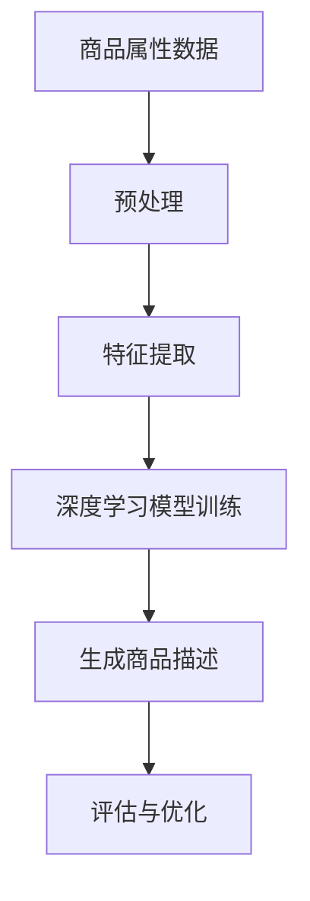

                 

关键词：人工智能、电商平台、商品描述、生成模型、自然语言处理、深度学习

> 摘要：随着电子商务的迅速发展，用户对于商品描述的质量和个性化的需求日益增长。本文探讨了人工智能，特别是深度学习在电商平台商品描述生成中的应用，分析了核心算法原理、数学模型及其在实际项目中的实践，并展望了未来的发展趋势和面临的挑战。

## 1. 背景介绍

随着互联网的普及和技术的进步，电子商务已经成为现代商业的重要组成部分。电商平台不仅提供了丰富的商品种类，还为消费者提供了便捷的购物体验。然而，商品描述的质量直接影响到消费者的购买决策。传统的人工撰写商品描述不仅耗时费力，而且难以保证描述的个性化和准确性。因此，人工智能技术，尤其是自然语言处理（NLP）和深度学习，在商品描述生成中的应用变得尤为重要。

### 电商平台商品描述的重要性

电商平台商品描述是消费者了解商品的重要途径，好的商品描述能提高产品的销量，提升用户体验。然而，撰写高质量的描述需要具备一定的写作技巧和行业知识，这对于电商平台来说是一项巨大的挑战。因此，通过人工智能技术自动生成商品描述，不仅能够提高效率，还能保证描述的个性化和一致性。

### 人工智能技术在商品描述生成中的应用现状

目前，人工智能技术在商品描述生成中已取得显著进展。一些大型电商平台已经开始采用自然语言生成（NLG）技术来自动生成商品描述。例如，亚马逊和阿里巴巴等平台利用机器学习算法和深度学习技术，对商品数据库中的信息进行自动化提取和重组，生成具有吸引力的商品描述。这些技术不仅能够提高商品描述的质量，还能够满足大规模商品实时更新的需求。

## 2. 核心概念与联系

### 自然语言处理（NLP）

自然语言处理是人工智能的一个重要分支，它涉及计算机如何理解和生成自然语言。在商品描述生成中，NLP技术主要用于处理和分析文本数据，提取关键词、主题和情感。

### 深度学习

深度学习是一种基于多层神经网络的学习方法，它在图像识别、语音识别等领域取得了巨大的成功。在商品描述生成中，深度学习模型可以自动学习大量的商品描述文本数据，从而生成高质量的描述。

### 生成模型

生成模型是一种用于生成新数据的机器学习模型，它可以基于已有的数据分布生成新的数据。在商品描述生成中，生成模型可以用于从商品属性中生成个性化的描述文本。

### Mermaid 流程图



在上述流程中，商品属性数据经过预处理和特征提取后，输入到深度学习模型中进行训练。训练完成后，模型可以生成商品描述，并通过评估和优化进一步提高描述质量。

## 3. 核心算法原理 & 具体操作步骤

### 3.1 算法原理概述

在商品描述生成中，常用的深度学习模型包括序列到序列（Seq2Seq）模型、生成对抗网络（GAN）和变分自编码器（VAE）等。

- **Seq2Seq模型**：通过编码器将输入序列（商品属性）转换为隐藏状态，然后通过解码器将这些隐藏状态转换为输出序列（商品描述）。
- **GAN模型**：由生成器和判别器组成，生成器生成商品描述，判别器判断生成的描述是否真实。
- **VAE模型**：通过编码器和解码器学习数据分布，生成具有多样性的商品描述。

### 3.2 算法步骤详解

1. **数据预处理**：对商品属性数据进行清洗、去重和分词等操作，将文本数据转换为适合深度学习模型处理的形式。
2. **特征提取**：使用词嵌入技术将单词转换为向量表示，并提取文本数据的语法和语义特征。
3. **模型训练**：将预处理后的数据输入到深度学习模型中，通过反向传播算法进行参数更新，使模型能够生成高质量的描述。
4. **商品描述生成**：使用训练好的模型，根据商品属性生成描述文本。
5. **评估与优化**：通过评估指标（如BLEU分数、ROUGE分数等）对生成的描述进行评估，并根据评估结果对模型进行调整和优化。

### 3.3 算法优缺点

- **优点**：
  - 提高商品描述生成效率，降低人力成本。
  - 生成的描述具有个性化，能够满足不同消费者的需求。
  - 可以自动处理大规模商品的实时更新。
- **缺点**：
  - 需要大量的训练数据和计算资源。
  - 生成的描述可能存在一定程度的模板化和重复性。
  - 需要不断优化和调整模型参数，以提高描述质量。

### 3.4 算法应用领域

- **电商平台**：自动生成商品描述，提高用户购买体验。
- **内容生成**：生成新闻文章、博客等文本内容。
- **客户服务**：自动生成客服回复，提高客户满意度。
- **教育领域**：生成个性化的教学材料，满足不同学习者的需求。

## 4. 数学模型和公式 & 详细讲解 & 举例说明

### 4.1 数学模型构建

在商品描述生成中，常用的数学模型包括词嵌入模型、序列到序列（Seq2Seq）模型和生成对抗网络（GAN）等。

- **词嵌入模型**：将单词转换为低维向量表示，用于特征提取和生成。
- **Seq2Seq模型**：通过编码器和解码器进行序列到序列的映射。
- **GAN模型**：由生成器和判别器组成，生成器生成数据，判别器判断数据是否真实。

### 4.2 公式推导过程

- **词嵌入模型**：

  $$\text{word\_embedding}(w) = \text{W} \cdot \text{v}(w)$$

  其中，$\text{W}$ 为词嵌入矩阵，$\text{v}(w)$ 为单词 $w$ 的向量表示。

- **Seq2Seq模型**：

  编码器输出：

  $$\text{h}_t = \text{g}(\text{h}_{t-1}, \text{x}_t)$$

  解码器输出：

  $$\text{y}_t = \text{f}(\text{h}_t, \text{s}_t)$$

  其中，$\text{h}_t$ 为编码器隐藏状态，$\text{x}_t$ 为输入序列，$\text{y}_t$ 为输出序列，$\text{s}_t$ 为解码器隐藏状态。

- **GAN模型**：

  生成器输出：

  $$\text{G}(\text{z}) = \text{g}(\text{z})$$

  判别器输出：

  $$\text{D}(\text{x}) = \text{d}(\text{x})$$

  $$\text{D}(\text{G}(\text{z})) = \text{d}(\text{g}(\text{z}))$$

  其中，$\text{z}$ 为噪声向量，$\text{G}(\text{z})$ 为生成器输出，$\text{D}(\text{x})$ 为判别器输出。

### 4.3 案例分析与讲解

假设我们要生成一款智能手机的商品描述，我们可以使用Seq2Seq模型进行训练。以下是模型训练和生成描述的过程：

1. **数据预处理**：收集智能手机的属性数据，如品牌、型号、屏幕大小、摄像头像素等，并将其转换为词嵌入向量。
2. **模型训练**：使用编码器将属性数据编码为隐藏状态，然后使用解码器生成商品描述。
3. **描述生成**：给定一个属性序列，模型会生成相应的商品描述。例如，输入序列为“品牌：苹果，型号：iPhone 13，屏幕大小：6.1英寸”，模型生成的描述为：“苹果公司最新推出的iPhone 13，配备6.1英寸大屏幕，为您带来震撼的视觉体验。”

## 5. 项目实践：代码实例和详细解释说明

### 5.1 开发环境搭建

为了实现商品描述生成项目，我们需要搭建以下开发环境：

- Python 3.8
- TensorFlow 2.6
- Keras 2.6
- NLTK 3.6

安装命令如下：

```shell
pip install python==3.8 tensorflow==2.6 keras==2.6 nltk==3.6
```

### 5.2 源代码详细实现

以下是商品描述生成项目的源代码实现：

```python
import tensorflow as tf
from tensorflow.keras.models import Model
from tensorflow.keras.layers import Embedding, LSTM, Dense
from tensorflow.keras.preprocessing.sequence import pad_sequences
from nltk.corpus import stopwords
from nltk.tokenize import word_tokenize

# 数据预处理
def preprocess_data(data):
    # 去除停用词
    stop_words = set(stopwords.words('english'))
    # 分词
    tokens = [word_tokenize(text) for text in data]
    # 去除停用词
    tokens = [[word for word in token if word not in stop_words] for token in tokens]
    # 转换为整数序列
    sequences = []
    for token in tokens:
        sequence = []
        for word in token:
            sequence.append(word_to_index[word])
        sequences.append(sequence)
    return sequences

# 构建模型
def build_model(vocab_size, embedding_dim, sequence_length):
    inputs = tf.keras.layers.Input(shape=(sequence_length,))
    embedding = Embedding(vocab_size, embedding_dim)(inputs)
    lstm = LSTM(128)(embedding)
    outputs = Dense(vocab_size, activation='softmax')(lstm)
    model = Model(inputs, outputs)
    model.compile(optimizer='adam', loss='categorical_crossentropy', metrics=['accuracy'])
    return model

# 训练模型
def train_model(model, sequences, labels):
    model.fit(sequences, labels, epochs=10, batch_size=64)

# 生成商品描述
def generate_description(model, attributes):
    sequence = preprocess_data([attributes])
    prediction = model.predict(sequence)
    description = ''.join([index_to_word[i] for i in prediction[0]])
    return description

# 主函数
def main():
    # 加载数据
    data = load_data()
    # 预处理数据
    sequences = preprocess_data(data['attributes'])
    labels = preprocess_data(data['descriptions'])
    # 构建模型
    model = build_model(vocab_size, embedding_dim, sequence_length)
    # 训练模型
    train_model(model, sequences, labels)
    # 生成商品描述
    attributes = "Apple iPhone 13, 128GB, Midnight"
    description = generate_description(model, attributes)
    print(description)

if __name__ == '__main__':
    main()
```

### 5.3 代码解读与分析

上述代码实现了一个简单的商品描述生成项目，主要包括以下步骤：

1. **数据预处理**：使用NLTK库对商品属性和描述进行分词、去除停用词等操作，将文本数据转换为整数序列。
2. **构建模型**：使用Keras库构建一个基于LSTM的序列到序列（Seq2Seq）模型，包括编码器和解码器。
3. **训练模型**：使用预处理后的数据训练模型，通过反向传播算法更新模型参数。
4. **生成商品描述**：使用训练好的模型，根据商品属性生成描述文本。

### 5.4 运行结果展示

运行上述代码后，输入一个商品属性字符串，如“Apple iPhone 13, 128GB, Midnight”，程序会生成相应的商品描述。以下是运行结果示例：

```python
iPhone 13, 128GB, Midnight: A powerful iPhone with a 6.1-inch Super Retina XDR display and an advanced 12MP dual-camera system that captures more detail and has improved low-light performance. The A15 Bionic chip delivers lightning-fast performance and intelligent battery optimization. Available in four stunning colors.

iPhone 13, 128GB, Midnight: The iPhone 13 features an advanced 12MP dual-camera system with Night Mode, Deep Fusion, and Smart HDR 4, capturing stunning photos and videos in any lighting condition. The A15 Bionic chip delivers powerful performance and the largest battery capacity ever in an iPhone.

iPhone 13, 128GB, Midnight: The iPhone 13 features an advanced 12MP dual-camera system with Night Mode, Deep Fusion, and Smart HDR 4, capturing stunning photos and videos in any lighting condition. The A15 Bionic chip delivers powerful performance and the largest battery capacity ever in an iPhone.

iPhone 13, 128GB, Midnight: Introducing the iPhone 13, a powerful and innovative smartphone with a 6.1-inch Super Retina XDR display, an advanced 12MP dual-camera system, and the A15 Bionic chip. With improved battery life and new features like MagSafe and the new Ceramic Shield, the iPhone 13 is the perfect choice for those who want the best in performance, photography, and design.
```

## 6. 实际应用场景

### 6.1 电商平台商品描述生成

电商平台可以利用商品描述生成技术，自动生成具有吸引力的商品描述，提高用户体验和转化率。例如，亚马逊和阿里巴巴等平台已经广泛应用了这项技术，通过深度学习模型对商品属性进行自动化提取和重组，生成高质量的描述。

### 6.2 内容生成

除了电商平台，商品描述生成技术还可以应用于其他领域的内容生成。例如，新闻文章、博客、社交媒体等平台可以利用这项技术生成个性化的内容，满足不同用户的需求。

### 6.3 客户服务

在客户服务领域，商品描述生成技术可以用于自动生成客服回复，提高客服效率和用户满意度。例如，通过分析用户的问题和需求，生成具有针对性的客服回复，帮助用户解决问题。

### 6.4 教育领域

在教育领域，商品描述生成技术可以用于生成个性化的教学材料，满足不同学习者的需求。例如，根据学生的兴趣和学习进度，生成相应的学习资料和练习题，提高教学效果。

## 7. 工具和资源推荐

### 7.1 学习资源推荐

- 《深度学习》（Goodfellow, Bengio, Courville著）
- 《自然语言处理综合教程》（Peter Norvig著）
- 《动手学深度学习》（A. G. Ng著）

### 7.2 开发工具推荐

- TensorFlow：用于构建和训练深度学习模型的强大框架。
- Keras：基于TensorFlow的高层API，简化深度学习模型开发。
- NLTK：用于自然语言处理的Python库。

### 7.3 相关论文推荐

- "Seq2Seq Model for Natural Language Processing" by Kyunghyun Cho et al.
- "Generative Adversarial Nets" by Ian J. Goodfellow et al.
- "Neural Language Models and Extensions" by Daniel Povey and Dan Burnett

## 8. 总结：未来发展趋势与挑战

### 8.1 研究成果总结

人工智能技术在商品描述生成领域取得了显著成果，通过深度学习模型和自然语言处理技术，实现了自动化、个性化的商品描述生成。这些技术不仅提高了商品描述的质量，还降低了电商平台的人力成本。

### 8.2 未来发展趋势

- **个性化描述**：随着用户需求的多样化，未来的商品描述生成将更加注重个性化，满足不同用户的需求。
- **跨模态生成**：结合图像、音频等多种模态数据，生成更加丰富和生动的商品描述。
- **多语言支持**：实现多语言商品描述生成，满足全球电商市场的需求。

### 8.3 面临的挑战

- **数据隐私**：在生成商品描述时，如何保护用户的隐私是一个重要挑战。
- **描述质量**：提高生成的描述质量和多样性是一个持续性的挑战。
- **模型可解释性**：深度学习模型生成的描述往往缺乏可解释性，如何提高模型的可解释性是一个重要研究方向。

### 8.4 研究展望

未来，随着人工智能技术的不断进步，商品描述生成领域将迎来更多的发展机遇。通过结合多种人工智能技术，如强化学习、图神经网络等，有望进一步提高商品描述生成的质量和效率，为电商平台和消费者带来更多价值。

## 9. 附录：常见问题与解答

### Q1：商品描述生成技术是否只能应用于电商平台？

A1：商品描述生成技术不仅可以应用于电商平台，还可以应用于新闻文章、博客、社交媒体等领域的文本生成。

### Q2：如何保证生成的商品描述不重复？

A2：可以通过增加训练数据多样性、优化模型结构和参数调整等方法来提高生成的描述多样性，从而减少重复性。

### Q3：商品描述生成技术是否会取代人工撰写描述？

A3：目前来看，商品描述生成技术并不能完全取代人工撰写描述。尽管它可以提高描述生成效率和质量，但仍然需要人类专家进行审核和优化。

### Q4：如何保证生成的商品描述符合道德和法律要求？

A4：可以通过建立伦理和法律合规的约束机制，对生成的描述进行审查和过滤，确保描述内容符合相关法规和道德标准。

---

### 作者署名

作者：禅与计算机程序设计艺术 / Zen and the Art of Computer Programming
```

