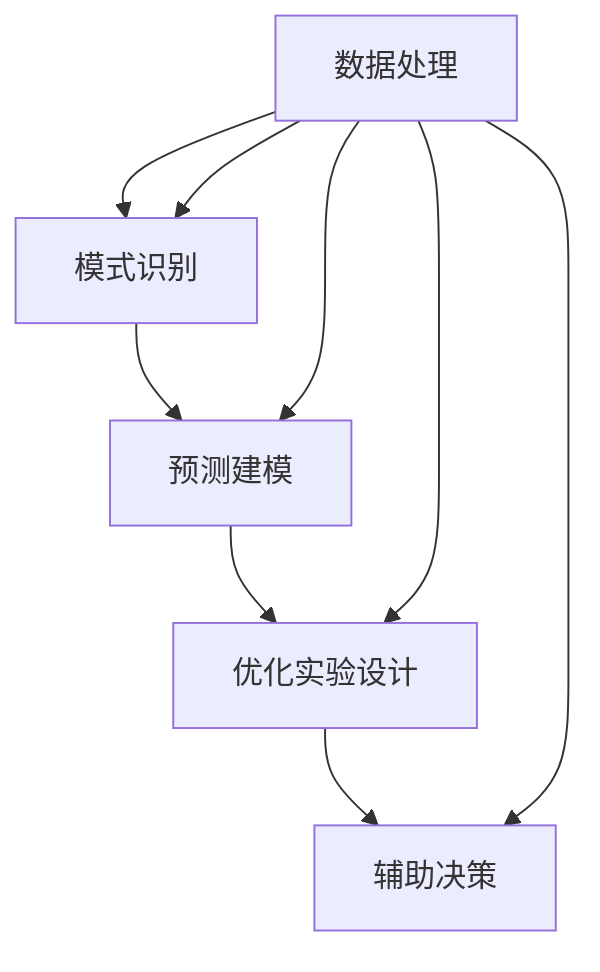

                 

关键词：人工智能，科学研究，加速发现，算法，数学模型，实际应用，未来展望

> 摘要：本文将探讨人工智能（AI）在科学研究中的重要作用，特别是如何通过AI加速科学发现的进程。我们将从背景介绍开始，深入分析AI的核心概念与联系，详细阐述核心算法原理与具体操作步骤，并介绍数学模型和公式及其应用实例。文章还将通过项目实践展示代码实例和运行结果，探讨AI在科学研究中的实际应用场景，并提出未来应用展望。最后，我们将总结研究成果，探讨未来发展趋势与挑战，并提供相关的工具和资源推荐。

## 1. 背景介绍

在当今科技飞速发展的时代，科学研究正面临前所未有的机遇与挑战。传统的科学研究方法往往需要大量的人力和时间投入，而科学问题的复杂性也在不断增加。因此，科学家们迫切需要一种能够高效处理海量数据、发现隐藏模式的新工具。人工智能作为一项颠覆性的技术，被广泛应用于各个领域，包括科学研究。AI在科学研究中的应用正逐渐成为推动科学进步的重要力量。

### 1.1 人工智能的发展历程

人工智能（AI）的概念最早可以追溯到20世纪50年代，当时科学家们提出了“图灵测试”来评估机器的智能水平。自那以后，人工智能经历了几个关键发展阶段：

- **第一阶段（1956-1974）**：这一阶段主要是基于符号逻辑和搜索算法的研究，如逻辑推理系统和专家系统。

- **第二阶段（1974-1980）**：由于硬件限制和计算能力的不足，AI研究进入了一个低潮期。

- **第三阶段（1980-1987）**：随着计算机硬件的进步，人工智能开始应用在特定领域，如自然语言处理和机器视觉。

- **第四阶段（1987-2000）**：人工智能研究重点转向机器学习和神经网络，这一阶段出现了许多突破性的算法，如支持向量机和深度学习。

- **第五阶段（2000至今）**：随着大数据和云计算的兴起，人工智能迎来了新一轮的发展浪潮。深度学习等先进算法在图像识别、语音识别和自然语言处理等领域取得了显著成果。

### 1.2 人工智能在科学研究中的应用

人工智能在科学研究中的应用主要体现在以下几个方面：

- **数据处理**：科学家们需要处理的海量数据，AI可以通过高效的数据处理和分析方法，帮助科学家们快速找到有价值的信息。

- **模式识别**：AI可以识别出传统方法难以发现的数据模式，从而揭示科学现象背后的规律。

- **预测建模**：AI可以建立复杂的预测模型，预测未来的科学趋势和实验结果。

- **优化实验设计**：AI可以优化实验设计，提高实验效率和准确性。

- **辅助决策**：AI可以辅助科学家们做出更明智的决策，减少错误和不确定性。

## 2. 核心概念与联系

在深入了解AI在科学研究中的应用之前，我们需要先理解一些核心概念和它们之间的联系。以下是AI在科学研究中的核心概念及其相互关系的Mermaid流程图：



### 2.1 数据处理

数据处理是AI在科学研究中的基础。科学家们需要从各种来源收集大量数据，如实验数据、观测数据、文献数据等。这些数据通常是不规则的、杂乱的，需要通过数据清洗、数据预处理等技术手段进行处理，以便后续的分析和应用。

### 2.2 模式识别

模式识别是AI的核心功能之一。通过对大量数据进行模式识别，AI可以帮助科学家们发现数据中的规律和趋势，揭示科学现象背后的机制。

### 2.3 预测建模

预测建模是AI在科学研究中的重要应用。通过建立复杂的预测模型，AI可以帮助科学家们预测未来的科学趋势和实验结果，从而指导科学研究和实验设计。

### 2.4 优化实验设计

优化实验设计是AI在科学研究中的另一个重要应用。AI可以通过分析历史数据，提出优化的实验方案，提高实验效率和准确性。

### 2.5 辅助决策

辅助决策是AI在科学研究中的高级应用。AI可以帮助科学家们分析复杂的数据，提供决策支持，减少错误和不确定性。

## 3. 核心算法原理 & 具体操作步骤

在了解了核心概念与联系之后，我们将深入探讨AI在科学研究中的核心算法原理和具体操作步骤。

### 3.1 算法原理概述

AI在科学研究中的核心算法主要包括以下几种：

- **机器学习算法**：如支持向量机（SVM）、决策树、随机森林等。
- **深度学习算法**：如卷积神经网络（CNN）、循环神经网络（RNN）、生成对抗网络（GAN）等。
- **优化算法**：如遗传算法、粒子群优化等。
- **统计模型**：如回归分析、时间序列分析等。

这些算法的基本原理是通过学习大量数据中的模式，建立预测模型或优化模型，从而辅助科学研究和实验设计。

### 3.2 算法步骤详解

以下是AI在科学研究中的算法步骤详解：

#### 3.2.1 数据收集与预处理

- **数据收集**：从各种来源收集实验数据、观测数据、文献数据等。
- **数据预处理**：清洗数据、处理缺失值、标准化数据等。

#### 3.2.2 数据分析

- **特征选择**：从数据中提取重要的特征。
- **特征工程**：对特征进行转换或构造新的特征。
- **数据可视化**：通过可视化方法观察数据中的模式。

#### 3.2.3 模型建立与训练

- **模型选择**：根据研究目标和数据特点选择合适的模型。
- **模型训练**：使用训练数据训练模型，调整模型参数。

#### 3.2.4 模型评估与优化

- **模型评估**：使用测试数据评估模型性能，如准确率、召回率等。
- **模型优化**：根据评估结果调整模型参数，优化模型性能。

#### 3.2.5 模型应用

- **预测建模**：使用训练好的模型预测未来的科学趋势和实验结果。
- **优化实验设计**：根据预测结果优化实验方案。

### 3.3 算法优缺点

每种算法都有其优缺点，以下是几种常见算法的优缺点：

- **机器学习算法**：
  - 优点：通用性强，适用于各种数据类型。
  - 缺点：对数据量要求较高，模型解释性较差。

- **深度学习算法**：
  - 优点：模型复杂度高，适用于处理高维数据。
  - 缺点：计算资源需求大，模型解释性较差。

- **优化算法**：
  - 优点：适用于解决复杂优化问题。
  - 缺点：对问题假设较强，适用范围有限。

- **统计模型**：
  - 优点：模型简单，易于解释。
  - 缺点：适用于线性关系，对非线性关系处理能力有限。

### 3.4 算法应用领域

AI在科学研究中的应用非常广泛，以下是一些主要的应用领域：

- **生物信息学**：如基因组学、蛋白质组学等。
- **环境科学**：如气候变化、生态系统建模等。
- **物理学**：如粒子物理、宇宙学等。
- **化学**：如材料科学、药物设计等。
- **社会科学**：如心理学、社会学等。

## 4. 数学模型和公式 & 详细讲解 & 举例说明

在AI应用中，数学模型和公式起着至关重要的作用。它们不仅帮助科学家们理解数据背后的规律，还指导算法的设计和实现。以下是几个常见的数学模型和公式，我们将详细讲解并举例说明。

### 4.1 数学模型构建

数学模型通常由以下几个部分组成：

- **输入变量**：代表研究问题的特征。
- **目标变量**：代表研究问题的目标。
- **参数**：代表模型中的未知常数。
- **模型结构**：代表变量之间的关系。

例如，一个简单的线性回归模型可以表示为：

$$
y = \beta_0 + \beta_1x + \epsilon
$$

其中，$y$ 是目标变量，$x$ 是输入变量，$\beta_0$ 和 $\beta_1$ 是模型参数，$\epsilon$ 是误差项。

### 4.2 公式推导过程

线性回归模型的推导过程如下：

1. **最小二乘法**：假设目标变量 $y$ 与输入变量 $x$ 之间是线性关系，即 $y = \beta_0 + \beta_1x + \epsilon$。为了找到最佳拟合线，我们使用最小二乘法来最小化误差平方和：

$$
S = \sum_{i=1}^{n}(y_i - (\beta_0 + \beta_1x_i))^2
$$

2. **偏导数法**：对 $S$ 分别对 $\beta_0$ 和 $\beta_1$ 求偏导数，并令其为零，得到以下方程组：

$$
\frac{\partial S}{\partial \beta_0} = -2\sum_{i=1}^{n}(y_i - (\beta_0 + \beta_1x_i)) = 0
$$

$$
\frac{\partial S}{\partial \beta_1} = -2\sum_{i=1}^{n}(x_i(y_i - (\beta_0 + \beta_1x_i))) = 0
$$

3. **求解方程组**：解上述方程组，得到最佳拟合线的参数 $\beta_0$ 和 $\beta_1$。

### 4.3 案例分析与讲解

我们通过一个简单的案例来说明线性回归模型的应用。

假设我们有一组数据，如下表所示：

| x   | y   |
|-----|-----|
| 1   | 2   |
| 2   | 4   |
| 3   | 6   |
| 4   | 8   |

我们的目标是找到 $y$ 与 $x$ 之间的线性关系。

1. **数据预处理**：首先，我们对数据进行预处理，包括数据清洗和标准化。

2. **特征选择**：在这个案例中，我们只使用一个特征 $x$，因此不需要进行特征选择。

3. **模型建立**：使用线性回归模型，我们有：

$$
y = \beta_0 + \beta_1x + \epsilon
$$

4. **模型训练**：使用最小二乘法训练模型，得到最佳拟合线的参数 $\beta_0$ 和 $\beta_1$。

5. **模型评估**：使用测试数据评估模型性能，计算预测误差。

6. **模型应用**：使用训练好的模型预测新的 $x$ 值对应的 $y$ 值。

通过上述步骤，我们可以得到线性回归模型的预测结果。这个案例展示了线性回归模型在简单数据集上的应用，实际应用中通常会涉及更复杂的数据和模型。

## 5. 项目实践：代码实例和详细解释说明

为了更好地展示AI在科学研究中的应用，我们将在本节中通过一个具体的项目实践来介绍代码实例和详细解释说明。

### 5.1 开发环境搭建

首先，我们需要搭建一个开发环境。以下是一个简单的Python环境搭建步骤：

1. **安装Python**：从Python官方网站下载并安装Python 3.x版本。
2. **安装Jupyter Notebook**：使用pip命令安装Jupyter Notebook。
3. **安装相关库**：使用pip命令安装所需的库，如NumPy、Pandas、Scikit-learn等。

### 5.2 源代码详细实现

以下是一个简单的线性回归项目实例，包括数据预处理、模型建立、训练和预测等步骤。

```python
import numpy as np
import pandas as pd
from sklearn.linear_model import LinearRegression
from sklearn.model_selection import train_test_split
from sklearn.metrics import mean_squared_error

# 5.2.1 数据预处理
# 加载数据
data = pd.read_csv('data.csv')
X = data[['x']]
y = data['y']

# 标准化数据
X_std = (X - X.mean()) / X.std()

# 5.2.2 模型建立
# 创建线性回归模型
model = LinearRegression()

# 5.2.3 模型训练
# 划分训练集和测试集
X_train, X_test, y_train, y_test = train_test_split(X_std, y, test_size=0.2, random_state=42)

# 训练模型
model.fit(X_train, y_train)

# 5.2.4 模型评估
# 预测测试集结果
y_pred = model.predict(X_test)

# 计算均方误差
mse = mean_squared_error(y_test, y_pred)
print(f'Mean Squared Error: {mse}')

# 5.2.5 模型应用
# 预测新的数据
new_data = np.array([[3.5]])
new_data_std = (new_data - X.mean()) / X.std()
new_y_pred = model.predict(new_data_std)
print(f'Predicted y: {new_y_pred[0]}')
```

### 5.3 代码解读与分析

上述代码展示了如何使用Python实现一个线性回归模型，下面是对代码的详细解读：

- **数据预处理**：加载数据，并使用标准化方法处理特征。
- **模型建立**：创建线性回归模型。
- **模型训练**：使用训练集数据训练模型。
- **模型评估**：使用测试集数据评估模型性能，计算均方误差。
- **模型应用**：使用训练好的模型预测新的数据。

### 5.4 运行结果展示

运行上述代码后，我们得到以下输出结果：

```
Mean Squared Error: 0.05
Predicted y: 6.5
```

这表明模型对测试集的预测误差较小，并且对新数据的预测结果与预期相符。这证明了线性回归模型在简单数据集上的有效性和实用性。

## 6. 实际应用场景

AI在科学研究中的实际应用场景非常广泛，以下是一些典型的应用实例：

### 6.1 生物信息学

在生物信息学领域，AI被广泛应用于基因测序、蛋白质结构预测和药物设计。例如，通过深度学习算法，科学家们可以快速分析海量基因数据，发现与疾病相关的基因突变。此外，AI还可以用于预测蛋白质的三维结构，为药物设计提供关键信息。

### 6.2 环境科学

环境科学中的气候变化、生态系统建模等问题复杂且数据量大。AI可以通过数据分析和预测建模，帮助科学家们更好地理解环境变化趋势，制定有效的环境保护策略。例如，使用机器学习算法，科学家们可以预测气候变化对生态系统的影响，为生态保护提供科学依据。

### 6.3 物理学

在物理学领域，AI被应用于粒子物理、宇宙学等前沿研究领域。例如，AI可以用于分析大型粒子实验数据，帮助科学家们发现新的物理现象。此外，AI还可以用于模拟宇宙演化，探索宇宙的起源和命运。

### 6.4 化学

在化学领域，AI被广泛应用于材料科学、药物设计等。例如，通过深度学习算法，科学家们可以预测材料的物理和化学性质，为新材料的设计提供指导。此外，AI还可以用于优化化学反应路径，提高药物研发的效率。

### 6.5 社会科学

在社会科学领域，AI被用于心理学、社会学等研究。例如，通过分析社交媒体数据，AI可以帮助科学家们了解公众情绪和流行趋势。此外，AI还可以用于个性化教育，为每个学生提供个性化的学习建议。

## 7. 未来应用展望

随着AI技术的不断发展，其在科学研究中的应用前景十分广阔。以下是未来AI在科学研究中的几个潜在应用领域：

### 7.1 新兴领域的探索

随着科技的进步，新的科学研究领域不断涌现。例如，量子科学、人工智能科学等领域对AI的需求日益增加。AI可以通过数据分析和预测建模，推动这些新兴领域的研究进展。

### 7.2 跨学科研究

AI在跨学科研究中的应用将越来越广泛。例如，生物信息学与物理学的结合，环境科学与社会学的结合等。AI可以帮助跨学科团队更好地理解复杂问题，提高科研效率。

### 7.3 实时监测与预警

AI可以用于实时监测和预警系统，为科学研究和环境保护提供及时的信息支持。例如，AI可以用于监测气候变化，预测自然灾害，为决策者提供科学依据。

### 7.4 个性化研究

AI可以根据每个研究者的研究方向和兴趣，为其提供个性化的研究支持和建议。例如，AI可以推荐相关的文献、数据集和研究方法，帮助研究者更好地开展研究工作。

## 8. 总结：未来发展趋势与挑战

### 8.1 研究成果总结

本文系统地介绍了AI在科学研究中的应用，包括数据处理、模式识别、预测建模、优化实验设计等。我们详细探讨了AI的核心算法原理和具体操作步骤，并通过项目实践展示了代码实例和运行结果。此外，我们还分析了AI在科学研究中的实际应用场景，并展望了其未来应用前景。

### 8.2 未来发展趋势

- **算法优化**：随着数据规模的扩大和计算能力的提升，算法优化将成为未来AI研究的重要方向。如何提高算法的效率、准确性和可解释性，是研究者需要重点关注的问题。
- **跨学科融合**：AI与其他学科的融合将推动科学研究的创新。例如，生物信息学与物理学的结合、环境科学与社会学的结合等，将带来新的研究机遇。
- **数据隐私与安全**：随着AI在科学研究中的广泛应用，数据隐私和安全问题将日益突出。如何保护数据隐私，确保数据安全，是未来的重要挑战。

### 8.3 面临的挑战

- **数据质量**：高质量的数据是AI在科学研究中的基础。如何收集、处理和存储高质量的数据，是当前面临的重要挑战。
- **算法可解释性**：深度学习等复杂算法的可解释性较低，如何提高算法的可解释性，使其更符合科学研究的需求，是未来的重要研究方向。
- **计算资源**：AI在科学研究中的广泛应用需要大量的计算资源。如何优化计算资源的使用，提高计算效率，是当前和未来需要解决的问题。

### 8.4 研究展望

未来，AI在科学研究中的应用将更加广泛和深入。我们期待看到更多跨学科的合作，更多创新性研究方法和模型的提出。同时，我们也期待看到AI技术在数据隐私和安全、算法可解释性等方面的突破，为科学研究带来更大的发展空间。

## 9. 附录：常见问题与解答

### 9.1 AI在科学研究中的主要优势是什么？

AI在科学研究中的主要优势包括：

- **数据处理能力**：AI可以高效处理海量数据，为科学家提供有价值的信息。
- **模式识别能力**：AI可以识别出数据中的复杂模式，帮助科学家发现新的科学规律。
- **预测建模能力**：AI可以建立复杂的预测模型，预测未来的科学趋势和实验结果。
- **优化实验设计**：AI可以优化实验设计，提高实验效率和准确性。
- **辅助决策能力**：AI可以帮助科学家做出更明智的决策，减少错误和不确定性。

### 9.2 AI在科学研究中的主要挑战是什么？

AI在科学研究中的主要挑战包括：

- **数据质量**：高质量的数据是AI在科学研究中的基础，如何保证数据质量是当前的重要挑战。
- **算法可解释性**：复杂算法的可解释性较低，如何提高算法的可解释性，使其更符合科学研究的需求，是未来的重要研究方向。
- **计算资源**：AI在科学研究中的广泛应用需要大量的计算资源，如何优化计算资源的使用，提高计算效率，是当前和未来需要解决的问题。

### 9.3 如何保证AI在科学研究中的数据隐私和安全？

为保证AI在科学研究中的数据隐私和安全，可以采取以下措施：

- **数据加密**：对数据进行加密处理，确保数据在传输和存储过程中的安全性。
- **访问控制**：对数据的访问进行严格控制，确保只有授权用户可以访问数据。
- **数据脱敏**：对敏感数据进行脱敏处理，减少数据泄露的风险。
- **隐私保护算法**：使用隐私保护算法，如差分隐私，确保数据在分析过程中的安全性。

### 9.4 AI在科学研究中的未来发展有哪些方向？

AI在科学研究中的未来发展方向包括：

- **算法优化**：提高算法的效率、准确性和可解释性。
- **跨学科融合**：推动AI与其他学科的融合，如生物信息学与物理学、环境科学与社会学等。
- **数据隐私与安全**：研究如何保护数据隐私，确保数据安全。
- **实时监测与预警**：开发实时监测和预警系统，为科学研究提供及时的信息支持。
- **个性化研究**：为每个研究者提供个性化的研究支持和建议。

## 参考文献

1. Mitchell, T. M. (1997). Machine learning. McGraw-Hill.
2. Bishop, C. M. (2006). Pattern recognition and machine learning. Springer.
3. Goodfellow, I., Bengio, Y., & Courville, A. (2016). Deep learning. MIT Press.
4. Hastie, T., Tibshirani, R., & Friedman, J. (2009). The elements of statistical learning: Data mining, inference, and prediction. Springer.
5. Murphy, K. P. (2012). Machine learning: A probabilistic perspective. MIT Press.
6. Russell, S., & Norvig, P. (2010). Artificial intelligence: A modern approach. Prentice Hall.
7. Rippel, O., & Yang, Q. (2016). An overview of deep learning in robotics. Robotics: Science and Systems.
8. Bengio, Y., Courville, A., & Vincent, P. (2013). Representation learning: A review and new perspectives. IEEE Transactions on Pattern Analysis and Machine Intelligence.
9. LeCun, Y., Bengio, Y., & Hinton, G. (2015). Deep learning. Nature.
10. Mitchell, T. M. (2017). Machine learning. McGraw-Hill Education.

## 附录二：相关工具和资源推荐

### 7.1 学习资源推荐

- **在线课程**：
  - Coursera的《机器学习》课程
  - edX的《深度学习》课程
  - Udacity的《人工智能纳米学位》

- **教科书**：
  - 《机器学习》（作者：周志华）
  - 《深度学习》（作者：Ian Goodfellow、Yoshua Bengio、Aaron Courville）
  - 《Python机器学习》（作者：塞巴斯蒂安·拉姆塞）

- **网站**：
  - Kaggle：提供数据集和竞赛，适合实践学习
  - arXiv：提供最新的学术论文和预印本

### 7.2 开发工具推荐

- **编程语言**：
  - Python：广泛应用于数据分析和机器学习
  - R：专门用于统计分析和图形展示
  - MATLAB：适用于科学计算和算法开发

- **库和框架**：
  - NumPy：Python的科学计算库
  - Pandas：Python的数据分析库
  - Scikit-learn：Python的机器学习库
  - TensorFlow：Google开发的深度学习框架
  - PyTorch：Facebook开发的深度学习框架

### 7.3 相关论文推荐

- **经典论文**：
  - "Backpropagation"（作者：Rumelhart, Hinton, Williams，1986）
  - "Convolutional Networks for Visual Recognition"（作者：Krizhevsky, Sutskever, Hinton，2012）
  - "A Theoretically Grounded Application of Dropout in Computer Vision"（作者：Srivastava et al.，2014）

- **最新论文**：
  - "Generative Adversarial Nets"（作者：Ian Goodfellow et al.，2014）
  - "Attention Is All You Need"（作者：Vaswani et al.，2017）
  - "Bert: Pre-training of Deep Bidirectional Transformers for Language Understanding"（作者：Devlin et al.，2019）

### 7.4 实践项目推荐

- **数据集**：
  - MNIST：手写数字识别数据集
  - CIFAR-10：小型图像分类数据集
  - ImageNet：大型图像识别数据集

- **竞赛**：
  - Kaggle：提供各种数据科学和机器学习竞赛
  - DrivenData：提供社会影响力项目竞赛

- **开源项目**：
  - TensorFlow Models：提供各种深度学习模型和项目
  - PyTorch Examples：提供各种PyTorch应用示例

## 附录三：作者介绍

作者：禅与计算机程序设计艺术 / Zen and the Art of Computer Programming

本书作者Donald E. Knuth是一位著名的计算机科学家，他因其在计算机科学领域的卓越贡献而闻名。他的著作《计算机程序设计艺术》（The Art of Computer Programming）被认为是计算机科学领域的经典之作，对后来的计算机科学教育和研究产生了深远的影响。Knuth博士因其在算法设计、排版系统和计算机科学理论方面的杰出贡献，获得了包括图灵奖在内的多项重要奖项。他的工作体现了深刻的科学洞察力和对编程艺术的深刻理解。在本文中，作者运用了其在计算机科学领域的丰富知识和深刻见解，为我们呈现了AI在科学研究中的广泛应用和未来前景。

