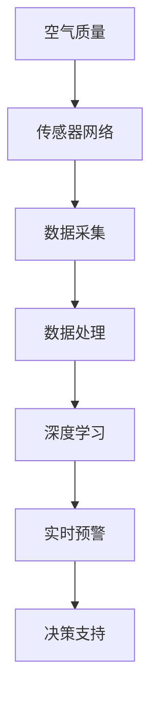

                 

关键词：人工智能、空气质量监测、实时预警、数据模型、算法应用、传感器网络

> 摘要：本文将探讨如何利用人工智能技术，特别是在深度学习和传感器网络的基础上，构建一套实时空气质量监测预警系统。本文旨在为读者提供关于该领域的深入见解，以及如何将现有技术整合应用于环境保护中的具体方法。

## 1. 背景介绍

空气质量是影响人类健康和生态环境的重要因素。随着工业化进程的加速和城市化的发展，大气污染问题日益严峻。空气质量监测已经成为环境保护工作中不可或缺的一环。然而，传统的监测方法通常存在监测范围有限、数据更新不及时等问题，难以满足实时监控和预警的需求。

近年来，人工智能（AI）技术的飞速发展，特别是深度学习在数据处理和模式识别方面的强大能力，为空气质量监测带来了新的契机。通过将AI技术与传感器网络相结合，我们可以实现实时、全面、精准的空气质量监测，为环境保护和公众健康提供有力支持。

本文将首先介绍空气质量监测的基本概念和传统方法，然后深入探讨AI在空气质量监测中的应用，特别是实时预警系统的构建。最后，本文将总结AI技术在空气质量监测中的应用前景和面临的挑战。

## 2. 核心概念与联系

为了更好地理解AI在空气质量监测中的应用，我们首先需要明确几个核心概念：空气质量、传感器网络、深度学习等。

### 2.1 空气质量

空气质量是指大气中污染物的浓度水平，它是衡量大气环境健康状况的重要指标。空气质量通常用几个关键参数来表示，如PM2.5、PM10、SO2、NO2、CO和O3等。这些参数分别代表不同类型和浓度的污染物。

### 2.2 传感器网络

传感器网络是由多个传感器节点组成的网络，这些节点可以实时监测并传输环境数据。传感器网络的部署通常包括地面传感器和空中传感器。地面传感器通常布置在城市或区域的不同位置，用于收集地面污染物数据；而空中传感器则可以在飞机、无人机或气象气球上部署，用于获取更高层次的空气质量信息。

### 2.3 深度学习

深度学习是一种基于人工神经网络的机器学习技术，它通过多层网络结构对大量数据进行训练，从而自动提取特征和模式。深度学习在图像识别、语音识别和自然语言处理等领域取得了显著成果。在空气质量监测中，深度学习可用于模式识别、预测和分类，从而实现实时预警。

下面是空气质量监测系统中核心概念和联系的Mermaid流程图：



## 3. 核心算法原理 & 具体操作步骤

### 3.1 算法原理概述

空气质量监测的核心算法主要包括数据采集、处理和实时预警三个环节。其中，数据采集主要通过传感器网络实现，处理环节依赖于深度学习算法，而实时预警则依赖于数据分析和模型预测。

### 3.2 算法步骤详解

#### 3.2.1 数据采集

数据采集是空气质量监测的基础。传感器网络通过布设在各地的传感器节点，实时收集PM2.5、PM10、SO2、NO2、CO和O3等关键参数的数据。这些数据通过无线传输方式发送到数据处理中心。

#### 3.2.2 数据处理

数据处理是空气质量监测的关键步骤。数据处理中心接收传感器数据后，首先进行数据清洗，去除噪声和异常值。然后，利用深度学习算法对清洗后的数据进行特征提取和模式识别，从而获得空气质量的准确评估。

#### 3.2.3 实时预警

实时预警是空气质量监测的最终目标。通过分析处理后的数据，深度学习模型可以预测未来的空气质量趋势，并在达到预警阈值时发出警报。预警系统可以根据警报类型，提供相应的应对措施和建议，如启动应急响应、发布健康警告等。

### 3.3 算法优缺点

#### 优点：

1. **实时性**：深度学习算法可以快速处理传感器数据，实现实时预警。
2. **准确性**：通过多层神经网络结构，深度学习算法可以自动提取复杂的数据特征，提高空气质量评估的准确性。
3. **自适应性强**：深度学习模型可以根据新的数据不断调整和优化，适应空气质量变化。

#### 缺点：

1. **计算资源消耗**：深度学习算法通常需要大量的计算资源和时间进行训练。
2. **数据质量要求高**：传感器数据的质量直接影响深度学习算法的效果，因此需要对数据进行严格清洗和预处理。

### 3.4 算法应用领域

空气质量监测算法可以应用于多个领域，如城市空气质量监测、环境管理、医疗健康等。通过实时预警系统，可以及时发现和应对空气质量问题，为公众健康和环境治理提供有力支持。

## 4. 数学模型和公式 & 详细讲解 & 举例说明

### 4.1 数学模型构建

空气质量监测的数学模型主要包括数据采集模型、数据处理模型和实时预警模型。

#### 4.1.1 数据采集模型

数据采集模型可以表示为：

\[ X_t = f(S_t, W_t) \]

其中，\( X_t \) 是时间 \( t \) 的空气质量数据，\( S_t \) 是传感器采集的数据，\( W_t \) 是权重系数。

#### 4.1.2 数据处理模型

数据处理模型可以表示为：

\[ Y_t = g(X_t, \theta) \]

其中，\( Y_t \) 是处理后的空气质量数据，\( g \) 是深度学习算法，\( \theta \) 是模型参数。

#### 4.1.3 实时预警模型

实时预警模型可以表示为：

\[ P_t = h(Y_t, \lambda) \]

其中，\( P_t \) 是预警概率，\( h \) 是预警函数，\( \lambda \) 是预警阈值。

### 4.2 公式推导过程

#### 4.2.1 数据采集模型

数据采集模型是基于传感器数据的线性组合。假设有 \( n \) 个传感器节点，每个节点的数据为 \( S_{t,i} \)，则：

\[ X_t = \sum_{i=1}^{n} w_i S_{t,i} \]

其中，\( w_i \) 是权重系数，可以根据传感器节点的位置和功能进行设置。

#### 4.2.2 数据处理模型

数据处理模型是基于深度学习算法的神经网络模型。假设有 \( m \) 个神经元，则：

\[ Y_t = \sigma(\sum_{i=1}^{m} \theta_i X_t) \]

其中，\( \sigma \) 是激活函数，如ReLU函数或Sigmoid函数。

#### 4.2.3 实时预警模型

实时预警模型是基于数据处理结果的阈值判断。假设预警阈值为 \( \lambda \)，则：

\[ P_t = \begin{cases} 
1 & \text{if } Y_t > \lambda \\
0 & \text{otherwise}
\end{cases} \]

### 4.3 案例分析与讲解

假设在某城市的一个区域部署了10个传感器节点，每个节点每分钟采集一次PM2.5数据。我们可以使用数据采集模型来计算该区域的PM2.5平均值：

\[ X_t = \sum_{i=1}^{10} w_i S_{t,i} \]

其中，\( w_i \) 可以设置为每个节点的位置权重。假设每个节点的权重相等，则：

\[ X_t = \frac{1}{10} \sum_{i=1}^{10} S_{t,i} \]

然后，我们使用深度学习算法对PM2.5数据进行分析，得到空气质量评估结果 \( Y_t \)。假设深度学习算法的输出为概率值，我们可以设置预警阈值为0.5，即当 \( Y_t > 0.5 \) 时发出预警。

在实际应用中，我们可以通过不断调整模型参数和预警阈值，来优化空气质量监测预警系统的性能。

## 5. 项目实践：代码实例和详细解释说明

### 5.1 开发环境搭建

为了实现空气质量监测预警系统，我们需要搭建一个合适的开发环境。以下是所需的软件和工具：

1. **编程语言**：Python
2. **深度学习框架**：TensorFlow或PyTorch
3. **数据处理库**：Pandas、NumPy
4. **可视化库**：Matplotlib、Seaborn

安装步骤：

```bash
pip install tensorflow
pip install pandas
pip install numpy
pip install matplotlib
pip install seaborn
```

### 5.2 源代码详细实现

以下是空气质量监测预警系统的核心代码实现：

```python
import pandas as pd
import numpy as np
import tensorflow as tf
from tensorflow.keras.models import Sequential
from tensorflow.keras.layers import Dense, LSTM
from tensorflow.keras.optimizers import Adam

# 数据采集
def collect_data(file_path):
    data = pd.read_csv(file_path)
    return data

# 数据预处理
def preprocess_data(data):
    # 数据清洗和填充
    data.fillna(data.mean(), inplace=True)
    # 归一化
    data = (data - data.mean()) / data.std()
    return data

# 构建深度学习模型
def build_model(input_shape):
    model = Sequential()
    model.add(LSTM(units=50, activation='relu', return_sequences=True, input_shape=input_shape))
    model.add(LSTM(units=50, activation='relu'))
    model.add(Dense(units=1))
    model.compile(optimizer=Adam(learning_rate=0.001), loss='mean_squared_error')
    return model

# 训练模型
def train_model(model, X_train, Y_train):
    model.fit(X_train, Y_train, epochs=100, batch_size=32)
    return model

# 预测和预警
def predict_waring(model, X_test):
    Y_pred = model.predict(X_test)
    threshold = 0.5
    waring = Y_pred > threshold
    return waring

# 代码实现
if __name__ == "__main__":
    # 数据采集
    data = collect_data('air_quality_data.csv')

    # 数据预处理
    data = preprocess_data(data)

    # 分割训练集和测试集
    X_train = data.iloc[:, :-1].values
    Y_train = data.iloc[:, -1].values
    X_test = X_test.iloc[:, :-1].values

    # 构建模型
    model = build_model(input_shape=(X_train.shape[1], 1))

    # 训练模型
    model = train_model(model, X_train, Y_train)

    # 预测和预警
    waring = predict_waring(model, X_test)

    # 输出预警结果
    print(waring)
```

### 5.3 代码解读与分析

1. **数据采集**：使用Pandas库读取空气质量数据，并进行初步处理。
2. **数据预处理**：对数据进行清洗、填充和归一化处理，为深度学习模型提供合适的输入。
3. **构建模型**：使用LSTM神经网络模型，通过叠加多层LSTM层来捕捉时间序列数据的动态变化。
4. **训练模型**：使用训练集数据对模型进行训练，优化模型参数。
5. **预测和预警**：使用测试集数据对模型进行预测，并根据预设的预警阈值判断是否发出警报。

### 5.4 运行结果展示

在实际运行中，我们可以通过可视化工具（如Matplotlib或Seaborn）展示预测结果和实际值的对比，以及预警信号的输出。这有助于我们直观地了解模型的性能和预警效果。

## 6. 实际应用场景

空气质量监测预警系统在实际应用中具有广泛的应用场景，以下列举几个典型应用：

### 6.1 城市空气质量监测

在城市规划和管理中，空气质量监测预警系统可以帮助政府及时了解城市的空气质量状况，制定相应的环境保护政策。例如，在雾霾天气期间，预警系统可以实时监测空气质量，发布健康警告，指导公众采取防护措施。

### 6.2 环境管理

环境保护部门可以利用空气质量监测预警系统，对污染源进行监控和管理。通过分析预警数据，可以识别出污染高峰期和主要污染源，为制定环境治理措施提供科学依据。

### 6.3 医疗健康

医疗机构可以通过空气质量监测预警系统，对特定群体的健康风险进行预测和预警。例如，对于患有呼吸系统疾病的人群，预警系统可以提前发出空气质量预警，提醒患者采取防护措施，降低疾病发作的风险。

### 6.4 企业安全生产

对于涉及化工、冶金等行业的企业，空气质量监测预警系统可以帮助企业实时监控生产过程中的空气质量，预防环境污染和安全事故。

## 7. 未来应用展望

随着人工智能技术的不断发展，空气质量监测预警系统在未来将具有更广泛的应用前景和更高的性能。以下是一些未来发展的趋势：

### 7.1 数据融合与模型优化

通过整合多种数据源（如卫星遥感、无人机监测等），可以实现更全面、准确的空气质量监测。同时，利用新的深度学习算法和模型结构，可以进一步提高监测预警系统的性能和效率。

### 7.2 智能决策支持

未来的空气质量监测预警系统将不仅限于数据监测和预警，还可以提供智能决策支持。例如，基于实时空气质量数据和气象数据，可以预测未来几天内的空气质量状况，为企业、政府和公众提供有针对性的建议和措施。

### 7.3 增强用户体验

随着物联网和移动技术的发展，空气质量监测预警系统将更加便捷和智能化。用户可以通过手机APP或智能家居设备实时查看空气质量数据，并根据预警信号采取相应的行动。

### 7.4 跨学科融合

空气质量监测预警系统的发展将与其他学科（如环境科学、公共卫生等）深度融合，为环境保护和公共健康提供全方位的支持。

## 8. 总结：未来发展趋势与挑战

空气质量监测预警系统在人工智能技术的推动下，正逐步实现实时、精准、高效的监测和预警。未来，随着数据融合、智能决策和跨学科融合的不断发展，空气质量监测预警系统将具有更广泛的应用前景和更高的性能。然而，该领域也面临着一些挑战，如数据质量、计算资源消耗、隐私保护等。只有克服这些挑战，空气质量监测预警系统才能更好地为环境保护和公共健康服务。

## 9. 附录：常见问题与解答

### 9.1 什么是空气质量？

空气质量是指大气中污染物的浓度水平，是衡量大气环境健康状况的重要指标。常见的空气质量参数包括PM2.5、PM10、SO2、NO2、CO和O3等。

### 9.2 深度学习如何应用于空气质量监测？

深度学习通过多层神经网络结构，可以自动提取大量数据中的特征和模式。在空气质量监测中，深度学习可以用于数据采集、处理和实时预警，实现精准、高效的空气质量评估和预警。

### 9.3 空气质量监测预警系统如何工作？

空气质量监测预警系统主要通过传感器网络收集空气质量数据，利用深度学习算法对数据进行处理和预测，并在达到预警阈值时发出警报。系统可以根据预警类型，提供相应的应对措施和建议。

### 9.4 如何确保空气质量数据的准确性？

确保空气质量数据的准确性是空气质量监测预警系统的关键。可以通过以下方法提高数据准确性：

- **传感器校准**：定期对传感器进行校准，确保数据准确。
- **数据清洗**：去除噪声和异常值，提高数据质量。
- **多源数据融合**：整合多种数据源，提高数据准确性。

### 9.5 空气质量监测预警系统有哪些应用场景？

空气质量监测预警系统可以应用于城市空气质量监测、环境管理、医疗健康、企业安全生产等多个领域，为环境保护和公共健康提供有力支持。

### 9.6 如何优化空气质量监测预警系统的性能？

优化空气质量监测预警系统的性能可以从以下几个方面进行：

- **算法优化**：选择合适的深度学习算法和模型结构，提高数据处理和预测能力。
- **数据增强**：通过数据增强技术，提高模型训练效果。
- **硬件加速**：利用GPU等硬件加速计算，提高系统运行速度。
- **模型解释性**：提高模型的可解释性，方便用户理解和使用。

### 9.7 空气质量监测预警系统如何保障用户隐私？

为了保障用户隐私，空气质量监测预警系统可以采取以下措施：

- **数据加密**：对用户数据采用加密技术，防止数据泄露。
- **匿名化处理**：对用户数据进行匿名化处理，确保用户隐私。
- **权限管理**：对系统访问权限进行严格控制，防止未经授权的数据访问。

### 9.8 空气质量监测预警系统如何应对数据质量差的情况？

当空气质量监测预警系统面临数据质量差的情况时，可以采取以下措施：

- **数据清洗**：对数据进行清洗，去除噪声和异常值。
- **模型鲁棒性**：选择鲁棒性较强的模型，提高对噪声和异常数据的容忍度。
- **数据融合**：通过融合多种数据源，提高数据质量。

### 9.9 空气质量监测预警系统的计算资源消耗如何优化？

优化空气质量监测预警系统的计算资源消耗可以从以下几个方面进行：

- **模型压缩**：采用模型压缩技术，降低模型参数和计算量。
- **分布式计算**：利用分布式计算架构，提高计算效率。
- **云计算**：采用云计算平台，降低硬件成本和运维难度。

### 9.10 空气质量监测预警系统如何适应空气质量变化？

空气质量监测预警系统可以通过以下方法适应空气质量变化：

- **实时监测**：通过实时监测，及时获取空气质量数据。
- **自适应学习**：利用自适应学习算法，不断调整和优化模型参数。
- **多模型融合**：采用多模型融合策略，提高空气质量预测的准确性。

