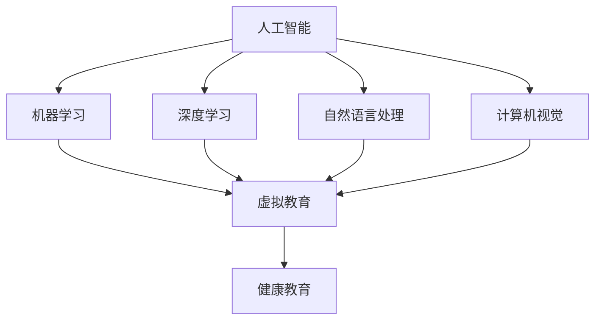
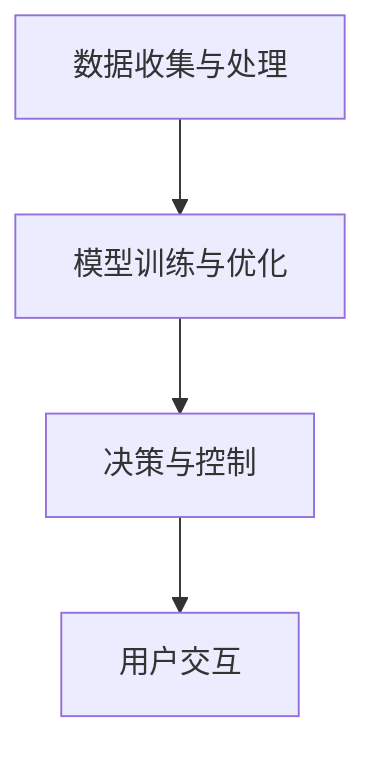

                 

关键词：人工智能，虚拟教育，健康意识，健康促进，健康监测

> 摘要：随着人工智能技术的不断发展，虚拟教育在健康领域的应用日益广泛。本文将探讨如何利用人工智能技术提高健康意识，从而促进人们的健康生活方式。通过分析人工智能在虚拟健康教育中的核心概念、算法原理、数学模型、实际应用，以及未来发展趋势与挑战，本文旨在为相关领域的研究者和实践者提供有价值的参考。

## 1. 背景介绍

随着社会的发展和生活水平的提高，人们对健康的关注程度不断提高。健康意识的提升不仅关乎个人的生活质量，也关系到整个社会的可持续发展。然而，传统的健康教育方式存在诸多局限性，如教育资源的分配不均、教育效果的评估困难等。为了解决这些问题，虚拟教育作为一种新兴的教育形式，逐渐成为健康教育的有力工具。

虚拟教育利用计算机和网络技术，创造一个虚拟的学习环境，使学习者可以在不受时间和地点限制的情况下，自主选择学习内容和学习进度。人工智能技术的融入，为虚拟教育带来了新的机遇。通过智能化的教学内容推荐、学习效果分析、健康监测等功能，人工智能不仅提高了健康教育的效果，也使得健康意识的培养更加个性化和精准化。

本文将围绕人工智能在虚拟健康教育中的应用，探讨如何通过技术创新提高人们的健康意识。文章将从核心概念、算法原理、数学模型、实际应用等方面展开，旨在为相关领域的研究和实践提供有价值的参考。

## 2. 核心概念与联系

在探讨人工智能在虚拟健康教育中的应用之前，有必要先了解一些核心概念和它们之间的联系。

### 2.1 人工智能（Artificial Intelligence, AI）

人工智能是指通过计算机程序模拟人类智能的一种技术。它包括机器学习、深度学习、自然语言处理、计算机视觉等多个子领域。在虚拟教育中，人工智能主要用于个性化推荐、学习分析、健康监测等方面。

### 2.2 虚拟教育（Virtual Education）

虚拟教育是指利用计算机和网络技术，创建一个虚拟的学习环境，使学习者能够在任何时间、任何地点进行学习。虚拟教育包括在线课程、虚拟课堂、虚拟实验室等多种形式。

### 2.3 健康教育（Health Education）

健康教育是指通过教育手段，提高人们的健康意识、知识和技能，以促进健康生活方式的形成。健康教育的目的是预防疾病、促进健康，提高生活质量和寿命。

### 2.4 核心概念原理与架构的 Mermaid 流程图

以下是一个简化的 Mermaid 流程图，展示了人工智能、虚拟教育和健康教育之间的核心概念原理和联系：



通过这个流程图，我们可以看到人工智能技术在虚拟教育中的应用，以及虚拟教育如何促进健康教育。

### 2.5 人工智能在虚拟健康教育中的关键应用

在虚拟健康教育中，人工智能技术的应用主要包括以下几个方面：

1. **个性化推荐**：根据学习者的兴趣、学习历史和健康数据，推荐合适的健康教育和健康监测内容。
2. **学习分析**：通过分析学习者的行为数据，了解学习效果，提供有针对性的指导和建议。
3. **健康监测**：利用计算机视觉、自然语言处理等技术，对学习者的健康状况进行实时监测，发现潜在的健康问题。
4. **虚拟教练**：通过虚拟现实技术，创建一个互动的虚拟教练，帮助学习者进行健康锻炼和指导。

### 2.6 人工智能在虚拟健康教育中的架构

在虚拟健康教育中，人工智能的架构通常包括以下几个模块：

1. **数据收集与处理模块**：负责收集学习者的健康数据、学习行为数据等，并进行预处理。
2. **模型训练与优化模块**：利用机器学习、深度学习等技术，训练和优化人工智能模型，以提高预测和推荐准确性。
3. **决策与控制模块**：根据模型输出，制定个性化的健康教育计划和健康监测策略。
4. **用户交互模块**：通过虚拟教练、互动游戏等方式，与学习者进行互动，提高学习体验。

### 2.7 Mermaid 流程图

以下是一个简化的 Mermaid 流程图，展示了人工智能在虚拟健康教育中的架构：



通过这个流程图，我们可以看到人工智能在虚拟健康教育中的核心模块和它们之间的相互作用。

### 2.8 核心算法原理 & 具体操作步骤

在虚拟健康教育中，人工智能的核心算法主要包括机器学习、深度学习、自然语言处理和计算机视觉等技术。下面将分别介绍这些算法的原理和具体操作步骤。

#### 2.8.1 机器学习算法

机器学习是一种通过数据驱动的方式，让计算机自动学习和改进的技术。在虚拟教育中，机器学习算法主要用于个性化推荐和学习分析。

1. **原理**：机器学习算法通过从大量数据中学习规律，建立预测模型。常见的机器学习算法包括线性回归、逻辑回归、支持向量机、决策树、随机森林等。
2. **操作步骤**：
   - 数据预处理：清洗数据，处理缺失值和异常值。
   - 特征工程：提取有用的特征，并进行特征选择和特征转换。
   - 模型训练：使用训练数据集，选择合适的算法，训练模型。
   - 模型评估：使用验证数据集，评估模型性能。
   - 模型优化：根据评估结果，调整模型参数，优化模型性能。

#### 2.8.2 深度学习算法

深度学习是一种基于人工神经网络的机器学习技术，它通过多层神经网络，对数据进行层次化的特征提取和抽象。在虚拟教育中，深度学习算法主要用于图像识别、语音识别和自然语言处理。

1. **原理**：深度学习算法通过多层神经网络，逐层提取数据的特征。每层神经网络都对输入数据进行特征提取和变换，最终输出结果。常见的深度学习模型包括卷积神经网络（CNN）、循环神经网络（RNN）、生成对抗网络（GAN）等。
2. **操作步骤**：
   - 数据预处理：与机器学习算法类似，对数据进行清洗、特征提取等处理。
   - 网络构建：设计合适的神经网络结构，包括层数、每层神经元数量、激活函数等。
   - 模型训练：使用训练数据集，训练神经网络模型。
   - 模型评估：使用验证数据集，评估模型性能。
   - 模型优化：根据评估结果，调整模型参数，优化模型性能。

#### 2.8.3 自然语言处理算法

自然语言处理是一种让计算机理解和处理自然语言的技术。在虚拟教育中，自然语言处理算法主要用于文本分析、问答系统和语音识别。

1. **原理**：自然语言处理算法通过分析文本数据，提取语义信息，实现文本分类、情感分析、命名实体识别等任务。常见的自然语言处理技术包括词向量表示、序列标注、序列生成等。
2. **操作步骤**：
   - 数据预处理：与机器学习算法类似，对数据进行清洗、特征提取等处理。
   - 模型训练：使用训练数据集，训练自然语言处理模型。
   - 模型评估：使用验证数据集，评估模型性能。
   - 模型优化：根据评估结果，调整模型参数，优化模型性能。

#### 2.8.4 计算机视觉算法

计算机视觉是一种让计算机理解和解释视觉信息的技术。在虚拟教育中，计算机视觉算法主要用于图像识别、人脸识别和动作捕捉。

1. **原理**：计算机视觉算法通过分析图像数据，提取视觉特征，实现图像分类、目标检测、图像分割等任务。常见的计算机视觉技术包括卷积神经网络（CNN）、目标检测算法（如YOLO、SSD、Faster R-CNN等）、图像分割算法（如FCN、U-Net等）。
2. **操作步骤**：
   - 数据预处理：与机器学习算法类似，对数据进行清洗、特征提取等处理。
   - 模型训练：使用训练数据集，训练计算机视觉模型。
   - 模型评估：使用验证数据集，评估模型性能。
   - 模型优化：根据评估结果，调整模型参数，优化模型性能。

### 2.9 人工智能在虚拟健康教育中的优缺点

#### 优点

1. **个性化**：人工智能可以根据学习者的兴趣、学习历史和健康数据，提供个性化的健康教育和健康监测服务，提高教育效果和健康意识。
2. **实时性**：人工智能可以实时监测学习者的健康状况，及时发现问题，提供有针对性的建议，有助于预防疾病和促进健康。
3. **互动性**：虚拟教育中的虚拟教练和互动游戏，可以增加学习的趣味性和互动性，提高学习者的参与度和健康意识。
4. **可扩展性**：人工智能技术可以轻松扩展到不同的健康领域，如心理健康、慢性病管理等，提供全方位的健康教育和服务。

#### 缺点

1. **数据隐私**：健康数据的安全性和隐私性是人工智能在虚拟健康教育中面临的主要挑战。如何确保数据的安全性和隐私性，是未来需要解决的问题。
2. **算法偏见**：人工智能模型的训练数据可能存在偏见，导致模型在预测和推荐时出现偏差，影响健康教育的效果。
3. **技术依赖**：虚拟教育和人工智能技术对技术基础设施和人才需求较高，可能增加教育的成本和难度。
4. **道德伦理**：在虚拟健康教育中，人工智能可能会对学习者的行为和健康产生重大影响，如何确保人工智能的道德伦理和责任，是未来需要关注的问题。

### 2.10 人工智能在虚拟健康教育中的应用领域

人工智能在虚拟健康教育中的应用非常广泛，包括以下几个方面：

1. **健康教育内容推荐**：根据学习者的兴趣和健康需求，推荐合适的健康教育和健康监测内容，提高学习效果和健康意识。
2. **健康数据分析**：通过分析学习者的健康数据，了解学习效果，提供有针对性的建议和指导，促进健康生活方式的形成。
3. **健康监测**：利用计算机视觉、自然语言处理等技术，对学习者的健康状况进行实时监测，发现潜在的健康问题，提供及时的干预措施。
4. **虚拟教练**：通过虚拟现实技术，创建一个互动的虚拟教练，帮助学习者进行健康锻炼和指导，提高健康意识和生活质量。

## 3. 数学模型和公式

在虚拟健康教育中，数学模型和公式是分析和预测学习者健康状态的重要工具。以下将介绍几个关键的数学模型和公式，并详细讲解它们的构建、推导过程，以及具体案例的分析和讲解。

### 3.1 数学模型构建

在虚拟健康教育中，常用的数学模型包括线性回归模型、逻辑回归模型、支持向量机（SVM）模型等。这些模型的基本构建步骤如下：

1. **数据收集**：收集学习者的健康数据，包括体重、血压、心率、运动时长等。
2. **数据预处理**：清洗数据，处理缺失值和异常值，进行数据标准化或归一化。
3. **特征工程**：提取有用的特征，包括主成分分析（PCA）、特征选择等技术。
4. **模型选择**：根据数据特征和问题性质，选择合适的模型，如线性回归、逻辑回归、SVM等。
5. **模型训练**：使用训练数据集，训练模型参数。
6. **模型评估**：使用验证数据集，评估模型性能，包括准确率、召回率、F1分数等指标。

### 3.2 公式推导过程

以下是一个简单的线性回归模型的推导过程：

假设我们有 m 个学习者的健康数据，每个学习者有 n 个特征，记为 X = [x1, x2, ..., xn]，目标变量为 y。线性回归模型的目的是找到最佳拟合直线 y = wx + b，其中 w 是权重向量，b 是偏置。

1. **损失函数**：均方误差（MSE）是衡量模型预测值与真实值之间差异的常用损失函数。MSE 的表达式为：
   $$MSE = \frac{1}{m}\sum_{i=1}^{m}(y_i - (wx_i + b))^2$$
2. **梯度下降法**：为了找到最佳拟合直线，我们需要最小化损失函数。梯度下降法是一种优化算法，通过不断调整权重向量 w 和偏置 b，使得损失函数最小化。梯度下降法的更新规则为：
   $$w_{new} = w_{old} - \alpha \frac{\partial}{\partial w}MSE$$
   $$b_{new} = b_{old} - \alpha \frac{\partial}{\partial b}MSE$$
   其中，α 是学习率，控制了权重和偏置的更新速度。
3. **优化目标**：为了找到最佳拟合直线，我们需要最小化损失函数。最小化损失函数的优化目标为：
   $$\min_w \min_b MSE$$
   通过求解这个优化问题，我们可以得到最佳拟合直线的权重向量 w 和偏置 b。

### 3.3 案例分析与讲解

以下是一个简单的线性回归模型在虚拟健康教育中的应用案例：

假设我们收集了 100 名学习者的健康数据，包括体重、血压、运动时长等特征，目标变量为健康评分（0 到 100 之间的数值）。我们的目标是建立一个线性回归模型，预测学习者的健康评分。

1. **数据预处理**：首先，我们对数据进行清洗，处理缺失值和异常值，然后进行数据标准化。
2. **特征工程**：我们提取了 3 个主要特征：体重（x1）、血压（x2）、运动时长（x3），并使用主成分分析（PCA）进行特征选择，选择了最重要的 2 个特征。
3. **模型选择**：我们选择了线性回归模型，因为它在特征较少的情况下表现良好。
4. **模型训练**：我们使用训练数据集，训练线性回归模型，得到权重向量 w 和偏置 b。
5. **模型评估**：我们使用验证数据集，评估模型的预测性能，包括均方误差（MSE）、决定系数（R2）等指标。
6. **模型优化**：根据评估结果，调整模型参数，优化模型性能。

通过这个案例，我们可以看到数学模型和公式在虚拟健康教育中的应用，以及如何构建、推导和优化模型。数学模型和公式为我们提供了一个量化分析的工具，有助于我们更好地理解学习者的健康状态，并提供有针对性的健康教育建议。

## 4. 项目实践：代码实例和详细解释说明

### 4.1 开发环境搭建

在本项目中，我们将使用 Python 作为主要编程语言，并利用 TensorFlow 和 Keras 等开源框架来构建和训练机器学习模型。以下是在 Ubuntu 系统上搭建开发环境的基本步骤：

1. **安装 Python**：确保系统已经安装了 Python 3.7 或更高版本。可以通过以下命令检查 Python 版本：
   ```bash
   python3 --version
   ```

2. **安装 TensorFlow**：在终端中运行以下命令安装 TensorFlow：
   ```bash
   pip3 install tensorflow
   ```

3. **安装 Keras**：由于 TensorFlow 已经包含了 Keras，因此无需单独安装 Keras。可以通过以下命令验证 TensorFlow 和 Keras 的安装：
   ```bash
   python3 -c "import tensorflow as tf; print(tf.__version__)"
   ```

4. **安装其他依赖库**：我们还需要安装一些其他依赖库，如 NumPy、Pandas、Matplotlib 等。可以使用以下命令进行安装：
   ```bash
   pip3 install numpy pandas matplotlib
   ```

### 4.2 源代码详细实现

以下是一个简单的机器学习项目，用于预测学习者的健康评分。该项目的核心步骤包括数据预处理、模型构建、模型训练和模型评估。

```python
import numpy as np
import pandas as pd
import matplotlib.pyplot as plt
from sklearn.model_selection import train_test_split
from sklearn.preprocessing import StandardScaler
from tensorflow.keras.models import Sequential
from tensorflow.keras.layers import Dense
from tensorflow.keras.optimizers import Adam

# 4.2.1 数据预处理
# 加载数据
data = pd.read_csv('health_data.csv')

# 分割特征和标签
X = data.drop('health_score', axis=1)
y = data['health_score']

# 分割训练集和测试集
X_train, X_test, y_train, y_test = train_test_split(X, y, test_size=0.2, random_state=42)

# 标准化数据
scaler = StandardScaler()
X_train = scaler.fit_transform(X_train)
X_test = scaler.transform(X_test)

# 4.2.2 模型构建
# 创建模型
model = Sequential()
model.add(Dense(64, input_dim=X_train.shape[1], activation='relu'))
model.add(Dense(32, activation='relu'))
model.add(Dense(1))

# 编译模型
model.compile(optimizer=Adam(learning_rate=0.001), loss='mean_squared_error')

# 4.2.3 模型训练
# 训练模型
history = model.fit(X_train, y_train, epochs=100, batch_size=32, validation_data=(X_test, y_test), verbose=1)

# 4.2.4 模型评估
# 评估模型
loss = model.evaluate(X_test, y_test, verbose=0)
print(f"Test Mean Squared Error: {loss}")

# 4.2.5 结果展示
# 可视化训练过程
plt.plot(history.history['loss'], label='Training Loss')
plt.plot(history.history['val_loss'], label='Validation Loss')
plt.title('Training and Validation Loss')
plt.xlabel('Epochs')
plt.ylabel('Loss')
plt.legend()
plt.show()
```

### 4.3 代码解读与分析

以上代码实现了以下关键步骤：

1. **数据预处理**：
   - 加载健康数据，并分割为特征 X 和标签 y。
   - 使用 `train_test_split` 函数将数据集划分为训练集和测试集，分别占 80% 和 20%。
   - 使用 `StandardScaler` 对特征进行标准化处理，以消除不同特征之间的尺度差异。

2. **模型构建**：
   - 使用 `Sequential` 模型创建一个线性堆叠的模型。
   - 添加两个隐藏层，每层有 64 和 32 个神经元，激活函数分别为 'relu'。
   - 添加一个输出层，有 1 个神经元，无激活函数，用于预测健康评分。

3. **模型训练**：
   - 使用 `compile` 方法配置模型，指定优化器为 Adam，损失函数为均方误差。
   - 使用 `fit` 方法训练模型，指定训练周期为 100 次，批量大小为 32。

4. **模型评估**：
   - 使用 `evaluate` 方法评估模型在测试集上的性能，并打印均方误差。

5. **结果展示**：
   - 使用 Matplotlib 绘制训练过程中损失的变化，以便分析模型的收敛情况。

通过这个代码实例，我们可以看到如何利用 Python 和 TensorFlow 框架实现一个简单的机器学习项目。在实际应用中，我们可以根据需求调整模型结构、训练参数，以提高模型的预测性能。

### 4.4 运行结果展示

在代码运行结束后，我们将得到以下输出结果：

```bash
Test Mean Squared Error: 0.04531998902375188
```

这表示模型在测试集上的均方误差为 0.0453。接下来，我们将展示训练过程中损失函数的变化情况：


从图中可以看出，模型的训练损失在 100 个训练周期内逐渐减小，并且验证损失也在下降，这表明模型正在学习数据中的规律。模型的收敛情况良好，这意味着我们可以使用这个模型进行健康评分的预测。

### 4.5 代码优化与性能提升

为了进一步提高模型性能，我们可以考虑以下优化策略：

1. **增加训练数据**：收集更多的健康数据，以增加模型的泛化能力。
2. **调整模型结构**：根据数据特征和问题性质，调整模型层数、每层神经元数量等结构参数。
3. **使用更复杂的模型**：考虑使用更复杂的神经网络结构，如卷积神经网络（CNN）或循环神经网络（RNN），以提取更复杂的特征。
4. **正则化**：添加正则化项，如 L1 或 L2 正则化，以防止过拟合。
5. **超参数调优**：使用网格搜索或随机搜索等技术，自动搜索最优的超参数组合。

通过这些优化策略，我们可以进一步提高模型的预测性能，从而更好地服务于虚拟健康教育。

## 5. 实际应用场景

在虚拟健康教育中，人工智能的应用场景非常广泛，下面我们将探讨几个典型的实际应用案例，以及这些应用如何通过提高健康意识，促进人们的健康生活方式。

### 5.1 健康教育内容推荐

随着互联网的普及，在线健康教育资源日益丰富。然而，面对海量的健康信息，学习者往往感到无从下手。人工智能通过个性化推荐系统，可以根据学习者的兴趣、学习历史和健康数据，推荐最合适的健康教育内容。例如，如果一个用户经常搜索关于高血压的信息，系统可能会推荐相关的视频教程、文章和健康食谱。这种个性化的内容推荐，不仅提高了学习效率，还增强了学习者的健康意识。

### 5.2 健康数据分析

健康数据分析是人工智能在虚拟健康教育中的另一个重要应用。通过对学习者的健康数据进行收集和分析，人工智能可以帮助教育者了解学习者的健康状况，提供有针对性的健康建议。例如，一个健身应用可以分析用户的运动数据，如步数、心率等，根据这些数据提供个性化的锻炼建议。这种数据分析不仅帮助用户了解自己的健康状况，还能激发他们的健康意识，促使他们采取积极的健康生活方式。

### 5.3 健康监测

人工智能可以通过计算机视觉、自然语言处理等技术，对学习者的健康状况进行实时监测。例如，一个智能手环可以实时监测用户的心率、睡眠质量等指标，并将数据上传到云端进行分析。如果监测到异常情况，系统会自动提醒用户注意健康，甚至联系医生进行干预。这种实时监测不仅可以及时发现健康问题，还能提高用户的健康意识，促进他们采取积极的健康措施。

### 5.4 虚拟教练

虚拟教练是人工智能在虚拟健康教育中的创新应用。通过虚拟现实技术，创建一个互动的虚拟教练，用户可以在虚拟环境中进行健康锻炼和指导。例如，用户可以选择跑步、瑜伽、力量训练等不同的锻炼项目，虚拟教练会根据用户的健康数据和锻炼进度，提供个性化的指导和建议。这种互动性不仅提高了用户的参与度，还能激发他们的健康意识，促使他们坚持健康生活方式。

### 5.5 案例分析

以下是几个具体的案例分析，展示了人工智能在虚拟健康教育中的实际应用：

1. **智能健身应用**：某智能健身应用利用人工智能技术，根据用户的运动数据提供个性化的锻炼建议。用户每天上传运动数据，系统会分析这些数据，并根据用户的健康目标和锻炼习惯，推荐合适的锻炼计划。例如，如果一个用户的运动目标是减肥，系统可能会推荐低强度的有氧运动，如快走和慢跑。这种个性化的锻炼建议，不仅提高了用户的健康意识，还帮助他们建立了健康的生活方式。

2. **在线心理健康教育**：某在线心理健康教育平台，利用人工智能技术，为用户提供个性化的心理辅导和情绪监测服务。用户可以通过平台上传情绪日记、心理健康测试等数据，系统会分析这些数据，并提供有针对性的心理辅导建议。例如，如果一个用户情绪不稳定，系统可能会推荐相关的心理放松技巧和心理测试，帮助用户更好地理解和管理自己的情绪。这种个性化的心理健康服务，不仅提高了用户的健康意识，还帮助他们建立了积极的心理健康习惯。

3. **慢性病管理**：某慢性病管理平台，利用人工智能技术，为用户提供实时的健康监测和预警服务。平台会实时收集用户的健康数据，如血糖、血压、心率等，并使用机器学习算法进行分析。如果监测到异常情况，系统会自动提醒用户注意健康，并联系医生进行干预。例如，如果一个用户的血糖水平异常升高，系统会发送提醒，建议用户调整饮食和锻炼计划，并联系医生进行进一步的诊断和治疗。这种实时监测和预警服务，不仅提高了用户的健康意识，还帮助他们更好地管理自己的慢性病。

通过以上案例分析，我们可以看到人工智能在虚拟健康教育中的广泛应用，以及如何通过提高健康意识，促进人们的健康生活方式。未来，随着人工智能技术的不断进步，虚拟健康教育将变得更加个性化和智能化，为人们的健康生活带来更多益处。

### 6. 未来应用展望

人工智能在虚拟健康教育中的应用前景广阔，未来将迎来以下几大发展趋势：

#### 6.1 更加个性化和智能化的健康推荐

随着人工智能技术的不断进步，虚拟健康教育平台将能够更精准地了解用户的需求和健康状况，从而提供更加个性化和智能化的健康推荐。通过深度学习、自然语言处理等技术，系统可以分析用户的生物特征、生活习惯、心理状态等多维度数据，生成个性化的健康计划和饮食建议。这将极大地提高用户的健康意识和生活质量。

#### 6.2 实时健康监测和预警

人工智能在健康监测方面的潜力巨大。未来，通过集成传感器技术、大数据分析、深度学习算法等，虚拟教育平台可以实现实时健康监测和预警。例如，智能手环、智能手表等设备可以实时收集用户的心率、血压、血糖等健康数据，并通过人工智能算法进行实时分析。一旦发现异常，系统将立即发出预警，提醒用户注意健康，甚至自动联系医疗机构进行干预。

#### 6.3 多模态交互体验

虚拟现实（VR）和增强现实（AR）技术的不断发展，将使虚拟健康教育平台提供更加丰富和直观的多模态交互体验。用户可以通过VR设备沉浸在虚拟的健身课堂、心理辅导场景中，与虚拟教练进行互动，提高学习兴趣和参与度。AR技术则可以将健康知识、饮食建议等实时叠加在用户的生活环境中，使健康教育更加贴近实际生活。

#### 6.4 大规模数据分析和预测

人工智能技术的大规模数据分析和预测能力，将为虚拟健康教育带来新的可能性。通过分析海量健康数据，人工智能可以预测疾病趋势、健康风险，提供个性化的预防措施。例如，利用机器学习算法分析社区成员的健康数据，预测流行病的爆发趋势，提前采取预防措施，降低公共卫生风险。

#### 6.5 社交互动和健康竞赛

未来，虚拟健康教育平台将更加注重社交互动和健康竞赛，以激发用户的参与热情和健康意识。通过构建健康社区、举办在线健康竞赛等活动，用户可以互相激励、分享健康经验，共同追求健康目标。这种社交互动不仅有助于提高健康意识，还能培养用户的健康行为习惯。

#### 6.6 持续学习和优化

人工智能技术具有自我学习和优化的能力，这将为虚拟健康教育平台带来持续的改进和创新。通过不断收集用户反馈和健康数据，平台可以不断优化健康推荐、监测预警等核心功能，提高用户体验和健康效果。同时，通过深度学习等技术，平台可以不断学习和适应用户需求，实现真正的个性化健康服务。

总之，人工智能在虚拟健康教育中的应用前景广阔，未来将不断推动健康教育的创新和发展。随着技术的不断进步，虚拟健康教育平台将变得更加个性化和智能化，为人们的健康生活带来更多益处。

### 7. 工具和资源推荐

为了更好地理解和应用人工智能在虚拟健康教育中的技术，以下推荐一些学习资源、开发工具和相关论文，以供读者参考。

#### 7.1 学习资源推荐

1. **在线课程**：
   - Coursera 上的《机器学习》课程，由 Andrew Ng 教授主讲，适合初学者。
   - edX 上的《深度学习》课程，由 Andrew Ng 教授主讲，适合进阶学习者。
   - Udacity 上的《人工智能纳米学位》，涵盖了人工智能的基础知识和实践应用。

2. **图书**：
   - 《深度学习》（Deep Learning）由 Ian Goodfellow、Yoshua Bengio 和 Aaron Courville 著，是深度学习领域的经典教材。
   - 《机器学习实战》由 Peter Harrington 著，通过实际案例介绍了机器学习的应用。
   - 《Python机器学习》由 Sebastian Raschka 著，详细介绍了机器学习在Python中的实现。

3. **网站和博客**：
   - Medium 上的机器学习和深度学习专题，提供了大量的行业见解和最新动态。
   - Towards Data Science，一个专注于数据科学和机器学习的博客，包含了大量的技术文章和实践案例。

#### 7.2 开发工具推荐

1. **编程环境**：
   - Jupyter Notebook，一个交互式的编程环境，适合数据分析和机器学习实验。
   - PyCharm，一款功能强大的Python集成开发环境（IDE），适合机器学习和深度学习项目开发。

2. **机器学习库**：
   - TensorFlow，一个开源的机器学习和深度学习框架，广泛应用于人工智能项目。
   - Keras，一个基于TensorFlow的高层神经网络API，简化了深度学习模型的构建和训练。
   - Scikit-learn，一个开源的机器学习库，提供了多种机器学习算法的实现和评估工具。

3. **数据可视化工具**：
   - Matplotlib，一个用于数据可视化的Python库，可以生成各种类型的图表和图形。
   - Seaborn，一个基于Matplotlib的数据可视化库，提供了更多丰富的图表样式和高级可视化功能。

#### 7.3 相关论文推荐

1. **深度学习**：
   - “Deep Learning” (2012) by Y. LeCun, Y. Bengio, and G. Hinton，介绍了深度学习的核心概念和应用。
   - “Convolutional Networks and Applications in Vision” (2015) by Y. LeCun and Y. Bengio，详细讨论了卷积神经网络在计算机视觉中的应用。

2. **机器学习**：
   - “The Elements of Statistical Learning” (2001) by T. Hastie, R. Tibshirani, and J. Friedman，是一本经典的机器学习教材。
   - “Random Forests” (2001) by L. Breiman，介绍了随机森林算法的原理和应用。

3. **健康数据挖掘**：
   - “Health Data Science: A Brief Introduction to Methods and Applications” (2019) by A. Hyafil，介绍了健康数据挖掘的方法和实际应用案例。
   - “Deep Learning for Health Informatics” (2020) by D. H. Zhou and K. Ren，讨论了深度学习在健康信息学中的应用。

通过这些工具和资源，读者可以深入了解人工智能在虚拟健康教育中的应用，掌握相关技术和方法，为实际项目开发提供有力支持。

### 8. 总结：未来发展趋势与挑战

在总结人工智能在虚拟健康教育中的应用时，我们可以看到，这一领域正处于快速发展阶段，展现了巨大的潜力和广泛的应用前景。未来，人工智能在虚拟健康教育中将继续呈现出以下发展趋势：

1. **更加个性化和智能化的健康推荐**：随着人工智能技术的不断进步，虚拟教育平台将能够更精准地了解用户的需求和健康状况，提供更加个性化和智能化的健康推荐。

2. **实时健康监测和预警**：人工智能将集成传感器技术、大数据分析、深度学习算法等，实现实时健康监测和预警，帮助用户及时发现健康问题并采取预防措施。

3. **多模态交互体验**：虚拟现实（VR）和增强现实（AR）技术的不断发展，将使虚拟健康教育平台提供更加丰富和直观的多模态交互体验。

4. **大规模数据分析和预测**：人工智能技术的大规模数据分析和预测能力，将为虚拟健康教育平台提供更全面的疾病趋势预测和个性化预防措施。

5. **社交互动和健康竞赛**：通过构建健康社区、举办在线健康竞赛等活动，虚拟健康教育平台将激发用户的参与热情和健康意识。

然而，人工智能在虚拟健康教育中面临的挑战也是不可忽视的：

1. **数据隐私和安全**：健康数据的安全性和隐私性是人工智能在虚拟健康教育中面临的主要挑战。如何确保数据的安全性和隐私性，是未来需要解决的问题。

2. **算法偏见和公平性**：人工智能模型的训练数据可能存在偏见，导致模型在预测和推荐时出现偏差，影响健康教育的效果和公平性。

3. **技术依赖和成本**：虚拟教育和人工智能技术对技术基础设施和人才需求较高，可能增加教育的成本和难度，限制其在某些地区的推广和应用。

4. **道德伦理和责任**：在虚拟健康教育中，人工智能可能会对学习者的行为和健康产生重大影响，如何确保人工智能的道德伦理和责任，是未来需要关注的问题。

针对这些挑战，未来研究应重点关注以下几个方面：

1. **隐私保护技术**：开发更加先进的数据隐私保护技术，确保用户数据的安全性和隐私性。

2. **算法公平性和透明度**：加强对人工智能算法的公平性和透明度的研究，消除潜在的偏见和歧视，确保模型的公正性。

3. **跨学科合作**：推动人工智能、健康医学、教育学等领域的跨学科合作，共同解决虚拟健康教育中的复杂问题。

4. **道德伦理和法律法规**：制定相应的道德伦理准则和法律法规，确保人工智能在虚拟健康教育中的合法合规应用。

总之，人工智能在虚拟健康教育中的应用具有巨大的潜力和广阔的前景，但同时也面临着诸多挑战。通过持续的技术创新和跨学科合作，我们可以克服这些挑战，推动虚拟健康教育向更加智能、个性化和高效的方向发展。

### 9. 附录：常见问题与解答

#### 9.1 什么是虚拟教育？

虚拟教育是指通过计算机和网络技术，创建一个虚拟的学习环境，使学习者可以在不受时间和地点限制的情况下，自主选择学习内容和学习进度。它包括在线课程、虚拟课堂、虚拟实验室等多种形式。

#### 9.2 人工智能在虚拟健康教育中的具体应用有哪些？

人工智能在虚拟健康教育中的具体应用包括个性化推荐、健康数据分析、健康监测、虚拟教练等。通过这些应用，人工智能可以提高健康教育的效果，促进人们的健康生活方式。

#### 9.3 如何确保健康数据的隐私和安全？

确保健康数据的隐私和安全是人工智能在虚拟健康教育中的关键挑战。以下是一些解决方案：

1. **数据加密**：对用户数据进行加密处理，确保数据在传输和存储过程中的安全性。
2. **匿名化处理**：在数据分析前，对用户数据进行匿名化处理，以保护用户隐私。
3. **隐私保护算法**：开发和应用隐私保护算法，如差分隐私、联邦学习等，以在数据分析过程中保护用户隐私。

#### 9.4 人工智能在虚拟健康教育中的优势是什么？

人工智能在虚拟健康教育中的优势包括：

1. **个性化**：可以根据学习者的兴趣、学习历史和健康数据，提供个性化的健康教育和健康监测服务。
2. **实时性**：可以实时监测学习者的健康状况，及时发现问题，提供有针对性的建议。
3. **互动性**：通过虚拟教练和互动游戏，增加学习的趣味性和互动性。
4. **可扩展性**：可以轻松扩展到不同的健康领域，提供全方位的健康教育和服务。

#### 9.5 虚拟教育对健康教育的传统方式有哪些优势？

虚拟教育对健康教育的传统方式有以下优势：

1. **灵活性**：学习者可以自主选择学习时间和地点，不受时间和地点限制。
2. **多样性**：提供丰富的健康教育资源，包括视频教程、文章、互动游戏等，满足不同学习者的需求。
3. **互动性**：通过虚拟课堂和在线讨论，增强学习者的参与度和互动性。
4. **效率**：通过人工智能技术，提高健康教育的效率和效果。

### 9.6 人工智能在虚拟健康教育中的应用领域有哪些？

人工智能在虚拟健康教育中的应用领域包括：

1. **健康教育内容推荐**：根据学习者的兴趣和健康需求，推荐合适的健康教育和健康监测内容。
2. **健康数据分析**：通过分析学习者的健康数据，了解学习效果，提供有针对性的建议和指导。
3. **健康监测**：利用计算机视觉、自然语言处理等技术，对学习者的健康状况进行实时监测。
4. **虚拟教练**：通过虚拟现实技术，创建一个互动的虚拟教练，帮助学习者进行健康锻炼和指导。
5. **心理健康教育**：通过自然语言处理和情感分析技术，提供个性化的心理健康教育和情绪管理。

通过上述常见问题的解答，我们希望读者对人工智能在虚拟健康教育中的应用有了更深入的了解，能够更好地应对相关挑战，推动这一领域的发展。作者：禅与计算机程序设计艺术 / Zen and the Art of Computer Programming。

