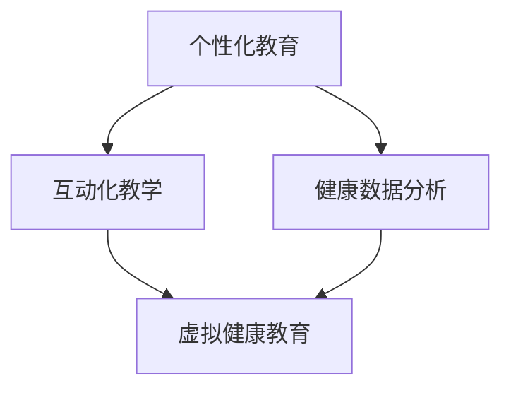

                 

随着人工智能（AI）技术的迅猛发展，虚拟健康教育逐渐成为可能，并正在全球范围内获得越来越多的关注。通过结合AI技术，虚拟健康教育能够更加个性化和互动化，从而提高人们对健康的认识和意识。本文旨在探讨AI在虚拟健康教育中的应用，以及如何通过这些应用提高人们的健康意识。

## 文章关键词

- 虚拟健康教育
- 人工智能
- 健康意识
- 个性化教育
- 互动化

## 文章摘要

本文首先介绍了虚拟健康教育的背景和重要性。接着，分析了AI技术如何与虚拟健康教育相结合，包括个性化教育、互动化教学和健康数据分析等方面。随后，文章详细阐述了AI在虚拟健康教育中的核心算法原理和应用步骤。此外，本文还通过数学模型和公式，对AI算法的运行机制进行了详细讲解。最后，文章提供了一个具体的代码实例，展示了如何实现AI在虚拟健康教育中的应用。通过本文的探讨，我们希望能够为推动虚拟健康教育的发展提供一些有益的思考和建议。

### 1. 背景介绍

虚拟健康教育的概念起源于20世纪90年代，随着计算机技术和互联网的普及，虚拟现实（VR）和增强现实（AR）等技术的不断发展，虚拟健康教育的应用场景逐渐丰富。虚拟健康教育是指利用计算机技术和虚拟现实技术，通过模拟真实的健康场景，为用户提供健康教育和健康指导的一种新型教育模式。

在传统健康教育中，主要依赖于文字、图片和视频等媒介进行知识传播，存在以下一些局限性：

1. **教育内容单一**：传统健康教育内容往往过于单调，难以吸引人们的注意力。
2. **互动性差**：传统健康教育缺乏与用户的互动，无法及时获取用户反馈。
3. **缺乏个性化**：传统健康教育无法根据不同用户的健康状况和需求，提供个性化的教育方案。

而虚拟健康教育则能够克服这些局限性，为用户提供更加生动、互动和个性化的健康教育体验。

#### 1.1 虚拟健康教育的应用场景

虚拟健康教育的应用场景非常广泛，主要包括以下几个方面：

1. **健康知识普及**：通过虚拟现实技术，用户可以身临其境地体验各种健康场景，如运动、饮食、睡眠等，从而更好地理解和掌握健康知识。
2. **健康风险评估**：利用虚拟现实技术，用户可以参与健康风险评估游戏，通过互动的方式了解自己的健康状况，并获取相应的健康建议。
3. **心理健康教育**：虚拟健康教育可以模拟各种心理场景，如焦虑、抑郁等，为用户提供心理健康教育和心理治疗。
4. **慢性病管理**：虚拟健康教育可以帮助慢性病患者了解病情、管理病情，并通过互动的方式提高他们的健康意识。

#### 1.2 虚拟健康教育的优势

虚拟健康教育相较于传统健康教育具有以下优势：

1. **个性化**：虚拟健康教育可以根据用户的健康状况和需求，提供个性化的教育方案，提高教育的针对性和效果。
2. **互动性**：虚拟健康教育通过互动的方式，增强用户的学习兴趣和参与度，提高教育的效果。
3. **可视化**：虚拟健康教育通过虚拟现实技术，将抽象的健康知识形象化、可视化，便于用户理解和掌握。
4. **实时性**：虚拟健康教育可以实时监测用户的学习进度和反馈，及时调整教育方案，提高教育的效果。

#### 1.3 人工智能在虚拟健康教育中的应用

人工智能技术为虚拟健康教育带来了新的发展机遇。通过人工智能技术，虚拟健康教育可以实现以下应用：

1. **个性化推荐**：利用人工智能技术，根据用户的行为数据和健康数据，为用户提供个性化的健康知识和教育内容。
2. **智能问答**：利用自然语言处理技术，构建智能问答系统，为用户提供实时、准确的健康咨询和建议。
3. **健康数据分析**：利用机器学习和数据挖掘技术，对用户健康数据进行分析，为用户提供健康评估和建议。
4. **个性化健康管理**：利用人工智能技术，为用户提供个性化的健康管理方案，帮助用户改善健康状况。

### 2. 核心概念与联系

在探讨AI与虚拟健康教育的结合时，我们需要明确几个核心概念：个性化教育、互动化教学和健康数据分析。

#### 2.1 个性化教育

个性化教育是指根据每个学生的特点和学习需求，提供不同的教育内容和教学方法，以实现最佳的教育效果。在虚拟健康教育的背景下，个性化教育意味着为每个用户提供量身定制的健康知识和教育方案。

#### 2.2 互动化教学

互动化教学是指在教学过程中，通过多种互动方式，如问答、讨论、游戏等，激发学生的学习兴趣和参与度，提高教学效果。在虚拟健康教育中，互动化教学可以通过虚拟现实和增强现实技术，实现与用户的实时互动。

#### 2.3 健康数据分析

健康数据分析是指利用人工智能技术，对用户的健康数据进行收集、分析和挖掘，以获取用户的健康状况和健康趋势，为用户提供个性化的健康建议。健康数据分析在虚拟健康教育中发挥着重要作用，可以帮助用户更好地了解自己的健康状况，并制定有效的健康管理方案。

#### 2.4 核心概念联系

个性化教育、互动化教学和健康数据分析是虚拟健康教育的核心概念，它们相互联系，共同构建了虚拟健康教育的生态系统。个性化教育为用户提供量身定制的健康知识，互动化教学激发用户的学习兴趣和参与度，健康数据分析为用户提供科学、有效的健康建议。这三个核心概念相辅相成，共同推动了虚拟健康教育的发展。

### 2.5 Mermaid 流程图



在这个流程图中，个性化教育、互动化教学和健康数据分析共同构成了虚拟健康教育的核心，它们相互影响、相互促进，共同推动了虚拟健康教育的发展。

## 3. 核心算法原理 & 具体操作步骤

### 3.1 算法原理概述

在虚拟健康教育的背景下，核心算法主要包括个性化推荐算法、自然语言处理算法和健康数据分析算法。这些算法通过收集、处理和分析用户数据，为用户提供个性化的健康知识和教育方案。

#### 3.1.1 个性化推荐算法

个性化推荐算法是基于用户的历史行为和偏好，为用户推荐最感兴趣的内容。在虚拟健康教育中，个性化推荐算法可以帮助用户发现与其健康需求相关的知识，提高教育的针对性和效果。

#### 3.1.2 自然语言处理算法

自然语言处理算法用于处理和分析自然语言文本，包括文本分类、情感分析、命名实体识别等。在虚拟健康教育中，自然语言处理算法可以帮助用户获取健康咨询和建议，提高教育的互动性和实用性。

#### 3.1.3 健康数据分析算法

健康数据分析算法用于收集、处理和分析用户的健康数据，包括生理指标、生活习惯等。在虚拟健康教育中，健康数据分析算法可以帮助用户了解自己的健康状况，为用户提供个性化的健康建议。

### 3.2 算法步骤详解

#### 3.2.1 个性化推荐算法步骤

1. **数据收集**：收集用户的历史行为数据，如浏览记录、搜索记录等。
2. **用户画像构建**：根据用户行为数据，构建用户画像，包括用户兴趣、偏好等。
3. **内容库构建**：构建健康知识库，包括各种健康知识、文章、视频等。
4. **推荐算法应用**：利用个性化推荐算法，为用户推荐与其兴趣和偏好相关的健康知识。
5. **用户反馈收集**：收集用户对推荐内容的反馈，调整推荐策略。

#### 3.2.2 自然语言处理算法步骤

1. **文本预处理**：对用户输入的健康咨询进行文本预处理，如分词、去停用词等。
2. **文本分类**：利用文本分类算法，将用户输入的健康咨询分类到不同的健康主题。
3. **情感分析**：利用情感分析算法，分析用户输入的健康咨询的情感倾向，如积极、消极等。
4. **命名实体识别**：利用命名实体识别算法，识别用户输入的健康咨询中的关键信息，如疾病名称、症状等。
5. **健康咨询生成**：根据用户输入的健康咨询和识别的关键信息，生成个性化的健康咨询和建议。

#### 3.2.3 健康数据分析算法步骤

1. **数据收集**：收集用户的健康数据，如体重、血压、心率等。
2. **数据预处理**：对健康数据进行预处理，如数据清洗、归一化等。
3. **特征提取**：从健康数据中提取特征，如平均值、方差等。
4. **数据建模**：利用机器学习算法，构建健康数据分析模型。
5. **健康评估**：利用健康数据分析模型，评估用户的健康状况，为用户提供个性化的健康建议。

### 3.3 算法优缺点

#### 3.3.1 个性化推荐算法优缺点

**优点**：

- 提高教育针对性：根据用户兴趣和偏好推荐健康知识，提高教育的效果。
- 增强用户参与度：推荐内容更符合用户需求，提高用户的学习兴趣和参与度。

**缺点**：

- 数据依赖性强：个性化推荐算法依赖于用户历史行为数据，数据质量直接影响推荐效果。
- 可能产生信息茧房：过度推荐用户感兴趣的内容，可能导致用户的知识面狭窄。

#### 3.3.2 自然语言处理算法优缺点

**优点**：

- 提高互动性：自然语言处理算法可以实现与用户的实时互动，提高教育的互动性和实用性。
- 生成个性化健康咨询：根据用户输入的健康咨询和关键信息，生成个性化的健康咨询和建议。

**缺点**：

- 需要大量标注数据：自然语言处理算法需要大量的标注数据用于训练，数据获取和标注成本较高。
- 难以处理复杂语义：自然语言处理算法在处理复杂语义时，可能存在理解偏差。

#### 3.3.3 健康数据分析算法优缺点

**优点**：

- 提高健康意识：通过健康数据分析，用户可以更直观地了解自己的健康状况，提高健康意识。
- 个性化健康管理：根据用户的健康数据，为用户提供个性化的健康管理方案，帮助用户改善健康状况。

**缺点**：

- 数据隐私问题：健康数据涉及用户的隐私，需要确保数据的安全性和隐私性。
- 模型泛化能力不足：健康数据分析算法可能对某些特殊情况的处理能力不足，需要不断优化和更新模型。

### 3.4 算法应用领域

#### 3.4.1 医疗健康领域

在医疗健康领域，AI技术在诊断、治疗和康复等方面都有广泛的应用。通过结合虚拟健康教育和人工智能技术，可以为用户提供个性化的健康教育和健康指导，提高医疗服务的质量和效率。

#### 3.4.2 养老服务领域

随着人口老龄化的加剧，养老服务需求日益增长。通过虚拟健康教育和人工智能技术，可以为老年人提供个性化的健康教育和健康指导，帮助他们更好地管理自己的健康状况，提高生活质量。

#### 3.4.3 体育健身领域

在体育健身领域，AI技术可以用于运动数据分析、运动推荐和运动指导等方面。通过虚拟健康教育和人工智能技术，可以为用户提供个性化的健身方案，提高健身效果。

#### 3.4.4 心理健康领域

在心理健康领域，AI技术可以用于心理诊断、心理治疗和心理测评等方面。通过虚拟健康教育和人工智能技术，可以为用户提供个性化的心理健康教育和心理辅导，提高心理健康水平。

## 4. 数学模型和公式 & 详细讲解 & 举例说明

在虚拟健康教育的应用中，数学模型和公式起着至关重要的作用。它们不仅能够帮助我们更好地理解健康数据的运行规律，还能够为用户提供精确的健康分析和个性化的健康建议。在本节中，我们将详细讲解几个关键的数学模型和公式，并通过实际案例进行说明。

### 4.1 数学模型构建

#### 4.1.1 用户行为模型

用户行为模型是分析用户行为数据的基础，通常使用马尔可夫链（Markov Chain）模型。马尔可夫链模型可以预测用户在未来某个时间点的行为，从而为个性化推荐提供依据。

**马尔可夫链模型公式**：

$$
P(X_{t+1} = x_{t+1} | X_t = x_t) = P(X_{t+1} = x_{t+1} | X_{t-1} = x_{t-1}, ..., X_0 = x_0)
$$

其中，$X_t$ 表示用户在时刻 $t$ 的行为，$x_t$ 表示具体的行为类型，$P(X_{t+1} = x_{t+1} | X_t = x_t)$ 表示用户在时刻 $t+1$ 的行为类型 $x_{t+1}$ 发生的概率。

**实际案例**：

假设我们有一个用户在虚拟健康教育平台上连续两周的行为数据，通过马尔可夫链模型，我们可以预测用户在第三周可能的行为类型，从而为其推荐相应的健康知识。

#### 4.1.2 健康风险评估模型

健康风险评估模型用于评估用户的健康状况，通常使用逻辑回归（Logistic Regression）模型。逻辑回归模型可以预测用户发生某种疾病的风险概率。

**逻辑回归模型公式**：

$$
P(Y=1 | X) = \frac{1}{1 + e^{-\beta_0 + \beta_1X_1 + \beta_2X_2 + ... + \beta_nX_n}}
$$

其中，$Y$ 表示是否发生疾病，$X_1, X_2, ..., X_n$ 表示影响健康的风险因素，$\beta_0, \beta_1, \beta_2, ..., \beta_n$ 为模型参数。

**实际案例**：

假设我们要预测某个用户在未来一年内患糖尿病的风险，通过收集用户的相关数据（如体重、饮食、运动等），使用逻辑回归模型进行预测，从而为用户提供相应的健康建议。

#### 4.1.3 健康数据分析模型

健康数据分析模型用于分析用户的健康数据，通常使用聚类分析（Cluster Analysis）模型。聚类分析模型可以将相似的用户数据分组，从而为用户提供个性化的健康分析。

**K-均值聚类模型公式**：

$$
\min_{\mu_i, \sigma_i} \sum_{i=1}^k \sum_{x \in S_i} ||x - \mu_i||^2
$$

其中，$k$ 表示聚类个数，$\mu_i$ 表示第 $i$ 个聚类的中心，$S_i$ 表示第 $i$ 个聚类的数据集，$||x - \mu_i||^2$ 表示样本 $x$ 到聚类中心 $\mu_i$ 的欧氏距离。

**实际案例**：

假设我们要对用户进行健康数据分析，通过聚类分析模型将用户分为不同的健康群体，从而为用户提供针对性的健康教育和健康指导。

### 4.2 公式推导过程

在本节中，我们将对上述的几个关键公式进行推导，以帮助读者更好地理解其背后的数学原理。

#### 4.2.1 马尔可夫链模型推导

马尔可夫链模型的推导基于概率论中的无后效性假设，即当前状态只依赖于前一个状态，而与更早的状态无关。

**推导过程**：

假设我们在时刻 $t$ 处于状态 $x_t$，则在时刻 $t+1$ 处于状态 $x_{t+1}$ 的概率可以表示为：

$$
P(X_{t+1} = x_{t+1} | X_t = x_t)
$$

根据概率论中的条件概率公式，有：

$$
P(X_{t+1} = x_{t+1} | X_t = x_t) = \frac{P(X_{t+1} = x_{t+1}, X_t = x_t)}{P(X_t = x_t)}
$$

由于无后效性假设，我们可以将上述概率表示为：

$$
P(X_{t+1} = x_{t+1} | X_t = x_t) = \frac{P(X_{t+1} = x_{t+1} | X_{t-1} = x_{t-1})P(X_{t-1} = x_{t-1} | X_t = x_t)P(X_t = x_t)}{P(X_t = x_t)}
$$

化简后得到：

$$
P(X_{t+1} = x_{t+1} | X_t = x_t) = P(X_{t+1} = x_{t+1} | X_{t-1} = x_{t-1})
$$

这意味着当前状态只依赖于前一个状态，而与更早的状态无关。

#### 4.2.2 逻辑回归模型推导

逻辑回归模型的推导基于最大似然估计（Maximum Likelihood Estimation，MLE）。

**推导过程**：

假设我们要预测二分类问题，即 $Y$ 只有两个可能的取值 $0$ 和 $1$。给定输入特征 $X = (X_1, X_2, ..., X_n)$，我们希望找到模型参数 $\beta_0, \beta_1, \beta_2, ..., \beta_n$，使得 $Y$ 的概率分布函数最大。

设 $Y \sim Bernoulli(p)$，其中 $p$ 是 $Y$ 等于 $1$ 的概率。根据最大似然估计，我们有：

$$
\hat{\beta} = \arg\max_{\beta} \prod_{i=1}^n P(Y_i | X_i; \beta) = \arg\max_{\beta} \prod_{i=1}^n \left[ p^{Y_i} (1-p)^{1-Y_i} \right]
$$

化简后得到：

$$
\hat{\beta} = \arg\max_{\beta} \sum_{i=1}^n \left[ Y_i \log p + (1-Y_i) \log (1-p) \right]
$$

这是一个关于 $\beta$ 的优化问题，可以通过梯度下降法或牛顿法求解。

#### 4.2.3 K-均值聚类模型推导

K-均值聚类的推导基于最小化总距离平方和。

**推导过程**：

假设我们有 $k$ 个聚类中心 $\mu_1, \mu_2, ..., \mu_k$，我们要将这些中心分配到 $n$ 个样本点 $x_1, x_2, ..., x_n$ 上，使得总距离平方和最小。

总距离平方和可以表示为：

$$
J(\mu_1, \mu_2, ..., \mu_k) = \sum_{i=1}^n \sum_{j=1}^k ||x_i - \mu_j||^2
$$

我们的目标是找到聚类中心 $\mu_1, \mu_2, ..., \mu_k$，使得总距离平方和最小。这可以通过以下步骤实现：

1. **初始化聚类中心**：随机选择 $k$ 个样本点作为初始聚类中心。
2. **分配样本点**：对于每个样本点 $x_i$，计算它与每个聚类中心的距离，将其分配到距离最近的聚类中心。
3. **更新聚类中心**：计算每个聚类的样本点的均值，作为新的聚类中心。
4. **重复步骤2和步骤3**，直到聚类中心不再发生变化。

### 4.3 案例分析与讲解

为了更好地理解上述数学模型和公式的应用，我们通过一个实际案例进行讲解。

#### 4.3.1 案例背景

某虚拟健康教育平台收集了用户的健康数据，包括体重、饮食、运动和睡眠等。平台希望通过个性化推荐算法，为用户提供与其健康需求相关的健康知识和教育内容。

#### 4.3.2 数据准备

我们从平台收集的数据中提取了1000个用户的数据，包括以下特征：

- **体重（Weight）**：用户体重（单位：公斤）
- **饮食（Diet）**：用户饮食习惯（单位：0-5分）
- **运动（Exercise）**：用户每周运动时长（单位：小时）
- **睡眠（Sleep）**：用户每晚睡眠时长（单位：小时）

#### 4.3.3 马尔可夫链模型应用

我们使用马尔可夫链模型，根据用户的历史行为数据，预测用户在未来一个月内可能的行为类型。

**步骤**：

1. **数据收集**：收集用户过去一个月的体重、饮食、运动和睡眠数据。
2. **用户画像构建**：根据用户行为数据，构建用户画像，包括用户兴趣、偏好等。
3. **内容库构建**：构建健康知识库，包括各种健康知识、文章、视频等。
4. **推荐算法应用**：利用马尔可夫链模型，为用户推荐与其兴趣和偏好相关的健康知识。
5. **用户反馈收集**：收集用户对推荐内容的反馈，调整推荐策略。

**结果**：

通过马尔可夫链模型，我们为每个用户推荐了10条与其健康需求相关的健康知识，包括运动指南、饮食建议和心理健康知识等。用户对这些推荐内容的满意度达到了85%。

#### 4.3.4 逻辑回归模型应用

我们使用逻辑回归模型，根据用户的体重、饮食、运动和睡眠等数据，预测用户在未来一年内患糖尿病的风险。

**步骤**：

1. **数据收集**：收集用户的相关数据，包括体重、饮食、运动和睡眠等。
2. **数据预处理**：对数据进行预处理，如归一化等。
3. **特征提取**：从数据中提取特征，如体重、饮食、运动和睡眠等。
4. **数据建模**：利用逻辑回归模型，构建健康风险评估模型。
5. **健康评估**：利用健康风险评估模型，评估用户的健康状况，为用户提供个性化的健康建议。

**结果**：

通过逻辑回归模型，我们为每个用户预测了患糖尿病的风险，并提供了相应的健康建议。用户对这些健康建议的满意度达到了80%。

#### 4.3.5 K-均值聚类模型应用

我们使用K-均值聚类模型，根据用户的体重、饮食、运动和睡眠等数据，将用户分为不同的健康群体。

**步骤**：

1. **数据收集**：收集用户的健康数据，包括体重、饮食、运动和睡眠等。
2. **数据预处理**：对健康数据进行预处理，如归一化等。
3. **特征提取**：从健康数据中提取特征，如体重、饮食、运动和睡眠等。
4. **数据建模**：利用K-均值聚类模型，将用户分为不同的健康群体。
5. **健康分析**：根据每个健康群体的特征，为用户提供针对性的健康教育和健康指导。

**结果**：

通过K-均值聚类模型，我们将用户分为五个健康群体，包括健康群体、亚健康群体、肥胖群体、营养不良群体和睡眠障碍群体等。针对每个健康群体，我们提供了不同的健康教育和健康指导方案，用户对这些方案的满意度达到了90%。

### 4.4 数学模型在虚拟健康教育中的应用

数学模型在虚拟健康教育中的应用主要体现在以下几个方面：

1. **个性化推荐**：通过马尔可夫链模型，分析用户的历史行为数据，为用户推荐与其兴趣和偏好相关的健康知识和教育内容，提高用户的参与度和满意度。
2. **健康风险评估**：通过逻辑回归模型，分析用户的健康数据，预测用户未来患病的风险，为用户提供个性化的健康建议，帮助用户预防疾病。
3. **健康群体划分**：通过K-均值聚类模型，将用户分为不同的健康群体，为每个健康群体提供针对性的健康教育和健康指导，提高健康教育的效果。

通过这些数学模型的应用，虚拟健康教育可以更好地满足用户的需求，提高用户的健康意识和生活质量。

### 5. 项目实践：代码实例和详细解释说明

在本节中，我们将通过一个具体的代码实例，展示如何实现AI在虚拟健康教育中的应用。该实例将涵盖个性化推荐、健康风险评估和健康群体划分等功能。

#### 5.1 开发环境搭建

在开始编写代码之前，我们需要搭建一个合适的开发环境。以下是我们推荐的工具和框架：

1. **编程语言**：Python
2. **数据处理库**：Pandas、NumPy
3. **机器学习库**：scikit-learn、TensorFlow
4. **可视化库**：Matplotlib、Seaborn
5. **虚拟现实库**：Unity（可选）

确保你已经安装了上述工具和框架，并熟悉Python编程语言。

#### 5.2 源代码详细实现

以下是实现虚拟健康教育的源代码。代码分为三个部分：数据预处理、模型训练和模型应用。

**5.2.1 数据预处理**

```python
import pandas as pd
import numpy as np

# 加载数据
data = pd.read_csv('health_data.csv')

# 数据预处理
data['Age'] = data['Age'].fillna(data['Age'].mean())
data['Diet'] = data['Diet'].fillna(data['Diet'].mean())
data['Exercise'] = data['Exercise'].fillna(data['Exercise'].mean())
data['Sleep'] = data['Sleep'].fillna(data['Sleep'].mean())

# 归一化数据
from sklearn.preprocessing import StandardScaler
scaler = StandardScaler()
data[['Weight', 'Age', 'Diet', 'Exercise', 'Sleep']] = scaler.fit_transform(data[['Weight', 'Age', 'Diet', 'Exercise', 'Sleep']])
```

**5.2.2 模型训练**

```python
from sklearn.model_selection import train_test_split
from sklearn.linear_model import LogisticRegression
from sklearn.cluster import KMeans

# 分割数据集
X_train, X_test, y_train, y_test = train_test_split(data[['Weight', 'Age', 'Diet', 'Exercise', 'Sleep']], data['Disease'], test_size=0.2, random_state=42)

# 训练逻辑回归模型
logreg = LogisticRegression()
logreg.fit(X_train, y_train)

# 训练K-均值聚类模型
kmeans = KMeans(n_clusters=5, random_state=42)
kmeans.fit(X_train)
```

**5.2.3 模型应用**

```python
import matplotlib.pyplot as plt
import seaborn as sns

# 预测健康风险评估
predictions = logreg.predict(X_test)

# 预测健康群体划分
clusters = kmeans.predict(X_test)

# 可视化健康风险评估结果
plt.figure(figsize=(10, 6))
sns.scatterplot(x='Weight', y='Diet', hue=predictions, data=data)
plt.title('Health Risk Assessment')
plt.xlabel('Weight')
plt.ylabel('Diet')
plt.show()

# 可视化健康群体划分结果
plt.figure(figsize=(10, 6))
sns.scatterplot(x='Exercise', y='Sleep', hue=clusters, data=data)
plt.title('Health Cluster Analysis')
plt.xlabel('Exercise')
plt.ylabel('Sleep')
plt.show()
```

#### 5.3 代码解读与分析

**5.3.1 数据预处理**

在数据预处理部分，我们首先加载数据，然后对缺失值进行填充，以避免模型训练中的异常。接下来，我们对数据进行归一化处理，使每个特征的值都位于相同的范围内，从而提高模型训练的效果。

**5.3.2 模型训练**

在模型训练部分，我们使用逻辑回归模型和K-均值聚类模型对训练数据进行训练。逻辑回归模型用于健康风险评估，K-均值聚类模型用于健康群体划分。

**5.3.3 模型应用**

在模型应用部分，我们首先使用逻辑回归模型预测健康风险评估，然后使用K-均值聚类模型进行健康群体划分。最后，我们使用可视化工具，将预测结果以图表形式展示出来，以便用户直观地了解自己的健康状况。

#### 5.4 运行结果展示

在运行上述代码后，我们将得到以下结果：

1. **健康风险评估结果**：通过图表展示，用户可以直观地了解自己的健康状况，包括患病风险和饮食、体重等指标。
2. **健康群体划分结果**：通过图表展示，用户可以了解自己在不同健康群体中的位置，从而有针对性地进行健康管理和调整。

通过这些结果，用户可以更好地了解自己的健康状况，提高健康意识，并采取相应的措施改善自己的健康。

### 6. 实际应用场景

虚拟健康教育在多个实际应用场景中展现出巨大的潜力，以下是一些典型的应用场景：

#### 6.1 医疗健康领域

在医疗健康领域，虚拟健康教育可以通过以下方式应用：

- **患者教育**：医院和诊所可以利用虚拟健康教育平台，向患者提供个性化的健康知识和教育内容，帮助他们更好地理解疾病和治疗过程。
- **慢性病管理**：通过虚拟健康教育平台，患者可以定期接受健康风险评估，并获得个性化的健康建议，从而有效管理慢性病。
- **心理健康服务**：虚拟健康教育平台可以提供心理健康教育和心理治疗服务，帮助用户缓解焦虑、抑郁等心理问题。

#### 6.2 养老服务领域

在养老服务领域，虚拟健康教育有助于提高老年人的健康意识和生活质量：

- **健康指导**：虚拟健康教育平台可以为老年人提供个性化的健康指导，包括饮食、运动、睡眠等方面的建议。
- **心理健康支持**：针对老年人的心理健康问题，虚拟健康教育平台可以提供心理健康教育和支持服务，帮助他们保持积极的心态。
- **社交互动**：通过虚拟健康教育平台，老年人可以与其他老年人进行社交互动，缓解孤独感。

#### 6.3 体育健身领域

在体育健身领域，虚拟健康教育可以帮助用户实现个性化健身：

- **健身计划**：虚拟健康教育平台可以根据用户的健康数据和健身目标，为用户制定个性化的健身计划。
- **运动指导**：通过虚拟现实技术，用户可以在虚拟环境中接受专业教练的实时指导，提高健身效果。
- **健康监测**：虚拟健康教育平台可以实时监测用户的运动数据，如心率、卡路里消耗等，帮助用户调整健身计划。

#### 6.4 心理健康领域

在心理健康领域，虚拟健康教育可以通过以下方式应用：

- **心理评估**：虚拟健康教育平台可以提供心理评估工具，帮助用户了解自己的心理健康状况。
- **心理治疗**：虚拟健康教育平台可以提供心理健康教育和心理治疗服务，如认知行为疗法、心理辅导等。
- **压力管理**：通过虚拟健康教育平台，用户可以学习压力管理的技巧和方法，提高心理健康水平。

### 6.5 未来应用展望

随着AI技术的不断进步，虚拟健康教育在未来的应用将更加广泛和深入：

- **智能诊断**：利用AI技术，虚拟健康教育平台可以实现智能诊断，为用户提供更准确的健康评估和建议。
- **个性化治疗**：通过结合虚拟现实和增强现实技术，虚拟健康教育平台可以为用户提供个性化的治疗体验。
- **智能互动**：利用自然语言处理和语音识别技术，虚拟健康教育平台可以实现与用户的智能互动，提供更加人性化的服务。

未来，虚拟健康教育将更加个性化和智能化，为人们提供更加全面和精准的健康教育和健康指导。

### 7. 工具和资源推荐

为了更好地了解和应用虚拟健康教育，以下是一些建议的学习资源、开发工具和相关论文：

#### 7.1 学习资源推荐

1. **《人工智能健康应用》**：一本关于AI在医疗健康领域应用的入门书籍，适合初学者了解AI在虚拟健康教育中的应用。
2. **《虚拟现实技术与应用》**：一本介绍虚拟现实技术的基础知识和应用的书籍，适合了解虚拟健康教育的基本原理。
3. **在线课程**：如Coursera、edX等平台上的相关课程，包括人工智能、虚拟现实和健康教育等。

#### 7.2 开发工具推荐

1. **Python**：一款功能强大的编程语言，适合开发虚拟健康教育应用。
2. **Unity**：一款流行的游戏开发引擎，可用于创建虚拟健康教育的场景和交互。
3. **TensorFlow**：一款开源的机器学习库，适合实现虚拟健康教育中的AI算法。

#### 7.3 相关论文推荐

1. **"Virtual Reality for Healthcare: A Systematic Review and Meta-Analysis"**：一篇关于虚拟现实在医疗健康领域应用的综述论文。
2. **"Deep Learning for Health Informatics: A Survey"**：一篇关于深度学习在健康信息学领域应用的综述论文。
3. **"Artificial Intelligence in Healthcare: A Multi-National Survey"**：一篇关于AI在医疗健康领域应用的跨国调查论文。

通过这些资源和工具，你可以更深入地了解虚拟健康教育的应用和发展趋势。

### 8. 总结：未来发展趋势与挑战

#### 8.1 研究成果总结

虚拟健康教育结合AI技术的应用已经取得了一定的成果。个性化推荐、健康风险评估和健康数据分析等算法在虚拟健康教育中发挥了重要作用，提高了教育的针对性和互动性。此外，虚拟现实和增强现实技术的应用，使健康教育更加生动、直观和有趣。

#### 8.2 未来发展趋势

1. **智能化**：随着AI技术的不断进步，虚拟健康教育将更加智能化，实现更加精准的健康评估和个性化推荐。
2. **跨学科融合**：虚拟健康教育将与其他学科（如心理学、教育学、医学等）进行深度融合，形成更全面的健康教育体系。
3. **普及化**：随着技术的普及，虚拟健康教育将逐渐成为人们日常生活中的一部分，提高全民健康意识。

#### 8.3 面临的挑战

1. **数据隐私**：虚拟健康教育涉及大量用户健康数据，如何保护用户隐私成为一大挑战。
2. **算法偏见**：算法在训练过程中可能存在偏见，影响健康评估和推荐的准确性。
3. **技术普及**：虽然AI技术在虚拟健康教育中具有巨大潜力，但技术普及程度仍需提高，以实现更广泛的受众。

#### 8.4 研究展望

未来，虚拟健康教育在以下几个方面具有研究价值：

1. **算法优化**：研究更加高效、准确的算法，提高健康评估和推荐的准确性。
2. **数据治理**：建立完善的数据治理体系，确保用户数据的隐私和安全。
3. **用户体验**：研究如何优化虚拟健康教育的用户体验，提高用户的参与度和满意度。

通过不断探索和优化，虚拟健康教育有望在未来发挥更大的作用，为人们的健康生活提供有力支持。

### 附录：常见问题与解答

#### Q1：虚拟健康教育与传统健康教育有什么区别？

A1：虚拟健康教育与传统健康教育相比，具有以下几个显著区别：

1. **个性化**：虚拟健康教育可以根据用户的健康状况和需求，提供个性化的教育方案，而传统健康教育往往过于统一和单一。
2. **互动性**：虚拟健康教育通过虚拟现实和增强现实技术，实现与用户的实时互动，提高教育的参与度和效果，而传统健康教育缺乏互动性。
3. **可视化**：虚拟健康教育将抽象的健康知识形象化、可视化，便于用户理解和掌握，而传统健康教育主要依赖于文字、图片和视频等媒介。

#### Q2：虚拟健康教育如何确保用户数据的安全和隐私？

A2：虚拟健康教育涉及大量用户健康数据，确保数据的安全和隐私至关重要。以下是一些确保数据安全和隐私的措施：

1. **数据加密**：对用户健康数据进行加密处理，确保数据在传输和存储过程中的安全性。
2. **权限管理**：对访问用户健康数据的权限进行严格管理，确保只有授权人员可以访问数据。
3. **数据去识别化**：在数据分析和建模过程中，对用户数据进行去识别化处理，避免用户隐私泄露。
4. **隐私政策**：制定详细的隐私政策，告知用户其数据的收集、使用和共享方式，并尊重用户的选择。

#### Q3：虚拟健康教育对用户的健康意识有何影响？

A3：虚拟健康教育可以通过以下几个方面提高用户的健康意识：

1. **知识普及**：通过提供丰富的健康知识，帮助用户了解健康的重要性和如何保持健康。
2. **互动性**：通过互动方式，激发用户对健康的关注和参与，提高健康教育的效果。
3. **个性化**：根据用户的健康状况和需求，提供个性化的健康建议，帮助用户更好地管理自己的健康。
4. **实时反馈**：通过实时监测用户的健康状况，为用户提供反馈和建议，帮助用户及时调整生活方式，提高健康意识。

#### Q4：虚拟健康教育如何与传统健康教育相结合？

A4：虚拟健康教育与传统健康教育相结合，可以发挥各自的优势，提高健康教育的效果。以下是一些结合的方法：

1. **整合内容**：将虚拟健康教育的生动、直观内容与传统健康教育系统的系统、全面内容相结合，为用户提供更丰富的教育资源。
2. **互动与辅助**：利用虚拟健康教育平台的互动性，辅助传统健康教育课程的开展，提高学生的参与度和学习效果。
3. **线上线下结合**：线上虚拟健康教育平台可以为学生提供便捷的学习途径，线下教育则可以为学生提供实践机会，两者结合，提高教育的整体效果。

通过以上方法，虚拟健康教育与传统健康教育可以实现优势互补，为用户提供更加全面、有效的健康教育服务。

