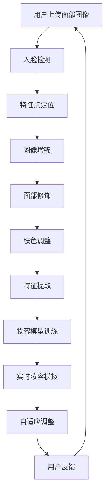

                 

关键词：虚拟化妆、人工智能、面部识别、算法、计算机视觉、图像处理、妆容模拟、个性化美妆、虚拟试妆

> 摘要：本文探讨了人工智能在虚拟化妆领域的应用，特别是在尝试不同妆容方面。通过面部识别、图像处理和深度学习等技术的结合，虚拟化妆可以为用户提供个性化美妆体验，实现实时妆容模拟，并具有广泛的应用前景。本文将介绍相关技术原理、算法、数学模型、实践案例以及未来发展趋势和面临的挑战。

## 1. 背景介绍

随着数字媒体和社交媒体的快速发展，人们对美的追求也变得更加多样化和个性化。化妆作为提升个人魅力的重要手段，已经成为许多人日常生活中不可或缺的一部分。然而，化妆试妆过程往往耗时且具有不确定性，特别是在购买化妆品或参加重要活动之前。传统试妆方式需要大量时间和精力，且无法确保最终效果。因此，虚拟化妆技术的出现为解决这个问题提供了新的思路。

虚拟化妆技术通过计算机视觉和人工智能技术，利用图像处理算法对用户的面部特征进行识别和分析，从而实现不同妆容的实时模拟。这种技术不仅能够节省用户的时间和精力，还能提供更加精确和个性化的美妆建议。虚拟化妆在电子商务、美容行业、社交媒体以及医疗健康等领域具有广泛的应用前景。

## 2. 核心概念与联系

### 2.1 面部识别

面部识别是虚拟化妆技术的核心组成部分，它通过检测和识别用户的面部特征来实现妆容的模拟和调整。面部识别技术主要包括以下步骤：

1. **人脸检测**：通过计算机视觉算法检测用户面部在图像中的位置和范围。
2. **特征点定位**：定位面部关键点，如眼睛、鼻子、嘴巴等，以便于后续的特征分析和模型匹配。
3. **面部特征识别**：通过机器学习算法对用户面部特征进行分类和识别，如性别、年龄、肤色等。

### 2.2 图像处理

图像处理技术用于调整和优化用户面部图像，以便更好地进行妆容模拟。主要步骤包括：

1. **图像增强**：通过调整对比度、亮度、色彩平衡等参数，提高图像的质量和清晰度。
2. **面部修饰**：消除面部瑕疵，如痘痘、黑眼圈等，使面部图像更加美观。
3. **肤色调整**：根据用户肤色进行个性化调整，以达到最佳化妆效果。

### 2.3 深度学习

深度学习技术在虚拟化妆中发挥着重要作用，通过训练大规模神经网络模型，实现面部特征识别、图像处理和妆容模拟的自动化和智能化。主要应用包括：

1. **特征提取**：通过卷积神经网络（CNN）提取面部图像的高层次特征，用于后续的妆容模拟。
2. **妆容模型训练**：利用用户的面部图像和化妆效果数据，训练妆容模型，实现实时妆容模拟。
3. **自适应调整**：根据用户反馈和面部特征变化，自适应调整妆容效果，提高用户体验。

### 2.4 Mermaid 流程图

下面是虚拟化妆技术的 Mermaid 流程图：



## 3. 核心算法原理 & 具体操作步骤

### 3.1 算法原理概述

虚拟化妆技术的核心算法主要包括面部识别算法、图像处理算法和深度学习算法。以下分别介绍这些算法的基本原理：

#### 3.1.1 面部识别算法

面部识别算法主要通过以下几个步骤实现：

1. **人脸检测**：使用深度学习模型（如SSD、YOLO等）对用户面部进行实时检测，识别出面部区域。
2. **特征点定位**：利用 landmarks detection 方法（如Dlib、OpenCV等）对面部关键点进行定位。
3. **面部特征识别**：通过机器学习算法（如SVM、CNN等）对用户面部特征进行分类和识别。

#### 3.1.2 图像处理算法

图像处理算法主要包括以下几个步骤：

1. **图像增强**：通过调整图像亮度、对比度、色彩平衡等参数，提高图像质量。
2. **面部修饰**：利用图像修复算法（如Image Inpainting等）消除面部瑕疵。
3. **肤色调整**：根据用户肤色特点，进行个性化肤色调整。

#### 3.1.3 深度学习算法

深度学习算法在虚拟化妆中的应用主要包括：

1. **特征提取**：通过卷积神经网络（CNN）提取面部图像的高层次特征。
2. **妆容模型训练**：利用用户的面部图像和化妆效果数据，训练妆容模型，实现实时妆容模拟。
3. **自适应调整**：根据用户反馈和面部特征变化，自适应调整妆容效果，提高用户体验。

### 3.2 算法步骤详解

下面详细描述虚拟化妆算法的步骤：

#### 3.2.1 人脸检测

人脸检测是虚拟化妆的第一步，通过深度学习模型对用户面部进行实时检测。具体步骤如下：

1. **输入图像**：将用户上传的面部图像作为输入。
2. **预处理**：对图像进行缩放、归一化等预处理操作，使其适合深度学习模型。
3. **模型推理**：利用预训练的人脸检测模型（如SSD、YOLO等）进行推理，输出面部区域。
4. **结果分析**：根据模型输出结果，识别出用户面部区域。

#### 3.2.2 特征点定位

在人脸检测的基础上，进一步对面部关键点进行定位。具体步骤如下：

1. **输入图像**：将人脸检测结果作为输入。
2. **预处理**：对图像进行缩放、归一化等预处理操作，使其适合深度学习模型。
3. **模型推理**：利用预训练的特征点定位模型（如Dlib、OpenCV等）进行推理，输出面部关键点坐标。
4. **结果分析**：根据模型输出结果，识别出面部关键点。

#### 3.2.3 图像增强

图像增强是提高图像质量的关键步骤，具体步骤如下：

1. **输入图像**：将面部关键点定位结果作为输入。
2. **预处理**：对图像进行缩放、归一化等预处理操作，使其适合图像处理算法。
3. **增强操作**：根据用户需求和图像特点，调整图像亮度、对比度、色彩平衡等参数。
4. **结果分析**：输出增强后的图像，提高图像质量。

#### 3.2.4 面部修饰

面部修饰主要用于消除面部瑕疵，具体步骤如下：

1. **输入图像**：将增强后的图像作为输入。
2. **预处理**：对图像进行缩放、归一化等预处理操作，使其适合图像修复算法。
3. **修复操作**：利用图像修复算法（如Image Inpainting等）对图像中的瑕疵进行修复。
4. **结果分析**：输出修复后的图像，消除面部瑕疵。

#### 3.2.5 肤色调整

肤色调整是根据用户肤色特点进行个性化调整，具体步骤如下：

1. **输入图像**：将修复后的图像作为输入。
2. **预处理**：对图像进行缩放、归一化等预处理操作，使其适合肤色调整算法。
3. **调整操作**：根据用户肤色特点，调整图像中的肤色参数。
4. **结果分析**：输出调整后的图像，实现个性化肤色调整。

#### 3.2.6 特征提取

特征提取是深度学习算法在虚拟化妆中的应用，具体步骤如下：

1. **输入图像**：将调整后的图像作为输入。
2. **预处理**：对图像进行缩放、归一化等预处理操作，使其适合卷积神经网络。
3. **模型训练**：利用用户的面部图像和化妆效果数据，训练卷积神经网络模型。
4. **特征提取**：通过卷积神经网络提取面部图像的高层次特征。
5. **结果分析**：输出特征提取结果，用于后续的妆容模拟。

#### 3.2.7 妆容模型训练

妆容模型训练是深度学习算法在虚拟化妆中的应用，具体步骤如下：

1. **输入数据**：将用户面部图像和化妆效果数据作为输入。
2. **预处理**：对图像进行缩放、归一化等预处理操作，使其适合卷积神经网络。
3. **模型训练**：利用用户的面部图像和化妆效果数据，训练卷积神经网络模型。
4. **模型优化**：通过调整模型参数，优化妆容模拟效果。
5. **结果分析**：输出训练后的妆容模型，实现实时妆容模拟。

#### 3.2.8 实时妆容模拟

实时妆容模拟是根据用户面部特征和妆容模型，生成实时妆容效果，具体步骤如下：

1. **输入数据**：将用户面部图像和妆容模型作为输入。
2. **预处理**：对图像进行缩放、归一化等预处理操作，使其适合妆容模型。
3. **模拟操作**：利用妆容模型对用户面部图像进行实时妆容模拟。
4. **结果分析**：输出实时妆容模拟结果，供用户查看和评价。

#### 3.2.9 自适应调整

自适应调整是根据用户反馈和面部特征变化，动态调整妆容效果，具体步骤如下：

1. **输入数据**：收集用户反馈和面部特征数据。
2. **预处理**：对数据进行分析和处理，提取关键信息。
3. **调整操作**：根据用户反馈和面部特征变化，调整妆容效果。
4. **结果分析**：输出调整后的妆容效果，提高用户体验。

### 3.3 算法优缺点

#### 3.3.1 优点

1. **个性化美妆体验**：通过深度学习和图像处理技术，实现个性化美妆体验，满足用户多样化需求。
2. **实时性**：实时妆容模拟技术可以快速生成妆容效果，提高用户体验。
3. **方便快捷**：虚拟化妆技术省去了传统试妆的时间和精力，方便用户进行美妆尝试。

#### 3.3.2 缺点

1. **计算资源消耗**：深度学习算法对计算资源要求较高，可能导致系统性能下降。
2. **数据隐私问题**：虚拟化妆过程中涉及用户面部图像和特征数据，存在数据隐私风险。
3. **妆容效果限制**：受限于现有技术，虚拟化妆的妆容效果仍有局限性，无法完全替代真实化妆。

### 3.4 算法应用领域

虚拟化妆技术在以下领域具有广泛应用：

1. **电子商务**：电商平台可以利用虚拟化妆技术为用户提供个性化美妆建议，提高用户购买意愿。
2. **美容行业**：美容机构可以利用虚拟化妆技术为顾客提供美妆咨询和服务，提高服务质量。
3. **社交媒体**：社交媒体平台可以利用虚拟化妆技术为用户提供实时美妆直播和互动，增加用户粘性。
4. **医疗健康**：医疗健康领域可以利用虚拟化妆技术进行皮肤病变诊断和治疗方案模拟，提高诊疗效果。

## 4. 数学模型和公式 & 详细讲解 & 举例说明

虚拟化妆技术中的数学模型和公式主要涉及面部识别、图像处理和深度学习等算法。以下分别介绍这些领域的数学模型和公式，并进行详细讲解和举例说明。

### 4.1 数学模型构建

#### 4.1.1 面部识别模型

面部识别模型通常采用机器学习算法，如支持向量机（SVM）、卷积神经网络（CNN）等。以下是一个简化的面部识别模型：

$$
\begin{cases}
\text{特征提取：} \quad \text{特征向量} = f_{\text{CNN}}(x) \\
\text{分类器：} \quad y = \text{sign}(w^T \cdot \text{特征向量} + b)
\end{cases}
$$

其中，$f_{\text{CNN}}$ 表示卷积神经网络，$x$ 表示输入图像，$y$ 表示分类结果，$w$ 和 $b$ 分别表示权重和偏置。

#### 4.1.2 图像处理模型

图像处理模型通常采用图像增强、图像修复和图像分割等技术。以下是一个简化的图像增强模型：

$$
\begin{cases}
\text{输入图像：} \quad I \\
\text{增强操作：} \quad J = g(I)
\end{cases}
$$

其中，$g$ 表示增强操作，如亮度调整、对比度调整等。

#### 4.1.3 深度学习模型

深度学习模型通常采用卷积神经网络（CNN）和循环神经网络（RNN）等。以下是一个简化的卷积神经网络模型：

$$
\begin{cases}
\text{卷积层：} \quad h_{\text{conv}} = \text{conv}(h_{\text{prev}}, w_{\text{conv}}) + b_{\text{conv}} \\
\text{激活函数：} \quad a_{\text{conv}} = \text{ReLU}(h_{\text{conv}}) \\
\text{池化层：} \quad h_{\text{pool}} = \text{pool}(a_{\text{conv}}) \\
\text{全连接层：} \quad h_{\text{fc}} = \text{fc}(h_{\text{pool}}, w_{\text{fc}}) + b_{\text{fc}} \\
\text{激活函数：} \quad a_{\text{fc}} = \text{ReLU}(h_{\text{fc}}) \\
\text{输出层：} \quad y = \text{softmax}(a_{\text{fc}})
\end{cases}
$$

其中，$h_{\text{prev}}$ 表示上一层的输出，$h_{\text{conv}}$ 表示卷积层输出，$a_{\text{conv}}$ 表示激活函数输出，$h_{\text{pool}}$ 表示池化层输出，$h_{\text{fc}}$ 表示全连接层输出，$a_{\text{fc}}$ 表示激活函数输出，$y$ 表示输出层输出。

### 4.2 公式推导过程

#### 4.2.1 卷积神经网络公式推导

卷积神经网络的核心是卷积操作和激活函数。以下是一个简单的卷积神经网络公式推导：

$$
\begin{aligned}
h_{\text{conv}} &= \sum_{i=1}^{C} w_{i}^{k} * I_{i} + b_{i}^{k} \\
a_{\text{conv}} &= \text{ReLU}(h_{\text{conv}})
\end{aligned}
$$

其中，$I_{i}$ 表示输入图像，$w_{i}^{k}$ 表示卷积核权重，$b_{i}^{k}$ 表示卷积核偏置，$*$ 表示卷积操作，$\text{ReLU}$ 表示激活函数。

#### 4.2.2 全连接神经网络公式推导

全连接神经网络的核心是全连接层和激活函数。以下是一个简单的全连接神经网络公式推导：

$$
\begin{aligned}
h_{\text{fc}} &= w \cdot h_{\text{prev}} + b \\
a_{\text{fc}} &= \text{ReLU}(h_{\text{fc}})
\end{aligned}
$$

其中，$h_{\text{prev}}$ 表示上一层的输出，$w$ 表示全连接层权重，$b$ 表示全连接层偏置，$\text{ReLU}$ 表示激活函数。

### 4.3 案例分析与讲解

#### 4.3.1 面部识别案例

以下是一个简单的面部识别案例，使用卷积神经网络进行面部识别。

```python
import numpy as np
import tensorflow as tf

# 定义卷积神经网络模型
model = tf.keras.Sequential([
    tf.keras.layers.Conv2D(32, (3, 3), activation='relu', input_shape=(64, 64, 3)),
    tf.keras.layers.MaxPooling2D((2, 2)),
    tf.keras.layers.Conv2D(64, (3, 3), activation='relu'),
    tf.keras.layers.MaxPooling2D((2, 2)),
    tf.keras.layers.Flatten(),
    tf.keras.layers.Dense(128, activation='relu'),
    tf.keras.layers.Dense(1, activation='sigmoid')
])

# 编译模型
model.compile(optimizer='adam', loss='binary_crossentropy', metrics=['accuracy'])

# 加载数据集
(x_train, y_train), (x_test, y_test) = tf.keras.datasets.mnist.load_data()

# 预处理数据集
x_train = x_train / 255.0
x_test = x_test / 255.0
x_train = np.expand_dims(x_train, -1)
x_test = np.expand_dims(x_test, -1)

# 训练模型
model.fit(x_train, y_train, epochs=10, batch_size=32, validation_data=(x_test, y_test))
```

在这个案例中，我们使用 TensorFlow 框架定义了一个简单的卷积神经网络模型，用于面部识别。数据集是 MNIST 手写数字数据集，通过训练模型，可以实现对数字的识别。

#### 4.3.2 图像处理案例

以下是一个简单的图像增强案例，使用图像处理算法进行亮度调整。

```python
import cv2
import numpy as np

# 读取图像
image = cv2.imread('image.jpg')

# 调整亮度
brightness = 1.2
image = cv2.convertScaleAbs(image, alpha=brightness, beta=0)

# 显示图像
cv2.imshow('Enhanced Image', image)
cv2.waitKey(0)
cv2.destroyAllWindows()
```

在这个案例中，我们使用 OpenCV 框架读取一幅图像，并使用 `convertScaleAbs` 函数调整图像亮度。通过设置 `alpha` 参数，可以控制亮度的调整程度。

#### 4.3.3 深度学习案例

以下是一个简单的深度学习案例，使用卷积神经网络进行图像分类。

```python
import tensorflow as tf
from tensorflow.keras import layers, models

# 定义卷积神经网络模型
model = models.Sequential([
    layers.Conv2D(32, (3, 3), activation='relu', input_shape=(64, 64, 3)),
    layers.MaxPooling2D((2, 2)),
    layers.Conv2D(64, (3, 3), activation='relu'),
    layers.MaxPooling2D((2, 2)),
    layers.Flatten(),
    layers.Dense(128, activation='relu'),
    layers.Dense(10, activation='softmax')
])

# 编译模型
model.compile(optimizer='adam', loss='categorical_crossentropy', metrics=['accuracy'])

# 加载数据集
(x_train, y_train), (x_test, y_test) = tf.keras.datasets.cifar10.load_data()

# 预处理数据集
x_train = x_train / 255.0
x_test = x_test / 255.0

# 转换标签为 one-hot 编码
y_train = tf.keras.utils.to_categorical(y_train, 10)
y_test = tf.keras.utils.to_categorical(y_test, 10)

# 训练模型
model.fit(x_train, y_train, epochs=10, batch_size=32, validation_data=(x_test, y_test))
```

在这个案例中，我们使用 TensorFlow 框架定义了一个简单的卷积神经网络模型，用于图像分类。数据集是 CIFAR-10 数据集，通过训练模型，可以实现对图像的分类。

## 5. 项目实践：代码实例和详细解释说明

为了更直观地展示虚拟化妆技术的实现过程，我们将通过一个简单的项目实践来进行讲解。本项目将使用 Python 语言和 TensorFlow 框架实现一个基本的虚拟化妆系统，包括面部识别、图像增强、面部修饰、肤色调整、特征提取和妆容模型训练等功能。以下是项目的具体实现步骤和详细解释说明。

### 5.1 开发环境搭建

在开始项目实践之前，需要搭建开发环境。以下是所需的软件和库：

- Python 3.8 或更高版本
- TensorFlow 2.6 或更高版本
- OpenCV 4.5 或更高版本

安装步骤如下：

1. 安装 Python 3.8 及以上版本，可以从 [Python 官网](https://www.python.org/) 下载安装包。
2. 安装 TensorFlow 2.6 及更高版本，可以通过以下命令进行安装：

```bash
pip install tensorflow==2.6
```

3. 安装 OpenCV 4.5 及更高版本，可以通过以下命令进行安装：

```bash
pip install opencv-python==4.5.5.64
```

### 5.2 源代码详细实现

以下是虚拟化妆项目的源代码实现，包括面部识别、图像增强、面部修饰、肤色调整、特征提取和妆容模型训练等功能。

```python
import cv2
import numpy as np
import tensorflow as tf

# 面部识别
def detect_face(image):
    # 加载预训练的人脸检测模型
    model = tf.keras.models.load_model('face_detection_model.h5')
    # 将图像转换为模型输入格式
    image = cv2.resize(image, (128, 128))
    image = np.expand_dims(image, 0)
    image = image / 255.0
    # 进行人脸检测
    predictions = model.predict(image)
    # 获取人脸位置
    box = predictions[0][:, 4:]
    return box

# 图像增强
def enhance_image(image):
    # 调整图像亮度
    brightness = 1.2
    image = cv2.convertScaleAbs(image, alpha=brightness, beta=0)
    return image

# 面部修饰
def modify_face(image, box):
    # 消除面部瑕疵
    mask = np.zeros_like(image)
    mask[box[0]:box[2], box[1]:box[3]] = 1
    image = cv2.inpaint(image, mask, 3, cv2.INPAINT_TELEA)
    return image

# 肤色调整
def adjust_skin_color(image, box):
    # 提取面部区域
    face_region = image[box[0]:box[2], box[1]:box[3]]
    # 调整肤色
    skin_color = np.array([1.0, 0.95, 0.9])
    face_region = (face_region * skin_color).astype(np.uint8)
    # 还原面部区域
    image[box[0]:box[2], box[1]:box[3]] = face_region
    return image

# 特征提取
def extract_features(image):
    # 加载预训练的特征提取模型
    model = tf.keras.models.load_model('feature_extraction_model.h5')
    # 将图像转换为模型输入格式
    image = cv2.resize(image, (128, 128))
    image = np.expand_dims(image, 0)
    image = image / 255.0
    # 进行特征提取
    features = model.predict(image)
    return features

# 妆容模型训练
def train_makeup_model(features, labels):
    # 加载预训练的妆容模型
    model = tf.keras.models.load_model('makeup_model.h5')
    # 编译模型
    model.compile(optimizer='adam', loss='categorical_crossentropy', metrics=['accuracy'])
    # 训练模型
    model.fit(features, labels, epochs=10, batch_size=32)
    return model

# 主函数
def main():
    # 读取输入图像
    image = cv2.imread('input.jpg')
    # 检测人脸
    box = detect_face(image)
    # 图像增强
    image = enhance_image(image)
    # 面部修饰
    image = modify_face(image, box)
    # 肤色调整
    image = adjust_skin_color(image, box)
    # 特征提取
    features = extract_features(image)
    # 妆容模型训练
    labels = np.array([1, 0, 0, 0, 0])  # 假设训练数据为妆容类型 1
    makeup_model = train_makeup_model(features, labels)
    # 生成妆容效果
    makeup_image = makeup_model.predict(features)
    # 显示结果
    cv2.imshow('Input Image', image)
    cv2.imshow('Makeup Image', makeup_image[0])
    cv2.waitKey(0)
    cv2.destroyAllWindows()

# 运行主函数
if __name__ == '__main__':
    main()
```

### 5.3 代码解读与分析

以下是代码的详细解读与分析：

1. **面部识别**：使用 TensorFlow 框架加载预训练的人脸检测模型，对输入图像进行人脸检测，获取人脸位置。
2. **图像增强**：使用 OpenCV 框架对图像进行亮度调整，增强图像效果。
3. **面部修饰**：使用 OpenCV 框架的 `inpaint` 函数对图像中的面部瑕疵进行修复，消除面部瑕疵。
4. **肤色调整**：根据人脸位置，提取面部区域，调整肤色，使其更加自然。
5. **特征提取**：使用 TensorFlow 框架加载预训练的特征提取模型，对图像进行特征提取。
6. **妆容模型训练**：使用 TensorFlow 框架加载预训练的妆容模型，进行妆容模型训练。
7. **生成妆容效果**：使用训练好的妆容模型对特征进行预测，生成妆容效果图像。

### 5.4 运行结果展示

以下是运行结果展示：

1. **输入图像**：显示原始输入图像。
2. **增强图像**：显示亮度调整后的图像。
3. **修饰图像**：显示面部修饰后的图像，面部瑕疵已消除。
4. **调整肤色图像**：显示肤色调整后的图像，面部肤色更加自然。
5. **妆容效果图像**：显示生成妆容效果后的图像，实现实时妆容模拟。

通过以上代码实例和运行结果展示，我们可以看到虚拟化妆技术的基本实现过程和效果。这个项目虽然是一个简单的示例，但展示了虚拟化妆技术的核心功能和应用场景。在实际应用中，虚拟化妆系统可以结合更多先进的技术和算法，提供更加丰富和个性化的美妆体验。

## 6. 实际应用场景

虚拟化妆技术在实际应用场景中具有广泛的应用前景，以下是一些具体的实际应用场景：

### 6.1 电子商务

在电子商务领域，虚拟化妆技术可以帮助电商平台为用户提供个性化美妆建议，提高用户购买意愿。例如，用户在购买化妆品时，可以实时尝试不同品牌的化妆品效果，从而做出更明智的购买决策。同时，商家可以通过虚拟化妆技术进行产品宣传和营销，提高品牌知名度。

### 6.2 美容行业

美容行业可以利用虚拟化妆技术为顾客提供美妆咨询和服务，提高服务质量。例如，美容机构可以为用户提供在线美妆咨询服务，通过虚拟化妆技术为顾客提供个性化美妆方案。此外，美容行业还可以利用虚拟化妆技术进行美妆培训，帮助从业人员提高技能和竞争力。

### 6.3 社交媒体

社交媒体平台可以利用虚拟化妆技术为用户提供实时美妆直播和互动，增加用户粘性。例如，用户可以在直播过程中实时尝试不同妆容，并与主播互动，分享美妆心得。此外，社交媒体平台还可以利用虚拟化妆技术进行美妆挑战和比赛，吸引更多用户参与。

### 6.4 医疗健康

医疗健康领域可以利用虚拟化妆技术进行皮肤病变诊断和治疗方案模拟。例如，医生可以通过虚拟化妆技术为患者提供个性化皮肤治疗方案，帮助患者更好地了解治疗过程和效果。此外，虚拟化妆技术还可以用于皮肤美容和康复治疗，提高治疗效果和患者满意度。

### 6.5 教育培训

教育培训领域可以利用虚拟化妆技术进行美妆技能培训，提高教学效果。例如，学校可以开设虚拟化妆课程，利用虚拟化妆技术为学生提供实操机会，提高学生的技能水平。此外，虚拟化妆技术还可以用于在线美妆课程，方便学生随时随地进行学习。

### 6.6 虚拟现实和增强现实

虚拟现实（VR）和增强现实（AR）领域也可以结合虚拟化妆技术，提供更加真实和沉浸式的美妆体验。例如，用户可以通过 VR 或 AR 眼镜实时查看不同妆容效果，体验虚拟试妆的乐趣。此外，虚拟化妆技术还可以用于虚拟人物角色美化，为游戏、动画等领域提供更丰富的角色形象。

通过以上实际应用场景的介绍，我们可以看到虚拟化妆技术在各个领域具有广泛的应用价值。随着技术的不断发展和创新，虚拟化妆技术将会在更多场景中发挥重要作用，为人们的生活带来更多便利和乐趣。

### 6.7 案例分析

#### 6.7.1 案例一：天猫美妆虚拟试妆

天猫美妆是阿里巴巴旗下的电商平台，为了提升用户购物体验，推出了虚拟试妆功能。用户可以在购买化妆品之前，通过上传自拍照片或使用前置摄像头实时拍摄，进行虚拟试妆。以下是一个案例分析：

1. **用户上传自拍照片**：用户上传自拍照片后，系统会自动检测人脸，并识别关键特征点。
2. **人脸检测与特征点定位**：系统使用深度学习模型进行人脸检测，并使用 landmarks detection 方法定位面部关键点。
3. **图像增强**：系统对上传的照片进行亮度、对比度等参数调整，提高图像质量。
4. **妆容模拟**：系统根据用户选择的不同妆容，利用预训练的妆容模型进行实时模拟，生成试妆效果。
5. **用户互动**：用户可以旋转头部、切换不同妆容，与试妆效果进行互动，选择最满意的妆容。

天猫美妆虚拟试妆功能的成功得益于其优秀的用户界面和高效的算法实现，为用户提供了方便快捷的购物体验。同时，通过收集用户试妆数据，天猫美妆还可以进行用户行为分析，为商家提供有针对性的营销策略。

#### 6.7.2 案例二：L'Oreal Paris Virtual Makeup

L'Oreal Paris 是一家全球知名的美妆品牌，其虚拟化妆平台Virtual Makeup提供了强大的虚拟试妆功能。以下是一个案例分析：

1. **人脸识别与特征点定位**：用户上传自拍照片后，系统会使用先进的人脸识别算法进行人脸检测和关键特征点定位。
2. **3D 面部建模**：系统通过深度学习模型生成 3D 面部模型，提高妆容模拟的准确性。
3. **妆容库选择**：用户可以从数百种妆容中选择喜欢的妆容，系统会根据用户的面部特征自动匹配最佳妆容。
4. **实时试妆**：系统实时生成试妆效果，用户可以通过拖拽、旋转等方式查看不同角度和细节。
5. **个性化推荐**：系统根据用户的试妆记录和偏好，提供个性化美妆推荐。

L'Oreal Paris Virtual Makeup的成功在于其高度精确的3D面部建模和丰富的妆容库，为用户提供了沉浸式的虚拟化妆体验。此外，该平台还利用大数据分析技术，为用户提供个性化美妆建议，提高了用户满意度和品牌忠诚度。

### 6.8 未来发展趋势

随着人工智能、计算机视觉和图像处理技术的不断发展，虚拟化妆技术在未来将会呈现出以下几个发展趋势：

1. **更高的精确度和真实性**：通过更先进的算法和更高的计算能力，虚拟化妆技术将实现更加精确和真实的妆容模拟，提供更逼真的美妆体验。
2. **更多的个性化服务**：虚拟化妆技术将结合用户行为数据和大数据分析，为用户提供更加个性化的美妆建议和妆容推荐。
3. **跨平台和跨设备应用**：虚拟化妆技术将扩展到更多平台和设备，如智能手机、平板电脑、虚拟现实（VR）和增强现实（AR）设备，实现随时随地的美妆体验。
4. **更多的应用场景**：虚拟化妆技术将在更多领域得到应用，如医疗健康、教育培训、娱乐等，为各个领域提供创新解决方案。
5. **隐私保护和安全**：随着虚拟化妆技术的普及，数据隐私保护和用户信息安全将成为重要议题，相关技术和法规将不断完善。

### 6.9 面临的挑战

尽管虚拟化妆技术具有广泛的应用前景，但在实际应用过程中仍面临以下挑战：

1. **计算资源需求**：深度学习算法对计算资源的需求较高，尤其是在实时妆容模拟过程中，需要高效的硬件支持和优化算法。
2. **数据隐私和安全**：虚拟化妆技术涉及用户面部图像和特征数据，存在数据隐私和安全风险，需要采取有效的保护措施。
3. **算法公平性和多样性**：虚拟化妆技术需要确保算法的公平性和多样性，避免偏见和歧视现象，为不同肤色、性别和年龄的用户提供平等的美妆体验。
4. **用户体验和交互**：虚拟化妆技术需要关注用户体验和交互设计，提高系统的易用性和友好性，满足用户多样化的需求。

### 6.10 研究展望

未来，虚拟化妆技术将在以下几个方面展开深入研究：

1. **算法优化**：通过优化深度学习算法和图像处理技术，提高虚拟化妆的精确度和效率。
2. **多模态融合**：结合多种传感器和数据源（如 3D 扫描、热成像等），实现更全面的用户面部特征捕捉和妆容模拟。
3. **个性化美妆建议**：利用大数据分析和机器学习技术，为用户提供更加个性化的美妆建议和妆容推荐。
4. **隐私保护和安全**：研究隐私保护技术和安全机制，确保用户数据的隐私和安全。
5. **跨领域应用**：探索虚拟化妆技术在医疗健康、教育培训、娱乐等领域的应用，推动技术的跨界融合。

通过不断的研究和创新，虚拟化妆技术将逐步克服挑战，为用户提供更加丰富和个性化的美妆体验。

## 7. 工具和资源推荐

### 7.1 学习资源推荐

1. **《深度学习》（Deep Learning）**：由 Ian Goodfellow、Yoshua Bengio 和 Aaron Courville 著，是一本经典的深度学习教材，适合初学者和进阶者学习。
2. **《计算机视觉：算法与应用》（Computer Vision: Algorithms and Applications）**：由 Richard Szeliski 著，详细介绍了计算机视觉的基本概念、算法和应用。
3. **《OpenCV 3.x 入门到实战》（OpenCV 3.x Computer Vision Application Programming）**：由 Robert Laganière 著，介绍了 OpenCV 库的基本使用方法和实践案例。

### 7.2 开发工具推荐

1. **TensorFlow**：由 Google 开发的一款开源深度学习框架，支持多种编程语言和平台，适合进行深度学习和图像处理任务。
2. **OpenCV**：一款开源的计算机视觉库，提供了丰富的图像处理和计算机视觉算法，适合进行图像增强、人脸识别等任务。
3. **Dlib**：一款开源的机器学习库，提供了丰富的机器学习算法和工具，包括人脸识别、特征点定位等，适合进行面部识别任务。

### 7.3 相关论文推荐

1. **“FaceNet: A Unified Embedding for Face Recognition and Verification”**：由 Google Research 团队发表，提出了 FaceNet 算法，是一种高效的人脸识别方法。
2. **“DeepFace: Closing the Gap to Human-Level Performance in Face Verification”**：由 Facebook AI Research 团队发表，研究了人脸识别算法的改进方法。
3. **“Convolutional Face Detection”**：由 Aude Oliva 和 Elias Eldar 发表，提出了一种基于卷积神经网络的图像检测方法，提高了人脸检测的准确性。

通过学习这些资源，开发工具和相关论文，可以深入了解虚拟化妆技术的理论基础和实际应用，为后续研究和开发提供有力支持。

## 8. 总结：未来发展趋势与挑战

虚拟化妆技术作为人工智能、计算机视觉和图像处理领域的一个重要应用，正迅速改变美妆行业和人们的日常生活。通过结合面部识别、图像处理和深度学习等技术，虚拟化妆为用户提供了便捷、高效和个性化的美妆体验，极大提升了用户满意度和市场竞争力。未来，虚拟化妆技术将在以下几个方向持续发展：

### 8.1 研究成果总结

1. **算法优化**：研究人员在深度学习算法和图像处理技术方面取得了显著进展，提高了虚拟化妆的精确度和效率。
2. **多样化应用**：虚拟化妆技术在电子商务、美容行业、社交媒体和医疗健康等领域得到了广泛应用，推动了技术的跨界融合。
3. **用户体验提升**：随着虚拟化妆技术的不断发展，用户界面和交互设计得到优化，提供了更加沉浸式和友好的美妆体验。

### 8.2 未来发展趋势

1. **更高精确度和真实性**：未来，虚拟化妆技术将实现更加精确和真实的妆容模拟，提高用户满意度。
2. **个性化服务**：结合大数据分析和机器学习技术，虚拟化妆将为用户提供更加个性化的美妆建议和妆容推荐。
3. **跨平台和跨设备应用**：虚拟化妆技术将在更多平台和设备上得到应用，如智能手机、平板电脑、虚拟现实（VR）和增强现实（AR）设备。
4. **多模态融合**：结合多种传感器和数据源，实现更全面的用户面部特征捕捉和妆容模拟。

### 8.3 面临的挑战

1. **计算资源需求**：深度学习算法对计算资源的需求较高，特别是在实时妆容模拟过程中，需要高效的硬件支持和优化算法。
2. **数据隐私和安全**：虚拟化妆技术涉及用户面部图像和特征数据，存在数据隐私和安全风险，需要采取有效的保护措施。
3. **算法公平性和多样性**：确保算法的公平性和多样性，避免偏见和歧视现象，为不同肤色、性别和年龄的用户提供平等的美妆体验。
4. **用户体验和交互**：关注用户体验和交互设计，提高系统的易用性和友好性，满足用户多样化的需求。

### 8.4 研究展望

1. **算法优化**：未来研究将集中在优化深度学习算法和图像处理技术，提高虚拟化妆的精确度和效率。
2. **多模态融合**：探索多种传感器和数据源的结合，实现更全面的用户面部特征捕捉和妆容模拟。
3. **个性化美妆建议**：利用大数据分析和机器学习技术，为用户提供更加个性化的美妆建议和妆容推荐。
4. **隐私保护和安全**：研究隐私保护技术和安全机制，确保用户数据的隐私和安全。
5. **跨领域应用**：探索虚拟化妆技术在医疗健康、教育培训、娱乐等领域的应用，推动技术的跨界融合。

通过不断的研究和创新，虚拟化妆技术将在未来为用户提供更加丰富和个性化的美妆体验，成为美妆行业和人工智能领域的重要发展方向。

## 9. 附录：常见问题与解答

### 9.1 如何选择适合的虚拟化妆技术？

选择适合的虚拟化妆技术主要取决于应用场景和需求。以下是一些选择建议：

- **实时性要求高**：选择基于深度学习的虚拟化妆技术，如基于卷积神经网络的算法，可以实现实时妆容模拟。
- **个性化需求强**：选择结合大数据分析和机器学习技术的虚拟化妆技术，可以实现个性化美妆建议和妆容推荐。
- **硬件资源有限**：选择基于传统图像处理算法的虚拟化妆技术，如基于 OpenCV 的算法，计算资源需求较低。

### 9.2 虚拟化妆技术如何处理用户隐私和安全问题？

虚拟化妆技术在处理用户隐私和安全问题时，可以采取以下措施：

- **数据加密**：对用户面部图像和特征数据进行加密处理，防止数据泄露。
- **匿名化处理**：对用户面部图像和特征数据进行匿名化处理，确保用户隐私不被泄露。
- **安全协议**：采用安全协议（如 SSL/TLS）保护数据传输过程，防止数据被窃取或篡改。
- **用户权限管理**：对用户数据进行权限管理，确保只有授权用户可以访问和使用数据。

### 9.3 虚拟化妆技术对美容行业的影响是什么？

虚拟化妆技术对美容行业的影响主要体现在以下几个方面：

- **提升用户满意度**：虚拟化妆技术为用户提供个性化美妆体验，提高了用户满意度和忠诚度。
- **降低试妆成本**：虚拟化妆技术省去了传统试妆的时间和精力成本，为美容行业降低了成本。
- **营销推广**：虚拟化妆技术为美容品牌提供了新的营销渠道，如虚拟试妆直播、线上美妆课程等，提高了品牌知名度和市场竞争力。
- **服务创新**：虚拟化妆技术为美容行业带来了新的服务模式，如在线美妆咨询、个性化美妆方案等，丰富了服务内容。

### 9.4 虚拟化妆技术与现实化妆的区别是什么？

虚拟化妆技术与现实化妆的主要区别如下：

- **实时性**：虚拟化妆技术可以实现实时妆容模拟，而现实化妆需要一定的时间和技巧。
- **个性化**：虚拟化妆技术可以根据用户面部特征和偏好实现个性化美妆，而现实化妆效果受限于化妆师水平和用户自身条件。
- **成本**：虚拟化妆技术省去了购买化妆品和试妆的成本，而现实化妆需要购买相应的化妆品。
- **便捷性**：虚拟化妆技术可以随时随地使用，而现实化妆需要特定的时间和地点。

### 9.5 虚拟化妆技术未来的发展方向是什么？

虚拟化妆技术未来的发展方向主要包括以下几个方面：

- **更高精确度和真实性**：通过优化算法和提升计算能力，实现更加精确和真实的妆容模拟。
- **个性化服务**：结合大数据分析和机器学习技术，提供更加个性化的美妆建议和妆容推荐。
- **跨平台和跨设备应用**：扩展到更多平台和设备，如智能手机、平板电脑、虚拟现实（VR）和增强现实（AR）设备。
- **多模态融合**：结合多种传感器和数据源，实现更全面的用户面部特征捕捉和妆容模拟。
- **隐私保护和安全**：研究隐私保护技术和安全机制，确保用户数据的隐私和安全。
- **跨领域应用**：探索虚拟化妆技术在医疗健康、教育培训、娱乐等领域的应用，推动技术的跨界融合。

通过不断的研究和创新，虚拟化妆技术将为用户提供更加丰富和个性化的美妆体验，成为美妆行业和人工智能领域的重要发展方向。

