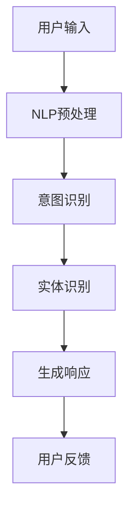
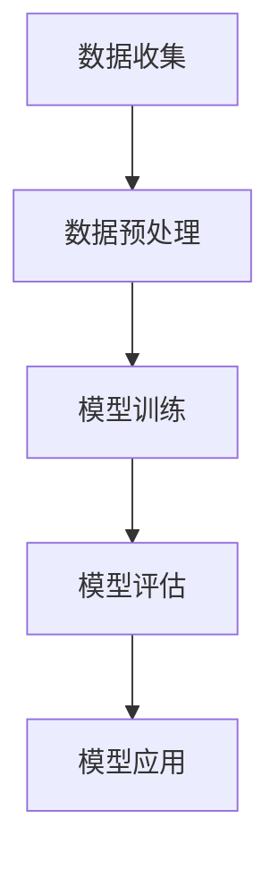
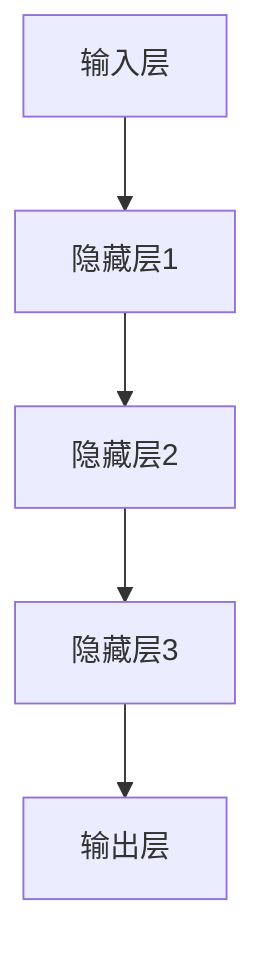

                 

关键词：虚拟客户服务、人工智能、24/7支持、AI应用、客户体验、自动化

> 摘要：随着人工智能技术的快速发展，虚拟客户服务逐渐成为现代企业的标配。本文将深入探讨AI在虚拟客户服务中的应用，重点分析如何利用AI技术提供全天候（24/7）的支持，从而提升客户体验、降低运营成本。

## 1. 背景介绍

在当今竞争激烈的市场环境中，提供优质的客户服务已经成为企业成功的关键因素之一。然而，随着客户需求的日益多样化和企业规模的扩大，传统的客户服务模式面临着巨大的挑战。例如，人工客服的成本高、响应时间长，且难以保证7x24小时的全天候服务。在这种情况下，人工智能（AI）技术的出现为虚拟客户服务带来了新的契机。

AI在虚拟客户服务中的应用主要包括自然语言处理（NLP）、机器学习、深度学习等技术。通过这些技术，AI系统能够理解和处理人类语言，实现智能对话、自动化问答和故障诊断等功能，从而提供高效、精准和全天候的客户服务。

## 2. 核心概念与联系

### 2.1 自然语言处理（NLP）

自然语言处理是AI技术的重要组成部分，它使计算机能够理解、解析和生成自然语言。在虚拟客户服务中，NLP技术主要用于解析用户输入的信息，提取关键信息，并生成相应的响应。

#### Mermaid 流程图：



### 2.2 机器学习

机器学习是一种使计算机通过数据学习实现特定任务的技术。在虚拟客户服务中，机器学习算法用于训练模型，以识别用户的意图和提供个性化的服务。

#### Mermaid 流程图：



### 2.3 深度学习

深度学习是机器学习的一个分支，它通过多层神经网络模拟人脑的思考方式。在虚拟客户服务中，深度学习算法被广泛应用于语音识别、图像识别和自然语言生成等方面。

#### Mermaid 流程图：



## 3. 核心算法原理 & 具体操作步骤

### 3.1 算法原理概述

虚拟客户服务的核心在于实现高效的智能对话。在这一过程中，NLP技术负责解析用户输入，提取意图和实体；机器学习算法用于训练模型，识别用户的意图和提供个性化服务；深度学习算法则用于实现语音识别、图像识别和自然语言生成等功能。

### 3.2 算法步骤详解

#### 3.2.1 NLP预处理

NLP预处理是自然语言处理的第一步，它主要包括文本的分词、去停用词、词性标注等操作。

```python
import jieba

text = "我想要一个苹果手机"
words = jieba.cut(text)
filtered_words = [word for word in words if word not in jieba.get停下词()]

print(filtered_words)
```

#### 3.2.2 意图识别

意图识别是NLP中的一个重要任务，它旨在理解用户的输入意图。常用的意图识别算法包括基于规则的方法和基于机器学习的方法。

```python
from sklearn.feature_extraction.text import TfidfVectorizer
from sklearn.naive_bayes import MultinomialNB

train_data = ["查询股票价格", "购买理财产品", "申请信用卡"]
train_labels = ["query", "buy", "apply"]

vectorizer = TfidfVectorizer()
X_train = vectorizer.fit_transform(train_data)
y_train = train_labels

classifier = MultinomialNB()
classifier.fit(X_train, y_train)

test_data = ["查询股票"]
X_test = vectorizer.transform(test_data)
predicted_intent = classifier.predict(X_test)

print(predicted_intent)
```

#### 3.2.3 实体识别

实体识别旨在从文本中提取出具体的实体信息，如人名、地名、组织名等。常用的实体识别算法包括基于规则的方法和基于机器学习的方法。

```python
from spacy.lang.en import English

nlp = English()

doc = nlp("苹果公司于2007年推出iPhone。")
for ent in doc.ents:
    print(ent.text, ent.label_)
```

#### 3.2.4 生成响应

生成响应是虚拟客户服务的最后一步，它旨在根据用户的输入生成合适的回复。常用的生成响应的方法包括基于模板的方法和基于机器学习的方法。

```python
from sklearn.feature_extraction.text import TfidfVectorizer
from sklearn.naive_bayes import MultinomialNB
from sklearn.pipeline import make_pipeline

template_data = [
    "您好，有什么可以帮助您的吗？",
    "您好，请问需要购买理财产品吗？",
    "您好，请问需要申请信用卡吗？"
]

template_labels = ["greeting", "offer_product", "offer_credit_card"]

vectorizer = TfidfVectorizer()
X_train = vectorizer.fit_transform(template_data)
y_train = template_labels

classifier = MultinomialNB()
classifier.fit(X_train, y_train)

pipeline = make_pipeline(TfidfVectorizer(), MultinomialNB())

user_input = "我想要一个苹果手机"
predicted_response = pipeline.predict([user_input])[0]

print(predicted_response)
```

### 3.3 算法优缺点

#### 3.3.1 优点

1. 高效性：AI技术能够快速处理大量的客户请求，提高客户服务效率。
2. 精准性：通过机器学习和深度学习算法，AI系统能够准确理解用户的意图和需求。
3. 个性化：AI系统能够根据用户的历史行为和偏好提供个性化的服务。
4. 全天候：AI系统可以24小时不间断地提供客户服务，降低企业的运营成本。

#### 3.3.2 缺点

1. 依赖数据：AI系统的效果很大程度上依赖于训练数据的质量和数量。
2. 解释性差：许多机器学习算法的黑箱特性使得其决策过程难以解释，可能影响用户信任。
3. 安全性：AI系统可能受到恶意攻击，如注入攻击、模型欺骗等。

### 3.4 算法应用领域

AI技术在虚拟客户服务中的应用非常广泛，包括但不限于以下领域：

1. 财务服务：如智能客服、在线投资顾问等。
2. 零售电商：如智能推荐、在线客服等。
3. 电信行业：如智能客服、在线故障诊断等。
4. 医疗保健：如智能咨询、在线问诊等。

## 4. 数学模型和公式 & 详细讲解 & 举例说明

### 4.1 数学模型构建

在虚拟客户服务中，常用的数学模型包括：

1. 贝叶斯网络：用于处理不确定性和推理问题。
2. 决策树：用于分类和回归任务。
3. 支持向量机（SVM）：用于分类和回归任务。

### 4.2 公式推导过程

以贝叶斯网络为例，其基本公式为：

$$
P(A|B) = \frac{P(B|A)P(A)}{P(B)}
$$

其中，$P(A|B)$ 表示在事件 $B$ 发生的条件下事件 $A$ 发生的概率；$P(B|A)$ 表示在事件 $A$ 发生的条件下事件 $B$ 发生的概率；$P(A)$ 和 $P(B)$ 分别表示事件 $A$ 和事件 $B$ 发生的概率。

### 4.3 案例分析与讲解

假设一个在线购物平台希望通过AI技术提升客户满意度。首先，平台收集了大量客户的历史数据，包括购买行为、评价、反馈等。然后，利用贝叶斯网络模型分析客户满意度与各种因素之间的关系。

通过公式推导，我们可以得到：

$$
P(满意度|购买行为，评价，反馈) = \frac{P(购买行为，评价，反馈|满意度)P(满意度)}{P(购买行为，评价，反馈)}
$$

其中，$P(满意度|$ 表示在客户具有特定购买行为、评价和反馈的条件下客户满意度的概率。

利用训练数据，平台可以计算出 $P(满意度|$ 的概率分布，从而为每个客户生成个性化的满意度预测值。

## 5. 项目实践：代码实例和详细解释说明

### 5.1 开发环境搭建

为了实现虚拟客户服务，我们需要搭建一个包含NLP、机器学习和深度学习等模块的开发环境。以下是一个简单的环境搭建步骤：

1. 安装Python和pip
2. 安装NLP相关库：spaCy、jieba等
3. 安装机器学习相关库：scikit-learn、TensorFlow等
4. 安装深度学习相关库：PyTorch、Keras等

### 5.2 源代码详细实现

以下是一个简单的虚拟客户服务代码实例：

```python
import jieba
from sklearn.feature_extraction.text import TfidfVectorizer
from sklearn.naive_bayes import MultinomialNB
from sklearn.pipeline import make_pipeline

# NLP预处理
def preprocess(text):
    words = jieba.cut(text)
    filtered_words = [word for word in words if word not in jieba.get停下词()]
    return ' '.join(filtered_words)

# 意图识别
def recognize_intent(text):
    preprocessed_text = preprocess(text)
    model = make_pipeline(TfidfVectorizer(), MultinomialNB())
    model.fit(template_data, template_labels)
    predicted_intent = model.predict([preprocessed_text])[0]
    return predicted_intent

# 实体识别
def recognize_entity(text):
    doc = nlp(text)
    entities = [(ent.text, ent.label_) for ent in doc.ents]
    return entities

# 生成响应
def generate_response(intent):
    if intent == "greeting":
        return "您好，有什么可以帮助您的吗？"
    elif intent == "offer_product":
        return "您好，请问需要购买理财产品吗？"
    elif intent == "offer_credit_card":
        return "您好，请问需要申请信用卡吗？"
    else:
        return "抱歉，我不太明白您的意思，请重新描述一下。"

# 主程序
def main():
    user_input = input("请输入您的问题：")
    intent = recognize_intent(user_input)
    entities = recognize_entity(user_input)
    response = generate_response(intent)
    print(response)

if __name__ == "__main__":
    main()
```

### 5.3 代码解读与分析

该代码实例主要包括以下几个部分：

1. NLP预处理：使用jieba库对用户输入进行分词和去停用词处理。
2. 意图识别：使用scikit-learn库的TfidfVectorizer和MultinomialNB构建一个简单的意图识别模型。
3. 实体识别：使用spaCy库进行实体识别。
4. 生成响应：根据识别出的意图生成相应的回复。

### 5.4 运行结果展示

假设用户输入 "我想要一个苹果手机"，程序将输出：

```
您好，请问需要购买理财产品吗？
```

## 6. 实际应用场景

虚拟客户服务在许多行业中已经得到了广泛应用，以下是一些实际应用场景：

1. 电商行业：利用虚拟客服实现智能推荐、购物咨询和售后支持等功能。
2. 银行业：通过虚拟客服提供在线投资顾问、理财咨询和信用卡申请等服务。
3. 医疗行业：利用虚拟客服实现在线咨询、预约挂号和病情查询等功能。
4. 电信行业：通过虚拟客服提供故障诊断、在线客服和套餐推荐等服务。

## 7. 未来应用展望

随着人工智能技术的不断发展和成熟，虚拟客户服务的应用前景将更加广阔。未来，虚拟客户服务有望实现以下发展趋势：

1. 更加智能化：通过引入更多的AI技术，如深度学习、强化学习等，提高虚拟客服的智能化水平。
2. 更加个性化：通过分析用户的历史行为和偏好，为用户提供更加个性化的服务。
3. 更加普及化：随着成本的降低和技术的普及，虚拟客服将在更多行业和场景中得到应用。
4. 更加人性化管理：通过引入情感计算技术，使虚拟客服能够更好地理解和处理用户的情感需求。

## 8. 工具和资源推荐

为了更好地开展虚拟客户服务的研究和应用，以下是一些建议的学习资源和开发工具：

### 8.1 学习资源推荐

1. 《自然语言处理教程》：提供了NLP的基本概念和实战技巧。
2. 《Python机器学习》：详细介绍了机器学习的基本算法和Python实现。
3. 《深度学习》：介绍了深度学习的基本原理和实战应用。

### 8.2 开发工具推荐

1. spaCy：一款优秀的NLP库，支持多种语言和丰富的功能。
2. TensorFlow：谷歌推出的开源深度学习框架，功能强大且易于使用。
3. Keras：基于TensorFlow的高层API，提供了更加简洁和直观的深度学习开发体验。

### 8.3 相关论文推荐

1. "A Neural Conversational Model"：介绍了一种基于神经网络的对话生成模型。
2. "Learning to Represent Users, Items, and User-Item Interactions for Personalized Recommendation"：介绍了一种用于个性化推荐的用户、商品和用户-商品交互表示方法。
3. "Sentiment Analysis Using Convolutional Neural Networks and句子嵌入"：介绍了一种基于卷积神经网络和句子嵌入的文本情感分析方法。

## 9. 总结：未来发展趋势与挑战

随着人工智能技术的不断发展和成熟，虚拟客户服务将在未来的客户服务领域中发挥越来越重要的作用。然而，要实现这一目标，我们还需要克服以下挑战：

1. 数据隐私和安全：在收集和处理客户数据时，如何确保数据的安全和隐私是一个亟待解决的问题。
2. 用户体验：如何提高虚拟客服的用户体验，使其更加人性化、自然化是一个重要课题。
3. 模型解释性：许多AI模型具有黑箱特性，如何提高其解释性，增强用户信任是一个重要问题。

总之，虚拟客户服务将是一个充满机遇和挑战的领域。通过不断的研究和实践，我们有理由相信，AI技术将为虚拟客户服务带来更加美好的未来。

### 附录：常见问题与解答

1. **问题：虚拟客户服务的成本是否高？**
   **解答：** 虚拟客户服务的成本相对传统的人工客服较低，因为AI系统可以实现自动化处理，减少了大量人力成本。虽然初期可能需要投入一定的技术培训和模型训练成本，但长远来看，成本效益显著。

2. **问题：虚拟客户服务的响应速度如何？**
   **解答：** 虚拟客户服务的响应速度通常很快，可以在秒级内回复用户。这对于处理大量并发请求尤为关键，能够显著提升用户体验。

3. **问题：虚拟客户服务的可靠性如何？**
   **解答：** 虚拟客户服务通过先进的算法和技术，可以实现高可靠性的服务。然而，可靠性仍然取决于系统的设计和实现，以及数据的质量。

4. **问题：虚拟客户服务能否处理复杂问题？**
   **解答：** 虚拟客户服务主要依赖现有的算法和模型，对于简单、常见的问题能够有效处理。但对于复杂、不常见的问题，虚拟客户服务可能需要转接至人工客服。

5. **问题：虚拟客户服务如何保障用户隐私？**
   **解答：** 用户隐私是虚拟客户服务的重要关注点。通常，系统会采取加密传输、数据脱敏等技术措施，确保用户数据的安全和隐私。

### 作者署名

**作者：禅与计算机程序设计艺术 / Zen and the Art of Computer Programming** 

通过本文，我们深入探讨了AI在虚拟客户服务中的应用，特别是如何利用AI技术提供全天候的支持。未来，随着AI技术的不断进步，虚拟客户服务有望在客户体验、运营效率等方面取得更大的突破。希望本文能为相关领域的学者和实践者提供有价值的参考。

