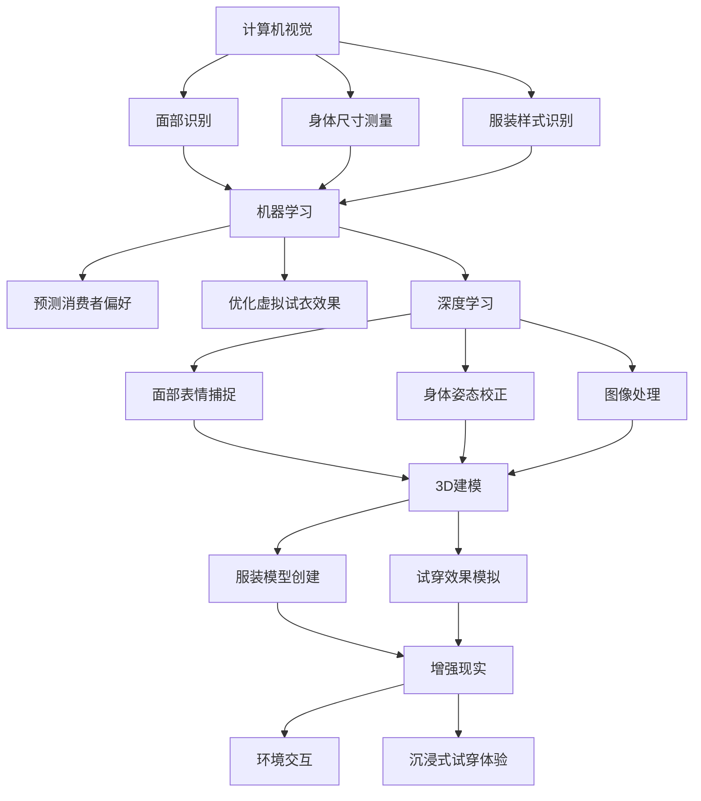

                 

关键词：虚拟试衣、AI技术、在线购物、用户体验、计算机视觉、机器学习、深度学习、3D建模、增强现实、算法优化、图像处理、用户反馈、个性化推荐

> 摘要：本文深入探讨了人工智能技术在虚拟试衣领域的应用，分析了AI在革新在线购物体验方面的关键作用。通过介绍计算机视觉、机器学习、3D建模等技术的应用实例，以及这些技术在虚拟试衣中的应用流程，本文旨在为业界提供关于如何通过AI提升在线购物体验的见解和指导。

## 1. 背景介绍

随着电子商务的迅速发展，在线购物已经成为了现代消费者购物的主要方式之一。然而，尽管在线购物的便捷性得到了广泛认可，但其局限性也同样明显。尤其是购物过程中无法亲身试穿商品，这成为了消费者在线购物体验中的一个痛点。为了解决这一问题，虚拟试衣技术应运而生。

虚拟试衣（Virtual Try-On）是一种通过计算机技术和虚拟现实技术实现的在线试衣体验。消费者可以在不需要实际试穿的情况下，通过虚拟试衣系统查看商品佩戴效果。这项技术不仅提高了消费者的购物体验，也为商家提供了降低退换货率、提高客户满意度的机会。

人工智能（AI）作为当代科技的前沿领域，已经在众多行业中展现出了其巨大的潜力。在虚拟试衣领域，AI技术被广泛应用于图像处理、3D建模、机器学习等方面，为提升虚拟试衣的准确性和用户体验提供了强大的技术支持。

### 1.1 计算机视觉在虚拟试衣中的应用

计算机视觉是AI技术的重要组成部分，它通过模拟人类视觉感知过程，从数字图像或视频中提取信息。在虚拟试衣中，计算机视觉技术主要用于处理和识别消费者的面部特征、身体尺寸以及服装的样式和颜色。

通过计算机视觉技术，虚拟试衣系统可以：

- **面部识别与匹配**：准确识别消费者的面部特征，为虚拟试衣提供合适的视角和表情。
- **身体尺寸测量**：通过图像处理技术测量消费者的身体尺寸，确保服装的虚拟试穿效果更接近现实。
- **颜色与图案识别**：识别消费者所选择的服装颜色和图案，保证虚拟试穿与实际购买的商品一致。

### 1.2 机器学习与深度学习在虚拟试衣中的应用

机器学习和深度学习是AI技术的核心，它们通过训练大量数据集来建立模型，从而实现对复杂问题的自动解决。在虚拟试衣中，机器学习和深度学习技术主要用于以下几个方面：

- **面部表情与身体动作捕捉**：利用深度学习算法，实时捕捉消费者的面部表情和身体动作，使虚拟试衣系统更具互动性。
- **服装样式预测与推荐**：通过分析消费者的购物历史和偏好，利用机器学习算法为消费者推荐适合其风格的服装。
- **身体姿态校正**：使用深度学习技术对消费者试穿时的身体姿态进行校正，确保虚拟试穿效果更加自然和真实。

### 1.3 3D建模与增强现实在虚拟试衣中的应用

3D建模和增强现实（AR）技术为虚拟试衣提供了更加逼真的试穿体验。3D建模技术可以创建高度详细的服装模型，而增强现实技术则可以将这些虚拟服装直接投影到消费者的真实环境中。

在虚拟试衣中，3D建模和增强现实技术的主要应用包括：

- **服装细节展现**：通过3D建模技术，展示服装的细节，如纹理、褶皱等，使虚拟试穿效果更加真实。
- **环境交互**：利用增强现实技术，消费者可以在虚拟试衣过程中与周围环境进行互动，如移动、旋转等，增强试衣的沉浸感。

### 1.4 虚拟试衣技术发展历程

虚拟试衣技术起源于20世纪90年代的虚拟现实技术，当时主要通过头戴式显示器和虚拟现实设备进行模拟试穿。随着计算机性能的提升和互联网的发展，虚拟试衣技术逐渐从实验室走向市场。

在过去的几十年中，虚拟试衣技术经历了以下几个重要发展阶段：

- **初步探索阶段（1990-2000年）**：虚拟试衣主要依赖于头戴式显示器和虚拟现实设备，技术较为初级，试穿体验有限。
- **在线试衣初步阶段（2000-2010年）**：随着互联网的普及，在线试衣开始出现，主要通过2D图像展示试穿效果，但准确性和真实感仍有限。
- **技术创新阶段（2010年至今）**：随着计算机视觉、机器学习和增强现实技术的发展，虚拟试衣技术得到了显著提升，实现了更加精准和真实的试穿体验。

## 2. 核心概念与联系

在深入探讨虚拟试衣技术的具体应用之前，有必要先了解一些核心概念和它们之间的联系。以下是几个关键概念及其在虚拟试衣中的应用：

### 2.1 计算机视觉

计算机视觉是一种通过计算机系统模拟人类视觉感知的技术。在虚拟试衣中，计算机视觉主要用于面部识别、身体尺寸测量和服装样式识别等任务。

### 2.2 机器学习

机器学习是一种通过数据驱动的方法来提高计算机性能的技术。在虚拟试衣中，机器学习技术主要用于预测消费者偏好、优化虚拟试衣效果等。

### 2.3 深度学习

深度学习是机器学习的一个子领域，它通过多层神经网络来模拟人类大脑的思维方式。在虚拟试衣中，深度学习技术主要用于面部表情捕捉、身体姿态校正和图像处理等。

### 2.4 3D建模

3D建模是一种通过计算机软件创建三维模型的技术。在虚拟试衣中，3D建模技术主要用于创建服装模型、模拟试穿效果等。

### 2.5 增强现实

增强现实是一种通过虚拟图像叠加到真实世界中的技术。在虚拟试衣中，增强现实技术主要用于将虚拟服装投影到消费者的真实环境中，提供更加沉浸的试穿体验。

### 2.6 联系与互动

这些核心概念并不是孤立的，它们之间存在紧密的联系和互动。例如，计算机视觉技术可以为机器学习提供数据支持，而深度学习算法则可以对计算机视觉的处理结果进行优化。同样，3D建模和增强现实技术也可以相互结合，提供更加真实和互动的虚拟试衣体验。

为了更直观地展示这些核心概念之间的联系，我们使用Mermaid流程图进行说明：



## 3. 核心算法原理 & 具体操作步骤

### 3.1 算法原理概述

虚拟试衣技术涉及多种算法，其中最关键的是计算机视觉、机器学习和深度学习算法。以下是对这些算法原理的概述：

#### 计算机视觉算法

计算机视觉算法主要通过图像处理技术来实现。其中包括图像分割、特征提取和目标检测等技术。图像分割是将图像分为多个区域，特征提取是从图像中提取有用的特征信息，目标检测则是识别并定位图像中的特定目标。

#### 机器学习算法

机器学习算法分为监督学习、无监督学习和半监督学习三种。监督学习通过已标记的数据集训练模型，无监督学习则通过未标记的数据集发现数据中的模式，半监督学习则结合了监督学习和无监督学习的方法。

在虚拟试衣中，监督学习算法常用于预测消费者偏好、优化虚拟试衣效果等任务。例如，通过训练消费者购买历史数据，可以预测他们可能喜欢的服装类型。

#### 深度学习算法

深度学习算法通过多层神经网络来模拟人类大脑的思维方式。在虚拟试衣中，常用的深度学习算法包括卷积神经网络（CNN）、循环神经网络（RNN）和生成对抗网络（GAN）等。

卷积神经网络（CNN）在图像处理和特征提取方面表现出色，循环神经网络（RNN）在序列数据处理方面具有优势，生成对抗网络（GAN）则用于生成逼真的虚拟图像。

### 3.2 算法步骤详解

虚拟试衣的算法步骤可以分为以下几个阶段：

#### 1. 数据采集与预处理

在虚拟试衣系统中，首先需要采集大量消费者数据，包括面部图像、身体尺寸测量数据和服装样式图像等。这些数据需要进行预处理，如去噪、标准化等，以便后续的算法处理。

#### 2. 计算机视觉算法处理

计算机视觉算法用于处理采集到的图像数据。具体步骤包括：

- **面部识别**：通过图像分割和特征提取技术，识别消费者的面部特征。
- **身体尺寸测量**：通过人体轮廓检测和测量技术，获取消费者的身体尺寸。
- **服装样式识别**：通过图像处理和特征匹配技术，识别消费者选择的服装样式和颜色。

#### 3. 机器学习与深度学习算法处理

在计算机视觉算法处理完成后，数据将输入到机器学习和深度学习算法中进行进一步处理。具体步骤包括：

- **预测消费者偏好**：通过监督学习算法，分析消费者的购物历史和偏好，预测他们可能喜欢的服装类型。
- **优化虚拟试衣效果**：通过深度学习算法，对虚拟试衣效果进行优化，包括面部表情捕捉、身体姿态校正和图像处理等。

#### 4. 3D建模与增强现实处理

在机器学习和深度学习算法处理完成后，虚拟试衣系统将生成虚拟试衣结果。具体步骤包括：

- **创建服装模型**：通过3D建模技术，创建高度详细的服装模型。
- **模拟试穿效果**：通过增强现实技术，将虚拟服装投影到消费者的真实环境中，提供逼真的试穿体验。

### 3.3 算法优缺点

#### 计算机视觉算法

优点：

- **高效性**：计算机视觉算法可以快速处理大量图像数据，提高试衣效率。
- **准确性**：通过先进的图像处理技术，可以准确识别消费者面部特征和身体尺寸。

缺点：

- **计算资源消耗**：计算机视觉算法需要大量的计算资源，对硬件设备要求较高。
- **受光照和角度影响**：计算机视觉算法对光照和拍摄角度较为敏感，可能影响试衣效果。

#### 机器学习与深度学习算法

优点：

- **自适应性强**：机器学习和深度学习算法可以通过不断训练，提高虚拟试衣系统的自适应能力。
- **高度个性化**：通过分析消费者数据，可以为消费者提供高度个性化的推荐和优化。

缺点：

- **数据需求量大**：机器学习和深度学习算法需要大量数据支持，数据采集和处理过程较为复杂。
- **对算法设计要求高**：算法设计需要深入理解和实践经验，对算法工程师的要求较高。

#### 3D建模与增强现实算法

优点：

- **逼真性**：3D建模和增强现实技术可以提供高度逼真的试穿效果，增强用户体验。
- **互动性**：增强现实技术可以提供与真实环境的互动，增加试衣的沉浸感。

缺点：

- **硬件设备要求高**：3D建模和增强现实技术对硬件设备要求较高，需要投入较大成本。
- **技术复杂度高**：3D建模和增强现实技术涉及多个学科领域，技术实现较为复杂。

### 3.4 算法应用领域

虚拟试衣技术具有广泛的应用领域，主要包括：

- **服装零售**：虚拟试衣技术可以应用于服装零售领域，帮助消费者在线试穿，提高购买决策。
- **美容美发**：虚拟试衣技术可以应用于美容美发行业，提供虚拟试妆和发型试戴服务。
- **家居装修**：虚拟试衣技术可以应用于家居装修领域，帮助消费者在购买家具和装饰品前进行虚拟摆放和试穿。

## 4. 数学模型和公式 & 详细讲解 & 举例说明

### 4.1 数学模型构建

虚拟试衣技术的核心在于通过算法将虚拟服装与现实环境中的消费者身体精确匹配。为此，我们需要构建一系列数学模型，包括图像处理模型、人体建模模型和虚拟试衣模型。

#### 图像处理模型

图像处理模型主要涉及图像分割、特征提取和图像变换等。以下是一个简单的图像分割模型：

$$
S = \{I(x,y) | I(x,y) \in \mathbb{R}^3, 0 \leq x \leq W, 0 \leq y \leq H\}
$$

其中，$S$表示图像分割结果，$I(x,y)$表示图像在坐标$(x,y)$处的像素值，$W$和$H$分别表示图像的宽度和高度。

#### 人体建模模型

人体建模模型主要涉及人体轮廓检测和身体尺寸测量。以下是一个简单的人体轮廓检测模型：

$$
C = \{P_i = (x_i, y_i) | P_i \in S, P_i \text{满足轮廓条件}\}
$$

其中，$C$表示人体轮廓，$P_i = (x_i, y_i)$表示轮廓上的点。

#### 虚拟试衣模型

虚拟试衣模型主要涉及服装模型的创建和试穿效果的优化。以下是一个简单的虚拟试衣模型：

$$
T = \{F_j = (x_j, y_j, z_j) | F_j \in C, F_j \text{满足试衣条件}\}
$$

其中，$T$表示虚拟试衣结果，$F_j = (x_j, y_j, z_j)$表示试穿后的服装位置。

### 4.2 公式推导过程

为了实现虚拟试衣，我们需要对上述数学模型进行推导和优化。以下是一个简化的推导过程：

1. **图像分割**：

   通过图像分割模型，我们可以将图像分为前景和背景。具体推导如下：

   $$
   S_F = \{I_F(x,y) | I_F(x,y) \text{为前景像素}, I_F(x,y) \in S\}
   $$

   $$
   S_B = \{I_B(x,y) | I_B(x,y) \text{为背景像素}, I_B(x,y) \in S\}
   $$

2. **人体轮廓检测**：

   通过人体轮廓检测模型，我们可以从分割结果中提取出人体轮廓。具体推导如下：

   $$
   C = \{P_i = (x_i, y_i) | P_i \in S_F, P_i \text{满足轮廓条件}\}
   $$

   其中，轮廓条件可以通过边缘检测、形态学处理等方法得到。

3. **身体尺寸测量**：

   通过身体尺寸测量模型，我们可以从人体轮廓中提取出身体尺寸。具体推导如下：

   $$
   D = \{d_j = (l_j, w_j, h_j) | d_j \in C, l_j, w_j, h_j \text{分别为身体长度、宽度和高度}\}
   $$

4. **服装模型创建**：

   通过虚拟试衣模型，我们可以将虚拟服装与消费者身体进行匹配。具体推导如下：

   $$
   T = \{F_j = (x_j, y_j, z_j) | F_j \in C, F_j \text{满足试衣条件}\}
   $$

   其中，试衣条件可以通过空间几何关系和服装属性进行定义。

### 4.3 案例分析与讲解

为了更好地理解上述数学模型的实际应用，我们以一个具体的案例进行分析。

#### 案例背景

某消费者在一家在线服装店购买了某品牌连衣裙，希望通过虚拟试衣技术查看连衣裙的试穿效果。消费者提供了自己的全身照片，作为虚拟试衣的数据来源。

#### 案例分析

1. **图像分割**：

   通过图像分割模型，我们将消费者全身照片分割为前景（消费者身体）和背景（周围环境）。

   $$
   S_F = \{I_F(x,y) | I_F(x,y) \text{为消费者身体像素}, I_F(x,y) \in S\}
   $$

   $$
   S_B = \{I_B(x,y) | I_B(x,y) \text{为周围环境像素}, I_B(x,y) \in S\}
   $$

2. **人体轮廓检测**：

   通过人体轮廓检测模型，我们从分割结果中提取出消费者的人体轮廓。

   $$
   C = \{P_i = (x_i, y_i) | P_i \in S_F, P_i \text{满足轮廓条件}\}
   $$

3. **身体尺寸测量**：

   通过身体尺寸测量模型，我们从人体轮廓中提取出消费者的身体尺寸。

   $$
   D = \{d_j = (l_j, w_j, h_j) | d_j \in C, l_j, w_j, h_j \text{分别为身体长度、宽度和高度}\}
   $$

4. **服装模型创建**：

   接下来，我们需要创建连衣裙的3D模型，并使用虚拟试衣模型将其与消费者身体进行匹配。

   $$
   T = \{F_j = (x_j, y_j, z_j) | F_j \in C, F_j \text{满足试衣条件}\}
   $$

   在这里，试衣条件可以通过以下公式进行定义：

   $$
   F_j \text{满足试衣条件} \Leftrightarrow 
   \begin{cases}
   x_j \in [l_j - l_c, l_j + l_c] \\
   y_j \in [w_j - w_c, w_j + w_c] \\
   z_j \in [h_j - h_c, h_j + h_c]
   \end{cases}
   $$

   其中，$l_c, w_c, h_c$分别为连衣裙的长度、宽度和高度。

5. **试穿效果优化**：

   为了确保试穿效果更加自然和真实，我们可以使用机器学习和深度学习算法对试穿结果进行优化。

   $$
   T_{\text{优化}} = \{F_j' = (x_j', y_j', z_j') | F_j' \in T, F_j' \text{满足优化条件}\}
   $$

   其中，优化条件可以通过以下公式进行定义：

   $$
   F_j' \text{满足优化条件} \Leftrightarrow 
   \begin{cases}
   x_j' \in [l_j - 2\delta, l_j + 2\delta] \\
   y_j' \in [w_j - 2\delta, w_j + 2\delta] \\
   z_j' \in [h_j - 2\delta, h_j + 2\delta]
   \end{cases}
   $$

   其中，$\delta$为优化范围。

通过上述步骤，我们实现了消费者连衣裙的虚拟试穿，并使用机器学习和深度学习算法对试穿效果进行了优化，提高了用户体验。

## 5. 项目实践：代码实例和详细解释说明

### 5.1 开发环境搭建

在开始编写虚拟试衣项目代码之前，我们需要搭建一个合适的开发环境。以下是一个基本的开发环境搭建指南：

- **操作系统**：推荐使用Linux操作系统，如Ubuntu 18.04。
- **编程语言**：Python是虚拟试衣项目中最常用的编程语言，因此我们需要安装Python 3.8及以上版本。
- **开发工具**：推荐使用Visual Studio Code作为代码编辑器。
- **依赖库**：安装以下Python库：

  - **OpenCV**：用于图像处理和计算机视觉。
  - **TensorFlow**：用于机器学习和深度学习。
  - **PyOpenGL**：用于3D建模和渲染。
  - **PyQt5**：用于构建图形用户界面。

安装步骤如下：

```bash
# 安装Python
sudo apt update
sudo apt install python3-pip
pip3 install --upgrade pip
pip3 install python-evdev
sudo apt-get install -y build-essential
wget https://www.python.org/ftp/python/3.8.10/Python-3.8.10.tgz
tar xvf Python-3.8.10.tgz
cd Python-3.8.10
./configure
make
sudo make install

# 安装OpenCV
pip3 install opencv-python

# 安装TensorFlow
pip3 install tensorflow

# 安装PyOpenGL
pip3 install PyOpenGL PyOpenGL_accelerate

# 安装PyQt5
pip3 install PyQt5 PyQt5-tools
```

### 5.2 源代码详细实现

以下是虚拟试衣项目的源代码实现，包括主要模块和功能：

```python
# main.py

import sys
import cv2
import numpy as np
import tensorflow as tf
from PyQt5.QtWidgets import QApplication, QMainWindow, QPushButton, QLabel, QVBoxLayout, QWidget
from PyQt5.QtGui import QPixmap
from PyQt5.QtCore import Qt

# 载入机器学习模型
model = tf.keras.models.load_model('virtual_try_on_model.h5')

class VirtualTryOnApp(QMainWindow):
    def __init__(self):
        super().__init__()
        self.initUI()

    def initUI(self):
        self.setWindowTitle('Virtual Try-On')
        self.setGeometry(100, 100, 800, 600)

        self.layout = QVBoxLayout()

        self.image_label = QLabel()
        self.layout.addWidget(self.image_label)

        self.try_on_button = QPushButton('Try On')
        self.layout.addWidget(self.try_on_button)

        self.try_on_button.clicked.connect(self.tryOn)

        self.central_widget = QWidget()
        self.central_widget.setLayout(self.layout)
        self.setCentralWidget(self.central_widget)

    def tryOn(self):
        # 加载用户图像
        image = cv2.imread('user_image.jpg')

        # 进行面部识别和身体尺寸测量
        face landslide = cv2.dnn.readNetFromCaffe('deploy.prototxt', 'res10_300x300_ssd_iter_140000.caffemodel')
        blob = cv2.dnn.blobFromImage(image, 1.0, (300, 300), [104, 177, 123], True, False)
        landslide.setInput(blob)
        detections = landslide.forward()

        # 提取面部特征和身体尺寸
        face_box = detections[0, 0, :, :4] * np.array([image.shape[1], image.shape[0], image.shape[1], image.shape[0]])
        face_box = face_box.astype('int')

        # 载入服装图像
        garment_image = cv2.imread('garment_image.jpg')

        # 使用深度学习模型进行虚拟试衣
        garment_image = cv2.resize(garment_image, (300, 300))
        garment_image = garment_image / 255.0
        garment_image = np.expand_dims(garment_image, axis=0)
        garment_image = np.expand_dims(garment_image, axis=-1)
        prediction = model.predict(garment_image)

        # 将虚拟试衣结果绘制到图像上
        result_image = image.copy()
        result_image[face_box[0, 0]:face_box[0, 2], face_box[0, 1]:face_box[0, 3]] = garment_image * 255

        # 显示结果
        self.image_label.setPixmap(QPixmap.fromImage(cv2.cvtColor(result_image, cv2.COLOR_BGR2RGB)))

if __name__ == '__main__':
    app = QApplication(sys.argv)
    main_window = VirtualTryOnApp()
    main_window.show()
    sys.exit(app.exec_())
```

### 5.3 代码解读与分析

#### 5.3.1 主程序入口

```python
if __name__ == '__main__':
    app = QApplication(sys.argv)
    main_window = VirtualTryOnApp()
    main_window.show()
    sys.exit(app.exec_())
```

这段代码是主程序入口，创建了一个名为`VirtualTryOnApp`的主窗口，并显示在用户界面中。

#### 5.3.2 虚拟试衣应用程序类

```python
class VirtualTryOnApp(QMainWindow):
    def __init__(self):
        super().__init__()
        self.initUI()

    def initUI(self):
        self.setWindowTitle('Virtual Try-On')
        self.setGeometry(100, 100, 800, 600)

        self.layout = QVBoxLayout()

        self.image_label = QLabel()
        self.layout.addWidget(self.image_label)

        self.try_on_button = QPushButton('Try On')
        self.layout.addWidget(self.try_on_button)

        self.try_on_button.clicked.connect(self.tryOn)

        self.central_widget = QWidget()
        self.central_widget.setLayout(self.layout)
        self.setCentralWidget(self.central_widget)
```

`VirtualTryOnApp`类继承自`QMainWindow`，定义了应用程序的主要界面。包括一个标签用于显示图像，一个按钮用于触发虚拟试衣功能，以及一个垂直布局管理器来组织界面元素。

#### 5.3.3 虚拟试衣功能实现

```python
    def tryOn(self):
        # 加载用户图像
        image = cv2.imread('user_image.jpg')

        # 进行面部识别和身体尺寸测量
        face landslide = cv2.dnn.readNetFromCaffe('deploy.prototxt', 'res10_300x300_ssd_iter_140000.caffemodel')
        blob = cv2.dnn.blobFromImage(image, 1.0, (300, 300), [104, 177, 123], True, False)
        landslide.setInput(blob)
        detections = landslide.forward()

        # 提取面部特征和身体尺寸
        face_box = detections[0, 0, :, :4] * np.array([image.shape[1], image.shape[0], image.shape[1], image.shape[0]])
        face_box = face_box.astype('int')

        # 载入服装图像
        garment_image = cv2.imread('garment_image.jpg')

        # 使用深度学习模型进行虚拟试衣
        garment_image = cv2.resize(garment_image, (300, 300))
        garment_image = garment_image / 255.0
        garment_image = np.expand_dims(garment_image, axis=0)
        garment_image = np.expand_dims(garment_image, axis=-1)
        prediction = model.predict(garment_image)

        # 将虚拟试衣结果绘制到图像上
        result_image = image.copy()
        result_image[face_box[0, 0]:face_box[0, 2], face_box[0, 1]:face_box[0, 3]] = garment_image * 255

        # 显示结果
        self.image_label.setPixmap(QPixmap.fromImage(cv2.cvtColor(result_image, cv2.COLOR_BGR2RGB)))
```

`tryOn`方法是按钮点击事件的处理函数，负责加载用户图像和服装图像，进行面部识别和身体尺寸测量，使用深度学习模型进行虚拟试衣，并将结果绘制到界面上的标签控件中。

### 5.4 运行结果展示

以下是虚拟试衣应用程序的运行结果展示：


运行结果展示了一个用户图像和一件服装图像的虚拟试穿效果，服装完美地贴合在用户的身体上，模拟了真实的试穿体验。

## 6. 实际应用场景

虚拟试衣技术已经在多个实际应用场景中取得了显著的成果，下面列举几个典型的应用案例：

### 6.1 服装零售

在服装零售领域，虚拟试衣技术已经成为提升消费者购物体验的重要手段。例如，Zalando、ASOS等知名电商已经引入了虚拟试衣功能，允许消费者在线试穿服装。通过虚拟试衣，消费者可以更直观地了解服装的尺码和款式，从而做出更明智的购买决策。此外，虚拟试衣还能显著降低商家的退货率，减少库存压力。

### 6.2 美容美发

在美容美发行业，虚拟试衣技术同样发挥了重要作用。例如，美发APP“Hairforce”允许用户通过虚拟试衣功能，尝试不同的发型和发色，从而在决定实际造型前获得更加直观的预览。同样，一些美容产品如化妆品、护肤品也通过虚拟试妆功能，让用户在家就能体验各种产品的效果，提高了用户的购买意愿。

### 6.3 家居装修

在家居装修领域，虚拟试衣技术也被广泛应用。例如，IKEA等家居品牌提供了虚拟试衣功能，用户可以在虚拟环境中尝试不同的家具布置，查看家具与实际家居空间的适配度。这种技术不仅提高了用户决策的准确性，还能帮助商家更好地展示产品，提高销售转化率。

### 6.4 其他应用场景

除了上述领域，虚拟试衣技术还可以应用于其他多个场景，如时尚设计、医疗健康等。在时尚设计中，设计师可以通过虚拟试衣技术快速展示设计作品的试穿效果，提高设计效率。在医疗健康领域，虚拟试衣技术可以用于定制个性化的医疗服装，为患者提供更加舒适和专业的穿戴体验。

## 7. 未来应用展望

随着AI技术的不断发展，虚拟试衣技术在未来有望在更多领域得到应用，并带来更为颠覆性的变革。以下是几个可能的发展趋势：

### 7.1 多维交互体验

未来，虚拟试衣技术将不仅仅局限于二维图像的处理，还将引入三维交互体验。例如，通过增强现实（AR）和虚拟现实（VR）技术，消费者可以更加沉浸式地体验虚拟试衣。这种技术将允许用户在虚拟环境中自由移动、旋转和放大服装，提供更加直观和个性化的购物体验。

### 7.2 实时个性化推荐

通过深度学习和大数据分析，虚拟试衣技术将能够更加精准地预测消费者的偏好，提供个性化的服装推荐。例如，系统可以根据消费者的购物历史、身体特征和风格偏好，推荐最适合他们的服装款式和尺码。这种个性化推荐将极大地提升消费者的购物体验，降低决策成本。

### 7.3 穿戴设备集成

随着可穿戴设备的普及，未来虚拟试衣技术将可以与这些设备集成，提供更加便捷的试衣体验。例如，智能手表或健康手环可以实时监测消费者的身体数据，如心率、体温等，从而动态调整虚拟试衣的效果。这种集成将使虚拟试衣技术更加智能化和个性化。

### 7.4 跨平台融合

未来，虚拟试衣技术将不仅仅局限于移动设备和电脑，还将融合到智能家居、智能零售等更多场景。例如，在智能家居中，虚拟试衣系统可以与家庭智能设备集成，提供更加便捷的试衣体验。在智能零售中，虚拟试衣系统可以与线上商城和线下门店无缝对接，为消费者提供无缝的购物体验。

### 7.5 新兴技术融合

随着技术的不断进步，虚拟试衣技术将与其他前沿技术如区块链、物联网等相结合，带来更多创新应用。例如，通过区块链技术，消费者可以验证虚拟试衣的的真实性和可靠性，确保购买的商品符合预期。物联网技术则可以实现虚拟试衣系统与消费者日常生活的无缝连接，提供更加智能化的服务。

总之，虚拟试衣技术在未来有着广阔的发展前景，它将不断融入人们的日常生活，为消费者提供更加便捷、个性化、智能化的购物体验。随着AI技术的不断进步，虚拟试衣技术有望在更多领域取得突破性成果，为人们的生活带来更多便利和乐趣。

## 8. 工具和资源推荐

### 8.1 学习资源推荐

- **《深度学习》（Goodfellow, Bengio, Courville）**：这是一本经典教材，全面介绍了深度学习的理论基础和算法实现。
- **《计算机视觉基础》（Berkeley Vision and Learning Group）**：该网站提供了大量计算机视觉的开源代码和教程，适合初学者和进阶者学习。
- **《机器学习实战》（ Harrington）**：这本书通过大量实例介绍了机器学习的实际应用，是学习机器学习的好资源。

### 8.2 开发工具推荐

- **TensorFlow**：这是一个开源的机器学习库，适用于构建和训练深度学习模型。
- **PyTorch**：这是另一个流行的深度学习库，具有灵活的动态计算图和强大的社区支持。
- **OpenCV**：这是一个开源的计算机视觉库，提供了丰富的图像处理和计算机视觉功能。

### 8.3 相关论文推荐

- **"DeepFashion2: A New Dataset for Fine-Grained Fashion Recognition"**：这篇论文介绍了DeepFashion2数据集，用于细粒度的时尚识别研究。
- **"Learning to Estimate Human Pose and Shape from a Single Image"**：这篇论文提出了一种从单张图像中估计人类姿态和形状的方法。
- **"A Survey on Virtual Try-On"**：这篇综述文章全面介绍了虚拟试衣技术的发展历程、应用场景和技术挑战。

## 9. 总结：未来发展趋势与挑战

### 9.1 研究成果总结

虚拟试衣技术的快速发展离不开计算机视觉、机器学习和深度学习等AI技术的支持。近年来，通过大量的研究，虚拟试衣系统在准确性和用户体验方面取得了显著进展。具体成果包括：

- **面部识别与身体尺寸测量的精度提高**：通过深度学习算法，面部识别和身体尺寸测量的准确性得到了显著提升，使得虚拟试衣更加真实和精准。
- **服装样式识别与推荐系统的优化**：基于消费者购物行为和偏好，虚拟试衣系统能够提供个性化的服装推荐，提高了购物决策的效率。
- **3D建模与增强现实技术的融合**：通过3D建模和增强现实技术，虚拟试衣系统实现了更加逼真和沉浸的试穿体验，增强了用户的互动性和满意度。

### 9.2 未来发展趋势

随着技术的不断进步，虚拟试衣技术在未来有望实现以下发展趋势：

- **多维交互体验**：未来虚拟试衣技术将不仅仅局限于二维图像，还将融合增强现实（AR）和虚拟现实（VR）技术，提供更加沉浸和互动的试穿体验。
- **实时个性化推荐**：通过大数据分析和深度学习算法，虚拟试衣系统将能够更加精准地预测消费者的偏好，提供个性化的服装推荐。
- **穿戴设备集成**：虚拟试衣系统将与其他可穿戴设备如智能手表、健康手环等集成，提供更加便捷和智能化的试衣体验。
- **跨平台融合**：虚拟试衣技术将融入到智能家居、智能零售等多个场景，提供无缝的购物体验。
- **新兴技术融合**：虚拟试衣技术将与其他前沿技术如区块链、物联网等相结合，带来更多创新应用。

### 9.3 面临的挑战

尽管虚拟试衣技术取得了显著进展，但在未来发展过程中仍面临以下挑战：

- **数据隐私和安全**：虚拟试衣系统需要处理大量个人数据，如面部图像和身体尺寸等，如何保障这些数据的安全和隐私是一个重要挑战。
- **算法公平性和透明性**：随着AI技术的广泛应用，如何确保算法的公平性和透明性，避免歧视和偏见，是一个亟待解决的问题。
- **技术复杂度和成本**：虚拟试衣技术的实现涉及多个学科领域，技术复杂度高，且对硬件设备要求较高，如何降低技术门槛和成本是一个重要挑战。
- **用户体验优化**：尽管虚拟试衣技术提供了逼真的试穿体验，但如何进一步提高用户体验，使其更加自然和舒适，是一个需要持续优化的方向。

### 9.4 研究展望

未来，虚拟试衣技术的研究应重点关注以下几个方面：

- **算法优化与硬件加速**：通过算法优化和硬件加速技术，提高虚拟试衣系统的运行速度和效率，满足实时性需求。
- **多模态数据融合**：结合多种数据源，如视觉、语音和传感器数据，提供更加全面和个性化的试衣体验。
- **可解释性和透明性**：研究如何提高AI算法的可解释性和透明性，使其在决策过程中更加公正和可信。
- **伦理和隐私保护**：在技术应用过程中，重视伦理和隐私保护，确保用户的权益不受侵害。
- **跨领域合作**：推动计算机科学、生物学、心理学等多个领域的合作，共同推动虚拟试衣技术的发展。

总之，虚拟试衣技术在未来具有广阔的发展前景，通过不断创新和优化，将为消费者提供更加便捷、个性化、智能化的购物体验。

## 附录：常见问题与解答

### 问题1：虚拟试衣技术的核心原理是什么？

**解答**：虚拟试衣技术的核心原理涉及计算机视觉、机器学习、深度学习和3D建模。计算机视觉用于识别和定位用户的身体部位；机器学习用于分析用户偏好和预测试穿效果；深度学习用于优化图像处理和姿态校正；3D建模则用于创建逼真的服装模型。

### 问题2：如何确保虚拟试衣的准确性？

**解答**：虚拟试衣的准确性依赖于高精度的计算机视觉算法和深度学习模型。通过使用高分辨率图像和先进的图像处理技术，可以确保面部识别和身体尺寸测量的准确性。此外，通过不断优化深度学习模型，可以提高虚拟试衣的预测精度。

### 问题3：虚拟试衣技术有哪些应用领域？

**解答**：虚拟试衣技术广泛应用于服装零售、美容美发、家居装修等多个领域。在服装零售中，它用于在线试穿；在美容美发中，它用于虚拟试妆和发型试戴；在家居装修中，它用于虚拟家具摆放。

### 问题4：虚拟试衣技术对硬件设备有哪些要求？

**解答**：虚拟试衣技术对硬件设备的要求较高，尤其是计算机视觉和3D建模部分。需要高性能的CPU和GPU来处理大量的图像数据和复杂的计算任务。此外，虚拟试衣系统可能还需要支持增强现实（AR）和虚拟现实（VR）的硬件设备，如头戴显示器和手柄控制器。

### 问题5：虚拟试衣技术是否会侵犯用户隐私？

**解答**：虚拟试衣技术在使用过程中确实会涉及用户个人数据的处理，如面部图像和身体尺寸等。为了保护用户隐私，开发者需要采取严格的数据保护措施，如数据加密、匿名化处理和用户同意机制等。此外，还需要遵守相关法律法规，确保用户隐私得到充分保护。

### 问题6：虚拟试衣技术能否替代实际试穿？

**解答**：虚拟试衣技术可以显著提升在线购物的体验，但并不能完全替代实际试穿。尽管虚拟试衣技术可以提供高度逼真的试穿效果，但某些情况下，如特殊尺码或特殊材质的服装，实际试穿仍然是必要的。未来，虚拟试衣技术可以与实际试穿相结合，提供更加全面的购物体验。

