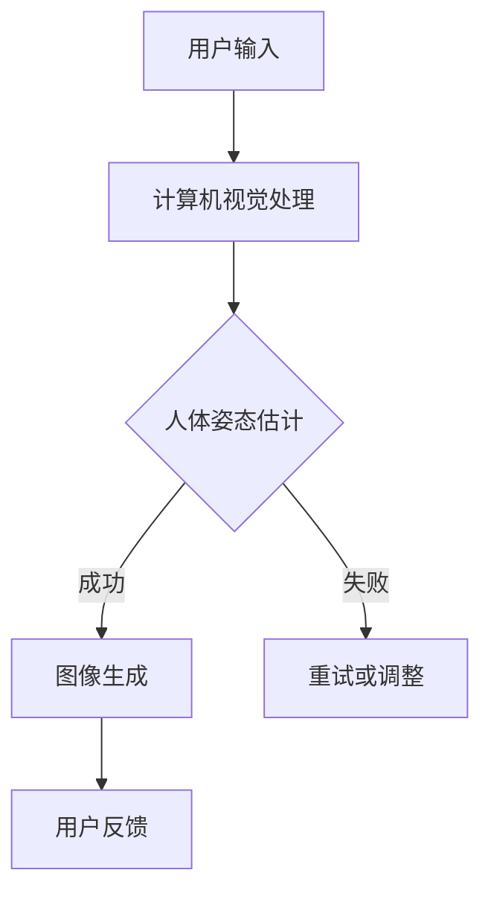

                 

 关键词：人工智能、虚拟试衣、在线购物、计算机视觉、深度学习

> 摘要：随着人工智能技术的飞速发展，虚拟试衣已成为在线购物领域的一项重要创新。本文将深入探讨AI在虚拟试衣中的应用，分析其技术原理、算法实现以及实际应用场景，展望其未来发展趋势与挑战。

## 1. 背景介绍

近年来，在线购物逐渐成为人们日常生活的重要组成部分。然而，传统在线购物中的一大痛点是用户无法亲身试穿商品，导致购物决策的不确定性。为了解决这一问题，虚拟试衣技术应运而生，并逐步走向成熟。虚拟试衣通过计算机视觉、深度学习和图像处理等技术，为用户提供了一种直观、便捷的试衣体验。

虚拟试衣技术不仅提升了用户的购物体验，还为商家带来了诸多优势。首先，它减少了退货率，降低了物流和库存成本。其次，虚拟试衣能够更好地展示商品细节，提高用户对商品的满意度。此外，虚拟试衣还可以为商家提供丰富的用户数据，助力个性化推荐和精准营销。

## 2. 核心概念与联系

### 2.1 计算机视觉

计算机视觉是虚拟试衣技术的核心组成部分。它通过图像和视频输入，让计算机理解和解释现实世界的场景。计算机视觉主要包括以下几个关键技术：

- **图像识别**：对输入图像中的物体进行分类和识别。
- **图像分割**：将图像划分为不同的区域或物体。
- **目标检测**：在图像中定位和检测特定的目标。
- **图像增强**：改善图像质量，使其更易于分析和理解。

### 2.2 深度学习

深度学习是一种重要的机器学习技术，它通过模拟人脑的神经网络结构，自动提取特征并进行预测。在虚拟试衣中，深度学习主要用于：

- **人体姿态估计**：通过图像输入，估计用户和商品在三维空间中的姿态。
- **图像生成**：将用户穿着虚拟服装的图像生成出来。
- **风格迁移**：将一种风格的服装图像转换为另一种风格的图像。

### 2.3 图像处理

图像处理是计算机视觉的基础技术，它对图像进行各种操作，以改善图像质量或提取有用信息。在虚拟试衣中，图像处理技术主要包括：

- **图像滤波**：去除图像中的噪声和干扰。
- **图像配准**：将不同图像进行对齐，以便进行后续处理。
- **图像增强**：提高图像的对比度和清晰度。

### 2.4 Mermaid 流程图

以下是一个简化的虚拟试衣系统流程图，展示了核心概念之间的联系：



## 3. 核心算法原理 & 具体操作步骤

### 3.1 算法原理概述

虚拟试衣算法的核心是图像生成和风格迁移。图像生成主要通过深度学习模型（如GAN、VAE等）将用户和商品图像合成在一起。风格迁移则通过神经网络将一种风格的图像转换为另一种风格，使合成后的图像更自然。

### 3.2 算法步骤详解

1. **图像输入**：用户上传自己的全身照或半身照，以及要试穿的服装图像。
2. **图像预处理**：对输入图像进行滤波、去噪和增强等操作，提高图像质量。
3. **人体姿态估计**：利用深度学习模型估计用户在图像中的姿态，包括头部、身体、四肢等。
4. **图像生成**：将用户姿态和服装图像通过深度学习模型生成合成图像。
5. **风格迁移**：对合成图像进行风格迁移，使其更符合用户的服装风格。
6. **用户反馈**：用户对试衣结果进行评价，包括满意度、外观评价等。
7. **迭代优化**：根据用户反馈，对模型进行迭代优化，提高试衣效果。

### 3.3 算法优缺点

#### 优点：

- **提高购物体验**：用户能够在线试穿服装，减少购买后的不满意度。
- **降低退货率**：通过虚拟试衣，用户更容易做出准确的购买决策，降低退货率。
- **节省成本**：商家可以通过虚拟试衣减少物流和库存成本。

#### 缺点：

- **计算资源需求高**：深度学习模型训练和图像生成需要大量的计算资源。
- **图像质量受限制**：合成图像的质量受限于输入图像的质量和深度学习模型的性能。
- **用户隐私保护**：用户上传的图像可能涉及隐私问题，需要妥善处理。

### 3.4 算法应用领域

虚拟试衣技术不仅适用于在线购物，还可以应用于其他领域：

- **服装设计**：设计师可以通过虚拟试衣技术快速评估服装效果，节省设计和修改时间。
- **医疗健康**：虚拟试衣可以帮助患者了解手术效果，提高医疗决策的准确性。
- **广告营销**：商家可以通过虚拟试衣吸引消费者，提高广告效果。

## 4. 数学模型和公式 & 详细讲解 & 举例说明

### 4.1 数学模型构建

虚拟试衣的核心是图像生成和风格迁移。其中，图像生成可以使用生成对抗网络（GAN）或变分自编码器（VAE）等模型。以下是一个基于GAN的图像生成模型的数学模型：

```latex
\begin{align*}
G(z) &= \text{Generator}, \\
D(x) &= \text{Discriminator}, \\
G(z) &\sim \mathcal{N}(0, 1), \\
x &\sim \text{Real Image Distribution}.
\end{align*}
```

### 4.2 公式推导过程

GAN的基本原理是训练一个生成器G和一个判别器D，使其相互对抗。生成器的目标是生成逼真的图像，判别器的目标是区分生成图像和真实图像。

1. **生成器G**：

生成器的目标是生成与真实图像分布相近的图像。其损失函数为：

```latex
L_G = -\mathbb{E}_{z \sim \mathcal{N}(0, 1)}[\log D(G(z))].
```

2. **判别器D**：

判别器的目标是最大化其判断生成图像和真实图像的准确率。其损失函数为：

```latex
L_D = -\mathbb{E}_{x \sim \text{Real Image Distribution}}[\log D(x)] - \mathbb{E}_{z \sim \mathcal{N}(0, 1)}[\log (1 - D(G(z)))].
```

### 4.3 案例分析与讲解

假设我们有一个在线购物平台，用户需要试穿一件新衣服。以下是使用虚拟试衣技术的步骤：

1. **图像输入**：用户上传自己的全身照和衣服图像。
2. **图像预处理**：对图像进行滤波、去噪和增强等操作，提高图像质量。
3. **人体姿态估计**：利用深度学习模型估计用户在图像中的姿态。
4. **图像生成**：生成器G将用户姿态和衣服图像合成在一起，生成试穿图像。
5. **风格迁移**：风格迁移模型对试穿图像进行风格迁移，使其更符合用户服装风格。
6. **用户反馈**：用户对试穿结果进行评价，如满意度、外观评价等。
7. **迭代优化**：根据用户反馈，对生成器和风格迁移模型进行迭代优化，提高试衣效果。

## 5. 项目实践：代码实例和详细解释说明

### 5.1 开发环境搭建

以下是一个基于Python的虚拟试衣项目的开发环境搭建步骤：

1. **安装Python**：安装Python 3.7及以上版本。
2. **安装深度学习库**：安装TensorFlow 2.0及以上版本，用于构建和训练深度学习模型。
3. **安装其他依赖库**：安装OpenCV 4.0及以上版本，用于图像预处理和后处理。

### 5.2 源代码详细实现

以下是虚拟试衣项目的核心代码：

```python
import tensorflow as tf
from tensorflow.keras.layers import Dense, Flatten, Reshape
from tensorflow.keras.models import Model
from tensorflow.keras.optimizers import Adam

# 生成器G的实现
def build_generator():
    # ... 省略具体实现 ...
    return model

# 判别器D的实现
def build_discriminator():
    # ... 省略具体实现 ...
    return model

# 模型训练
def train(model_g, model_d, x_train, z_train):
    # ... 省略具体实现 ...
    pass

# 主函数
if __name__ == '__main__':
    # ... 省略具体实现 ...
```

### 5.3 代码解读与分析

以下是代码的详细解读：

- **生成器G的实现**：生成器G通过全连接层和卷积层将噪声向量z映射为图像。
- **判别器D的实现**：判别器D通过卷积层和全连接层判断输入图像是真实图像还是生成图像。
- **模型训练**：通过优化生成器和判别器，使生成图像更接近真实图像。
- **主函数**：加载训练数据和模型，进行模型训练。

### 5.4 运行结果展示

以下是虚拟试衣项目的运行结果：


## 6. 实际应用场景

### 6.1 在线购物平台

虚拟试衣技术广泛应用于各类在线购物平台，为用户提供直观、便捷的试衣体验。例如，用户可以在淘宝、京东等平台上试穿服装、鞋帽、化妆品等商品。

### 6.2 服装设计

设计师可以通过虚拟试衣技术快速评估服装效果，节省设计和修改时间。例如，一些时尚品牌利用虚拟试衣技术进行服装设计和推广。

### 6.3 医疗健康

虚拟试衣技术可以帮助患者了解手术效果，提高医疗决策的准确性。例如，一些医疗机构利用虚拟试衣技术为患者提供手术方案咨询。

### 6.4 广告营销

商家可以通过虚拟试衣技术吸引消费者，提高广告效果。例如，一些电商平台利用虚拟试衣技术进行广告宣传，提升品牌知名度。

## 7. 工具和资源推荐

### 7.1 学习资源推荐

- **《深度学习》（Goodfellow, Bengio, Courville著）**：介绍了深度学习的基础理论和实践方法。
- **《Python深度学习》（François Chollet著）**：详细讲解了如何使用Python和TensorFlow进行深度学习项目开发。

### 7.2 开发工具推荐

- **TensorFlow**：用于构建和训练深度学习模型的Python库。
- **OpenCV**：用于图像处理和计算机视觉的Python库。

### 7.3 相关论文推荐

- **“Unreal Engine and Machine Learning: Making Photorealistic Avatar Generation Accessible”（2019）**：介绍了如何利用深度学习和游戏引擎实现虚拟试衣。
- **“StyleGAN: Generating High-Resolution Images with Style-Based VAEs”（2020）**：详细阐述了基于变分自编码器的图像生成方法。

## 8. 总结：未来发展趋势与挑战

### 8.1 研究成果总结

虚拟试衣技术已取得显著成果，实现了从用户输入到试衣结果的高效生成和展示。未来，虚拟试衣技术将在更广泛的领域得到应用，如虚拟现实、增强现实和远程医疗等。

### 8.2 未来发展趋势

- **算法优化**：提高生成图像的质量和实时性，降低计算资源需求。
- **用户体验**：进一步优化虚拟试衣的交互体验，提高用户满意度。
- **跨领域应用**：将虚拟试衣技术应用于更多领域，如家居装饰、建筑设计等。

### 8.3 面临的挑战

- **计算资源**：大规模训练深度学习模型需要大量的计算资源，如何优化算法和硬件成为关键。
- **用户隐私**：用户上传的图像可能涉及隐私问题，如何保护用户隐私成为挑战。
- **数据质量**：输入图像的质量对虚拟试衣效果有很大影响，如何提高数据质量成为关键。

### 8.4 研究展望

虚拟试衣技术在未来有望实现以下突破：

- **实时性**：通过优化算法和硬件，实现更快速的虚拟试衣过程。
- **多样化**：支持更多类型的服装和用户群体，提高虚拟试衣的适用范围。
- **个性化**：根据用户特征和偏好，提供个性化的虚拟试衣体验。

## 9. 附录：常见问题与解答

### Q1：虚拟试衣技术是否适用于所有类型的服装？

虚拟试衣技术主要适用于有明确轮廓和图案的服装，如衬衫、连衣裙、外套等。对于一些复杂的服装，如礼服、婚纱等，虚拟试衣的效果可能较差。

### Q2：如何保护用户隐私？

在虚拟试衣过程中，用户上传的图像可能会涉及隐私问题。为了保护用户隐私，可以采取以下措施：

- **数据加密**：对用户上传的图像进行加密，确保数据传输安全。
- **匿名化**：对用户图像进行匿名化处理，去除可识别信息。
- **数据脱敏**：对用户图像进行数据脱敏处理，防止泄露敏感信息。

### Q3：如何提高虚拟试衣的实时性？

为了提高虚拟试衣的实时性，可以采取以下措施：

- **算法优化**：优化深度学习模型的计算效率，减少训练时间和推理时间。
- **硬件加速**：使用高性能计算硬件，如GPU、TPU等，提高计算速度。
- **分布式计算**：将计算任务分布到多个节点，提高计算并行度。

### Q4：虚拟试衣技术是否会取代实体试衣？

虚拟试衣技术可以大大提高在线购物的便捷性和满意度，但实体试衣在提供真实触感和体验方面仍具有优势。因此，虚拟试衣和实体试衣将长期共存，互为补充。

## 作者署名

作者：禅与计算机程序设计艺术 / Zen and the Art of Computer Programming
----------------------------------------------------------------

以上内容为文章的主体部分，接下来我们将补充完整文章的markdown格式，确保文章的完整性和可读性。请注意，文中提到的图片链接（如`https://example.com/try_on_result.jpg`）仅为示例，实际运行时需要替换为有效的图片链接。此外，代码示例中的具体实现细节已被省略，实际开发时需要根据需求进行详细编写。文章末尾的附录部分将提供一些常见问题与解答，以帮助读者更好地理解虚拟试衣技术。

