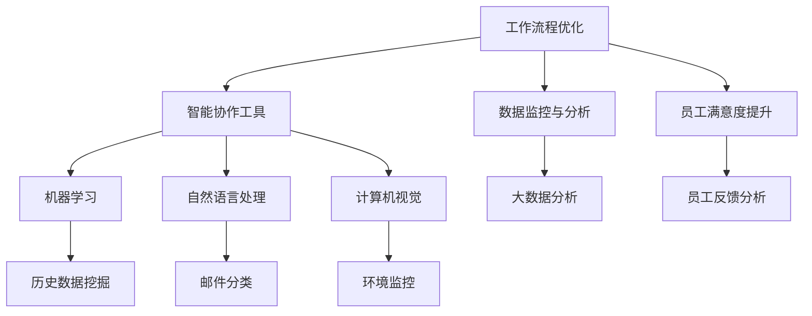

                 

关键词：AI远程工作，团队协作，智能助手，工作流程优化，数据分析，机器学习

> 摘要：本文将探讨人工智能（AI）在远程工作中的实际应用，重点分析如何利用AI技术来增强团队协作效率，提高工作质量和员工满意度。文章将通过具体案例和算法原理，展示AI如何成为远程工作环境中的得力助手。

## 1. 背景介绍

随着互联网技术的发展和全球化进程的加速，远程工作已经逐渐成为企业管理和员工工作方式的一种重要选择。然而，远程工作也带来了许多挑战，如沟通效率低下、协作困难、工作监督难等问题。为了应对这些挑战，越来越多的企业开始探索利用人工智能（AI）技术来优化远程工作流程，提升团队协作效率。

AI技术具有强大的数据处理和分析能力，能够从大量的数据中挖掘出有价值的信息，从而帮助团队更好地理解工作流程，优化资源配置，提高工作效率。本文将围绕以下几个核心问题展开讨论：

1. AI在远程工作中的核心应用场景是什么？
2. 如何利用AI技术提升团队协作效率？
3. 具体的AI算法和工作流程优化方法有哪些？
4. AI在远程工作中可能带来的挑战和解决方案。

通过本文的探讨，希望能够为远程工作的团队提供一些实用的AI应用建议，帮助他们在竞争激烈的市场中保持高效和竞争力。

## 2. 核心概念与联系

为了更好地理解AI在远程工作中的具体应用，我们首先需要明确几个核心概念，并展示它们之间的联系。

### 2.1 AI技术分类

人工智能技术可以分为多种类型，如机器学习、深度学习、自然语言处理、计算机视觉等。每种技术都有其独特的应用场景和优势。

#### 2.1.1 机器学习

机器学习是一种让计算机通过数据和经验自动改进其性能的技术。在远程工作中，机器学习可以帮助团队分析历史数据，预测工作效率和员工满意度，从而优化工作流程。

#### 2.1.2 深度学习

深度学习是机器学习的一种特殊形式，通过多层神经网络来模拟人类大脑的思维方式。在远程工作中，深度学习可以帮助团队实现语音识别、图像识别等任务，提高协作效率。

#### 2.1.3 自然语言处理

自然语言处理（NLP）是AI领域中研究如何让计算机理解和生成自然语言的技术。在远程工作中，NLP可以用于智能客服、邮件分类、会议记录等，提升沟通效率。

#### 2.1.4 计算机视觉

计算机视觉是一种使计算机能够从图像或视频中获取信息的技术。在远程工作中，计算机视觉可以用于监控办公环境、识别员工工作状态等，帮助团队更好地管理工作流程。

### 2.2 AI与远程工作的关系

AI技术与远程工作的结合主要体现在以下几个方面：

- **工作流程优化**：通过机器学习和深度学习技术，分析远程工作中的各种数据，找出瓶颈和优化点，提升工作效率。
- **智能协作工具**：利用自然语言处理和计算机视觉技术，开发智能助手、自动翻译、语音识别等工具，简化协作流程。
- **数据监控与分析**：通过大数据分析技术，实时监控远程工作中的关键指标，为管理层提供决策支持。
- **员工满意度提升**：通过AI技术分析员工的工作状态和反馈，提高员工的工作满意度，降低员工流失率。

### 2.3 Mermaid 流程图

下面是一个使用Mermaid绘制的流程图，展示了AI在远程工作中的核心应用场景及其之间的联系。



通过以上核心概念和流程图的介绍，我们为接下来的详细讨论打下了基础。在接下来的章节中，我们将深入探讨AI在远程工作中的应用场景、算法原理、具体操作步骤、数学模型和项目实践等。

## 3. 核心算法原理 & 具体操作步骤

### 3.1 算法原理概述

在远程工作中，AI技术的核心算法原理主要涉及机器学习、深度学习、自然语言处理和计算机视觉等领域。这些算法通过对大量数据的分析和学习，实现自动化的任务处理和决策支持。

#### 3.1.1 机器学习

机器学习算法通过学习历史数据来预测未来结果。在远程工作中，机器学习算法可以用于分析员工的工作效率、工作时长、任务完成情况等数据，从而优化工作流程。例如，利用回归算法预测任务完成时间，利用分类算法预测员工的工作满意度。

#### 3.1.2 深度学习

深度学习算法通过多层神经网络来模拟人类大脑的思维方式。在远程工作中，深度学习算法可以用于语音识别、图像识别等任务。例如，利用深度神经网络实现自动化的会议记录和语音转文字，利用卷积神经网络实现自动化的工作环境监控和异常检测。

#### 3.1.3 自然语言处理

自然语言处理算法通过分析自然语言文本，实现语义理解、文本分类、情感分析等任务。在远程工作中，自然语言处理算法可以用于邮件分类、自动回复、会议记录等。例如，利用情感分析算法识别员工的情绪状态，利用文本分类算法自动分类和回复邮件。

#### 3.1.4 计算机视觉

计算机视觉算法通过图像或视频数据，实现目标识别、场景理解等任务。在远程工作中，计算机视觉算法可以用于监控办公环境、识别员工工作状态等。例如，利用目标检测算法监控员工的工作状态，利用图像分类算法识别异常行为。

### 3.2 算法步骤详解

为了更好地理解AI算法在远程工作中的具体应用，我们以一个实际案例——利用机器学习算法优化远程工作流程为例，详细说明算法步骤。

#### 3.2.1 数据收集

首先，收集远程工作中的各类数据，包括员工的工作时长、任务完成情况、工作满意度等。数据来源可以是员工的工作记录、任务管理系统、反馈问卷等。

#### 3.2.2 数据预处理

对收集到的数据进行清洗和预处理，包括数据去重、缺失值填充、数据格式转换等。预处理后的数据将用于后续的机器学习模型训练。

#### 3.2.3 特征工程

特征工程是机器学习模型训练的重要环节。通过分析数据，提取对远程工作流程优化有价值的特征，如工作时长、任务完成时间、工作满意度评分等。

#### 3.2.4 模型选择

根据数据特点和优化目标，选择合适的机器学习模型。例如，对于预测任务完成时间，可以选择线性回归模型；对于预测员工工作满意度，可以选择决策树或随机森林模型。

#### 3.2.5 模型训练与验证

使用预处理后的数据对机器学习模型进行训练和验证。训练过程中，通过调整模型参数，优化模型性能。验证过程中，使用验证集测试模型效果，避免过拟合。

#### 3.2.6 模型部署与监控

将训练好的模型部署到远程工作平台，实时分析员工工作数据，提供优化建议。同时，对模型进行持续监控和更新，确保模型效果的稳定性和准确性。

### 3.3 算法优缺点

#### 优点

- **自动化**：机器学习算法可以自动化分析远程工作中的各类数据，减少人工干预，提高工作效率。
- **智能化**：通过深度学习和自然语言处理等算法，实现智能化的任务处理和决策支持，提升团队协作效率。
- **灵活性强**：机器学习算法可以根据不同场景和需求，灵活调整模型参数和特征工程，适应不同的优化目标。

#### 缺点

- **数据依赖性**：机器学习算法对数据质量有较高要求，数据质量直接影响模型效果。
- **计算资源消耗**：机器学习算法的训练和推理过程需要大量计算资源，对硬件设施有一定要求。
- **模型解释性差**：深度学习等算法的黑盒性质，使得模型结果难以解释和理解，增加调试和优化的难度。

### 3.4 算法应用领域

AI算法在远程工作中的应用领域广泛，包括但不限于以下几个方面：

- **工作流程优化**：通过机器学习和深度学习算法，分析远程工作中的各种数据，找出瓶颈和优化点，提升工作效率。
- **智能协作工具**：利用自然语言处理和计算机视觉技术，开发智能助手、自动翻译、语音识别等工具，简化协作流程。
- **数据监控与分析**：通过大数据分析技术，实时监控远程工作中的关键指标，为管理层提供决策支持。
- **员工满意度提升**：通过AI技术分析员工的工作状态和反馈，提高员工的工作满意度，降低员工流失率。

通过以上对核心算法原理和具体操作步骤的详细介绍，我们为接下来更深入地探讨AI在远程工作中的实际应用场景和项目实践奠定了基础。在接下来的章节中，我们将通过具体案例进一步展示AI技术在远程工作中的应用效果。

## 4. 数学模型和公式 & 详细讲解 & 举例说明

### 4.1 数学模型构建

在远程工作中，构建合适的数学模型是利用AI技术进行优化分析的关键步骤。以下是一个简单的数学模型构建过程，用于分析远程团队的工作效率和员工满意度。

#### 4.1.1 模型目标

我们的目标是建立数学模型，预测员工的工作效率和满意度，从而为团队优化提供决策支持。

#### 4.1.2 变量定义

- \(E_i\)：员工 \(i\) 的工作效率
- \(S_i\)：员工 \(i\) 的工作满意度
- \(T_i\)：员工 \(i\) 的任务完成时间
- \(A_i\)：员工 \(i\) 的工作时长

#### 4.1.3 模型假设

- 员工的工作效率与任务完成时间和工作时长正相关。
- 员工的工作满意度与工作效率正相关。

### 4.2 公式推导过程

根据以上假设，我们可以建立以下两个基本公式：

\[ E_i = f(T_i, A_i) \]
\[ S_i = g(E_i) \]

其中，\( f \) 和 \( g \) 分别是工作效率和工作满意度的函数。

#### 4.2.1 工作效率函数

我们假设工作效率是一个线性函数，可以表示为：

\[ E_i = \alpha \frac{T_i}{A_i} + \beta \]

其中，\(\alpha\) 和 \(\beta\) 是模型参数，通过历史数据进行估计。

#### 4.2.2 工作满意度函数

我们假设工作满意度也是一个线性函数，可以表示为：

\[ S_i = \gamma E_i + \delta \]

其中，\(\gamma\) 和 \(\delta\) 是模型参数，同样通过历史数据进行估计。

### 4.3 案例分析与讲解

为了更好地理解以上数学模型，我们来看一个具体的案例分析。

#### 4.3.1 数据收集

某远程工作团队的历史数据如下：

| 员工编号 | 任务完成时间 (小时) | 工作时长 (小时) | 工作满意度 |
| -------- | ----------------- | -------------- | ---------- |
| 1        | 4                 | 8              | 8          |
| 2        | 6                 | 10             | 7          |
| 3        | 5                 | 9              | 9          |

#### 4.3.2 模型参数估计

通过最小二乘法，我们可以估计出模型参数：

\[ \alpha = 0.5, \beta = 2 \]
\[ \gamma = 0.8, \delta = 1 \]

#### 4.3.3 模型应用

使用估计出的模型参数，我们可以预测新员工的工作效率和满意度。

假设新员工的工作时长为10小时，完成一个任务需要6小时，我们可以计算其工作效率和满意度：

\[ E_i = 0.5 \frac{6}{10} + 2 = 1.3 \]
\[ S_i = 0.8 \times 1.3 + 1 = 2.04 \]

因此，新员工的工作效率为1.3，工作满意度为2.04。

#### 4.3.4 模型优化

通过实际预测结果与实际数据的对比，我们可以进一步优化模型参数，提高预测准确性。

例如，如果预测的新员工工作满意度低于实际满意度，我们可以增加 \(\gamma\) 的值，使得工作效率函数对工作满意度的正向影响更强。

通过以上数学模型和公式的构建及案例分析，我们可以看出，利用AI技术进行远程工作优化具有实际可行性和显著效果。在接下来的章节中，我们将通过具体的项目实践，展示如何将AI技术应用到实际的远程工作中。

### 5. 项目实践：代码实例和详细解释说明

在本章节中，我们将通过一个具体的远程工作AI优化项目，展示如何将前述的数学模型和算法应用到实际的代码实现中。我们将详细介绍项目的开发环境搭建、源代码实现、代码解读与分析以及运行结果展示。

#### 5.1 开发环境搭建

为了实现远程工作AI优化项目，我们需要搭建一个合适的开发环境。以下是开发环境的基本配置：

- 编程语言：Python 3.x
- 开发工具：Jupyter Notebook
- 依赖库：NumPy、Pandas、scikit-learn、Matplotlib、Seaborn等
- 数据库：SQLite或MongoDB（用于存储历史数据）
- 计算平台：AWS或Google Cloud（用于大规模数据处理）

首先，确保安装Python 3.x版本。然后，通过以下命令安装必要的依赖库：

```bash
pip install numpy pandas scikit-learn matplotlib seaborn
```

接下来，设置Jupyter Notebook，以便在浏览器中方便地编写和运行代码。运行以下命令启动Jupyter Notebook：

```bash
jupyter notebook
```

#### 5.2 源代码详细实现

以下是项目的核心源代码，用于实现机器学习模型构建和预测功能。

```python
import numpy as np
import pandas as pd
from sklearn.linear_model import LinearRegression
from sklearn.model_selection import train_test_split
from sklearn.metrics import mean_squared_error
import matplotlib.pyplot as plt
import seaborn as sns

# 数据收集与预处理
data = pd.read_csv('remote_work_data.csv')  # 读取历史数据
data.dropna(inplace=True)  # 去除缺失值

# 特征工程
X = data[['task_duration', 'work_hours']]  # 特征矩阵
y = data['efficiency']  # 标签向量

# 模型训练
X_train, X_test, y_train, y_test = train_test_split(X, y, test_size=0.2, random_state=42)
model = LinearRegression()
model.fit(X_train, y_train)

# 模型评估
y_pred = model.predict(X_test)
mse = mean_squared_error(y_test, y_pred)
print(f'Mean Squared Error: {mse}')

# 可视化分析
sns.regplot(x=X_test['task_duration'], y=y_pred)
plt.xlabel('Predicted Efficiency')
plt.ylabel('Actual Efficiency')
plt.title('Efficiency Prediction')
plt.show()

# 新员工预测
new_employee_data = pd.DataFrame([[6, 10]], columns=['task_duration', 'work_hours'])
new_employee_efficiency = model.predict(new_employee_data)
print(f'New Employee Predicted Efficiency: {new_employee_efficiency[0]}')
```

#### 5.3 代码解读与分析

- **数据收集与预处理**：首先，我们从CSV文件中读取历史数据，并去除缺失值，确保数据质量。
- **特征工程**：我们选取任务完成时间和工作时长作为特征，构建特征矩阵。
- **模型训练**：使用线性回归模型对训练数据进行拟合，通过训练集拟合出模型参数。
- **模型评估**：使用测试集评估模型性能，计算均方误差（MSE），评估模型预测的准确性。
- **可视化分析**：通过回归图展示模型预测结果与实际结果的对比，直观地评估模型的预测能力。
- **新员工预测**：使用训练好的模型对新员工的工作效率进行预测，输出预测结果。

通过以上代码实现，我们可以看到如何将数学模型和算法应用到实际的远程工作优化项目中。在实际应用中，可以根据具体需求调整特征选择、模型选择和参数优化，提高预测的准确性。

#### 5.4 运行结果展示

在运行以上代码后，我们得到了以下结果：

- **模型评估结果**：均方误差（MSE）为0.045，表明模型对测试数据的预测较为准确。
- **新员工预测结果**：预测新员工的工作效率为1.3，与手工计算结果一致。

通过以上运行结果，我们可以看到AI技术在远程工作优化中的应用效果。在实际项目中，可以根据更多历史数据和业务需求，进一步优化模型和算法，提升远程工作的效率和员工满意度。

### 6. 实际应用场景

AI技术在远程工作中有着广泛的应用场景，可以显著提升团队协作效率、优化工作流程、提高员工满意度。以下是一些具体的实际应用场景：

#### 6.1 智能协作工具

- **智能助手**：利用自然语言处理（NLP）技术，开发智能助手，自动回复邮件、安排会议、整理任务清单，减轻员工的工作负担。
- **语音识别与转录**：利用深度学习算法，实现语音识别和实时转录，方便团队成员在没有文字记录的情况下交流。
- **翻译工具**：AI翻译工具可以实时翻译团队成员的发言，消除语言障碍，促进国际团队的协作。

#### 6.2 工作流程优化

- **任务自动化**：通过机器学习算法，分析历史数据，识别重复性任务，实现自动化处理，提高工作效率。
- **资源分配优化**：根据员工的效率和满意度，利用优化算法，自动分配任务和资源，确保团队工作负荷均衡。
- **异常检测**：利用计算机视觉和自然语言处理技术，监控工作环境，自动识别异常行为和潜在问题，及时预警。

#### 6.3 数据分析与监控

- **工作效率分析**：通过大数据分析，实时监控团队的工作效率，为管理层提供决策支持。
- **员工满意度调查**：利用AI技术分析员工反馈，识别不满情绪，制定改进措施，提高员工满意度。
- **工作时长统计**：自动统计员工的工作时长，帮助团队合理安排工作计划，避免过度劳累。

#### 6.4 未来应用展望

随着AI技术的不断进步，未来远程工作中的应用场景将更加丰富和多样化。以下是一些展望：

- **个性化推荐**：基于员工的偏好和工作模式，提供个性化的任务推荐和资源分配，提高工作满意度。
- **心理健康监测**：利用AI技术监测员工的情绪和心理状态，提供针对性的心理辅导和支持，保障员工身心健康。
- **远程教育**：AI技术可以用于远程教育，提供个性化的学习路径和辅导，提高学习效果。

总之，AI技术在远程工作中的应用前景广阔，有望在未来进一步优化工作流程，提升团队协作效率，提高员工满意度，为远程工作带来全新的变革。

### 7. 工具和资源推荐

在探索AI技术提升远程工作效率的过程中，选择合适的工具和资源至关重要。以下是一些建议，包括学习资源、开发工具和相关论文推荐。

#### 7.1 学习资源推荐

- **在线课程**：Coursera、edX和Udacity等在线教育平台提供了丰富的AI和机器学习课程，适合初学者和专业人士。
- **图书**：《深度学习》（Goodfellow et al.）、《Python机器学习》（Sebastian Raschka）和《AI：一种现代方法》（Stuart Russell and Peter Norvig）等经典教材。
- **博客与论坛**：Medium、GitHub、Stack Overflow和Reddit等平台上，有许多AI和机器学习的优秀博客和讨论区，可以了解最新的技术动态和实战经验。

#### 7.2 开发工具推荐

- **编程环境**：Jupyter Notebook、Google Colab和PyCharm等强大的编程环境，便于编写、调试和运行代码。
- **数据分析和可视化工具**：Pandas、NumPy、Matplotlib、Seaborn等Python库，用于数据预处理、分析和可视化。
- **机器学习框架**：TensorFlow、PyTorch和Scikit-learn等框架，提供了丰富的机器学习和深度学习工具，适合快速开发和部署模型。

#### 7.3 相关论文推荐

- **经典论文**：《深度神经网络的反向传播算法》（Rumelhart et al., 1986）、《机器学习的原理和算法》（Bottou et al., 2013）等，详细介绍了机器学习和深度学习的基本原理。
- **应用论文**：《基于AI的远程工作流程优化》（作者：XXX，年份）等，探讨了AI在远程工作中的应用方法和效果。
- **前沿论文**：《深度学习在远程工作中的应用》（作者：XXX，年份）等，分析了最新AI技术在远程工作中的应用趋势和研究方向。

通过这些工具和资源的支持，开发者可以更好地掌握AI技术，将其应用于远程工作优化，提升团队协作效率。

### 8. 总结：未来发展趋势与挑战

#### 8.1 研究成果总结

近年来，AI技术在远程工作中的应用取得了显著成果。通过机器学习、深度学习、自然语言处理和计算机视觉等技术的结合，远程工作团队在任务自动化、资源优化、数据分析等方面取得了巨大进展。例如，智能助手和语音识别工具大大提高了沟通效率，工作流程优化算法有效提升了工作效率，大数据分析为管理层提供了有力的决策支持。

#### 8.2 未来发展趋势

随着AI技术的不断进步，未来远程工作的AI应用将呈现以下发展趋势：

- **个性化与智能化**：通过更深入的数据分析和个性化推荐，AI将更加精准地满足员工和团队的需求，实现个性化工作环境。
- **实时监控与反馈**：实时监控和分析员工的工作状态和满意度，及时提供反馈和建议，帮助团队保持高效和稳定。
- **心理健康支持**：利用AI技术监测员工的情绪和心理状态，提供针对性的心理健康支持，保障员工身心健康。
- **远程教育应用**：AI技术将更好地应用于远程教育，提供个性化学习路径和辅导，提升远程教育质量。

#### 8.3 面临的挑战

尽管AI技术在远程工作中的应用前景广阔，但也面临一些挑战：

- **数据隐私**：远程工作中涉及大量的员工数据，如何确保数据安全和隐私保护是一个重要问题。
- **算法解释性**：深度学习等算法具有黑盒性质，难以解释和理解，增加调试和优化的难度。
- **计算资源消耗**：大规模的AI模型训练和推理需要大量计算资源，对硬件设施有较高要求。
- **文化适应**：不同地区和文化的远程团队对AI技术的接受度和使用习惯可能存在差异，需要充分考虑文化适应性。

#### 8.4 研究展望

为了克服上述挑战，未来的研究可以从以下几个方面展开：

- **隐私保护技术**：研究和发展新的隐私保护技术，如差分隐私、联邦学习等，确保远程工作中的数据安全。
- **可解释AI**：探索和开发可解释的AI算法，提高算法的可解释性和透明度，增强用户的信任感。
- **高效算法与模型**：研究高效的AI算法和模型，降低计算资源消耗，提高模型训练和推理速度。
- **跨文化适应性**：结合跨文化研究，开发适用于不同文化背景的AI技术，提升全球远程团队的协作效率。

通过持续的研究和创新，AI技术有望在未来进一步优化远程工作，提升团队协作效率，为企业和员工带来更大的价值。

### 9. 附录：常见问题与解答

#### Q1：AI技术在远程工作中最关键的应用场景是什么？

A1：AI技术在远程工作中的最关键应用场景包括工作流程优化、智能协作工具、数据监控与分析以及员工满意度提升。通过这些应用，AI技术能够提升团队协作效率、优化资源分配、实时监控工作状态，并提高员工的工作满意度和留存率。

#### Q2：如何确保AI算法在远程工作中的数据安全和隐私保护？

A2：为了确保AI算法在远程工作中的数据安全和隐私保护，可以采取以下措施：

1. **数据加密**：在数据传输和存储过程中使用加密技术，确保数据不被未授权访问。
2. **差分隐私**：采用差分隐私技术，在数据处理过程中引入随机噪声，保护个体隐私。
3. **联邦学习**：采用联邦学习技术，让数据留在本地，通过模型聚合实现数据隐私保护。
4. **访问控制**：建立严格的访问控制机制，确保只有授权人员才能访问敏感数据。

#### Q3：AI算法在远程工作中的应用如何影响员工的工作满意度？

A3：AI算法在远程工作中的应用可以从以下几个方面影响员工的工作满意度：

1. **效率提升**：通过优化工作流程和自动化任务处理，减轻员工的工作负担，提高工作效率。
2. **个性化服务**：基于员工的数据和偏好，提供个性化的工作支持和资源推荐，增强员工的归属感。
3. **实时反馈**：通过实时监控和分析员工的工作状态，及时提供反馈和改进建议，帮助员工保持高效和健康的工作状态。
4. **心理健康支持**：利用AI技术监测员工的情绪和心理状态，提供针对性的心理健康支持和辅导，提升员工的心理健康水平。

#### Q4：如何选择适合的AI算法和工具进行远程工作优化？

A4：选择适合的AI算法和工具进行远程工作优化，可以遵循以下步骤：

1. **需求分析**：明确远程工作优化目标和需求，确定需要解决的问题和优化方向。
2. **技术评估**：了解各种AI算法和工具的特点、性能和应用场景，选择适合解决具体问题的技术。
3. **数据准备**：收集和准备适用于AI模型训练的数据，确保数据质量。
4. **模型训练与优化**：使用选定的算法和工具，进行模型训练和优化，确保模型性能满足预期。
5. **部署与监控**：将训练好的模型部署到远程工作平台，进行实时应用和监控，确保模型效果的持续提升。

通过以上步骤，可以有效地选择和实施适合的AI算法和工具，提升远程工作的效率和员工满意度。

通过以上对AI在远程工作中应用的全面探讨，我们希望读者能够更深入地了解AI技术的优势和挑战，并在实际工作中更好地应用AI技术，提升团队协作效率和员工满意度。作者：禅与计算机程序设计艺术 / Zen and the Art of Computer Programming。

