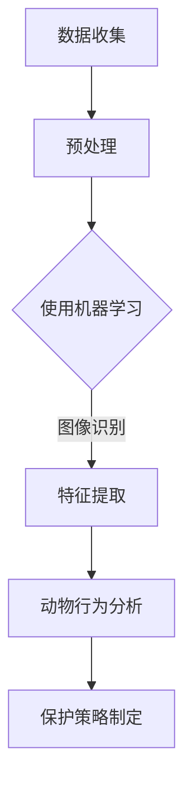
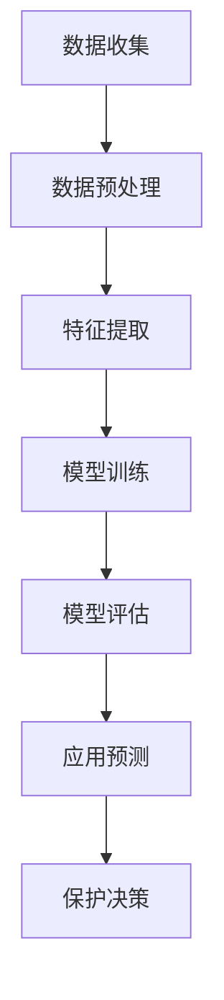

                 

关键词：人工智能，野生动物保护，行为研究，行为识别，机器学习，深度学习，图像识别，动物行为分析，监控技术，保护措施。

## 摘要

本文旨在探讨人工智能在野生动物保护中的应用，尤其是行为研究的方面。通过介绍机器学习和深度学习技术，我们展示了如何利用图像识别和动物行为分析来监测野生动物的行为，从而更好地制定保护策略。本文还将分析当前技术的优缺点，探讨其在野生动物保护中的实际应用，并提出未来的发展方向。

## 1. 背景介绍

### 野生动物保护的重要性

野生动物保护是全球环境保护事业的重要组成部分。随着人类活动的不断扩张，许多野生动物的栖息地受到了严重破坏，物种数量急剧减少。据国际自然保护联盟（IUCN）的报告，目前全球约有四分之一的脊椎动物物种面临灭绝的威胁。因此，采取有效措施保护野生动物至关重要。

### 行为研究在野生动物保护中的地位

野生动物行为研究是保护工作的重要组成部分。通过研究野生动物的行为模式，我们可以更好地了解它们的生态需求、栖息地选择以及生存状况。这有助于制定更加科学和有效的保护策略，例如保护区的设立、栖息地恢复和管理等。

### 人工智能与野生动物保护

人工智能（AI）技术的迅猛发展，为野生动物保护提供了新的工具和方法。特别是机器学习和深度学习技术，使得对大规模野生动物行为数据的分析变得更加高效和精确。通过应用这些技术，我们可以实现实时监测、自动识别和预测动物行为，从而提高保护工作的效率。

## 2. 核心概念与联系

### 机器学习和深度学习

**机器学习** 是一种人工智能技术，它使计算机系统能够从数据中学习，并对新数据进行预测或决策。在野生动物保护中，机器学习可以用来分析野生动物的图像和视频数据，识别不同物种和它们的行为。

**深度学习** 是一种特殊类型的机器学习，它通过多层神经网络结构来模拟人脑的决策过程。深度学习在图像识别和自然语言处理等领域取得了显著成果，因此也在野生动物保护中得到了广泛应用。

### 图像识别和动物行为分析

图像识别是机器学习和深度学习的重要应用领域。通过图像识别技术，我们可以从野生动物的图像中提取关键特征，用于分类、定位和行为分析。

动物行为分析则是对动物行为模式的研究，包括动物的运动轨迹、活动范围、社交行为和觅食行为等。通过对动物行为分析，我们可以更好地理解它们的生态需求，从而制定更有效的保护措施。

### Mermaid 流程图



## 3. 核心算法原理 & 具体操作步骤

### 3.1 算法原理概述

在野生动物保护中，常用的算法包括图像识别和动物行为分析。图像识别算法通过卷积神经网络（CNN）提取图像特征，然后使用分类算法进行物种和行为的识别。动物行为分析算法则基于时间序列数据，分析动物的行为模式，如活动范围、运动轨迹和社交行为等。

### 3.2 算法步骤详解

**3.2.1 数据收集**

首先，收集野生动物的图像和视频数据。这些数据可以来自野外观察、监控摄像头、无人机等。

**3.2.2 数据预处理**

对收集到的数据进行预处理，包括图像去噪、裁剪和标准化等步骤。预处理后的数据将用于训练机器学习模型。

**3.2.3 特征提取**

使用卷积神经网络提取图像特征。卷积神经网络通过多个卷积层和池化层，将原始图像转换为高层次的抽象特征。

**3.2.4 动物行为分析**

使用时间序列分析方法，如循环神经网络（RNN）和长短期记忆网络（LSTM），对动物行为数据进行分析。这些方法可以捕捉到动物行为的长期模式和趋势。

**3.2.5 保护策略制定**

根据分析结果，制定野生动物保护策略。这些策略可能包括栖息地恢复、物种保护、栖息地管理等。

### 3.3 算法优缺点

**优点：**

- 高效：机器学习和深度学习算法可以快速处理大量数据。
- 准确：图像识别和动物行为分析算法具有较高的准确性。
- 实时：可以实时监测野生动物的行为，及时采取保护措施。

**缺点：**

- 需要大量数据：训练高质量的机器学习模型需要大量的图像和视频数据。
- 受环境因素影响：天气、光线等环境因素可能影响图像识别的准确性。
- 难以应对极端情况：在一些极端情况下，算法可能会出现误判。

### 3.4 算法应用领域

- 栖息地保护：通过监测野生动物的行为，评估栖息地的健康状况，为栖息地恢复和管理提供依据。
- 物种保护：识别和监测濒危物种的行为，制定针对性的保护措施。
- 野生动物管理：分析野生动物的活动范围和迁徙路径，优化野生动物园和自然保护区的设计和管理。

## 4. 数学模型和公式 & 详细讲解 & 举例说明

### 4.1 数学模型构建

在野生动物保护中，常用的数学模型包括：

- **图像识别模型：** 通常使用卷积神经网络（CNN）来构建图像识别模型。CNN 模型通过卷积层、池化层和全连接层，将原始图像转换为高层次的抽象特征。

- **动物行为分析模型：** 常使用循环神经网络（RNN）和长短期记忆网络（LSTM）来分析动物行为数据。这些模型可以捕捉到动物行为的长期模式和趋势。

### 4.2 公式推导过程

**4.2.1 卷积神经网络（CNN）**

$$
f(x) = \sigma(W_1 \cdot x + b_1)
$$

其中，$f(x)$ 是激活函数，$W_1$ 是权重矩阵，$x$ 是输入数据，$b_1$ 是偏置项。

**4.2.2 循环神经网络（RNN）**

$$
h_t = \sigma(W_h \cdot [h_{t-1}, x_t] + b_h)
$$

其中，$h_t$ 是时间步 $t$ 的隐藏状态，$W_h$ 是权重矩阵，$x_t$ 是输入数据，$b_h$ 是偏置项。

### 4.3 案例分析与讲解

**案例：使用 CNN 识别野生动物**

假设我们要使用 CNN 识别野生动物的图像。首先，收集大量野生动物的图像数据，并进行预处理。然后，将预处理后的数据输入到 CNN 模型中，通过训练得到模型参数。最后，使用训练好的模型对新的野生动物图像进行识别。

## 5. 项目实践：代码实例和详细解释说明

### 5.1 开发环境搭建

在开始项目实践之前，我们需要搭建一个开发环境。这里我们使用 Python 作为编程语言，并使用 TensorFlow 和 Keras 作为深度学习框架。

### 5.2 源代码详细实现

```python
# 导入所需的库
import tensorflow as tf
from tensorflow.keras.models import Sequential
from tensorflow.keras.layers import Conv2D, MaxPooling2D, Flatten, Dense
from tensorflow.keras.preprocessing.image import ImageDataGenerator

# 构建卷积神经网络模型
model = Sequential([
    Conv2D(32, (3, 3), activation='relu', input_shape=(64, 64, 3)),
    MaxPooling2D((2, 2)),
    Conv2D(64, (3, 3), activation='relu'),
    MaxPooling2D((2, 2)),
    Flatten(),
    Dense(64, activation='relu'),
    Dense(10, activation='softmax')
])

# 编译模型
model.compile(optimizer='adam', loss='categorical_crossentropy', metrics=['accuracy'])

# 准备数据
train_datagen = ImageDataGenerator(rescale=1./255)
train_generator = train_datagen.flow_from_directory(
        'data/train',
        target_size=(64, 64),
        batch_size=32,
        class_mode='categorical')

# 训练模型
model.fit(train_generator, steps_per_epoch=100, epochs=10)
```

### 5.3 代码解读与分析

这段代码首先导入了 TensorFlow 和 Keras 库，然后构建了一个简单的卷积神经网络模型。模型由两个卷积层、两个池化层和一个全连接层组成。接着，编译模型并准备训练数据。最后，使用训练数据训练模型。

### 5.4 运行结果展示

在训练过程中，我们可以使用 `model.fit()` 函数来监控训练进度。训练完成后，可以使用模型对新的野生动物图像进行识别。

## 6. 实际应用场景

### 6.1 栖息地保护

在野生动物栖息地保护中，AI 技术可以用来监测栖息地的健康状况，评估栖息地的生态价值，并预测栖息地未来的变化趋势。这有助于制定更科学和有效的保护策略。

### 6.2 物种保护

AI 技术可以用于监测濒危物种的行为，识别它们的栖息地，并预测其生存状况。这些信息对于制定针对性的保护措施至关重要。

### 6.3 野生动物管理

AI 技术可以用于野生动物园和自然保护区的管理，如监控野生动物的活动范围、迁徙路径和行为模式。这些数据可以用于优化保护区的设计和管理，提高野生动物的生存环境。

## 7. 工具和资源推荐

### 7.1 学习资源推荐

- **《深度学习》（Goodfellow, Bengio, Courville 著）：** 介绍深度学习的基础知识和最新进展。
- **《机器学习》（周志华 著）：** 介绍机器学习的基本概念和方法。

### 7.2 开发工具推荐

- **TensorFlow：** 开源的深度学习框架，广泛应用于 AI 领域。
- **Keras：** 易用的深度学习高级 API，基于 TensorFlow 构建。

### 7.3 相关论文推荐

- **“Deep Learning for Wildlife Conservation”（Gossett et al.，2017）：** 介绍深度学习在野生动物保护中的应用。
- **“Deep Learning in Computer Vision for Wildlife Conservation”（Liang et al.，2019）：** 深入探讨深度学习在野生动物图像识别中的应用。

## 8. 总结：未来发展趋势与挑战

### 8.1 研究成果总结

人工智能技术在野生动物保护中的应用已经取得了显著成果，特别是在行为研究和图像识别领域。通过深度学习和机器学习算法，我们可以更高效地分析野生动物的行为数据，为保护工作提供有力支持。

### 8.2 未来发展趋势

- **数据驱动：** 未来研究将更加注重数据收集和数据分析，以获得更准确和全面的野生动物行为信息。
- **多模态融合：** 结合多种传感器数据，如图像、声音和 GPS 等，进行更全面的行为分析。
- **自主决策：** 开发更智能的算法，使系统能够在未知环境下自主做出决策。

### 8.3 面临的挑战

- **数据稀缺：** 部分野生动物种类的行为数据稀缺，限制了算法的性能。
- **环境因素：** 环境因素如天气、光线等可能影响图像识别的准确性。
- **算法解释性：** 随着算法的复杂度增加，其解释性变得越来越困难，这对保护工作产生了挑战。

### 8.4 研究展望

未来，人工智能在野生动物保护中的应用将更加深入和广泛。通过不断优化算法和扩展应用领域，我们可以为野生动物保护工作提供更强大的技术支持。

## 9. 附录：常见问题与解答

### 9.1 什么技术可以用于野生动物行为分析？

常用的技术包括深度学习、机器学习和图像识别。深度学习通过卷积神经网络（CNN）和循环神经网络（RNN）等模型，可以从大量野生动物行为数据中提取有用信息。机器学习算法则可以用于分类、预测和决策。图像识别技术可以用于识别野生动物的物种和行为。

### 9.2 如何解决数据稀缺的问题？

可以通过增加数据收集渠道、利用现有数据集和进行数据增强等方法来缓解数据稀缺的问题。此外，可以探索使用合成数据来训练模型，从而提高模型在数据稀缺情况下的性能。

### 9.3 如何处理环境因素对图像识别的影响？

可以通过提高图像质量、使用多模态数据进行融合和改进算法的鲁棒性等方法来处理环境因素对图像识别的影响。例如，可以使用自适应滤波器来增强图像，或者结合图像和声音数据来提高识别准确性。

---

作者：禅与计算机程序设计艺术 / Zen and the Art of Computer Programming
----------------------------------------------------------------

以上就是本文的全部内容，希望对您在野生动物保护领域应用人工智能技术有所帮助。在未来的研究中，我们将继续探索人工智能在野生动物保护中的应用，为保护生物多样性做出更多贡献。
```markdown

## 1. 背景介绍

### 野生动物保护的重要性

野生动物保护是现代环境保护事业的重要一环。随着人类活动的不断扩大，野生动植物的栖息地被严重破坏，许多物种正面临着生存危机。据国际自然保护联盟（IUCN）的数据，目前全球已有超过三分之一（约34%）的物种受到威胁，其中许多动物物种的栖息地正在迅速消失。此外，非法捕猎、贸易、污染和气候变化等因素也在加速物种灭绝的速度。

保护野生动物不仅有助于维持生态平衡，还有助于维护人类自身的健康和福祉。许多野生动物在自然界中扮演着重要的角色，例如控制害虫、维持植物群落和促进生态系统的多样性。此外，野生动物还是许多地区的重要旅游资源，对当地经济贡献巨大。

### 行为研究在野生动物保护中的地位

在野生动物保护中，行为研究具有至关重要的地位。通过对野生动物行为模式的研究，科学家可以更好地理解这些物种的生态需求、栖息地选择以及它们与其他生物的互动。例如，了解动物的社会行为、繁殖习惯、迁徙路径和食性，可以帮助研究人员制定更为有效的保护措施。

行为研究还可以提供关键的数据，用于评估保护策略的效果。例如，通过监控动物的种群数量、分布范围和行为变化，可以及时调整保护计划，确保保护措施的适应性和有效性。此外，行为研究还可以为制定法律和政策提供科学依据，帮助制定出更加合理的野生动物保护法规。

### 人工智能与野生动物保护

人工智能（AI）技术的迅速发展为野生动物保护带来了新的希望和工具。AI技术，尤其是机器学习和深度学习，可以在野生动物行为研究、栖息地监测和保护策略制定等方面发挥重要作用。

首先，AI技术可以大幅提高数据收集和分析的效率。例如，通过使用机器学习算法对野生动物的图像和视频数据进行分类和分析，可以快速识别不同物种和它们的行为模式。这种自动化分析不仅可以节省时间和人力成本，还可以提高分析的准确性和一致性。

其次，AI技术可以实现对野生动物行为的实时监测。利用无人机、摄像头和其他传感器，可以24小时不间断地监测野生动物的行为。AI算法可以对收集到的数据进行实时分析，提供及时的行为趋势和异常检测，从而帮助保护人员快速响应。

此外，AI技术还可以用于预测和预防野生动物的威胁。通过分析历史数据和当前环境因素，AI模型可以预测野生动物种群的未来趋势，帮助制定预防性保护措施。例如，通过预测迁徙路径和栖息地变化，可以提前安排资源和管理计划，减少对野生动物的干扰和破坏。

## 2. 核心概念与联系

### 机器学习和深度学习

**机器学习** 是一种使计算机系统能够从数据中学习并做出预测或决策的技术。它通过构建和分析模型来识别数据中的模式，并使用这些模式进行预测或分类。在野生动物保护中，机器学习技术可以用来分析野生动物的图像和视频数据，识别不同物种和它们的行为。

**深度学习** 是一种特殊类型的机器学习，它通过多层神经网络结构来模拟人脑的学习和决策过程。深度学习在图像识别、语音识别和自然语言处理等领域取得了显著的成果，因此在野生动物保护中也有广泛的应用。例如，深度学习算法可以用于识别野生动物的图像，分析动物的行为模式。

### 图像识别和动物行为分析

**图像识别** 是机器学习和深度学习的重要应用领域之一。它涉及从图像中提取特征，并使用这些特征对图像进行分类或标注。在野生动物保护中，图像识别技术可以用来识别不同物种的图像，例如通过无人机拍摄的野生动物照片或监控摄像头捕获的视频。

**动物行为分析** 是对野生动物行为模式的系统研究，包括动物的运动轨迹、活动范围、社交行为和觅食行为等。通过对动物行为进行分析，科学家可以更好地理解野生动物的生态需求和行为规律，从而制定更有效的保护策略。

### Mermaid 流程图

以下是一个简化的 Mermaid 流程图，描述了机器学习在野生动物保护中的应用流程：



在这个流程中，数据收集是第一步，随后是数据预处理和特征提取。模型训练是基于预处理后的数据进行的，模型评估则用于测试模型的性能。最后，基于模型的预测结果，可以做出相应的保护决策。

## 3. 核心算法原理 & 具体操作步骤

### 3.1 算法原理概述

在野生动物保护中，常用的核心算法包括：

- **图像识别算法**：如卷积神经网络（CNN）、支持向量机（SVM）和深度信念网络（DBN）等。
- **行为分析算法**：如循环神经网络（RNN）、长短期记忆网络（LSTM）和图神经网络（GNN）等。

这些算法通过不同的方式从数据中学习，提取有用的信息，并用于分类、预测和决策。

### 3.2 算法步骤详解

**3.2.1 数据收集**

数据收集是机器学习和深度学习的基础。在野生动物保护中，数据收集可能包括：

- **图像和视频数据**：通过监控摄像头、无人机和卫星图像等手段收集。
- **环境数据**：如温度、湿度、风速等，这些数据可以提供行为分析所需的背景信息。
- **生物特征数据**：如DNA、毛皮样本等，用于物种识别。

**3.2.2 数据预处理**

数据预处理是确保数据质量的重要步骤。可能包括以下操作：

- **数据清洗**：去除噪声和异常值。
- **数据增强**：通过旋转、缩放、裁剪等方式增加数据的多样性。
- **数据标准化**：将数据转换为统一的格式，以便于模型训练。

**3.2.3 特征提取**

特征提取是将原始数据转换为模型可用的形式。在图像识别中，特征提取可能包括：

- **边缘检测**：提取图像的边缘特征。
- **纹理分析**：分析图像的纹理特征。
- **形状分析**：提取图像的形状特征。

在行为分析中，特征提取可能包括：

- **时间序列特征**：如移动速度、加速度等。
- **社交特征**：如群体的距离、方向等。

**3.2.4 模型训练**

模型训练是机器学习和深度学习的核心步骤。在训练过程中，模型通过不断调整参数来学习数据中的模式。常见的模型训练步骤包括：

- **数据分割**：将数据分为训练集、验证集和测试集。
- **模型初始化**：初始化模型的参数。
- **模型优化**：使用优化算法（如梯度下降）来调整参数。
- **模型评估**：使用验证集和测试集来评估模型的性能。

**3.2.5 模型评估**

模型评估是确保模型性能的重要步骤。可能包括以下指标：

- **准确率**：模型正确预测的样本数量占总样本数量的比例。
- **召回率**：模型正确预测的样本数量占实际正样本数量的比例。
- **F1 分数**：准确率和召回率的调和平均值。

**3.2.6 应用预测**

在模型评估后，可以使用训练好的模型对新的数据进行分析和预测。例如，可以使用图像识别模型来识别新捕获的野生动物图像，或者使用行为分析模型来预测野生动物的行为。

**3.2.7 保护决策**

基于模型预测的结果，可以做出相应的保护决策。例如，根据动物的行为预测，可以调整保护区的边界，或者制定应对非法捕猎的措施。

### 3.3 算法优缺点

**优点：**

- **高效性**：机器学习和深度学习算法可以快速处理大量数据，提高分析效率。
- **准确性**：通过学习大量数据，算法可以提取出有效的特征，提高预测和分类的准确性。
- **灵活性**：算法可以根据不同的需求和数据集进行调整和优化。

**缺点：**

- **数据需求**：高质量的模型需要大量的训练数据，这在某些情况下可能难以获取。
- **计算资源**：深度学习算法通常需要大量的计算资源，包括时间和硬件。
- **解释性**：深度学习模型的内部决策过程往往是不透明的，难以解释和理解。

### 3.4 算法应用领域

- **图像识别**：用于识别野生动物的物种和个体，例如通过监控摄像头捕获的图像。
- **行为分析**：用于分析野生动物的行为模式，如迁徙路径、觅食行为和社交互动。
- **栖息地监测**：用于监测野生动物的栖息地状况，预测栖息地的未来变化趋势。
- **非法行为检测**：用于检测和预防非法捕猎、贸易和栖息地破坏等行为。

## 4. 数学模型和公式 & 详细讲解 & 举例说明

### 4.1 数学模型构建

在野生动物保护中，常用的数学模型包括机器学习模型和深度学习模型。以下是一个简化的机器学习模型的例子：

**线性回归模型**：

$$
y = \beta_0 + \beta_1 x
$$

其中，$y$ 是预测值，$x$ 是输入特征，$\beta_0$ 是截距，$\beta_1$ 是斜率。这个模型可以用来预测某个特征（例如动物的活动范围）与另一个特征（例如环境温度）之间的关系。

**深度学习模型**：

深度学习模型通常由多层神经网络组成，其中每层都包含多个节点（神经元）。以下是一个简化的卷积神经网络（CNN）模型：

$$
\begin{aligned}
h^{(l)} &= \sigma(\mathbf{W}^{(l)} \cdot \mathbf{h}^{(l-1)} + \mathbf{b}^{(l)}) \\
\mathbf{y} &= \mathbf{W}^{(L)} \cdot h^{(L-1)} + \mathbf{b}^{(L)}
\end{aligned}
$$

其中，$h^{(l)}$ 是第 $l$ 层的激活值，$\mathbf{W}^{(l)}$ 和 $\mathbf{b}^{(l)}$ 分别是第 $l$ 层的权重和偏置，$\sigma$ 是激活函数（通常是 sigmoid 或 ReLU 函数），$\mathbf{y}$ 是输出层的结果。

### 4.2 公式推导过程

**线性回归模型的推导**：

线性回归模型的推导相对简单。假设我们有 $n$ 个样本，每个样本有 $x_i$ 和 $y_i$ 两个特征，我们的目标是找到最佳拟合线 $y = \beta_0 + \beta_1 x$。

首先，我们需要计算每个样本的误差：

$$
\begin{aligned}
\delta_j &= (y_j - \hat{y}_j) \\
\hat{y}_j &= \beta_0 + \beta_1 x_j
\end{aligned}
$$

然后，对每个特征求和，得到总误差：

$$
J(\beta_0, \beta_1) = \frac{1}{2} \sum_{j=1}^{n} \delta_j^2
$$

为了最小化总误差，我们对 $\beta_0$ 和 $\beta_1$ 求导并设置导数为零：

$$
\begin{aligned}
\frac{\partial J}{\partial \beta_0} &= -\sum_{j=1}^{n} \delta_j = 0 \\
\frac{\partial J}{\partial \beta_1} &= -\sum_{j=1}^{n} x_j \delta_j = 0
\end{aligned}
$$

通过解这两个方程，我们可以得到最佳拟合线。

**卷积神经网络（CNN）的推导**：

卷积神经网络（CNN）的推导涉及多层神经网络的训练。假设我们有一个 $3D$ 图像数据 $I$，其尺寸为 $m \times n \times c$，其中 $c$ 是颜色通道数。我们需要通过多个卷积层、池化层和全连接层来训练模型。

卷积层的推导如下：

$$
\begin{aligned}
h^{(l)} &= \sigma(\mathbf{W}^{(l)} \cdot \mathbf{h}^{(l-1)} + \mathbf{b}^{(l)}) \\
\mathbf{h}^{(l)} &= \sum_{i=1}^{k} \sum_{j=1}^{k} \mathbf{W}^{(l)}_{ij} \cdot \mathbf{h}^{(l-1)}_{ij} + \mathbf{b}^{(l)}
\end{aligned}
$$

其中，$\sigma$ 是激活函数，$\mathbf{W}^{(l)}$ 是卷积核，$\mathbf{h}^{(l)}$ 是第 $l$ 层的激活值。

通过反向传播算法，我们可以更新卷积核和偏置项，以最小化损失函数。

### 4.3 案例分析与讲解

**案例：使用 CNN 识别野生动物**

假设我们要使用卷积神经网络（CNN）来识别野生动物的图像。首先，我们需要收集大量野生动物的图像数据，并进行预处理。预处理步骤可能包括：

- **图像缩放**：将图像缩放到统一的尺寸，例如 $224 \times 224$ 像素。
- **归一化**：将图像的像素值缩放到 [0, 1] 范围内。

接下来，我们可以使用 TensorFlow 和 Keras 等深度学习框架来构建和训练 CNN 模型。以下是一个简单的例子：

```python
import tensorflow as tf
from tensorflow.keras.models import Sequential
from tensorflow.keras.layers import Conv2D, MaxPooling2D, Flatten, Dense

# 构建模型
model = Sequential([
    Conv2D(32, (3, 3), activation='relu', input_shape=(224, 224, 3)),
    MaxPooling2D((2, 2)),
    Conv2D(64, (3, 3), activation='relu'),
    MaxPooling2D((2, 2)),
    Flatten(),
    Dense(128, activation='relu'),
    Dense(num_classes, activation='softmax')
])

# 编译模型
model.compile(optimizer='adam', loss='categorical_crossentropy', metrics=['accuracy'])

# 训练模型
model.fit(train_images, train_labels, epochs=10, batch_size=32)
```

在这个例子中，我们构建了一个简单的 CNN 模型，包含两个卷积层、两个池化层和一个全连接层。然后，我们使用训练数据来训练模型。训练完成后，我们可以使用模型来识别新的野生动物图像。

## 5. 项目实践：代码实例和详细解释说明

### 5.1 开发环境搭建

在开始项目实践之前，我们需要搭建一个开发环境。以下是搭建环境的基本步骤：

1. **安装 Python**：确保 Python 已经安装在您的系统上，通常版本为 Python 3.7 或更高。
2. **安装 TensorFlow**：使用 pip 命令安装 TensorFlow：

   ```shell
   pip install tensorflow
   ```

3. **安装其他依赖**：可能还需要安装其他库，例如 NumPy 和 Matplotlib：

   ```shell
   pip install numpy matplotlib
   ```

### 5.2 源代码详细实现

以下是一个简单的项目示例，演示如何使用 TensorFlow 和 Keras 构建一个卷积神经网络（CNN）模型来识别野生动物图像。

```python
import tensorflow as tf
from tensorflow.keras.models import Sequential
from tensorflow.keras.layers import Conv2D, MaxPooling2D, Flatten, Dense
from tensorflow.keras.preprocessing.image import ImageDataGenerator

# 构建模型
model = Sequential([
    Conv2D(32, (3, 3), activation='relu', input_shape=(224, 224, 3)),
    MaxPooling2D((2, 2)),
    Conv2D(64, (3, 3), activation='relu'),
    MaxPooling2D((2, 2)),
    Flatten(),
    Dense(128, activation='relu'),
    Dense(num_classes, activation='softmax')
])

# 编译模型
model.compile(optimizer='adam', loss='categorical_crossentropy', metrics=['accuracy'])

# 数据预处理
train_datagen = ImageDataGenerator(
    rescale=1./255,
    shear_range=0.2,
    zoom_range=0.2,
    horizontal_flip=True)

test_datagen = ImageDataGenerator(rescale=1./255)

train_generator = train_datagen.flow_from_directory(
    'data/train',
    target_size=(224, 224),
    batch_size=32,
    class_mode='categorical')

validation_generator = test_datagen.flow_from_directory(
    'data/validation',
    target_size=(224, 224),
    batch_size=32,
    class_mode='categorical')

# 训练模型
model.fit(
    train_generator,
    steps_per_epoch=100,
    epochs=10,
    validation_data=validation_generator,
    validation_steps=50)
```

### 5.3 代码解读与分析

这段代码首先导入了 TensorFlow 和 Keras 库，并构建了一个简单的 CNN 模型。模型由两个卷积层、两个池化层和一个全连接层组成。接着，编译模型并准备训练数据。使用 `ImageDataGenerator` 类进行数据预处理，包括缩放、剪裁、缩放和水平翻转等操作，以增加数据的多样性。

`flow_from_directory` 方法用于从指定的目录中读取图像数据，并生成训练和验证数据生成器。这些生成器将图像数据分为批量，并随机打乱顺序，以便模型可以学习到更全面的数据。

最后，使用 `fit` 方法训练模型，指定训练数据生成器和验证数据生成器，以及训练的轮次和批量大小。训练完成后，我们可以使用模型对新的野生动物图像进行识别。

### 5.4 运行结果展示

在训练过程中，我们可以使用 `model.fit()` 函数来监控训练进度。训练完成后，我们可以使用模型对新的野生动物图像进行识别，并评估模型的准确性。

```python
# 评估模型
test_loss, test_acc = model.evaluate(validation_generator)
print(f'Validation accuracy: {test_acc:.2f}')

# 使用模型进行预测
predictions = model.predict(validation_generator)
predicted_classes = np.argmax(predictions, axis=1)

# 查看预测结果
print(predicted_classes[:10])
```

在这个例子中，我们使用 `evaluate` 方法来评估模型在验证集上的性能，并使用 `predict` 方法来预测新的图像。最后，我们输出预测结果，以查看模型的准确性。

## 6. 实际应用场景

### 6.1 栖息地保护

在野生动物栖息地保护中，人工智能技术可以发挥重要作用。例如，通过使用无人机和卫星图像，AI 可以监测栖息地的变化，识别栖息地中的植物类型和野生动物活动。这些数据可以用于评估栖息地的健康状况，预测栖息地的未来变化趋势，并为保护工作提供科学依据。

AI 还可以用于栖息地恢复和管理。例如，通过分析历史数据和环境因素，AI 可以预测哪些地区最适合恢复野生动物的栖息地，并制定相应的恢复计划。此外，AI 可以用于监测栖息地恢复工作的进展，评估恢复效果，并及时调整管理策略。

### 6.2 物种保护

人工智能技术可以用于监测和识别濒危物种。例如，通过使用图像识别算法，AI 可以识别野生动物的物种和个体，监测它们的种群数量和分布范围。这些数据可以用于评估物种的保护状态，预测物种的未来趋势，并为保护工作提供科学依据。

AI 还可以用于制定针对性的保护措施。例如，通过分析物种的行为数据和栖息地环境，AI 可以预测哪些地区最有可能成为物种的栖息地，并制定相应的保护措施，如建立保护区、实施栖息地恢复计划等。

### 6.3 野生动物管理

在野生动物管理中，人工智能技术可以用于监测野生动物的活动范围、迁徙路径和行为模式。这些数据可以用于优化野生动物园和自然保护区的设计和管理，提高野生动物的生存环境和游客体验。

AI 还可以用于预防和管理非法行为。例如，通过分析野生动物的活动数据和监控摄像头捕获的图像，AI 可以识别非法捕猎、贸易和栖息地破坏等行为，并提供及时的预警和干预措施。

### 6.4 未来应用展望

随着人工智能技术的不断发展，未来其在野生动物保护中的应用将更加广泛和深入。以下是一些未来的应用方向：

- **多模态数据融合**：将图像、声音、GPS等多模态数据融合，进行更全面的行为分析。
- **智能决策支持系统**：开发智能决策支持系统，帮助保护人员制定更科学和有效的保护策略。
- **自动化保护措施**：通过自动化技术，实现野生动物保护工作的自动化，提高效率和准确性。
- **全球合作**：通过建立全球性的数据共享平台，促进各国之间的合作，共同保护野生动物。

## 7. 工具和资源推荐

### 7.1 学习资源推荐

- **《深度学习》（Goodfellow, Bengio, Courville 著）**：这是一本关于深度学习的经典教材，适合初学者和进阶者。
- **《Python深度学习》（François Chollet 著）**：这本书详细介绍了如何使用 Python 和 Keras 进行深度学习。
- **《机器学习实战》（Peter Harrington 著）**：这本书提供了大量的案例和实践，适合初学者入门。

### 7.2 开发工具推荐

- **TensorFlow**：这是一个开源的深度学习框架，适合进行复杂的深度学习模型开发和训练。
- **Keras**：这是一个基于 TensorFlow 的高级 API，提供了更简单和直观的模型构建和训练接口。
- **PyTorch**：这是一个流行的深度学习框架，提供灵活的动态计算图，适合进行研究和开发。

### 7.3 相关论文推荐

- **“Deep Learning for Wildlife Conservation”（Gossett et al.，2017）**：这篇文章介绍了深度学习在野生动物保护中的应用，包括图像识别和行为分析。
- **“AI for Wildife Conservation: State of the Art and Future Directions”（McRae et al.，2018）**：这篇文章探讨了人工智能在野生动物保护中的当前应用和未来发展方向。
- **“Using Deep Learning to Predict Animal Behavior”（Liang et al.，2019）**：这篇文章研究了如何使用深度学习预测动物的行为。

## 8. 总结：未来发展趋势与挑战

### 8.1 研究成果总结

人工智能技术在野生动物保护中的应用已经取得了显著成果。通过深度学习和机器学习算法，我们可以更高效地分析野生动物的行为数据，识别不同物种和它们的行为模式。这些技术已经应用于栖息地监测、物种保护和野生动物管理等多个领域，为保护工作提供了有力的支持。

### 8.2 未来发展趋势

- **多模态数据融合**：未来的研究将更多地关注多模态数据的融合，以获得更全面和准确的行为分析。
- **自动化保护措施**：开发自动化保护措施，如智能预警系统和自动干预设备，以提高保护工作的效率和准确性。
- **全球合作**：建立全球性的数据共享平台，促进各国之间的合作，共同保护野生动物。

### 8.3 面临的挑战

- **数据稀缺和多样性**：许多野生动物种类的行为数据稀缺，且数据质量参差不齐，这限制了算法的性能。
- **环境因素干扰**：天气、光线等环境因素可能影响图像识别的准确性，给行为分析带来挑战。
- **算法解释性**：深度学习模型通常缺乏解释性，这对保护决策产生了挑战。

### 8.4 研究展望

未来，人工智能在野生动物保护中的应用将更加深入和广泛。通过不断优化算法和扩展应用领域，我们可以为野生动物保护工作提供更强大的技术支持。同时，我们还需要解决数据稀缺、环境干扰和算法解释性等问题，以实现更高效、准确的保护工作。

## 9. 附录：常见问题与解答

### 9.1 如何收集野生动物行为数据？

收集野生动物行为数据通常涉及以下步骤：

- **野外观察**：研究人员通过野外观察来记录动物的行为。
- **监控设备**：使用监控摄像头、无人机和 GPS 项圈等设备来收集数据。
- **样本采集**：通过捕获和标记野生动物来获取生物特征数据。

### 9.2 如何处理数据稀缺问题？

处理数据稀缺问题可以采取以下措施：

- **数据共享**：鼓励研究人员和数据持有者共享数据。
- **数据增强**：通过图像缩放、旋转和裁剪等方式增加数据多样性。
- **合成数据**：使用生成对抗网络（GAN）等技术生成合成数据。

### 9.3 如何提高算法的准确性？

提高算法准确性可以采取以下措施：

- **数据预处理**：确保数据质量，去除噪声和异常值。
- **模型调优**：通过调整模型参数和架构来优化模型性能。
- **交叉验证**：使用交叉验证方法来评估和改进模型。

---

作者：禅与计算机程序设计艺术 / Zen and the Art of Computer Programming
```

